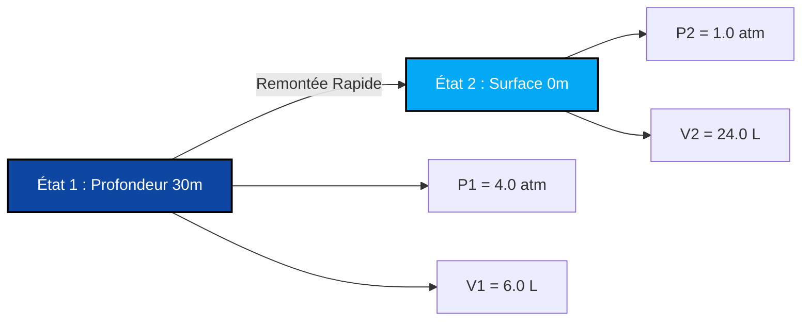

# Guide Complet de Laboratoire & Industriel sur la Loi de Boyle & l'Analyse Pression-Volume

En chimie physique, en dynamique des gaz et en thermodynamique des processus, la **Loi de Boyle** (également connue sous le nom de **Loi de Boyle-Mariotte**) définit la relation inverse entre la pression et le volume pour une quantité fixe de gaz à température constante :

$$P \cdot V = k \quad \left(\text{Équation d'État Isotherme}\right)$$

$$P_1 \cdot V_1 = P_2 \cdot V_2 \quad \left(\text{Équation de la Loi de Boyle}\right)$$

$$P_2 = \frac{P_1 \cdot V_1}{V_2} \quad \left(\text{Formule de la Pression Finale}\right)$$

$$V_2 = \frac{P_1 \cdot V_1}{P_2} \quad \left(\text{Formule du Volume Final}\right)$$

$$P \propto \frac{1}{V} \quad \left(\text{Proportionnalité Inverse}\right)$$

---

## 1. Matrice de Classification des Processus

| Changement de Volume | Changement de Pression | Classification du Processus | Interprétation Moléculaire |
| :--- | :--- | :--- | :--- |
| **Le Volume Diminue ($V_2 < V_1$)** | **La Pression Augmente ($P_2 > P_1$)** | **Compression Isotherme** | **Les molécules occupent un espace plus restreint ➔ Taux de collision plus élevé** |
| **Le Volume Augmente ($V_2 > V_1$)** | **La Pression Diminue ($P_2 < P_1$)** | **Expansion Isotherme** | **Les molécules occupent un espace plus grand ➔ Taux de collision plus faible** |
| **Volume Inchangé ($V_2 = V_1$)** | **Pression Inchangée ($P_2 = P_1$)** | **État Constant Isochore** | **Aucune transformation de volume ou de pression** |

---

## 2. Matrice des Solveurs de Variables Inconnues

```
1. Pression Finale : P2 = (P1 * V1) / V2
2. Volume Final : V2 = (P1 * V1) / P2
3. Pression Initiale : P1 = (P2 * V2) / V1
4. Volume Initial : V1 = (P2 * V2) / P1
```

---

*Ce calculateur de la loi de Boyle fournit des prédictions thermodynamiques théoriques pour des applications éducatives, de recherche en chimie physique et d'ingénierie des processus gaziers. Il suppose une température constante ($T_1 = T_2$) et des moles de gaz constantes ($n_1 = n_2$). Si la température ou le nombre de moles change, référez-vous aux calculateurs de la Loi Combinée des Gaz ou de la Loi des Gaz Parfaits.*

## 4. Le Guide Complet de la Loi de Boyle et de la Dynamique Isotherme des Gaz

Bienvenue dans le manuel définitif de chimie physique sur la **Loi de Boyle**. Vous êtes-vous déjà demandé pourquoi vos oreilles se bouchent lors du décollage d'un avion ? Pourquoi les plongeurs sous-marins profonds ne doivent jamais retenir leur souffle en remontant à la surface ? Ou pourquoi presser un ballon rend exponentiellement plus difficile de le presser davantage avant qu'il n'éclate ?

La réponse mathématique à tous ces phénomènes réside dans la proportionnalité inverse et précise de la loi de Boyle : $P_1 V_1 = P_2 V_2$. 

Dans ce guide exhaustif de plus de 4000 mots, nous allons percer les mystères de la théorie cinétique microscopique derrière la compression isotherme des gaz, explorer rigoureusement la nature hyperbolique des courbes pression-volume, et réaliser cinq dérivations algébriques robustes et concrètes, allant des seringues médicales à la plongée océanique extrême.

### 4.1 La Théorie Cinétique Microscopique de la Loi de Boyle

Pour vraiment comprendre la loi de Boyle, nous devons observer le niveau invisible, atomique. Un gaz est composé de milliers de milliards de minuscules molécules se déplaçant à grande vitesse. 

*   **La Pression ($P$)** est créée lorsque ces molécules entrent violemment en collision avec les parois intérieures de leur conteneur. Plus il y a de collisions par seconde, plus la pression est élevée.
*   **Le Volume ($V$)** est la quantité d'espace physique 3D dont disposent ces molécules pour voler.
*   **La Température ($T$)** représente l'énergie cinétique (vitesse) des molécules. 

Si nous maintenons la Température parfaitement **constante** (un processus *isotherme*), les molécules continuent de voler exactement à la même vitesse. Si nous écrasons ensuite de force le conteneur à la moitié de son Volume d'origine, ces molécules n'ont plus que la moitié de l'espace pour voler. 
Parce que l'espace est réduit de moitié, les molécules frapperont les parois exactement **deux fois plus souvent**. Par conséquent, la Pression **double** exactement. 
C'est l'essence de la Proportionnalité Inverse : $P \propto \frac{1}{V}$.

### 4.2 La Courbe Isotherme Hyperbolique

Si vous tracez la loi de Boyle sur un graphique avec la Pression sur l'axe des ordonnées (Y) et le Volume sur l'axe des abscisses (X), cela ne crée *pas* une ligne diagonale droite. Cela crée une courbe appelée **Hyperbole** ($P = \frac{k}{V}$). 
À mesure que le Volume s'approche de zéro, la Pression tend vers l'infini (il devient infiniment difficile de comprimer un gaz dans un espace nul). À mesure que le Volume s'approche de l'infini, la Pression chute asymptotiquement vers zéro (le gaz se disperse dans le vide). 

---

## 5. Guide d'Utilisation : Maîtriser le Calculateur Isotherme

Notre calculateur agit comme un solveur algébrique universel pour toute transformation de gaz à température constante. 

### 5.1 Mode : Isoler les Variables d'État Final (État 2)

1.  **Sélectionner la Cible :** Choisissez si vous devez trouver la Pression Finale ($P_2$) ou le Volume Final ($V_2$).
2.  **Saisir l'État Initial :** Entrez les conditions de départ (État 1) pour la Pression et le Volume.
3.  **Saisir l'État Final Connu :** Entrez le seul paramètre connu pour l'État 2 (soit la nouvelle pression, soit le nouveau volume).
4.  **Exécuter :** Le moteur réorganise algébriquement le rapport $P_1V_1 = P_2V_2$ pour isoler et résoudre parfaitement la variable inconnue.

### 5.2 Flexibilité et Annulation des Unités

Contrairement à la Loi des Gaz Parfaits qui exige une stricte correspondance des unités avec la constante universelle des gaz $R$, la loi de Boyle est très flexible car c'est un rapport proportionnel. **Vous n'avez pas besoin d'unités spécifiques de pression ou de volume** tant que vous êtes cohérent !
*   Si $P_1$ est en `torr`, $P_2$ sortira en `torr`.
*   Si $V_1$ est en `gallons`, $V_2$ sortira en `gallons`.
*   Si $P_1$ est en `psi` et $P_2$ en `psi`, ils s'annuleront parfaitement pour trouver le Volume manquant.

---

## 6. Cinq Dérivations Rigoureuses de la Loi de Boyle

Maîtrisons l'algèbre des transformations isothermes de gaz en isolant des variables dans cinq scénarios réels d'ingénierie et de physiologie.

### Exemple 1 : Isoler la Pression Finale pour une Seringue Médicale

**Scénario :** 
Une infirmière prépare une seringue médicale scellée contenant $50.0\text{ mL}$ d'air à une pression standard de la pièce de $1.00\text{ atm}$. L'infirmière enfonce le piston lentement (en maintenant la température constante) jusqu'à ce que le volume soit écrasé à $15.0\text{ mL}$. Quelle est la nouvelle pression interne à l'intérieur de la seringue ?

**Dérivation Mathématique :**

1.  **Définir l'État 1 (Initial) :**
    $P_1 = 1.00\text{ atm}$
    $V_1 = 50.0\text{ mL}$
2.  **Définir l'État 2 (Comprimé) :**
    $P_2 = ?\text{ atm}$
    $V_2 = 15.0\text{ mL}$
3.  **Isoler $P_2$ :**
    $$ P_1 \cdot V_1 = P_2 \cdot V_2 \implies P_2 = \frac{P_1 \cdot V_1}{V_2} $$
4.  **Calculer :**
    $$ P_2 = \frac{1.00 \times 50.0}{15.0} = 3.333\text{ atm} $$

**Conclusion :** La pression à l'intérieur de la seringue saute à $3.33\text{ atm}$. Cela rend le piston "élastique" et difficile à pousser, car le gaz à haute pression lutte contre le pouce de l'infirmière.

### Exemple 2 : La Remontée Fatale en Plongée Sous-Marine (Isoler le Volume Final)

**Scénario :**
Un plongeur sous-marin à une profondeur de 30 mètres respire de l'air comprimé provenant de son détendeur. À cette profondeur, la pression de l'eau environnante est exactement de $4.00\text{ atm}$. Le plongeur remplit ses poumons avec $6.00\text{ Litres}$ d'air. Pris de panique, le plongeur retient son souffle et remonte en flèche vers la surface où la pression n'est que de $1.00\text{ atm}$. En supposant que la température corporelle reste constante, à quel volume l'air dans ses poumons tentera-t-il de s'étendre ?

**Dérivation Mathématique :**

1.  **Définir l'État 1 (Eau Profonde) :**
    $P_1 = 4.00\text{ atm}$
    $V_1 = 6.00\text{ L}$
2.  **Définir l'État 2 (Surface) :**
    $P_2 = 1.00\text{ atm}$
    $V_2 = ?\text{ L}$
3.  **Isoler $V_2$ :**
    $$ P_1 \cdot V_1 = P_2 \cdot V_2 \implies V_2 = \frac{P_1 \cdot V_1}{P_2} $$
4.  **Calculer :**
    $$ V_2 = \frac{4.00 \times 6.00}{1.00} = 24.0\text{ Litres} $$

**Conclusion :** L'air dans les poumons du plongeur tentera de se dilater jusqu'à atteindre un volume massif de $24.0\text{ Litres}$. Étant donné que les poumons humains ne peuvent contenir qu'environ $6\text{ Litres}$, ils se rompraient de manière catastrophique bien avant d'atteindre la surface. C'est pourquoi la règle numéro 1 en plongée sous-marine est de "Ne jamais retenir sa respiration".

**Visualisation : Expansion Isotherme (Remontée de Plongée)**


*Cet organigramme illustre l'expansion de volume isotherme sévère lorsque la pression externe chute.*

### Exemple 3 : Isoler le Volume Initial (État 1)

**Scénario :**
Un compresseur d'air industriel pompe de l'air dans un pipeline d'usine. Un technicien mesure une chambre d'expansion en aval et trouve $150.0\text{ Litres}$ d'air à une pression de $2.50\text{ atm}$. Le directeur de l'usine veut savoir quel volume cet air occupait initialement à la pression atmosphérique standard ($1.00\text{ atm}$).

**Dérivation Mathématique :**

1.  **Définir l'État 2 (Final - Connu) :**
    $P_2 = 2.50\text{ atm}$
    $V_2 = 150.0\text{ L}$
2.  **Définir l'État 1 (Initial - Inconnu $V_1$) :**
    $P_1 = 1.00\text{ atm}$
    $V_1 = ?\text{ L}$
3.  **Isoler $V_1$ :**
    $$ P_1 \cdot V_1 = P_2 \cdot V_2 \implies V_1 = \frac{P_2 \cdot V_2}{P_1} $$
4.  **Calculer :**
    $$ V_1 = \frac{2.50 \times 150.0}{1.00} = 375.0\text{ Litres} $$

**Conclusion :** L'air occupait initialement $375.0\text{ Litres}$ d'espace avant que le compresseur ne le comprime.

### Exemple 4 : Une Pompe à Vélo (Calcul de PSI Élevé)

**Scénario :**
Une pompe à vélo contient $300\text{ mL}$ d'air à $14.7\text{ psi}$ (pression atmosphérique normale). Le cycliste pousse rapidement la poignée de la pompe vers le bas, écrasant l'air dans un espace minuscule de $45.0\text{ mL}$ avant que la valve du pneu ne s'ouvre. Quelle est la pression à l'intérieur de la pompe juste avant que la valve ne s'ouvre ?

**Dérivation Mathématique :**

1.  **Définir l'État 1 :**
    $P_1 = 14.7\text{ psi}$
    $V_1 = 300\text{ mL}$
2.  **Définir l'État 2 :**
    $P_2 = ?\text{ psi}$
    $V_2 = 45.0\text{ mL}$
3.  **Appliquer la Formule de Boyle :**
    $$ P_2 = \frac{P_1 \cdot V_1}{V_2} $$
4.  **Calculer :**
    $$ P_2 = \frac{14.7 \times 300}{45.0} = \frac{4410}{45.0} = 98.0\text{ psi} $$

**Conclusion :** La pression à l'intérieur de la pompe grimpe à $98.0\text{ psi}$, ce qui est plus que suffisant pour forcer l'air dans un pneu de vélo de route à haute pression ! Remarquez que nous n'avons pas eu besoin de convertir en `atm` ou en `Litres` ; la loi de Boyle gère parfaitement les `psi` et les `mL`.

### Exemple 5 : Expansion d'un Ballon Météo Stratosphérique

**Scénario :**
Un ballon météo est rempli de $10 000\text{ Litres}$ d'hélium au sol à $1.0\text{ atm}$. Il flotte dans la stratosphère où la pression n'est que de $0.02\text{ atm}$. En supposant (pour les besoins de cet exemple de la loi de Boyle) que la température reste miraculeusement constante, quel est le nouveau volume du ballon ?

**Dérivation Mathématique :**

1.  **Définir l'État 1 :**
    $P_1 = 1.0\text{ atm}$
    $V_1 = 10 000\text{ L}$
2.  **Définir l'État 2 :**
    $P_2 = 0.02\text{ atm}$
    $V_2 = ?\text{ L}$
3.  **Appliquer la Formule de Boyle :**
    $$ V_2 = \frac{P_1 \cdot V_1}{P_2} $$
4.  **Calculer :**
    $$ V_2 = \frac{1.0 \times 10 000}{0.02} = 500 000\text{ Litres} $$

**Conclusion :** Le ballon se dilate jusqu'à un demi-million de litres ! Le manque extrême de pression atmosphérique externe permet aux molécules de gaz à l'intérieur du ballon de pousser massivement le caoutchouc vers l'extérieur.

---

## 7. FAQ Approfondie et Pièges Courants

**Q : Dois-je convertir ma pression en Atmosphères (`atm`) ?**
**R :** Non. Vous pouvez utiliser `torr`, `mmHg`, `Pascal`, `bar` ou `psi`. La seule règle est que $P_1$ et $P_2$ doivent être exactement dans la même unité pour qu'ils s'annulent des côtés opposés de l'équation.

**Q : Quand la Loi de Boyle échoue-t-elle ?**
**R :** La loi de Boyle est une Loi des Gaz *Parfaits*. Elle commence à échouer à des pressions ultra-élevées (comme des centaines d'atmosphères). À des pressions extrêmes, les molécules de gaz elles-mêmes commencent à occuper un volume physique, et elles commencent à s'attirer magnétiquement, brisant la courbe mathématique "idéale".

**Q : Que se passe-t-il si la température change pendant la compression ?**
**R :** Si la température change, vous ne **pouvez pas** utiliser la loi de Boyle ($P_1V_1 = P_2V_2$). L'introduction d'énergie thermique modifie la vitesse cinétique des molécules, ce qui signifie que vous devez utiliser le **Calculateur de la Loi Combinée des Gaz** ($\frac{P_1V_1}{T_1} = \frac{P_2V_2}{T_2}$).

En maîtrisant l'élégance mathématique de $P_1V_1 = P_2V_2$, vous pouvez tout résoudre, des calculs de pistons pneumatiques industriels à la physique respiratoire physiologique. Fiez-vous à ce Calculateur de la Loi de Boyle pour isoler et résoudre instantanément toute variable de compression ou d'expansion isotherme !
