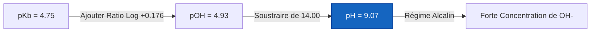

# Guide de Chimie Laboratoire et Analytique sur les Solutions Tampons & l'Analyse de Tampons

En chimie analytique, physique et biologique, les **solutions tampons** maintiennent des concentrations stables d'ions hydrogène ($\text{pH}$) lorsqu'elles sont soumises à l'ajout d'un acide ou d'une base, à une dilution ou à des changements environnementaux :

$$\text{pH} = \text{p}K_a + \log_{10}\left(\frac{[\text{A}^-]}{[\text{HA}]}\right) \quad \iff \quad \frac{[\text{A}^-]}{[\text{HA}]} = 10^{\text{pH} - \text{p}K_a}$$

$$\beta = 2.303 \cdot C_{\text{total}} \cdot \frac{K_a [\text{H}^+]}{(K_a + [\text{H}^+])^2} \quad \text{où } C_{\text{total}} = [\text{HA}] + [\text{A}^-]$$

---

## 1. Systèmes de Tampons Courants de Laboratoire & Matrice de Référence

| Système de Tampon | Acide / Base Faible | Forme Conjuguée | $\text{p}K_a$ ($25^\circ\text{C}$) | Plage de pH Utile | Applications Principales |
| :--- | :--- | :--- | :--- | :--- | :--- |
| **Citrate** | Acide Citrique ($\text{H}_3\text{Cit}$) | Dihydrogénocitrate ($\text{H}_2\text{Cit}^-$) | **$3.13$** | $2.13 - 4.13$ | Alimentaire, Dosages Pharmaceutiques |
| **Acétate** | Acide Acétique ($\text{CH}_3\text{COOH}$) | Acétate ($\text{CH}_3\text{COO}^-$) | **$4.76$** | $3.76 - 5.76$ | Dosages Enzymatiques, Biochimie |
| **Phosphate ($\text{p}K_{a2}$)** | Dihydrogénophosphate ($\text{H}_2\text{PO}_4^-$) | Hydrogénophosphate ($\text{HPO}_4^{2-}$) | **$7.20$** | $6.20 - 8.20$ | Tampons Biologiques (PBS), Culture Cellulaire |
| **Tris** | Tris(hydroxyméthyl)aminométhane | Tris-$\text{H}^+$ | **$8.07$** | $7.07 - 9.07$ | Biologie Moléculaire, Électrophorèse |
| **Carbonate** | Bicarbonate ($\text{HCO}_3^-$) | Carbonate ($\text{CO}_3^{2-}$) | **$10.33$** | $9.33 - 11.33$ | Diagnostics Cliniques |

---

## 2. Protocoles Standards de Calcul de Tampon

```
1. pH du Tampon : pH = pKa + log10([A-] / [HA])
2. pOH du Tampon Basique : pOH = pKb + log10([BH+] / [B]), pH = pKw - pOH
3. Capacité Tampon bêta : bêta = 2.303 * Ctotal * (Ka*[H+]) / (Ka + [H+])^2
4. Ajout d'Acide Fort : Moles A- restantes = Moles A- initiales - Moles H+ ajoutées
5. Ajout de Base Forte : Moles HA restantes = Moles HA initiales - Moles OH- ajoutées
```

---

## 3. Clause de Non-Responsabilité en matière d'Éducation & Sécurité de Laboratoire
*Ce calculateur de solution tampon fournit des calculs théoriques de tampons à des fins éducatives, de recherche en laboratoire et d'applications en chimie AP. Les solutions concentrées non idéales à forces ioniques élevées doivent tenir compte des coefficients d'activité en utilisant les équations de Debye-Hückel ou de Pitzer.*

## 4. Le Guide Complet sur les Solutions Tampons et la Résistance au pH

Bienvenue dans le guide définitif sur la compréhension, la conception et l'analyse des systèmes tampons chimiques. Alors que l'eau pure subira des variations de pH massives et violentes si ne serait-ce qu'une goutte d'acide y est ajoutée, une **solution tampon** est chimiquement conçue pour absorber ces chocs. Que vous soyez biologiste entretenant des cultures cellulaires, ingénieur chimiste adaptant une synthèse enzymatique, ou professionnel de la santé étudiant l'acidose du plasma sanguin, la maîtrise de la chimie des tampons est non négociable.

Un tampon accomplit cette "absorption des chocs de pH" en contenant simultanément deux composants chimiques opposés : un **acide faible** (prêt à neutraliser toute base entrante) et sa **base conjuguée** (prête à neutraliser tout acide entrant). Les mathématiques d'équilibre qui dictent ce bras de fer sont décrites par l'équation de Henderson-Hasselbalch et le concept de Capacité Tampon ($\beta$).

Dans ce guide technique exhaustif de plus de 4000 mots, nous allons décortiquer la thermodynamique de la création de tampons, disséquer comment les tampons sont conçus pour des valeurs de pH cibles spécifiques, établir les règles de dégradation de la capacité tampon lors de la dilution, et parcourir cinq exemples concrets et rigoureux complets avec leurs dérivations mathématiques et de stricts diagrammes visuels Mermaid.

### 4.1 Qu'est-ce que c'est exactement qu'une Solution Tampon ?

Un tampon n'est pas un fluide neutralisant magique ; c'est un équilibre chimique soigneusement calibré. Pour créer un tampon, vous devez combiner :
1.  **Un Acide Faible ($\text{HA}$) :** Il sert de réserve interne de protons ($\text{H}^+$). Si une base forte ($\text{OH}^-$) est ajoutée au système, l'acide faible donne son proton pour la neutraliser, devenant de l'eau et laissant derrière lui plus de base conjuguée.
2.  **Sa Base Conjuguée ($\text{A}^-$) :** Elle sert d'éponge interne à protons. Si un acide fort ($\text{H}^+$) est ajouté au système, la base conjuguée absorbe le proton, devenant plus d'acide faible.

L'équation centrale régissant cet équilibre est l'**Équation de Henderson-Hasselbalch** :
$$ \text{pH} = \text{p}K_a + \log_{10}\left(\frac{[\text{A}^-]}{[\text{HA}]}\right) $$

Cette équation dicte que le pH final de votre tampon dépend entièrement de deux choses : la force intrinsèque de l'acide ($\text{p}K_a$) et le ratio physique entre les molécules de base conjuguée et d'acide faible que vous avez placées dans le bécher.

### 4.2 Concevoir un Tampon : Choisir le bon pKa

Si vous devez concevoir un tampon pour maintenir un pH spécifique, vous ne pouvez pas simplement choisir n'importe quel acide dans le rayon. **Vous devez choisir un acide dont le $\text{p}K_a$ est aussi proche que possible de votre pH cible.**

Pourquoi ? Parce que la capacité tampon (la capacité de résister aux changements de pH) est maximisée lorsque la concentration de l'acide et de la base conjuguée sont exactement égales ($[\text{A}^-] = [\text{HA}]$). À ce point d'équilibre spécifique, le ratio $[\text{A}^-]/[\text{HA}]$ est exactement 1.0. Étant donné que le logarithme de 1 est 0, l'équation se réduit à :
$$ \text{pH} = \text{p}K_a $$

Par conséquent, si vous avez besoin d'un tampon pour maintenir à pH 4.76, vous devriez choisir l'Acide Acétique ($\text{p}K_a = 4.76$). Si vous avez besoin d'un tampon pour maintenir à pH 7.20, vous devriez choisir le système Phosphate ($\text{p}K_a = 7.20$).

### 4.3 Capacité Tampon ($\beta$) et La Règle de Un

La **Capacité Tampon ($\beta$)** mesure la quantité d'acide fort ou de base forte requise pour modifier le pH d'un litre de solution tampon d'exactement 1 unité.

$$ \beta = \frac{dC_b}{d(\text{pH})} = -\frac{dC_a}{d(\text{pH})} = 2.303 \times C_{\text{total}} \times \frac{K_a [\text{H}^+]}{(K_a + [\text{H}^+])^2} $$

Cette formule issue du calcul différentiel nous apprend deux faits critiques sur la conception des tampons :
1.  **La Concentration est Reine :** Un tampon à $1.0\text{ M}$ a une capacité de tamponnement dix fois supérieure à celle d'un tampon à $0.1\text{ M}$, même si leur pH est identique. Plus de molécules globales ($C_{\text{total}}$) signifie une plus grande capacité physique à neutraliser les menaces entrantes.
2.  **La Règle de Un :** Un tampon est considéré comme "cassé" ou inutile si son pH s'écarte de plus de **1.0 unité** de son $\text{p}K_a$. À $\text{pH} = \text{p}K_a \pm 1$, le ratio d'acide par rapport à la base est soit de $10:1$ soit de $1:10$. Le tampon est complètement déséquilibré et faillira rapidement s'il est attaqué du côté le plus faible.

### 4.4 Dilution et Épuisement du Tampon

Que se passe-t-il si vous diluez un tampon parfait de $0.5\text{ M}$ avec un volume égal d'eau pure ?
Les concentrations de l'acide $[\text{HA}]$ et de la base $[\text{A}^-]$ tombent toutes deux à $0.25\text{ M}$. Cependant, comme elles ont toutes deux chuté d'exactement la moitié, leur **ratio reste identique**. Par conséquent, **diluer un tampon ne change pas son pH**. 

Cependant, diluer un tampon réduit sa concentration totale ($C_{\text{total}}$) de moitié, ce qui réduit sa **Capacité Tampon ($\beta$) de moitié**. Il est maintenant deux fois plus vulnérable à la submersion. Lorsqu'un tampon est submergé, il atteint l'**Épuisement du Tampon**, ce qui signifie que tout le $[\text{HA}]$ ou tout le $[\text{A}^-]$ a été complètement consommé.

---

## 5. Guide d'Utilisation : Maîtriser le Calculateur de Tampon

Notre Calculateur de Tampon est conçu pour gérer à la fois l'analyse directe (Quel est le pH ?) et la conception inversée (Comment fabriquer un tampon à pH 7.4 ?).

### 5.1 Calcul Simple du pH d'un Tampon

1.  **Sélectionner le Mode :** Choisissez "pH du Tampon".
2.  **Saisir les Paramètres :** Entrez le $\text{p}K_a$ de votre acide, la concentration de la base conjuguée $[\text{A}^-]$ et la concentration de l'acide faible $[\text{HA}]$.
3.  **Lire la Sortie :** Le calculateur fournit le pH final du mélange, le ratio, et trace la position exacte sur la courbe de capacité.

### 5.2 Conception de Tampon de Laboratoire

1.  **Sélectionner le Mode :** Choisissez "Conception de Tampon".
2.  **Saisir les Paramètres :** Entrez votre pH cible, le $\text{p}K_a$ de votre acide, et votre Concentration Totale souhaitée ($C_{\text{total}}$).
3.  **Exécuter :** L'outil utilise des logarithmes inverses pour calculer la molarité exacte de $[\text{HA}]$ et $[\text{A}^-]$ requise. Il rédige essentiellement votre recette de laboratoire à votre place.

### 5.3 Simulation d'Ajout d'Acide / Base

1.  **Sélectionner le Mode :** Choisissez "Ajout d'Acide / Base Fort(e)".
2.  **Saisir l'État Initial :** Entrez les concentrations de départ de votre tampon.
3.  **Saisir l'Attaque :** Entrez les moles d'acide fort ($\text{HCl}$) ou de base forte ($\text{NaOH}$) ajoutées.
4.  **Exécuter :** Le calculateur effectue une soustraction stœchiométrique pour trouver les nouvelles concentrations, puis recalcule le nouveau pH, montrant exactement à quel point le tampon a varié.

---

## 6. Cinq Exemples Conceptuels Concrets

Les mathématiques abstraites deviennent de puissants outils lorsqu'elles sont appliquées à la chimie physique. Vous trouverez ci-dessous cinq exemples rigoureux couvrant la création de tampons, le tamponnement sanguin physiologique, et le calcul de la capacité neutralisante.

### Exemple 1 : Le Tampon Acétate Classique

**Scénario :** 
Un biochimiste prépare une solution tampon contenant $0.35\text{ M}$ d'Acide Acétique ($\text{CH}_3\text{COOH}$, $\text{p}K_a = 4.76$) et $0.15\text{ M}$ d'Acétate de Sodium ($\text{CH}_3\text{COONa}$). Quel est le pH de cette solution ?

**Dérivation Mathématique :**

1.  **Identifier les Composants :**
    Acide Faible $[\text{HA}] = 0.35\text{ M}$
    Base Conjuguée $[\text{A}^-] = 0.15\text{ M}$
    $\text{p}K_a$ de l'Acide $= 4.76$
2.  **Appliquer Henderson-Hasselbalch :**
    $$ \text{pH} = \text{p}K_a + \log_{10}\left(\frac{[\text{A}^-]}{[\text{HA}]}\right) $$
    $$ \text{pH} = 4.76 + \log_{10}\left(\frac{0.15}{0.35}\right) $$
    $$ \text{pH} = 4.76 + \log_{10}(0.428) $$
    $$ \text{pH} = 4.76 - 0.368 $$
    $$ \text{pH} = 4.392 \approx 4.39 $$

**Conclusion :** Le pH est de 4.39. Parce qu'il y a beaucoup plus d'acide faible ($0.35\text{ M}$) que de base conjuguée ($0.15\text{ M}$), le pH est tiré beaucoup plus bas que le $\text{p}K_a$ intrinsèque (4.76).

### Exemple 2 : Conception d'un Tampon Tris pour l'Électrophorèse de l'ADN

**Scénario :**
Un biologiste moléculaire doit concevoir un tampon Tris à exactement pH 8.30 pour l'électrophorèse sur gel. Le $\text{p}K_a$ du Tris-$\text{H}^+$ est de 8.07. S'il souhaite une concentration totale de tampon ($C_{\text{total}}$) de $0.100\text{ M}$, quelles concentrations de base Tris ($\text{A}^-$) et d'acide Tris-$\text{H}^+$ ($\text{HA}$) sont nécessaires ?

**Dérivation Mathématique :**

1.  **Calculer le Ratio Requis :**
    $$ \text{pH} - \text{p}K_a = \log_{10}\left(\frac{[\text{A}^-]}{[\text{HA}]}\right) $$
    $$ 8.30 - 8.07 = 0.23 $$
    $$ \text{Ratio} = 10^{0.23} = 1.698 $$
    Cela signifie que $[\text{A}^-] = 1.698 \times [\text{HA}]$
2.  **Appliquer la Contrainte de Concentration Totale :**
    $$ [\text{A}^-] + [\text{HA}] = 0.100\text{ M} $$
    $$ (1.698 \times [\text{HA}]) + [\text{HA}] = 0.100\text{ M} $$
    $$ 2.698 \times [\text{HA}] = 0.100\text{ M} $$
    $$ [\text{HA}] = 0.0371\text{ M} $$
3.  **Trouver la Base Conjuguée :**
    $$ [\text{A}^-] = 0.100 - 0.0371 = 0.0629\text{ M} $$

**Conclusion :** La recette requiert $0.037\text{ M}$ d'acide Tris et $0.063\text{ M}$ de base Tris.

### Exemple 3 : Le Tampon Basique à l'Ammoniac

**Scénario :**
Un étudiant fabrique un tampon basique en mélangeant $0.20\text{ M}$ d'Ammoniac ($\text{NH}_3$, base faible) et $0.30\text{ M}$ de Chlorure d'Ammonium ($\text{NH}_4\text{Cl}$, acide conjugué). Le $\text{p}K_b$ de l'ammoniac est de 4.75. Quel est le pH à $25^\circ\text{C}$ ?

**Dérivation Mathématique :**

1.  **Calculer le pOH en utilisant la forme basique de Henderson-Hasselbalch :**
    $$ \text{pOH} = \text{p}K_b + \log_{10}\left(\frac{[\text{Acide Conjugué}]}{[\text{Base Faible}]}\right) $$
    $$ \text{pOH} = 4.75 + \log_{10}\left(\frac{0.30}{0.20}\right) $$
    $$ \text{pOH} = 4.75 + \log_{10}(1.50) $$
    $$ \text{pOH} = 4.75 + 0.176 = 4.926 $$
2.  **Convertir le pOH en pH :**
    $$ \text{pH} = 14.00 - \text{pOH} $$
    $$ \text{pH} = 14.00 - 4.926 = 9.074 \approx 9.07 $$

**Visualisation : Dérivation de Tampon Basique**



*Ce logigramme visualise l'étape supplémentaire requise lors de la conception de tampons alcalins en utilisant le $\text{p}K_b$.*

### Exemple 4 : L'Attaque Acide (Simulation de Résistance de Tampon)

**Scénario :**
Prenons $1.0\text{ Litre}$ d'un tampon générique contenant $0.50\text{ M HA}$ ($\text{p}K_a = 6.00$) et $0.50\text{ M A}^-$. Le pH initial est exactement de 6.00. Nous injectons ensuite $0.15\text{ Moles}$ d'Acide Chlorhydrique pur ($\text{HCl}$). Quel est le nouveau pH, et de combien a-t-il changé ?

**Dérivation Mathématique :**

1.  **État Initial :**
    $[\text{HA}] = 0.50\text{ mol}$
    $[\text{A}^-] = 0.50\text{ mol}$
2.  **Neutralisation Stœchiométrique :**
    Les $0.15\text{ mol}$ de $\text{H}^+$ fort détruisent complètement $0.15\text{ mol}$ de la base conjuguée ($\text{A}^-$), la transformant en acide faible ($\text{HA}$).
    **Nouveau $[\text{A}^-]$ :** $0.50 - 0.15 = 0.35\text{ mol}$
    **Nouveau $[\text{HA}]$ :** $0.50 + 0.15 = 0.65\text{ mol}$
3.  **Calculer le Nouveau pH :**
    $$ \text{pH} = 6.00 + \log_{10}\left(\frac{0.35}{0.65}\right) $$
    $$ \text{pH} = 6.00 + \log_{10}(0.538) $$
    $$ \text{pH} = 6.00 - 0.269 = 5.73 $$

**Conclusion :** Malgré l'absorption de $0.15\text{ moles}$ d'acide fort pur, le pH n'a chuté que de **0.27 unités** (passant de 6.00 à 5.73). Si ce même acide avait été ajouté à de l'eau non tamponnée, le pH se serait effondré à 0.82.

**Visualisation : Installation de Laboratoire de Neutralisation**

```mermaid
gantt
    title Chronologie de Laboratoire : Test de Neutralisation de Tampon
    dateFormat  HH:mm:ss
    axisFormat  %H:%M
    section Préparation
    Mélanger 0.5M HA et 0.5M A- :active, 00:00:00, 00:10:00
    Enregistrer pH Initial 6.00 :milestone, 00:10:00, 00:10:00
    section Phase d'Attaque
    Injecter 0.15M HCl :crit, 00:10:00, 00:15:00
    Agiter et Équilibrer :active, 00:15:00, 00:20:00
    section Analyse
    Enregistrer pH Final 5.73 :milestone, 00:20:00, 00:20:00
```



*Ce diagramme de Gantt cartographie la séquence critique de préparation du tampon, l'enregistrement des données de base, et l'exécution de l'attaque acide stœchiométrique.*

### Exemple 5 : Épuisement du Tampon (Casser le Tampon)

**Scénario :**
Prenons exactement le même tampon de 1.0 L de l'Exemple 4 ($0.50\text{ M HA}$, $0.50\text{ M A}^-$, $\text{p}K_a = 6.00$). Cette fois, nous injectons de manière agressive $0.60\text{ Moles}$ de $\text{HCl}$ pur. Que se passe-t-il ?

**Dérivation Mathématique :**

1.  **État Initial :**
    $[\text{A}^-] = 0.50\text{ mol}$
2.  **Neutralisation Stœchiométrique :**
    Nous ajoutons $0.60\text{ mol}$ de $\text{H}^+$.
    Le $\text{H}^+$ commence à attaquer le $[\text{A}^-]$.
    Cependant, il n'y a que $0.50\text{ mol}$ de $[\text{A}^-]$ de disponible. 
    Le tampon est complètement détruit. Tout le $[\text{A}^-]$ devient $0\text{ M}$.
3.  **Excès d'Acide Fort :**
    $0.60\text{ mol ajoutées} - 0.50\text{ mol neutralisées} = 0.10\text{ mol}$ de $\text{H}^+$ brut non neutralisé restant dans la solution de 1.0 L.
4.  **Calculer le pH Final :**
    Le tampon est mort. Le pH est maintenant entièrement dicté par l'excès d'acide fort.
    $$ \text{pH} = -\log_{10}(0.10) = 1.00 $$

**Conclusion :** Le tampon a subi un épuisement catastrophique. En dépassant sa capacité, le pH s'est effondré violemment de 6.00 jusqu'à 1.00.

---

## 7. FAQ Approfondie et Dépannage Avancé

**Q : Puis-je fabriquer un tampon à partir d'Acide Chlorhydrique (HCl) ?**
**R :** Non. L'acide chlorhydrique est un acide fort ; il se dissocie à 100% dans l'eau. Un tampon nécessite un acide faible qui existe dans un état d'équilibre, capable de se déplacer d'avant en arrière pour absorber les impacts.

**Q : Pourquoi le pH de mon tampon change-t-il lorsque je modifie la température ?**
**R :** La valeur du $\text{p}K_a$ elle-même dépend fortement de la température car la dissociation de l'acide est régie par la thermodynamique ($\Delta G^\circ = -RT \ln K_a$). Par exemple, le tampon Tris a un coefficient de température très important et bien connu. Si vous ajustez le pH d'un tampon Tris à température ambiante et que vous le placez ensuite dans un réfrigérateur à $4^\circ\text{C}$, son pH augmentera de manière significative.

**Q : Que se passe-t-il si je fabrique un tampon où [A-] est 1000 fois plus grand que [HA] ?**
**R :** Vous avez créé une solution qui est complètement déséquilibrée. Bien que son pH puisse être calculé comme étant $\text{p}K_a + 3$, elle n'a absolument aucune capacité à neutraliser une base forte car il ne reste effectivement plus de $[\text{HA}]$ pour riposter. Elle se trouve en dehors de la plage efficace de $\text{p}K_a \pm 1$ et n'est pas un véritable tampon.

**Q : La Capacité Tampon ($\beta$) a-t-elle des unités ?**
**R :** Oui, elle est généralement exprimée en unités de Molarité par unité de pH ($\text{M}/\text{pH}$). Elle représente les moles d'acide fort ou de base forte nécessaires pour modifier le pH d'un litre de tampon d'exactement une unité de pH.

En comprenant profondément les mécanismes thermodynamiques derrière les solutions tampons, vous possédez le pouvoir théorique de concevoir des tampons chimiques impénétrables, de mettre à l'échelle des synthèses industrielles sans variations d'acide catastrophiques, et de calculer le moment exact de l'épuisement du tampon. Fiez-vous toujours à ce Calculateur de Tampon pour vérifier vos conceptions stœchiométriques et garantir une perfection analytique !
