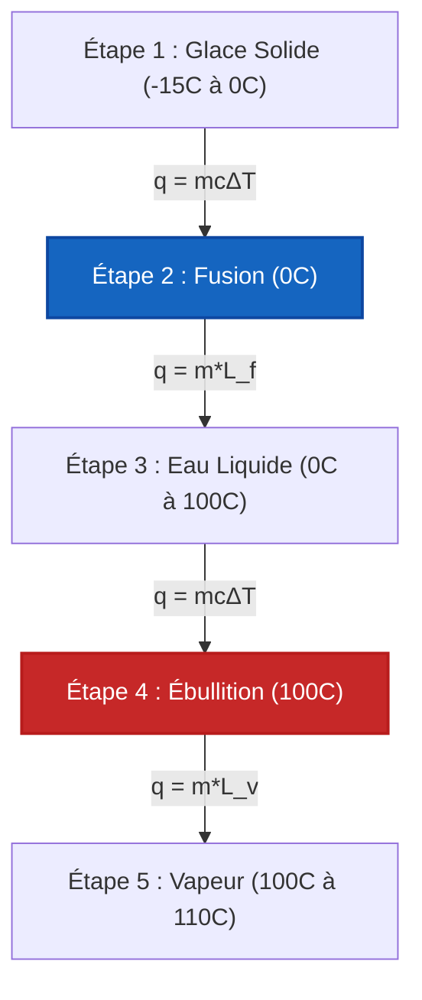

# Guide Complet de Laboratoire et Industriel pour la Calorimétrie et le Transfert de Chaleur

En chimie physique, thermodynamique et génie des procédés chimiques, la **Calorimétrie** mesure l'échange d'énergie thermique dans des systèmes fermés et isolés :

$$q = m \cdot c \cdot \Delta T \quad \left(\text{Transfert de Chaleur Sensible}\right)$$

$$q_{\text{phase}} = m \cdot L \quad \left(\text{Chaleur Latente de Changement de Phase}\right)$$

$$m_1 c_1 (T_{\text{eq}} - T_1) + m_2 c_2 (T_{\text{eq}} - T_2) + C_{\text{cal}} (T_{\text{eq}} - T_{\text{cal,init}}) = 0$$

$$T_{\text{eq}} = \frac{m_1 c_1 T_1 + m_2 c_2 T_2}{m_1 c_1 + m_2 c_2} \quad \left(\text{Température d'Équilibre Thermique}\right)$$

$$q_{\text{rxn}} = -\left(q_{\text{solution}} + q_{\text{calorimètre}}\right)$$

---

## 1. Comparaison des Équipements de Calorimétrie et des Modes d'Expérience

| Mode | Condition de Fonctionnement | Équation Principale | Valeur Mesurée |
| :--- | :--- | :--- | :--- |
| **Calorimètre à vase ouvert (tasse à café)** | **Pression Constante ($P = \text{const}$)** | $q_{\text{rxn}} = -(m c \Delta T + C_{\text{cal}} \Delta T)$ | **Variation d'Enthalpie ($\Delta H$)** |
| **Calorimètre à Bombe** | **Volume Constant ($V = \text{const}$)** | $q_v = -C_{\text{cal}} \Delta T$ | **Énergie Interne ($\Delta U$)** |
| **Équilibre Thermique** | **Système Isolé ($q_{\text{total}} = 0$)** | $T_{\text{eq}} = \frac{\sum m_i c_i T_i}{\sum m_i c_i}$ | **Temp. d'Équilibre ($T_{\text{eq}}$)** |
| **Changement de Phase** | **Température Constante ($T = \text{const}$)** | $q = m \cdot L_f$ ou $q = m \cdot L_v$ | **Chaleur Latente ($L$)** |

---

## 2. Matrice des Méthodes de Calcul en Thermochimie

```
1. Chaleur Sensible Transférée : q = m * c * (T_final - T_initial)
2. Équilibre Thermique : T_eq = (m1*c1*T1 + m2*c2*T2) / (m1*c1 + m2*c2)
3. Chaleur de Réaction (Vase ouvert) : q_rxn = -(q_sol + q_cal)
4. Chaleur de Calorimétrie à Bombe : q_v = ΔU = -C_cal * ΔT
5. Chaleur Latente de Fusion : q_fusion = m * L_f
6. Chaleur Latente de Vaporisation : q_ebullition = m * L_v
7. Courbe de Chauffage Multi-Étapes : q_total = q_solide + q_fusion + q_liquide + q_ebullition + q_gaz
```

---

*Ce calculateur de calorimétrie fournit des prédictions théoriques de transfert de chaleur pour des applications éducatives, de recherche en chimie physique et de génie des procédés. Les mesures calorimétriques réelles doivent tenir compte de la capacité thermique du calorimètre ($C_{\text{cal}}$), de la perte de chaleur vers l'environnement et du mélange non idéal de la solution.*

## 4. Le Guide Complet de la Calorimétrie et de l'Équilibre Thermique

Bienvenue dans le manuel définitif de chimie physique sur la **Calorimétrie et le Transfert de Chaleur**. En thermodynamique, l'énergie ne peut être ni créée ni détruite, seulement transférée. La calorimétrie est la science mathématique rigoureuse qui permet de suivre exactement où va cette énergie thermique.

Dans ce guide exhaustif de plus de 4000 mots, nous maîtriserons la physique de la capacité thermique massique, l'équilibre thermodynamique des systèmes isolés ($q_{\text{perdu}} + q_{\text{gagné}} = 0$), et la charge thermique cachée des changements de phase (Chaleur Latente). Nous couvrirons les systèmes à tasse à café à pression constante et les bombes en acier à volume constant. Enfin, nous résoudrons cinq scénarios rigoureux de transfert de chaleur du monde réel et visualiserons la dynamique thermique en utilisant des diagrammes Mermaid haute fidélité.

### 4.1 Chaleur Massique vs Capacité Thermique

*   **Chaleur Massique ($c$) :** L'énergie requise pour élever $1\text{ gramme}$ d'une substance de $1^\circ\text{C}$. C'est une propriété intensive (elle ne dépend que du matériau). Pour l'eau liquide, $c = 4,184\text{ J/g}^\circ\text{C}$.
*   **Capacité Thermique ($C$) :** L'énergie requise pour élever la température d'un *objet entier* (comme un récipient de calorimètre à bombe) de $1^\circ\text{C}$. C'est une propriété extensive. $C = m \cdot c$.

### 4.2 La Loi de l'Équilibre Thermique

Lorsque vous laissez tomber un bloc de cuivre chauffé au rouge dans un bécher d'eau froide, la chaleur circule du cuivre vers l'eau jusqu'à ce que les deux atteignent exactement la même température finale. C'est l'**Équilibre Thermique ($T_{\text{eq}}$)**.

En supposant que le bécher est parfaitement isolé (aucune chaleur ne s'échappe dans la pièce) :
$$q_{\text{perdu par le cuivre}} + q_{\text{gagné par l'eau}} = 0$$
$$m_{\text{cu}}c_{\text{cu}}(T_{\text{eq}} - T_{\text{cu,init}}) + m_{\text{w}}c_{\text{w}}(T_{\text{eq}} - T_{\text{w,init}}) = 0$$

*Note : Le terme $q_{\text{perdu}}$ sera naturellement évalué à un nombre négatif car $T_{\text{eq}} < T_{\text{init}}$, satisfaisant l'équilibre algébrique.*

### 4.3 Chaleur Sensible vs Chaleur Latente

*   **Chaleur Sensible ($q = mc\Delta T$) :** Transfert de chaleur qui provoque un changement de température mesurable. Vous pouvez la "sentir" avec un thermomètre.
*   **Chaleur Latente ($q = mL$) :** Transfert de chaleur qui provoque un changement de phase (comme la fonte de la glace ou l'ébullition de l'eau) à une *température constante*. Le thermomètre ne bouge pas ! L'énergie est entièrement consommée pour briser les liaisons intermoléculaires. 

---

## 5. Guide d'Utilisation : Maîtriser le Calculateur de Calorimétrie

Notre calculateur agit comme un solveur universel de transfert de chaleur pour la physique, la chimie et le génie mécanique.

### 5.1 Mode : Équilibre Thermique (Mélange Chaud + Froid)

1.  **Sélectionner le Mode :** Choisissez "Mélange à Équilibre Thermique".
2.  **Saisir l'Objet Chaud :** Entrez la masse, la chaleur massique et la température initiale de la substance chaude.
3.  **Saisir l'Objet Froid :** Entrez la masse, la chaleur massique et la température initiale de la substance froide.
4.  **Exécuter :** L'outil applique l'algèbre de conservation de l'énergie pour résoudre la température finale uniforme $T_{\text{eq}}$.

### 5.2 Mode : Courbe de Chauffage Multi-Étapes

1.  **Sélectionner le Mode :** Choisissez "Courbe de Chauffage Multi-Étapes".
2.  **Saisir l'État Initial :** Entrez la masse de la substance (ex. Glace à $-20^\circ\text{C}$).
3.  **Saisir l'État Cible :** Entrez l'état cible (ex. Vapeur à $150^\circ\text{C}$).
4.  **Exécuter :** Le moteur calcule les 5 étapes du transfert de chaleur : chauffage du solide, fonte du solide (Chaleur Latente de Fusion), chauffage du liquide, ébullition du liquide (Chaleur Latente de Vaporisation), et chauffage du gaz. 

---

## 6. Cinq Dérivations Rigoureuses de Transfert de Chaleur

Ancrons cette physique en résolvant cinq scénarios thermiques complexes.

### Exemple 1 : Chaleur Sensible Basique ($q = mc\Delta T$)

**Scénario :** 
Vous voulez chauffer $250\text{ g}$ d'eau liquide de $20,0^\circ\text{C}$ à $85,0^\circ\text{C}$ pour faire une tasse de thé. Quelle quantité d'énergie est requise ? ($c_{\text{eau}} = 4,184\text{ J/g}^\circ\text{C}$)

**Dérivation Mathématique :**

1.  **Déterminer le Changement de Température ($\Delta T$) :**
    $\Delta T = 85,0 - 20,0 = +65,0^\circ\text{C}$
2.  **Appliquer l'Équation de Chaleur :**
    $$ q = m \cdot c \cdot \Delta T $$
    $$ q = 250\text{ g} \times 4,184\text{ J/g}^\circ\text{C} \times 65,0^\circ\text{C} $$
3.  **Calculer :**
    $$ q = 67990\text{ Joules} = +67,99\text{ kJ} $$

**Conclusion :** Il faut exactement $67,99\text{ kJ}$ d'énergie pour chauffer l'eau de votre thé.

### Exemple 2 : Équilibre Thermique (Métal Chaud dans l'Eau)

**Scénario :**
Vous laissez tomber un bloc de $50,0\text{ g}$ de fer chaud ($c = 0,449\text{ J/g}^\circ\text{C}$) initialement à $120,0^\circ\text{C}$ dans $100,0\text{ g}$ d'eau ($c = 4,184\text{ J/g}^\circ\text{C}$) initialement à $20,0^\circ\text{C}$. En supposant un système isolé, trouvez la température finale d'équilibre thermique ($T_{\text{eq}}$).

**Dérivation Mathématique :**

1.  **Mettre en place la Conservation de l'Énergie :**
    $$ q_{\text{fer}} + q_{\text{eau}} = 0 $$
    $$ [m_{\text{Fe}} \cdot c_{\text{Fe}} \cdot (T_{\text{eq}} - T_{\text{Fe,init}})] + [m_{\text{W}} \cdot c_{\text{W}} \cdot (T_{\text{eq}} - T_{\text{W,init}})] = 0 $$
2.  **Substituer les Valeurs :**
    $$ [50,0 \times 0,449 \times (T_{\text{eq}} - 120,0)] + [100,0 \times 4,184 \times (T_{\text{eq}} - 20,0)] = 0 $$
    $$ 22,45(T_{\text{eq}} - 120,0) + 418,4(T_{\text{eq}} - 20,0) = 0 $$
3.  **Distribuer et Résoudre pour $T_{\text{eq}}$ :**
    $$ 22,45T_{\text{eq}} - 2694 + 418,4T_{\text{eq}} - 8368 = 0 $$
    $$ 440,85T_{\text{eq}} = 11062 $$
    $$ T_{\text{eq}} = \frac{11062}{440,85} = 25,09^\circ\text{C} $$

**Conclusion :** Le fer se refroidit considérablement, mais l'eau ne se réchauffe que de $5^\circ\text{C}$ en raison de la capacité thermique massique massive de l'eau. Les deux se stabilisent à $25,09^\circ\text{C}$.

### Exemple 3 : Changement de Phase (Chaleur Latente de Vaporisation)

**Scénario :**
Quelle quantité d'énergie est requise pour faire bouillir complètement $50,0\text{ g}$ d'eau qui est déjà à $100^\circ\text{C}$ ? La Chaleur Latente de Vaporisation de l'eau est $L_v = 2260\text{ J/g}$.

**Dérivation Mathématique :**

1.  **Identifier le Changement de Phase :**
    Puisque l'eau est déjà à son point d'ébullition, $\Delta T = 0$. Nous devons utiliser l'équation de la Chaleur Latente.
2.  **Appliquer l'Équation de Chaleur Latente :**
    $$ q = m \cdot L_v $$
    $$ q = 50,0\text{ g} \times 2260\text{ J/g} $$
3.  **Calculer :**
    $$ q = 113000\text{ Joules} = +113,0\text{ kJ} $$

**Conclusion :** Il faut un énorme $113,0\text{ kJ}$ juste pour briser les liaisons hydrogène et transformer $50\text{g}$ d'eau bouillante en vapeur.

### Exemple 4 : La Courbe de Chauffage en 5 Étapes (Glace à Vapeur)

**Scénario :**
Calculez la chaleur totale requise pour convertir $10,0\text{ g}$ de glace à $-15,0^\circ\text{C}$ en vapeur à $110,0^\circ\text{C}$. 
Constantes : $c_{\text{glace}} = 2,09\text{ J/g}^\circ\text{C}$, $L_f = 334\text{ J/g}$, $c_{\text{eau}} = 4,184\text{ J/g}^\circ\text{C}$, $L_v = 2260\text{ J/g}$, $c_{\text{vapeur}} = 2,01\text{ J/g}^\circ\text{C}$.

**Dérivation Mathématique :**

1.  **Étape 1 (Chauffer la Glace de -15 à 0) :**
    $q_1 = mc\Delta T = 10,0 \times 2,09 \times (0 - (-15)) = +313,5\text{ J}$
2.  **Étape 2 (Fondre la Glace à 0) :**
    $q_2 = mL_f = 10,0 \times 334 = +3340\text{ J}$
3.  **Étape 3 (Chauffer le Liquide de 0 à 100) :**
    $q_3 = mc\Delta T = 10,0 \times 4,184 \times 100 = +4184\text{ J}$
4.  **Étape 4 (Faire Bouillir l'Eau à 100) :**
    $q_4 = mL_v = 10,0 \times 2260 = +22600\text{ J}$
5.  **Étape 5 (Chauffer la Vapeur de 100 à 110) :**
    $q_5 = mc\Delta T = 10,0 \times 2,01 \times 10 = +201\text{ J}$
6.  **Chaleur Totale :**
    $q_{\text{total}} = 313,5 + 3340 + 4184 + 22600 + 201 = 30638,5\text{ J} = 30,6\text{ kJ}$

**Conclusion :** La charge thermique totale est de $30,6\text{ kJ}$, l'ébullition (Étape 4) exigeant la grande majorité de l'énergie.

**Visualisation : La Courbe de Chauffage en 5 Étapes**


*Cet organigramme met en évidence la nature alternée de la chaleur sensible (changement de température) et de la chaleur latente (changement de phase). Notez que la température ne change JAMAIS pendant l'Étape 2 et l'Étape 4.*

### Exemple 5 : Calorimétrie de Réaction à Vase Ouvert

**Scénario :**
Vous dissolvez $5,00\text{ g}$ de $\text{NH}_4\text{NO}_3$ (un produit chimique pour compresse froide) dans $50,0\text{ g}$ d'eau. La température chute de $25,0^\circ\text{C}$ à $18,5^\circ\text{C}$. En supposant $c_{\text{solution}} = 4,18\text{ J/g}^\circ\text{C}$, calculez la Chaleur de Réaction ($q_{\text{rxn}}$).

**Dérivation Mathématique :**

1.  **Masse Totale :**
    $m = 5,00 + 50,0 = 55,0\text{ g de solution}$
2.  **Calculer la Chaleur Absorbée/Perdue par la Solution ($q_{\text{sol}}$) :**
    $$ q_{\text{sol}} = m \cdot c \cdot \Delta T $$
    $$ q_{\text{sol}} = 55,0 \times 4,18 \times (18,5 - 25,0) $$
    $$ q_{\text{sol}} = 55,0 \times 4,18 \times (-6,5) = -1494\text{ J} $$
3.  **Déterminer la Chaleur de Réaction ($q_{\text{rxn}}$) :**
    L'eau a perdu de la chaleur ($q_{\text{sol}}$ est négatif) car la réaction chimique l'a absorbée pour briser les liaisons ioniques.
    $$ q_{\text{rxn}} = -q_{\text{sol}} = +1494\text{ J} $$

**Conclusion :** La dissolution est fortement endothermique, absorbant $1,49\text{ kJ}$ d'énergie thermique de l'eau.

---

## 7. FAQ Approfondie et Dépannage Avancé

**Q : Pourquoi la chaleur massique de l'eau est-elle si élevée ?**
**R :** La chaleur massique exceptionnellement élevée de l'eau ($4,184\text{ J/g}^\circ\text{C}$) est due à d'importantes liaisons hydrogène intermoléculaires. Vous devez fournir une énorme quantité d'énergie cinétique thermique juste pour faire vibrer les molécules d'eau assez rapidement pour surmonter ces liaisons. C'est pourquoi les océans régulent le climat mondial de la Terre !

**Q : Si un objet a une chaleur massique faible, se réchauffe-t-il plus vite ?**
**R :** Oui ! Les métaux comme le cuivre ($c = 0,385$) et le fer ($c = 0,449$) nécessitent très peu de chaleur pour changer de température. C'est exactement pourquoi nous utilisons des métaux pour les poêles à frire, et de l'eau pour les liquides de refroidissement de moteurs.

**Q : Puis-je utiliser ce calculateur si le calorimètre lui-même absorbe de la chaleur ?**
**R :** Oui ! En mode avancé, saisissez la Constante du Calorimètre ($C_{\text{cal}}$). L'équation de conservation de l'énergie s'étend à : $q_{\text{perdu}} + q_{\text{gagné(eau)}} + q_{\text{gagné(calorimètre)}} = 0$.

Maîtriser la calorimétrie vous permet de suivre chaque Joule d'énergie thermique circulant dans un système. Que vous équilibriez des échangeurs de chaleur industriels, déterminiez l'efficacité énergétique dans un calorimètre à bombe ou conceviez des poches de glace chimiques instantanées, fiez-vous à ce Calculateur de Calorimétrie pour une mécanique d'équilibre thermique sans faille !
