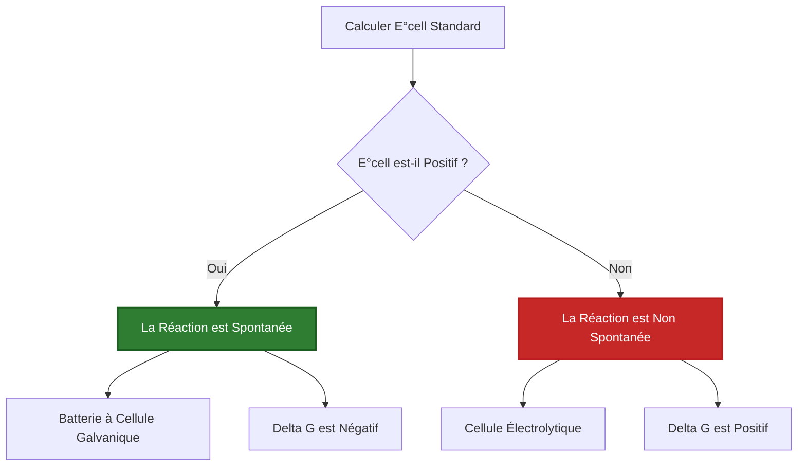

# Guide Analytique et de Laboratoire sur le Potentiel de Cellule & l'Analyse Électrochimique

En chimie physique et en électrochimie analytique, le **potentiel de cellule** ($E_{\text{cell}}$) mesure la force électromotrice (FEM) générée par une réaction redox :

$$E_{\text{cell}}^\circ = E_{\text{cathode}}^\circ - E_{\text{anode}}^\circ$$

$$E_{\text{cell}} = E_{\text{cell}}^\circ - \frac{R T}{n F} \ln Q \quad \left(\text{À } 25^\circ\text{C} \implies E_{\text{cell}} = E_{\text{cell}}^\circ - \frac{0,05916}{n} \log_{10} Q\right)$$

$$\Delta G = -n F E_{\text{cell}} \quad \text{et} \quad \Delta G^\circ = -n F E_{\text{cell}}^\circ = -R T \ln K \implies K = \exp\left(\frac{n F E_{\text{cell}}^\circ}{R T}\right)$$

---

## 1. Tableau de Référence des Potentiels de Réduction Standards ($E^\circ$)

| Demi-Réaction | $E^\circ$ ($25^\circ\text{C}$) | Tendance | Rôle dans une Cellule Galvanique |
| :--- | :--- | :--- | :--- |
| $\text{F}_2(g) + 2e^- \rightleftharpoons 2\text{F}^-$ | **$+2,87 \text{ V}$** | **Agent Oxydant le plus fort** | Cathode (Réduction) |
| $\text{Ag}^+ + e^- \rightleftharpoons \text{Ag}(s)$ | **$+0,80 \text{ V}$** | **Réduction Forte** | Cathode |
| $\text{Cu}^{2+} + 2e^- \rightleftharpoons \text{Cu}(s)$ | **$+0,34 \text{ V}$** | **Réduction Modérée** | Cathode / Anode vs Ag |
| $2\text{H}^+ + 2e^- \rightleftharpoons \text{H}_2(g)$ | **$0,00 \text{ V}$** | **Standard de Référence (ESH)** | Référence |
| $\text{Fe}^{2+} + 2e^- \rightleftharpoons \text{Fe}(s)$ | **$-0,44 \text{ V}$** | **Oxydation Modérée** | Anode |
| $\text{Zn}^{2+} + 2e^- \rightleftharpoons \text{Zn}(s)$ | **$-0,76 \text{ V}$** | **Oxydation Forte** | Anode |
| $\text{Li}^+ + e^- \rightleftharpoons \text{Li}(s)$ | **$-3,04 \text{ V}$** | **Agent Réducteur le plus fort** | Anode (Oxydation) |

---

## 2. Protocoles de Calcul du Potentiel de Cellule Standard

```
1. Potentiel de Cellule Standard : E0_cell = E0_cathode - E0_anode
2. Potentiel Non Standard : E_cell = E0_cell - (R * T / (n * F)) * ln(Q)
3. Énergie Libre de Gibbs : deltaG = -n * F * E_cell (kJ/mol)
4. Constante d'Équilibre K : log10(K) = (n * E0_cell) / 0.05916
5. Vérification de la Spontanéité : E_cell > 0 V => Cellule Galvanique Spontanée
```

---

## 3. Avertissement de Sécurité Éducatif et de Laboratoire
*Ce calculateur de potentiel de cellule fournit des calculs thermodynamiques théoriques pour les applications éducatives, la recherche en laboratoire et la chimie AP. Les systèmes de batteries industriels réels doivent tenir compte des coefficients d'activité, des potentiels de jonction liquide et des surtensions d'activation.*

## 4. Le Guide Définitif sur le Potentiel de Cellule et la FEM

Bienvenue dans le guide de laboratoire le plus exhaustif et scientifiquement rigoureux sur le **Potentiel de Cellule ($E_{\text{cell}}$)**. Des micro-tensions stabilisant les membranes cellulaires biologiques aux réseaux de mégawatts alimentant les véhicules électriques modernes, la physique de la Force Électromotrice (FEM) est universelle.

Dans ce manuel complet de plus de 4000 mots, nous définirons rigoureusement les Potentiels de Réduction Standards ($E^\circ$), prouverons mathématiquement pourquoi les tensions ne sont **jamais multipliées par les coefficients stœchiométriques**, dériverons l'Équation de Nernst pour les batteries en décharge, et relierons directement la tension physique à l'Énergie Libre de Gibbs thermodynamique ($\Delta G$). De plus, nous passerons en revue cinq exemples mathématiques hyper-détaillés, en utilisant des diagrammes Mermaid haute fidélité pour cartographier la logique des potentiels de réduction.

### 4.1 Qu'est-ce que le Potentiel de Cellule ($E_{\text{cell}}$) ?

Le Potentiel de Cellule, souvent appelé Force Électromotrice (FEM), est la mesure physique de la "traction" ou de la "force motrice" sur les électrons lors de leur déplacement à travers un circuit. C'est la manifestation littérale de la spontanéité thermodynamique.

*   Si $E_{\text{cell}}$ est **Positif ($> 0\text{ V}$)** : La réaction est très spontanée. Les électrons sont violemment attirés vers la cathode, générant une puissance utilisable (Cellule Galvanique / Batterie).
*   Si $E_{\text{cell}}$ est **Négatif ($< 0\text{ V}$)** : La réaction est non spontanée. Vous devez brancher le système sur le secteur et forcer une tension externe à l'envers contre les produits chimiques pour que la réaction se produise (Cellule Électrolytique / Galvanoplastie).
*   Si $E_{\text{cell}}$ est **Exactement $0\text{ V}$** : La batterie est morte. Le système a atteint un équilibre thermodynamique parfait et aucun flux net d'électrons ne se produit.

### 4.2 La Nature Intensive de la Tension (NE PAS MULTIPLIER !)

L'une des erreurs les plus catastrophiques commises par les étudiants en chimie est de traiter la tension comme la masse ou l'énergie.

Si vous brûlez $2\text{ moles}$ de bois, vous obtenez deux fois plus de chaleur ($\Delta H$) qu'en brûlant $1\text{ mole}$. La chaleur est une **propriété extensive** ; elle évolue avec la taille.
La tension est une **propriété intensive**, tout comme la Température ou la Densité. La tension d'une réaction chimique est une mesure de l'*énergie par électron unique*.

Par conséquent, lors de l'équilibrage des demi-réactions redox :
*   $\text{Cu}^{2+} + 2e^- \to \text{Cu} \quad (E^\circ = +0,34\text{ V})$
*   Si vous multipliez la réaction par 3 pour équilibrer les électrons : $3\text{Cu}^{2+} + 6e^- \to 3\text{Cu}$
*   **LA TENSION RESTE EXACTEMENT DE $+0,34\text{ V}$.** Ne la multipliez pas par 3 ! L'énergie par électron n'a pas changé, vous avez simplement plus d'électrons circulant à cette même tension exacte.

### 4.3 Conditions Standards vs. Non Standards

*   **Potentiel de Cellule Standard ($E^\circ_{\text{cell}}$) :** La tension mesurée dans des conditions de laboratoire parfaites : $25^\circ\text{C}$ (298,15 K), toutes les solutions aqueuses à une concentration d'exactement $1,0\text{ M}$, et tous les gaz à une pression partielle d'exactement $1,0\text{ atm}$.
*   **Potentiel Non Standard ($E_{\text{cell}}$) :** La tension dans le monde réel. À mesure qu'une batterie se décharge, les réactifs sont consommés (les concentrations chutent en dessous de $1,0\text{ M}$) et des produits se forment. Cela force la tension en temps réel à décroître lentement et logarithmiquement selon l'Équation de Nernst, atteignant finalement $0\text{ V}$.

---

## 5. Guide d'Utilisation : Maîtriser le Calculateur de Potentiel de Cellule

Notre calculateur agit comme un solveur thermodynamique universel pour la FEM.

### 5.1 Mode : Calcul du Potentiel Standard ($E^\circ_{\text{cell}}$)

1.  **Sélectionnez le Mode :** Choisissez "Potentiel de Cellule Standard E°cell".
2.  **Paramètres d'Entrée :** Sélectionnez vos deux demi-réactions dans le tableau des potentiels de réduction standards (ou entrez des valeurs personnalisées). 
3.  **Exécutez :** L'outil identifie automatiquement l'agent oxydant le plus fort comme la Cathode, applique $E^\circ_{\text{cell}} = E^\circ_{\text{cathode}} - E^\circ_{\text{anode}}$ et affiche la tension standard exacte.

### 5.2 Mode : Conversion en Énergie Libre de Gibbs ($\Delta G$)

1.  **Sélectionnez le Mode :** Choisissez "Énergie Libre de Gibbs & K".
2.  **Paramètres d'Entrée :** Entrez le Potentiel de Cellule calculé ($E$) et le nombre d'électrons transférés dans la réaction équilibrée ($n$).
3.  **Exécutez :** L'outil utilise la constante de Faraday ($F = 96485\text{ C/mol}$) pour multiplier la tension, produisant le travail physique absolu ($\Delta G$ en $\text{kJ/mol}$) que la batterie peut effectuer.

### 5.3 Mode : Tension Non Standard de Nernst

1.  **Sélectionnez le Mode :** Choisissez "Potentiel de Cellule Non Standard (Nernst)".
2.  **Paramètres d'Entrée :** Entrez le Potentiel Standard, la valeur $n$ équilibrée, la température de fonctionnement et les molarités spécifiques des Réactifs et Produits.
3.  **Exécutez :** L'outil calcule le Quotient de Réaction ($Q$), applique la décroissance logarithmique de Nernst et affiche la véritable tension de fonctionnement en temps réel de la batterie en dégradation.

---

## 6. Cinq Exemples Concrets de Chimie Analytique

Ancrons cette théorie en résolvant cinq scénarios de potentiel pratiques et rigoureux.

### Exemple 1 : Calcul de la Tension Standard d'une Cellule Aluminium-Cuivre

**Scénario :** 
Vous construisez une cellule en utilisant une anode en Aluminium et une cathode en Cuivre dans des conditions standards ($1,0\text{ M}$, $25^\circ\text{C}$).
Potentiels de Réduction Standards :
*   $\text{Cu}^{2+} + 2e^- \rightleftharpoons \text{Cu} \quad (E^\circ = +0,34\text{ V})$
*   $\text{Al}^{3+} + 3e^- \rightleftharpoons \text{Al} \quad (E^\circ = -1,66\text{ V})$

Calculez le potentiel de cellule standard ($E^\circ_{\text{cell}}$).

**Dérivation Mathématique :**

1.  **Identifier la Cathode et l'Anode :**
    L'espèce avec le potentiel de réduction le plus positif est la Cathode (elle veut désespérément être réduite).
    Cathode = Cuivre ($+0,34\text{ V}$)
    Anode = Aluminium ($-1,66\text{ V}$)
2.  **Appliquer l'Équation Standard :**
    $$ E_{\text{cell}}^\circ = E_{\text{cathode}}^\circ - E_{\text{anode}}^\circ $$
3.  **Calculer :**
    $$ E_{\text{cell}}^\circ = 0,34 - (-1,66) $$
    $$ E_{\text{cell}}^\circ = +2,00\text{ V} $$

**Conclusion :** La cellule produit exactement $2,00\text{ Volts}$. Remarquez que nous avons complètement ignoré le fait que l'Aluminium transfère 3 électrons et le Cuivre transfère 2. Nous ne multiplions PAS les tensions. La tension est intensive.

### Exemple 2 : Détermination du Travail Thermodynamique Total (Énergie Libre de Gibbs)

**Scénario :**
En utilisant la cellule Aluminium-Cuivre de $+2,00\text{ V}$ de l'Exemple 1, calculez l'Énergie Libre de Gibbs totale ($\Delta G^\circ$) libérée par mole de réaction.

**Dérivation Mathématique :**

1.  **Équilibrer les Électrons pour trouver $n$ :**
    L'Al s'oxyde : $\text{Al} \to \text{Al}^{3+} + 3e^-$ (Multiplier par 2 $\implies$ $6e^-$)
    Le Cu se réduit : $\text{Cu}^{2+} + 2e^- \to \text{Cu}$ (Multiplier par 3 $\implies$ $6e^-$)
    Total des électrons transférés : $n = 6$
2.  **Identifier les Inconnues :**
    $E^\circ = +2,00\text{ V}$
    $F = 96485\text{ C/mol}$
3.  **Appliquer l'Équation de Gibbs :**
    $$ \Delta G^\circ = -nFE^\circ $$
4.  **Calculer :**
    $$ \Delta G^\circ = -(6)(96485)(2,00) $$
    $$ \Delta G^\circ = -1157820\text{ J/mol} $$
    $$ \Delta G^\circ = -1157,8\text{ kJ/mol} $$

**Conclusion :** C'est une réaction violemment spontanée, capable d'effectuer plus de $1,1\text{ MégaJoule}$ de travail physique par mole d'Aluminium consommée.

### Exemple 3 : Suivi de la Décroissance de la Tension via Nernst

**Scénario :**
Vous laissez tourner une batterie Argent-Zinc pendant des heures. 
Réaction Standard : $\text{Zn} + 2\text{Ag}^+ \to \text{Zn}^{2+} + 2\text{Ag}$
$E^\circ_{\text{cell}} = +1,56\text{ V}$, $n = 2$.
La batterie est presque morte. Le réactif $[\text{Ag}^+]$ chute à $0,01\text{ M}$, et le produit $[\text{Zn}^{2+}]$ monte à $1,99\text{ M}$. Calculez la tension en temps réel à $25^\circ\text{C}$.

**Dérivation Mathématique :**

1.  **Calculer le Quotient de Réaction ($Q$) :**
    $$ Q = \frac{[\text{Produits}]}{[\text{Réactifs}]} = \frac{[\text{Zn}^{2+}]}{[\text{Ag}^+]^2} $$
    *Remarquez que la concentration en Ag+ est au carré parce que son coefficient stœchiométrique dans la réaction équilibrée est 2.*
    $$ Q = \frac{1,99}{(0,01)^2} = \frac{1,99}{0,0001} = 19900 $$
2.  **Appliquer l'Équation de Nernst :**
    $$ E = E^\circ - \frac{0,05916}{n} \log_{10}(Q) $$
3.  **Calculer :**
    $$ E = 1,56 - \frac{0,05916}{2} \log_{10}(19900) $$
    $$ E = 1,56 - (0,02958 \times 4,298) $$
    $$ E = 1,56 - 0,127 = +1,433\text{ V} $$

**Conclusion :** Bien que le réactif soit sévèrement épuisé, la nature logarithmique de l'équation de Nernst signifie que la tension n'a chuté que de $1,56\text{ V}$ à $1,43\text{ V}$.

**Visualisation : Carte Logique de la Spontanéité**


*Cet organigramme cartographie le couplage thermodynamique rigide entre la positivité du Potentiel de Cellule et la spontanéité physique.*

### Exemple 4 : Calcul de la Constante d'Équilibre ($K$) à partir d'une Batterie Morte

**Scénario :**
Une cellule Cuivre-Argent ($E^\circ = +0,46\text{ V}$, $n = 2$) est laissée fonctionner jusqu'à ce qu'elle soit complètement morte, c'est-à-dire $E_{\text{cell}} = 0\text{ V}$. Quel est le ratio maximum absolu de Produits par rapport aux Réactifs ($K$) lorsque cela se produit à $25^\circ\text{C}$ ?

**Dérivation Mathématique :**

1.  **Identifier les Inconnues :**
    $E^\circ = +0,46\text{ V}$
    $n = 2$
2.  **Appliquer la Dérivation d'Équilibre de Nernst :**
    Lorsque $E = 0$, $Q$ devient $K$.
    $$ 0 = E^\circ - \frac{0,05916}{n} \log_{10}(K) $$
    $$ \log_{10}(K) = \frac{n \times E^\circ}{0,05916} $$
3.  **Calculer :**
    $$ \log_{10}(K) = \frac{2 \times 0,46}{0,05916} = 15,55 $$
    $$ K = 10^{15,55} = 3,55 \times 10^{15} $$

**Conclusion :** La réaction avancera implacablement jusqu'à ce qu'il y ait $3,55 \times 10^{15}$ ions produits en plus que d'ions réactifs avant d'atteindre finalement l'équilibre thermodynamique et que la batterie ne meure.

### Exemple 5 : Électrolyse de l'Eau (Potentiel Négatif)

**Scénario :**
Vous voulez séparer l'eau liquide en Hydrogène et Oxygène gazeux pour le carburant de fusée. 
Oxydation de l'Eau : $2\text{H}_2\text{O} \to \text{O}_2 + 4\text{H}^+ + 4e^- \quad (E^\circ_{\text{anode}} = +1,23\text{ V})$
Réduction de l'Eau : $2\text{H}_2\text{O} + 2e^- \to \text{H}_2 + 2\text{OH}^- \quad (E^\circ_{\text{cathode}} = -0,83\text{ V})$

Calculez la tension standard théorique requise.

**Dérivation Mathématique :**

1.  **Appliquer l'Équation Standard :**
    $$ E_{\text{cell}}^\circ = E_{\text{cathode}}^\circ - E_{\text{anode}}^\circ $$
2.  **Calculer :**
    $$ E_{\text{cell}}^\circ = -0,83 - (+1,23) $$
    $$ E_{\text{cell}}^\circ = -2,06\text{ V} $$

**Conclusion :** Le potentiel de la cellule est négatif, $-2,06\text{ V}$. Cela confirme que l'eau ne se séparera jamais spontanément d'elle-même. Vous devez connecter une alimentation électrique et la bombarder avec *au moins* $+2,06\text{ V}$ pour forcer la réaction à l'envers.

**Visualisation : Chronologie de Décroissance de la Tension**

```mermaid
gantt
    title Décroissance de la Tension de Batterie et Décalage de Nernst
    dateFormat  HH:mm:ss
    axisFormat  %H:%M
    section État Standard
    Potentiel Standard (1.0 M) :00:00:00, 00:30:00
    section État Non Standard
    Décroissance Logarithmique Lente :active, 00:30:00, 04:00:00
    section Fin de Vie
    Chute Rapide de Tension :crit, 04:00:00, 04:30:00
    Équilibre (0V Morte) :04:30:00, 05:00:00
```


*Cette chronologie illustre la dégradation non linéaire de la tension de batterie telle que régie par le Quotient de Réaction ($Q$) logarithmique.*

---

## 7. FAQ Approfondie et Dépannage Avancé

**Q : Pouvez-vous avoir un potentiel de réduction standard négatif à la Cathode ?**
**R :** Oui ! La cathode doit juste être *plus positive* (ou moins négative) que l'anode. Par exemple, si la Cathode est de $-0,2\text{ V}$ et l'Anode de $-0,9\text{ V}$, le potentiel de cellule résultant est de $-0,2 - (-0,9) = +0,7\text{ V}$ (Spontané).

**Q : Pourquoi ne multiplie-t-on pas la Tension ($E^\circ$) par les coefficients molaires lors de l'équilibrage des équations ?**
**R :** La tension est l'énergie *par électron* ($\text{Joules} / \text{Coulomb}$). Si vous doublez l'équation chimique, vous doublez le nombre d'électrons circulant, et vous doublez le total des Joules de travail ($\Delta G$). Mais le rapport ($\text{Joules} / \text{Coulombs}$) reste complètement identique. C'est une propriété intensive.

**Q : Qu'est-ce que l'Électrode Standard à Hydrogène (ESH) ?**
**R :** Vous ne pouvez pas mesurer la tension d'une seule demi-réaction ; vous ne pouvez mesurer que la *différence* entre deux demi-réactions. Les chimistes ont arbitrairement attribué à la réduction de $\text{H}^+$ en $\text{H}_2$ gazeux une tension d'exactement $0,000\text{ V}$. Chaque autre tension du tableau est mesurée par rapport à cette ligne de base.

En maîtrisant le calcul des Potentiels Standards, en naviguant dans les pièges logarithmiques de l'Équation de Nernst et en comprenant la nature physique intensive de la tension, vous pouvez concevoir des systèmes d'alimentation électrochimique parfaits. Comptez sur ce Calculateur de Potentiel de Cellule pour une précision FEM instantanée et thermodynamiquement parfaite !
