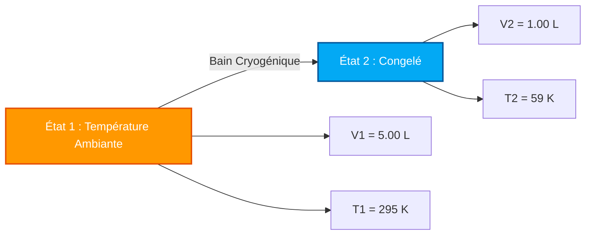

# Guide Complet de Laboratoire et Industriel sur la Loi de Charles et l'Analyse Volume-Température

En chimie physique, dynamique des gaz et thermodynamique des processus, la **Loi de Charles** définit la proportionnalité directe entre le volume et la température absolue pour une quantité fixe de gaz à pression constante :

$$\frac{V}{T} = k \quad \left(\text{Équation d'État Isobare}\right)$$

$$\frac{V_1}{T_1} = \frac{V_2}{T_2} \quad \left(\text{Équation de la Loi de Charles}\right)$$

$$V_2 = \frac{V_1 \cdot T_2}{T_1} \quad \left(\text{Formule du Volume Final}\right)$$

$$T_2 = \frac{V_2 \cdot T_1}{V_1} \quad \left(\text{Formule de la Température Finale en Kelvin}\right)$$

$$V \propto T \quad \left(\text{Proportionnalité Directe en Kelvin}\right)$$

---

## 1. Matrice de Classification des Processus

| Changement de Température | Changement de Volume | Classification du Processus | Interprétation Moléculaire |
| :--- | :--- | :--- | :--- |
| **Augmentation de Temp. ($T_2 > T_1$)** | **Augmentation de Volume ($V_2 > V_1$)** | **Expansion Thermique** | **Les molécules se déplacent plus vite ➔ Poussent la limite du conteneur vers l'extérieur** |
| **Diminution de Temp. ($T_2 < T_1$)** | **Diminution de Volume ($V_2 < V_1$)** | **Contraction Thermique** | **Les molécules se déplacent plus lentement ➔ Le conteneur se contracte vers l'intérieur** |
| **Temp. Inchangée ($T_2 = T_1$)** | **Volume Inchangé ($V_2 = V_1$)** | **État Constant Isobare** | **Aucun volume ni transformation thermique** |

---

## 2. Matrice des Solveurs de Variables Inconnues

```
1. Volume Final : V2 = (V1 * T2) / T1
2. Température Finale : T2 = (V2 * T1) / V1
3. Volume Initial : V1 = (V2 * T1) / T2
4. Température Initiale : T1 = (V1 * T2) / V2
```

---

*Ce calculateur de la loi de Charles fournit des prédictions thermodynamiques théoriques pour des applications éducatives, de recherche en chimie physique et d'ingénierie des processus gazeux. Il suppose une pression constante ($P_1 = P_2$) et des moles de gaz constantes ($n_1 = n_2$). Si la pression ou le nombre de moles changent, reportez-vous aux calculateurs de la Loi Combinée des Gaz ou de la Loi des Gaz Parfaits.*

## 4. Le Guide Complet de la Loi de Charles et de l'Expansion Thermique Isobare

Bienvenue dans le manuel de chimie physique définitif sur la **Loi de Charles**. Pourquoi une montgolfière flotte-t-elle majestueusement vers le haut lorsque le brûleur est allumé ? Pourquoi un ballon de football laissé dehors dans la neige glaciale de l'hiver devient-il plat et dégonflé ? Pourquoi les bombes aérosols sont-elles accompagnées d'avertissements stricts de ne jamais les laisser en plein soleil ?

Les réponses à ces mystères thermodynamiques résident dans l'élégante proportionnalité directe découverte par le scientifique français Jacques Charles en 1787 : $\frac{V_1}{T_1} = \frac{V_2}{T_2}$.

Dans ce guide exhaustif de plus de 4000 mots, nous démêlerons la théorie cinétique moléculaire derrière l'expansion des gaz isobares (à pression constante), explorerons rigoureusement la nécessité mathématique de l'Échelle Absolue Kelvin, et exécuterons cinq dérivations algébriques très détaillées — des montgolfières à la congélation cryogénique.

### 4.1 La Théorie Cinétique Microscopique de la Loi de Charles

Pour vraiment comprendre l'expansion thermique, nous devons voir le gaz au niveau atomique. Un gaz parfait est composé de milliards de molécules microscopiques qui tourbillonnent dans leur contenant. 

*   **La Température ($T$)** est une mesure directe de l'énergie cinétique moyenne (vitesse) de ces molécules. Chauffer le gaz fait voler les molécules plus vite.
*   **Le Volume ($V$)** est l'espace physique en 3D que le gaz occupe.
*   **La Pression ($P$)** est la force exercée par les molécules qui entrent en collision avec les parois du conteneur. 

Si nous maintenons la Pression parfaitement **constante** (un processus *isobare*), cela signifie que nous voulons que les collisions contre les parois restent exactement les mêmes. Cependant, si nous chauffons le gaz, les molécules commencent à voler beaucoup plus vite et à frapper les parois plus fort. Pour empêcher la pression de grimper en flèche, le conteneur *doit* s'agrandir. Le volume physique supplémentaire donne aux molécules rapides plus de distance à parcourir, équilibrant ainsi le taux de collision.
Par conséquent, si vous doublez la température absolue, le volume double exactement. C'est l'essence de la Proportionnalité Directe : $V \propto T$.

### 4.2 Le Mandat du Zéro Absolu (Pourquoi le Kelvin est Requis)

L'erreur la plus courante et la plus dévastatrice dans les calculs de la loi de Charles est d'essayer d'utiliser les degrés Celsius ou Fahrenheit. **Vous devez utiliser exclusivement l'échelle Kelvin ($K$).**

Pourquoi ? L'équation $\frac{V_1}{T_1} = \frac{V_2}{T_2}$ est un rapport. Pour qu'un rapport fonctionne mathématiquement, l'échelle doit avoir un véritable point zéro où la propriété mesurée cesse d'exister. $0^\circ\text{C}$ est simplement le point de congélation de l'eau — cela ne signifie pas "zéro énergie thermique." 
Si vous utilisiez des degrés Celsius, le calcul du changement de volume lorsque le gaz franchit $0^\circ\text{C}$ entraînerait une erreur de division par zéro, brisant entièrement les mathématiques. De plus, des températures Celsius négatives produiraient des *volumes négatifs* physiquement impossibles.
Le **Zéro Absolu ($0\text{ K}$)** est l'état théorique où tout mouvement cinétique atomique s'arrête entièrement. Par conséquent, la proportionnalité du volume et de la température ne fonctionne que sur cette échelle absolue. 
**Formule de Conversion :** $T_{\text{K}} = T_{^\circ\text{C}} + 273.15$

---

## 5. Guide d'Utilisation : Maîtriser le Calculateur Isobare

Notre calculateur agit comme un solveur algébrique universel pour toute transformation thermique de gaz à pression constante. 

### 5.1 Mode : Isoler les Variables de l'État Final (État 2)

1.  **Sélectionner la Cible :** Choisissez si vous devez isoler le Volume Final ($V_2$) ou la Température Finale ($T_2$).
2.  **Saisir l'État Initial :** Entrez les conditions de départ (État 1) pour le Volume et la Température. (Notre calculateur gère automatiquement la conversion en Kelvin si vous entrez des degrés Celsius).
3.  **Saisir l'État Final Connu :** Entrez le paramètre unique connu pour l'État 2 (soit le nouveau volume, soit la nouvelle température).
4.  **Exécuter :** Le moteur réarrange algébriquement le rapport $\frac{V_1}{T_1} = \frac{V_2}{T_2}$ pour isoler parfaitement et résoudre la variable inconnue.

### 5.2 Flexibilité des Unités

Puisque la loi de Charles est un rapport proportionnel, **les unités de Volume sont entièrement flexibles**.
*   Si $V_1$ est en `Litres`, $V_2$ sera calculé en `Litres`.
*   Si $V_1$ est en `Mètres Cubes` ou en `Gallons`, les mathématiques restent parfaites.
*   **Exception :** La Température doit *toujours* être convertie en Kelvin avant de multiplier ou de diviser.

---

## 6. Cinq Dérivations Rigoureuses de la Loi de Charles

Maîtrisons l'algèbre des transformations isobares des gaz en isolant les variables à travers cinq scénarios environnementaux et d'ingénierie réels.

### Exemple 1 : Isolation du Volume Final (Montgolfière)

**Scénario :** 
Une montgolfière contient $2\,500\text{ m}^3$ d'air au sol par une température matinale fraîche de $15.0^\circ\text{C}$. Le pilote allume le brûleur au propane, chauffant l'air à l'intérieur de l'enveloppe à $120.0^\circ\text{C}$. La pression à l'intérieur du ballon correspond parfaitement à la pression atmosphérique extérieure (Isobare). Quel est le nouveau volume de l'air ?

**Dérivation Mathématique :**

1.  **Définir l'État 1 (Matin) :**
    $V_1 = 2\,500\text{ m}^3$
    $T_1 = 15.0 + 273.15 = 288.15\text{ K}$
2.  **Définir l'État 2 (Chauffé) :**
    $V_2 = ?\text{ m}^3$
    $T_2 = 120.0 + 273.15 = 393.15\text{ K}$
3.  **Isoler $V_2$ :**
    $$ \frac{V_1}{T_1} = \frac{V_2}{T_2} \implies V_2 = \frac{V_1 \cdot T_2}{T_1} $$
4.  **Calculer :**
    $$ V_2 = \frac{2500 \times 393.15}{288.15} = \frac{982875}{288.15} = 3410.98\text{ m}^3 $$

**Conclusion :** L'air s'est dilaté de $2\,500\text{ m}^3$ à plus de $3\,410\text{ m}^3$. Étant donné que l'enveloppe physique du ballon ne peut pas contenir autant d'air, l'excès d'air chaud se déverse par l'ouverture inférieure. Cela signifie que le ballon contient maintenant *moins de masse* pour le même volume, abaissant sa densité globale et fournissant la portance nécessaire pour le vol !

### Exemple 2 : Isolation de la Température Finale (Congélation Cryogénique)

**Scénario :**
Un chercheur emprisonne exactement $5.00\text{ Litres}$ d'azote gazeux dans un cylindre à piston sans friction à température ambiante ($22.0^\circ\text{C}$). Le cylindre est immergé dans un bain cryogénique jusqu'à ce que le piston glisse vers le bas et que le volume soit écrasé à exactement $1.00\text{ Litre}$ à pression constante. Quelle est la température du bain cryogénique ?

**Dérivation Mathématique :**

1.  **Définir l'État 1 (Température Ambiante) :**
    $V_1 = 5.00\text{ L}$
    $T_1 = 22.0 + 273.15 = 295.15\text{ K}$
2.  **Définir l'État 2 (Cryogénique) :**
    $V_2 = 1.00\text{ L}$
    $T_2 = ?\text{ K}$
3.  **Isoler $T_2$ :**
    $$ \frac{V_1}{T_1} = \frac{V_2}{T_2} \implies T_2 = \frac{V_2 \cdot T_1}{V_1} $$
4.  **Calculer :**
    $$ T_2 = \frac{1.00 \times 295.15}{5.00} = 59.03\text{ K} $$
5.  **Reconvertir en Celsius :**
    $T_{^\circ\text{C}} = 59.03 - 273.15 = -214.12^\circ\text{C}$

**Conclusion :** Le volume du gaz s'est contracté massivement parce que la température du bain était à un niveau glacial de $-214.12^\circ\text{C}$. Cela démontre parfaitement la contraction thermique.

**Visualisation : Contraction Thermique Isobare**



### Exemple 3 : Résoudre pour le Volume Initial (État 1)

**Scénario :**
Un récipient en plastique flexible a été laissé dans une voiture chaude pendant l'été ($60.0^\circ\text{C}$). Un adolescent retourne à la voiture et trouve que le récipient s'est gonflé jusqu'à atteindre un volume de $3.50\text{ Litres}$. Quel était le volume normal d'origine de ce récipient lorsqu'il était à l'intérieur de la maison climatisée et fraîche ($20.0^\circ\text{C}$) ?

**Dérivation Mathématique :**

1.  **Définir l'État 2 (Final - Connu) :**
    $V_2 = 3.50\text{ L}$
    $T_2 = 60.0 + 273.15 = 333.15\text{ K}$
2.  **Définir l'État 1 (Initial - $V_1$ Inconnu) :**
    $V_1 = ?\text{ L}$
    $T_1 = 20.0 + 273.15 = 293.15\text{ K}$
3.  **Isoler $V_1$ :**
    $$ \frac{V_1}{T_1} = \frac{V_2}{T_2} \implies V_1 = \frac{V_2 \cdot T_1}{T_2} $$
4.  **Calculer :**
    $$ V_1 = \frac{3.50 \times 293.15}{333.15} = \frac{1026.025}{333.15} = 3.08\text{ Litres} $$

**Conclusion :** Le récipient contenait initialement $3.08\text{ Litres}$ d'air. La chaleur intense du soleil a augmenté l'énergie cinétique du gaz, augmentant son volume à $3.50\text{ Litres}$ et gonflant les parois en plastique.

### Exemple 4 : Résoudre pour la Température Initiale (État 1)

**Scénario :**
Un ballon météo expansible est calibré à exactement $100\text{ Litres}$ à une température spécifique de laboratoire en intérieur. Il est ensuite emmené à l'extérieur dans un blizzard où la température est de $-15^\circ\text{C}$. Le ballon rétrécit à $85.0\text{ Litres}$. Quelle était la température de calibrage exacte à l'intérieur du laboratoire ?

**Dérivation Mathématique :**

1.  **Définir l'État 2 (Blizzard) :**
    $V_2 = 85.0\text{ L}$
    $T_2 = -15 + 273.15 = 258.15\text{ K}$
2.  **Définir l'État 1 (Laboratoire) :**
    $V_1 = 100\text{ L}$
    $T_1 = ?\text{ K}$
3.  **Isoler $T_1$ :**
    $$ \frac{V_1}{T_1} = \frac{V_2}{T_2} \implies T_1 = \frac{V_1 \cdot T_2}{V_2} $$
4.  **Calculer :**
    $$ T_1 = \frac{100 \times 258.15}{85.0} = 303.7\text{ K} $$
5.  **Convertir en Celsius :**
    $T_{^\circ\text{C}} = 303.7 - 273.15 = 30.5^\circ\text{C}$

**Conclusion :** Le ballon a été calibré dans un laboratoire très chaud maintenu à exactement $30.5^\circ\text{C}$.

### Exemple 5 : Extrapolation au Zéro Absolu

**Scénario :**
Un échantillon de gaz parfait occupe $1.0\text{ Litre}$ à $273.15\text{ K}$ ($0^\circ\text{C}$). Si nous refroidissons le gaz à $136.575\text{ K}$ (exactement la moitié de l'énergie thermique), quel est son nouveau volume ? Si nous le refroidissons jusqu'au Zéro Absolu ($0\text{ K}$), que se passe-t-il ?

**Dérivation Mathématique (Refroidissement à 136.575 K) :**
1.  **Définir les variables :** $V_1 = 1.0\text{ L}$, $T_1 = 273.15\text{ K}$, $T_2 = 136.575\text{ K}$
2.  **Calculer :**
    $$ V_2 = \frac{1.0 \times 136.575}{273.15} = 0.5\text{ Litres} $$
    *(Réduire de moitié les Kelvin réduit parfaitement de moitié le volume).*

**Extrapolation Théorique au Zéro Absolu (0 K) :**
1.  **Calculer :**
    $$ V_2 = \frac{1.0 \times 0}{273.15} = 0\text{ Litres} $$
    
**Conclusion :** Au Zéro Absolu, la loi de Charles prédit que le gaz n'occupera exactement **Aucun Volume**. En réalité, les gaz réels se liquéfieront et se solidifieront bien avant d'atteindre $0\text{ K}$, ce qui signifie que la loi de Charles est un modèle mathématique *idéalisé* qui régit précisément l'état gazeux mais s'effondre lors des transitions de phase.

---

## 7. FAQ Approfondie et Pièges Courants

**Q : Pourquoi un bocal en verre ne se dilate-t-il pas lorsque je chauffe l'air à l'intérieur ?**
**R :** La loi de Charles exige que la pression soit *constante* (Isobare). Un bocal en verre scellé est complètement rigide, ce qui signifie que son volume est forcé d'être constant. Lorsque vous le chauffez, le volume ne peut pas s'étendre, de sorte que la pression interne monte en flèche à la place. Ce scénario nécessite la **Loi de Gay-Lussac** ($\frac{P_1}{T_1} = \frac{P_2}{T_2}$), pas la loi de Charles.

**Q : Quel est le rapport avec la densité ?**
**R :** Puisque la densité est la Masse divisée par le Volume, et que chauffer un gaz augmente son volume sans changer sa masse, **chauffer un gaz diminue sa densité**. C'est la physique fondamentale qui explique pourquoi l'air chaud s'élève et pourquoi les courants de convection météorologiques existent.

**Q : Puis-je utiliser les degrés Fahrenheit si je m'y tiens simplement ?**
**R :** Non. Fahrenheit est une échelle relative tout comme Celsius. Vous devez convertir Fahrenheit en Rankine, ou convertir Fahrenheit en Celsius puis en Kelvin. 

En maîtrisant la proportionnalité mathématique de $\frac{V_1}{T_1} = \frac{V_2}{T_2}$, vous pouvez résoudre des problèmes d'expansion thermique allant de la physique atmosphérique au stockage cryogénique industriel. Fiez-vous à ce Calculateur de la Loi de Charles pour isoler et résoudre instantanément toute variable thermique isobare !
