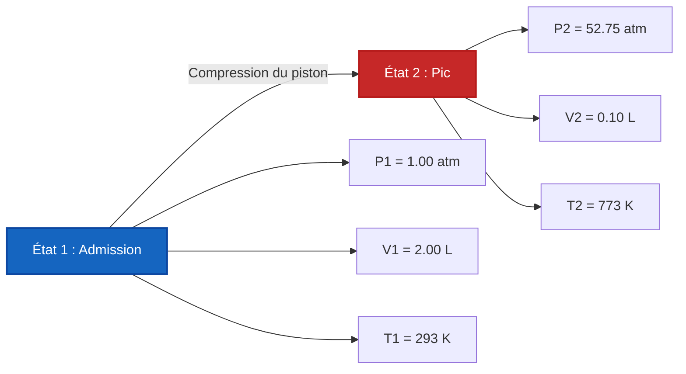

# Guide complet de laboratoire et industriel de la loi des gaz combinée et de l'analyse à deux états

En chimie physique, en dynamique des gaz et en ingénierie des processus chimiques, la **loi des gaz combinée** décrit l'interrelation entre la pression, le volume et la température absolue à travers deux états d'équilibre d'une quantité fixe de gaz ($n_1 = n_2$) :

$$\frac{P_1 \cdot V_1}{T_1} = \frac{P_2 \cdot V_2}{T_2} \quad \left(\text{Équation de la loi des gaz combinée}\right)$$

$$P_2 = \frac{P_1 \cdot V_1 \cdot T_2}{T_1 \cdot V_2} \quad \left(\text{Formule de la pression finale}\right)$$

$$V_2 = \frac{P_1 \cdot V_1 \cdot T_2}{T_1 \cdot P_2} \quad \left(\text{Formule du volume final}\right)$$

$$T_2 = \frac{P_2 \cdot V_2 \cdot T_1}{P_1 \cdot V_1} \quad \left(\text{Formule de la température finale en Kelvin}\right)$$

$$\Delta P\% = \frac{P_2 - P_1}{P_1} \times 100\%, \quad \Delta V\% = \frac{V_2 - V_1}{V_1} \times 100\% \quad \left(\text{Pourcentages de variation}\right)$$

---

## 1. Réduction aux lois empiriques des gaz

| Paramètre fixe | Réduction mathématique | Nom de la loi des gaz | Classification du processus |
| :--- | :--- | :--- | :--- |
| **Température constante ($T_1 = T_2$)** | **$P_1 \cdot V_1 = P_2 \cdot V_2$** | **Loi de Boyle** | **Processus isotherme** |
| **Pression constante ($P_1 = P_2$)** | **$\frac{V_1}{T_1} = \frac{V_2}{T_2}$** | **Loi de Charles** | **Processus isobare** |
| **Volume constant ($V_1 = V_2$)** | **$\frac{P_1}{T_1} = \frac{P_2}{T_2}$** | **Loi de Gay-Lussac** | **Processus isochore** |

---

## 2. Matrice des solveurs de variables à deux états

```
1. Pression finale : P2 = (P1 * V1 * T2) / (T1 * V2)
2. Volume final : V2 = (P1 * V1 * T2) / (T1 * P2)
3. Température finale : T2 = (P2 * V2 * T1) / (P1 * V1)
4. Pression initiale : P1 = (P2 * V2 * T1) / (T2 * V1)
5. Volume initial : V1 = (P2 * V2 * T1) / (T2 * P1)
6. Température initiale : T1 = (P1 * V1 * T2) / (P2 * V2)
```

---

*Ce calculateur de la loi des gaz combinée fournit des prédictions thermodynamiques théoriques pour les applications éducatives, de recherche en chimie physique et d'ingénierie des processus gazeux. Il suppose une quantité fixe de gaz ($n_1 = n_2$). Pour les systèmes où des molécules de gaz sont ajoutées ou retirées, utilisez le calculateur de la loi des gaz parfaits ($P V = n R T$).*

## 4. Le guide complet de la loi des gaz combinée et des transformations de gaz à deux états

Bienvenue dans le manuel de chimie physique définitif sur la **loi des gaz combinée**. Comment les scientifiques prédisent-ils le volume exact d'un ballon-sonde alors qu'il grimpe à travers la stratosphère glaciale et à basse pression ? Comment les ingénieurs en mécanique calculent-ils la chaleur intense générée à l'intérieur d'un cylindre de moteur diesel pendant la course de compression ? 

Les réponses à ces changements complexes à variables multiples résident dans le ratio parfait de la loi des gaz combinée : $\frac{P_1 V_1}{T_1} = \frac{P_2 V_2}{T_2}$. 

Dans ce guide exhaustif de plus de 4000 mots, nous allons percer les symétries thermodynamiques des lois de Boyle, de Charles et de Gay-Lussac, définir rigoureusement la nécessité absolue de l'échelle de température Kelvin et exécuter cinq dérivations algébriques robustes du monde réel.

### 4.1 L'unification des lois empiriques des gaz

Avant que la loi des gaz parfaits ($PV=nRT$) ne soit formalisée, les premiers chimistes expérimentaux ont découvert trois proportionnalités distinctes qui régissaient le comportement des gaz. La loi des gaz combinée unifie mathématiquement les trois :

1.  **Loi de Boyle (Isotherme) :** Découverte par Robert Boyle en 1662. Si la température est maintenue parfaitement constante ($T_1 = T_2$), la pression et le volume sont **inversement proportionnels** ($P_1 V_1 = P_2 V_2$). Si vous écrasez un gaz à la moitié de son volume, la pression double.
2.  **Loi de Charles (Isobare) :** Découverte par Jacques Charles en 1787. Si la pression est maintenue constante ($P_1 = P_2$), le volume et la température absolue sont **directement proportionnels** ($\frac{V_1}{T_1} = \frac{V_2}{T_2}$). Si vous chauffez un ballon, il se dilate.
3.  **Loi de Gay-Lussac (Isochore) :** Découverte par Joseph Louis Gay-Lussac en 1808. Si le volume est maintenu strictement constant ($V_1 = V_2$), la pression et la température absolue sont **directement proportionnelles** ($\frac{P_1}{T_1} = \frac{P_2}{T_2}$). Si vous chauffez un réservoir en acier rigide, la pression monte en flèche.

### 4.2 L'exigence cruciale du Kelvin absolu ($K$)

L'échec le plus catastrophique dans les calculs de la loi des gaz est l'utilisation des degrés Celsius ($^\circ\text{C}$) ou Fahrenheit ($^\circ\text{F}$). **Vous devez strictement utiliser le Kelvin ($K$).**

Pourquoi ? Parce que la loi des gaz combinée repose sur des rapports géométriques. Si vous essayez d'utiliser des Celsius, franchir le point de congélation de $0^\circ\text{C}$ entraînerait une division par zéro, brisant mathématiquement l'équation. Pire encore, des températures Celsius négatives calculeraient des volumes et des pressions *négatifs* physiquement impossibles. 
L'échelle Kelvin corrige cela en plaçant $0\text{ K}$ au **Zéro absolu**, le véritable état théorique où tout mouvement cinétique atomique cesse entièrement.
**Formule de conversion :** $T_{\text{K}} = T_{^\circ\text{C}} + 273.15$

---

## 5. Guide d'utilisation : Maîtriser le calculateur à deux états

Notre calculateur agit comme un solveur algébrique universel pour toute transformation de gaz en système fermé. 

### 5.1 Mode : Isolation des variables d'état final (État 2)

1.  **Sélectionner la cible :** Choisissez si vous devez trouver la pression finale ($P_2$), le volume final ($V_2$) ou la température finale ($T_2$).
2.  **Saisir l'état initial :** Entrez les conditions de départ (État 1) pour la pression, le volume et la température.
3.  **Saisir l'état final connu :** Entrez les deux paramètres connus pour l'État 2. 
4.  **Exécuter :** Le moteur réorganise algébriquement le rapport pour isoler et résoudre parfaitement la variable inconnue.

### 5.2 Flexibilité et annulation des unités

Contrairement à la loi des gaz parfaits qui nécessite une correspondance stricte des unités avec la constante des gaz $R$, la loi des gaz combinée est très flexible. Parce que c'est un rapport, **vous n'avez pas besoin d'unités de pression ou de volume spécifiques** tant que vous êtes cohérent !
*   Si $P_1$ est en `torr`, $P_2$ sera calculé en `torr`.
*   Si $V_1$ est en `gallons`, $V_2$ sera calculé en `gallons`.
*   **Exception :** La température doit *toujours* être en Kelvin.

---

## 6. Cinq dérivations rigoureuses de la loi des gaz combinée

Maîtrisons l'algèbre des transformations de gaz à deux états en isolant les variables à travers cinq scénarios réels d'ingénierie et d'environnement.

### Exemple 1 : Isolation du volume final pour un ballon-sonde

**Scénario :** 
Un ballon-sonde à haute altitude est rempli de $250.0\text{ Litres}$ d'hélium au niveau du sol où la pression est de $1.00\text{ atm}$ et la température est de $25.0^\circ\text{C}$. Le ballon est relâché et s'élève dans la stratosphère, où la pression ambiante chute à $0.150\text{ atm}$ et la température plonge à $-50.0^\circ\text{C}$. Quel est le nouveau volume du ballon ?

**Dérivation mathématique :**

1.  **Définir l'État 1 (Niveau du sol) :**
    $P_1 = 1.00\text{ atm}$
    $V_1 = 250.0\text{ L}$
    $T_1 = 25.0 + 273.15 = 298.15\text{ K}$
2.  **Définir l'État 2 (Stratosphère) :**
    $P_2 = 0.150\text{ atm}$
    $V_2 = ?\text{ L}$
    $T_2 = -50.0 + 273.15 = 223.15\text{ K}$
3.  **Isoler $V_2$ :**
    $$ \frac{P_1 \cdot V_1}{T_1} = \frac{P_2 \cdot V_2}{T_2} \implies V_2 = \frac{P_1 \cdot V_1 \cdot T_2}{T_1 \cdot P_2} $$
4.  **Calculer :**
    $$ V_2 = \frac{1.00 \times 250.0 \times 223.15}{298.15 \times 0.150} $$
    $$ V_2 = \frac{55787.5}{44.7225} = 1247.4\text{ Litres} $$

**Conclusion :** Malgré la chute massive de la température (qui ferait normalement rétrécir le ballon), la chute extrême de la pression domine l'équation. Le ballon se dilate jusqu'à près de $1250\text{ Litres}$.

### Exemple 2 : Compression de moteur diesel (Isolation de la pression finale)

**Scénario :**
À l'intérieur d'un moteur diesel lourd, un cylindre aspire $2.00\text{ Litres}$ d'air à $1.00\text{ atm}$ et $20.0^\circ\text{C}$. Le piston compresse violemment l'air dans un minuscule volume mort de $0.100\text{ Litres}$. Le frottement et la compression rapide font grimper la température à $500.0^\circ\text{C}$. Quelle est la pression maximale juste avant l'injection de carburant ?

**Dérivation mathématique :**

1.  **Définir l'État 1 (Admission) :**
    $P_1 = 1.00\text{ atm}$
    $V_1 = 2.00\text{ L}$
    $T_1 = 20.0 + 273.15 = 293.15\text{ K}$
2.  **Définir l'État 2 (Compression) :**
    $P_2 = ?\text{ atm}$
    $V_2 = 0.100\text{ L}$
    $T_2 = 500.0 + 273.15 = 773.15\text{ K}$
3.  **Isoler $P_2$ :**
    $$ P_2 = \frac{P_1 \cdot V_1 \cdot T_2}{T_1 \cdot V_2} $$
4.  **Calculer :**
    $$ P_2 = \frac{1.00 \times 2.00 \times 773.15}{293.15 \times 0.100} $$
    $$ P_2 = \frac{1546.3}{29.315} = 52.75\text{ atm} $$

**Conclusion :** La course de compression multiplie la pression à plus de $52\text{ atm}$. Cette pression extrême et cette chaleur enflamment instantanément le carburant diesel injecté !

**Visualisation : Compression de cylindre à deux états**



### Exemple 3 : Bouteille de plongée sous-marine (Isolation de la température finale)

**Scénario :**
Une bouteille de plongée contient exactement $15.0\text{ Litres}$ d'air comprimé à $200.0\text{ atm}$ dans un magasin de plongée à $30.0^\circ\text{C}$. Le plongeur emmène la bouteille profondément sous l'eau. La bouteille est complètement rigide, ce qui signifie que le volume ne peut pas changer ($V_1 = V_2$). Le manomètre chute à $185.0\text{ atm}$ en raison des températures glaciales de l'océan. Quelle est la température de l'océan profond ?

**Dérivation mathématique :**

1.  **Définir l'État 1 (Magasin de plongée) :**
    $P_1 = 200.0\text{ atm}$
    $T_1 = 30.0 + 273.15 = 303.15\text{ K}$
2.  **Définir l'État 2 (Océan profond) :**
    $P_2 = 185.0\text{ atm}$
    $T_2 = ?\text{ K}$
3.  **Appliquer la réduction de Gay-Lussac :**
    Le volume étant rigide, $V_1$ et $V_2$ s'annulent.
    $$ \frac{P_1}{T_1} = \frac{P_2}{T_2} \implies T_2 = \frac{P_2 \cdot T_1}{P_1} $$
4.  **Calculer :**
    $$ T_2 = \frac{185.0 \times 303.15}{200.0} = 280.41\text{ K} $$
5.  **Reconvertir en Celsius :**
    $T_{^\circ\text{C}} = 280.41 - 273.15 = 7.26^\circ\text{C}$

**Conclusion :** La température de l'eau est d'un froid $7.26^\circ\text{C}$. Le manomètre a chuté non pas à cause d'une perte d'air, mais parce que l'eau froide a ralenti l'énergie cinétique des molécules de gaz.

### Exemple 4 : Une bombe aérosol chauffée (Risque d'explosion)

**Scénario :**
Une bombe de laque vide a une pression interne de $1.1\text{ atm}$ à $22^\circ\text{C}$. Elle est accidentellement jetée dans un feu de camp, où la température atteint $600^\circ\text{C}$. La bombe se rompra si la pression interne dépasse $3.0\text{ atm}$. La bombe explosera-t-elle ?

**Dérivation mathématique :**

1.  **Définir l'État 1 :**
    $P_1 = 1.1\text{ atm}$
    $T_1 = 22 + 273.15 = 295.15\text{ K}$
2.  **Définir l'État 2 :**
    $P_2 = ?\text{ atm}$
    $T_2 = 600 + 273.15 = 873.15\text{ K}$
3.  **Appliquer la formule isochore :**
    $$ P_2 = \frac{P_1 \cdot T_2}{T_1} $$
4.  **Calculer :**
    $$ P_2 = \frac{1.1 \times 873.15}{295.15} = 3.25\text{ atm} $$

**Conclusion :** Oui, la pression atteint $3.25\text{ atm}$, dépassant la limite de $3.0\text{ atm}$. La bombe va se rompre de manière catastrophique. Cela démontre parfaitement la loi de Gay-Lussac et explique pourquoi les bombes aérosols portent des avertissements de chaleur sévères !

### Exemple 5 : Résolution du volume initial (État 1)

**Scénario :**
Un scientifique piège un échantillon de gaz néon. Après avoir refroidi le gaz à $-10.0^\circ\text{C}$ et dilaté le récipient à exactement $5.00\text{ Litres}$, la pression finale indique $450\text{ mmHg}$. Si les conditions de laboratoire d'origine étaient de $25.0^\circ\text{C}$ et $760\text{ mmHg}$, quel était le volume d'origine de l'échantillon de gaz ?

**Dérivation mathématique :**

1.  **Définir l'État 2 (Final - Connu) :**
    $P_2 = 450\text{ mmHg}$
    $V_2 = 5.00\text{ L}$
    $T_2 = -10.0 + 273.15 = 263.15\text{ K}$
2.  **Définir l'État 1 (Initial - Inconnu $V_1$) :**
    $P_1 = 760\text{ mmHg}$
    $V_1 = ?\text{ L}$
    $T_1 = 25.0 + 273.15 = 298.15\text{ K}$
3.  **Isoler $V_1$ :**
    $$ \frac{P_1 \cdot V_1}{T_1} = \frac{P_2 \cdot V_2}{T_2} \implies V_1 = \frac{P_2 \cdot V_2 \cdot T_1}{T_2 \cdot P_1} $$
4.  **Calculer :**
    $$ V_1 = \frac{450 \times 5.00 \times 298.15}{263.15 \times 760} $$
    $$ V_1 = \frac{670837.5}{199994} = 3.35\text{ Litres} $$

**Conclusion :** Le volume d'origine de gaz néon piégé était de $3.35\text{ Litres}$.

---

## 7. FAQ approfondie et pièges courants

**Q : Puis-je utiliser des Celsius si $T_1$ et $T_2$ sont toutes deux en Celsius ?**
**R :** NON ! Absolument pas. Le rapport échoue mathématiquement car l'échelle n'est pas absolue. Par exemple, si un gaz passe de $10^\circ\text{C}$ à $20^\circ\text{C}$, la température n'a *pas* doublé en énergie cinétique absolue. Elle est passée de $283\text{ K}$ à $293\text{ K}$ (seulement une augmentation d'environ 3,5 %). L'utilisation de rapports Celsius produit des réponses totalement erronées.

**Q : Quand dois-je utiliser la loi des gaz combinée plutôt que la loi des gaz parfaits ?**
**R :** Utilisez la **loi des gaz combinée** lorsqu'une quantité fixe et scellée de gaz subit un *changement* de l'État 1 à l'État 2 (par ex., compression, chauffage, expansion). Utilisez la **loi des gaz parfaits** ($PV=nRT$) lorsque vous n'avez qu'un seul état statique et que vous devez résoudre le nombre exact de moles ou la densité du gaz.

**Q : Dois-je convertir les `torr` ou `psi` en `atm` ?**
**R :** Non, tant que $P_1$ et $P_2$ sont exactement dans la même unité, les unités s'annulent mathématiquement. La même règle s'applique au volume ($V_1$ et $V_2$).

La maîtrise des symétries mathématiques de la loi des gaz combinée vous permet de prédire le résultat de toute expansion ou compression thermodynamique de gaz. Fiez-vous à ce calculateur de la loi des gaz à deux états pour isoler et résoudre instantanément toute variable thermodynamique manquante !
