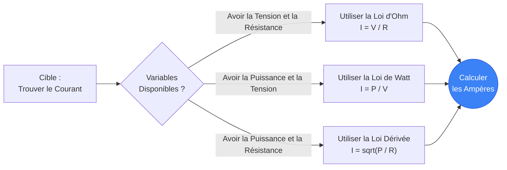
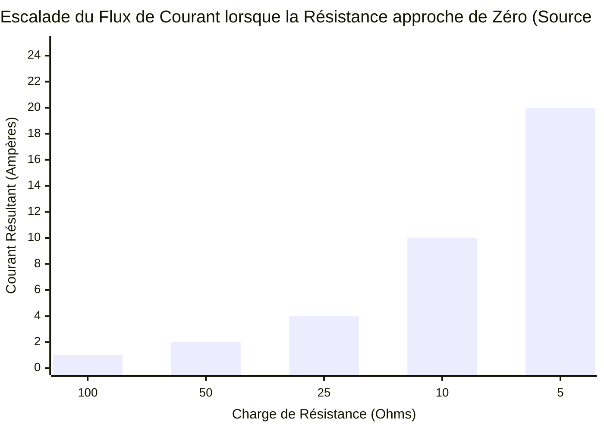
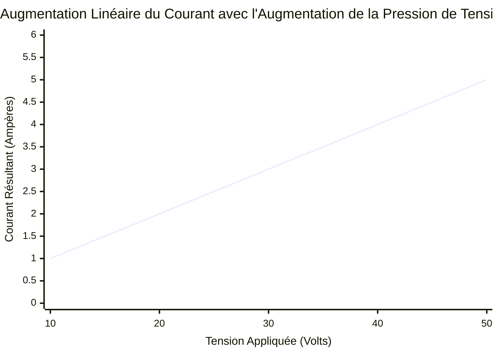
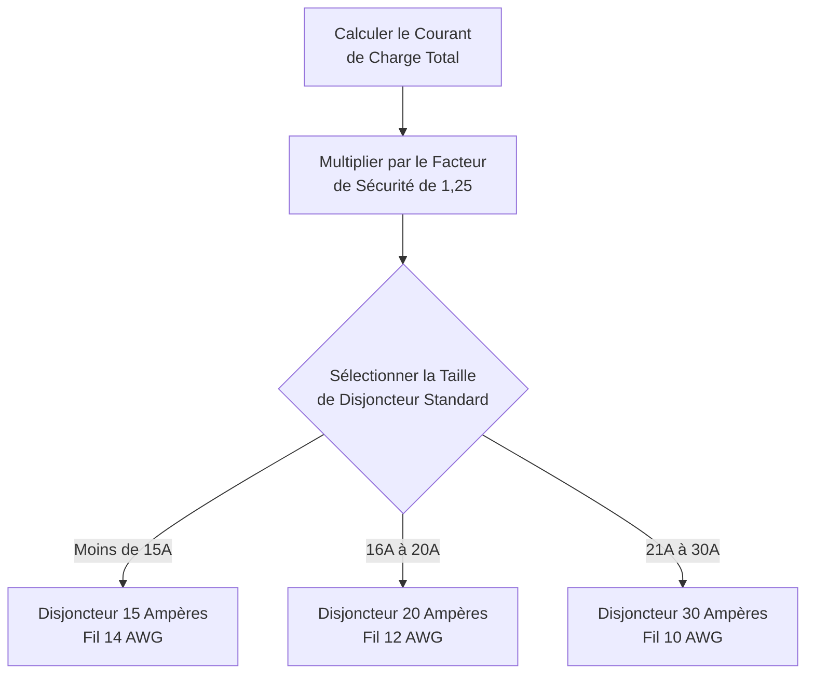

# Le Calculateur de Courant Définitif : Maîtriser l'Ampérage Électrique et le Flux des Circuits

Bienvenue dans le **Calculateur de Courant** ultime et guide complet de physique. Que vous dimensionniez les diamètres des fils de cuivre pour un moteur industriel de $100\text{A}$, que vous calculiez le calibre exact d'un fusible pour un circuit USB délicat, ou que vous cherchiez à savoir exactement combien d'Ampères votre réfrigérateur domestique consomme lors d'une surtension du compresseur, cette suite interactive fournit les dérivations mathématiques exactes dont vous avez besoin.

Le courant électrique est la force vitale de toute l'électronique. Alors que la tension fournit la "pression" et que la résistance fournit la "friction", le courant représente le flux physique réel des électrons chargés effectuant un travail thermodynamique.

Dans ce guide SEO exhaustif de plus de 4 000 mots, nous déconstruirons de manière agressive la physique du courant électrique, explorerons les limites mathématiques de la loi d'Ohm ($I = V/R$) et de la loi de Watt ($I = P/V$), décoderons les normes strictes du National Electrical Code (NEC) pour le dimensionnement des fils, et analyserons cinq scénarios électriques détaillés représentés visuellement par des diagrammes interactifs Mermaid.js compatibles avec les analyseurs.

---

## 1. Qu'est-ce que le Courant Électrique Exactement ? (La Définition en Physique)

Le **Courant Électrique**, mesuré scientifiquement en **Ampères** (ou "Amps"), est le taux fondamental auquel la charge électrique circule devant un point spécifique dans un circuit fermé.

Pour comprendre intuitivement le courant, les ingénieurs électriciens s'appuient universellement sur l'**Analogie du Tuyau d'Eau** :
- Imaginez une rivière coulant à travers un canyon. Le volume absolu d'eau qui passe agressivement par un point de contrôle chaque seconde représente le courant.
- **Le courant est le débit.**
- Si vous avez un circuit massif de $100\text{A}$, vous avez un immense et violent flot d'électrons qui déferlent à travers le fil de cuivre, générant des quantités massives de champs magnétiques et de chaleur thermique.
- Si vous avez un minuscule circuit LED de $20\text{mA}$, vous avez un doux écoulement microscopique d'électrons.

L'unité SI officielle du courant est l'**Ampère ($\text{A}$)**, nommé d'après le mathématicien français André-Marie Ampère. En termes thermodynamiques stricts, $1\text{ Ampère}$ est défini comme exactement $1\text{ Coulomb}$ de charge électrique passant par un point donné en exactement $1\text{ Seconde}$. ($1\text{A} = 1\text{C} / 1\text{s}$).

Parce qu'un seul électron porte une charge douloureusement petite, il faut environ **6,242 quintillions d'électrons** ($6,242 \times 10^{18}$) passant agressivement par un point de contrôle chaque seconde juste pour égaler $1\text{ Ampère}$ !

---

## 2. Dériver le Courant de la Loi d'Ohm ($I = V / R$)

Georg Simon Ohm a prouvé que le courant est mathématiquement verrouillé dans une relation à trois avec la Tension ($V$) et la Résistance ($R$).

$$I = \frac{V}{R}$$

Cela signifie que vous pouvez facilement calculer l'ampérage traversant n'importe quel composant si vous connaissez la pression de la tension qui le pousse et la résistance qui s'y oppose.
- **Si la tension augmente** mais que la résistance reste la même, le flux de courant augmentera de manière agressive.
- **Si la résistance augmente** mais que la tension reste la même, le flux de courant sera étouffé et diminuera.

Cette relation mathématique exacte explique le fonctionnement des "Résistances de limitation de courant". Si vous branchez une minuscule LED directement sur une pile de $9\text{V}$, la résistance est presque nulle, provoquant un pic de courant infini et faisant exploser instantanément la LED. En plaçant une résistance de $470\ \Omega$ en série, vous étouffez parfaitement le courant pour atteindre un filet sûr de $20\text{mA}$.

---

## 3. Dériver le Courant de la Loi de Watt ($I = P / V$)

Alors que la loi d'Ohm dicte le flux d'électrons contre la friction, la loi de Watt dicte la puissance thermodynamique de sortie.

$$P = V \cdot I$$

En isolant algébriquement le courant ($I$), nous obtenons deux formules d'ingénierie incroyablement puissantes :
1. **Le courant dérivé de la puissance et de la tension :** $I = \frac{P}{V}$
2. **Le courant dérivé de la puissance et de la résistance :** $I = \sqrt{\frac{P}{R}}$

Ces formules sont absolument obligatoires pour les électriciens. Si un propriétaire achète un radiateur électrique massif de $1 500\text{W}$ et le branche sur une prise murale standard de $120\text{V}$, l'électricien doit savoir instantanément combien d'Ampères ce radiateur va tirer pour s'assurer que le disjoncteur de la maison ne se déclenche pas.
En utilisant la formule : $I = 1500 / 120 = 12,5\text{A}$. Parce que $12,5\text{A}$ est largement en dessous de la limite standard du disjoncteur de $15\text{A}$, le radiateur fonctionnera parfaitement.

---

## 4. Flux d'Électrons vs Courant Conventionnel

L'un des aspects les plus déroutants de la physique électrique est la direction dans laquelle le courant circule réellement. Il existe deux modèles concurrents :

### Courant Conventionnel (+ vers -)
Lorsque Benjamin Franklin a été le pionnier de l'électricité dans les années 1700, il a deviné que les particules de charge "positive" s'écoulaient de la borne positive, traversaient le circuit, et entraient dans la borne négative. Pendant plus d'un siècle, toutes les mathématiques électriques, les symboles schématiques et les règles d'ingénierie (comme la règle de la main droite pour les champs magnétiques) ont été construits sur cette hypothèse.

### Flux d'Électrons (- vers +)
En 1897, J.J. Thomson a découvert l'électron et a prouvé que Franklin avait tort. Les particules réelles se déplaçant physiquement à travers un fil de cuivre sont des électrons chargés négativement. Par conséquent, ils se repoussent en réalité hors de la borne négative et circulent vers la borne positive !

Malgré cette erreur historique massive, les ingénieurs électriciens modernes utilisent toujours le **Courant Conventionnel** pour tous les calculs mathématiques et les diagrammes schématiques, car les mathématiques fonctionnent de manière parfaitement identique dans les deux cas.

---

## 5. Protection des Circuits : Fusibles et Jauges de Fils

Le courant est ce qui cause les incendies électriques. À mesure que le courant traverse le fil de cuivre, la résistance interne du cuivre génère de la chaleur ($P = I^2 R$). Si le courant dépasse les limites thermiques physiques du cuivre, le fil fera fondre son isolation, enflammera les cloisons sèches et réduira le bâtiment en cendres.

Pour éviter cela, le National Electrical Code (NEC) impose un dimensionnement strict des fils (AWG) et des dispositifs de protection contre les surintensités (Disjoncteurs/Fusibles) :

1. **La règle des 125 % :** Un disjoncteur doit être dimensionné pour gérer 125 % du courant de charge continu. Si une machine consomme $16\text{A}$ en continu, vous ne pouvez pas utiliser un disjoncteur de $16\text{A}$ ; vous devez passer à un disjoncteur de $20\text{A}$ ($16 \cdot 1,25 = 20$).
2. **Dimensionnement des calibres de fils (AWG) :** L'épaisseur du fil de cuivre doit correspondre à la valeur nominale du disjoncteur.
   - Un disjoncteur de $15\text{A}$ nécessite un fil de 14 AWG.
   - Un disjoncteur de $20\text{A}$ nécessite un fil de 12 AWG.
   - Un disjoncteur de $30\text{A}$ nécessite un fil de 10 AWG.
3. **Courts-circuits :** Si un fil sous tension touche un fil de terre, la résistance tombe à zéro. Selon la loi d'Ohm ($I = V/0$), le courant tentera de sauter vers l'infini. Ce pic massif déclenchera instantanément la bobine magnétique à l'intérieur du disjoncteur, coupant le courant en quelques millisecondes.

---

## 6. Guide d'Utilisation Complet : Maximiser le Calculateur

Notre Calculateur de Courant interactif fonctionne comme un ampèremètre numérique avancé, vous permettant de basculer en toute transparence entre les dérivations de la loi d'Ohm et de la loi de Watt.

### Étape 1 : Sélectionnez vos Variables Connues
Utilisez les onglets de navigation supérieurs pour sélectionner les variables que vous possédez actuellement :
- **Tension & Résistance données ($I = V / R$) :** Parfait pour la conception de circuits imprimés standards.
- **Puissance & Tension données ($I = P / V$) :** Parfait pour dimensionner les disjoncteurs résidentiels.
- **Puissance & Résistance données ($I = \sqrt{P / R}$) :** Idéal pour l'analyse des éléments chauffants.

### Étape 2 : Utilisez les Préréglages de l'Explorateur d'Appareils
Si vous concevez un circuit autour d'un appareil standard du monde réel, cliquez simplement sur l'un de nos 10 préréglages. Sélectionner le **Réfrigérateur $120\text{V}$** ou l'**Arduino $5\text{V}$** préchargera instantanément les paramètres d'ampérage exacts et cartographiera automatiquement les courbes de sortie dynamiques pour votre référence.

### Étape 3 : Surveillez le Système de Calibrage Intelligent des Fusibles
Lorsque vous ajustez les entrées, regardez l'affichage de l'ampèremètre LCD numérique réagir de manière dynamique. Portez une attention particulière au **Moteur de Fusible Intelligent**. Le calculateur traitera automatiquement la règle de charge continue de 125 % et recommandera le calibre de fusible standard exact et la taille de fil de cuivre AWG nécessaires pour faire fonctionner votre circuit en toute sécurité.

---

## 7. Cinq Scénarios d'Ingénierie Conceptuels avec Visualisations 2D

Pour maîtriser pleinement les relations mathématiques du courant, nous explorerons cinq scénarios physiques distincts, décomposés visuellement à l'aide de diagrammes Mermaid.js personnalisés.

### Exemple 1 : Les Dérivations Algébriques du Courant

**Le Scénario :**
Un étudiant en ingénierie a besoin d'une visualisation rapide de la façon dont le courant peut être extrait mathématiquement de la tension ($V$), de la résistance ($R$) et de la puissance ($P$) à travers différents ensembles de problèmes.

**Visualisation 2D :**
Cet organigramme logique cartographie les trois chemins mathématiques distincts pour calculer l'ampérage en fonction des variables connues fournies dans un examen.

---

### Exemple 2 : Courant vs Résistance (Tension Constante)

**Le Scénario :**
Vous avez une alimentation constante de $100\text{V}$. Vous testez différentes charges de résistance. Comment le courant change-t-il radicalement à mesure que la résistance chute de plus en plus près de zéro ?

**Les Mathématiques :**
Puisque $V = 100$, $I = 100 / R$.
- À $100\ \Omega$ : $I = 100 / 100 = 1\text{A}$
- À $10\ \Omega$ : $I = 100 / 10 = 10\text{A}$
- À $5\ \Omega$ : $I = 100 / 5 = 20\text{A}$

**Visualisation 2D :**
Ce graphique trace la terrifiante courbe exponentielle du courant. À mesure que la résistance approche de zéro, le courant approche de l'infini, démontrant exactement pourquoi les courts-circuits sont si destructeurs.

---

### Exemple 3 : Courant Linéaire vs Tension (Résistance Constante)

**Le Scénario :**
Vous avez une bobine chauffante de $10\ \Omega$ parfaitement statique. Vous augmentez lentement la tension sur une alimentation de laboratoire variable. Comment le courant réagit-il à l'augmentation de la pression de tension ?

**Les Mathématiques :**
Puisque $R = 10$, $I = V / 10$.
- À $10\text{V}$ : $I = 10 / 10 = 1\text{A}$
- À $50\text{V}$ : $I = 50 / 10 = 5\text{A}$

**Visualisation 2D :**
Contrairement à la courbe exponentielle ci-dessus, ce graphique linéaire démontre la relation parfaitement linéaire et prévisible de la loi d'Ohm lorsque la résistance est verrouillée.

---

### Exemple 4 : Logique de Dimensionnement d'un Disjoncteur

**Le Scénario :**
Un électricien installe un circuit dédié pour un rack de serveurs industriel à usage continu. Il doit calculer la taille exacte du disjoncteur en utilisant la règle des 125 % du NEC.

**Visualisation 2D :**
Cet organigramme descendant catégorise strictement les mathématiques requises pour dimensionner correctement un disjoncteur et le calibre de fil ultérieur.

---

### Exemple 5 : Test de Décharge de Batterie à Haut Ampérage

**Le Scénario :**
Un ingénieur teste la capacité de décharge de pointe d'une batterie de drone Lithium Polymère. Il doit mesurer le courant de pointe sur un intervalle strict de 3 minutes avant l'arrêt thermique.

**Visualisation 2D :**
Ce diagramme de Gantt décrit le programme de tests rigoureux sur le terrain pour surveiller les flux d'ampérage extrêmes et les températures de la batterie.

```mermaid
gantt
    title Test de Décharge de Batterie de Drone à Haut Ampérage
    dateFormat  HH:mm:ss
    axisFormat  %H:%M:%S
    
    section Configuration
    Connecter la Résistance Shunt 100A :done, 00:00:00, 30s
    Calibrer la Télémétrie :active, 00:00:30, 30s
    
    section Décharge
    Initier le Tirage de Courant Constant 50A :crit, 00:01:00, 60s
    Enregistrer le Pic de Température de la Batterie :active, 00:01:30, 30s
    
    section Arrêt
    Déclencher la Coupure Thermique :milestone, 00:02:00, 10s
    Période de Refroidissement :active, 00:02:10, 50s
```

---

## 8. Conclusion et Défi d'Ingénierie

Maîtriser le courant est la clé ultime de la sécurité électrique et de la conception de circuits. Chaque fil que vous passez, chaque fusible que vous installez et chaque LED que vous soudez reposent sur votre capacité à calculer avec précision le flux d'ampérage en utilisant $I = V/R$ et $I = P/V$.

Si vous respectez le courant et dimensionnez vos fils avec précision, vos circuits fonctionneront parfaitement froids et efficaces. Si vous sous-estimez le courant, vos fils surchaufferont violemment et fondront.

Pour garantir que vous avez maîtrisé ces concepts, lancez notre simulateur interactif et tentez de résoudre ces derniers défis :
1. **Le Micro-ondes :** Un micro-ondes de cuisine consomme $1 200\text{W}$ de puissance à partir d'une prise standard de $120\text{V}$. Calculez le Courant ($I$) exact qu'il consomme. Déclenchera-t-il un disjoncteur de $15\text{A}$ si un grille-pain de $5\text{A}$ fonctionne sur le même circuit simultanément ?
2. **Le Court-Circuit :** Une batterie de voiture de $12\text{V}$ est accidentellement court-circuitée avec une clé. La seule résistance restante est la résistance interne de $0,02\ \Omega$ de la batterie. Calculez l'énorme courant de court-circuit ($I = V/R$) qui vaporisera instantanément la clé.
3. **La Matrice de LED :** Vous souhaitez faire fonctionner une matrice massive de $50$ LED indicatrices en parallèle. Chaque LED nécessite exactement $20\text{mA}$ ($0,02\text{A}$) pour fonctionner. Calculez la consommation de courant totale de la matrice.

Fiez-vous à ce calculateur pour revérifier vos calculs, respecter les limites des fils NEC, et rappelez-vous toujours : Le courant est le flux agressif qui donne vie à vos circuits.
