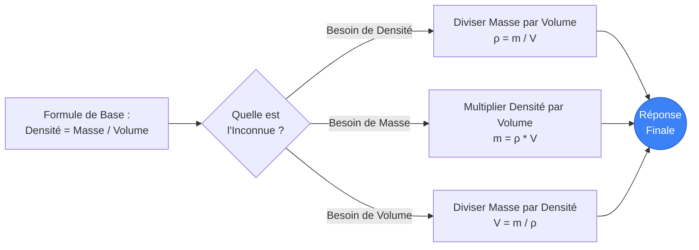
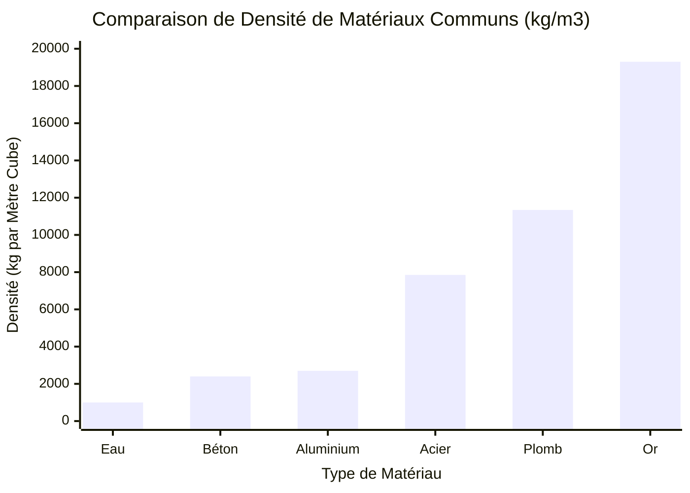
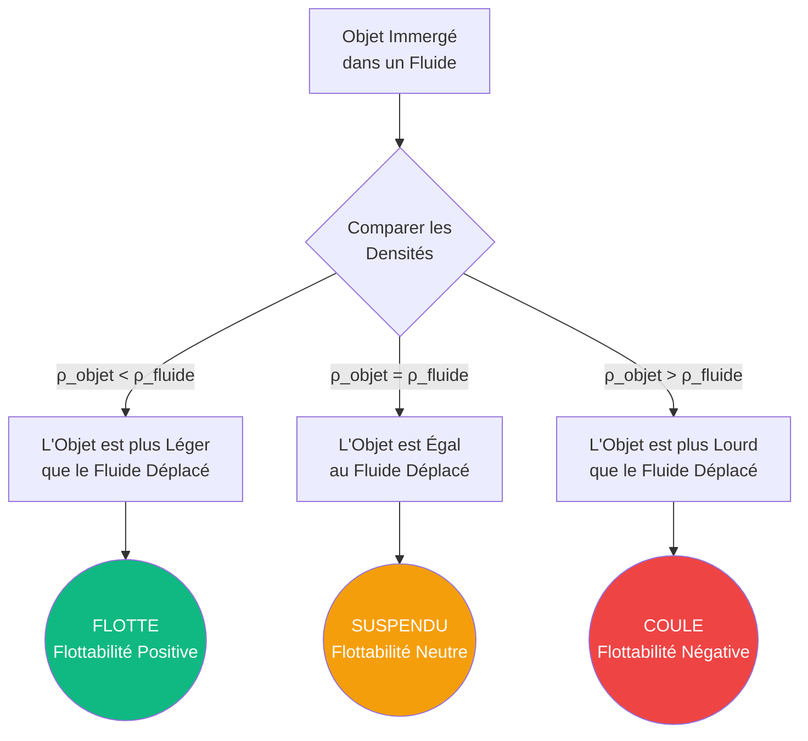
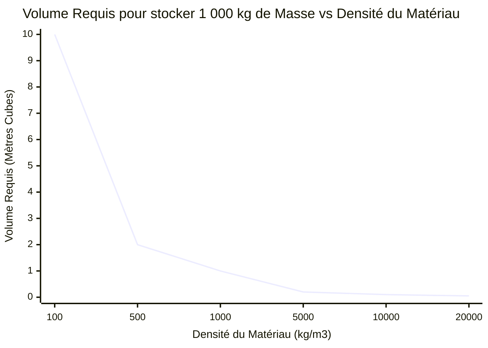

# Le Calculateur de Densité Définitif : Maîtriser la Masse, le Volume et le Principe d'Archimède

Bienvenue dans le **Calculateur de Densité** ultime et guide complet de physique de l'ingénieur. Que vous soyez un étudiant en science des matériaux essayant de vérifier la pureté d'un anneau en or, un ingénieur structurel calculant la charge morte d'un pilier en béton armé, ou un architecte naval concevant le déplacement de la coque d'un navire de croisière de $100\,000\text{ tonnes}$, cet outil fournit les conversions physiques exactes absolues et les cadres conceptuels dont vous avez besoin.

La densité (ou masse volumique, $\rho$) est l'une des propriétés intensives les plus fondamentales de l'univers. Elle décrit la relation précise entre la quantité de matière (Masse) concentrée dans une quantité spécifique d'espace 3D (Volume). En maîtrisant la densité, vous déverrouillez les clés pour comprendre la flottabilité, l'aérodynamique, la pression hydrostatique et l'intégrité structurelle de base du monde physique.

Dans ce guide SEO exhaustif de plus de 4 000 mots, nous allons déconstruire minutieusement la formule de la densité ($\rho = m/V$). Nous explorerons les nuances de la densité relative (Specific Gravity, SG), percerons le mystère vieux de 2 000 ans du principe d'Archimède et analyserons cinq scénarios conceptuels d'ingénierie détaillés représentés visuellement par des diagrammes interactifs Mermaid.js.

---

## 1. Définir la Densité : L'Anatomie de la Matière

En physique classique, la **Densité** ou masse volumique (représentée par la lettre grecque $\rho$, *rho*) est définie comme la masse d'une substance par unité de volume. C'est une propriété *intensive*, ce qui signifie qu'elle ne change pas quelle que soit la quantité de substance que vous possédez. Une seule goutte d'eau pure a exactement la même densité qu'une piscine olympique entière d'eau pure.

$$ \rho = \frac{m}{V} $$

### L'Analogie de l'Oreiller vs. La Brique de Plomb
Pour saisir intuitivement la densité, imaginez tenir un oreiller standard dans votre main gauche, et un bloc de plomb massif ayant exactement les mêmes dimensions physiques (Volume) dans votre main droite.
- L'oreiller est principalement rempli d'espace vide et d'air emprisonné. Il possède très peu de masse dans ce volume. Il a une **densité extrêmement faible**.
- Le bloc de plomb massif a ses lourds noyaux atomiques densément emballés dans un réseau cristallin serré. Il contient une immense quantité de masse dans ce même volume exact. Il a une **densité incroyablement élevée** (et risque de vous casser le poignet).

### Unités SI Standards de la Densité
Parce que la masse est mesurée en kilogrammes ($\text{kg}$) et que le volume est mesuré en mètres cubes ($\text{m}^3$), l'unité SI standard pour la densité est le **Kilogramme par mètre cube** ($\text{kg/m}^3$).
Cependant, en chimie de laboratoire, des unités plus petites sont fréquemment utilisées :
- **Grammes par centimètre cube** ($\text{g/cm}^3$)
- **Grammes par millilitre** ($\text{g/mL}$)

*Note cruciale : $1\text{ cm}^3$ est physiquement identique à $1\text{ mL}$. Par conséquent, $1\text{ g/cm}^3 = 1\text{ g/mL}$.*

Pour convertir entre les unités de laboratoire et les unités SI d'ingénierie, il suffit de multiplier par $1\,000$ :
$$ 1\text{ g/cm}^3 = 1\,000\text{ kg/m}^3 $$

---

## 2. La Densité Relative : Le Rapport Universel

La **Densité Relative (Specific Gravity, SG)** (aussi appelée *Gravité Spécifique*) est un brillant raccourci mathématique utilisé par les ingénieurs pour éviter de traiter avec des unités encombrantes. Il s'agit simplement d'un rapport sans dimension comparant la densité de votre matériau choisi à la densité de référence de l'eau liquide pure à $4^\circ\text{C}$ ($1\,000\text{ kg/m}^3$).

$$ \text{SG} = \frac{\rho_{\text{substance}}}{\rho_{\text{eau}}} $$

Puisqu'il s'agit d'un rapport de densités, les unités s'annulent, laissant un nombre pur.
- Si un bloc d'aluminium massif a une densité de $2\,700\text{ kg/m}^3$, sa densité relative est précisément de **$2,70$**.
- Si un bloc de bois de chêne sec a une densité de $700\text{ kg/m}^3$, sa densité relative est précisément de **$0,70$**.

Cela nous indique immédiatement comment un matériau va se comporter dans l'eau sans faire de calculs complexes. Si le $\text{SG} < 1$, il flotte. Si le $\text{SG} > 1$, il coule.

---

## 3. Le Principe d'Archimède : La Physique de la Flottabilité

La légende raconte qu'en 250 avant J.-C., le mathématicien grec Archimède fut chargé par le roi Hiéron II de Syracuse de déterminer si un orfèvre avait volé de l'or pur et l'avait remplacé par de l'argent moins cher lors de la fabrication d'une couronne royale. Archimède ne pouvait pas faire fondre la couronne. En entrant dans sa baignoire, il remarqua que le niveau de l'eau montait en proportion exacte du volume de son corps immergé. Il réalisa qu'il pouvait mesurer le volume de la couronne en la submergeant dans l'eau, diviser sa masse par ce volume, et trouver sa densité pour prouver sa pureté. Il aurait couru nu dans les rues en criant "Eurêka !" (J'ai trouvé !).

Cela a conduit à la formulation du **Principe d'Archimède** :
*"Tout corps, totalement ou partiellement immergé dans un fluide, subit une force de poussée vers le haut égale au poids du fluide déplacé par l'objet."*

$$ F_{\text{Poussée}} = \rho_{\text{fluide}} \cdot V_{\text{immergé}} \cdot g $$

### Comment les Navires Flottent
Un bloc d'acier massif ($\text{SG} = 7,85$) coulera violemment au fond de l'océan. Comment, alors, un énorme porte-avions en acier flotte-t-il ?
En martelant l'acier pour lui donner une forme large et creuse en cuvette (une coque), le navire renferme un volume massif d'air ($\text{SG} = 0,001$). La densité *moyenne* de toute la structure du navire (acier lourd + énorme volume d'air léger) chute considérablement en dessous de la densité de l'eau de mer ($1\,025\text{ kg/m}^3$).
Le navire déplace une quantité d'eau de mer égale à son propre poids immense bien avant que l'eau ne franchisse le pont supérieur, lui permettant d'atteindre un équilibre de flottabilité.

---

## 4. Guide d'Utilisation Complet : Maximiser le Calculateur

Notre Calculateur de Densité interactif fonctionne comme un robuste établi de thermodynamique et de science des matériaux.

### Étape 1 : Sélectionnez votre Cible de Calcul
Utilisez la navigation supérieure pour sélectionner votre variable inconnue :
- **Densité ($\rho$) :** Vous connaissez la Masse et le Volume. (Idéal pour identifier des matériaux inconnus).
- **Masse ($m$) :** Vous connaissez la Densité et le Volume. (Idéal pour calculer des charges structurelles).
- **Volume ($V$) :** Vous connaissez la Densité et la Masse. (Idéal pour dimensionner des réservoirs de stockage).

### Étape 2 : Utilisez la Base de Données des Matériaux
Évitez la saisie manuelle de données en sélectionnant parmi nos plus de 17 préréglages de matériaux intégrés. Besoin de connaître la masse exacte de $5\text{ m}^3$ de mercure liquide ? Sélectionnez 'Mercure' (Mercury) dans le menu déroulant, et le calculateur renseigne instantanément $\rho = 13\,540\text{ kg/m}^3$.

### Étape 3 : Explorez le Simulateur de Flottabilité
Une fois votre densité calculée, vérifiez le panneau du Simulateur de Flottabilité. Il croise votre densité calculée avec cinq fluides communs (Eau douce, Eau salée, Huile de cuisson, Éthanol et Mercure) pour vous dire instantanément si votre objet va flotter à la surface, atteindre une suspension neutre, ou couler au fond.

---

## 5. Cinq Scénarios d'Ingénierie Conceptuels avec Visualisations 2D

Pour maîtriser pleinement les relations entre la Masse, le Volume, la Densité et la Flottabilité, nous allons explorer cinq scénarios physiques distincts, décomposés visuellement à l'aide de diagrammes Mermaid.js personnalisés.

### Exemple 1 : La Logique de la Formule de Densité (Résolution des Variables)

**Le Scénario :**
Un étudiant en chimie au lycée doit rapidement visualiser les permutations algébriques de la formule de la densité ($\rho = m/V$) pour résoudre trois questions de test différentes.

**Visualisation 2D :**
Cet organigramme logique illustre le "Triangle de la Densité" classique utilisé pour isoler les variables.

---

### Exemple 2 : Le Spectre de Densité des Éléments

**Le Scénario :**
Un ingénieur conçoit un petit contrepoids pour un drone aérospatial. Il dispose exactement de $1\,000\text{ cm}^3$ ($1\text{ Litre}$) d'espace disponible. Il doit visualiser comment différents matériaux modifieront radicalement la masse du contrepoids.

**Visualisation 2D :**
Ce diagramme à barres trace les différences stupéfiantes de densité entre des matériaux communs. Notez comment l'Or est près de 20 fois plus dense que l'eau, et plus de 7 fois plus dense que l'Aluminium !

---

### Exemple 3 : L'Arbre de Décision de la Flottabilité d'Archimède

**Le Scénario :**
Un biologiste marin conçoit un submersible pour les grands fonds. Il doit calculer exactement comment le submersible se comportera lorsqu'il sera placé dans l'eau de mer ($1\,025\text{ kg/m}^3$) en fonction de sa densité structurelle moyenne.

**Visualisation 2D :**
Cet organigramme visualise les résultats logiques stricts du Principe d'Archimède basés sur la Densité Relative (SG).

---

### Exemple 4 : La Courbe de Volume Inverse pour une Masse Fixe

**Le Scénario :**
Vous avez exactement $1\,000\text{ kg}$ ($1\text{ Tonne Métrique}$) de matière. Combien d'espace physique (Volume) cela prendra-t-il ? Puisque Volume = Masse / Densité, à mesure que la densité du matériau augmente, le volume requis chute exponentiellement vers zéro.

**Les Mathématiques :**
- $1\,000\text{ kg}$ d'Air ($\rho = 1,225$) nécessitent $816\text{ m}^3$ d'espace.
- $1\,000\text{ kg}$ d'Eau ($\rho = 1\,000$) nécessitent $1,0\text{ m}^3$ d'espace.
- $1\,000\text{ kg}$ d'Or ($\rho = 19\,300$) nécessitent seulement $0,051\text{ m}^3$ d'espace !

**Visualisation 2D :**
Ce graphique trace la décroissance hyperbolique du volume requis à mesure que la densité du matériau augmente, pour une masse fixe de $1\,000\text{ kg}$.

---

### Exemple 5 : Le Processus de Test Métallurgique de l'Or (Gantt)

**Le Scénario :**
Un bijoutier reçoit une brique supposée être de "l'or pur 24K". Il doit utiliser la méthode de déplacement d'eau d'Archimède pour calculer sa densité précise et vérifier sa pureté sans l'entailler.

**Visualisation 2D :**
Ce diagramme de Gantt décrit le processus chronologique en laboratoire pour calculer la densité d'un solide irrégulier.

```mermaid
gantt
    title Protocole de Test de Densité en Laboratoire (Déplacement d'Eau)
    dateFormat  HH:mm:ss
    axisFormat  %M:%S
    section Mesures à Sec
    Calibrer la Balance à Zéro :crit, active, 00:00:00, 00:02:00
    Peser l'Objet dans l'Air (Noter la Masse) :active, 00:02:00, 00:05:00
    section Mesures dans l'Eau
    Remplir l'Éprouvette Graduée avec de l'Eau :00:05:00, 00:08:00
    Noter le Volume d'Eau Initial (V1) :00:08:00, 00:10:00
    Immerger l'Objet & Noter le Volume Final (V2) :crit, 00:10:00, 00:13:00
    section Calculs
    Calculer le Volume Déplacé (V2 - V1) :00:13:00, 00:15:00
    Calculer la Densité (Masse / Volume) :milestone, 00:15:00, 00:16:00
```

---

## 6. Foire Aux Questions (FAQ) Détaillée

**Q : Pourquoi la glace flotte-t-elle sur l'eau s'il s'agit toutes deux de H₂O ?**
**R :** C'est une anomalie rare et magnifique de la physique. Lorsque l'eau gèle pour devenir de la glace, les liaisons hydrogène forcent les molécules dans un réseau cristallin hexagonal rigide et ouvert. Ce réseau prend environ $9\,\%$ d'espace physique (Volume) en plus que le culbutage chaotique des molécules d'eau liquide. Comme la masse reste la même mais que le volume augmente, la densité diminue. La glace ($\rho = 917\text{ kg/m}^3$) est moins dense que l'eau liquide ($\rho = 1\,000\text{ kg/m}^3$), donc elle flotte ! Si cela ne se produisait pas, les océans gèleraient de bas en haut, tuant toute vie marine.

**Q : Quelle est la différence entre la Masse et le Poids ?**
**R :** La masse est la quantité absolue de matière dans un objet (mesurée en $\text{kg}$), et elle ne change jamais à moins que vous ne coupiez physiquement l'objet en deux. Le poids est la force locale de la gravité tirant sur cette masse (mesuré en Newtons, $W = m \cdot g$). Un astronaute a exactement la même masse et la même densité sur Terre que sur la Lune, mais son *poids* est six fois plus faible sur la Lune.

**Q : Comment la température affecte-t-elle la densité ?**
**R :** À de très rares exceptions près (comme l'eau liquide en dessous de $4^\circ\text{C}$), chauffer une substance ajoute de l'énergie cinétique thermique. Les atomes vibrent violemment et se repoussent, provoquant une *dilatation thermique* du matériau. Parce que le volume ($V$) augmente tandis que la masse ($m$) reste constante, la densité ($\rho$) diminue. C'est précisément pour cela que les montgolfières s'élèvent : chauffer l'air abaisse sa densité en dessous de l'air ambiant environnant, générant une poussée vers le haut !

**Q : Quelle est la substance la plus dense de l'univers ?**
**R :** Sur Terre, l'élément naturel le plus dense est l'Osmium ($\rho = 22\,590\text{ kg/m}^3$). Une bouteille de lait standard de 1 gallon remplie d'Osmium pèserait près de $190\text{ livres}$ ($86\text{ kg}$) ! Cependant, en astrophysique, une Étoile à Neutrons possède des densités approchant $10^{17}\text{ kg/m}^3$. Une seule cuillère à café de matière d'étoile à neutrons pèserait plus de $5,5\text{ Milliards de Tonnes Métriques}$.

**Q : Comment les sous-marins plongent-ils et font-ils surface ?**
**R :** Les sous-marins utilisent des chambres creuses massives appelées Ballasts. Lors de la navigation en surface, les ballasts sont remplis d'air ($\text{SG} < 1$). Pour plonger, ils ouvrent des purges, inondant les ballasts d'eau de mer lourde. Cela augmente la densité moyenne totale du sous-marin jusqu'à ce qu'elle dépasse celle de l'eau de mer, le faisant couler. Pour remonter à la surface, ils insufflent de l'air hautement comprimé dans les ballasts, chassant l'eau et rétablissant une flottabilité positive.

---

## 7. Conclusion et Défi d'Ingénierie

La densité est la variable maîtresse reliant la macro-ingénierie des navires et des gratte-ciel à la micro-ingénierie des structures de réseaux atomiques. En comprenant comment manipuler la masse et le volume, les ingénieurs peuvent créer du béton qui flotte ou des métaux qui coulent comme des pierres.

Pour véritablement maîtriser ces concepts de dynamique des fluides et de thermodynamique, utilisez notre Calculateur de Densité pour résoudre les défis de physique conceptuelle suivants :
1. **Le Ballon de Plomb :** Vous avez une sphère creuse en plomb massif ($\rho = 11\,340\text{ kg/m}^3$). Elle a un rayon extérieur de $1\text{ mètre}$, mais la coque de plomb est incroyablement fine, enfermant un vide massif à l'intérieur. Si la masse totale de la coque de plomb n'est que de $500\text{ kg}$, ce ballon de plomb va-t-il flotter ou couler s'il est placé dans l'océan ? (Indice : calculez le volume total de la sphère de $1\text{m}$, et trouvez la densité *moyenne*).
2. **La Fraude au Platine :** Un prospecteur vous vend un petit cube métallique qui mesure exactement $5\text{ cm}$ de tous les côtés ($V = 125\text{ cm}^3$). Il prétend que c'est du Platine massif pur ($\rho = 21,45\text{ g/cm}^3$). Vous pesez le cube, et la balance indique $1\,100\text{ grammes}$. Venez-vous de vous faire arnaquer ?
3. **La Marée Noire :** Un cargo laisse fuir $10\,000\text{ kg}$ de pétrole brut ($\rho = 850\text{ kg/m}^3$) dans un lac d'eau douce ($\rho = 1\,000\text{ kg/m}^3$). Combien de mètres cubes de nappe de pétrole se formeront à la surface, et pourquoi ne coule-t-il pas ?

Expérimentez avec le simulateur, analysez la flottabilité complexe de différentes combinaisons de matériaux, et comptez sur ce calculateur pour dévoiler les distributions de masses cachées régissant notre réalité physique.
