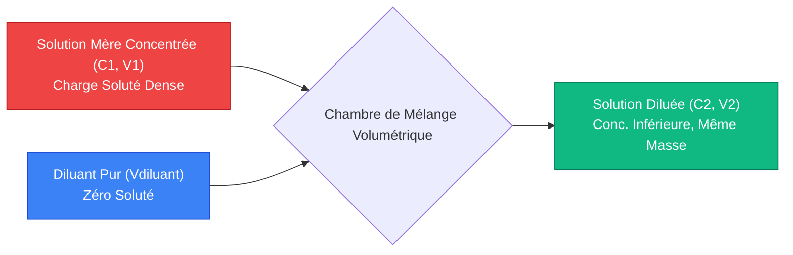
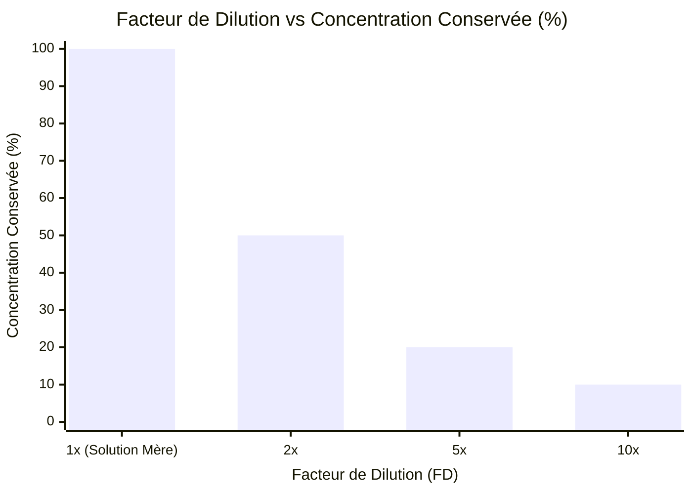
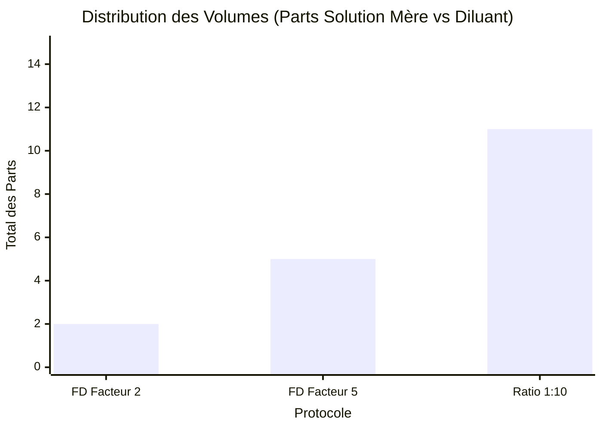
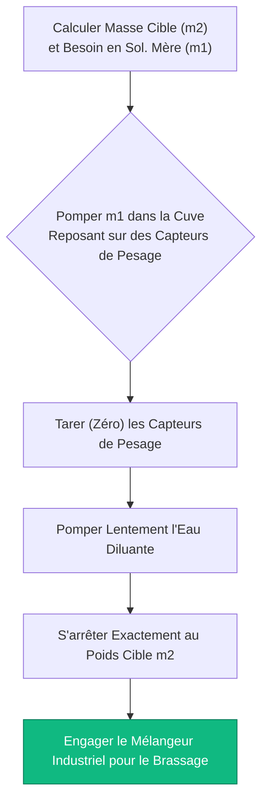
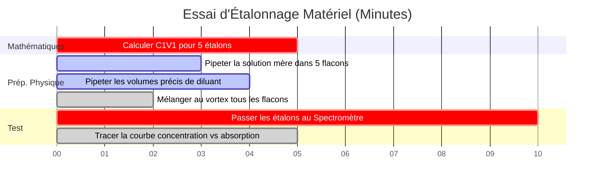

# Le Calculateur Universel de Dilution : Ratios, Facteurs, et $C_1 V_1 = C_2 V_2$

Bienvenue dans l'ultime **Calculateur Universel de Dilution** et manuel complet des solutions de laboratoire. Que vous soyez un microbiologiste clinique préparant un test en série au 1:10 000 pour des cultures cellulaires, un chimiste industriel mettant à l'échelle une cuve de $500\text{ kg}$ d'hypochlorite de sodium à $5\% \text{ p/p}$, ou un spécialiste de l'environnement diluant des étalons de métaux lourds pour la spectroscopie d'absorption atomique, la maîtrise des mathématiques universelles de dilution est une nécessité absolue.

Bien que la "dilution" semble être un processus simple — ajouter de l'eau à un produit chimique fort pour le rendre plus faible — la rigueur mathématique requise pour maintenir des ratios de solutés exacts à travers différentes unités (molarité, pourcentages massiques, ratios volumétriques) est notoirement sujette à l'erreur humaine. Un seul point décimal mal placé dans le calcul d'un facteur de dilution peut ruiner un lot industriel de plusieurs millions de dollars ou altérer mortellement un dosage pharmaceutique.

Dans cette masterclass SEO exhaustive de plus de 4 000 mots, nous allons entièrement déconstruire la physique universelle de la dilution, cartographier mathématiquement les différences entre les Ratios de Dilution et les Facteurs de Dilution, décoder la thermodynamique des dilutions en pourcentage massique ($\% \text{ p/p}$), et exposer les erreurs de préparation en laboratoire les plus fatales. Pour garantir une compréhension absolue, nous avons inclus cinq diagrammes interactifs Mermaid.js méticuleusement détaillés et compatibles avec les parseurs.

---

## 1. L'Équation Universelle de Dilution : $C_1 V_1 = C_2 V_2$

Le fondement de toutes les mathématiques de dilution volumétrique repose sur la loi inviolable de la **Conservation du Soluté**. Lorsque vous diluez une solution mère concentrée, vous n'ajoutez *que* du solvant pur (le diluant). Vous n'ajoutez exactement aucune particule de soluté. Par conséquent, la quantité physique absolue du produit chimique dissous reste mathématiquement verrouillée.

**La Règle d'Or :**
$$(\text{Quantité Totale de Soluté Avant}) = (\text{Quantité Totale de Soluté Après})$$

Puisque la Concentration ($C$) est définie comme la Quantité par Volume ($\text{Quantité}/V$), nous pouvons réarranger la définition pour prouver que $\text{Quantité} = C \times V$. 
Si la quantité totale ne change jamais pendant la dilution, alors :
$$C_{\text{initial}} \times V_{\text{initial}} = C_{\text{final}} \times V_{\text{final}}$$

Cela donne l'équation universelle de dilution :
$$C_1 V_1 = C_2 V_2$$

Contrairement à l'équation spécifique à la Molarité ($M_1 V_1 = M_2 V_2$), cette équation universelle est indépendante des unités. Tant que vos unités de concentration correspondent des deux côtés (par exemple, les deux en $\text{mg/L}$, les deux en $\% \text{ v/v}$) et que vos unités de volume correspondent (par exemple, les deux en $\text{mL}$), l'équation fonctionne parfaitement.

---

## 2. Facteur de Dilution (FD) vs Ratio de Dilution (1:X)

Les erreurs les plus catastrophiques dans les laboratoires cliniques découlent de la confusion entre les **Facteurs de Dilution** et les **Ratios de Dilution**. Ils se ressemblent mathématiquement mais dictent des préparations volumétriques entièrement différentes.

### Qu'est-ce qu'un Facteur de Dilution (FD) ?
Un Facteur de Dilution représente la diminution de la concentration par un certain multiple. C'est le ratio du Volume Final ($V_2$) divisé par le Volume Initial de la Solution Mère ($V_1$).

$$\text{FD} = \frac{V_2}{V_1} = \frac{C_1}{C_2}$$

* **Exemple :** Une dilution de facteur $5$ ($\text{FD} = 5$). Vous prenez $1\text{ mL}$ de solution mère et ajoutez $4\text{ mL}$ de diluant. Le volume final est de $5\text{ mL}$. La concentration est réduite à exactement $1/5\text{ème}$ ($20\%$ conservés).

### Qu'est-ce qu'un Ratio de Dilution ($1:X$) ?
Un Ratio de Dilution définit explicitement le rapport entre le Volume de la Solution Mère et le Volume de Diluant. 

* **Exemple :** Un Ratio de Dilution de $1:4$. Vous mélangez $1\text{ part de solution mère}$ avec $4\text{ parts de diluant}$. 
* Attendez, quel est le volume final ? $1 + 4 = 5\text{ parts au total}$. 
* Par conséquent, un Ratio de Dilution de $1:4$ est mathématiquement identique à un Facteur de Dilution de $5$. 

**Le Piège Mortel :** Si un médecin prescrit une "$dilution 1:10$", veut-il dire un Facteur de Dilution de $10$ (1 part de solution mère + 9 parts de diluant) ou un Ratio de Dilution de $1:10$ (1 part de solution mère + 10 parts de diluant = 11 parts au total) ? Clarifiez toujours la procédure opérationnelle standard (POS) de votre laboratoire spécifique, car les conventions varient énormément entre la chimie et la biologie.

---

## 3. La Complexité des Dilutions en Pourcentage Massique ($\% \text{ p/p}$)

Bien que $C_1 V_1 = C_2 V_2$ soit universellement parfait pour les concentrations volumétriques (comme la Molarité ou $\text{g/L}$), elle échoue de manière catastrophique lorsqu'il s'agit de pourcentages massiques ($\% \text{ p/p}$).

**Pourquoi cela échoue-t-il ?**
Parce que $C_1 V_1 = C_2 V_2$ suppose que le volume est parfaitement additif. En réalité, mélanger $50\text{ mL}$ d'eau et $50\text{ mL}$ d'éthanol donne environ $96\text{ mL}$ de solution en raison de l'agencement moléculaire (le Paradoxe de la Contraction Volumétrique).

Lorsque les chimistes industriels diluent du Peroxyde d'Hydrogène à $30\% \text{ p/p}$ jusqu'à $3\% \text{ p/p}$, ils ne peuvent pas utiliser le volume. Ils doivent utiliser une masse physique stricte ($m$) sur une balance industrielle calibrée.

**L'Équation de Dilution Massique :**
$$C_1 m_1 = C_2 m_2$$

Si vous avez $100\text{ kg}$ de peroxyde à $30\% \text{ p/p}$ ($C_1 = 30$, $m_1 = 100$), et que vous voulez $3\% \text{ p/p}$ ($C_2 = 3$) :
$$30 \times 100 = 3 \times m_2 \implies m_2 = 1000\text{ kg}$$
Vous devez ajouter $900\text{ kg}$ d'eau pour atteindre la masse finale de $1000\text{ kg}$. Le volume est entièrement ignoré.

---

## 4. Dilutions en Série Multi-Étapes

Lorsqu'un scientifique a besoin d'une concentration exponentiellement plus petite que la solution mère (par exemple, diluer une culture bactérienne de $1 000 000\text{ UFC/mL}$ jusqu'à $10\text{ UFC/mL}$), une étape de dilution unique est impossible. Le volume de solution mère requis serait plus petit qu'une gouttelette microscopique.

La solution est une **Dilution en Série** : une séquence de dilutions successives identiques qui déclenchent une décroissance exponentielle rapide de la concentration.

**Calcul du Facteur de Dilution Cumulatif :**
$$\text{FD}_{\text{cumulatif}} = \text{FD}_1 \times \text{FD}_2 \times \text{FD}_3 \dots$$

Si vous effectuez trois dilutions consécutives d'un facteur $10$ ($\text{FD} = 10$) :
$$\text{FD}_{\text{cumulatif}} = 10 \times 10 \times 10 = 1 000$$
Le tube final est exactement $1 000\text{ fois}$ plus dilué que la solution mère d'origine.

---

## 5. Cinq Scénarios d'Ingénierie Conceptuelle avec des Visualisations 2D

Pour maîtriser pleinement les algorithmes mécaniques régissant la réduction de concentration universelle, l'analyse des ratios, et les préparations industrielles basées sur la masse, nous allons explorer cinq scénarios distincts de chimie analytique visuellement décomposés à l'aide de diagrammes Mermaid.js personnalisés.

### Exemple 1 : Le Mécanisme Universel $C_1V_1 = C_2V_2$

**Le Scénario :**
Un étudiant en chimie de première année cartographie le flux physique d'une dilution volumétrique standard, suivant comment la solution mère concentrée et le diluant fusionnent.

**Visualisation 2D :**
Cet organigramme cartographie visuellement la collision de la solution mère dense et du diluant sans soluté à l'intérieur d'une fiole jaugée pour générer une solution de travail stable et homogène.

---

### Exemple 2 : Facteur de Dilution vs Concentration Conservée

**Le Scénario :**
Un technicien de laboratoire visualise à quelle vitesse la concentration chimique conservée s'effondre à mesure que le Facteur de Dilution augmente.

**Visualisation 2D :**
Ce graphique prouve graphiquement la relation inverse entre le Facteur de Dilution et le pourcentage de concentration conservée. Remarquez comment un $\text{FD de 10x}$ ne laisse que $10\%$ de la force chimique d'origine.

---

### Exemple 3 : Le Paradoxe du Ratio vs Facteur

**Le Scénario :**
Un biologiste clinique compare les distributions de volumes physiques de trois protocoles de préparation courants pour éviter le piège mortel Ratio vs Facteur.

**Visualisation 2D :**
Ce graphique comparatif cartographie visuellement le nombre exact de parts de solution mère par rapport au diluant nécessaires pour des dilutions géométriques spécifiques.

---

### Exemple 4 : Protocole de Dilution Industrielle Massique $\% \text{p/p}$

**Le Scénario :**
Un ingénieur d'usine chimique cartographie la procédure opérationnelle standard (POS) rigide requise pour diluer légalement une cuve de $500\text{ kg}$ d'eau de Javel industrielle concentrée sans se fier à des mesures volumétriques instables.

**Visualisation 2D :**
Cet organigramme de haut en bas agit comme une recette industrielle stricte, imposant la séquence absolue des actions requises pour effectuer une dilution basée sur la masse ($m_1 w_1 = m_2 w_2$) sur des balances au sol calibrées.

---

### Exemple 5 : Chronologie d'un Test Environnemental

**Le Scénario :**
Un spécialiste de l'environnement doit préparer un gradient parfaitement espacé d'étalons de métaux lourds dilués pour étalonner un spectromètre d'absorption atomique pour l'analyse de l'eau de rivière.

**Visualisation 2D :**
Ce diagramme de Gantt visualise la séquence chronologique d'un essai d'étalonnage en plusieurs étapes, des mathématiques et de la dilution physique jusqu'à l'étalonnage matériel ultime.

---

## 6. Conclusion et Défi de Stœchiométrie

La maîtrise des algorithmes de dilution universelle est l'exigence d'entrée non négociable pour intégrer tout laboratoire industriel, biologique ou chimique. Comprendre la rigidité mathématique de la conservation des solutés, la différence sémantique mortelle entre les Facteurs de Dilution et les Ratios de Dilution, et la nécessité de protocoles basés sur la masse pour les solutions à $\% \text{ p/p}$ garantira que vos préparations se comportent exactement comme prévu.

Si vous ne maîtrisez pas ces algorithmes, vos tests microbiologiques seront fondamentalement corrompus, vos lots industriels échoueront au contrôle qualité, et vos données expérimentales seront totalement détruites par l'erreur humaine.

Pour garantir que vous avez maîtrisé ces concepts critiques, lancez notre Simulateur interactif et tentez de résoudre ces derniers défis analytiques :
1. **Le Défi du Ratio :** Un protocole exige un Ratio de Dilution de $1:15$. Vous avez besoin d'un volume final d'exactement $160\text{ mL}$. Combien de mL de solution mère et combien de mL de diluant devez-vous mélanger ?
2. **Le Défi Massique Industriel :** Vous avez $50\text{ kg}$ d'une solution saline à $20\% \text{ p/p}$. Vous voulez la diluer jusqu'à $2\% \text{ p/p}$. Exactement combien de kilogrammes d'eau pure devez-vous ajouter à la cuve ?
3. **Le Défi en Série :** Vous exécutez une dilution par un facteur 10. Ensuite, vous prenez ce tube et exécutez une dilution par un facteur 5. Quel est le Facteur de Dilution cumulatif total, et quel pourcentage de la concentration de la solution mère d'origine est conservé ?

Fiez-vous à ce calculateur universel pour auditer vos protocoles de laboratoire, convertir instantanément des ratios de dilution complexes, et maîtriser définitivement la thermodynamique de la préparation des solutions.

