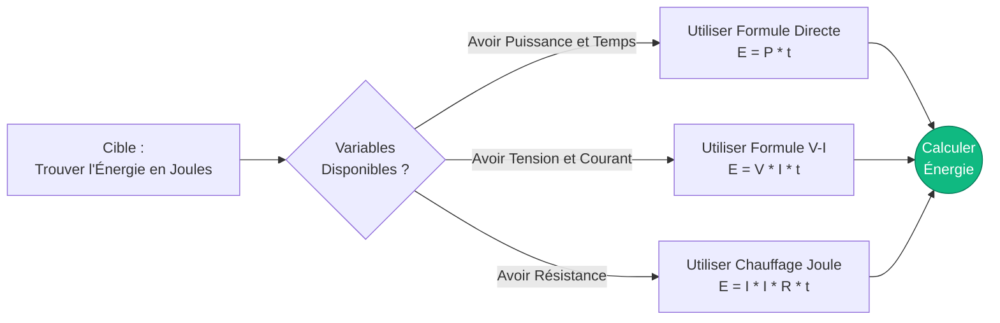
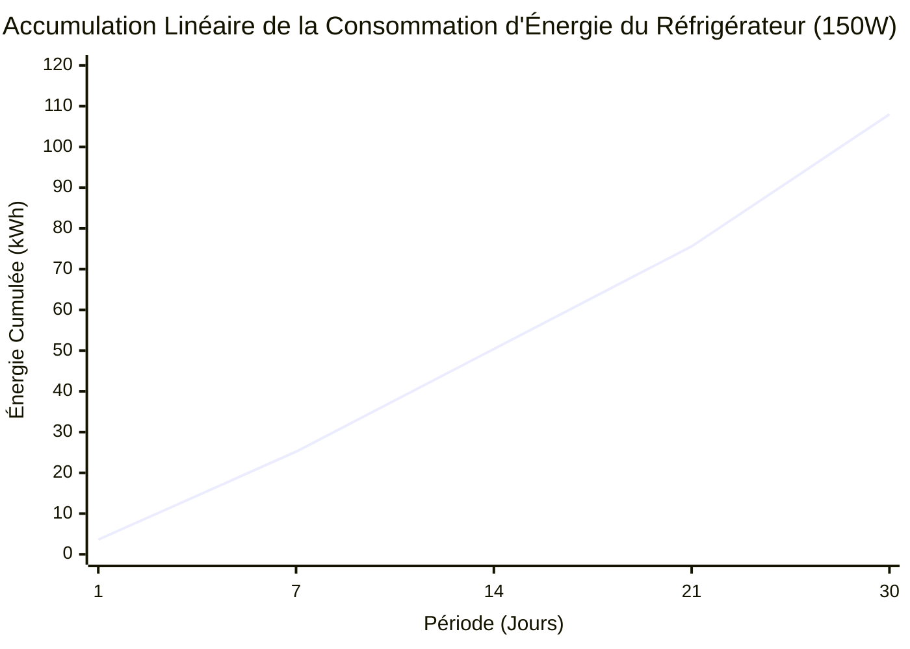
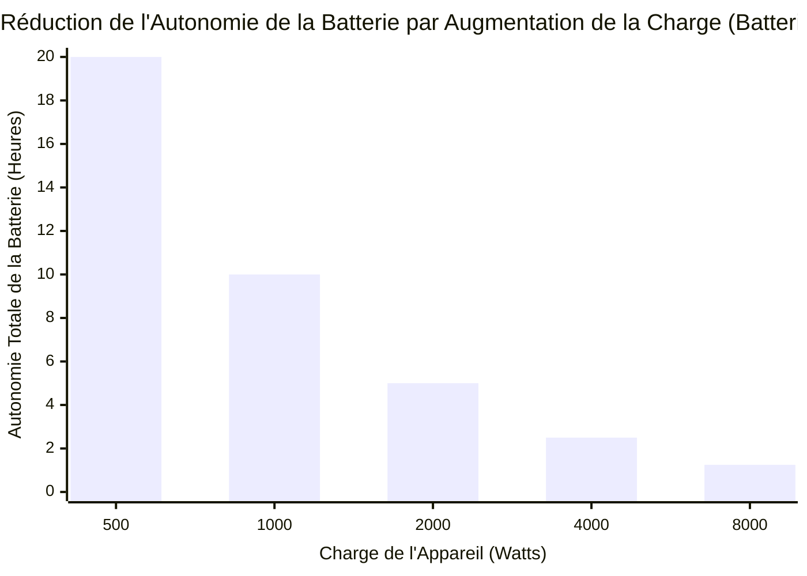
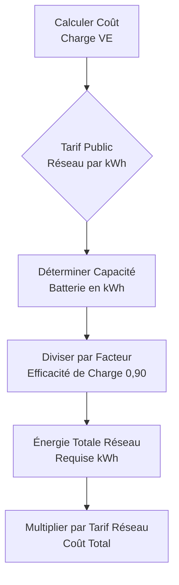
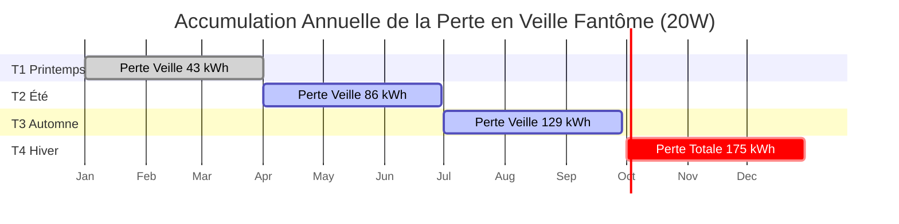

# Le Calculateur d'Énergie Électrique Définitif : kWh, Autonomie des Batteries et Recharge des VE Démystifiés

Bienvenue dans le **Calculateur d'Énergie Électrique** ultime et le guide de physique complet. Que vous effectuiez un audit énergétique rigoureux des appareils résidentiels pour réduire vos factures mensuelles de services publics, que vous dimensionniez un parc de batteries solaires hors réseau pour survivre à une énorme tempête hivernale, ou que vous calculiez mathématiquement le coût exact au kilomètre de la recharge de votre nouveau Véhicule Électrique, cette suite interactive fournit les dérivations thermodynamiques exactes dont vous avez besoin.

L'Énergie Électrique est la matière première ultime du monde moderne. Alors que la Puissance (Watts) est le taux instantané de la force électrique, l'Énergie (Joules ou Kilowattheures) est le volume accumulé de cette force effectuant un travail au fil du temps. C'est la métrique pour laquelle les entreprises de services publics vous facturent, la métrique qui dicte la distance que votre Tesla peut parcourir, et la métrique qui détermine si la batterie de votre téléphone meurt à midi.

Dans ce guide SEO exhaustif de plus de 4 000 mots, nous déconstruirons agressivement la physique de l'Énergie Électrique, explorerons les limites mathématiques de $E = P \cdot t$, décoderons le cauchemar des Tarifs de Services Publics à Paliers, analyserons la Profondeur de Décharge (DoD) des Batteries à Décharge Profonde, et décomposerons cinq scénarios électriques détaillés représentés visuellement par des diagrammes Mermaid.js interactifs et sûrs pour les parseurs.

---

## 1. Qu'est-ce Exactement que l'Énergie Électrique ? (La Définition Physique)

**L'Énergie Électrique**, scientifiquement mesurée en **Joules ($J$)**, représente le travail cumulatif total effectué ou l'énergie transférée par un circuit électrique sur une période de temps spécifique.

Si la Puissance est la vitesse de votre voiture, l'Énergie est la distance totale que vous avez parcourue.
- **Puissance** = Taux Instantané (Watts)
- **Énergie** = Volume Accumulé (Joules ou kWh)

En termes thermodynamiques stricts, $1\text{ Joule}$ est défini comme le travail effectué par le transfert de $1\text{ Watt}$ de puissance pendant exactement $1\text{ seconde}$. 
Parce qu'un Joule est une quantité d'énergie si microscopiquement petite, l'industrie électrique s'appuie universellement sur le **Kilowattheure (kWh)**.

$$1\text{ Kilowattheure (kWh)} = 3 600 000\text{ Joules}$$

Un kilowattheure est exactement ce à quoi il ressemble : faire fonctionner un équipement de $1 000\text{ Watts}$ pendant exactement $1\text{ heure}$.

---

## 2. Dériver l'Énergie de la Puissance et du Temps ($E = P \cdot t$)

L'équation fondamentale de tous les calculs d'énergie électrique est étonnamment simple :

$$E = P \cdot t$$

Où :
- $E$ est l'Énergie en Wattheures (Wh)
- $P$ est la Puissance en Watts (W)
- $t$ est le Temps en Heures (h)

Pour convertir à la norme de service public du kWh, divisez simplement par 1 000 :
$$\text{kWh} = \frac{\text{Watts} \cdot \text{Heures}}{1000}$$

En substituant mathématiquement la Loi d'Ohm ($P = V \cdot I$) dans l'équation de l'énergie, nous débloquons de puissantes dérivations d'ingénierie :
1. **Énergie dérivée de la Tension et du Courant :** $E = V \cdot I \cdot t$
2. **Énergie dérivée de la Résistance (Chauffage Joule) :** $E = I^2 \cdot R \cdot t$

---

## 3. La Menace Financière de la Puissance en Veille Fantôme

Lors de l'audit de l'énergie domestique, le coupable le plus dangereux est rarement le micro-ondes. C'est la **Puissance en Veille** (également connue sous le nom de Consommation Fantôme).

L'électronique moderne (téléviseurs, barres de son, horloges de micro-ondes, chargeurs d'ordinateurs portables) ne s'éteint pas vraiment. Elle entre en mode veille, tirant continuellement de $2\text{W}$ à $15\text{W}$ de puissance $24\text{ heures}$ par jour, $365\text{ jours}$ par an.

**Les Mathématiques de la Puissance Fantôme :**
Supposons que votre centre de divertissement (TV, Box Câble, Système Son) consomme $20\text{W}$ en mode veille.
- **Énergie Quotidienne :** $20\text{W} \cdot 24\text{ heures} = 480\text{ Wh/jour} = 0,48\text{ kWh/jour}$
- **Énergie Annuelle :** $0,48\text{ kWh/jour} \cdot 365 = 175,2\text{ kWh/an}$
- **Coût Annuel (à $0,20/\text{kWh}$) :** $175,2 \cdot 0,20 = 35,04\$$

Vous payez $35,00\$$ par an juste pour garder une lumière LED rouge allumée sur votre télévision. À l'échelle d'un foyer entier, la Puissance Fantôme coûte régulièrement aux familles plus de $150,00\$$ par an.

---

## 4. Calcul de l'Énergie Utilisable et de l'Autonomie de la Batterie

Lors du dimensionnement d'un parc de batteries de secours, vous ne pouvez pas simplement regarder l'étiquette. Une batterie "12V 100Ah" ne vous donne pas réellement $100\text{Ah}$ d'énergie utilisable.

### Profondeur de Décharge (DoD)
Différentes chimies de batteries se détruiront physiquement si vous les videz à $0\%$.
- **Acide-Plomb (AGM/Gel) :** Ne peut être déchargée en toute sécurité que jusqu'à $50\%$ de DoD.
- **Lithium Fer Phosphate (LiFePO4) :** Ne peut être déchargée en toute sécurité que jusqu'à $95\%$ de DoD.

### La Formule de l'Énergie Utilisable
$$E_{\text{utilisable}} = V \cdot \text{Capacité}_{\text{Ah}} \cdot \text{DoD} \cdot \eta_{\text{Onduleur}}$$

**Exemple :**
Vous achetez une batterie Acide-Plomb de $12\text{V}$, $100\text{Ah}$ et vous la connectez à un onduleur AC efficace à $90\%$.
- $E_{\text{utilisable}} = 12 \cdot 100 \cdot 0,50 \cdot 0,90 = 540\text{ Wattheures (Wh)}$

Si vous essayez d'alimenter un chargeur d'ordinateur portable de $100\text{W}$ à partir de cette batterie massive, l'autonomie est simplement :
$$\text{Autonomie} = \frac{540\text{Wh}}{100\text{W}} = 5,4\text{ heures}$$

---

## 5. Énergie et Coût de Recharge d'un Véhicule Électrique (VE)

Les Véhicules Électriques sont mesurés en capacité de batterie kWh, ce qui rend les mathématiques incroyablement simples.

**Le Scénario :**
Vous conduisez une Tesla Model Y avec une batterie de $75\text{kWh}$. Vous rentrez dans votre garage avec la batterie complètement vide ($0\%$). Vous la branchez sur votre chargeur domestique. Votre tarif d'électricité est de $0,15\$/\text{kWh}$.

Parce que la charge de CA à CC n'est jamais efficace à $100\%$ (de la chaleur est perdue dans les câbles de charge et le redresseur interne de la voiture), nous devons supposer une efficacité de charge typique de $90\%$.

- **Énergie Requise du Réseau :** $75\text{kWh} / 0,90 = 83,3\text{ kWh}$
- **Coût pour charger complètement :** $83,3\text{ kWh} \cdot 0,15\$ = 12,49\$$

Si la Tesla parcourt $300\text{ miles}$ avec une charge complète, votre **Coût par Mile** est :
$12,49\$ / 300 = 0,041\$\text{ par mile (4,1 cents)}.$

---

## 6. Tarifs à Paliers et Facturation en Fonction de l'Heure d'Utilisation (TOU)

Les entreprises de services publics ne facturent pas toujours un tarif forfaitaire. Elles manipulent votre facture en utilisant deux stratégies agressives pour forcer la conservation de l'énergie :

1. **Tarifs à Paliers :** On vous facture $0,12\$/\text{kWh}$ pour vos $500\text{ premiers kWh}$. Une fois que vous dépassez $501\text{ kWh}$, chaque kWh restant coûte un prix punitif de $0,25\$/\text{kWh}$. Cela punit agressivement les foyers très énergivores.
2. **Heure d'Utilisation (TOU) :** On vous facture $0,10\$/\text{kWh}$ la nuit, mais pendant les heures de "Pointe de Demande" de 16h à 21h, le tarif monte en flèche à $0,40\$/\text{kWh}$.

---

## 7. Cinq Scénarios Conceptuels d'Ingénierie avec Visualisations 2D

Pour maîtriser pleinement les relations mathématiques de l'Énergie Électrique, nous explorerons cinq scénarios physiques distincts, visuellement décomposés à l'aide de diagrammes Mermaid.js personnalisés.

### Exemple 1 : Les Dérivations de l'Équation de l'Énergie

**Le Scénario :**
Un étudiant en ingénierie a besoin d'une visualisation rapide de la façon dont l'Énergie peut être extraite mathématiquement de la Puissance, de la Tension, du Courant et de la Résistance.

**Visualisation 2D :**
Cet organigramme logique trace les trois chemins mathématiques distincts pour calculer les Wattheures en fonction des variables connues fournies dans un examen.

---

### Exemple 2 : Accumulation d'Énergie du Réfrigérateur (Linéaire)

**Le Scénario :**
Un propriétaire audite son réfrigérateur de $150\text{W}$. Il veut voir comment l'énergie s'accumule des totaux Quotidiens, aux Hebdomadaires, aux Mensuels.

**Les Mathématiques :**
À $150\text{W}$ fonctionnant 24 heures sur 24, le frigo consomme exactement $3,6\text{ kWh}$ chaque jour.

**Visualisation 2D :**
Ce graphique trace la ligne parfaitement droite de la consommation d'énergie qui s'accumule au fil du temps.

---

### Exemple 3 : Autonomie de la Batterie vs Demande de Charge (Courbe Inverse)

**Le Scénario :**
Une cabane hors réseau utilise un parc de batteries au lithium massif de $10kWh$. Le propriétaire veut savoir combien de temps la batterie durera en fonction du nombre d'appareils qu'il allume.

**Les Mathématiques :**
Puisque $\text{Temps} = \text{Énergie} / \text{Puissance}$, l'autonomie est inversement proportionnelle à la puissance de la charge.

**Visualisation 2D :**
Ce graphique à barres démontre la courbe inverse agressive. Doubler la consommation d'énergie réduit violemment l'autonomie de moitié.

---

### Exemple 4 : Logique du Coût de Recharge d'un VE

**Le Scénario :**
Un nouveau propriétaire de VE doit comprendre exactement comment ses coûts de recharge sont mathématiquement dérivés des tarifs du réseau et de la capacité de la batterie.

**Visualisation 2D :**
Cet organigramme de haut en bas catégorise strictement les mathématiques requises pour calculer le coût exact d'une charge complète de VE, en tenant compte des pertes d'efficacité de charge.

---

### Exemple 5 : Accumulation Annuelle des Coûts de la Puissance Fantôme

**Le Scénario :**
Un auditeur énergétique suit la fuite financière terrifiante d'un centre de divertissement de $20\text{W}$ laissé en mode veille pendant une année entière.

**Visualisation 2D :**
Ce diagramme de Gantt souligne la sombre réalité de la Puissance Fantôme, enregistrant le drain constant et interminable d'électricité chaque saison.

---

## 8. Conclusion et Défi d'Ingénierie

Maîtriser l'Énergie Électrique ($E = P \cdot t$) est la clé absolue de l'indépendance énergétique et de l'efficacité financière. Comprendre la différence stricte entre les Watts (puissance instantanée) et les Wattheures (énergie accumulée) vous permet de dimensionner correctement les parcs solaires hors réseau, d'auditer avec précision les factures de services publics des ménages et de prouver mathématiquement le ROI de la mise à niveau vers l'éclairage LED.

Si vous respectez la physique de l'Énergie, vous pouvez réduire considérablement vos factures de services publics et vous assurer que vos parcs de batteries survivront à la nuit. Si vous l'ignorez, la Puissance Fantôme et les appareils lourds videront silencieusement votre portefeuille.

Pour garantir que vous avez maîtrisé ces concepts, lancez notre Simulateur interactif et essayez de relever ces derniers défis :
1. **La Mise à Niveau de l'Éclairage :** Vous remplacez cinq ampoules incandescentes de $60\text{W}$ par cinq LED de $10\text{W}$. Elles fonctionnent pendant $8\text{ heures}$ par jour. Calculez l'Énergie Économisée exacte en kWh par mois.
2. **La Cabane Hors Réseau :** Vous devez faire fonctionner un réfrigérateur de $200\text{W}$ pendant $24\text{ heures}$ consécutives. Si vous avez un système de batterie Acide-Plomb de $12\text{V}$ (DoD à $50\%$), calculez la capacité minimale absolue en Ampères-heures (Ah) requise pour survivre à la nuit.
3. **Le Superchargeur :** Un Superchargeur Tesla pompe $250\text{kW}$ de puissance dans une voiture pendant exactement $15\text{ minutes}$. Calculez l'Énergie totale livrée en kWh.

Fiez-vous à ce calculateur pour vérifier vos calculs, auditer vos appareils électroménagers et souvenez-vous toujours : L'Énergie est la vérité accumulée de la puissance électrique au fil du temps.
