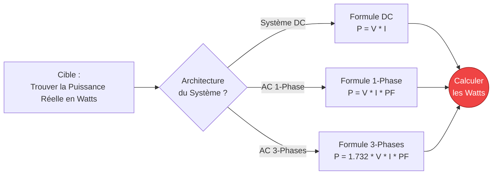
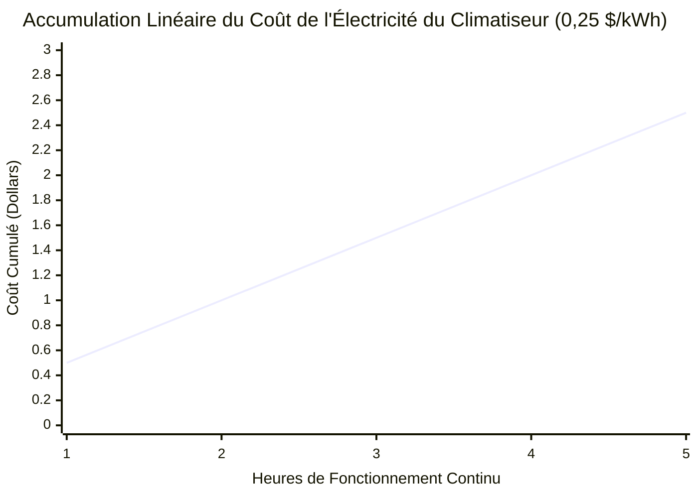
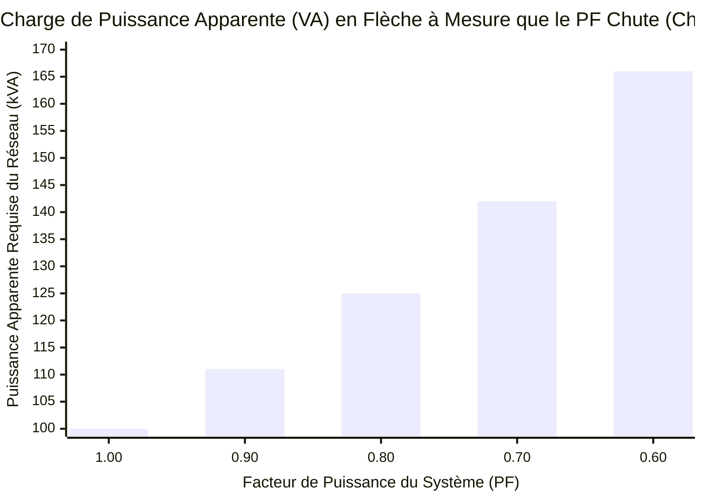
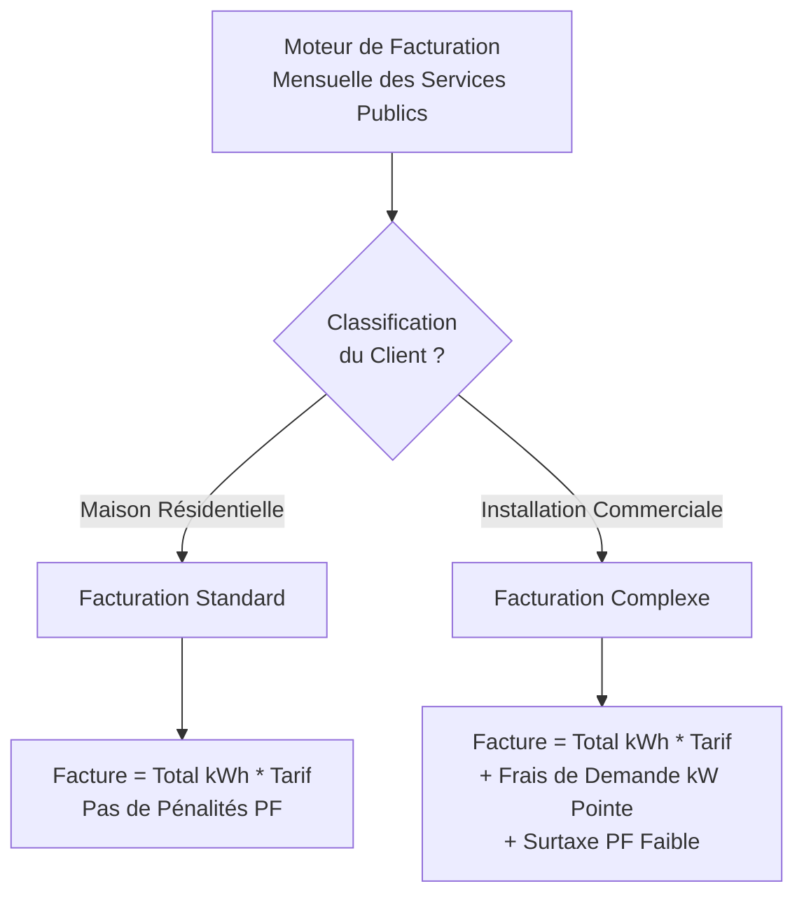

# Le Calculateur Définitif de Puissance Électrique : Puissance Réelle, Apparente et Réactive Démystifiées

Bienvenue dans l'ultime **Calculateur de Puissance Électrique** et guide physique complet. Que vous dimensionniez un énorme générateur industriel triphasé, calculiez la terrifiante facture d'électricité mensuelle d'un vieux climatiseur, ou essayiez de comprendre pourquoi votre installation commerciale est pénalisée pour un mauvais Facteur de Puissance, cette suite interactive fournit la clarté mathématique exacte dont vous avez besoin.

La Puissance Électrique est la vitesse absolue à laquelle l'énergie électrique effectue un travail. Alors que la Tension ($V$) est la pression et que le Courant ($I$) est le flux, la Puissance ($P$, mesurée en Watts) est le muscle résultant réel. C'est la chaleur rayonnant de votre radiateur d'appoint, le couple faisant tourner votre moteur Tesla et la lumière aveuglante émise par une LED.

Dans ce guide SEO exhaustif de plus de 4 000 mots, nous détaillerons agressivement la physique de la Puissance DC, la trigonométrie complexe des Triangles de Puissance AC, la dure réalité de la Puissance Réactive (VARs) et les mathématiques financières de la facturation au kilowattheure (kWh), avec cinq diagrammes Mermaid.js méticuleusement conçus et sûrs pour l'analyseur.

---

## 1. Qu'est-ce que la Puissance Électrique Exactement ? (La Définition Physique)

La **Puissance Électrique**, scientifiquement mesurée en **Watts ($W$)**, est la vitesse fondamentale à laquelle l'énergie électrique est transférée, consommée ou dissipée par un circuit par seconde. 

En termes thermodynamiques stricts, $1\text{ Watt}$ est défini comme le transfert d'exactement $1\text{ Joule}$ d'énergie par seconde. 
- Si vous laissez une ampoule de $100\text{W}$ allumée pendant exactement 1 seconde, elle consomme $100\text{ Joules}$ d'énergie.
- Si vous la laissez allumée pendant une heure ($3 600\text{ secondes}$), elle consomme $360 000\text{ Joules}$. (C'est pourquoi nous facturons en kWh, car les Joules deviennent astronomiquement énormes très rapidement !)

Pour trouver la puissance brute de tout composant électrique de base, il vous suffit de multiplier la pression électrique à travers celui-ci par le volume d'électrons le traversant :
$$P = V \cdot I$$

---

## 2. Dérivation de la Puissance avec la Loi d'Ohm

La Loi d'Ohm ($V = I \cdot R$) nous permet de substituer mathématiquement les variables dans l'équation de la puissance, ce qui nous donne deux raccourcis d'ingénierie incroyablement utiles :

1. **Puissance dérivée du Courant et de la Résistance :** $P = I^2 \cdot R$
   - Cette formule représente le **Chauffage par Effet Joule** (ou pertes cuivre $I^2R$). C'est la formule que les compagnies d'électricité utilisent pour calculer la quantité de puissance gaspillée sous forme de chaleur brute le long de centaines de kilomètres de lignes de transmission.
2. **Puissance dérivée de la Tension et de la Résistance :** $P = \frac{V^2}{R}$
   - Cette formule est utilisée par les concepteurs d'appareils ménagers. Puisque la tension murale est toujours fixée à $120\text{V}$, un ingénieur peut calculer exactement combien d'Ohms de bobine chauffante couper pour produire un grille-pain de $1 500\text{W}$.

---

## 3. Le Cauchemar de la Puissance AC : Le Triangle des Puissances

Dans les circuits DC (Courant Continu), la puissance est une mathématique simple. $P = V \cdot I$. Fin de l'histoire.

Dans les circuits AC (Courant Alternatif), la tension et le courant oscillent constamment dans une onde sinusoïdale. Si le circuit contient des Inductances (moteurs, transformateurs) ou des Condensateurs, l'onde sinusoïdale du courant est physiquement retardée ou avancée, se désynchronisant de l'onde sinusoïdale de tension. Cela crée un phénomène d'ingénierie terrifiant connu sous le nom de **Déphasage**, donnant naissance au Triangle des Puissances AC.

### Puissance Réelle ($P$, mesurée en Watts)
C'est la puissance réelle, physique, effectuant un travail utile. C'est la chaleur dans le grille-pain et le couple dans le moteur. Elle est calculée en prenant la puissance brute et en la multipliant par le Facteur de Puissance (le cosinus de l'angle de déphasage).
- **Formule :** $P = V \cdot I \cdot \cos\phi$

### Puissance Apparente ($S$, mesurée en Volt-Ampères ou VA)
C'est la puissance brute totale que la compagnie d'électricité doit générer et pousser dans les fils pour alimenter votre installation. Elle ignore totalement le déphasage.
- **Formule :** $S = V \cdot I$

### Puissance Réactive ($Q$, mesurée en VARs)
C'est la puissance "fantôme". C'est une puissance qui oscille de va-et-vient entre les champs magnétiques de vos moteurs et le réseau électrique. Elle n'effectue absolument AUCUN travail utile, mais elle encombre complètement les lignes électriques, causant une chaleur extrême et une inefficacité.
- **Formule :** $Q = V \cdot I \cdot \sin\phi$

---

## 4. Facteur de Puissance ($\text{PF}$) et Pénalités des Services Publics

Le **Facteur de Puissance ($\text{PF}$)** est le rapport strict de la Puissance Réelle (travail utile) à la Puissance Apparente (charge totale du réseau).

$$\text{PF} = \frac{\text{Puissance Réelle (W)}}{\text{Puissance Apparente (VA)}}$$

- **$\text{PF} = 1.0$ (Parfait) :** Une charge purement résistive comme un radiateur d'appoint. $100\%$ de la puissance tirée du réseau est convertie en chaleur.
- **$\text{PF} = 0.70$ (Terrible) :** Une usine massive de moteurs industriels. Seulement $70\%$ de la puissance effectue un travail physique. Les $30\%$ restants sont de la Puissance Réactive inutile ballotant violemment de va-et-vient sur les lignes du service public.

Parce que la Puissance Réactive encombre le réseau et brûle les transformateurs, les compagnies d'électricité surveillent activement les Facteurs de Puissance commerciaux. Si votre usine tombe en dessous de $\text{PF} 0.85$, le service public vous frappera avec de dévastatrices **Surtaxes de Pénalité de Facteur de Puissance** sur votre facture mensuelle.

Pour y remédier, les usines installent des racks massifs de **Condensateurs de Correction de Facteur de Puissance** pour injecter la puissance réactive localement, la gardant hors du réseau public.

---

## 5. Puissance AC Triphasée ($1.732$)

Pour des charges industrielles massives, la puissance monophasée est insuffisante. Le monde fonctionne sur la puissance AC Triphasée, où trois ondes sinusoïdales séparées sont transmises simultanément, décalées de $120^\circ$. 

Puisque les trois phases se chevauchent, elles fournissent une puissance mathématiquement constante et fluide, sans aucun vide. Pour calculer la Puissance Réelle d'un système triphasé équilibré, nous devons multiplier par la racine carrée de 3 ($\sqrt{3} \approx 1.732$).

**Formule de la Puissance Réelle Triphasée :**
$$P = \sqrt{3} \cdot V_{\text{ligne}} \cdot I_{\text{ligne}} \cdot \text{PF}$$

Si vous avez un moteur triphasé de $480\text{V}$ tirant $50\text{A}$ avec un $\text{PF}$ de 0,85 :
$P = 1.732 \cdot 480 \cdot 50 \cdot 0.85 = 35 332\text{ W}$ ($35.3\text{ kW}$).

---

## 6. Comprendre les Kilowattheures (kWh) et la Facturation d'Électricité

Votre compagnie d'électricité ne vous facture pas les Watts (Puissance). Elle vous facture les **Kilowattheures (Énergie)**.

Un kilowattheure (kWh) consiste simplement à faire fonctionner $1 000\text{ Watts}$ d'équipement pendant exactement $1\text{ heure}$.

### La Formule du kWh :
$$\text{kWh} = \frac{\text{Watts} \cdot \text{Heures}}{1000}$$

**Exemple :**
Si vous laissez un radiateur de $1 500\text{W}$ fonctionner pendant $12\text{ heures}$ par jour, combien cela coûte-t-il dans un mois de 30 jours si votre tarif d'électricité est de 0,15 $\$$ par kWh ?

1. **Calculer le kWh Quotidien :** $\frac{1500 \cdot 12}{1000} = 18\text{ kWh/jour}$
2. **Calculer le kWh Mensuel :** $18 \cdot 30 = 540\text{ kWh/mois}$
3. **Calculer le Coût :** $540 \cdot 0,15 \$ = 81,00 \$$

Ce seul radiateur vous coûte **81,00 $\$$ chaque mois !**

---

## 7. Cinq Scénarios d'Ingénierie Conceptuels avec des Visualisations 2D

Pour maîtriser pleinement les relations mathématiques de la Puissance Électrique, nous allons explorer cinq scénarios physiques distincts, décomposés visuellement à l'aide de diagrammes Mermaid.js personnalisés.

### Exemple 1 : La Topologie de l'Équation de Puissance

**Le Scénario :**
Un étudiant en ingénierie a besoin d'une visualisation rapide de la façon de calculer la Puissance en Watts à travers des systèmes DC, Monophasés et Triphasés.

**Visualisation 2D :**
Cet organigramme logique cartographie les trois voies mathématiques distinctes pour calculer les Watts en fonction de l'architecture électrique.

---

### Exemple 2 : Accumulation du Coût Énergétique d'un Appareil Résidentiel

**Le Scénario :**
Un propriétaire veut voir exactement à quelle vitesse un climatiseur de $2 000\text{W}$ vide son portefeuille sur une période de 5 heures au tarif exorbitant de 0,25 $\$$ par kWh.

**Les Mathématiques :**
À $2 000\text{W}$, le climatiseur consomme exactement $2\text{ kWh}$ chaque heure. À $0,25/\text{kWh}$, cela fait 0,50 $\$$ par heure, augmentant de manière parfaitement linéaire.

**Visualisation 2D :**
Ce graphique trace la ligne parfaitement droite du coût financier qui s'accumule d'heure en heure.

---

### Exemple 3 : La Menace d'un Mauvais Facteur de Puissance

**Le Scénario :**
Un directeur d'usine tire $100\text{kW}$ de Puissance Réelle. Il veut voir comment la charge de la Puissance Apparente (VA) sur le réseau monte en flèche à mesure que son Facteur de Puissance (efficacité) se détériore.

**Les Mathématiques :**
Puisque $\text{PF} = P / S$, à mesure que $\text{PF}$ baisse, la Puissance Apparente ($S$) requise pour effectuer la même quantité de travail augmente considérablement.

**Visualisation 2D :**
Ce graphique à barres démontre la relation inverse agressive. Même si l'usine n'effectue que $100\text{kW}$ de travail réel, à un $\text{PF}$ de 0,60, le réseau doit dangereusement fournir $166\text{kVA}$ de courant pour supporter les champs magnétiques !

---

### Exemple 4 : Logique de Facturation Résidentielle vs Commerciale

**Le Scénario :**
Un propriétaire d'entreprise ne comprend pas pourquoi la facture d'électricité de son entrepôt est mathématiquement différente de celle de sa maison, même s'il a consommé le même total de kWh.

**Visualisation 2D :**
Cet organigramme de haut en bas catégorise la dure réalité de la facturation Commerciale, qui introduit des Frais de Demande (kW Pointe) et des Surtaxes de PF auxquels les maisons Résidentielles sont totalement immunisées.

---

### Exemple 5 : Démarrage d'un Onduleur Solaire et Synchronisation au Réseau

**Le Scénario :**
Une installation solaire résidentielle de 10kW se réveille le matin. L'alimentation DC doit être convertie en toute sécurité en alimentation AC, synchronisée avec le réseau électrique chaotique de 60Hz, et exportée parfaitement sans provoquer de court-circuit.

**Visualisation 2D :**
Ce diagramme de Gantt décrit la séquence de synchronisation rigoureuse et hautement automatisée qu'un onduleur connecté au réseau moderne doit exécuter avant de permettre aux watts solaires de circuler dans la maison.

```mermaid
gantt
    title Séquence de Réveil de l'Onduleur Solaire et de Synchronisation au Réseau
    dateFormat  HH:mm:ss
    axisFormat  %H:%M:%S
    
    section Démarrage DC
    Détection d'une Tension MPPT Solaire Suffisante :done, 00:00:00, 15s
    Démarrage du CPU Interne et Diagnostics :active, 00:00:15, 15s
    
    section Synchro AC
    Échantillonnage de la Tension et Fréquence du Réseau :active, 00:00:30, 10s
    Synchronisation de la Boucle à Verrouillage de Phase sur 60Hz :crit, 00:00:40, 10s
    
    section Exportation
    Fermeture des Relais AC :active, 00:00:50, 05s
    Montée en Puissance de l'Exportation de Watts AC :milestone, 00:00:55, 0s
```

---

## 8. Conclusion et Défi d'Ingénierie

Maîtriser la Puissance Électrique sépare les amateurs des vrais ingénieurs électriciens. Comprendre que les Watts font le travail, les VARs construisent les champs magnétiques, et les VA sont ce qui fait fondre les fils est la clé absolue pour concevoir une infrastructure électrique sûre et hautement efficace.

Si vous respectez le Triangle des Puissances et corrigez activement votre Facteur de Puissance, vos installations industrielles fonctionneront parfaitement froides et vos factures d'électricité chuteront. Si vous sous-estimez la Puissance Réactive, vos transformateurs surchaufferont violemment, vos disjoncteurs se déclencheront et vous serez pénalisé financièrement par le réseau électrique.

Pour garantir que vous avez maîtrisé ces concepts, lancez notre Simulateur interactif et essayez de relever ces défis finaux :
1. **La Baie de Serveurs :** Une énorme installation de minage crypto tire continuellement $30\text{A}$ à $240\text{V}$ DC. Calculez la Puissance DC exacte ($P = V \cdot I$) en kW.
2. **La Zone de Pénalité :** Un moteur commercial tire $50\text{kW}$ de Puissance Réelle, mais le Facteur de Puissance est un misérable 0,65. Calculez la terrifiante Puissance Apparente ($S = P / \text{PF}$) en kVA que le réseau est forcé de fournir.
3. **Le Drain Vampire :** Votre énorme télévision de 85 pouces utilise $15\text{W}$ de puissance *lorsqu'elle est éteinte* en mode veille. Si l'électricité est à 0,20 $\$$/kWh, calculez exactement combien d'argent vous brûlez par an (8 760 heures) juste en la laissant branchée.

Fiez-vous à ce calculateur pour vérifier vos mathématiques, cartographier instantanément vos Triangles de Puissances, et rappelez-vous toujours : la Puissance est la mesure ultime de la vérité thermodynamique dans le monde électrique.
