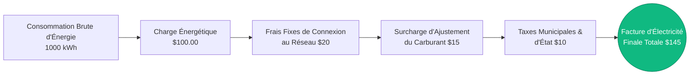
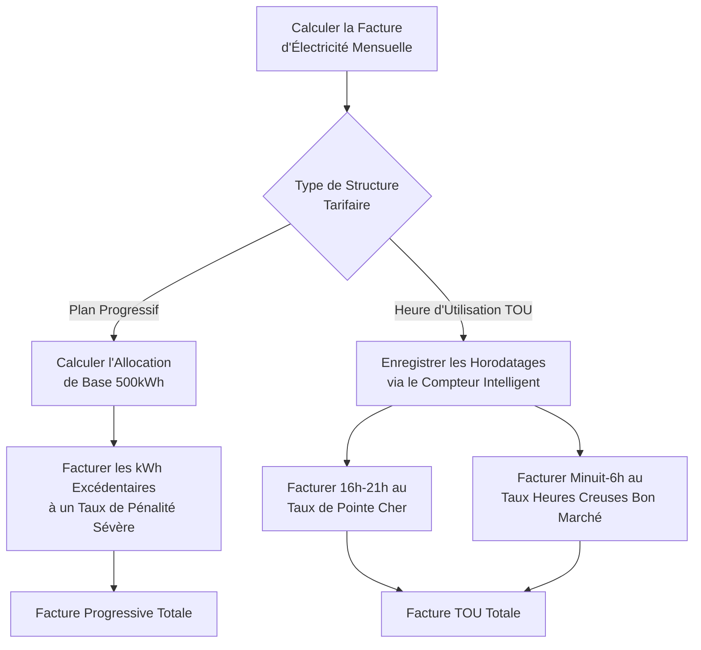
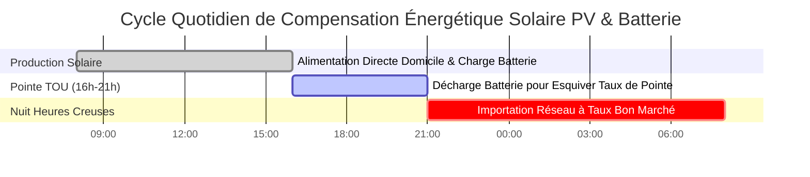

# Le Calculateur de Coût de l'Électricité Définitif : Factures d'Énergie, Tarifs et Audits Énergétiques des Appareils

Bienvenue dans le guide ultime de gestion des factures d'énergie et du **Calculateur de Coût de l'Électricité**. Que vous soyez un propriétaire désespéré de découvrir pourquoi sa facture de climatisation estivale a grimpé à $\$400$, un gestionnaire d'installations commerciales tentant d'esquiver mathématiquement les frais de puissance appelée punitifs ($/kW), ou un futur propriétaire de Véhicule Électrique (VE) calculant exactement combien la recharge à domicile compensera son budget essence, maîtriser la thermodynamique et les algorithmes financiers du coût de l'électricité est obligatoire.

Votre facture d'électricité mensuelle n'est pas un chiffre unique et simple. Il s'agit d'un algorithme complexe et agressivement structuré, conçu par les compagnies d'électricité pour maximiser les revenus tout en forçant les consommateurs à conserver l'énergie pendant les heures de pointe. Il mélange la consommation d'énergie brute (Kilowatt-Heures), les multiplicateurs stricts de l'Heure d'Utilisation (TOU), les frais de service fixes incontournables, et les surcharges brutales d'ajustement du carburant.

Dans cette masterclass SEO exhaustive de plus de 4 000 mots, nous allons déconstruire l'équation fondamentale $kWh \times \text{Tarif}$, décoder mathématiquement la réalité terrifiante des structures de Facturation Progressives, exposer l'hémorragie financière causée par la Consommation Fantôme en Veille, et projeter les coûts d'électricité sur 10 ans en utilisant des taux d'inflation réalistes. Pour vous assurer de comprendre parfaitement ces concepts financiers, nous avons conçu cinq diagrammes interactifs Mermaid.js méticuleusement détaillés et compatibles avec les analyseurs.

---

## 1. Déconstruction de la Formule de la Facture d'Énergie

La fondation absolue du coût de l'électricité est le **Kilowatt-Heure (kWh)**. Les compagnies d'électricité ne vous facturent pas pour la puissance instantanée (Watts) ; elles vous facturent pour *l'accumulation* de cette puissance au fil du temps (Énergie).

**La Formule Fondamentale :**
$$\text{Coût} = \text{Énergie Totale (kWh)} \times \text{Tarif (\$/kWh)}$$

Pour calculer le coût d'un seul appareil, vous devez d'abord calculer sa consommation d'énergie :
$$\text{Énergie (kWh)} = \frac{\text{Puissance (Watts)} \times \text{Temps (Heures)}}{1000}$$

Cependant, la facture finale que vous recevez par la poste est nettement plus complexe.

**L'Équation de la Facture Totale Réelle :**
$$\text{Facture Totale} = (\text{Énergie kWh} \times \text{Tarif}) + \text{Frais de Service Fixes} + \text{Frais de Puissance Appelée} + \text{Taxes}$$

Si vous consommez $1000\text{ kWh}$ à $\$0,15/\text{kWh}$, votre charge énergétique est de $\$150,00$. Mais une fois que la compagnie d'électricité ajoute des frais de connexion au réseau de $\$20,00$, une surcharge de carburant de $\$15,00$ et des taxes municipales de $8\%$, votre facture totale grimpe à $\$199,80$. Cela crée un **Tarif Effectif** de $\$0,20/\text{kWh}$—qui est le vrai chiffre que vous devez utiliser lors du calcul du coût des appareils.

---

## 2. Les Trois Grands : Comprendre les Structures Tarifaires des Services Publics

Les monopoles de l'énergie utilisent trois structures de facturation principales pour facturer les clients résidentiels et commerciaux.

### A. Facturation à Taux Fixe
La structure tarifaire la plus simple, mais de plus en plus rare. Chaque kilowatt-heure que vous consommez, de jour comme de nuit, coûte exactement le même montant. 
*Exemple : $\$0,16$ par kWh, 24h/24 et 7j/7.*

### B. Tarifs Progressifs (Par Paliers)
Une structure punitive conçue pour sanctionner brutalement les foyers très énergivores. La compagnie vous accorde une allocation de "base" à un tarif avantageux. Une fois ce seuil franchi, le tarif monte en flèche.
*Exemple :* 
- Palier 1 : $0 \to 500\text{ kWh}$ coûte $\$0,12/\text{kWh}$.
- Palier 2 : $501 \to 1000\text{ kWh}$ coûte $\$0,22/\text{kWh}$.
- Palier 3 : $1001+\text{ kWh}$ coûte $\$0,35/\text{kWh}$.

Si vous faites fonctionner un gros Climatiseur et poussez votre maison dans le Palier 3, chaque heure supplémentaire de climatisation coûte près du triple du tarif de base.

### C. Tarification Selon l'Heure d'Utilisation (TOU)
La norme moderne pour les réseaux à compteurs intelligents. La compagnie vous facture en fonction du *moment* où vous utilisez l'électricité, et pas seulement de la quantité.
- **Heures Creuses (Minuit à 6h) :** $\$0,08/\text{kWh}$ (Idéal pour recharger les VE).
- **Heures Médianes (Matin) :** $\$0,15/\text{kWh}$.
- **Heures de Pointe (16h à 21h) :** $\$0,45/\text{kWh}$ (Le réseau est sollicité par les travailleurs qui rentrent).

Sous un plan TOU, faire fonctionner votre sèche-linge électrique à 18h est un suicide financier.

---

## 3. L'Audit Énergétique des Appareils : Trouver les Gouffres

Pour réduire votre facture d'électricité, vous devez auditer impitoyablement vos appareils électroménagers. Tous les appareils ne se valent pas. 

### Les Gros Gouffres (Chauffage et Climatisation)
Tout appareil qui modifie la température (climatiseurs, radiateurs d'appoint, fours électriques, chauffe-eau, sèche-linge) consomme des quantités massives d'énergie. 
- Un Climatiseur central consomme environ $3500\text{ Watts}$. Le faire fonctionner pendant $8\text{ heures}$ consomme $28\text{ kWh}$ par jour. À $\$0,15/\text{kWh}$, cela fait $\$4,20$ chaque jour, soit $\$126,00$ par mois.

### L'Hémorragie Silencieuse (Consommation Fantôme)
Les appareils électroniques modernes (TV, barres de son, consoles de jeux) ne s'éteignent jamais vraiment. Ils entrent en "mode veille", consommant constamment de $10\text{W}$ à $20\text{W}$.
- Un centre de divertissement de $20\text{W}$ laissé en veille 24h/24 et 7j/7 consomme $14,4\text{ kWh}$ par mois. Sur un an, cela vous coûte $\$26,00$ juste pour garder une petite lumière LED rouge allumée.

### Les Héros de l'Efficacité (Éclairage LED)
Une ampoule à incandescence traditionnelle consomme $60\text{ Watts}$. Une ampoule LED équivalente consomme $9\text{ Watts}$. En remplaçant 10 ampoules qui fonctionnent 6 heures par jour, vous économisez environ $90\text{ kWh}$ par mois, réduisant immédiatement votre facture de $\$13,50$.

---

## 4. Coûts de Recharge à Domicile des Véhicules Électriques (VE)

L'essence coûte cher ; les électrons sont bon marché. Mais à quel point ?

Pour calculer le coût d'une recharge complète de VE, vous avez besoin de la capacité de la batterie et de l'efficacité du réseau (puisque la conversion AC vers DC perd environ 10 % en chaleur).
$$\text{Coût de Recharge} = \frac{\text{kWh de la Batterie}}{\text{Efficacité 0,90}} \times \text{Tarif}$$

Pour une Tesla Model Y (batterie de $75\text{kWh}$) en charge à un tarif fixe de $\$0,15/\text{kWh}$ :
- Énergie réseau requise : $75 / 0,90 = 83,3\text{ kWh}$
- Coût Total : $83,3 \times 0,15 = \$12,49$ pour un "plein".

Si cette Tesla parcourt $300\text{ miles}$ avec une charge complète, votre **Coût Par Mile** est d'un microscopique $\$0,04$ (4 cents). Comparez cela à une voiture à essence consommant $25\text{ MPG}$ à $\$3,50/\text{gallon}$, qui coûte $\$0,14$ par mile.

---

## 5. Projections sur Dix Ans et Inflation de l'Électricité

Les tarifs d'électricité ne baissent jamais. Historiquement, ils connaissent une inflation moyenne de $3\%$ à $4\%$ par an en raison de la maintenance du réseau, des coûts des carburants et de l'inflation générale.

Si votre facture mensuelle actuelle d'électricité est de $\$200$ ( $\$2 400$/an ), et que votre compagnie d'électricité augmente ses tarifs de $4\%$ chaque année :
- Année 1 : $\$2 400$
- Année 5 : $\$2 807$
- Année 10 : $\$3 415$

Sur une période de 10 ans, vous paierez à la compagnie d'électricité la somme faramineuse de **$\$28 814$**. Ces mathématiques terrifiantes sont exactement la raison pour laquelle les propriétaires investissent $\$15 000$ dans des systèmes solaires PV pour bloquer leurs coûts énergétiques et éliminer la courbe de l'inflation.

---

## 6. Cinq Scénarios d'Ingénierie Conceptuels avec Visualisations 2D

Pour maîtriser pleinement les algorithmes financiers de la facturation d'électricité, nous allons explorer cinq scénarios distincts, décomposés visuellement à l'aide de diagrammes Mermaid.js personnalisés.

### Exemple 1 : L'Anatomie d'une Facture d'Électricité

**Le Scénario :**
Un propriétaire ne comprend pas pourquoi son calcul d'énergie ($1000\text{ kWh} \times \$0,10$) donne $\$100$, mais sa facture réelle est de $\$145$. 

**Visualisation 2D :**
Cet organigramme logique déconstruit les frais cachés et les taxes que les compagnies d'électricité empilent par-dessus la consommation brute d'énergie pour générer la facture finale.



---

### Exemple 2 : Les Gouffres Énergétiques des Appareils Électroménagers

**Le Scénario :**
Un auditeur énergétique décortique l'énorme facture mensuelle de $\$300$ d'une maison pour montrer aux propriétaires exactement quels appareils vident leur portefeuille.

**Les Mathématiques :**
Les systèmes de CVC (chauffage, ventilation, climatisation) et les chauffe-eau dominent universellement la consommation électrique résidentielle, tandis que l'électronique moderne compte à peine.

**Visualisation 2D :**
Ce graphique à barres classe de manière agressive les 5 appareils ménagers les plus énergivores par leur consommation mensuelle en kWh, exposant les véritables coupables des factures élevées.

```mermaid
xychart-beta
    title "Consommation d'Énergie Résidentielle Mensuelle par Appareil (kWh)"
    x-axis "Appareils Électroménagers" [Climatisation Centrale, Chauffe-Eau, Chargeur VE, Réfrigérateur, Éclairage LED]
    y-axis "Énergie Mensuelle (kWh)" 0 --> 900
    bar [840, 180, 150, 108, 12]
```

---

### Exemple 3 : Coût Cumulé sur 10 Ans (Avec 4 % d'Inflation)

**Le Scénario :**
Un vendeur de panneaux solaires démontre la réalité brutale d'une facture d'électricité de $\$200$/mois composée sur une décennie avec une inflation annuelle des services publics de $4\%$.

**Les Mathématiques :**
Les intérêts composés jouent contre le consommateur. $2400 \times (1,04)^n$ entraîne une courbe de dépenses exponentielle et inévitable.

**Visualisation 2D :**
Ce graphique trace les dollars cumulés terrifiants versés à la compagnie d'électricité sur une chronologie de 10 ans.

```mermaid
xychart-beta
    title "Dépenses Cumulées de Facture d'Électricité sur 10 Ans (4% d'Inflation Annuelle)"
    x-axis "Chronologie (Années)" [Année 1, Année 3, Année 5, Année 7, Année 10]
    y-axis "Coût Cumulé ($)" 0 --> 30000
    line [2400, 7552, 13240, 19592, 28814]
```

---

### Exemple 4 : Facturation Progressive vs Logique Selon l'Heure d'Utilisation (TOU)

**Le Scénario :**
Un client décide s'il doit rester sur son forfait Progressif standard ou passer à un plan moderne Selon l'Heure d'Utilisation pour recharger son VE la nuit.

**Visualisation 2D :**
Cet organigramme vertical mappe la logique algorithmique stricte que la compagnie d'électricité utilise pour facturer le client sous les deux structures tarifaires concurrentes.



---

### Exemple 5 : Cycle de Compensation de Réseau Solaire PV et Batterie

**Le Scénario :**
Un propriétaire installe un réseau solaire de $10\text{kW}$ et un Tesla Powerwall. Il a besoin de visualiser comment le système esquive la tarification de pointe TOU et compense les importations du réseau.

**Visualisation 2D :**
Ce diagramme de Gantt décrit le cycle quotidien sur 24 heures de la production d'énergie, de la décharge de la batterie pendant les heures de Pointe, et du recours au réseau uniquement pendant les heures Creuses nocturnes bon marché.



---

## 7. Conclusion et Défi Financier

Maîtriser le calcul des Coûts de l'Électricité est la clé absolue de l'efficacité financière et du budget du ménage. Comprendre la différence entre les tarifs bruts en kWh et le Tarif Effectif, éviter les pénalités de pointe selon l'Heure d'Utilisation, traquer la consommation fantôme des appareils en veille, et reconnaître la menace grandissante de l'inflation de l'électricité vous fera économiser des dizaines de milliers de dollars sur une décennie.

Si vous payez aveuglément votre facture tous les mois sans en comprendre les mathématiques sous-jacentes, la compagnie d'électricité maximisera agressivement ses revenus à vos dépens.

Pour garantir que vous avez maîtrisé ces concepts financiers, démarrez notre Simulateur interactif et tentez de relever ces derniers défis :
1. **La Pénalité de Palier :** Vous consommez $1200\text{ kWh}$ ce mois-ci. Le Palier 1 ($0-500\text{ kWh}$) est à $\$0,10$. Le Palier 2 ($501-1000\text{ kWh}$) est à $\$0,20$. Le Palier 3 ($1001+\text{ kWh}$) est à $\$0,35$. Calculez la charge énergétique totale exacte.
2. **Le Tarif Effectif :** Votre charge énergétique est de $\$120,00$ pour $800\text{ kWh}$. La compagnie d'électricité ajoute des frais de connexion de $\$25,00$ et $\$15,00$ de taxes. Calculez votre Vrai Tarif Effectif par kWh.
3. **Le ROI des LED :** Vous remplacez vingt ampoules à incandescence de $60\text{W}$ par vingt LED de $10\text{W}$. Elles fonctionnent $5\text{ heures}$ par jour. À $\$0,15/\text{kWh}$, combien de dollars exactement économiserez-vous sur un mois de 30 jours ?

Fiez-vous à ce calculateur pour auditer vos appareils, modéliser vos coûts de recharge de VE, et surpasser mathématiquement en permanence les algorithmes de facturation de votre compagnie d'électricité.
