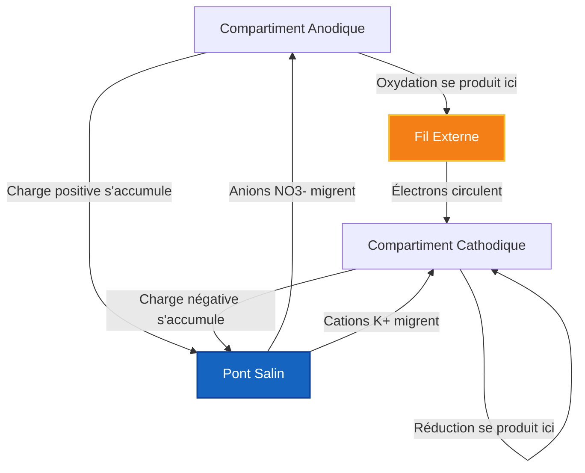

# Guide de Laboratoire & d'Électrochimie Analytique sur les Cellules Électrochimiques

En chimie physique et en ingénierie électrochimique, une **cellule électrochimique** couple une demi-réaction d'oxydation à l'**anode** avec une demi-réaction de réduction à la **cathode** :

$$E_{\text{cell}}^\circ = E_{\text{cathode}}^\circ - E_{\text{anode}}^\circ$$

$$E_{\text{cell}} = E_{\text{cell}}^\circ - \frac{R T}{n F} \ln Q \quad \left(\text{À } 25^\circ\text{C} \implies E_{\text{cell}} = E_{\text{cell}}^\circ - \frac{0.05916}{n} \log_{10} Q\right)$$

$$\text{Notation de Cellule IUPAC : } \text{Anode}(s) \mid \text{Anode}^{n+}(aq, c_1) \parallel \text{Cathode}^{m+}(aq, c_2) \mid \text{Cathode}(s)$$

$$\Delta G = -n F E_{\text{cell}} \quad \text{et} \quad \Delta G^\circ = -n F E_{\text{cell}}^\circ = -R T \ln K$$

---

## 1. Matrice de Comparaison des Cellules Électrochimiques Classiques

| Propriété | Cellule Galvanique / Voltaïque | Cellule Électrolytique | Cellule de Concentration |
| :--- | :--- | :--- | :--- |
| **Spontanéité** | **Spontanée ($E > 0$, $\Delta G < 0$)** | **Non-Spontanée ($E < 0$, $\Delta G > 0$)** | **Spontanée ($E > 0$, entraînée par $\Delta C$)** |
| **Conversion d'Énergie** | **Chimique $\to$ Électrique** | **Électrique $\to$ Chimique** | **Gradient de Concentration $\to$ Électrique** |
| **Charge de l'Anode** | **Négative ($-$)** | **Positive ($+$)** | **Négative ($-$) (Dilué)** |
| **Charge de la Cathode** | **Positive ($+$)** | **Négative ($-$)** | **Positive ($+$) (Concentré)** |
| **Processus Anodique** | **Oxydation (Perte d'$e^-$)** | **Oxydation (Perte d'$e^-$)** | **Oxydation ($\text{Ag} \to \text{Ag}^+ + e^-$)** |
| **Processus Cathodique**| **Réduction (Gain d'$e^-$)** | **Réduction (Gain d'$e^-$)** | **Réduction ($\text{Ag}^+ + e^- \to \text{Ag}$)** |
| **Flux d'Électrons** | **Anode $\to$ Cathode** | **Anode $\to$ Cathode (via Source d'Énergie)** | **Anode $\to$ Cathode** |

---

## 2. Protocoles de Calcul Standard des Cellules Électrochimiques

```
1. Potentiel de Cellule Standard : E0_cell = E0_cathode - E0_anode
2. Potentiel Non Standard de Nernst : E_cell = E0_cell - (R*T / (n*F)) * ln(Q)
3. Énergie Libre de Gibbs : deltaG = -n * F * E_cell (kJ/mol)
4. Tension de Cellule de Concentration : E_cell = (R*T / (n*F)) * ln(C_high / C_low)
5. Constante d'Équilibre K : log10(K) = (n * E0_cell) / 0.05916
```

---

## 3. Avis de Non-responsabilité Pédagogique & Sécurité en Laboratoire
*Ce calculateur de cellule électrochimique fournit des calculs thermodynamiques théoriques pour des applications éducatives, de recherche en laboratoire et de chimie AP. Les systèmes de batteries industrielles réels ou les cellules de galvanoplastie doivent tenir compte des surtensions, de la résistance interne ohmique et des limitations de transfert de masse.*

## 4. Le Guide Complet des Cellules Électrochimiques

Bienvenue dans le manuel de laboratoire définitif sur les **Cellules Électrochimiques**. Des mitochondries microscopiques alimentant vos cellules aux colossaux réseaux lithium-ion stabilisant les réseaux électriques mondiaux, la physique fondamentale de l'électrochimie spatiale dicte l'existence moderne.

Dans ce guide exhaustif de plus de 4000 mots, nous allons décortiquer l'architecture des cellules Galvaniques (spontanées) et Électrolytiques (forcées). Nous définirons exactement comment calculer les potentiels de réduction standards ($E^\circ_{\text{cell}}$), prouverons mathématiquement la nécessité du pont salin et passerons en revue cinq dérivations électrochimiques rigoureuses étape par étape. En cours de route, nous visualiserons ces processus à l'aide de diagrammes Mermaid haute fidélité.

### 4.1 Anatomie d'une Cellule Électrochimique

Une cellule électrochimique sépare strictement une réaction redox en deux compartiments isolés, forçant les électrons transférés à voyager à travers un fil externe. Cela nous permet d'exploiter leur énergie cinétique sous forme d'électricité.

Chaque cellule contient quatre composants obligatoires :
1.  **L'Anode (-/+) :** L'électrode où se produit l'**Oxydation**. Les électrons sont arrachés au réactif et poussés dans le fil. Dans une batterie (cellule galvanique), l'anode est désignée par un signe négatif ($-$) car c'est la source des électrons.
2.  **La Cathode (+/-) :** L'électrode où se produit la **Réduction**. Les électrons émergent du fil et sont enfoncés de force dans le réactif. Dans une batterie, la cathode est désignée par un signe positif ($+$) car elle attire les électrons.
3.  **Le Fil Conducteur :** Relie les deux électrodes, permettant le flux d'électrons.
4.  **Le Pont Salin :** Une nécessité thermodynamique absolue. Au fur et à mesure que les électrons quittent l'anode, le compartiment anodique accumule une charge positive massive et mortelle. Sans pont salin, la réaction s'arrêterait instantanément après une microseconde en raison de la répulsion électrostatique. Le pont salin pompe des anions inertes (comme $\text{NO}_3^-$) dans l'anode et des cations inertes (comme $\text{K}^+$) dans la cathode, neutralisant la charge et complétant le circuit.

### 4.2 Cellules Galvaniques vs Électrolytiques

Il existe deux états thermodynamiques principaux pour une cellule électrochimique :

*   **Cellules Galvaniques (Voltaïques) :** Ce sont vos batteries standards. La réaction chimique est **spontanée** ($\Delta G < 0$). Vous connectez le fil, et les produits chimiques poussent naturellement une tension à travers lui ($E_{\text{cell}} > 0$).
*   **Cellules Électrolytiques :** Ce sont des systèmes forcés, comme le placage d'or ou la séparation de l'eau en carburant hydrogène. La réaction chimique est **non spontanée** ($\Delta G > 0$). Vous devez physiquement attacher une alimentation externe pour forcer violemment les électrons à reculer contre leur volonté naturelle, ce qui nécessite une tension d'entrée ($E_{\text{cell}} < 0$).

### 4.3 Notation de Cellule Standard IUPAC

Les chimistes ont développé une sténographie appelée Notation de Cellule pour décrire un appareil physique entier sur une seule ligne de texte. Les règles sont strictes :
*   L'**Anode** (Oxydation) est TOUJOURS écrite tout à gauche.
*   La **Cathode** (Réduction) est TOUJOURS écrite tout à droite.
*   Un seul tuyau vertical (`|`) représente une limite de phase physique (par exemple, un métal solide touchant de l'eau liquide).
*   Un double tuyau vertical (`||`) représente le pont salin physique séparant les deux béchers.

Exemple : $\text{Zn}(s) \mid \text{Zn}^{2+}(aq) \parallel \text{Cu}^{2+}(aq) \mid \text{Cu}(s)$

---

## 5. Guide d'Utilisation : Maîtriser le Calculateur de Cellule

Notre calculateur agit comme un constructeur de cellule thermodynamique universel.

### 5.1 Mode : Constructeur de Cellule Galvanique

1.  **Sélectionner le mode :** Choisissez "Cellule Galvanique/Voltaïque".
2.  **Paramètres d'entrée :** Sélectionnez vos deux demi-réactions dans le tableau des potentiels de réduction standards. Le calculateur affectera automatiquement le potentiel le plus positif à la Cathode (Réduction).
3.  **Lire la sortie :** L'outil produit instantanément $E^\circ_{\text{cell}}$, confirme la spontanéité et génère la Notation de Cellule IUPAC parfaite.

### 5.2 Mode : Réactions Forcées Électrolytiques

1.  **Sélectionner le mode :** Choisissez "Cellule Électrolytique".
2.  **Paramètres d'entrée :** Sélectionnez la réaction que vous *voulez* forcer à l'envers (par ex., diviser $\text{NaCl}$ en métal sodium et gaz de chlore).
3.  **Exécuter :** L'outil calcule la tension négative massive que vous devez surmonter avec une alimentation externe pour déclencher la réaction.

### 5.3 Mode : Cellule de Concentration

1.  **Sélectionner le mode :** Choisissez "Cellule de Concentration".
2.  **Paramètres d'entrée :** Sélectionnez un seul métal (par ex., Argent) pour les deux électrodes. Entrez une concentration diluée pour l'anode et une molarité hautement concentrée pour la cathode.
3.  **Exécuter :** L'outil calcule la tension dérivée de Nernst générée purement par l'entropie de diffusion, bien que le potentiel standard soit mathématiquement nul.

---

## 6. Cinq Exemples Concrets de Chimie Analytique

Ancrons cette théorie en résolvant cinq scénarios électrochimiques rigoureux et pratiques.

### Exemple 1 : Construction d'une Cellule de Daniell Standard

**Scénario :** 
Vous construisez une cellule en utilisant une anode en Zinc solide dans du $\text{ZnSO}_4$ $1.0\text{ M}$ et une cathode en Cuivre solide dans du $\text{CuSO}_4$ $1.0\text{ M}$. 
Potentiels de Réduction Standards :
*   $\text{Cu}^{2+} + 2e^- \rightleftharpoons \text{Cu} \quad (E^\circ = +0.34\text{ V})$
*   $\text{Zn}^{2+} + 2e^- \rightleftharpoons \text{Zn} \quad (E^\circ = -0.76\text{ V})$

Calculez le potentiel de cellule standard ($E^\circ_{\text{cell}}$).

**Dérivation Mathématique :**

1.  **Identifier la Cathode et l'Anode :**
    L'espèce avec le potentiel de réduction le plus positif agit comme la Cathode.
    Cathode = Cuivre ($+0.34\text{ V}$)
    Anode = Zinc ($-0.76\text{ V}$)
2.  **Appliquer l'Équation Standard :**
    $$ E_{\text{cell}}^\circ = E_{\text{cathode}}^\circ - E_{\text{anode}}^\circ $$
3.  **Calculer :**
    $$ E_{\text{cell}}^\circ = 0.34 - (-0.76) $$
    $$ E_{\text{cell}}^\circ = +1.10\text{ V} $$

**Conclusion :** La cellule produit exactement $1.10\text{ Volts}$. Parce que la tension est positive, la réaction est spontanée et cet appareil fonctionne comme une batterie Galvanique.

### Exemple 2 : Tension Non Standard via Nernst

**Scénario :**
Vous laissez la cellule de Daniell fonctionner pendant des heures. L'électrode de zinc se dissout, élevant la concentration de l'anode à $[\text{Zn}^{2+}] = 1.90\text{ M}$. L'électrode de cuivre se plaque, faisant chuter la concentration de la cathode à $[\text{Cu}^{2+}] = 0.10\text{ M}$. Calculez la nouvelle tension en temps réel.

**Dérivation Mathématique :**

1.  **Identifier les Données Connues :**
    $E^\circ = 1.10\text{ V}$
    $n = 2$ électrons
    $Q = \frac{[\text{Zn}^{2+}]}{[\text{Cu}^{2+}]} = \frac{1.90}{0.10} = 19$
2.  **Appliquer l'Équation de Nernst (à 25°C) :**
    $$ E = E^\circ - \frac{0.05916}{n} \log_{10}(Q) $$
3.  **Calculer :**
    $$ E = 1.10 - \frac{0.05916}{2} \log_{10}(19) $$
    $$ E = 1.10 - (0.02958 \times 1.279) $$
    $$ E = 1.10 - 0.038 = +1.062\text{ V} $$

**Conclusion :** La tension a chuté de $1.10\text{ V}$ à $1.062\text{ V}$. La dépendance logarithmique garantit que la tension baisse lentement jusqu'à la toute fin.

### Exemple 3 : Calcul de l'Énergie Libre de Gibbs ($\Delta G$)

**Scénario :**
Une batterie de voiture Plomb-Acide fonctionne à environ $+2.05\text{ V}$ par cellule avec un transfert d'électrons de $n = 2$. Calculez le travail thermodynamique total (en $\text{kJ}$) que cette cellule peut effectuer par mole de réactif.

**Dérivation Mathématique :**

1.  **Identifier les Données Connues :**
    $E^\circ = 2.05\text{ V}$
    $n = 2\text{ mol } e^-$
    $F = 96485\text{ C/mol}$
2.  **Appliquer l'Équation de Gibbs :**
    $$ \Delta G^\circ = -nFE^\circ $$
3.  **Calculer :**
    $$ \Delta G^\circ = -(2)(96485)(2.05) $$
    $$ \Delta G^\circ = -395588\text{ J/mol} $$
    $$ \Delta G^\circ = -395.6\text{ kJ/mol} $$

**Conclusion :** La réaction est massivement spontanée, libérant violemment $395.6\text{ kJ}$ d'énergie par mole, fournissant suffisamment de couple pour faire tourner un lourd moteur à combustion interne.

**Visualisation : Logique du Flux d'Électrons et d'Ions**


*Cet organigramme prouve qu'une cellule électrochimique nécessite deux circuits complets et simultanés : le fil pour les électrons et le pont salin pour les ions spectateurs.*

### Exemple 4 : La Cellule de Concentration Entraînée par l'Entropie

**Scénario :**
Vous créez une cellule utilisant des électrodes en Argent ($\text{Ag}$) dans les deux béchers. Parce que les deux métaux sont identiques, $E^\circ_{\text{cathode}} - E^\circ_{\text{anode}} = 0.00\text{ V}$. Cependant, l'Anode a $[\text{Ag}^+] = 0.001\text{ M}$ et la Cathode a $[\text{Ag}^+] = 2.0\text{ M}$. Calculez la tension non standard.

**Dérivation Mathématique :**

1.  **Identifier les Données Connues :**
    $E^\circ = 0.00\text{ V}$
    $n = 1$
    $Q = \frac{[\text{Ag}^+]_{\text{anode}}}{[\text{Ag}^+]_{\text{cathode}}} = \frac{0.001}{2.0} = 0.0005$
2.  **Appliquer l'Équation de Concentration de Nernst :**
    $$ E = 0.00 - \frac{0.05916}{1} \log_{10}(0.0005) $$
3.  **Calculer :**
    $$ E = -0.05916 \times (-3.301) $$
    $$ E = +0.195\text{ V} $$

**Conclusion :** Bien qu'ayant des métaux identiques, la force thermodynamique pure de la diffusion (le côté concentré tentant de se diluer) génère près de $0.2\text{ Volts}$ d'électricité !

### Exemple 5 : Électrolyse et Surtension

**Scénario :**
Vous souhaitez galvaniser un pare-chocs en acier avec du Chrome solide à partir d'un bain de $\text{Cr}^{3+}$. Ceci est hautement non spontané. Le potentiel de réduction standard du Chrome est de $-0.74\text{ V}$. Pour surmonter les barrières thermodynamiques (et les surtensions cinétiques), quelle tension votre alimentation électrique doit-elle fournir ?

**Dérivation Mathématique :**

1.  **Identifier la Cible :**
    $E^\circ_{\text{réduction}} = -0.74\text{ V}$
2.  **Analyser la Thermodynamique :**
    La réaction naturelle est $\text{Cr} \to \text{Cr}^{3+} + 3e^-$. Nous voulons forcer l'inverse. Par conséquent, la tension de la cellule est de $-0.74\text{ V}$.
3.  **Appliquer les Règles de Surtension :**
    Pour simplement empêcher le métal de se dissoudre, vous devez appliquer exactement $+0.74\text{ V}$. Pour forcer réellement la galvanoplastie à un rythme utilisable, les ingénieurs industriels doivent appliquer une "surtension" de $1$ à $2\text{ Volts}$ supplémentaires pour surmonter l'énergie d'activation cinétique.

**Conclusion :** L'alimentation doit être réglée à au moins $2.0\text{ V}$ pour forcer de manière agressive la réduction non spontanée des ions $\text{Cr}^{3+}$ en une belle finition chromée solide.

**Visualisation : Le Cycle de Vie d'une Cellule Voltaïque**

```mermaid
gantt
    title Chronologie de Fonctionnement d'une Batterie Galvanique
    dateFormat  HH:mm:ss
    axisFormat  %H:%M
    section Amorçage
    Activation du Pont Salin :00:00:00, 00:05:00
    section Décharge Continue
    Épuisement de Masse de l'Anode :active, 00:05:00, 03:00:00
    Galvanoplastie de la Cathode :active, 00:05:00, 03:00:00
    section Épuisement Critique
    Chute Logarithmique de la Tension :crit, 03:00:00, 03:30:00
    section Mort
    Équilibre Thermodynamique (E=0V) :03:30:00, 04:00:00
```


*Cette chronologie illustre la dégradation physique d'une batterie : l'anode se dissout lentement en ions aqueux tandis que la cathode accumule d'épaisses couches de métal plaqué jusqu'à ce que l'équilibre arrête le processus.*

---

## 7. FAQ Approfondie et Dépannage Avancé

**Q : Pouvez-vous construire une cellule avec deux concentrations différentes du même produit chimique exact ?**
**R :** Absolument ! C'est ce qu'on appelle une Cellule de Concentration. Bien que le potentiel standard ($E^\circ$) soit de $0\text{ V}$, l'entropie de l'univers veut désespérément que les deux béchers atteignent exactement la même concentration. L'équation de Nernst prouve que ce gradient de diffusion génère de l'électricité utilisable.

**Q : Pourquoi certaines cellules utilisent-elles des électrodes en Platine ?**
**R :** Si votre demi-réaction n'implique que des gaz et des ions aqueux (comme $\text{Fe}^{3+}$ se transformant en $\text{Fe}^{2+}$, ou un bullage de gaz Hydrogène), il n'y a pas de métal solide sur lequel attacher un fil ! Nous utilisons un métal inerte comme le Platine ($\text{Pt}$) comme surface physique sur laquelle les électrons atterrissent, sans que le Platine ne réagisse chimiquement lui-même.

**Q : Que se passe-t-il si le Pont Salin s'assèche ?**
**R :** La cellule électrochimique mourra en moins d'une milliseconde. Sans le pont salin neutralisant l'accumulation massive de charge positive dans le bécher de l'anode, la répulsion électrostatique empêchera physiquement tout autre électron de partir.

En maîtrisant le calcul des Potentiels Standards, en générant avec précision la Notation de Cellule IUPAC et en comprenant la nécessité dévastatrice du Pont Salin, vous pouvez concevoir des systèmes d'alimentation électrochimique parfaits. Que ce soit pour évaluer la corrosion galvanique sur un cuirassé ou concevoir la prochaine génération de batteries à semi-conducteurs, fiez-vous à ce Calculateur de Cellule Électrochimique pour une précision thermodynamique instantanée !
