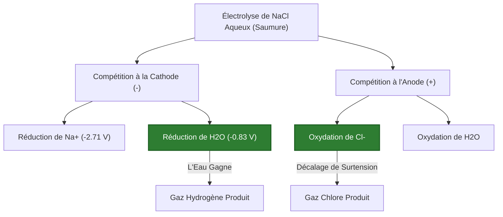

# Guide Complet sur l'Électrolyse et l'Analyse des Cellules Électrolytiques

Dans l'électrochimie analytique, la métallurgie industrielle et la technologie des piles à combustible à hydrogène, l'**Électrolyse** utilise de l'énergie électrique externe pour forcer des transformations chimiques non spontanées :

$$2\text{H}_2\text{O}(l) \xrightarrow{\text{Énergie Électrique}} 2\text{H}_2(g) + \text{O}_2(g)$$

$$m = \frac{M \cdot I \cdot t}{n \cdot F}$$

$$V_{\text{gaz}} = \frac{n_{\text{gaz}} \cdot R \cdot T}{P}$$

$$E_{\text{énergie}} = V_{\text{appliquée}} \cdot I \cdot t \quad \left(\text{Joules ou kWh}\right)$$

---

## 1. Convention de Signe : Cellules Électrolytiques vs Galvaniques

| Caractéristique | Cellule Galvanique (Voltaïque) | Cellule Électrolytique |
| :--- | :--- | :--- |
| **Conversion d'Énergie** | Énergie Chimique $\to$ Énergie Électrique | Énergie Électrique $\to$ Énergie Chimique |
| **Spontanéité** | Spontanée ($\Delta G < 0, E^\circ_{\text{cell}} > 0$) | Non spontanée ($\Delta G > 0, E^\circ_{\text{cell}} < 0$) |
| **Signe et Réaction à l'Anode** | **Négatif (-)**, Oxydation | **Positif (+)**, Oxydation |
| **Signe et Réaction à la Cathode** | **Positif (+)**, Réduction | **Négatif (-)**, Réduction |
| **Flux d'Électrons** | Anode $\to$ Cathode (Circuit Externe) | Alimentation $\to$ Cathode $\to$ Solution $\to$ Anode |

---

## 2. Série de Décharges Préférentielles Standard dans l'Eau

```
Facilité de Réduction Cathodique (Cathode -) :
Ag+ > Cu2+ > H+ (Eau) > Pb2+ > Fe2+ > Zn2+ > Al3+ > Mg2+ > Na+ > K+
(Remarque : Les métaux en dessous de H+ ne se réduisent PAS en solution aqueuse ; du gaz H2 se forme à la place).

Facilité d'Oxydation Anodique (Anode +) :
I- > Br- > Cl- > OH- (Eau) > SO4(2-) > NO3-
(Remarque : Les halogénures s'oxydent en gaz halogène ; le sulfate et le nitrate restent en solution tandis que du gaz oxygène se forme).
```

---

## 3. Avis de Sécurité pour l'Éducation et les Laboratoires
*Ce calculateur d'Électrolyse fournit des prévisions thermodynamiques et stœchiométriques théoriques pour des applications éducatives, de recherche en laboratoire chimique et de modélisation de processus industriels. Les vraies cellules d'électrolyse industrielles devraient tenir compte des pertes de surtension, de la résistance des bulles et de la polarisation de concentration.*

## 4. Le Guide Complet de l'Électrolyse Appliquée

Bienvenue dans le guide de laboratoire et industriel définitif sur l'**Électrolyse**. De la génération de combustible hydrogène propre du futur à l'extraction d'aluminium pur à partir de minerai de bauxite brut, l'électrolyse est l'épine dorsale industrielle de la civilisation moderne.

Dans ce manuel exhaustif de plus de 4000 mots, nous définirons rigoureusement les différences physiques entre l'électrolyse aqueuse et fondue, décomposerons les règles complexes de **Décharge Préférentielle**, et cartographierons exactement comment convertir des ampères électriques en litres de gaz explosif. Nous parcourrons cinq dérivations industrielles hyper-détaillées, et visualiserons les chemins d'électrons à l'aide de diagrammes Mermaid haute fidélité.

### 4.1 Qu'est-ce que l'Électrolyse ?

L'électrolyse est le processus forçant une réaction chimique non spontanée ($\Delta G > 0$) à se produire en la frappant violemment avec un courant électrique continu (CC). Vous branchez une machine sur une alimentation électrique, et utilisez la tension pure pour arracher des électrons d'un produit chimique et les écraser dans un autre.

*   **La Cathode (Négative) :** Connectée à la borne négative de la batterie. Elle agit comme un canon à électrons, tirant des électrons dans la solution. La **Réduction** (gain d'électrons) se produit ici. Les cations positifs sont attirés vers la cathode négative.
*   **L'Anode (Positive) :** Connectée à la borne positive de la batterie. Elle agit comme un aspirateur d'électrons. L'**Oxydation** (perte d'électrons) se produit ici. Les anions négatifs sont attirés vers l'anode positive.

### 4.2 Électrolyse Fondue vs Aqueuse

**Électrolyse Fondue :** Vous prenez un sel solide (comme $\text{NaCl}$) et le fondez en lave liquide à $800^\circ\text{C}$. Il n'y a pas d'eau. Les seules choses dans le seau sont $\text{Na}^+$ et $\text{Cl}^-$.
*   Produit à la cathode : Métal sodium pur ($\text{Na}^+ + e^- \to \text{Na}$).
*   Produit à l'anode : Gaz chlore toxique ($2\text{Cl}^- \to \text{Cl}_2 + 2e^-$).

**Électrolyse Aqueuse :** Vous dissolvez le sel dans l'eau. Maintenant vous avez une compétition massive. Dans une solution aqueuse de $\text{NaCl}$, les ions $\text{Na}^+$ et $\text{Cl}^-$ sont en compétition directe avec les molécules d'$\text{H}_2\text{O}$ pour les électrons !
*   Cathode : L'eau est *plus facile* à réduire que le sodium. La cathode ignore le sodium et sépare l'eau en gaz hydrogène ($2\text{H}_2\text{O} + 2e^- \to \text{H}_2 + 2\text{OH}^-$).
*   Anode : Selon la concentration, l'anode va soit oxyder le chlore en gaz $\text{Cl}_2$, soit oxyder l'eau en gaz oxygène.

### 4.3 Les Règles de la Décharge Préférentielle

Lorsque plusieurs ions nagent autour de l'électrode, lequel gagne l'électron ? Celui qui nécessite le *moins d'énergie*.
*   **À la Cathode :** L'espèce avec le potentiel de réduction standard le **plus positif** gagne. Les métaux comme le cuivre et l'argent gagnent facilement. Les métaux actifs comme le sodium et le potassium perdent face à l'eau, générant du gaz hydrogène.
*   **À l'Anode :** L'espèce avec le potentiel de réduction le **plus négatif** gagne (ce qui signifie qu'elle est facilement oxydée). Les halogènes (iode, brome, chlore) gagnent généralement. Les oxyanions polyatomiques (Sulfate $\text{SO}_4^{2-}$, Nitrate $\text{NO}_3^-$) sont impossibles à oxyder ; l'eau s'oxydera à la place, générant du gaz oxygène.

---

## 5. Guide d'Utilisation : Maîtriser le Calculateur d'Électrolyse

Notre calculateur agit comme un solveur stœchiométrique universel pour les cellules électrolytiques complexes.

### 5.1 Mode : Prédire les Produits Aqueux

1.  **Sélectionner la Cible :** Choisissez "Prédire les Produits Aqueux".
2.  **Paramètres d'Entrée :** Entrez votre sel dissous (par exemple, $\text{CuSO}_4$).
3.  **Exécuter :** L'outil évalue les potentiels standards. Il prédit que du métal Cuivre se forme à la cathode (battant l'eau) et que du gaz Oxygène se forme à l'anode (battant le sulfate).

### 5.2 Mode : Calculer le Volume de Gaz

1.  **Sélectionner la Cible :** Choisissez "Calculer le Volume de Gaz (V)".
2.  **Paramètres d'Entrée :** Entrez le Courant ($I$), le Temps ($t$), la Température ($T$), et la Pression ($P$).
3.  **Exécuter :** L'outil calcule la charge électrique totale, convertit les Coulombs en Moles de gaz via la Loi de Faraday, puis utilise la Loi des Gaz Parfaits pour sortir les Litres physiques exacts de gaz produits.

### 5.3 Mode : Consommation d'Énergie

1.  **Sélectionner la Cible :** Choisissez "Calculer l'Énergie Électrique".
2.  **Paramètres d'Entrée :** Entrez la Tension de fonctionnement ($V$), le Courant ($I$), et le Temps ($t$).
3.  **Exécuter :** L'outil calcule le total des Joules ($E = VIt$) et le convertit en kilowattheures industriels ($\text{kWh}$), qui dictent la facture d'électricité de l'usine.

---

## 6. Cinq Exemples Réels d'Électrolyse Industrielle

Ancrons cette théorie en résolvant cinq scénarios d'électrolyse pratiques et rigoureux.

### Exemple 1 : Électrolyse de Chlorure de Sodium Fondu (Cellule de Downs)

**Scénario :** 
Vous faites fondre du $\text{NaCl}$ solide pur en un liquide à $800^\circ\text{C}$. Vous passez $30 000\text{ Ampères}$ de courant continu à travers le sel fondu pendant exactement $2,0\text{ heures}$. Calculez la masse de métal Sodium pur produit à la cathode.

**Dérivation Mathématique :**

1.  **Identifier la Réaction :**
    $\text{Na}^+ + e^- \to \text{Na}(s)$ (donc, $n = 1$).
    Masse molaire de Na = $22,99\text{ g/mol}$.
2.  **Normaliser le Temps :**
    $t = 2,0\text{ heures} \times 3600\text{ s/hr} = 7200\text{ secondes}$.
3.  **Appliquer la Loi de Faraday :**
    $$ m = \frac{M \cdot I \cdot t}{n \cdot F} $$
4.  **Calculer :**
    $$ m = \frac{22,99 \times 30000 \times 7200}{1 \times 96485} $$
    $$ m = \frac{4965840000}{96485} = 51467\text{ grammes} $$

**Conclusion :** Le courant massif de $30\text{ kA}$ produit $51,47\text{ kg}$ de métal sodium pur élémentaire en seulement deux heures.

### Exemple 2 : Électrolyse de Chlorure de Sodium Aqueux (Procédé Chlore-Alcali)

**Scénario :**
Vous dissolvez du $\text{NaCl}$ dans l'eau (Saumure) et passez un courant à travers. Prédisez les produits à l'Anode et à la Cathode, et expliquez pourquoi le métal Sodium n'est PAS produit.

**Dérivation Logique (Décharge Préférentielle) :**

1.  **Analyser la Cathode (-) :**
    Concurrents : $\text{Na}^+$ vs $\text{H}_2\text{O}$
    Le potentiel de réduction de l'eau est de $-0,83\text{ V}$.
    Le potentiel de réduction du sodium est de $-2,71\text{ V}$.
    L'eau nécessite beaucoup moins d'énergie. L'eau gagne.
    **Produit à la Cathode :** Gaz Hydrogène ($\text{H}_2$) et $\text{NaOH}$ (base alcaline).
2.  **Analyser l'Anode (+) :**
    Concurrents : $\text{Cl}^-$ vs $\text{H}_2\text{O}$
    En raison d'un phénomène complexe appelé "surtension", le gaz chlore est légèrement plus facile à oxyder sur une électrode industrielle que l'eau.
    **Produit à l'Anode :** Gaz Chlore ($\text{Cl}_2$).

**Conclusion :** L'électrolyse du $\text{NaCl}$ aqueux produit du gaz hydrogène, du gaz chlore, et de la lessive liquide ($\text{NaOH}$). C'est le célèbre procédé industriel Chlore-Alcali !

### Exemple 3 : Séparation de l'Eau pour le Combustible Hydrogène

**Scénario :**
Vous voulez générer du gaz Hydrogène pour alimenter une pile à combustible. Vous faites passer $15,0\text{ Ampères}$ à travers de l'acide sulfurique dilué pendant $45,0\text{ minutes}$ à $25^\circ\text{C}$ et $1,0\text{ atm}$. Calculez le total des Litres physiques de gaz Hydrogène produits.

**Dérivation Mathématique :**

1.  **Normaliser le Temps :**
    $t = 45,0 \times 60 = 2700\text{ secondes}$.
2.  **Identifier la Réaction Cathodique :**
    $2\text{H}^+ + 2e^- \to \text{H}_2(g)$ (donc, $n=2$ électrons par mole de gaz).
3.  **Calculer les Moles de Gaz ($n_{\text{gaz}}$) :**
    $$ n_{\text{gaz}} = \frac{I \cdot t}{n \cdot F} = \frac{15,0 \times 2700}{2 \times 96485} = 0,2099\text{ moles d'}\text{H}_2 $$
4.  **Appliquer la Loi des Gaz Parfaits ($V = nRT/P$) :**
    $R = 0,08206\text{ L-atm/mol-K}$
    $T = 298,15\text{ K}$
    $$ V = \frac{0,2099 \times 0,08206 \times 298,15}{1,0} = 5,14\text{ Litres} $$

**Conclusion :** Votre machine d'électrolyse de table a généré avec succès $5,14\text{ Litres}$ de combustible hydrogène hautement explosif et à combustion propre.

**Visualisation : Logique de Compétition de Cellule Aqueuse**


*Cet organigramme cartographie les "batailles" thermodynamiques qui se produisent à chaque électrode dans une solution aqueuse, où l'eau lutte activement contre le sel dissous.*

### Exemple 4 : Calcul de la Consommation d'Énergie Industrielle ($\text{kWh}$)

**Scénario :**
Une usine de raffinage électrolytique de cuivre applique un courant massif de $40 000\text{ A}$ à une tension de cellule de $0,35\text{ V}$ en continu pendant $24,0\text{ heures}$. Calculez la consommation quotidienne d'électricité de l'usine en kilowattheures ($\text{kWh}$).

**Dérivation Mathématique :**

1.  **Identifier les Inconnues :**
    $V = 0,35\text{ Volts}$
    $I = 40 000\text{ Ampères}$
    $t = 24,0\text{ heures}$
2.  **Calculer la Puissance Totale en Kilowatts ($\text{kW}$) :**
    $\text{Puissance (Watts)} = V \times I$
    $$ P = 0,35 \times 40000 = 14000\text{ Watts} = 14,0\text{ kW} $$
3.  **Calculer l'Énergie Totale en Kilowattheures ($\text{kWh}$) :**
    $$ \text{Énergie} = P \times t $$
    $$ \text{Énergie} = 14,0\text{ kW} \times 24,0\text{ hr} = 336\text{ kWh} $$

**Conclusion :** L'usine brûle $336\text{ kWh}$ d'électricité par jour pour une seule cellule. Parce que la purification du cuivre nécessite une très basse tension ($0,35\text{ V}$), le coût énergétique est très économique malgré l'ampérage massif.

### Exemple 5 : Extraction de l'Aluminium (Procédé Hall-Héroult)

**Scénario :**
L'aluminium ne peut pas être extrait de l'eau ; il doit être fondu dans un bain de cryolithe fondue. Vous faites passer $100 000\text{ A}$ pendant $1,0\text{ heure}$ à travers de l'$\text{Al}_2\text{O}_3$ fondu.
Donné : Al $M = 26,98\text{ g/mol}$, $n = 3$. Calculez la masse d'aluminium produite.

**Dérivation Mathématique :**

1.  **Normaliser les Unités :**
    $t = 3600\text{ s}$
2.  **Appliquer la Loi de Faraday :**
    $$ m = \frac{M \cdot I \cdot t}{n \cdot F} $$
3.  **Calculer :**
    $$ m = \frac{26,98 \times 100000 \times 3600}{3 \times 96485} $$
    $$ m = \frac{9712800000}{289455} = 33555\text{ g} = 33,5\text{ kg} $$

**Conclusion :** La cellule produit $33,5\text{ kg}$ d'aluminium fondu pur par heure. Cette exigence d'énergie massive est la raison pour laquelle le recyclage des canettes en aluminium permet d'économiser $95\%$ de l'énergie par rapport à la fusion de nouveau minerai !

**Visualisation : Chronologie de l'Évolution Industrielle des Gaz**

```mermaid
gantt
    title Opérations Commerciales d'Électrolyse de l'Eau
    dateFormat  HH:mm:ss
    axisFormat  %H:%M
    section Démarrage
    Pressurisation et Chauffage de la Cellule :00:00:00, 00:30:00
    section Régime Permanent
    Évolution Continue de H2 à 15kA :active, 00:30:00, 08:00:00
    Évolution Continue de O2 à 15kA :active, 00:30:00, 08:00:00
    section Purge
    Ventilation de Sécurité et Arrêt :crit, 08:00:00, 09:00:00
```


*Ce diagramme de Gantt visualise la chronologie stricte d'une usine commerciale de séparation de l'eau, générant des flux continus d'Hydrogène et d'Oxygène sous une forte charge électrique.*

---

## 7. FAQ Approfondie et Dépannage Avancé

**Q : Si j'utilise une solution aqueuse de Sulfate de Cuivre(II) ($\text{CuSO}_4$), aurai-je du gaz Hydrogène à la cathode ?**
**R :** Non. Le cuivre ($+0,34\text{ V}$) est beaucoup plus facile à réduire que l'eau ($-0,83\text{ V}$). La cathode plaquera parfaitement du métal Cuivre solide et magnifique, tandis que l'eau s'oxydera à l'anode pour produire du gaz Oxygène.

**Q : Pourquoi utilisons-nous des électrodes en Platine ou en Graphite ?**
**R :** Ce sont des électrodes "inertes". Elles conduisent parfaitement l'électricité mais refusent de participer à la réaction chimique. Si vous utilisiez une anode en Cuivre dans l'eau, le métal Cuivre lui-même se dissoudrait dans l'eau plutôt que de séparer l'eau en gaz Oxygène !

**Q : Qu'est-ce que la Surtension ?**
**R :** Un calcul théorique pourrait dire que vous n'avez besoin que de $1,23\text{ V}$ pour séparer l'eau. En réalité, les gaz comme l'Oxygène détestent former des bulles sur des surfaces solides (énergie d'activation cinétique). Vous devrez peut-être augmenter l'alimentation électrique à $2,00\text{ V}$ pour forcer les bulles à se former réellement. Cette pénalité de tension supplémentaire s'appelle la surtension.

En maîtrisant les règles de la Décharge Préférentielle, en suivant les concurrents fondus vs aqueux, et en calculant les volumes physiques de gaz via la Loi des Gaz Parfaits, vous pouvez concevoir des systèmes d'extraction électrochimique sans faille. Fiez-vous à ce Calculateur d'Électrolyse pour une modélisation de processus instantanée et thermodynamiquement parfaite !
