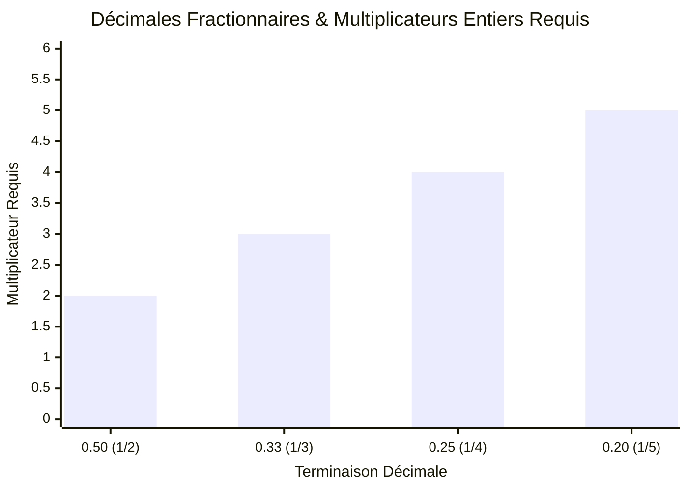
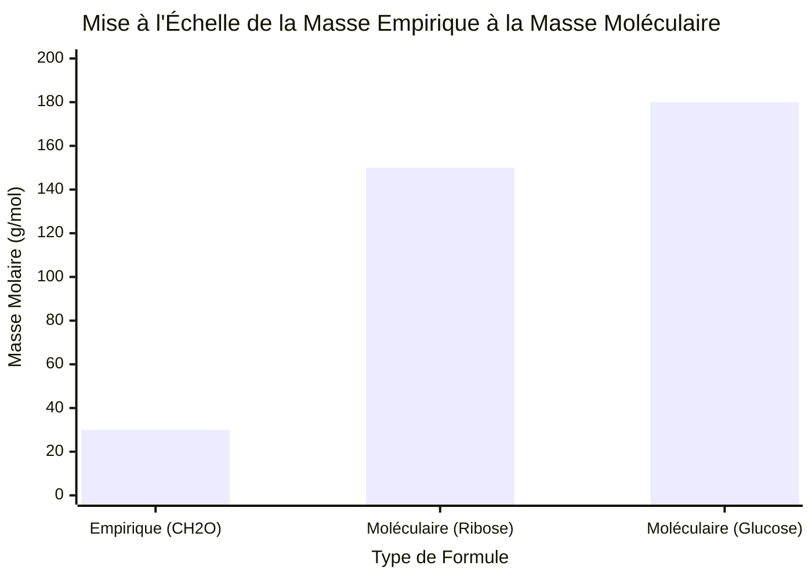
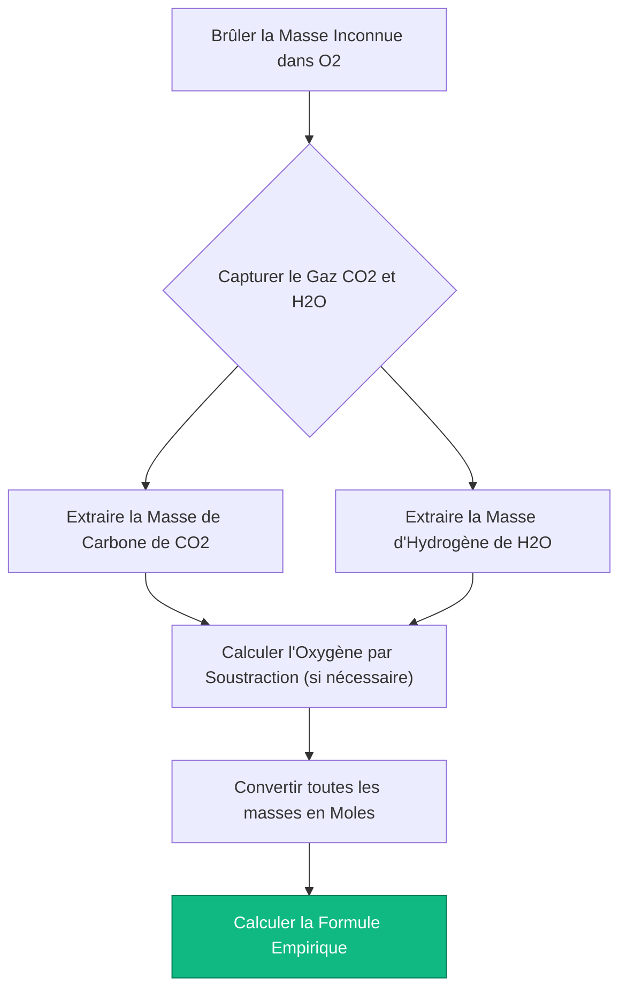
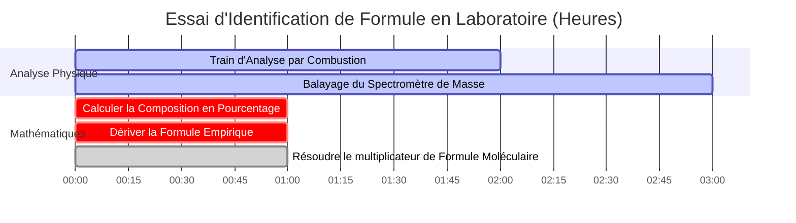

# Le Calculateur Ultime de Formule Empirique : Composition et Mise à l'Échelle Moléculaire

Bienvenue dans le **Calculateur de Formule Empirique** définitif et le guide complet de composition élémentaire. Que vous soyez un étudiant en Chimie AP analysant des données de composition en pourcentage pour la première fois, un chimiste organicien interprétant les résultats de spectrométrie de masse pour synthétiser un nouveau médicament pharmaceutique, ou un technicien de laboratoire effectuant une analyse par combustion sur un hydrocarbure inconnu, maîtriser la dérivation des formules empiriques et moléculaires est la pierre angulaire absolue de l'identification moléculaire.

Dans l'analyse chimique, on ne vous remet jamais une formule nette. Au lieu de cela, des instruments comme les spectromètres de masse et les analyseurs élémentaires recrachent des données brutes et chaotiques : pourcentages en masse, poids élémentaires bruts ou pics spectraux. Il appartient entièrement au chimiste de reconstruire mathématiquement le plan moléculaire exact du composé en utilisant des rapports stœchiométriques rigides.

Dans cette masterclass SEO exhaustive de plus de 4 000 mots, nous allons complètement déconstruire les mathématiques derrière la conversion des pourcentages en moles, expliquer l'importance critique des multiplicateurs fractionnaires (comme savoir exactement quand multiplier par $2$ ou $3$), et décoder le pont algorithmique entre une simple Formule Empirique et la Formule Moléculaire physique. Pour garantir une compréhension absolue, nous avons inclus cinq diagrammes interactifs Mermaid.js méticuleusement détaillés et sans danger pour l'analyseur.

---

## 1. Formule Empirique vs Formule Moléculaire

Avant d'exécuter des calculs, vous devez comprendre la distinction physique critique entre ces deux concepts.

**La Formule Empirique :** 
Le rapport en nombres entiers le plus simple et le plus réduit d'atomes dans un composé. 
- *Exemple :* La formule empirique du Glucose est $\text{CH}_2\text{O}$. Cela signifie que pour chaque $1\text{ atome de Carbone}$, il y a exactement $2\text{ atomes d'Hydrogène}$ et $1\text{ atome d'Oxygène}$.

**La Formule Moléculaire :**
La réalité physique réelle. Elle vous indique exactement combien d'atomes construisent une seule molécule physique du composé.
- *Exemple :* La formule moléculaire réelle du Glucose est $\text{C}_6\text{H}_{12}\text{O}_6$. Elle est physiquement construite à partir de $24\text{ atomes au total}$.

Remarquez-vous la relation mathématique ? La Formule Moléculaire est simplement une version mise à l'échelle (un multiple) de la Formule Empirique. Dans le cas du Glucose, le multiplicateur ($n$) est exactement $6$.
$$(\text{CH}_2\text{O}) \times 6 \rightarrow \text{C}_6\text{H}_{12}\text{O}_6$$

*Note : Parfois, les formules empirique et moléculaire sont identiques. Par exemple, l'Eau ($\text{H}_2\text{O}$) ne peut pas être mathématiquement réduite davantage. Par conséquent, $\text{H}_2\text{O}$ est à la fois la formule empirique et la formule moléculaire.*

---

## 2. L'Algorithme Universel : Des Pourcentages aux Formules

Le parcours des pourcentages bruts de laboratoire à une formule chimique propre nécessite une séquence algorithmique stricte et incassable en 4 étapes.

**Le Scénario :** 
Un laboratoire analyse une poudre blanche mystérieuse et découvre qu'elle contient $40.00\%\text{ de Carbone}$, $6.71\%\text{ d'Hydrogène}$, et $53.28\%\text{ d'Oxygène}$ en masse. Quelle est la formule empirique ?

### Étape 1 : L'Hypothèse des 100 Grammes
Puisque les pourcentages sont relatifs, nous supposons simplement que nous possédons exactement $100.0\text{ g}$ de la substance. Cela transforme magiquement les pourcentages directement en grammes physiques.
- $\text{Carbone} = 40.00\text{ g}$
- $\text{Hydrogène} = 6.71\text{ g}$
- $\text{Oxygène} = 53.28\text{ g}$

### Étape 2 : Convertir la Masse en Moles
Les formules chimiques sont des rapports d'*atomes*, non des rapports de *masses*. Nous devons diviser la masse de chaque élément par son poids atomique spécifique issu du tableau périodique.
- $\text{Moles C} = \frac{40.00\text{ g}}{12.011\text{ g/mol}} = \mathbf{3.33\text{ mol C}}$
- $\text{Moles H} = \frac{6.71\text{ g}}{1.008\text{ g/mol}} = \mathbf{6.66\text{ mol H}}$
- $\text{Moles O} = \frac{53.28\text{ g}}{15.999\text{ g/mol}} = \mathbf{3.33\text{ mol O}}$

### Étape 3 : Diviser par le Plus Petit
Pour trouver les rapports relatifs, divisez chaque valeur de mole par la *plus petite* valeur de mole calculée à l'Étape 2. (La plus petite valeur ici est $3.33$).
- $\text{Relatif C} = \frac{3.33}{3.33} = \mathbf{1.00}$
- $\text{Relatif H} = \frac{6.66}{3.33} = \mathbf{2.00}$
- $\text{Relatif O} = \frac{3.33}{3.33} = \mathbf{1.00}$

### Étape 4 : Écrire la Formule (Système de Hill)
Les rapports relatifs sont des nombres entiers parfaits ! La formule empirique est $\text{CH}_2\text{O}$. (Note : Selon la convention chimique standard, le Carbone est écrit en premier, l'Hydrogène en second, et tous les autres éléments par ordre alphabétique).

---

## 3. Le Piège du Multiplicateur Fractionnaire

Dans le monde réel, l'Étape 3 donne rarement des entiers parfaits. Que se passe-t-il si vos rapports relatifs se terminent par des décimales comme $1.5$ ou $1.33$ ? 

**Vous ne pouvez absolument pas les arrondir.** Arrondir un rapport de $1.5$ à $2$ détruit fondamentalement l'identité chimique du composé. Au lieu de cela, vous devez trouver un multiplicateur en nombre entier pour éliminer la fraction à travers *tous* les éléments du composé.

### Scénarios de Multiplicateurs Courants :
1. **Se termine par $.50$ (par ex., $1.5, 2.5$) :** Multipliez tous les éléments par **$2$**. 
   - *Exemple :* $\text{Fe}_{1}\text{O}_{1.5} \times 2 = \text{Fe}_2\text{O}_3$ (Rouille)
2. **Se termine par $.33$ ou $.67$ (par ex., $1.33, 1.66$) :** Multipliez tous les éléments par **$3$**.
   - *Exemple :* $\text{C}_{1}\text{H}_{1.33}\text{O}_1 \times 3 = \text{C}_3\text{H}_4\text{O}_3$ (Acide Pyruvique)
3. **Se termine par $.25$ ou $.75$ (par ex., $1.25, 2.75$) :** Multipliez tous les éléments par **$4$**.
   - *Exemple :* $\text{P}_1\text{O}_{2.5} \rightarrow$ attendez, en fait $2.5$ est une fraction $.5$, multipliez par $2$ pour obtenir $\text{P}_2\text{O}_5$. Mais et si c'était $\text{P}_1\text{O}_{1.25}$ ? Alors multipliez par $4$ pour obtenir $\text{P}_4\text{O}_5$.

---

## 4. Faire le Lien vers la Formule Moléculaire

Pour passer d'une Formule Empirique à une véritable Formule Moléculaire, le laboratoire doit vous fournir une donnée supplémentaire : la **Masse Molaire** réelle du composé entier (généralement dérivée d'un spectromètre de masse).

**Le Calcul :**
1. Calculez la masse de votre Formule Empirique.
2. Divisez la Masse Moléculaire réelle par la Masse Empirique. Cela vous donne le multiplicateur scalaire ($n$).
3. Multipliez tous les indices dans la formule empirique par $n$.

**Exemple :**
Nous avons trouvé que notre formule empirique est $\text{CH}_2\text{O}$. Sa masse empirique est de $(12) + (2) + (16) = \mathbf{30.0\text{ g/mol}}$.
Le spectromètre de masse nous indique que le produit chimique réel pèse exactement $\mathbf{180.0\text{ g/mol}}$.
$$n = \frac{180.0}{30.0} = \mathbf{6}$$
Notre formule moléculaire est donc $(\text{CH}_2\text{O}) \times 6 = \mathbf{\text{C}_6\text{H}_{12}\text{O}_6}$ (Glucose).

---

## 5. Cinq Scénarios d'Ingénierie Conceptuelle avec Visualisations 2D

Pour maîtriser pleinement les algorithmes mécaniques régissant les multiplicateurs fractionnaires, les voies de conversion élémentaires et l'analyse par combustion en laboratoire, nous allons explorer cinq scénarios distincts de chimie analytique décomposés visuellement à l'aide de diagrammes Mermaid.js personnalisés.

### Exemple 1 : L'Algorithme Pourcentage-à-Formule

**Le Scénario :**
Un étudiant en Chimie AP cartographie la séquence mathématique stricte en 4 étapes requise pour convertir les pourcentages de masse bruts du laboratoire en une formule empirique propre et réduite.

**Visualisation 2D :**
Cet organigramme cartographie visuellement l'exigence stricte de passer par le "Portail du Rapport Molaire" avant de tenter d'écrire des indices chimiques.

---

### Exemple 2 : La Matrice du Multiplicateur Fractionnaire

**Le Scénario :**
Un chimiste analytique rencontre des rapports décimaux complexes (1.5, 1.33, 1.25) et détermine exactement quel multiplicateur entier est requis pour sauver la formule sans arrondi destructeur.

**Visualisation 2D :**
Ce graphique prouve graphiquement les multiplicateurs exacts requis pour transformer des décimales fractionnaires courantes en entiers chimiques parfaits.

---

### Exemple 3 : Masse Empirique vs Masse Moléculaire Cible

**Le Scénario :**
Un biochimiste analyse une molécule de sucre. La masse empirique est de $30\text{ g/mol}$, mais le spectromètre de masse détecte plusieurs isomères lourds. Ils doivent mettre à l'échelle la formule.

**Visualisation 2D :**
Ce graphique comparatif cartographie visuellement comment la masse moléculaire est simplement un multiple scalaire géométrique de la masse empirique de base.

---

### Exemple 4 : Protocole de Laboratoire d'Analyse par Combustion

**Le Scénario :**
Un chimiste organicien brûle un hydrocarbure inconnu dans un train de combustion scellé. Ils doivent recalculer la quantité de Carbone et d'Hydrogène à partir des gaz $\text{CO}_2$ et $\text{H}_2\text{O}$ capturés.

**Visualisation 2D :**
Cet organigramme de haut en bas agit comme une recette chimique stricte, imposant la séquence absolue d'actions mathématiques requises pour décoder un essai d'analyse par combustion.

---

### Exemple 5 : Chronologie de la Spectrométrie de Masse & Analyse

**Le Scénario :**
Un laboratoire médico-légal isole une poudre blanche inconnue. Ils doivent exécuter une batterie complète de tests physiques et informatiques pour vérifier légalement l'identité moléculaire exacte du composé.

**Visualisation 2D :**
Ce diagramme de Gantt visualise la séquence chronologique d'un essai physique, prouvant que les calculs de formule ne peuvent pas se produire tant que le spectromètre de masse n'a pas fini de balayer l'échantillon.

---

## 6. Conclusion et Défi de Formule

Maîtriser la dérivation des formules empiriques et moléculaires est l'exigence d'entrée non négociable pour entrer dans n'importe quel laboratoire analytique, biologique ou chimique. Comprendre la rigidité mathématique des rapports de moles, l'interdiction absolue d'arrondir des fractions comme $1.5$ ou $1.33$, et la relation scalaire entre les masses empiriques et moléculaires garantira que vos identifications chimiques sont parfaitement précises.

Si vous ne parvenez pas à maîtriser ces algorithmes, votre laboratoire identifiera de manière erronée des composés critiques, ruinera des mises à l'échelle de synthèse de plusieurs millions de dollars et corrompra des données expérimentales par simple erreur humaine.

Pour vous assurer d'avoir maîtrisé ces concepts critiques, lancez notre Simulateur interactif et essayez de résoudre ces défis analytiques finaux :
1. **Le Défi du Multiplicateur :** Un composé contient $43.64\%\text{ de Phosphore}$ et $56.36\%\text{ d'Oxygène}$. Calculez les moles, divisez par le plus petit, et trouvez le multiplicateur entier pour déterminer la formule empirique.
2. **Le Défi Moléculaire :** Un acide organique a une formule empirique de $\text{CHO}_2$ et une masse empirique de $45.0\text{ g/mol}$. Un spectromètre de masse détermine que la molécule réelle pèse $90.0\text{ g/mol}$. Quelle est la véritable formule moléculaire ?
3. **Le Défi de la Combustion :** Vous brûlez un hydrocarbure et collectez $4.40\text{ g}$ de $\text{CO}_2$ et $2.70\text{ g}$ de $\text{H}_2\text{O}$. Tout d'abord, extrayez les grammes de Carbone pur et d'Hydrogène pur. Ensuite, déterminez la formule empirique de la substance brûlée.

Fiez-vous à ce calculateur de formule universel pour auditer vos protocoles de laboratoire, identifier instantanément les multiplicateurs fractionnaires et maîtriser de manière permanente la thermodynamique de l'analyse quantitative de la composition chimique.

