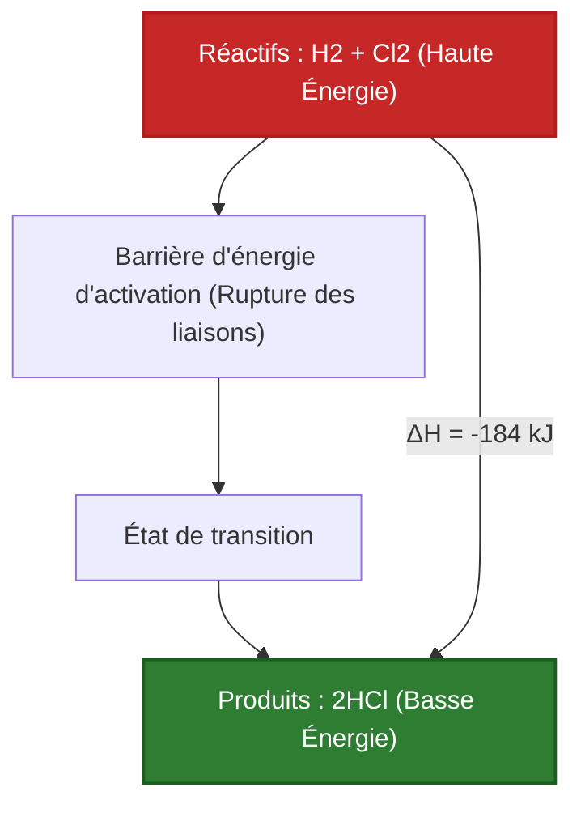

# Guide complet de laboratoire et industriel sur l'enthalpie et la thermochimie

En chimie physique, en génie chimique et en ingénierie de la combustion, le **Changement d'enthalpie ($\Delta H$)** quantifie l'énergie thermique nette absorbée ou libérée lors des réactions chimiques à pression constante :

$$\Delta H = H_{\text{produits}} - H_{\text{réactifs}}$$

$$\Delta H^\circ_{\text{réaction}} = \sum n \cdot \Delta H^\circ_f(\text{produits}) - \sum n \cdot \Delta H^\circ_f(\text{réactifs})$$

$$q = m \cdot c \cdot \Delta T \quad \left(\text{Équation de chaleur de calorimétrie}\right)$$

$$\Delta H \approx \sum \text{Énergies de liaison}_{\text{rompues}} - \sum \text{Énergies de liaison}_{\text{formées}}$$

$$\Delta H_{\text{total}} = \sum \Delta H_i \quad \left(\text{Loi de Hess}\right)$$

---

## 1. Comparaison entre réaction exothermique et endothermique

| Caractéristique | Réaction Exothermique ($\Delta H < 0$) | Réaction Endothermique ($\Delta H > 0$) |
| :--- | :--- | :--- |
| **Direction du flux de chaleur** | **Libérée vers l'environnement** | **Absorbée de l'environnement** |
| **Comparaison d'enthalpie** | $H_{\text{produits}} < H_{\text{réactifs}}$ | $H_{\text{produits}} > H_{\text{réactifs}}$ |
| **Temp. de l'environnement** | **Augmente (Se réchauffe)** | **Diminue (Se refroidit)** |
| **Règle d'énergie de liaison** | Énergie libérée formant des liaisons > Énergie pour rompre des liaisons | Énergie requise pour rompre des liaisons > Énergie libérée formant des liaisons |
| **Exemples courants** | Combustion du méthane, Neutralisation (HCl + NaOH) | Vaporisation de l'eau, Dissolution de $\text{NH}_4\text{NO}_3$ |

---

## 2. Matrice des méthodes de calcul de thermochimie

```
1. Différence directe d'enthalpie : ΔH = H_produits - H_réactifs
2. Enthalpies standard de formation : ΔH°_rxn = Σ n * ΔH°f(produits) - Σ n * ΔH°f(réactifs)
3. Additivité de la loi de Hess : ΔH_total = ΔH_1 + ΔH_2 + ΔH_3 + ...
4. Énergies de liaison moyennes : ΔH = Σ Énergies de liaison(rompues) - Σ Énergies de liaison(formées)
5. Calorimétrie de solution : q = m * c * ΔT  (q_réaction = -q_solution)
```

---

## 3. Avis de non-responsabilité pour l'éducation et le laboratoire
*Ce calculateur d'enthalpie fournit des prédictions thermochimiques théoriques pour les applications éducatives, de recherche en chimie physique et d'ingénierie des procédés. Les mesures calorimétriques réelles doivent tenir compte de la capacité thermique du calorimètre ($C_{\text{cal}}$), de la perte de chaleur vers l'environnement et du mélange de solutions non idéales.*

## 4. Le guide complet de l'enthalpie et de la thermochimie

Bienvenue dans le guide définitif de chimie physique sur l'**Enthalpie ($\Delta H$)**. Avant de pouvoir déterminer si une réaction est spontanée (en utilisant l'énergie libre de Gibbs) ou mesurer le chaos absolu (Entropie), vous devez d'abord équilibrer le chéquier thermique ultime de l'univers : La chaleur. 

Dans ce manuel exhaustif de plus de 4000 mots, nous définirons rigoureusement les mécanismes physiques derrière les réactions **exothermiques et endothermiques**. Nous maîtriserons cinq chemins mathématiques distincts pour calculer $\Delta H$, y compris la loi de Hess, les enthalpies standard de formation ($\Delta H_f^\circ$), les énergies de liaison et la calorimétrie ($q = mc\Delta T$). Enfin, nous visualiserons le transfert de chaleur et la coordination des réactions par étapes à l'aide de diagrammes Mermaid haute fidélité.

### 4.1 Qu'est-ce que l'enthalpie ?

L'enthalpie ($H$) est une fonction d'état thermodynamique qui représente le contenu thermique total d'un système à pression constante. Parce qu'il est impossible de mesurer l'énergie totale absolue d'un atome, nous ne nous soucions que du **Changement d'enthalpie ($\Delta H$)** : la quantité exacte de chaleur qui entre ou sort d'un système lors d'une réaction chimique.

### 4.2 Exothermique vs Endothermique : La physique des liaisons

Pourquoi la combustion du méthane libère-t-elle des quantités massives de chaleur ? Tout se résume à la physique des liaisons chimiques.
1.  **Rompre des liaisons :** Séparer deux atomes vous oblige à introduire de l'énergie dans le système (Endothermique).
2.  **Former des liaisons :** Lorsque deux atomes entrent en collision et forment une liaison stable, ils libèrent de l'énergie dans l'univers (Exothermique).

Si l'énergie libérée par la formation des nouvelles liaisons des produits est *supérieure* à l'énergie qu'il a fallu pour rompre les anciennes liaisons des réactifs, le résultat net est une libération massive de feu et de chaleur. Il s'agit d'une **Réaction exothermique ($\Delta H < 0$)**. Si l'inverse est vrai, la réaction aspirera littéralement la chaleur de l'air, gelant le bécher. Il s'agit d'une **Réaction endothermique ($\Delta H > 0$)**.

### 4.3 Les cinq voies de la thermochimie

Les ingénieurs chimistes utilisent cinq méthodes mathématiques distinctes pour calculer l'enthalpie, en fonction des données dont ils disposent :
1.  **Enthalpies standard de formation ($\Delta H_f^\circ$) :** En utilisant un tableau de manuel indiquant la quantité d'énergie nécessaire pour construire une molécule à partir de ses atomes élémentaires.
2.  **Loi de Hess :** En traitant les équations chimiques comme des puzzles algébriques, en ajoutant et en soustrayant des étapes jusqu'à ce qu'elles soient égales à votre réaction cible.
3.  **Énergies de liaison :** En estimant la chaleur de réaction en additionnant les forces brutes selon les manuels de chaque liaison $\text{C-H}$ ou $\text{O=O}$ rompue et formée.
4.  **Calorimétrie ($q = mc\Delta T$) :** En mesurant physiquement le changement de température de l'eau dans un seau de laboratoire lorsqu'une réaction s'y produit.
5.  **Changements de phase :** En utilisant la chaleur latente ($\Delta H_{\text{vap}}$ ou $\Delta H_{\text{fus}}$) pour calculer l'énergie requise pour faire bouillir ou fondre des substances sans changer de température.

---

## 5. Guide d'utilisation : Maîtriser le calculateur d'enthalpie

Notre calculateur agit comme un solveur thermochimique universel.

### 5.1 Mode : Calorimétrie ($q = mc\Delta T$)

1.  **Sélectionner la cible :** Choisissez "Chaleur de calorimétrie (q)".
2.  **Paramètres d'entrée :** Saisissez la masse de l'eau ($m$), la capacité thermique massique ($c$, généralement $4,184\text{ J/g}^\circ\text{C}$) et le changement de température ($\Delta T$).
3.  **Exécuter :** L'outil calcule le total de Joules de chaleur absorbés par l'eau, ce qui équivaut directement à la chaleur libérée par votre réaction.

### 5.2 Mode : Enthalpies standard de formation

1.  **Sélectionner la cible :** Choisissez "Calculer $\Delta H^\circ_{\text{rxn}}$ via la Formation".
2.  **Paramètres d'entrée :** Saisissez les coefficients stœchiométriques et les valeurs de $\Delta H_f^\circ$ pour tous les réactifs et produits.
3.  **Exécuter :** L'outil applique la règle "Produits moins Réactifs" pour calculer la chaleur thermodynamique précise de la réaction globale.

### 5.3 Mode : Additivité de la loi de Hess

1.  **Sélectionner la cible :** Choisissez "Solveur de la loi de Hess".
2.  **Paramètres d'entrée :** Saisissez les valeurs de $\Delta H$ pour plusieurs étapes de réaction intermédiaires.
3.  **Exécuter :** L'outil additionne les étapes (en tenant compte de toute réaction inversée) pour trouver le $\Delta H$ net de la voie globale.

---

## 6. Cinq dérivations thermochimiques du monde réel

Ancrons cette théorie en résolvant cinq scénarios de thermochimie rigoureux et pratiques.

### Exemple 1 : Calcul de $\Delta H^\circ$ de la combustion du méthane

**Scénario :** 
Vous brûlez du gaz méthane : $\text{CH}_4(g) + 2\text{O}_2(g) \to \text{CO}_2(g) + 2\text{H}_2\text{O}(l)$
Étant donné les enthalpies standard de formation ($\Delta H_f^\circ$ en $\text{kJ/mol}$) :
*   $\text{CH}_4(g)$ : $-74,8$
*   $\text{O}_2(g)$ : $0$ (les éléments à l'état standard sont toujours à zéro)
*   $\text{CO}_2(g)$ : $-393,5$
*   $\text{H}_2\text{O}(l)$ : $-285,8$

**Dérivation mathématique :**

1.  **Appliquer la formule :**
    $$ \Delta H^\circ_{\text{rxn}} = \sum n\Delta H_f^\circ(\text{produits}) - \sum n\Delta H_f^\circ(\text{réactifs}) $$
2.  **Calculer les produits :**
    $$ H_{\text{prod}} = [1 \times (-393,5)] + [2 \times (-285,8)] = -393,5 - 571,6 = -965,1\text{ kJ} $$
3.  **Calculer les réactifs :**
    $$ H_{\text{réact}} = [1 \times (-74,8)] + [2 \times 0] = -74,8\text{ kJ} $$
4.  **Soustraction finale :**
    $$ \Delta H^\circ_{\text{rxn}} = -965,1 - (-74,8) = -890,3\text{ kJ/mol} $$

**Conclusion :** La réaction est hautement exothermique ($\Delta H < 0$), libérant une chaleur massive.

### Exemple 2 : Calorimétrie à tasse de café ($q = mc\Delta T$)

**Scénario :**
Vous dissolvez $5,00\text{ g}$ de $\text{NaOH}$ dans $100,0\text{ g}$ d'eau dans un calorimètre à tasse de café. La température de l'eau monte violemment de $25,0^\circ\text{C}$ à $37,5^\circ\text{C}$. La chaleur spécifique de la solution est de $4,18\text{ J/g}^\circ\text{C}$. Calculez la chaleur libérée ($q$) en kiloJoules.

**Dérivation mathématique :**

1.  **Déterminer la masse totale :**
    $m = 100,0\text{ g (eau)} + 5,00\text{ g (NaOH)} = 105,0\text{ g au total}$
2.  **Déterminer le changement de température ($\Delta T$) :**
    $\Delta T = 37,5 - 25,0 = 12,5^\circ\text{C}$
3.  **Appliquer l'équation de calorimétrie :**
    $$ q_{\text{solution}} = m \cdot c \cdot \Delta T $$
    $$ q_{\text{solution}} = 105,0 \times 4,18 \times 12,5 = 5486,25\text{ Joules} $$
4.  **Déterminer la chaleur de réaction :**
    Puisque l'eau a *absorbé* la chaleur, la réaction l'a *libérée*.
    $$ q_{\text{réaction}} = -q_{\text{solution}} = -5486,25\text{ J} = -5,49\text{ kJ} $$

**Conclusion :** La dissolution de $5\text{ grammes}$ de $\text{NaOH}$ a libéré $5,49\text{ kJ}$ d'énergie thermique.

### Exemple 3 : Estimation de $\Delta H$ à l'aide des énergies de liaison

**Scénario :**
Calculez l'enthalpie de la réaction : $\text{H}_2(g) + \text{Cl}_2(g) \to 2\text{HCl}(g)$
Étant donné les énergies de liaison moyennes ($\text{kJ/mol}$) :
*   Liaison $\text{H-H}$ : $436$
*   Liaison $\text{Cl-Cl}$ : $242$
*   Liaison $\text{H-Cl}$ : $431$

**Dérivation mathématique :**

1.  **Appliquer la formule d'énergie de liaison :**
    $$ \Delta H \approx \sum(\text{Liaisons rompues}) - \sum(\text{Liaisons formées}) $$
2.  **Calculer les liaisons rompues (Énergie ENTRANTE, Positive) :**
    Rompre $1\text{ H-H}$ ($436$) et $1\text{ Cl-Cl}$ ($242$)
    Total Entrant $= 436 + 242 = +678\text{ kJ}$
3.  **Calculer les liaisons formées (Énergie SORTANTE, Négative) :**
    Former $2$ liaisons $\text{H-Cl}$ ($2 \times 431$)
    Total Sortant $= -862\text{ kJ}$
4.  **Somme finale :**
    $$ \Delta H = 678 - 862 = -184\text{ kJ/mol} $$

**Conclusion :** La formation des deux liaisons fortes $\text{H-Cl}$ a libéré plus d'énergie qu'il n'en a fallu pour briser les liaisons des réactifs, entraînant une libération exothermique nette de $-184\text{ kJ}$.

**Visualisation : Profil d'énergie exothermique**


*Ce profil énergétique démontre une réaction exothermique, où les produits se situent physiquement à un niveau d'énergie plus bas et plus stable que les réactifs.*

### Exemple 4 : Solveur algébrique de la loi de Hess

**Scénario :**
Trouvez le $\Delta H$ pour la réaction cible : $C(s) + \frac{1}{2}\text{O}_2(g) \to \text{CO}(g)$
Étant donné ces deux étapes connues :
Étape 1 : $C(s) + \text{O}_2(g) \to \text{CO}_2(g) \quad (\Delta H_1 = -393,5\text{ kJ})$
Étape 2 : $\text{CO}(g) + \frac{1}{2}\text{O}_2(g) \to \text{CO}_2(g) \quad (\Delta H_2 = -283,0\text{ kJ})$

**Dérivation mathématique :**

1.  **Manipuler l'étape 2 :**
    Notre réaction cible a le $\text{CO}$ comme *produit*. L'étape 2 a le $\text{CO}$ comme *réactif*. Nous devons inverser l'étape 2.
    Étape 2 inversée : $\text{CO}_2(g) \to \text{CO}(g) + \frac{1}{2}\text{O}_2(g)$
    **Règle :** Lorsque vous inversez une réaction, changez le signe de $\Delta H$.
    Nouveau $\Delta H_2 = +283,0\text{ kJ}$
2.  **Additionner les étapes ensemble :**
    Étape 1 : $C(s) + \text{O}_2(g) \to \text{CO}_2(g)$
    Étape 2 inv : $\text{CO}_2(g) \to \text{CO}(g) + \frac{1}{2}\text{O}_2(g)$
    Le $\text{CO}_2$ s'annule des deux côtés. $\frac{1}{2}\text{O}_2$ s'annule à gauche.
    Cible atteinte : $C(s) + \frac{1}{2}\text{O}_2(g) \to \text{CO}(g)$
3.  **Additionner les enthalpies :**
    $$ \Delta H_{\text{cible}} = \Delta H_1 + \text{Nouveau }\Delta H_2 $$
    $$ \Delta H_{\text{cible}} = -393,5 + 283,0 = -110,5\text{ kJ} $$

**Conclusion :** En utilisant la loi de Hess, nous avons calculé l'enthalpie de formation du monoxyde de carbone sans réellement effectuer la réaction hautement toxique en laboratoire.

### Exemple 5 : Enthalpie de changement de phase (Vaporisation)

**Scénario :**
Vous devez faire bouillir $500\text{ g}$ d'eau liquide à $100^\circ\text{C}$ entièrement en vapeur. 
Données : $\Delta H_{\text{vap}}$ pour l'eau est de $40,7\text{ kJ/mol}$. Masse molaire de l'eau = $18,02\text{ g/mol}$. Calculez la chaleur absolue requise ($q$).

**Dérivation mathématique :**

1.  **Convertir la masse en moles :**
    $$ n = \frac{500\text{ g}}{18,02\text{ g/mol}} = 27,75\text{ moles d'}\text{H}_2\text{O} $$
2.  **Appliquer l'équation de changement de phase :**
    $$ q = n \cdot \Delta H_{\text{vap}} $$
3.  **Calculer :**
    $$ q = 27,75\text{ mol} \times 40,7\text{ kJ/mol} = 1129\text{ kJ} $$

**Conclusion :** Il faut $1129\text{ kJ}$ d'énergie thermique pure pour briser les liaisons hydrogène et forcer $500\text{ g}$ d'eau à passer en phase gazeuse.

**Visualisation : Journal de données de calorimétrie industrielle**

```mermaid
gantt
    title Profil de température du calorimètre à bombe
    dateFormat  HH:mm:ss
    axisFormat  %H:%M
    section Ligne de base
    Équilibration thermique :00:00:00, 00:05:00
    section Allumage
    Combustion de l'échantillon (Exothermique) :active, 00:05:00, 00:07:00
    Pic de température rapide :crit, 00:05:00, 00:07:00
    section Refroidissement
    Dissipation de chaleur vers la chemise d'eau :00:07:00, 00:30:00
```


*Ce diagramme de Gantt visualise l'enregistrement strict des données au cours du temps d'un calorimètre à bombe industriel suivant une réaction de combustion hautement exothermique.*

---

## 7. FAQ approfondie et dépannage avancé

**Q : Si une réaction est endothermique ($\Delta H > 0$), cela signifie-t-il qu'elle est impossible ?**
**R :** Non ! Les réactions endothermiques se produisent tout le temps (comme les compresses froides instantanées). Elles obligent simplement l'univers à prioriser l'entropie ($\Delta S$) par rapport à l'enthalpie, ce qui se produit facilement à des températures élevées selon l'équation de l'énergie libre de Gibbs.

**Q : Pourquoi les calculs d'énergie de liaison diffèrent-ils des calculs de formation standard ($\Delta H_f^\circ$) ?**
**R :** Les énergies de liaison sont des *moyennes* prises sur des milliers de molécules organiques différentes. La liaison $\text{C-H}$ dans le méthane est légèrement différente de la liaison $\text{C-H}$ dans le chloroforme. $\Delta H_f^\circ$ utilise des données thermodynamiques exactes mesurées expérimentalement pour cette molécule spécifique, la rendant beaucoup plus précise.

**Q : Qu'est-ce qu'un "État standard" ?**
**R :** Le petit symbole de degré ($\circ$) dans $\Delta H^\circ$ signifie l'état standard. Il exige que les gaz soient exactement à $1,0\text{ atm}$, les solutions soient exactement à $1,0\text{ M}$ et les éléments soient dans leur forme physique la plus stable à $298,15\text{ K}$ (comme le carbone graphite solide ou le gaz oxygène diatomique).

En maîtrisant la loi algébrique de Hess, la calorimétrie à tasse de café et la physique de la rupture des liaisons, vous pouvez suivre le flux invisible de chaleur à travers n'importe quel système chimique. Comptez sur ce calculateur d'enthalpie pour une modélisation de processus instantanée et thermodynamiquement parfaite !
