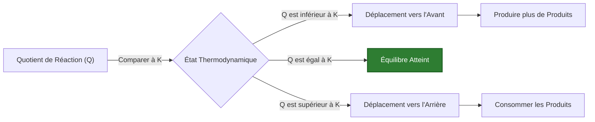

# Guide de Chimie Analytique et de Laboratoire sur l'Équilibre Chimique (Kc & Kp)

En génie chimique physique, analytique et industriel, la **constante d'équilibre** ($K_c$ ou $K_p$) quantifie l'étendue d'une réaction chimique réversible à l'équilibre dynamique :

$$a\text{A} + b\text{B} \rightleftharpoons c\text{C} + d\text{D} \quad \implies \quad K_c = \frac{[\text{C}]^c [\text{D}]^d}{[\text{A}]^a [\text{B}]^b}$$

$$K_p = K_c (R T)^{\Delta n} \quad (\Delta n = \text{moles produits gazeux} - \text{moles réactifs gazeux})$$

$$Q_c = \frac{[\text{C}]_{\text{actuel}}^c [\text{D}]_{\text{actuel}}^d}{[\text{A}]_{\text{actuel}}^a [\text{B}]_{\text{actuel}}^b} \quad \begin{cases} Q_c < K_c & \implies \text{Déplacement Net Vers l'Avant} \\ Q_c > K_c & \implies \text{Déplacement Net Vers l'Arrière} \\ Q_c = K_c & \implies \text{À l'Équilibre} \end{cases}$$

$$\ln\left(\frac{K_2}{K_1}\right) = -\frac{\Delta H^\circ}{R} \left(\frac{1}{T_2} - \frac{1}{T_1}\right) \quad (\text{Équation de van 't Hoff})$$

---

## 1. Matrice de Référence Classique de la Constante d'Équilibre Chimique

| Système de Réaction | Équation | Expression de $K_c$ | $\Delta n$ (gaz) | Relation de $K_p$ |
| :--- | :--- | :--- | :--- | :--- |
| **Procédé Haber pour l'Ammoniac** | $\text{N}_2(g) + 3\text{H}_2(g) \rightleftharpoons 2\text{NH}_3(g)$ | $\frac{[\text{NH}_3]^2}{[\text{N}_2][\text{H}_2]^3}$ | **$-2$** | $K_p = K_c (RT)^{-2}$ |
| **Synthèse du Gaz HI** | $\text{H}_2(g) + \text{I}_2(g) \rightleftharpoons 2\text{HI}(g)$ | $\frac{[\text{HI}]^2}{[\text{H}_2][\text{I}_2]}$ | **$0$** | $K_p = K_c$ |
| **Décomposition de PCl5** | $\text{PCl}_5(g) \rightleftharpoons \text{PCl}_3(g) + \text{Cl}_2(g)$ | $\frac{[\text{PCl}_3][\text{Cl}_2]}{[\text{PCl}_5]}$ | **$+1$** | $K_p = K_c (RT)^1$ |
| **Four à Chaux Hétérogène** | $\text{CaCO}_3(s) \rightleftharpoons \text{CaO}(s) + \text{CO}_2(g)$ | $[\text{CO}_2]$ | **$+1$** | $K_p = P_{\text{CO}_2}$ |

---

## 2. Protocoles de Calcul Standard de l'Équilibre

```
1. Kc à partir des Concentrations : Kc = [Produits]^c / [Réactifs]^a
2. Kp à partir des Pressions Partielles : Kp = (P_produits)^c / (P_réactifs)^a
3. Kp à partir de Kc : Kp = Kc * (0.08206 * T)^deltaN
4. Prédiction de la Direction : Comparer Q à K (Q < K -> Avant, Q > K -> Arrière)
5. Dépendance à la Température : ln(K2/K1) = -deltaH/R * (1/T2 - 1/T1)
```

---

## 3. Avertissement de Sécurité Pédagogique & Laboratoire
*Ce calculateur de constante d'équilibre fournit des calculs thermodynamiques théoriques pour des applications éducatives, de recherche en laboratoire et de chimie AP. Les systèmes industriels réels à haute pression doivent tenir compte des coefficients de fugacité et de l'activité des gaz non idéaux.*

## 4. Le Guide Complet de l'Équilibre Chimique ($K_c$, $K_p$, et $Q$)

Bienvenue dans le guide définitif sur la **Constante d'Équilibre**. Contrairement aux équations de chimie basiques du lycée qui supposent que les réactions se déroulent à 100% jusqu'à l'achèvement (où les réactifs se convertissent entièrement en produits), la chimie du monde réel est bien plus complexe.

La grande majorité des réactions chimiques sont réversibles. Elles se produisent dans les deux sens simultanément. Au fur et à mesure que les produits se forment, ils commencent immédiatement à entrer en collision et à réagir pour reformer les réactifs initiaux. Finalement, un point mort thermodynamique est atteint : l'**État d'Équilibre Dynamique**. La vitesse de la réaction directe correspond parfaitement à la vitesse de la réaction inverse, et les concentrations macroscopiques de toutes les espèces se figent.

Dans ce manuel technique exhaustif de plus de 4000 mots, nous allons complètement démystifier la thermodynamique de l'équilibre chimique. Nous décoderons la relation mathématique entre les constantes de concentration molaire ($K_c$) et les constantes de pression partielle des gaz ($K_p$), établirons le pouvoir prédictif du Quotient de Réaction ($Q$), définirons les règles de l'Équilibre Hétérogène, et parcourrons cinq exemples rigoureux d'ingénierie chimique du monde réel, complets avec des dérivations algébriques étape par étape et des diagrammes visuels Mermaid.

### 4.1 Qu'est-ce que la Constante d'Équilibre ($K$) ?

Pour une réaction réversible générique se produisant à une température constante :
$$ a\text{A} + b\text{B} \rightleftharpoons c\text{C} + d\text{D} $$

La **Constante d'Équilibre ($K$)** est un rapport mathématiquement rigoureux décrivant la concentration finale des produits par rapport aux réactifs une fois l'équilibre dynamique atteint. La Loi d'Action de Masse définit cette formule comme les concentrations des produits élevées à la puissance de leurs coefficients stoechiométriques, divisées par les concentrations des réactifs élevées à la puissance de leurs coefficients stoechiométriques.

$$ K_c = \frac{[\text{C}]^c [\text{D}]^d}{[\text{A}]^a [\text{B}]^b} $$

L'ampleur de $K$ révèle instantanément la préférence thermodynamique de la réaction :
*   **$K \gg 1$ :** Les produits sont fortement favorisés. La réaction se déroule essentiellement jusqu'à son terme.
*   **$K \ll 1$ :** Les réactifs sont fortement favorisés. Très peu de produit est formé.
*   **$K \approx 1$ :** Ni les réactifs ni les produits ne sont fortement favorisés ; un mélange significatif des deux existe à l'équilibre.

### 4.2 La Différence Entre $K_c$ et $K_p$

L'indice sur le $K$ indique les unités utilisées pour mesurer les substances :
*   **$K_c$ (Concentration) :** Utilisé pour les solutions aqueuses ou les gaz mesurés en molarité (mol/L).
*   **$K_p$ (Pression) :** Utilisé spécifiquement pour les réactions en phase gazeuse où les substances sont mesurées par leurs pressions partielles (en atm ou bar).

Parce que la loi des gaz parfaits ($PV = nRT$) relie directement la pression à la concentration ($P = \frac{n}{V}RT = MRT$), nous pouvons mathématiquement interconvertir $K_c$ et $K_p$ en utilisant l'équation maîtresse suivante :

$$ K_p = K_c(RT)^{\Delta n} $$

*   $R$ = Constante des Gaz Parfaits ($0.08206 \text{ L atm mol}^{-1} \text{ K}^{-1}$)
*   $T$ = Température absolue en Kelvin
*   $\Delta n$ = (Somme des moles de produits gazeux) - (Somme des moles de réactifs gazeux)

*Note : Si une réaction ne modifie pas le nombre total de moles de gaz (c'est-à-dire, $\Delta n = 0$), alors $K_p = K_c$.*

### 4.3 Le Quotient de Réaction ($Q$) vs Constante d'Équilibre ($K$)

La constante d'équilibre $K$ ne s'intéresse qu'aux concentrations **finales, figées**. Mais que se passe-t-il si vous mélangez des quantités arbitraires de produits chimiques et que vous voulez savoir dans quelle direction ils vont se déplacer pour *atteindre* l'équilibre ?

Voici le **Quotient de Réaction ($Q$)**. La formule pour $Q$ est identique à $K$, mais vous insérez les concentrations **actuelles, non à l'équilibre** :

$$ Q_c = \frac{[\text{C}]_{\text{actuel}}^c [\text{D}]_{\text{actuel}}^d}{[\text{A}]_{\text{actuel}}^a [\text{B}]_{\text{actuel}}^b} $$

En comparant $Q$ à $K$, vous pouvez prédire parfaitement le déplacement thermodynamique :
*   **$Q < K$ :** Le rapport des produits est trop faible. La réaction se déplacera **VERS L'AVANT** (à droite) pour produire plus de produits.
*   **$Q > K$ :** Le rapport des produits est trop élevé. La réaction se déplacera **VERS L'ARRIÈRE** (à gauche) pour consommer des produits et reformer des réactifs.
*   **$Q = K$ :** Le système est déjà à l'équilibre. Aucun déplacement macroscopique ne se produira.

### 4.4 Équilibres Hétérogènes (La Règle des Solides et des Liquides)

Lors de l'établissement d'une expression de $K$, les **solides purs (s)** et les **liquides purs (l)** sont strictement ignorés. Pourquoi ? Parce que "l'activité" thermodynamique (concentration effective) d'un solide ou d'un liquide pur est constante et équivaut essentiellement à 1. Leurs concentrations ne changent pas au fur et à mesure que la réaction progresse.

Par exemple, la calcination du calcaire :
$$ \text{CaCO}_3(s) \rightleftharpoons \text{CaO}(s) + \text{CO}_2(g) $$
L'expression est simplement :
$$ K_c = [\text{CO}_2] \quad \text{et} \quad K_p = P_{\text{CO}_2} $$
Le calcaire solide et la chaux vive sont totalement ignorés.

---

## 5. Guide d'Utilisation : Maîtriser le Calculateur de Constante d'Équilibre

Notre calculateur agit comme un simulateur thermodynamique complet.

### 5.1 Mode : Prédire le Sens de la Réaction ($Q$ vs $K$)

1.  **Sélectionner le Mode :** Choisissez "Quotient de Réaction Qc / Qp".
2.  **Paramètres d'Entrée :** Entrez votre valeur $K_c$ cible, les coefficients stoechiométriques de votre réaction, et les concentrations de laboratoire *actuelles* de toutes les espèces.
3.  **Lire la Sortie :** L'outil calcule instantanément $Q_c$, le compare à $K_c$, et affiche explicitement la direction prédite du déplacement de Le Chatelier (Avant ou Arrière).

### 5.2 Mode : Convertir $K_c$ en $K_p$

1.  **Sélectionner le Mode :** Choisissez "Conversion Kc en Kp".
2.  **Paramètres d'Entrée :** Entrez votre $K_c$ connu, la température en Kelvin et le total des moles de produits et de réactifs gazeux.
3.  **Exécuter :** L'outil calcule $\Delta n$, applique le facteur $(RT)^{\Delta n}$, et produit le $K_p$ exact.

### 5.3 Mode : Résoudre des Tableaux d'Avancement (ICE)

1.  **Sélectionner le Mode :** Choisissez "Solveur de Tableau d'Avancement (ICE)".
2.  **Paramètres d'Entrée :** Entrez votre $K_c$ cible et les concentrations initiales.
3.  **Exécuter :** L'outil construit la matrice algébrique Initial, Changement et Équilibre, exécute un solveur polynomial interne, et produit les concentrations d'équilibre finales exactes pour toutes les espèces.

---

## 6. Cinq Exemples d'Ingénierie Chimique du Monde Réel

Mettons cette théorie thermodynamique en pratique avec des décompositions mathématiques rigoureuses, étape par étape, de scénarios d'équilibre classiques.

### Exemple 1 : Prédire le Déplacement de Réaction avec $Q_c$

**Scénario :** 
La synthèse du gaz iodure d'hydrogène : $\text{H}_2(g) + \text{I}_2(g) \rightleftharpoons 2\text{HI}(g)$
À $430^\circ\text{C}$, le $K_c$ est de 54,3. Un étudiant mélange $0,050\text{ M H}_2$, $0,050\text{ M I}_2$, et $0,100\text{ M HI}$ dans un ballon. La réaction va-t-elle produire plus de $\text{HI}$, ou le $\text{HI}$ va-t-il se décomposer ?

**Dérivation Mathématique :**

1.  **Mettre en place l'expression de $Q_c$ :**
    $$ Q_c = \frac{[\text{HI}]^2}{[\text{H}_2][\text{I}_2]} $$
2.  **Insérer les concentrations actuelles :**
    $$ Q_c = \frac{(0,100)^2}{(0,050)(0,050)} $$
    $$ Q_c = \frac{0,0100}{0,0025} = 4,0 $$
3.  **Comparer $Q_c$ à $K_c$ :**
    $$ Q_c (4,0) < K_c (54,3) $$

**Conclusion :** Parce que $Q_c$ est inférieur à $K_c$, la réaction est loin de l'équilibre et "veut" atteindre 54,3. Le système va se déplacer **VERS L'AVANT** (vers la droite), consommant $\text{H}_2$ et $\text{I}_2$ pour synthétiser beaucoup plus de $\text{HI}$ jusqu'à ce que $Q_c$ atteigne 54,3.

**Visualisation : Le Mécanisme de Déplacement de Le Chatelier**



*Cet organigramme dicte les règles universelles pour prédire les déplacements de réaction en comparant le Quotient de Réaction à la Constante d'Équilibre.*

### Exemple 2 : Convertir $K_c$ en $K_p$ pour Haber-Bosch

**Scénario :**
Le procédé Haber-Bosch pour synthétiser l'ammoniac : $\text{N}_2(g) + 3\text{H}_2(g) \rightleftharpoons 2\text{NH}_3(g)$.
À $300^\circ\text{C}$ (573 K), le $K_c$ est de 9,60. Calculez $K_p$ en atmosphères.

**Dérivation Mathématique :**

1.  **Calculer $\Delta n$ (changement de moles de gaz) :**
    $\Delta n = (\text{moles de gaz produit}) - (\text{moles de gaz réactif})$
    $\Delta n = (2) - (1 + 3) = 2 - 4 = -2$
2.  **Mettre en place l'Équation de Conversion :**
    $$ K_p = K_c(RT)^{\Delta n} $$
3.  **Insérer les valeurs ($R = 0,08206$) :**
    $$ K_p = 9,60 \times (0,08206 \times 573)^{-2} $$
    $$ K_p = 9,60 \times (47,02)^{-2} $$
    $$ K_p = 9,60 \times (0,000452) $$
    $$ K_p = 4,34 \times 10^{-3} $$

**Conclusion :** En raison de la forte baisse du total des moles de gaz ($\Delta n = -2$), le $K_p$ ($4,34 \times 10^{-3}$) est considérablement plus petit que le $K_c$ ($9,60$).

### Exemple 3 : Résoudre un Tableau d'Avancement (ICE) pour PCl5

**Scénario :**
Le pentachlorure de phosphore se décompose : $\text{PCl}_5(g) \rightleftharpoons \text{PCl}_3(g) + \text{Cl}_2(g)$
À $250^\circ\text{C}$, $K_c = 0,0415$. Si on commence avec $0,200\text{ M}$ de $\text{PCl}_5$ pur, quelles sont les concentrations finales à l'équilibre ?

**Dérivation Mathématique :**

1.  **Construire le Tableau d'Avancement (ICE) :**
    *   **I (Initial) :** $[\text{PCl}_5] = 0,200$, $[\text{PCl}_3] = 0$, $[\text{Cl}_2] = 0$
    *   **C (Changement) :** $-x$, $+x$, $+x$
    *   **E (Équilibre) :** $(0,200 - x)$, $x$, $x$
2.  **Mettre en place l'Équation de $K_c$ :**
    $$ K_c = \frac{[\text{PCl}_3][\text{Cl}_2]}{[\text{PCl}_5]} = \frac{x^2}{0,200 - x} = 0,0415 $$
3.  **Réarranger en une Équation du Second Degré :**
    $$ x^2 = 0,0415(0,200 - x) $$
    $$ x^2 + 0,0415x - 0,00830 = 0 $$
4.  **Résoudre avec la Formule Quadratique :**
    $$ x = \frac{-0,0415 + \sqrt{(0,0415)^2 - 4(1)(-0,00830)}}{2} $$
    $$ x = 0,0729\text{ M} $$
5.  **Calculer les Concentrations Finales :**
    $[\text{PCl}_3] = [\text{Cl}_2] = 0,0729\text{ M}$
    $[\text{PCl}_5] = 0,200 - 0,0729 = 0,1271\text{ M}$

**Conclusion :** À l'équilibre, le mélange contient $0,1271\text{ M de PCl}_5$ et $0,0729\text{ M}$ de chacun des gaz produits.

### Exemple 4 : Calcination Hétérogène de Carbonate

**Scénario :**
La décomposition thermique du Carbonate de Calcium : $\text{CaCO}_3(s) \rightleftharpoons \text{CaO}(s) + \text{CO}_2(g)$.
À $800^\circ\text{C}$, le $K_p$ pour cette réaction est de $0,236\text{ atm}$. Si vous placez $500\text{ g}$ de $\text{CaCO}_3$ dans un ballon scellé et vidé de son air, quelle est la pression d'équilibre du $\text{CO}_2$ ? La quantité de solide a-t-elle de l'importance ?

**Dérivation Mathématique :**

1.  **Analyser les Phases :**
    $\text{CaCO}_3$ et $\text{CaO}$ sont des solides purs. Leurs activités sont égales à 1. Ils sont complètement exclus de l'expression d'équilibre.
2.  **Mettre en place l'Expression de $K_p$ :**
    $$ K_p = P_{\text{CO}_2} $$
3.  **Résoudre pour la Pression :**
    $$ 0,236\text{ atm} = P_{\text{CO}_2} $$

**Conclusion :** La pression d'équilibre du $\text{CO}_2$ se bloquera simplement à exactement $0,236\text{ atm}$. Il n'importe absolument pas que vous ayez commencé avec $500\text{ g}$, $5\text{ kg}$, ou $5\text{ tonnes}$ de calcaire ; tant qu'il y a *un peu* de solide présent pour maintenir l'équilibre, le $K_p$ repose exclusivement sur la phase gazeuse.

### Exemple 5 : Variations de Température et l'Équation de van 't Hoff

**Scénario :**
Selon le Principe de Le Chatelier, les changements de température modifient réellement la valeur fondamentale de $K$. Le procédé Haber ($\text{N}_2 + 3\text{H}_2 \rightleftharpoons 2\text{NH}_3$) est extrêmement exothermique ($\Delta H^\circ = -92,4\text{ kJ/mol}$). Comment l'augmentation de la température affecte-t-elle $K$ ?

**Dérivation Thermodynamique :**

1.  **Analyser le Flux de Chaleur Exothermique :**
    Puisque la réaction libère de la chaleur, nous pouvons traiter la "Chaleur" comme un produit sur le côté droit de l'équation :
    $\text{N}_2 + 3\text{H}_2 \rightleftharpoons 2\text{NH}_3 + \text{CHALEUR}$
2.  **Appliquer le Principe de Le Chatelier :**
    Si nous augmentons artificiellement la température du réacteur, le système tente de consommer cet excès de chaleur. Il le fait en déplaçant fortement la réaction dans la direction **INVERSE** (vers la gauche), décomposant l'ammoniac à nouveau en azote et en hydrogène gazeux.
3.  **Résultat Mathématique :**
    Parce que l'équilibre se fige dans un état avec beaucoup plus de réactifs et moins de produits, le rapport $K = \frac{\text{Produits}}{\text{Réactifs}}$ diminue physiquement.
4.  **Le Compromis Industriel :**
    Cela crée un cauchemar d'ingénierie. Des températures élevées sont nécessaires pour accélérer la réaction (cinétique), mais des températures élevées réduisent considérablement le $K_c$ (thermodynamique), détruisant le rendement. Les réacteurs Haber-Bosch fonctionnent à une température de compromis ($~450^\circ\text{C}$) pour équilibrer la vitesse par rapport au rendement.

**Visualisation : Déplacement Thermodynamique des Réactions Exothermiques**

```mermaid
gantt
    title Déplacement Temporel Thermodynamique Exothermique
    dateFormat  HH:mm:ss
    axisFormat  %H:%M
    section Ligne de base (300C)
    Haut Rendement en Ammoniac (Grand K) :crit, 00:00:00, 00:10:00
    section Perturbation
    Chauffage Allumé :00:10:00, 00:12:00
    section Nouvel Équilibre (500C)
    L'Ammoniac se Décompose (K chute) :active, 00:12:00, 00:20:00
```



*Cette chronologie Gantt cartographie l'effondrement thermodynamique d'un équilibre exothermique. À mesure que la température augmente, le système se déplace vers la gauche pour consommer la chaleur, provoquant la chute de la Constante d'Équilibre ($K$).*

---

## 7. FAQ Approfondie et Dépannage Avancé

**Q : Le Quotient de Réaction ($Q$) peut-il être nul ?**
**R :** Oui. Si vous démarrez une réaction avec uniquement des réactifs purs et aucun produit, le numérateur est zéro, ce qui donne $Q = 0$. Puisque $0 < K$, la réaction se déplacera immédiatement vers l'avant pour générer des produits. À l'inverse, si vous démarrez avec uniquement des produits, $Q$ n'est pas défini (tend vers l'infini), ce qui signifie que $Q > K$ et la réaction se déplace agressivement en sens inverse.

**Q : Que se passe-t-il pour $K$ si j'inverse l'équation chimique ?**
**R :** La nouvelle constante d'équilibre est l'inverse exact (réciproque) de l'originale. $K_{\text{inverse}} = \frac{1}{K_{\text{avant}}}$.

**Q : Que se passe-t-il pour $K$ si je multiplie la stoechiométrie entière par 2 ?**
**R :** La nouvelle constante d'équilibre est le $K$ original élevé à cette puissance. $K_{\text{nouveau}} = (K_{\text{original}})^2$.

En maîtrisant le pont mathématique entre $K_c$ et $K_p$, en prédisant les déplacements à l'aide de $Q_c$, et en comprenant les conséquences thermodynamiques des variations de température, vous possédez le pouvoir théorique d'optimiser n'importe quel processus de génie chimique. Fiez-vous toujours à ce Calculateur de Constante d'Équilibre pour équilibrer rapidement des tableaux d'avancement complexes et garantir une perfection analytique !
