# Guide de Laboratoire & Industriel sur les Lois de Faraday de l'Électrolyse

En galvanoplastie industrielle, en métallurgie extractive et en électrochimie analytique, les **Lois de Faraday de l'Électrolyse** quantifient la relation entre la charge électrique, la stœchiométrie chimique, et la masse électrodéposée :

$$m = \frac{M \cdot I \cdot t}{n \cdot F} = Z \cdot Q$$

$$Q = I \cdot t \quad \left(\text{Ampères} \times \text{Secondes} = \text{Coulombs}\right)$$

$$n_e = \frac{Q}{F} = \frac{I \cdot t}{F} \quad \left(\text{Moles d'Électrons}\right)$$

$$Z = \frac{M}{n \cdot F} \quad \left(\text{Équivalent Électrochimique en g/C}\right)$$

$$\text{Deuxième Loi de Faraday : } \frac{m_1}{m_2} = \frac{E_1}{E_2} = \frac{M_1 / n_1}{M_2 / n_2}$$

$$\text{Épaisseur de la Couche de Galvanoplastie : } h = \frac{m}{\rho \cdot A} \quad \left(\text{où } \rho = \text{densité}, A = \text{surface}\right)$$

---

## 1. Matrice de Référence de l'Électrodéposition Métallique Industrielle

| Système Métallique | Demi-Réaction | Masse Molaire ($M$) | Valence ($n$) | Densité ($\rho$) | Équivalent Électrochimique ($Z$) |
| :--- | :--- | :--- | :--- | :--- | :--- |
| **Argent (Ag)** | $\text{Ag}^+ + e^- \to \text{Ag}(s)$ | **$107.87 \text{ g/mol}$** | **$1$** | **$10.49 \text{ g/cm}^3$** | **$1.1180 \text{ mg/C}$** |
| **Cuivre (Cu)** | $\text{Cu}^{2+} + 2e^- \to \text{Cu}(s)$ | **$63.55 \text{ g/mol}$** | **$2$** | **$8.96 \text{ g/cm}^3$** | **$0.3294 \text{ mg/C}$** |
| **Or (Au)** | $\text{Au}^{3+} + 3e^- \to \text{Au}(s)$ | **$196.97 \text{ g/mol}$** | **$3$** | **$19.32 \text{ g/cm}^3$** | **$0.6805 \text{ mg/C}$** |
| **Aluminium (Al)**| $\text{Al}^{3+} + 3e^- \to \text{Al}(s)$ | **$26.98 \text{ g/mol}$** | **$3$** | **$2.70 \text{ g/cm}^3$** | **$0.0932 \text{ mg/C}$** |
| **Nickel (Ni)** | $\text{Ni}^{2+} + 2e^- \to \text{Ni}(s)$ | **$58.69 \text{ g/mol}$** | **$2$** | **$8.90 \text{ g/cm}^3$** | **$0.3041 \text{ mg/C}$** |

---

## 2. Protocoles Standards de Calcul d'Électrolyse & Galvanoplastie

```
1. Masse Déposée : m = (M * I * t) / (n * F)
2. Charge : Q = I * t  (Coulombs)
3. Moles d'Électrons : n_e = Q / F
4. Masse Réelle (Rendement %) : m_réelle = m_théorique * (Rendement / 100)
5. Épaisseur de Placage : h = m_réelle / (densité * surface)
```

---

## 3. Avertissement de Sécurité Éducatif & de Laboratoire
*Ce calculateur de la loi de Faraday fournit des calculs théoriques thermodynamiques et stœchiométriques pour l'éducation, la recherche en laboratoire de galvanoplastie, et les applications de génie chimique. Les véritables cellules d'électrodéposition industrielle devraient tenir compte des pertes de rendement en courant, des surtensions, et des réactions secondaires de dégagement de gaz.*

## 4. Le Guide Complet des Lois de Faraday de l'Électrolyse

Bienvenue dans le guide de laboratoire et industriel définitif sur les **Lois de Faraday de l'Électrolyse**. En 1834, Michael Faraday a découvert que la masse physique de métal plaqué sur une électrode est parfaitement, mathématiquement proportionnelle au nombre absolu d'électrons que vous forcez à travers le circuit.

Dans ce manuel exhaustif de plus de 4000 mots, nous allons définir rigoureusement la Première et la Deuxième Lois de l'Électrolyse, décomposer la signification physique de la Constante de Faraday ($F$), et explorer le concept critique de **Rendement en Courant** dans la galvanoplastie industrielle. Nous allons ensuite parcourir cinq dérivations analytiques complexes et réelles allant du placage d'argent des bijoux à la fusion industrielle de l'aluminium. De plus, nous visualiserons la stœchiométrie de l'électrodéposition en utilisant des diagrammes Mermaid haute fidélité.

### 4.1 Première Loi de Faraday

**"La masse de toute substance déposée ou libérée à une électrode est directement proportionnelle à la quantité d'électricité (charge) traversant l'électrolyte."**

L'électricité n'est pas continue ; elle est quantifiée en électrons individuels. Le Courant ($I$) est simplement le taux d'écoulement des électrons (Ampères = Coulombs par seconde). Si vous multipliez le Courant par le Temps ($t$), vous obtenez la Charge totale ($Q$ en Coulombs).

Puisque chaque ion métallique nécessite un nombre entier très spécifique d'électrons ($n$) pour se réduire en métal solide (par exemple, $\text{Cu}^{2+}$ nécessite 2 électrons, $\text{Ag}^+$ nécessite 1), vous pouvez prédire la masse exacte déposée au microgramme près si vous connaissez le courant et le temps.

### 4.2 L'Équation Maîtresse et la Constante de Faraday ($F$)

La constante de proportionnalité qui relie les Ampères macroscopiques aux moles microscopiques est la **Constante de Faraday ($F$)**.
$F = 96485\text{ Coulombs/mole d'électrons}$.

L'équation maîtresse pour la Première Loi de Faraday est :
$$m = \frac{M \cdot I \cdot t}{n \cdot F}$$

Où :
*   **$m$** = Masse du métal déposé (grammes)
*   **$M$** = Masse molaire du métal (grammes/mole)
*   **$I$** = Courant électrique (Ampères)
*   **$t$** = Temps (secondes)
*   **$n$** = Nombre d'électrons requis par ion (valence)
*   **$F$** = Constante de Faraday ($96485\text{ C/mol}$)

### 4.3 Deuxième Loi de Faraday

**"Lorsque la même quantité d'électricité traverse plusieurs électrolytes en série, les masses des substances déposées sont proportionnelles à leurs poids équivalents chimiques."**

Le "Poids Équivalent" ($E$) est simplement la Masse Molaire divisée par la valence ($E = M / n$). Si vous connectez un bain de placage d'argent ($n=1$) et un bain de placage de cuivre ($n=2$) en série pour qu'ils reçoivent exactement le même courant, vous déposerez considérablement plus de masse d'argent que de masse de cuivre car l'argent ne nécessite qu'un seul électron par atome, alors que le cuivre en nécessite deux.

### 4.4 Rendement en Courant et Réactions Parasites

Dans un manuel scolaire, 100% de votre courant électrique sert à plaquer votre métal cible.
Dans une véritable usine industrielle, l'eau se divise souvent simultanément en gaz Hydrogène à la cathode aux côtés de votre métal. Cette "réaction secondaire parasite" vole des électrons.

Si votre calcul prédit que $10.0\text{ grammes}$ de cuivre devraient se plaquer, mais que vous ne pesez que $8.5\text{ grammes}$, votre **Rendement en Courant** est de $85\%$. Les $15\%$ manquants de votre électricité ont été gaspillés pour générer de l'hydrogène gazeux.

---

## 5. Guide d'Utilisation : Maîtriser le Calculateur d'Électrolyse

Notre calculateur agit comme un solveur stœchiométrique universel pour la galvanoplastie.

### 5.1 Mode : Masse Déposée

1.  **Sélectionner la Cible :** Choisissez "Calculer la Masse (m)".
2.  **Paramètres d'Entrée :** Saisissez la Masse Molaire ($M$), la Valence ($n$), le Courant ($I$ en Ampères), et le Temps ($t$ en Secondes).
3.  **Exécuter :** L'outil applique l'équation maîtresse et affiche la masse théorique déposée en grammes.

### 5.2 Mode : Temps Requis pour le Placage

1.  **Sélectionner la Cible :** Choisissez "Calculer le Temps (t)".
2.  **Paramètres d'Entrée :** Saisissez la masse exacte de métal que vous souhaitez plaquer, ainsi que le Courant ($I$) que votre alimentation peut supporter.
3.  **Exécuter :** L'outil réarrange algébriquement la loi de Faraday pour résoudre pour $t = (m \cdot n \cdot F) / (M \cdot I)$, vous indiquant exactement combien de secondes (ou d'heures) faire fonctionner la machine.

### 5.3 Mode : Épaisseur du Revêtement de Galvanoplastie

1.  **Sélectionner la Cible :** Choisissez "Calculer l'Épaisseur (h)".
2.  **Paramètres d'Entrée :** Saisissez la masse déposée, la densité du métal ($\rho$), et la Surface physique ($A$) de l'objet que vous plaquez.
3.  **Exécuter :** L'outil calcule le volume du métal plaqué ($V = m/\rho$) et divise par la surface pour afficher l'épaisseur de revêtement microscopique en micromètres ($\mu\text{m}$).

---

## 6. Cinq Exemples d'Électrolyse Industrielle dans le Monde Réel

Ancrons cette théorie en résolvant cinq scénarios de galvanoplastie rigoureux et pratiques.

### Exemple 1 : Placage d'Argent sur Bijoux

**Scénario :** 
Vous plaquez en argent un pendentif en laiton. Vous appliquez un courant constant de $2.50\text{ Ampères}$ pendant exactement $45.0\text{ minutes}$ à travers une solution de $\text{AgNO}_3$. 
Données : Masse Molaire de l'Argent $M = 107.87\text{ g/mol}$, Valence $n = 1$.
Calculez la masse théorique d'argent solide déposé sur le pendentif.

**Dérivation Mathématique :**

1.  **Standardiser les Unités (Temps en Secondes) :**
    $$ t = 45.0\text{ min} \times 60\text{ s/min} = 2700\text{ s} $$
2.  **Appliquer l'Équation Maîtresse :**
    $$ m = \frac{M \cdot I \cdot t}{n \cdot F} $$
3.  **Calculer :**
    $$ m = \frac{107.87 \times 2.50 \times 2700}{1 \times 96485} $$
    $$ m = \frac{728122.5}{96485} = 7.546\text{ g} $$

**Conclusion :** Exactement $7.55\text{ grammes}$ d'argent pur recouvriront parfaitement le pendentif.

### Exemple 2 : Détermination du Courant Requis pour l'Électroraffinage du Cuivre

**Scénario :**
Une raffinerie de cuivre industrielle doit déposer $500.0\text{ kg}$ de Cuivre pur à partir d'un bain de $\text{CuSO}_4$ sur un seul quart de travail de $8.0\text{ heures}$.
Données : Cuivre $M = 63.55\text{ g/mol}$, Valence $n = 2$.
Quel courant électrique massif ($I$) leurs alimentations doivent-elles maintenir ?

**Dérivation Mathématique :**

1.  **Standardiser les Unités :**
    $$ m = 500,000\text{ g} $$
    $$ t = 8.0\text{ hr} \times 3600\text{ s/hr} = 28800\text{ s} $$
2.  **Réarranger l'Équation Maîtresse pour le Courant ($I$) :**
    $$ I = \frac{m \cdot n \cdot F}{M \cdot t} $$
3.  **Calculer :**
    $$ I = \frac{500000 \times 2 \times 96485}{63.55 \times 28800} $$
    $$ I = \frac{9.6485 \times 10^{10}}{1830240} = 52717\text{ Ampères} $$

**Conclusion :** La raffinerie doit pomper un impressionnant $52 717\text{ Ampères}$ de courant continu en permanence pour atteindre ce taux de production.

### Exemple 3 : Prise en Compte du Rendement en Courant (Chromage)

**Scénario :**
Le chromage est notoirement inefficace en raison d'un dégagement massif de gaz hydrogène. Vous faites passer $15.0\text{ A}$ pendant $2.0\text{ heures}$ dans un bain de $\text{Cr}^{3+}$ ($M = 52.00\text{ g/mol}$, $n = 3$). L'usine sait que le rendement en courant de ce bain spécifique n'est que de $18.0\%$. Calculez la masse *réelle* de chrome plaqué.

**Dérivation Mathématique :**

1.  **Calculer d'Abord la Masse Théorique :**
    $t = 7200\text{ s}$
    $$ m_{\text{théo}} = \frac{52.00 \times 15.0 \times 7200}{3 \times 96485} $$
    $$ m_{\text{théo}} = \frac{5616000}{289455} = 19.40\text{ g} $$
2.  **Appliquer le Facteur de Rendement en Courant :**
    $$ m_{\text{réelle}} = m_{\text{théo}} \times 0.18 $$
3.  **Calculer :**
    $$ m_{\text{réelle}} = 19.40 \times 0.18 = 3.49\text{ g} $$

**Conclusion :** Même si vous avez payé pour assez d'électricité pour plaquer $19.4\text{ grammes}$, $82\%$ de votre énergie a été gaspillée à faire bouillir de l'eau en hydrogène gazeux explosif. Vous n'avez obtenu que $3.49\text{ g}$ de chrome.

**Visualisation : Flux de Conversion Stœchiométrique**


*Cet organigramme décompose l'équation maîtresse de Faraday en ses conversions stœchiométriques logiques, étape par étape, des Ampères aux Grammes physiques.*

### Exemple 4 : Calcul de l'Épaisseur de la Couche de Galvanoplastie

**Scénario :**
Vous plaquez or un châssis de smartphone d'une surface de $120\text{ cm}^2$. Le bain de galvanoplastie a déposé $0.45\text{ grammes}$ d'Or ($\text{Au}$). La densité de l'Or est de $19.32\text{ g/cm}^3$. Calculez l'épaisseur exacte de la couche d'or en micromètres ($\mu\text{m}$).

**Dérivation Mathématique :**

1.  **Calculer le Volume Total d'Or :**
    $$ V = \frac{m}{\rho} = \frac{0.45\text{ g}}{19.32\text{ g/cm}^3} = 0.02329\text{ cm}^3 $$
2.  **Calculer l'Épaisseur (Hauteur) en cm :**
    $$ \text{Volume} = \text{Surface} \times \text{Épaisseur} \implies h = \frac{V}{A} $$
    $$ h = \frac{0.02329}{120} = 0.0001941\text{ cm} $$
3.  **Convertir en Micromètres ($\mu\text{m}$) :**
    $1\text{ cm} = 10,000\text{ }\mu\text{m}$
    $$ h = 0.0001941 \times 10000 = 1.94\text{ }\mu\text{m} $$

**Conclusion :** Le téléphone a un magnifique revêtement d'or uniforme de $1.94$ microns d'épaisseur—standard pour l'électronique grand public haut de gamme.

### Exemple 5 : La Deuxième Loi de Faraday dans les Circuits en Série

**Scénario :**
Vous connectez un bain de Nickel(II) ($n=2$, $M=58.69$) et un bain d'Aluminium(III) ($n=3$, $M=26.98$) en série. Vous allumez l'alimentation, et après quelques heures, vous observez qu'exactement $15.0\text{ g}$ de Nickel se sont déposés. Sans connaître le courant ou le temps, calculez exactement quelle quantité d'Aluminium a été déposée dans le deuxième bécher.

**Dérivation Mathématique :**

1.  **Identifier les Poids Équivalents ($E = M/n$) :**
    $$ E_{\text{Ni}} = \frac{58.69}{2} = 29.345\text{ g/équivalent} $$
    $$ E_{\text{Al}} = \frac{26.98}{3} = 8.993\text{ g/équivalent} $$
2.  **Appliquer la Deuxième Loi de Faraday :**
    $$ \frac{m_{\text{Ni}}}{m_{\text{Al}}} = \frac{E_{\text{Ni}}}{E_{\text{Al}}} $$
3.  **Calculer :**
    $$ \frac{15.0}{m_{\text{Al}}} = \frac{29.345}{8.993} = 3.263 $$
    $$ m_{\text{Al}} = \frac{15.0}{3.263} = 4.60\text{ g} $$

**Conclusion :** Parce que les cellules étaient en série, elles ont reçu exactement le même nombre d'électrons. Puisque l'Aluminium nécessite 3 électrons par atome et est un élément plus léger, il dépose beaucoup moins de masse ($4.60\text{ g}$) par rapport au Nickel plus lourd à 2 électrons ($15.0\text{ g}$).

**Visualisation : Chronologie de l'Électroraffinage Industriel**

```mermaid
gantt
    title Cycle de Lot de Raffinage du Cuivre
    dateFormat  HH:mm:ss
    axisFormat  %H:%M
    section Préparation
    Chauffage du Bain & Chargement de l'Anode :00:00:00, 01:00:00
    section Électrolyse
    Courant Constant Appliqué :active, 01:00:00, 08:00:00
    Dépôt de Masse à la Cathode :active, 01:00:00, 08:00:00
    section Récolte
    Mise Hors Tension & Extraction de la Cathode :crit, 08:00:00, 09:00:00
    Lavage à l'Eau et Pesée :09:00:00, 09:30:00
```


*Cette chronologie illustre un processus de raffinage électrolytique industriel par lots standard de 8 heures, strictement contrôlé par l'application de courant constant de Faraday.*

---

## 7. FAQ Approfondie et Dépannage Avancé

**Q : La Loi de Faraday peut-elle calculer le volume de gaz produit à une électrode ?**
**R :** Oui ! Pour des gaz comme le Chlore ($\text{Cl}_2$) ou l'Hydrogène ($\text{H}_2$), vous utilisez la loi de Faraday pour calculer les *moles* de gaz produites ($m/M$). Ensuite, vous utilisez la Loi des Gaz Parfaits ($PV = nRT$) pour convertir ces moles en litres de gaz à votre pression et température spécifiques.

**Q : Pourquoi mon placage d'argent est-il noir et poudreux au lieu d'être brillant ?**
**R :** C'est ce qu'on appelle "brûlure". Cela signifie que votre Courant ($I$) est beaucoup trop élevé. Les ions d'argent sont réduits si rapidement qu'ils forment des dendrites chaotiques au lieu d'un réseau cristallin lisse et plat. Vous poussez les électrons plus vite que le liquide ne peut physiquement diffuser de nouveaux ions vers la surface.

**Q : La température affecte-t-elle la Loi de Faraday ?**
**R :** Théoriquement, non. $m = MIt/nF$ n'a pas de variable de température. Cependant, en pratique, chauffer le bain augmente les taux de diffusion des ions, vous permettant d'utiliser un Courant ($I$) plus élevé sans brûler le dépôt, augmentant ainsi votre vitesse de placage.

En maîtrisant le calcul des Coulombs, en identifiant les poids équivalents via la Deuxième Loi de Faraday, et en tenant compte des pertes de Rendement en Courant parasites, vous pouvez concevoir des processus de fabrication électrochimiques parfaits. Fiez-vous à ce Calculateur de la Loi de Faraday pour une précision stœchiométrique instantanée de galvanoplastie !
