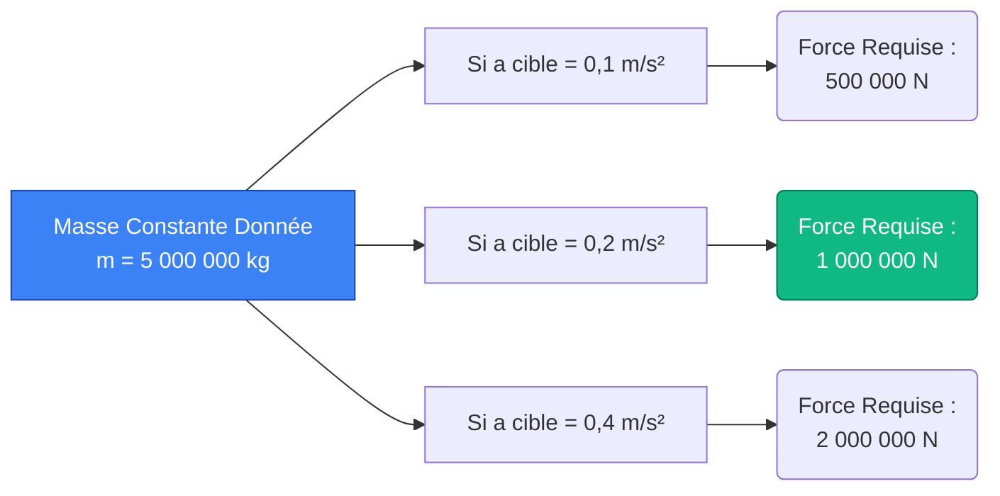
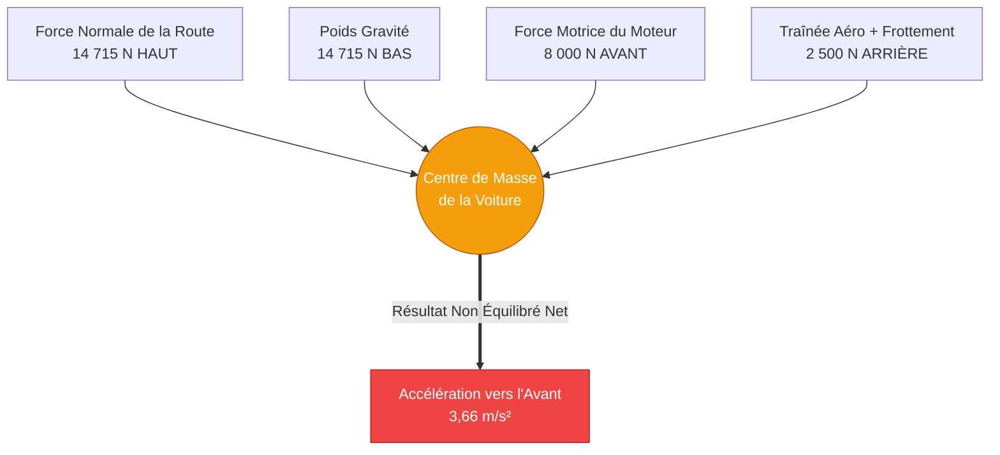
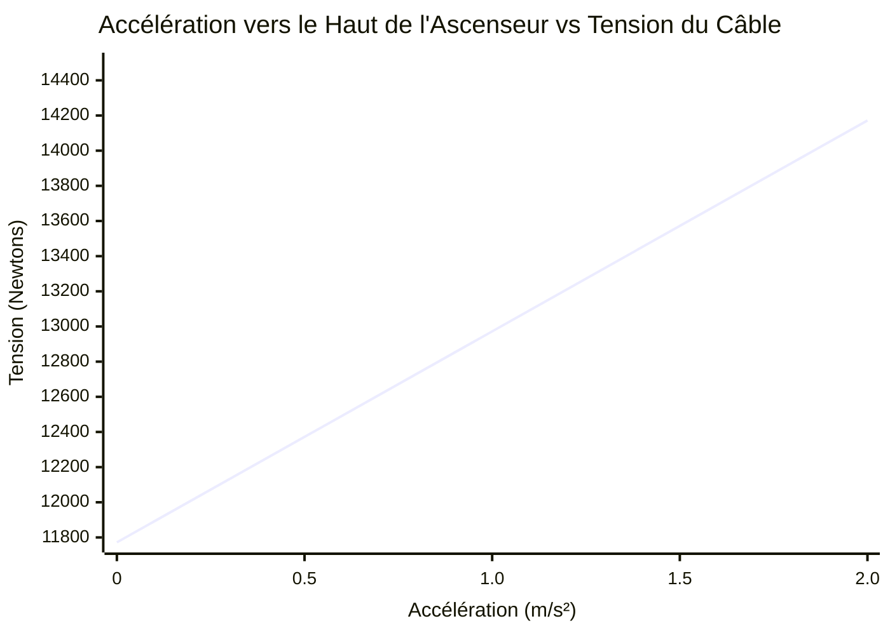
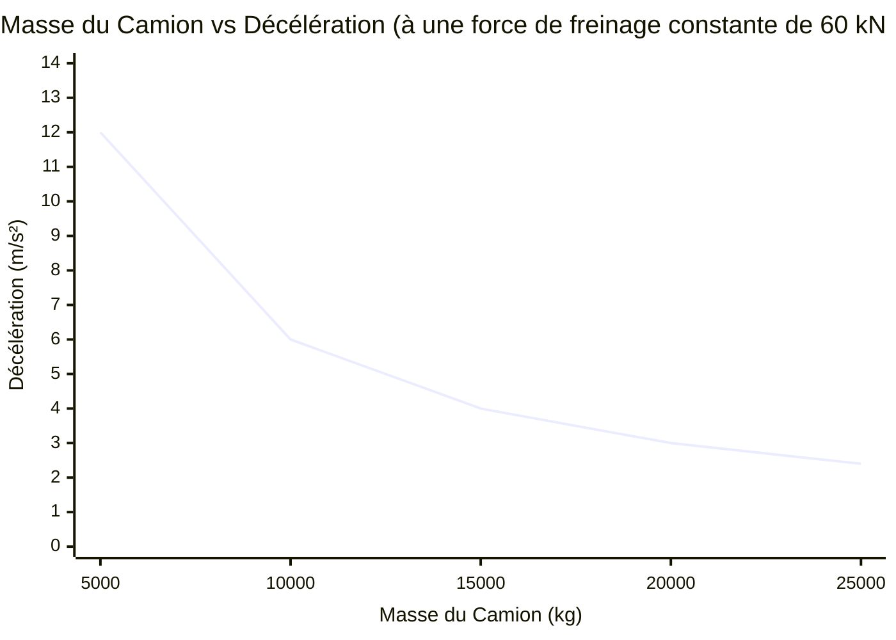

# Le Calculateur de Force Ultime : Maîtriser la Deuxième Loi de Newton et la Mécanique Vectorielle

Bienvenue dans le **Calculateur de Force** définitif et guide de physique complet. Que vous soyez un ingénieur aérospatial calculant les méga-newtons exacts de poussée requis pour mettre un satellite en orbite, un concepteur automobile analysant le frottement de freinage, ou un étudiant en physique se préparant à un examen final épuisant sur les lois du mouvement de Newton, cet outil est conçu pour une précision absolue.

La force est l'interaction fondamentale qui motive tout changement dans l'univers physique. Sans force, l'univers est parfaitement statique : les objets au repos restent exactement là où ils sont, et les objets se déplaçant dans le vide continuent pour toujours à la même vitesse. La force brise cette inertie.

Dans cette plongée massive de plus de 4 000 mots, nous allons complètement déconstruire le concept de force mécanique. Nous explorerons les fondements mathématiques de la Deuxième Loi de Newton ($F = m \cdot a$), analyserons la différence entre force nette et force équilibrée, vous guiderons à travers des stratégies de calcul avancées et examinerons cinq exemples d'ingénierie du monde réel visualisés avec des diagrammes Mermaid.js détaillés.

---

## 1. La Physique de la Force : Briser l'Inertie

Pour comprendre la force, nous devons d'abord comprendre l'inertie, telle que définie par la **Première loi du mouvement de Sir Isaac Newton** :
> *Un objet au repos reste au repos et un objet en mouvement reste en mouvement avec la même vitesse et dans la même direction, à moins qu'il ne soit soumis à une force non équilibrée.*

La force est le mécanisme par lequel nous outrepassons l'inertie. C'est une **grandeur vectorielle**, ce qui signifie qu'elle possède à la fois une magnitude (la force de la poussée ou de la traction) et une direction (l'endroit vers lequel la poussée ou la traction est dirigée).

### Forces Équilibrées vs Non Équilibrées
Imaginez un coffre-fort lourd reposant sur le sol. La gravité tire le coffre-fort vers le bas, vers le centre de la Terre, avec une force de $10\ 000\text{ N}$. Le sol en béton solide pousse le coffre-fort vers le haut avec une Force Normale d'exactement $10\ 000\text{ N}$.
Parce que la force vers le haut annule parfaitement la force vers le bas, la **Force Nette** est exactement zéro ($0\text{ N}$). Ce sont des **forces équilibrées**. Par conséquent, le coffre-fort n'accélère pas ; il reste exactement là où il est.

Imaginez maintenant que vous attachez un treuil au coffre-fort et que vous le tirez horizontalement vers la droite avec une force de $500\text{ N}$. Le frottement du sol résiste avec une force de $200\text{ N}$ vers la gauche.
Les forces horizontales ne sont plus équilibrées. Vous avez une **Force Nette** de $300\text{ N}$ poussant vers la droite. Parce qu'il y a une force nette non équilibrée, le coffre-fort va immédiatement commencer à accélérer vers la droite.

### Les Quatre Forces Fondamentales de la Nature
Bien que notre calculateur traite de la mécanique classique macroscopique (souvent appelée Forces de Contact ou Forces Appliquées), toutes les forces de l'univers proviennent de quatre interactions fondamentales :
1. **La Force Nucléaire Forte :** La force la plus forte, liant les protons et les neutrons ensemble dans les noyaux atomiques.
2. **L'Électromagnétisme :** La force agissant entre les particules chargées électriquement (c'est la cause profonde du frottement, de la tension et de la force normale au niveau moléculaire).
3. **La Force Nucléaire Faible :** Responsable de la désintégration radioactive.
4. **La Gravité :** La force la plus faible, mais la seule avec une portée infinie, provoquant l'attraction des masses entre elles.

---

## 2. Les Mathématiques de Base : Deuxième Loi de Newton

Si la Première Loi définit ce qui se passe lorsqu'il n'y a *aucune* force nette, la **Deuxième Loi de Newton** définit exactement ce qui se passe lorsqu'il *y a* une force nette.

La Deuxième Loi stipule que l'accélération d'un objet est directement proportionnelle à la force nette agissant sur lui, et inversement proportionnelle à sa masse. Mathématiquement, cela s'exprime ainsi :

$$ F = m \cdot a $$

Où :
- **$F$** = Force Nette (mesurée en Newtons, $N$)
- **$m$** = Masse (mesurée en kilogrammes, $kg$)
- **$a$** = Accélération (mesurée en mètres par seconde au carré, $m/s^2$)

### La Relation Proportionnelle
L'équation $F = m \cdot a$ est élégamment simple mais profondément puissante. Elle nous apprend deux choses essentielles sur l'univers :
1. **Proportionnalité Directe :** Si vous voulez doubler l'accélération d'un objet donné, vous devez doubler la force appliquée.
2. **Proportionnalité Inverse :** Si vous appliquez exactement la même force à un objet deux fois plus massif, il accélérera à la moitié de la vitesse.

### Dériver la Masse et l'Accélération
En utilisant l'algèbre de base, nous pouvons réorganiser la Deuxième Loi de Newton pour résoudre les autres variables.

Pour trouver la Masse lorsque la Force et l'Accélération sont connues :
$$ m = \frac{F}{a} $$

Pour trouver l'Accélération lorsque la Force et la Masse sont connues :
$$ a = \frac{F}{m} $$

Notre calculateur dynamique gère les trois permutations instantanément.

---

## 3. Guide d'Utilisation Complet : Maximiser le Calculateur

Notre Calculateur de Force interactif est conçu pour gérer de simples vérifications de devoirs et des analyses complexes de charges d'ingénierie. Voici un guide étape par étape pour utiliser ses fonctionnalités avancées.

### Étape 1 : Sélectionnez Votre Variable Cible
En haut de l'interface, choisissez ce que vous essayez de résoudre :
- **Résoudre pour la Force (F) :** Sélectionnez ceci si vous connaissez la masse du véhicule/de l'objet et le taux auquel il accélère.
- **Résoudre pour la Masse (m) :** Sélectionnez ceci si vous connaissez la force qu'un actionneur applique et à quelle vitesse l'objet accélère en conséquence.
- **Résoudre pour l'Accélération (a) :** Sélectionnez ceci si vous connaissez le poids exact d'une charge utile et la poussée maximale de votre moteur.

### Étape 2 : Entrez les Valeurs et Conversions Intelligentes d'Unités
Vous n'avez pas besoin d'effectuer de conversions d'unités manuelles avant d'utiliser l'outil.
- Vous pouvez entrer la masse en **Grammes**, **Livres (lbs)** ou **Kilogrammes**.
- Vous pouvez entrer l'accélération en **Force-G**, **$ft/s^2$** ou **$m/s^2$**.
- Le moteur backend du calculateur normalise instantanément toutes les entrées en unités SI standard (Kilogrammes et $m/s^2$) avant d'exécuter l'algorithme $F = ma$.

### Étape 3 : Interprétez la Jauge de Force Logarithmique
La force évolue de manière exponentielle dans le monde réel. Un être humain poussant un chariot de supermarché exerce environ $50\text{ N}$. Un lancement de fusée SpaceX exerce $22\ 000\ 000\text{ N}$.
Pour représenter cela visuellement, notre **Jauge de Force en Arc** fonctionne sur une échelle logarithmique. Elle classe votre résultat dans des catégories du monde réel :
- **Micro-Forces (Vert) :** Insectes qui marchent, pommes qui tombent, pas humains.
- **Macro-Forces (Bleu) :** Voitures qui accélèrent, machines industrielles, ascenseurs.
- **Méga-Forces (Rouge) :** Moteurs à réaction, déplacements de plaques tectoniques, propulseurs de fusées orbitales.

### Étape 4 : Activez le Mode Avancé pour la Visualisation des Données
Passer en **Mode Avancé** déverrouille les graphiques interactifs Recharts :
- **Le Graphique Force vs Accélération :** Affiche une pente linéaire démontrant comment la force requise évolue parfaitement en fonction de l'accélération ciblée pour votre masse spécifique.
- **L'Animateur de Mouvement Vectoriel :** Affiche une toile 2D dynamique montrant un bloc poussé, avec des flèches vectorielles se dimensionnant proportionnellement en fonction de l'intensité de votre force calculée.

---

## 4. Cinq Exemples d'Ingénierie Conceptuelle avec Visualisations 2D

Pour combler le fossé entre la théorie algébrique et l'application dans le monde réel, explorons cinq exemples détaillés de mécanique des forces, en utilisant Mermaid.js pour visualiser la physique.

### Exemple 1 : Le Train de Marchandises (Force vs Masse)

**Le Scénario :**
Une énorme locomotive diesel est chargée de tirer un train de marchandises chargé de charbon. La masse totale du train est de $5\ 000\ 000\text{ kg}$ (5 000 tonnes métriques). L'ingénieur du train doit accélérer le train hors de la gare à un rythme fluide et constant de $0,2\text{ m/s}^2$ pour éviter de briser les attelages. Quelle force de traction nette les moteurs de la locomotive doivent-ils générer ?

**Les Mathématiques :**
- Masse ($m$) = $5\ 000\ 000\text{ kg}$
- Accélération ($a$) = $0,2\text{ m/s}^2$

En utilisant $F = m \cdot a$ :
$$ F = 5\ 000\ 000 \times 0,2 = 1\ 000\ 000\text{ Newtons (1 Méganewton)} $$

La locomotive doit générer une force nette vers l'avant de 1 Méga-Newton juste pour atteindre cette légère accélération.

**Visualisation 2D :**
L'arbre logique ci-dessous illustre comment la Deuxième Loi de Newton évolue de manière linéaire lorsque la masse est constante.

---

### Exemple 2 : Le Diagramme du Corps Libre (Résolution de la Force Nette)

**Le Scénario :**
Une voiture de sport de $1\ 500\text{ kg}$ accélère sur une autoroute. Le moteur pousse la voiture vers l'avant avec une force motrice de $8\ 000\text{ N}$. Cependant, la résistance aérodynamique au vent (traînée) pousse vers l'arrière avec $2\ 000\text{ N}$, et la friction de roulement mécanique pousse vers l'arrière avec $500\text{ N}$. Quelle est l'accélération réelle de la voiture ?

**Les Mathématiques :**
Tout d'abord, nous devons calculer la **Force Nette** ($F_{nette}$) sur l'axe horizontal. Nous soustrayons les forces de résistance de la force motrice :
$$ F_{nette} = F_{moteur} - (F_{traînée} + F_{frottement}) $$
$$ F_{nette} = 8\ 000 - (2\ 000 + 500) = 5\ 500\text{ N} $$

Maintenant que nous avons la vraie force nette, nous utilisons la formule réarrangée pour trouver l'accélération :
$$ a = \frac{F_{nette}}{m} = \frac{5\ 500}{1\ 500} = 3,66\text{ m/s}^2 $$

**Visualisation 2D :**
Ce Diagramme du Corps Libre classique cartographie visuellement les forces opposées agissant sur le centre de masse du véhicule.

---

### Exemple 3 : Tension du Câble d'Ascenseur (Résoudre pour les Forces Verticales)

**Le Scénario :**
Une cabine d'ascenseur d'une masse de $1\ 200\text{ kg}$ doit accélérer vers le haut à partir du rez-de-chaussée à un taux de $1,5\text{ m/s}^2$. Quelle est la force de tension absolue tirant sur le lourd câble de support en acier ?

**Les Mathématiques :**
Il s'agit d'un problème de force verticale. Le câble ne doit pas seulement accélérer l'ascenseur ; il doit *d'abord* maintenir l'ascenseur contre la gravité terrestre.
- Force de Gravité (Poids) = $m \cdot g = 1\ 200 \times 9,81 = 11\ 772\text{ N}$ vers le bas.
- Force Nette requise pour accélérer vers le haut = $m \cdot a = 1\ 200 \times 1,5 = 1\ 800\text{ N}$ vers le haut.

La Tension totale ($T$) dans le câble doit être égale à la force de gravité PLUS la force nécessaire à l'accélération :
$$ T = F_{gravité} + F_{nette} $$
$$ T = 11\ 772 + 1\ 800 = 13\ 572\text{ N} $$

Le câble en acier subit près de $13,6\text{ kN}$ de force de tension.

**Visualisation 2D :**
Le graphique ci-dessous trace la relation linéaire entre l'accélération requise et la tension du câble qui en résulte.

*(Remarquez qu'à $0\text{ m/s}^2$ d'accélération, la tension n'est pas nulle ; elle est égale au poids au repos de $11\ 772\text{ N}$).*

---

### Exemple 4 : Le Lancement d'Apollo Saturn V (Méga-Newtons en Action)

**Le Scénario :**
La fusée Saturn V, qui a transporté des humains vers la Lune, était la machine la plus puissante jamais construite. Au décollage, elle avait une masse absolument vertigineuse de $2\ 970\ 000\text{ kg}$. Pour échapper à la gravité terrestre et atteindre une accélération initiale vers le haut d'exactement $1,5\text{ m/s}^2$, quelle force de poussée totale ses cinq moteurs F-1 devaient-ils produire ?

**Les Mathématiques :**
Comme l'ascenseur, les moteurs doivent vaincre la gravité avant de pouvoir accélérer le véhicule.
$$ F_{gravité} = m \cdot g = 2\ 970\ 000 \times 9,81 = 29\ 135\ 700\text{ N (29,14 MN)} $$

La force nette supplémentaire requise pour atteindre l'accélération de $1,5\text{ m/s}^2$ est :
$$ F_{nette} = m \cdot a = 2\ 970\ 000 \times 1,5 = 4\ 455\ 000\text{ N (4,45 MN)} $$

Poussée totale requise du moteur :
$$ Poussée = 29\ 135\ 700 + 4\ 455\ 000 = 33\ 590\ 700\text{ Newtons (33,6 MN)} $$

**Visualisation 2D :**
À mesure que la fusée brûle des milliers de gallons de carburant par seconde, sa masse diminue rapidement. Parce que la poussée est constante mais que la masse chute, l'accélération monte en flèche. Ce diagramme de Gantt cartographie les forces violemment changeantes.

```mermaid
gantt
    title Profil d'Ascension du Premier Étage de Saturn V
    dateFormat  HH:mm:ss
    axisFormat %M:%S
    section Décollage
    Allumage (Masse Élevée, Faible Accél 1,5g) :active, id1, 00:00:00, 30s
    Max Q (Pics de Traînée Aérodynamique) :crit, id2, after id1, 30s
    section Ascension Tardive
    Perte Rapide de Masse (Carburant Brûlé) : id3, after id2, 60s
    Force Maximale Pré-Séparation (Haute Accél 4g) :milestone, id4, after id3, 0s
```

---

### Exemple 5 : Freinage et Frottement (Force Négative)

**Le Scénario :**
Un camion semi-remorque de $10\ 000\text{ kg}$ se déplace à $25\text{ m/s}$ (90 km/h). Le conducteur voit un danger et bloque les freins. Le frottement cinétique entre les pneus bloqués et l'asphalte fournit une force de résistance maximale de $-60\ 000\text{ N}$. Quelle est la décélération du camion et combien de temps faudra-il pour s'arrêter ?

**Les Mathématiques :**
Tout d'abord, trouvez la décélération (accélération négative) en utilisant $a = F/m$ :
$$ a = \frac{-60\ 000}{10\ 000} = -6,0\text{ m/s}^2 $$

Ensuite, utilisez la cinématique ($t = \frac{v_f - v_i}{a}$) pour trouver le temps d'arrêt.
- $v_i$ = $25\text{ m/s}$
- $v_f$ = $0\text{ m/s}$ (arrêté)
$$ t = \frac{0 - 25}{-6,0} = 4,16\text{ secondes} $$

**Visualisation 2D :**
Ce graphique montre que si le camion était plus lourd (masse plus élevée), la force de freinage exacte entraînerait une décélération considérablement moindre.

*(Plus le véhicule est lourd, moins les performances de freinage sont bonnes, démontrant la relation inverse $a \propto 1/m$).*

---

## 5. Plongée dans la Foire Aux Questions (FAQ)

**Q : Peut-on avoir une force sans mouvement ?**
**R :** Absolument. Si vous poussez contre un mur de briques solide de toutes vos forces ($500\text{ N}$ de force), le mur repousse avec exactement $500\text{ N}$ de force normale. Parce que les forces sont équilibrées, la force nette est nulle, et il n'y a aucun mouvement. Vous appliquez une force, mais ne générez aucun travail et aucune accélération.

**Q : Quelle est la différence entre le Poids et la Masse ?**
**R :** C'est la distinction la plus critique en physique d'introduction. La **Masse** est une mesure de la quantité de matière dans un objet (mesurée en kilogrammes). Elle est la même partout dans l'univers. Le **Poids** est une *force* (mesurée en Newtons). C'est le résultat de la gravité agissant sur la masse ($P = m \cdot g$). Un astronaute d'une masse de $80\text{ kg}$ pèse $784\text{ N}$ sur Terre, mais seulement $130\text{ N}$ sur la Lune. Sa masse n'a jamais changé, seule la force gravitationnelle a changé.

**Q : Pourquoi les objets plus lourds tombent-ils à la même vitesse que les objets plus légers dans le vide ?**
**R :** La gravité tire plus fort sur les objets plus lourds (un rocher a plus de force de poids vers le bas qu'un caillou). Cependant, les objets plus lourds ont aussi plus de *masse* (inertie), ce qui signifie qu'ils nécessitent proportionnellement plus de force pour accélérer. Selon $a = F/m$, si la Force gravitationnelle ($F$) augmente exactement au même rythme que la Masse ($m$), l'Accélération résultante ($a$) reste parfaitement constante ($9,81\text{ m/s}^2$).

**Q : Qu'est-ce que la Force Centrifuge, et est-elle "fausse" ?**
**R :** La force centrifuge est souvent appelée une force "fictive" ou "inertielle". Lorsque vous êtes dans une voiture qui prend un virage serré à gauche, vous vous sentez projeté vers la droite. Il n'y a pas de force réelle vous poussant vers la droite ; au lieu de cela, la masse de votre corps veut continuer en ligne droite (inertie) pendant que la voiture tourne vers vous. La seule vraie force est la **Force Centripète** (le frottement des pneus) qui tire la voiture vers la gauche.

**Q : Quel est le rapport entre les airbags, la Force et la Deuxième Loi de Newton ?**
**R :** Une autre façon d'écrire la deuxième loi de Newton est $F = \frac{\Delta p}{\Delta t}$ (La force est égale à la variation de la quantité de mouvement divisée par la variation de temps). Lors d'un accident de voiture, votre quantité de mouvement passe à zéro, que vous heurtiez le volant ou un airbag. Cependant, l'airbag augmente considérablement le *temps* ($\Delta t$) qu'il vous faut pour vous arrêter. En divisant le même changement de quantité de mouvement par un temps beaucoup plus long, la force de crête résultante ($F$) exercée sur votre crâne est réduite de façon exponentielle, vous sauvant ainsi la vie.

---

## 6. Conclusion et Défi d'Ingénierie

La Deuxième Loi de Newton ($F = ma$) est la clé de voûte de l'ingénierie mécanique, de la planification de trajectoire aérospatiale et de la physique classique. Elle prouve que l'univers fonctionne sur un système d'échanges énergétiques équilibrés et non équilibrés.

Pour vraiment maîtriser ces concepts, utilisez notre Calculateur de Force pour résoudre les défis conceptuels d'ingénierie suivants :
1. **Le Train à Grande Vitesse :** Calculez la force de poussée requise pour accélérer un train à sustentation magnétique de $400\ 000\text{ kg}$ du repos à $100\text{ m/s}$ en $60\text{ secondes}$.
2. **La Déviation d'Astéroïde :** Un astéroïde de $10\ 000\ 000\text{ kg}$ se dirige vers la Terre. Si un moteur de satellite pousse contre lui avec une force constante de $500\text{ N}$ pendant exactement un an, quel sera le changement de vitesse latérale finale de l'astéroïde ?
3. **La Dépanneuse :** Si le câble d'une dépanneuse est conçu pour se rompre à $30\ 000\text{ N}$ de tension, quel est le taux d'accélération maximum absolu qu'elle peut appliquer en toute sécurité à un SUV en panne de $3\ 000\text{ kg}$ ?

Expérimentez avec les variables, basculez de manière transparente entre les unités SI et impériales, et comptez sur ce calculateur pour illuminer les forces mathématiques cachées qui régissent le monde physique qui vous entoure.
