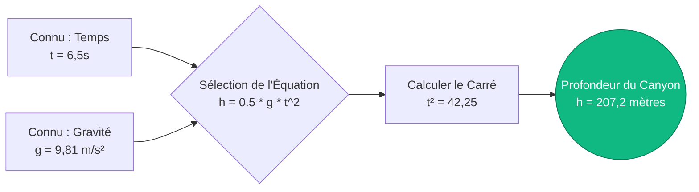
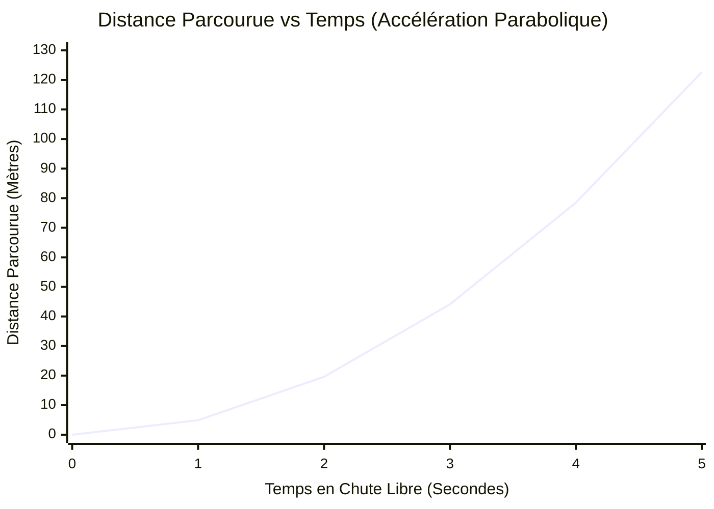
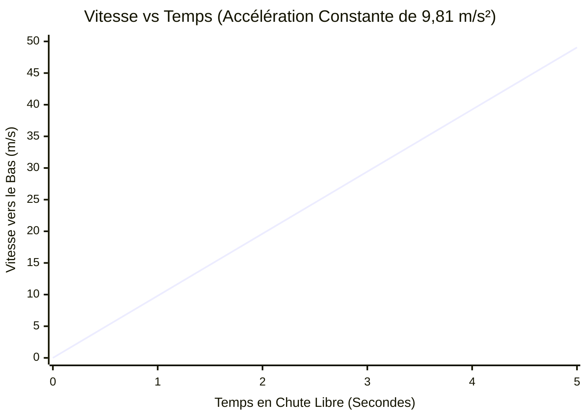
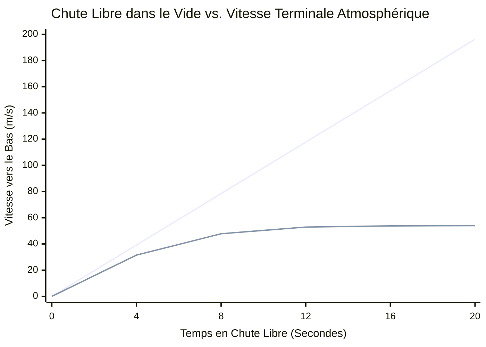

# L'Ultime Calculateur de Chute Libre : Maîtriser la Cinématique et l'Accélération Gravitationnelle

Bienvenue dans le **Calculateur de Chute Libre** définitif et guide de physique complet. Que vous soyez un instructeur de parachutisme calculant les altitudes de déploiement, un ingénieur aérospatial simulant la dynamique de rentrée orbitale, ou un étudiant en physique essayant de maîtriser les lois du mouvement de Galilée, cet outil offre une précision inégalée.

La chute libre est la forme de mouvement la plus pure de l'univers. C'est la physique des objets accélérant sous la force exclusive et implacable de la gravité. D'une pomme tombant d'une branche d'arbre aux astronautes flottant à bord de la Station Spatiale Internationale, les mathématiques de la chute libre dictent tout.

Dans ce guide technique massif de plus de 4 000 mots, nous allons déconstruire de manière exhaustive la cinématique de la chute libre ($h = \frac{1}{2}gt^2$). Nous explorerons l'histoire de la science gravitationnelle, la différence critique entre l'accélération dans le vide et la vitesse terminale atmosphérique, et nous vous guiderons à travers cinq scénarios d'ingénierie et de sport du monde réel, visualisés avec des diagrammes Mermaid.js détaillés.

---

## 1. La Physique de la Chute Libre : Mouvement sous l'effet de la Gravité

En physique newtonienne, la **Chute Libre** est définie comme le mouvement d'un corps où la gravité est la *seule* force agissant sur lui.

Cela signifie qu'au sens purement physique, un parachutiste tombant dans l'air n'est *pas* en parfaite chute libre, car la résistance de l'air atmosphérique (traînée) le repousse vers le haut. La vraie chute libre ne se produit que dans un vide parfait, comme à la surface de la Lune ou à l'intérieur de chambres de chute sous vide spécialisées.

Cependant, pour les objets denses et lourds tombant sur des distances relativement courtes sur Terre (comme lâcher un roulement à billes en acier d'un bureau), la résistance de l'air est si mathématiquement négligeable que nous la traitons comme une véritable chute libre.

### Galilée et l'Égalité des Masses en Chute
Avant la fin du XVIe siècle, le consensus scientifique (défendu par Aristote) était que les objets plus lourds tombaient plus vite que les objets plus légers. Galileo Galilei a brisé ce paradigme.

Grâce à ses expériences légendaires (souvent liées de façon apocryphe au lâcher de sphères depuis la tour penchée de Pise), Galilée a prouvé que **en l'absence de résistance de l'air, tous les objets accélèrent vers le bas exactement au même rythme, indépendamment de leur masse.**

Si vous lâchez une boule de démolition de $5 000\text{ kg}$ et une balle de golf de $0,05\text{ kg}$ dans une chambre à vide au même moment exact et de la même hauteur exacte, elles frapperont le sol à la même milliseconde exacte.

### Accélération Standard Due à la Gravité ($g$)
Sur Terre, le taux standard d'accélération gravitationnelle est noté par la lettre minuscule $g$.

$$ g \approx 9,81\text{ m/s}^2 $$

Cela signifie que pour chaque seconde pendant laquelle un objet est en chute libre, sa vitesse vers le bas augmente de $9,81\text{ mètres par seconde}$ ($35,3\text{ km/h}$ ou $21,9\text{ mph}$).

---

## 2. Les Équations Cinématiques de Base

Les mathématiques de la chute libre sont régies par les équations cinématiques 1D standard du mouvement sous accélération constante. Lorsqu'un objet est lâché du repos, sa vitesse initiale ($v_i$) est précisément nulle, ce qui simplifie considérablement les équations.

### Équation 1 : Temps de Chute ($t$)
Si vous connaissez la hauteur ($h$) d'où un objet est lâché, vous pouvez calculer exactement combien de secondes il lui faudra pour toucher le sol.

$$ t = \sqrt{\frac{2 \cdot h}{g}} $$

### Équation 2 : Vitesse d'Impact ($v_f$)
Si vous connaissez la hauteur de chute, vous pouvez calculer exactement à quelle vitesse l'objet se déplacera la milliseconde avant de heurter le sol.

$$ v_f = \sqrt{2 \cdot g \cdot h} $$
*(Alternativement, si vous avez déjà calculé le temps $t$, vous pouvez simplement utiliser $v_f = g \cdot t$)*

### Équation 3 : Distance Parcourue ($h$)
Si vous chronométrez combien de temps un objet met pour heurter le sol, vous pouvez retrouver la hauteur exacte de la chute. C'est une méthode courante pour estimer la profondeur d'un puits sombre ou d'un canyon.

$$ h = \frac{1}{2} \cdot g \cdot t^2 $$

### La Courbe Parabolique de la Distance
La caractéristique la plus critique de l'équation de la distance est que le temps est **au carré** ($t^2$). Un objet ne tombe pas à une vitesse constante ; il accélère.
- Dans la 1ère seconde, un objet tombe d'environ $4,9\text{ mètres}$.
- Dans la 2ème seconde, il ne tombe pas d'autres $4,9\text{ mètres}$—il tombe d'autres $14,7\text{ mètres}$ !
- Après 2 secondes de vol total, il a parcouru $19,6\text{ mètres}$ ($4,9 \times 4$).

La distance parcourue évolue de manière parabolique, et non linéaire.

---

## 3. Vitesse Terminale (L'Atmosphère Contre-Attaque)

Bien que les équations ci-dessus supposent un vide parfait, nous vivons sur une planète dotée d'une atmosphère épaisse. Lorsqu'un objet accélère vers le bas, il doit repousser les molécules d'air sur son chemin. Cela crée une traînée aérodynamique.

La force de traînée augmente quadratiquement avec la vitesse ($F_D \propto v^2$). Par conséquent, à mesure que l'objet tombe de plus en plus vite, la force de traînée vers le haut qui pousse contre lui devient exponentiellement plus forte.

Finalement, la force de traînée vers le haut devient exactement égale au poids gravitationnel vers le bas de l'objet. Lorsque ces forces s'équilibrent, l'accélération nette devient nulle. L'objet cesse d'accélérer et tombe à une vitesse constante et maximale appelée **Vitesse Terminale**.

$$ v_t = \sqrt{\frac{2 \cdot m \cdot g}{\rho \cdot A \cdot C_d}} $$

Où $\rho$ est la densité de l'air, $A$ est la surface transversale frontale, et $C_d$ est le coefficient de traînée aérodynamique.

Parce que la masse ($m$) est au numérateur, les objets plus lourds (comme les boules de bowling) ont une vitesse terminale beaucoup plus élevée que les objets plus légers avec des surfaces similaires (comme les ballons). C'est pourquoi une plume tombe plus lentement qu'un marteau dans votre salon, mais ils tombent exactement à la même vitesse dans une chambre à vide.

---

## 4. Guide d'Utilisation Complet : Maximiser le Calculateur

Notre calculateur interactif de chute libre est conçu pour résoudre instantanément n'importe quelle variable cinématique manquante, sur n'importe quelle planète.

### Étape 1 : Sélectionner la Cible de Calcul
Utilisez l'interface pour définir ce que vous voulez résoudre :
- **Temps (t) :** Saisissez la hauteur et la gravité pour savoir combien de temps dure une chute.
- **Vitesse (vf) :** Saisissez la hauteur et la gravité pour trouver la vitesse d'impact destructrice.
- **Hauteur (h) :** Saisissez le temps de chute et la gravité pour mesurer la profondeur d'une falaise.
- **Gravité (g) :** Saisissez le temps de chute et la hauteur pour rétro-ingénierer la gravité d'une planète inconnue !

### Étape 2 : Utiliser les Préréglages de Gravité Planétaire
La gravité n'est pas universelle. Notre calculateur vous permet de basculer instantanément entre 10 corps célestes.
Vous voulez savoir combien de temps il faut à une clé pour tomber de $50\text{ mètres}$ sur la Lune ? Sélectionnez le **Préréglage de la Lune** ($1,62\text{ m/s}^2$), et les calculs sont instantanément mis à jour.

### Étape 3 : Interpréter l'Arc de Vitesse Logarithmique
La **Jauge Radiale de Vitesse d'Impact** catégorise la vitesse finale calculée de manière logarithmique :
- **Vert (Basse Énergie) :** Impacts sûrs et à faible vitesse (lâcher des clés, tomber d'une chaise).
- **Bleu (Haute Énergie) :** Impacts dangereux et à haute vitesse (tomber d'un toit, faire tomber un marteau d'un échafaudage).
- **Rouge (Énergie Extrême) :** Vitesses mortelles et terminales (parachutisme, impacts de météorites).

---

## 5. Cinq Scénarios d'Ingénierie Conceptuelle avec Visualisations 2D

Pour bien saisir la cinématique de la chute libre, nous allons explorer cinq scénarios de physique détaillés, en utilisant Mermaid.js pour déconstruire visuellement les mathématiques et les courbes de mouvement.

### Exemple 1 : Le Test de Profondeur du Canyon (Flux Logique Cinématique)

**Le Scénario :**
Un randonneur se tient au bord d'un canyon massif et sombre. Il veut savoir exactement à quelle profondeur il est. Il lâche une lourde roche par-dessus le bord et déclenche son chronomètre. Exactement $6,5\text{ secondes}$ plus tard, il entend la roche s'écraser au fond du canyon. En supposant que la résistance de l'air sur la roche lourde soit négligeable, quelle est la profondeur du canyon ?

**Les Mathématiques :**
Nous utilisons la formule de la distance ($h = 0,5 \cdot g \cdot t^2$) :
$$ h = 0,5 \cdot 9,81\text{ m/s}^2 \cdot (6,5\text{ s})^2 $$
$$ h = 4,905 \cdot 42,25 = 207,2\text{ mètres} $$

Le canyon a une profondeur stupéfiante de $207\text{ mètres}$ (environ 680 pieds).

**Visualisation 2D :**
L'arborescence logique ci-dessous illustre comment nous choisissons la bonne équation cinématique en fonction de nos variables connues.

---

### Exemple 2 : Distance Parcourue par Rapport au Temps (La Courbe Parabolique)

**Le Scénario :**
Analysons la trajectoire de vol exacte d'un roulement à billes en acier lâché depuis un hélicoptère en vol stationnaire. Nous voulons tracer sa distance de chute exacte aux repères de 1, 2, 3, 4 et 5 secondes pour visualiser la courbe d'accélération $t^2$.

**Les Mathématiques :**
- À $1\text{ sec}$ : $h = 0,5 \cdot 9,81 \cdot (1)^2 = 4,9\text{ m}$
- À $2\text{ sec}$ : $h = 0,5 \cdot 9,81 \cdot (2)^2 = 19,6\text{ m}$
- À $3\text{ sec}$ : $h = 0,5 \cdot 9,81 \cdot (3)^2 = 44,1\text{ m}$
- À $4\text{ sec}$ : $h = 0,5 \cdot 9,81 \cdot (4)^2 = 78,5\text{ m}$
- À $5\text{ sec}$ : $h = 0,5 \cdot 9,81 \cdot (5)^2 = 122,6\text{ m}$

**Visualisation 2D :**
Remarquez la courbe extrême. Entre la 4ème et la 5ème seconde, la balle est tombée de $44\text{ mètres}$ en une seule seconde. Plus vous tombez longtemps, plus la distance disparaît rapidement.

---

### Exemple 3 : Vitesse par Rapport au Temps (Accélération Linéaire)

**Le Scénario :**
En utilisant le même roulement à billes en acier lâché de l'hélicoptère, examinons sa vitesse plutôt que sa distance. Comme l'accélération ($g$) est constante à $9,81\text{ m/s}^2$, la vitesse devrait augmenter d'exactement $9,81\text{ m/s}$ à chaque seconde.

**Les Mathématiques :**
Nous utilisons la formule de la vitesse ($v = g \cdot t$) :
- À $1\text{ sec}$ : $v = 9,81 \cdot 1 = 9,81\text{ m/s}$ ($35\text{ km/h}$)
- À $2\text{ sec}$ : $v = 9,81 \cdot 2 = 19,62\text{ m/s}$ ($70\text{ km/h}$)
- À $3\text{ sec}$ : $v = 9,81 \cdot 3 = 29,43\text{ m/s}$ ($106\text{ km/h}$)
- À $4\text{ sec}$ : $v = 9,81 \cdot 4 = 39,24\text{ m/s}$ ($141\text{ km/h}$)

**Visualisation 2D :**
Contrairement à la distance, qui s'incurve agressivement, la vitesse sous une accélération constante forme une ligne droite parfaite et prévisible.

---

### Exemple 4 : Physique du Vide vs. Vitesse Terminale

**Le Scénario :**
Un parachutiste humain saute d'un avion à $4 000\text{ mètres}$. Nous voulons comparer sa courbe de vitesse réelle (qui prend en compte la traînée de l'air atmosphérique) par rapport à sa vitesse théorique s'il avait sauté dans un vide complet (où $v = gt$ continue éternellement).

**Les Mathématiques :**
En réalité, un parachutiste humain en position cambrée standard ventre face à la terre génère une énorme résistance de l'air. Vers la marque des 12 à 15 secondes de sa chute, il atteindra une vitesse terminale d'environ $54\text{ m/s}$ ($195\text{ km/h}$ ou $120\text{ mph}$).

S'il n'y avait pas d'air, il continuerait simplement à accélérer indéfiniment jusqu'à s'écraser au sol à des vitesses supersoniques.

**Visualisation 2D :**
Ce graphique compare de manière spectaculaire les deux réalités. La ligne du vide monte sans fin. La ligne atmosphérique du monde réel s'incurve et s'aplatit parfaitement à $54\text{ m/s}$ lorsque la traînée annule la gravité.

*(La ligne supérieure abrupte représente la physique théorique du vide. La courbe inférieure aplatie représente la Vitesse Terminale dans le monde réel).*

---

### Exemple 5 : Le Saut en Parachute à Haute Altitude (Chronologie du Processus Gantt)

**Le Scénario :**
Traçons la chronologie exacte d'un saut en parachute récréatif standard. Le sauteur quitte l'avion à $4 000\text{ mètres}$ ($13 000\text{ ft}$). Il chute librement jusqu'à $1 500\text{ mètres}$ ($5 000\text{ ft}$) avant de déployer son parachute principal. Combien de temps dure la phase de chute libre ?

**Les Mathématiques :**
Il doit chuter sur une distance totale de $2 500\text{ mètres}$ ($4 000 - 1 500$).
Comme il s'agit d'un long saut, nous ne pouvons pas utiliser la simple équation du vide $t = \sqrt{2h/g}$. Il atteindra la vitesse terminale ($54\text{ m/s}$) en environ $12\text{ secondes}$, après avoir parcouru environ $450\text{ mètres}$ au cours de cette phase d'accélération.
Pour les $2 050\text{ mètres}$ restants ($2 500 - 450$), il tombe à une vitesse constante de $54\text{ m/s}$.
$$ t_{constant} = \frac{Distance}{Vitesse} = \frac{2050}{54} = 37,9\text{ secondes} $$

Temps total de chute libre = $12\text{ s}$ (accélération) + $37,9\text{ s}$ (terminale constante) = **$49,9\text{ secondes}$**.

**Visualisation 2D :**
Ce diagramme de Gantt visualise la chronologie palpitante du saut, en décomposant la phase d'accélération, la phase de vitesse terminale et le trajet sous la voile du parachute.

```mermaid
gantt
    title Chronologie Standard de Parachutisme (Sortie à 4 000 m jusqu'au sol)
    dateFormat  HH:mm:ss
    axisFormat  %M:%S
    section Chute Libre
    Sortie de l'Avion & Accélération :done, 00:00:00, 00:00:12
    Vitesse Terminale Constante (54 m/s) :crit, active, 00:00:12, 00:00:50
    section Parachute
    Déploiement du Parachute Principal (Haute Décélération) :milestone, 00:00:50, 0d
    Descente sous Voile (Descente à 5 m/s) :active, 00:00:54, 00:05:54
    Atterrissage au Sol en Toute Sécurité :milestone, 00:05:54, 0d
```

---

## 6. Foire Aux Questions (FAQ) Détaillée

**Q : Pourquoi les astronautes flottent-ils dans l'espace si la gravité est partout ?**
**R :** C'est l'idée fausse la plus répandue en astrophysique ! Les astronautes à bord de la Station Spatiale Internationale (ISS) ne sont *pas* en apesanteur. À $400\text{ km}$ au-dessus de la Terre, la gravité est encore à $90\%$ aussi forte qu'à la surface. Les astronautes flottent parce qu'ils sont dans un état de **chute libre continue et perpétuelle**. L'ISS se déplace latéralement tellement vite ($28 000\text{ km/h}$) que, lorsqu'elle tombe vers la Terre, la Terre s'incurve sous elle. Ils tombent littéralement autour de la planète pour toujours.

**Q : Les objets plus lourds tombent-ils plus vite ?**
**R :** Dans le vide, absolument pas. La masse n'a aucun effet sur le taux d'accélération gravitationnelle. Cependant, dans notre atmosphère, les objets plus lourds (qui ont généralement un ratio masse/surface plus élevé) peuvent surmonter la traînée aérodynamique plus efficacement, ce qui signifie qu'ils ont une vitesse terminale plus élevée et atteindront finalement le sol plus tôt s'ils sont lâchés d'une très haute altitude.

**Q : Qu'est-ce que l'"Impesanteur" (Zéro-G) ?**
**R :** Le poids est simplement la force normale du sol qui repousse sous vos pieds. Lorsque vous êtes en chute libre, il n'y a pas de sol pour vous repousser. Par conséquent, même si votre masse reste la même, votre "poids" apparent tombe exactement à zéro. Vous vous sentez en apesanteur.

**Q : Comment fonctionne réellement un parachute ?**
**R :** Un parachute augmente considérablement la surface ($A$) de l'objet qui tombe. En repensant à notre équation de la Vitesse Terminale, si vous augmentez massivement $A$, vous diminuez massivement $v_t$. Un parachute abaisse la vitesse terminale d'un humain d'un taux mortel de $54\text{ m/s}$ à un taux de survie de $5\text{ m/s}$.

**Q : Peut-on survivre à une chute libre dans l'eau d'une hauteur extrême ?**
**R :** Généralement, non. L'eau est incompressible. Si vous frappez l'eau à la vitesse terminale ($195\text{ km/h}$), l'eau ne peut pas s'écarter assez vite. La tension superficielle et la densité font que l'eau agit presque exactement comme du béton solide. Le plongeon de l'extrême nécessite des entrées parfaitement verticales pour briser la tension superficielle et prolonger le temps de décélération.

---

## 7. Conclusion et Défi d'Ingénierie

Les mathématiques de la chute libre sont d'une élégante simplicité, mais définissent le mouvement de tout dans le cosmos. En maîtrisant la courbe parabolique $t^2$ de la distance et en comprenant l'équilibre critique de la vitesse terminale, vous débloquez la capacité de modéliser avec précision le monde physique.

Pour vraiment maîtriser ces concepts, utilisez notre Calculateur de Chute Libre pour résoudre les défis de physique conceptuelle suivants :
1. **La Chute sur la Lune :** Les astronautes d'Apollo 15 ont laissé tomber un marteau d'une hauteur de $1,2\text{ mètre}$ sur la Lune ($g = 1,62\text{ m/s}^2$). Exactement combien de secondes a-t-il fallu pour frapper la poussière lunaire ?
2. **Les Abysses de Jupiter :** Si vous laissiez tomber une lourde sphère en titane dans l'atmosphère gazeuse de Jupiter ($g = 24,79\text{ m/s}^2$) depuis un ballon à haute altitude, quelle serait sa vitesse après exactement $10\text{ secondes}$ de chute libre équivalente au vide pur ?
3. **Le Saut en Cascade :** Un cascadeur hollywoodien doit sauter d'un immeuble et heurter un airbag spécialisé exactement $3,5\text{ secondes}$ après avoir quitté le rebord. À quelle hauteur le rebord doit-il être construit pour rendre ce timing parfaitement précis ?

Expérimentez avec le simulateur, analysez les courbes de distance paraboliques agressives et fiez-vous à ce calculateur pour éclairer les forces gravitationnelles massives qui régissent l'univers.
