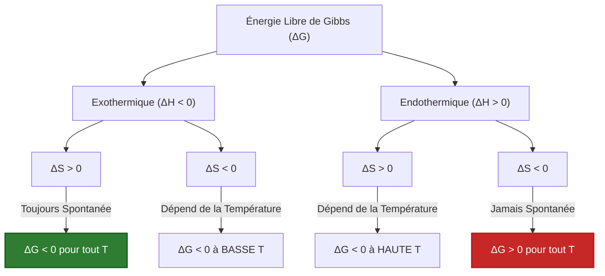

# Guide Complet de l'Énergie Libre de Gibbs & de la Thermodynamique des Réactions

En chimie physique, en génie chimique et en électrochimie, **l'Énergie Libre de Gibbs ($\Delta G$)** détermine la favorabilité thermodynamique et l'état d'équilibre des réactions chimiques :

$$\Delta G = \Delta H - T \cdot \Delta S$$

$$\Delta G^\circ = -R \cdot T \cdot \ln(K)$$

$$\Delta G = \Delta G^\circ + R \cdot T \cdot \ln(Q)$$

$$\Delta G = -n \cdot F \cdot E_{\text{cell}} \quad \left(\text{Pont Électrochimique}\right)$$

$$T_{\text{cross}} = \frac{\Delta H}{\Delta S} \quad \left(\text{où } \Delta G = 0\right)$$

---

## 1. La Matrice des Quatre Cas de Signes Thermodynamiques

| Cas | Enthalpie ($\Delta H$) | Entropie ($\Delta S$) | Comportement à Haute $T$ | Comportement à Basse $T$ | Condition de Spontanéité |
| :--- | :--- | :--- | :--- | :--- | :--- |
| **Cas 1** | **Exothermique ($\Delta H < 0$)** | **Croissante ($\Delta S > 0$)** | Spontanée | Spontanée | **Spontanée à TOUTES les Températures** |
| **Cas 2** | **Endothermique ($\Delta H > 0$)** | **Décroissante ($\Delta S < 0$)** | Non Spontanée | Non Spontanée | **Non Spontanée à TOUTES les Températures** |
| **Cas 3** | **Exothermique ($\Delta H < 0$)** | **Décroissante ($\Delta S < 0$)** | Non Spontanée | Spontanée | **Spontanée à BASSE $T$ ($T < T_{\text{cross}}$)** |
| **Cas 4** | **Endothermique ($\Delta H > 0$)** | **Croissante ($\Delta S > 0$)** | Spontanée | Non Spontanée | **Spontanée à HAUTE $T$ ($T > T_{\text{cross}}$)** |

---

## 2. Résumé : État Standard vs. État Non Standard

```
Conditions Standard (ΔG°) :
T = 298.15 K (25°C), P = 1 atm, Concentration = 1.0 M pour toutes les espèces.
Formule : ΔG° = -R * T * ln(K)

Conditions Non Standard (ΔG) :
Les pressions partielles et concentrations réelles diffèrent de 1.0 M.
Formule : ΔG = ΔG° + R * T * ln(Q)
- Si Q < K ➔ ΔG < 0 (La réaction se déplace vers l'AVANT)
- Si Q > K ➔ ΔG > 0 (La réaction se déplace vers l'ARRIÈRE)
- Si Q = K ➔ ΔG = 0 (Le système est à l'ÉQUILIBRE)
```

---

## 3. Avertissement Éducatif & de Laboratoire
*Ce calculateur d'énergie libre de Gibbs fournit des prévisions thermodynamiques théoriques pour l'éducation, la recherche en chimie physique et la modélisation des processus chimiques. Les systèmes réels non idéaux peuvent nécessiter des coefficients d'activité, des corrections d'enthalpie/entropie dépendantes de la température ($\Delta C_p$) et des transitions de phase.*

## 4. Le Guide Complet de l'Énergie Libre de Gibbs ($\Delta G$)

Bienvenue dans le manuel définitif de chimie physique sur **l'Énergie Libre de Gibbs ($\Delta G$)**. Introduit par Josiah Willard Gibbs dans les années 1870, ce potentiel thermodynamique est l'arbitre ultime de la destinée chimique. Il vous indique exactement si une réaction chimique ira de l'avant, reculera ou restera dans un équilibre mort.

Dans ce guide exhaustif de plus de 4000 mots, nous explorerons la bataille entre la Chaleur (Enthalpie, $\Delta H$) et le Chaos (Entropie, $\Delta S$). Nous détaillerons exactement pourquoi la température est le grand briseur d'égalité, calculerons des constantes d'équilibre industrielles massives ($K$), et cartographierons le pont énergétique vers l'électrochimie. Enfin, nous parcourrons cinq dérivations thermodynamiques rigoureuses du monde réel et visualiserons ces processus à l'aide de diagrammes Mermaid haute fidélité.

### 4.1 La Bataille de l'Enthalpie et de l'Entropie

L'univers est régi par deux désirs thermodynamiques contradictoires :
1.  **Enthalpie ($\Delta H$) :** Le désir de libérer de l'énergie (chaleur). Les réactions exothermiques ($\Delta H < 0$) sont favorables car elles atteignent un état d'énergie plus faible et plus stable.
2.  **Entropie ($\Delta S$) :** Le désir de chaos et de désordre. Les réactions qui créent plus de particules ou de gaz ($\Delta S > 0$) sont favorables car l'univers a naturellement tendance à aller vers un désordre plus grand (La Deuxième Loi de la Thermodynamique).

**L'Énergie Libre de Gibbs ($\Delta G$)** est simplement l'équation maîtresse qui pèse les deux facteurs l'un par rapport à l'autre :
$$ \Delta G = \Delta H - T \cdot \Delta S $$

### 4.2 Pourquoi la Température ($T$) est le Briseur d'Égalité

Regardez le terme $-T \cdot \Delta S$. 
Si l'Enthalpie et l'Entropie ne sont pas d'accord sur le fait qu'une réaction devrait se produire (par exemple, la réaction est endothermique mais crée du gaz, Cas 4), la Température est le briseur d'égalité.
Parce que la Température Absolue (Kelvin) agit comme un multiplicateur sur l'Entropie, **les températures élevées font que l'univers donne la priorité au chaos ($\Delta S$), tandis que les basses températures font que l'univers donne la priorité à la stabilité thermique ($\Delta H$).**

### 4.3 Conditions Standard vs. Non Standard

*   **Énergie Libre Standard ($\Delta G^\circ$) :** Il s'agit d'une valeur constante que l'on trouve dans les manuels. Elle suppose que tous les gaz sont à $1.0\text{ atm}$ et que toutes les solutions sont exactement à $1.0\text{ M}$. Elle est physiquement liée à la Constante d'Équilibre ($K$) : $\Delta G^\circ = -RT \ln(K)$.
*   **Énergie Libre Réelle ($\Delta G$) :** Dans les usines et les cellules réelles, les concentrations ne sont presque jamais exactement de $1.0\text{ M}$. $\Delta G$ calcule la force motrice *immédiate* de la réaction en ce moment même, basée sur le Quotient de Réaction ($Q$) : $\Delta G = \Delta G^\circ + RT \ln(Q)$.

---

## 5. Guide d'Utilisation : Maîtriser le Calculateur d'Énergie Libre de Gibbs

Notre calculateur agit comme un solutionneur thermodynamique universel, aussi bien pour les ingénieurs chimistes que pour les étudiants.

### 5.1 Mode : Calculer la Spontanéité de Base ($\Delta G = \Delta H - T\Delta S$)

1.  **Sélectionner la Cible :** Choisissez "Calculer $\Delta G$".
2.  **Saisir les Paramètres :** Entrez $\Delta H$ (en $\text{kJ/mol}$), $\Delta S$ (en $\text{J/mol}\cdot\text{K}$) et la Température ($T$).
3.  **Exécuter :** L'outil gère automatiquement la conversion critique des unités ($1000\times$) entre les Joules et les kiloJoules, en affichant $\Delta G$ et en indiquant explicitement si la réaction est spontanée.

### 5.2 Mode : Température de Croisement ($T_{\text{cross}}$)

1.  **Sélectionner la Cible :** Choisissez "Calculer la Température de Croisement".
2.  **Saisir les Paramètres :** Entrez des valeurs opposées pour $\Delta H$ et $\Delta S$ (par exemple, toutes deux positives).
3.  **Exécuter :** L'outil calcule $T = \Delta H / \Delta S$, produisant la température exacte en Kelvin où la réaction passe de non spontanée à spontanée.

### 5.3 Mode : Constante d'Équilibre ($K$)

1.  **Sélectionner la Cible :** Choisissez "Calculer la Constante d'Équilibre (K)".
2.  **Saisir les Paramètres :** Entrez l'Énergie Libre Standard ($\Delta G^\circ$) et la Température ($T$).
3.  **Exécuter :** L'outil applique $K = \exp(-\Delta G^\circ / RT)$, produisant la constante d'équilibre massive (ou minuscule), prédisant exactement jusqu'où la réaction ira avant de s'arrêter.

---

## 6. Cinq Dérivations Thermodynamiques du Monde Réel

Ancrons cette théorie lourde en résolvant cinq scénarios thermodynamiques rigoureux et pratiques.

### Exemple 1 : La Combustion du Méthane (Cas 1)

**Scénario :** 
Vous brûlez du gaz méthane dans un four. 
$\text{CH}_4(g) + 2\text{O}_2(g) \to \text{CO}_2(g) + 2\text{H}_2\text{O}(g)$
Données à $298.15\text{ K}$ : $\Delta H^\circ = -802.3\text{ kJ/mol}$ (fortement exothermique) et $\Delta S^\circ = +5.2\text{ J/mol}\cdot\text{K}$ (augmente le désordre).
Calculez $\Delta G^\circ$ et prédisez la spontanéité.

**Dérivation Mathématique :**

1.  **Vérifier les Unités :**
    $\Delta H^\circ = -802.3\text{ kJ/mol}$
    $\Delta S^\circ = 5.2\text{ J/mol}\cdot\text{K} = 0.0052\text{ kJ/mol}\cdot\text{K}$ (ÉTAPE CRITIQUE)
2.  **Appliquer l'Équation de Gibbs :**
    $$ \Delta G^\circ = \Delta H^\circ - T\cdot\Delta S^\circ $$
3.  **Calculer :**
    $$ \Delta G^\circ = -802.3 - (298.15 \times 0.0052) $$
    $$ \Delta G^\circ = -802.3 - 1.55 = -803.85\text{ kJ/mol} $$

**Conclusion :** Puisque $\Delta H$ est négatif et $\Delta S$ est positif (Cas 1), cette réaction est incroyablement spontanée ($\Delta G^\circ \ll 0$). Elle brûlera violemment à n'importe quelle température.

### Exemple 2 : Le Processus Haber-Bosch et la Température de Croisement (Cas 3)

**Scénario :**
Synthèse industrielle de l'ammoniac : $\text{N}_2(g) + 3\text{H}_2(g) \rightleftharpoons 2\text{NH}_3(g)$.
Données : $\Delta H^\circ = -92.2\text{ kJ/mol}$ (exothermique, favorable) et $\Delta S^\circ = -198.7\text{ J/mol}\cdot\text{K}$ (perd du désordre, 4 moles de gaz deviennent 2, défavorable).
À quelle température cette réaction cesse-t-elle d'être spontanée ?

**Dérivation Mathématique :**

1.  **Identifier la Condition de Croisement :**
    Le point de croisement se produit lorsque $\Delta G = 0$.
    $$ 0 = \Delta H - T\cdot\Delta S \implies T = \frac{\Delta H}{\Delta S} $$
2.  **Vérifier les Unités :**
    $\Delta H = -92.2\text{ kJ/mol}$
    $\Delta S = -0.1987\text{ kJ/mol}\cdot\text{K}$
3.  **Calculer $T_{\text{cross}}$ :**
    $$ T = \frac{-92.2}{-0.1987} = 464\text{ K} \quad (191^\circ\text{C}) $$

**Conclusion :** La réaction n'est spontanée *qu'en dessous* de $464\text{ K}$. Si l'usine fait fonctionner le réacteur à une température supérieure à $191^\circ\text{C}$, la réaction s'inversera thermodynamiquement et détruira l'ammoniac produit ! (Les ingénieurs doivent équilibrer soigneusement la thermodynamique avec la cinétique, car des températures basses rendent la réaction trop lente).

### Exemple 3 : Calcul de la Constante d'Équilibre ($K$) à partir de $\Delta G^\circ$

**Scénario :**
La dissolution du chlorure d'argent ($\text{AgCl} \rightleftharpoons \text{Ag}^+ + \text{Cl}^-$) a une énergie libre standard de $\Delta G^\circ = +55.6\text{ kJ/mol}$ à $298.15\text{ K}$. Calculez la Constante du Produit de Solubilité ($K_{\text{sp}}$).

**Dérivation Mathématique :**

1.  **Identifier l'Équation :**
    $$ \Delta G^\circ = -RT \ln(K) \implies \ln(K) = \frac{-\Delta G^\circ}{RT} $$
2.  **Vérifier les Unités (R requiert des Joules !) :**
    $\Delta G^\circ = 55600\text{ J/mol}$
    $R = 8.314\text{ J/mol}\cdot\text{K}$
3.  **Calculer l'exposant :**
    $$ \ln(K) = \frac{-55600}{8.314 \times 298.15} = \frac{-55600}{2478.8} = -22.43 $$
4.  **Résoudre pour $K$ :**
    $$ K = e^{-22.43} = 1.81 \times 10^{-10} $$

**Conclusion :** Puisque $\Delta G^\circ$ est grand et positif, la constante d'équilibre est microscopique ($1.8 \times 10^{-10}$). $\text{AgCl}$ est très peu soluble dans l'eau.

**Visualisation : Logique des Cas Thermodynamiques**


*Cet organigramme cartographie visuellement les quatre cas thermodynamiques, dictant exactement quand une réaction est permise par les lois de la physique.*

### Exemple 4 : Énergie Libre Non Standard ($\Delta G$) via le Quotient de Réaction ($Q$)

**Scénario :**
Pour la réaction $A \rightleftharpoons B$, $\Delta G^\circ = +5.0\text{ kJ/mol}$ à $298.15\text{ K}$. 
Normalement, cela n'est pas spontané. Cependant, vous configurez un réacteur avec une concentration massive de $A$ ($10.0\text{ M}$) et presque zéro de $B$ ($0.01\text{ M}$). Calculez le $\Delta G$ réel.

**Dérivation Mathématique :**

1.  **Calculer le Quotient de Réaction ($Q$) :**
    $$ Q = \frac{[B]}{[A]} = \frac{0.01}{10.0} = 0.001 $$
2.  **Appliquer l'Équation Non Standard :**
    $$ \Delta G = \Delta G^\circ + RT \ln(Q) $$
3.  **Vérifier les Unités (Utilisez kJ pour R) :**
    $R = 0.008314\text{ kJ/mol}\cdot\text{K}$
4.  **Calculer :**
    $$ \Delta G = 5.0 + (0.008314 \times 298.15 \times \ln(0.001)) $$
    $$ \Delta G = 5.0 + (2.4788 \times -6.907) $$
    $$ \Delta G = 5.0 - 17.12 = -12.12\text{ kJ/mol} $$

**Conclusion :** En manipulant le principe de Le Chatelier et en privant le système de produit, vous avez forcé une réaction non spontanée ($\Delta G^\circ = +5.0$) à devenir hautement spontanée dans le sens direct ($\Delta G = -12.12\text{ kJ/mol}$).

### Exemple 5 : Connecter Gibbs à l'Électrochimie ($\Delta G^\circ = -nFE^\circ$)

**Scénario :**
La Pile Daniell ($\text{Zn} + \text{Cu}^{2+} \to \text{Zn}^{2+} + \text{Cu}$) a un potentiel de cellule standard de $E^\circ_{\text{cell}} = +1.10\text{ V}$. Exactement 2 électrons sont transférés ($n=2$). Calculez le travail thermodynamique maximal ($\Delta G^\circ$) que cette batterie peut produire.

**Dérivation Mathématique :**

1.  **Identifier l'Équation :**
    $$ \Delta G^\circ = -n \cdot F \cdot E^\circ_{\text{cell}} $$
2.  **Définir les Constantes :**
    $n = 2\text{ mol } e^-$
    $F = 96485\text{ C/mol}$
    $E^\circ = 1.10\text{ V (J/C)}$
3.  **Calculer en Joules :**
    $$ \Delta G^\circ = - (2) \times (96485) \times (1.10) $$
    $$ \Delta G^\circ = -212267\text{ Joules/mol} $$
4.  **Convertir en kJ :**
    $$ \Delta G^\circ = -212.3\text{ kJ/mol} $$

**Conclusion :** Une simple batterie de $1.10\text{ V}$ produit une immense énergie libre thermodynamique de $212.3\text{ kiloJoules}$, prouvant exactement pourquoi les batteries électrochimiques sont si puissantes.

**Visualisation : Chronologie des Changements Thermodynamiques**

```mermaid
gantt
    title Réaction par lots à changement de température
    dateFormat  HH:mm:ss
    axisFormat  %H:%M
    section Phase Ambiante
    T=298K Non Spontanée (ΔG > 0) :active, 00:00:00, 02:00:00
    section Phase de Chauffage
    Montée en T jusqu'à 600K :02:00:00, 03:00:00
    section Phase Haute Temp
    T=600K Spontanée (ΔG < 0) :crit, 03:00:00, 06:00:00
```


*Ce diagramme de Gantt visualise une réaction industrielle endothermique et dictée par l'entropie (Cas 4). Elle reste dormante à température ambiante, mais se déroule violemment une fois que la température de croisement est franchie par chauffage.*

---

## 7. FAQ Approfondie et Dépannage Avancé

**Q : Une réaction peut-elle être spontanée si $\Delta H$ et $\Delta S$ sont tous deux négatifs ?**
**R :** Oui, mais UNIQUEMENT à basse température (Cas 3). Si $\Delta S$ est négatif, le terme $-T\Delta S$ devient positif. Si la température est trop élevée, ce terme positif l'emporte sur le $\Delta H$ négatif, tuant la spontanéité. 

**Q : Pourquoi mes calculs de $\Delta G$ du manuel ne correspondent-ils jamais aux résultats de laboratoire ?**
**R :** Les manuels calculent $\Delta G^\circ$ aux états standards ($1.0\text{ M}$ de concentration). Dans votre bécher de laboratoire, vos concentrations peuvent être de $0.05\text{ M}$, modifiant le Quotient de Réaction ($Q$). Vous devez calculer le $\Delta G$ non standard = $\Delta G^\circ + RT \ln(Q)$ pour trouver la véritable spontanéité dans votre bécher.

**Q : $\Delta G$ est-il le même que l'Énergie d'Activation ?**
**R :** Absolument PAS. $\Delta G$ mesure la différence de hauteur entre le point de départ et le point d'arrivée d'une montagne. L'énergie d'activation ($E_a$) mesure la hauteur du sommet de la montagne au milieu. $\Delta G$ vous dit si vous pouvez dévaler la colline (thermodynamique) ; $E_a$ dicte la force avec laquelle vous devez pousser pour commencer (cinétique).

En maîtrisant la lutte acharnée mathématique entre l'Enthalpie et l'Entropie, en identifiant les températures de croisement et en reliant l'Énergie Libre Standard aux constantes d'équilibre, vous pouvez cartographier la destinée thermodynamique de tout système chimique. Fiez-vous à ce Calculateur d'Énergie Libre de Gibbs pour des prévisions thermodynamiques instantanées et physiquement parfaites !
