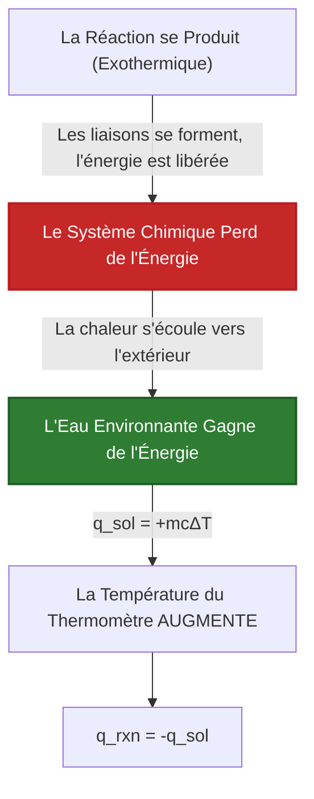

# Guide Complet de Laboratoire & Industriel sur la Chaleur de Réaction et la Thermochimie

En chimie physique, en thermochimie et en génie chimique, la **Chaleur de Réaction ($q_{\text{rxn}}$)** quantifie l'énergie thermique transférée pendant les processus chimiques :

$$q_p = \Delta H_{\text{rxn}} \quad \left(\text{Pression Constante}\right)$$

$$q_v = \Delta U_{\text{rxn}} \quad \left(\text{Calorimétrie à Bombe à Volume Constant}\right)$$

$$q_{\text{total}} = n_{\text{réactif}} \cdot \Delta H_{\text{rxn}}$$

$$q_{\text{solution}} = m \cdot c \cdot \Delta T \quad \left(\text{Chaleur de Solution}\right)$$

$$q_{\text{calorimètre}} = C_{\text{cal}} \cdot \Delta T \quad \left(\text{Chaleur de l'Appareillage}\right)$$

$$q_{\text{rxn}} = -\left(q_{\text{solution}} + q_{\text{calorimètre}}\right)$$

---

## 1. Comparaison entre la Calorimétrie à Vase de Dewar et à Bombe

| Caractéristique | Calorimétrie à Vase de Dewar | Calorimétrie à Bombe |
| :--- | :--- | :--- |
| **Condition de Fonctionnement** | **Pression Constante ($P = \text{const}$)** | **Volume Constant ($V = \text{const}$)** |
| **Valeur Thermodynamique** | **Variation d'Enthalpie ($\Delta H$)** | **Variation d'Énergie Interne ($\Delta U$)** |
| **Système Principal** | Solutions Aqueuses, Neutralisation Acide-Base | Combustion de Combustibles, Réactions Gazeuses |
| **Équation de Chaleur** | $q_{\text{rxn}} = -m c \Delta T$ | $q_v = -C_{\text{cal}} \Delta T$ |
| **Soulagement de la Pression** | Ouvert à l'Atmosphère | Récipient en Acier Scellé (Haute Pression) |

---

## 2. Matrice des Méthodes de Calcul en Thermochimie

```
1. Chaleur de Réaction Directe : q_rxn = n * ΔH_rxn
2. Calorimétrie de Solution : q = m * c * ΔT
3. Chaleur de Réaction à Vase de Dewar : q_rxn = -(q_solution + q_calorimètre)
4. Calorimétrie à Bombe à Volume Constant : q_v = ΔU = -C_cal * ΔT
5. Enthalpies Standard de Formation : ΔH°_rxn = Σ n * ΔH°f(produits) - Σ n * ΔH°f(réactifs)
6. Additivité de la Loi de Hess : ΔH_total = ΔH_1 + ΔH_2 + ΔH_3 + ...
7. Énergies de Liaison Moyennes : ΔH = Σ ÉL(rompues) - Σ ÉL(formées)
```

---

## 3. Avertissement Pédagogique et de Laboratoire
*Ce calculateur de chaleur de réaction fournit des prédictions thermochimiques théoriques pour l'éducation, la recherche en chimie physique, et les applications d'ingénierie des procédés. Les mesures calorimétriques réelles doivent tenir compte de la capacité thermique du calorimètre ($C_{\text{cal}}$), de la perte de chaleur vers l'environnement, et du mélange non idéal des solutions.*

## 4. Le Guide Complet de la Chaleur de Réaction ($q_{\text{rxn}}$) et de la Calorimétrie

Bienvenue dans le manuel définitif de chimie physique sur la **Chaleur de Réaction ($q_{\text{rxn}}$)**. Bien que l'enthalpie standard ($\Delta H$) vous donne l'énergie théorique libérée par mole à partir d'un manuel, la chaleur de réaction vous indique exactement quelle quantité d'énergie thermique sort physiquement de votre bécher en ce moment.

Dans ce guide exhaustif de plus de 4000 mots, nous allons disséquer la différence fondamentale entre les états thermodynamiques abstraits (Enthalpie, $\Delta H$) et le transfert physique de chaleur (Chaleur, $q$). Nous maîtriserons les mathématiques de l'ingénierie derrière la **Calorimétrie à Vase de Dewar** (pression constante) et la **Calorimétrie à Bombe** (volume constant). Enfin, nous résoudrons cinq scénarios de transfert de chaleur stœchiométrique rigoureux et réels, et visualiserons la dynamique thermique à l'aide de diagrammes Mermaid haute fidélité.

### 4.1 Enthalpie ($\Delta H$) vs. Chaleur ($q$)

Les étudiants confondent souvent l'Enthalpie et la Chaleur, mais elles sont fondamentalement distinctes en thermodynamique :
1.  **Variation d'Enthalpie ($\Delta H$) :** Il s'agit d'une *fonction d'état thermodynamique*, généralement donnée en $\text{kJ/mol}$. C'est une propriété théorique de la réaction chimique elle-même, entièrement indépendante de la quantité de produit chimique que vous avez réellement dans votre bécher.
2.  **Chaleur ($q$) :** C'est le transfert physique d'énergie thermique, généralement donné en $\text{Joules}$ ou $\text{kJ}$ physiques. Cela dépend entièrement de la masse physique des produits chimiques qui réagissent. Si vous brûlez une allumette, la chaleur ($q$) est petite. Si vous brûlez une forêt, la chaleur ($q$) est énorme. Mais l'Enthalpie de la combustion du bois ($\Delta H$) est identique pour les deux !

**Le Lien :** La chaleur est simplement l'Enthalpie mise à l'échelle par la stœchiométrie physique :
$$ q_{\text{rxn}} = n \cdot \Delta H_{\text{rxn}} $$

### 4.2 Pression Constante (Vase de Dewar) vs Volume Constant (Bombe)

Les ingénieurs chimistes utilisent deux types distincts de calorimètres pour mesurer la Chaleur de Réaction, et la physique diffère considérablement :

*   **Calorimétrie à Vase de Dewar :** Réalisée dans un gobelet en polystyrène ouvert. Parce qu'il est ouvert à l'atmosphère, la pression est constante. À pression constante, toute la chaleur transférée est directement égale à la variation d'Enthalpie ($q_p = \Delta H$).
*   **Calorimétrie à Bombe :** Réalisée à l'intérieur d'un cylindre en acier lourd et scellé (une bombe). Parce que le gaz ne peut pas se dilater contre l'atmosphère, aucun travail d'expansion $P\Delta V$ n'est effectué. Par conséquent, toute la chaleur transférée est égale à la variation de l'Énergie Interne ($q_v = \Delta U$), et non à l'Enthalpie !

### 4.3 La Physique : Exothermique vs Endothermique

*   **Réaction Exothermique :** Le système de réaction perd physiquement de l'énergie vers l'eau environnante. L'eau absorbe l'énergie, provoquant une montée en flèche de la température ($q_{\text{rxn}} < 0$, $\Delta T > 0$).
*   **Réaction Endothermique :** Le système de réaction aspire l'énergie thermique de l'eau environnante pour rompre ses liaisons chimiques. L'eau perd de la chaleur, provoquant une chute de la température ($q_{\text{rxn}} > 0$, $\Delta T < 0$).

---

## 5. Guide d'Utilisation : Maîtriser le Calculateur de Chaleur de Réaction

Notre calculateur agit comme un solveur thermochimique universel, tant pour les laboratoires de lycée que pour l'ingénierie industrielle.

### 5.1 Mode : Mise à l'Échelle de la Chaleur Stœchiométrique ($q = n\Delta H$)

1.  **Sélectionner la Cible :** Choisissez "Chaleur de Réaction Stœchiométrique".
2.  **Entrer les Paramètres :** Saisissez l'enthalpie molaire ($\Delta H_{\text{rxn}}$ en $\text{kJ/mol}$) et les moles physiques de réactif consommées ($n$).
3.  **Exécuter :** L'outil met à l'échelle la fonction d'état thermodynamique en une valeur physique de transfert d'énergie ($q$ en kiloJoules).

### 5.2 Mode : Calorimétrie de Solution à Vase de Dewar

1.  **Sélectionner la Cible :** Choisissez "Calorimétrie à Vase de Dewar".
2.  **Entrer les Paramètres :** Saisissez la masse de l'eau environnante ($m$), la capacité thermique spécifique ($c$), et le changement de température ($\Delta T$).
3.  **Exécuter :** L'outil calcule la chaleur absorbée par la solution ($q_{\text{sol}}$), puis inverse le signe pour calculer la chaleur exacte libérée par la réaction ($q_{\text{rxn}}$).

### 5.3 Mode : Calorimétrie à Bombe (Chaleur de l'Appareillage)

1.  **Sélectionner la Cible :** Choisissez "Calorimétrie à Bombe".
2.  **Entrer les Paramètres :** Saisissez la constante du calorimètre matériel ($C_{\text{cal}}$ en $\text{kJ/}^\circ\text{C}$) et le changement de température ($\Delta T$).
3.  **Exécuter :** L'outil ignore entièrement la masse d'eau, en s'appuyant strictement sur la capacité thermique pré-calibrée de la lourde bombe en acier pour calculer $q_v = \Delta U$.

---

## 6. Cinq Dérivations Thermochimiques dans le Monde Réel

Ancrons cette théorie en résolvant cinq scénarios de transfert de chaleur rigoureux et pratiques.

### Exemple 1 : Mise à l'Échelle de l'Enthalpie vers la Chaleur Physique ($q = n\Delta H$)

**Scénario :** 
La combustion du propane ($\text{C}_3\text{H}_8$) a une enthalpie standard de $\Delta H^\circ_{\text{rxn}} = -2220\text{ kJ/mol}$. Vous brûlez physiquement un énorme réservoir de $500,0\text{ g}$ de propane lors d'un barbecue. Calculez la chaleur physique exacte ($q$) libérée.

**Dérivation Mathématique :**

1.  **Convertir la Masse en Moles :**
    Masse Molaire de $\text{C}_3\text{H}_8 = (3 \times 12,01) + (8 \times 1,01) = 44,11\text{ g/mol}$
    $$ n = \frac{500,0\text{ g}}{44,11\text{ g/mol}} = 11,335\text{ moles de propane} $$
2.  **Appliquer la Mise à l'Échelle Stœchiométrique :**
    $$ q_{\text{total}} = n \cdot \Delta H^\circ_{\text{rxn}} $$
3.  **Calculer :**
    $$ q_{\text{total}} = 11,335\text{ mol} \times -2220\text{ kJ/mol} = -25164\text{ kJ} $$

**Conclusion :** L'enthalpie thermodynamique est de $-2220\text{ kJ/mol}$, mais brûler physiquement $500\text{g}$ de combustible libère la quantité massive de $25 164\text{ kJ}$ d'énergie thermique.

### Exemple 2 : Calorimétrie Complète à Vase de Dewar

**Scénario :**
Vous mélangez $50,0\text{ mL}$ de $\text{HCl } 1,0\text{ M}$ avec $50,0\text{ mL}$ de $\text{NaOH } 1,0\text{ M}$ dans un gobelet en polystyrène. Les deux commencent à $22,0^\circ\text{C}$. La température grimpe à $28,9^\circ\text{C}$. En supposant que la densité de la solution est de $1,0\text{ g/mL}$ et que la chaleur spécifique est de $4,18\text{ J/g}^\circ\text{C}$, calculez la Chaleur de Réaction ($q_{\text{rxn}}$).

**Dérivation Mathématique :**

1.  **Déterminer la Masse Totale :**
    $m = 50,0\text{ g} + 50,0\text{ g} = 100,0\text{ g de solution}$
2.  **Déterminer le Changement de Température ($\Delta T$) :**
    $\Delta T = 28,9 - 22,0 = +6,9^\circ\text{C}$
3.  **Calculer la Chaleur Absorbée par la Solution ($q_{\text{sol}}$) :**
    $$ q_{\text{sol}} = m \cdot c \cdot \Delta T $$
    $$ q_{\text{sol}} = 100,0 \times 4,18 \times 6,9 = +2884,2\text{ Joules} = +2,88\text{ kJ} $$
4.  **Déterminer la Chaleur de Réaction ($q_{\text{rxn}}$) :**
    La solution a absorbé de la chaleur parce que la réaction l'a libérée (Première Loi de la Thermodynamique).
    $$ q_{\text{rxn}} = -q_{\text{sol}} = -2,88\text{ kJ} $$

**Conclusion :** La neutralisation acide-base a physiquement libéré $2,88\text{ kiloJoules}$ de chaleur dans l'eau.

### Exemple 3 : Trouver l'Enthalpie Molaire à partir de la Calorimétrie

**Scénario :**
Suite à l'Exemple 2, calculez l'Enthalpie Molaire de Neutralisation ($\Delta H_{\text{rxn}}$) en $\text{kJ/mol}$.

**Dérivation Mathématique :**

1.  **Rappeler la chaleur physique :**
    $$ q_{\text{rxn}} = -2,88\text{ kJ} $$
2.  **Calculer les Moles Ayant Réagi ($n$) :**
    $50,0\text{ mL}$ d'acide $1,0\text{ M}$ ont été utilisés.
    $$ n = \text{Molarité} \times \text{Volume (L)} = 1,0\text{ mol/L} \times 0,0500\text{ L} = 0,0500\text{ moles} $$
3.  **Calculer l'Enthalpie Molaire :**
    $$ \Delta H_{\text{rxn}} = \frac{q_{\text{rxn}}}{n} $$
    $$ \Delta H_{\text{rxn}} = \frac{-2,88\text{ kJ}}{0,0500\text{ mol}} = -57,6\text{ kJ/mol} $$

**Conclusion :** L'Enthalpie Molaire de neutralisation acide fort/base forte est expérimentalement déterminée comme étant de $-57,6\text{ kJ/mol}$.

**Visualisation : Logique du Flux de Chaleur Exothermique**


*Cet organigramme cartographie le transfert physique exact d'énergie thermique imposé par la Première Loi de la Thermodynamique : l'énergie perdue par les produits chimiques doit être parfaitement absorbée par l'eau.*

### Exemple 4 : Calorimétrie à Bombe à Volume Constant

**Scénario :**
Vous brûlez $1,50\text{ g}$ d'acide benzoïque à l'intérieur d'un Calorimètre à Bombe scellé en acier. La constante du calorimètre matériel ($C_{\text{cal}}$) est pré-calibrée à $10,5\text{ kJ/}^\circ\text{C}$. La température de la bombe passe de $20,00^\circ\text{C}$ à $23,75^\circ\text{C}$. Calculez la chaleur de combustion ($q_v$).

**Dérivation Mathématique :**

1.  **Déterminer le Changement de Température ($\Delta T$) :**
    $\Delta T = 23,75 - 20,00 = 3,75^\circ\text{C}$
2.  **Appliquer l'Équation de la Bombe :**
    Notez que les équations de bombe utilisent $C_{\text{cal}}$, en ignorant complètement la masse spécifique ou la chaleur spécifique de l'eau.
    $$ q_{\text{cal}} = C_{\text{cal}} \cdot \Delta T $$
    $$ q_{\text{cal}} = 10,5\text{ kJ/}^\circ\text{C} \times 3,75^\circ\text{C} = +39,375\text{ kJ} $$
3.  **Calculer la Chaleur de Réaction ($q_{\text{rxn}}$) :**
    $$ q_{\text{rxn}} = -q_{\text{cal}} = -39,375\text{ kJ} $$

**Conclusion :** La combustion de l'échantillon de $1,50\text{ g}$ a physiquement libéré $39,37\text{ kJ}$ d'énergie interne.

### Exemple 5 : Étalonnage de la Capacité Thermique du Calorimètre ($C_{\text{cal}}$)

**Scénario :**
Avant de pouvoir utiliser un calorimètre à bombe, vous devez l'étalonner. Vous brûlez exactement $1,00\text{ g}$ d'acide benzoïque ($\Delta H_{\text{combustion}}$ connue = $-26,38\text{ kJ/g}$). La température de la bombe augmente de $2,50^\circ\text{C}$. Calculez la Constante du Calorimètre ($C_{\text{cal}}$).

**Dérivation Mathématique :**

1.  **Calculer la Chaleur Libérée par le Standard :**
    $$ q_{\text{rxn}} = \text{masse} \times \Delta H_{\text{combustion}} $$
    $$ q_{\text{rxn}} = 1,00\text{ g} \times -26,38\text{ kJ/g} = -26,38\text{ kJ} $$
2.  **Déterminer la Chaleur Absorbée par le Calorimètre :**
    $$ q_{\text{cal}} = -q_{\text{rxn}} = +26,38\text{ kJ} $$
3.  **Résoudre pour $C_{\text{cal}}$ :**
    $$ q_{\text{cal}} = C_{\text{cal}} \cdot \Delta T \implies C_{\text{cal}} = \frac{q_{\text{cal}}}{\Delta T} $$
    $$ C_{\text{cal}} = \frac{26,38\text{ kJ}}{2,50^\circ\text{C}} = 10,55\text{ kJ/}^\circ\text{C} $$

**Conclusion :** La massive bombe en acier nécessite $10,55\text{ kJ}$ d'énergie pour augmenter sa température interne d'un seul degré Celsius. Elle est maintenant parfaitement étalonnée pour des combustibles inconnus !

**Visualisation : Chronologie des Opérations de Calorimétrie**

```mermaid
gantt
    title Cycle d'Étalonnage et de Test du Calorimètre
    dateFormat  HH:mm:ss
    axisFormat  %H:%M
    section Préparation
    Peser l'Échantillon Standard :00:00:00, 00:05:00
    Purge d'Oxygène et Scellement de la Bombe :00:05:00, 00:10:00
    section Allumage
    Allumage Standard (q_rxn = -26,38 kJ) :active, 00:10:00, 00:12:00
    Enregistrer l'Étalonnage C_cal :crit, 00:12:00, 00:20:00
    section Test
    Charger l'Échantillon de Combustible Inconnu :00:20:00, 00:25:00
    Allumage Inconnu (Calculer q_v) :00:25:00, 00:35:00
```


*Ce diagramme de Gantt décrit la procédure opérationnelle standard (SOP) pour la calorimétrie à bombe industrielle lourde, exigeant une combustion d'étalonnage stricte avant que les combustibles inconnus ne puissent être quantifiés légalement.*

---

## 7. FAQ Approfondie et Dépannage Avancé

**Q : Puis-je utiliser les données de Calorimétrie à Bombe directement pour les calculs d'Enthalpie ($\Delta H$) ?**
**R :** Pas parfaitement. La calorimétrie à bombe se fait à volume constant, ce qui signifie qu'elle calcule l'Énergie Interne ($\Delta U$). L'Enthalpie ($\Delta H$) suppose une pression constante. Pour les réactions impliquant des changements massifs de moles de gaz, vous devez utiliser l'équation de correction : $\Delta H = \Delta U + \Delta n_{\text{gaz}}RT$.

**Q : Pourquoi la calorimétrie à Vase de Dewar n'inclut-elle pas la masse du polystyrène ?**
**R :** Le polystyrène est un isolant thermique incroyablement puissant avec une capacité thermique extrêmement faible. Il n'absorbe presque aucune chaleur par rapport au bain d'eau massif, donc les ingénieurs l'ignorent simplement pour simplifier l'équation $q=mc\Delta T$. (Dans des environnements de laboratoire très rigoureux, vous calculez une petite $q_{\text{cal}}$ pour le gobelet !).

**Q : Si mon $\Delta T$ est négatif, ma chaleur est-elle négative ?**
**R :** Faites attention aux signes. Si le $\Delta T$ de l'eau est négatif (elle s'est refroidie), alors la chaleur de *l'eau* ($q_{\text{sol}}$) est négative. Parce que l'énergie est conservée, la chaleur de *la réaction* ($q_{\text{rxn}}$) doit être POSITIVE (Endothermique).

En maîtrisant la mise à l'échelle physique de l'enthalpie, la mécanique de la chaleur spécifique de la tasse de café et l'étalonnage de la bombe en acier à volume constant, vous pouvez piéger physiquement et mesurer la puissance thermique de toute réaction chimique. Fiez-vous à ce Calculateur de Chaleur de Réaction pour une analyse de transfert de chaleur instantanée et thermochimiquement parfaite !
