# Guide de Chimie Laboratoire et Analytique sur Henderson-Hasselbalch & Analyse des Tampons

En chimie analytique, physique et biologique, l'**équation d'Henderson-Hasselbalch** régit le comportement à l'équilibre des systèmes tampons acide-base conjugués :

$$\text{pH} = \text{p}K_a + \log_{10}\left(\frac{[\text{A}^-]}{[\text{HA}]}\right) \quad \iff \quad \frac{[\text{A}^-]}{[\text{HA}]} = 10^{\text{pH} - \text{p}K_a}$$

$$\beta = 2,303 \cdot C_{\text{total}} \cdot \frac{K_a [\text{H}^+]}{(K_a + [\text{H}^+])^2} \quad \text{où } C_{\text{total}} = [\text{HA}] + [\text{A}^-]$$

---

## 1. Matrice de Référence des Paires Conjuguées et Rapports de Tampons

| Acide Faible ($\text{HA}$) | Base Conjuguée ($\text{A}^-$) | $\text{p}K_a$ ($25^\circ\text{C}$) | Plage de pH Optimale | Application Typique |
| :--- | :--- | :--- | :--- | :--- |
| **Acide Formique** ($\text{HCOOH}$) | Formiate ($\text{HCOO}^-$) | **$3,75$** | $2,75 - 4,75$ | Phase Mobile HPLC |
| **Acide Acétique** ($\text{CH}_3\text{COOH}$) | Acétate ($\text{CH}_3\text{COO}^-$) | **$4,76$** | $3,76 - 5,76$ | Assaisonnements et Dosages Enzymatiques |
| **Acide Carbonique** ($\text{H}_2\text{CO}_3$) | Bicarbonate ($\text{HCO}_3^-$) | **$6,35$** | $5,35 - 7,35$ | Tampon de Plasma Sanguin (pH 7,40) |
| **Phosphate ($\text{p}K_{a2}$)** ($\text{H}_2\text{PO}_4^-$) | Hydrogénophosphate ($\text{HPO}_4^{2-}$) | **$7,20$** | $6,20 - 8,20$ | Solution Saline Biologique (PBS) |
| **Ion Ammonium** ($\text{NH}_4^+$) | Ammoniac ($\text{NH}_3$) | **$9,25$** | $8,25 - 10,25$ | Tampon Analytique Alcalin |

---

## 2. Protocoles Standard de Calcul Henderson-Hasselbalch

```
1. Calculer le pH du tampon : pH = pKa + log10([A-] / [HA])
2. Calculer le pKa : pKa = pH - log10([A-] / [HA])
3. Calculer le rapport conjugué : [A-] / [HA] = 10^(pH - pKa)
4. Calculer [A-] requis : [A-] = [HA] * 10^(pH - pKa)
5. Calculer [HA] requis : [HA] = [A-] / 10^(pH - pKa)
```

---

## 3. Avertissement de Sécurité Éducatif et de Laboratoire
*Ce calculateur d'Henderson-Hasselbalch fournit des calculs de tampon théoriques pour les applications éducatives, la recherche en laboratoire et la chimie AP. Les solutions concentrées non idéales à forces ioniques élevées doivent tenir compte des coefficients d'activité à l'aide des équations de Debye-Hückel ou de Pitzer.*

## 4. Le Guide Complet de l'Équation d'Henderson-Hasselbalch et des Systèmes Tampons

Bienvenue dans le guide de référence pour maîtriser la chimie des tampons grâce à l'**équation d'Henderson-Hasselbalch**. Que vous soyez un étudiant en chimie AP apprenant pourquoi un mélange d'acide faible et de base conjuguée résiste aux changements de pH, un biochimiste calculant le rapport molaire exact requis pour un tampon salin physiologique, ou un étudiant en médecine étudiant l'acidose sanguine, la compréhension de cette équation est non négociable.

Un **tampon** est une solution chimique spéciale qui résiste obstinément aux changements de son pH lorsque de petites quantités d'acides forts ou de bases fortes y sont ajoutées. Il réalise cette « absorption des chocs » chimique en contenant à la fois un acide faible (pour neutraliser la base entrante) et sa base conjuguée (pour neutraliser l'acide entrant). Les mathématiques qui régissent ce délicat rapport de force sont entièrement décrites par l'équation d'Henderson-Hasselbalch.

Dans ce guide technique exhaustif de plus de 4000 mots, nous détaillerons les dérivations thermodynamiques de l'équation, décortiquerons le concept critique de **Capacité Tampon ($\beta$)**, établirons les règles de conception des tampons et parcourrons cinq exemples rigoureux du monde réel (y compris le système de tampon bicarbonate dans le sang humain) complets avec des dérivations mathématiques et des diagrammes visuels Mermaid.

### 4.1 Dérivation de l'Équation d'Henderson-Hasselbalch

L'équation n'est pas une formule magique ; c'est une transformation logarithmique directe de la constante de dissociation acide standard ($K_a$). Regardons la dissociation d'un acide faible générique, $\text{HA}$ :
$\text{HA} \rightleftharpoons \text{H}^+ + \text{A}^-$

La constante d'équilibre pour cette réaction est :
$$ K_a = \frac{[\text{H}^+][\text{A}^-]}{[\text{HA}]} $$

Si nous isolons algébriquement la concentration en ions hydronium $[\text{H}^+]$ :
$$ [\text{H}^+] = K_a \times \frac{[\text{HA}]}{[\text{A}^-]} $$

Maintenant, prenons le logarithme négatif en base 10 ($-\log_{10}$) des deux côtés de l'équation :
$$ -\log_{10}([\text{H}^+]) = -\log_{10}(K_a) - \log_{10}\left(\frac{[\text{HA}]}{[\text{A}^-]}\right) $$

Substituons nos définitions standards ($\text{pH} = -\log_{10}[\text{H}^+]$ et $\text{p}K_a = -\log_{10}K_a$), et inversons le dernier terme logarithmique pour transformer la soustraction en addition :
$$ \text{pH} = \text{p}K_a + \log_{10}\left(\frac{[\text{A}^-]}{[\text{HA}]}\right) $$

C'est l'**équation d'Henderson-Hasselbalch**. Elle stipule explicitement que le pH d'un tampon est déterminé par la force intrinsèque de l'acide ($\text{p}K_a$) **plus** le rapport de la base conjuguée sur l'acide faible.

### 4.2 La « Règle de 1 » et le Point de Demi-équivalence

La réalisation la plus profonde de l'équation d'Henderson-Hasselbalch se produit lorsqu'un tampon contient des concentrations molaires exactement égales de l'acide faible et de sa base conjuguée : $[\text{A}^-] = [\text{HA}]$.
Lorsque cela se produit, le rapport $[\text{A}^-] / [\text{HA}]$ devient exactement $1,0$.

Puisque $\log_{10}(1,0) = 0$, l'équation s'effondre violemment en :
$$ \text{pH} = \text{p}K_a + 0 $$
$$ \text{pH} = \text{p}K_a $$

Ceci est connu sous le nom de **Point de Demi-équivalence** dans un titrage. À ce pH spécifique, le tampon possède sa capacité maximale possible à résister aux changements de pH dans les directions acides et basiques.

### 4.3 Capacité Tampon ($\beta$) et Plage du Tampon

Bien qu'un tampon résiste au changement de pH, il ne peut pas résister indéfiniment. La **Capacité Tampon ($\beta$)** est une mesure quantitative de la quantité d'acide fort ou de base forte qu'un tampon peut absorber avant que son pH ne change de manière significative (généralement d'une unité).

La capacité tampon dépend de deux facteurs critiques :
1.  **Concentration Absolue ($C_{\text{total}}$) :** Un tampon contenant $1,0\text{ M}$ de HA et $1,0\text{ M}$ de $\text{A}^-$ a dix fois la capacité d'un tampon contenant $0,1\text{ M}$ de HA et $0,1\text{ M}$ de $\text{A}^-$, même si leur pH est identique. Plus de molécules = plus de pouvoir neutralisant.
2.  **Le Rapport :** La capacité tampon est maximisée lorsque $[\text{A}^-] = [\text{HA}]$ (c'est-à-dire, lorsque $\text{pH} = \text{p}K_a$).

En règle générale en chimie analytique, un tampon n'est considéré comme efficace que dans la plage de **$\pm 1\text{ unité de pH}$ de son $\text{p}K_a$**.
- Si $\text{pH} = \text{p}K_a - 1$, le rapport $[\text{A}^-]/[\text{HA}]$ est de $1:10$. Le tampon a très peu de capacité à absorber plus d'acide.
- Si $\text{pH} = \text{p}K_a + 1$, le rapport $[\text{A}^-]/[\text{HA}]$ est de $10:1$. Le tampon a très peu de capacité à absorber plus de base.

### 4.4 Quand l'Équation échoue-t-elle ?

L'équation d'Henderson-Hasselbalch est une *approximation*. Elle suppose que les concentrations à l'équilibre de $[\text{HA}]$ et $[\text{A}^-]$ sont exactement égales aux quantités initiales que vous avez placées dans le bécher.
Cette hypothèse commence à échouer gravement dans trois conditions :
1.  **Dilution Extrême :** Si le tampon est dilué au-delà de $1 \times 10^{-4}\text{ M}$, l'auto-ionisation de l'eau ($[\text{H}^+] = 10^{-7}\text{ M}$) commence à interférer significativement.
2.  **Acides/Bases Forts :** L'équation ne peut pas être utilisée pour des acides forts comme le $\text{HCl}$ ou le $\text{HNO}_3$, car leurs valeurs de $K_a$ approchent l'infini et il n'y a plus de $[\text{HA}]$ intact en solution.
3.  **Rapports Extrêmes :** Si le rapport de $[\text{A}^-]$ à $[\text{HA}]$ dépasse $100:1$ ou chute en dessous de $1:100$, l'approximation s'effondre car l'effet tampon de l'eau prend le dessus.

---

## 5. Guide d'Utilisation : Maîtriser le Calculateur Henderson-Hasselbalch

Notre calculateur agit comme un laboratoire analytique numérique, offrant une résolution bidirectionnelle transparente pour la conception de tampons.

### 5.1 Calcul Simple du pH d'un Tampon

Si vous mélangez une quantité connue d'acide faible et de base conjuguée :
1.  **Sélectionnez le Mode :** Choisissez "Calculer le pH du tampon".
2.  **Entrez les Paramètres :** Entrez le $\text{p}K_a$ de votre acide, la concentration de la base conjuguée $[\text{A}^-]$, et la concentration de l'acide faible $[\text{HA}]$.
3.  **Lisez le Résultat :** Le calculateur fournit immédiatement le pH final du mélange, le rapport, et évalue si le tampon se situe dans la plage idéale de capacité $\pm 1$.

### 5.2 Conception de Tampon en Laboratoire (Cibler un pH)

Si votre protocole de laboratoire nécessite un tampon à un pH spécifique (par ex., pH 7,40 pour les cellules biologiques) :
1.  **Sélectionnez le Mode :** Choisissez "Calculer le Rapport $[\text{A}^-]/[\text{HA}]$".
2.  **Entrez les Paramètres :** Entrez votre pH cible et le $\text{p}K_a$ de votre agent tampon choisi (par ex., $7,20$ pour le Phosphate).
3.  **Exécutez :** L'outil utilise la fonction logarithmique inverse $10^{(\text{pH} - \text{p}K_a)}$ pour vous indiquer exactement combien de moles de base conjuguée vous avez besoin pour chaque mole d'acide faible. 

---

## 6. Cinq Exemples Conceptuels du Monde Réel

Les mathématiques abstraites deviennent de puissants outils lorsqu'elles sont appliquées à la chimie physique. Voici cinq exemples rigoureux couvrant la création de tampons, le tamponnage sanguin physiologique et le calcul de la capacité neutralisante.

### Exemple 1 : Le Tampon Acétate Classique

**Scénario :** 
Un biochimiste prépare une solution tampon contenant $0,25\text{ M}$ d'Acide Acétique ($\text{CH}_3\text{COOH}$, $\text{p}K_a = 4,76$) et $0,15\text{ M}$ d'Acétate de Sodium ($\text{CH}_3\text{COONa}$). Quel est le pH de cette solution ?

**Dérivation Mathématique :**

1.  **Identifier les Composants :**
    Acide Faible $[\text{HA}] = 0,25\text{ M}$
    Base Conjuguée $[\text{A}^-] = 0,15\text{ M}$
    $\text{p}K_a$ de l'Acide = 4,76
2.  **Appliquer Henderson-Hasselbalch :**
    $$ \text{pH} = \text{p}K_a + \log_{10}\left(\frac{[\text{A}^-]}{[\text{HA}]}\right) $$
    $$ \text{pH} = 4,76 + \log_{10}\left(\frac{0,15}{0,25}\right) $$
    $$ \text{pH} = 4,76 + \log_{10}(0,60) $$
    $$ \text{pH} = 4,76 - 0,222 $$
    $$ \text{pH} = 4,538 \approx 4,54 $$

**Conclusion :** Le pH est de 4,54. Parce qu'il y a plus d'acide faible ($0,25\text{ M}$) que de base conjuguée ($0,15\text{ M}$), le pH est tiré vers le bas de son $\text{p}K_a$ intrinsèque (4,76).

### Exemple 2 : Le Sang Humain et le Tampon Bicarbonate

**Scénario :**
Le plasma sanguin humain est strictement tamponné à un pH de $7,40$. Le principal tampon est le système Acide Carbonique / Bicarbonate. L'acide carbonique ($\text{H}_2\text{CO}_3$) a un $\text{p}K_a$ physiologique de $6,10$. Quel doit être le rapport du Bicarbonate ($[\text{HCO}_3^-]$) sur l'Acide Carbonique ($[\text{H}_2\text{CO}_3]$) dans le sang humain en bonne santé ?

**Dérivation Mathématique :**

1.  **Identifier les Paramètres :**
    $\text{pH}$ Cible = 7,40
    $\text{p}K_a$ de l'Acide = 6,10
2.  **Isoler le Rapport Logarithmique :**
    $$ \text{pH} = \text{p}K_a + \log_{10}\left(\frac{[\text{HCO}_3^-]}{[\text{H}_2\text{CO}_3]}\right) $$
    $$ 7,40 = 6,10 + \log_{10}(\text{Rapport}) $$
    $$ 1,30 = \log_{10}(\text{Rapport}) $$
3.  **Exécuter le Logarithme Inverse :**
    $$ \text{Rapport} = 10^{1,30} \approx 19,95 $$

**Conclusion :** Dans le sang humain en bonne santé, il y a environ **$20$ fois** plus de base bicarbonate que d'acide carbonique. Ce déséquilibre massif fournit au sang une énorme capacité à absorber les déchets métaboliques acides (comme l'acide lactique) sans faire chuter le pH sanguin vers une acidose dangereuse.

**Visualisation : Physiologie du Bicarbonate**


*Cet organigramme démontre pourquoi la biologie humaine sélectionne spécifiquement un rapport de tampon déséquilibré pour survivre aux sous-produits acides du métabolisme.*

### Exemple 3 : Conception d'un Tampon Phosphate (PBS)

**Scénario :**
Un laboratoire doit concevoir une solution saline tamponnée au phosphate (PBS) à exactement pH 7,00. Le système tampon disponible est $\text{H}_2\text{PO}_4^-$ (acide faible, $\text{p}K_a = 7,20$) et $\text{HPO}_4^{2-}$ (base conjuguée). Si le protocole exige que la concentration de l'acide faible soit exactement de $0,050\text{ M}$, quelle concentration de base conjuguée doit être ajoutée ?

**Dérivation Mathématique :**

1.  **Calculer le Rapport Requis :**
    $$ \text{pH} - \text{p}K_a = \log_{10}\left(\frac{[\text{A}^-]}{[\text{HA}]}\right) $$
    $$ 7,00 - 7,20 = -0,20 $$
    $$ \text{Rapport} = 10^{-0,20} = 0,631 $$
2.  **Calculer la Concentration en Base Conjuguée Requise :**
    $$ \frac{[\text{A}^-]}{[\text{HA}]} = 0,631 $$
    $$ \frac{[\text{A}^-]}{0,050} = 0,631 $$
    $$ [\text{A}^-] = 0,050 \times 0,631 = 0,03155\text{ M} $$

**Conclusion :** Pour atteindre un pH parfait de 7,00, le chimiste doit mélanger $0,050\text{ M}$ de l'acide faible avec $0,03155\text{ M}$ du sel de la base conjuguée.

### Exemple 4 : L'Attaque Acide (Neutralisation du Tampon)

**Scénario :**
Prenons $1,0\text{ Litre}$ d'un tampon parfait contenant $0,10\text{ M}$ d'acide faible générique ($\text{HA}$, $\text{p}K_a = 5,00$) et $0,10\text{ M}$ de base conjuguée ($\text{A}^-$). Le pH initial est de 5,00. 
Nous y ajoutons ensuite agressivement $0,02\text{ Moles}$ d'acide chlorhydrique pur ($\text{HCl}$, un acide fort). Quel est le nouveau pH ?

**Dérivation Mathématique :**

1.  **Moles Initiales dans 1,0 L :**
    $[\text{HA}] = 0,10\text{ mol}$
    $[\text{A}^-] = 0,10\text{ mol}$
2.  **Neutralisation Stœchiométrique :**
    Les $0,02\text{ mol}$ d'acide fort ($\text{H}^+$) vont complètement attaquer la base conjuguée ($\text{A}^-$), la transformant en acide faible ($\text{HA}$).
    **Nouveau $[\text{A}^-]$ :** $0,10 - 0,02 = 0,08\text{ mol}$
    **Nouveau $[\text{HA}]$ :** $0,10 + 0,02 = 0,12\text{ mol}$
3.  **Appliquer Henderson-Hasselbalch au Nouvel État :**
    $$ \text{pH} = \text{p}K_a + \log_{10}\left(\frac{[\text{A}^-]}{[\text{HA}]}\right) $$
    $$ \text{pH} = 5,00 + \log_{10}\left(\frac{0,08}{0,12}\right) $$
    $$ \text{pH} = 5,00 + \log_{10}(0,667) $$
    $$ \text{pH} = 5,00 - 0,176 = 4,82 $$

**Conclusion :** Malgré un apport massif d'acide fort, le pH du tampon n'a chuté que de 5,00 à 4,82. Si vous aviez ajouté ce même acide à de l'eau pure, le pH se serait violemment effondré à 1,70. Cela prouve l'incroyable pouvoir de la capacité tampon.

**Visualisation : Configuration de Laboratoire de Neutralisation**

```mermaid
gantt
    title Chronologie de Laboratoire : Test de Neutralisation de Tampon
    dateFormat  HH:mm:ss
    axisFormat  %H:%M
    section Préparation
    Mélanger 0.1M HA et 0.1M A- :active, 00:00:00, 00:10:00
    Enregistrer pH Initial 5.00 :milestone, 00:10:00, 00:10:00
    section Neutralisation
    Injecter 0.02M HCl :crit, 00:10:00, 00:15:00
    Agiter et Équilibrer :active, 00:15:00, 00:20:00
    section Résultat
    Enregistrer pH Final 4.82 :milestone, 00:20:00, 00:20:00
```



*Ce diagramme de Gantt trace la séquence critique de préparation du tampon, l'enregistrement des données de base et l'exécution de l'attaque acide stoechiométrique.*

### Exemple 5 : Dilution d'un Tampon

**Scénario :**
Vous avez un tampon avec $0,50\text{ M HA}$ ($\text{p}K_a = 4,0$) et $0,50\text{ M A}^-$. Son pH est de 4,0. Vous diluez la solution en ajoutant un volume égal d'eau pure, divisant par deux les deux concentrations à $0,25\text{ M}$. Le pH change-t-il ?

**Dérivation Mathématique :**

1.  **État Initial :**
    $$ \text{pH} = 4,0 + \log_{10}\left(\frac{0,50}{0,50}\right) = 4,0 + 0 = 4,0 $$
2.  **État Dilué :**
    $$ \text{pH} = 4,0 + \log_{10}\left(\frac{0,25}{0,25}\right) = 4,0 + 0 = 4,0 $$

**Conclusion :** Le pH ne **change pas**. Parce que l'équation d'Henderson-Hasselbalch repose entièrement sur le *rapport* des deux composants, leur dilution égale s'annule. **Cependant**, la capacité tampon ($\beta$) de la solution diluée est réduite de moitié, ce qui signifie qu'elle est beaucoup plus vulnérable aux futures attaques acides/basiques.

---

## 7. FAQ Approfondie et Dépannage Avancé

**Q : Puis-je utiliser Henderson-Hasselbalch pour les Acides Forts ?**
**R :** Non. Les acides forts (comme l'acide sulfurique ou chlorhydrique) se dissocient à 100 % dans l'eau. Il n'y a pas d'équilibre, pas de $[\text{HA}]$ intact mesurable, et leurs valeurs de $\text{p}K_a$ sont négatives. L'équation plantera mathématiquement ou donnera des résultats absurdes.

**Q : Pourquoi certains manuels utilisent-ils « pKb » pour les tampons ?**
**R :** Si vous avez affaire à une base faible (comme l'Ammoniac, $\text{NH}_3$) et son acide conjugué (Ammonium, $\text{NH}_4^+$), vous pouvez utiliser la variante de base de l'équation : $\text{pOH} = \text{p}K_b + \log_{10}([\text{Acide Conjugué}]/[\text{Base Faible}])$. Cependant, la plupart des chimistes analytiques modernes préfèrent tout convertir en $\text{p}K_a$ et en pH (en utilisant $\text{p}K_a + \text{p}K_b = 14,00$) pour éviter la confusion.

**Q : Que se passe-t-il si je prépare un tampon en dehors de la plage $\text{p}K_a \pm 1$ ?**
**R :** Supposons que vous essayiez de forcer un tampon d'Acide Acétique ($\text{p}K_a = 4,76$) à maintenir un pH de 7,00. Le rapport requis serait de $10^{(7,00 - 4,76)} = 173$. Vous auriez besoin de 173 molécules d'Acétate pour chaque molécule d'Acide Acétique. Si même une infime goutte de base forte pénètre dans la solution, la molécule d'acide acétique isolée est instantanément annihilée, et le pH monte en flèche dans la zone alcaline. C'est un « tampon » de nom seulement, avec une capacité de tamponnage acide effectivement nulle.

**Q : L'équation d'Henderson-Hasselbalch est-elle affectée par la température ?**
**R :** Oui, indirectement. La valeur du $\text{p}K_a$ elle-même dépend fortement de la température car la dissociation de l'acide est régie par la thermodynamique ($\Delta G$). Si vous chauffez un tampon, son $\text{p}K_a$ se déplacera, et par conséquent son pH se déplacera, même si le rapport chimique reste identique.

En comprenant profondément les fondements logarithmiques de l'équation d'Henderson-Hasselbalch, vous possédez le pouvoir théorique de concevoir des tampons chimiques impénétrables, d'analyser des fluides biologiques complexes et de calculer le moment exact de l'échec du titrage. Utilisez ce calculateur pour rationaliser vos conceptions de laboratoire et garantir la perfection analytique !
