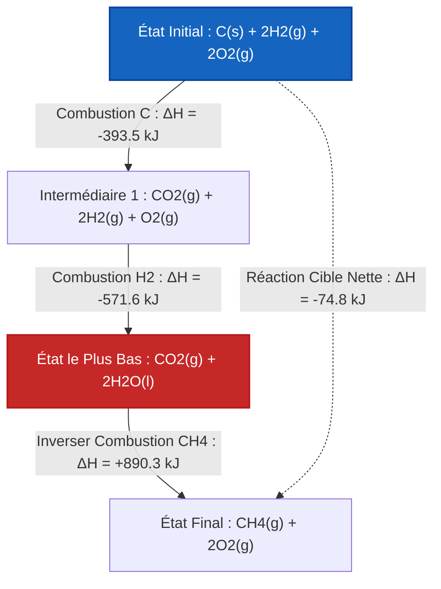

# Guide Complet de Laboratoire et Universitaire sur la Loi de Hess et l'Algèbre Réactionnelle

En chimie physique, thermochimie et thermodynamique chimique, la **Loi de Hess sur la Sommation Constante de la Chaleur** fournit un pont mathématique fondamental pour calculer les enthalpies de réaction ($\Delta H$) de réactions qui sont difficiles, dangereuses ou lentes à mesurer directement dans un calorimètre :

$$\Delta H_{\text{cible}} = \sum_{i=1}^{k} x_i \cdot \Delta H_i$$

$$\vec{R}_{\text{cible}} = \sum_{i=1}^{k} x_i \cdot \vec{R}_i \quad \left(\text{Combinaison Linéaire de Vecteurs de Réaction}\right)$$

$$\Delta H_{\text{inversée}} = -\Delta H_{\text{directe}}$$

$$\Delta H_{n \cdot \text{réaction}} = n \cdot \Delta H_{\text{originale}}$$

---

## 1. Règles de Transformation de Réaction de la Loi de Hess

| Transformation | Action sur l'Équation Chimique | Action sur la Variation d'Enthalpie ($\Delta H$) |
| :--- | :--- | :--- |
| **Inverser la Réaction** | Échanger Réactifs et Produits ($A + B \to C \implies C \to A + B$) | **Inverser le Signe ($\Delta H \to -\Delta H$)** |
| **Multiplier par $n$** | Multiplier tous les coefficients par $n$ ($2A \to 2B$) | **Multiplier $\Delta H$ par $n$ ($n \cdot \Delta H$)** |
| **Diviser par $n$** | Diviser tous les coefficients par $n$ ($0.5A \to 0.5B$) | **Diviser $\Delta H$ par $n$ ($\Delta H / n$)** |
| **Additionner les Équations** | Sommez tous les réactifs et tous les produits ; annulez les intermédiaires communs | **Sommer toutes les enthalpies ajustées ($\Delta H_{\text{totale}} = \sum \Delta H_i$)** |

---

## 2. Matrice du Moteur de Résolution Vectorielle d'Algèbre Linéaire

```
1. Vectoriser la Réaction Cible : R_cible = [c_1, c_2, ..., c_m]
2. Vectoriser les Réactions par Étapes : R_1, R_2, ..., R_k
3. Former l'Équation Matricielle : A * x = b  (où A = [R_1 | R_2 | ... | R_k], b = R_cible)
4. Résoudre le Vecteur Multiplicateur x = [x_1, x_2, ..., x_k]
5. Calculer l'Enthalpie Cible : ΔH_cible = x_1*ΔH_1 + x_2*ΔH_2 + ... + x_k*ΔH_k
```

---

*Ce calculateur de la loi de Hess fournit des prédictions thermochimiques théoriques pour des applications éducatives, de recherche en chimie physique et d'ingénierie des procédés. Les cycles thermochimiques réels doivent assurer la consistance des phases (ex. H2O(l) vs H2O(g)) et la pression de l'état standard (1 bar / 1 atm).*

## 4. Le Guide Complet sur la Loi de Hess et l'Enthalpie de Réaction

Bienvenue dans le manuel de chimie physique définitif sur la **Loi de Hess sur la Sommation Constante de la Chaleur**. En thermochimie, il est impossible de mesurer physiquement la variation d'enthalpie ($\Delta H$) de chaque réaction chimique. Certaines réactions sont trop lentes, d'autres sont explosivement dangereuses, et certaines produisent des quantités massives de sous-produits indésirables.

Comment les ingénieurs chimistes calculent-ils la chaleur dégagée par ces réactions impossibles ? Ils utilisent la Loi de Hess, un cadre mathématique puissant qui traite les équations chimiques comme des vecteurs algébriques.

Dans ce guide exhaustif de plus de 4000 mots, nous maîtriserons la logique des fonctions d'état, les règles strictes de l'algèbre stœchiométrique (inversion de réactions, multiplication de coefficients d'échelle), la cohérence des états de phase et les algorithmes de combinaison linéaire avancés. Enfin, nous résoudrons cinq cycles thermochimiques rigoureux du monde réel et cartographierons les chemins d'état d'enthalpie à l'aide de diagrammes Mermaid haute fidélité.

### 4.1 L'Enthalpie comme Fonction d'État

La Loi de Hess est mathématiquement garantie par la Première Loi de la Thermodynamique, en particulier par le fait que **l'Enthalpie (H) est une Fonction d'État**.

Une fonction d'état dépend *uniquement* de l'état thermodynamique actuel du système (température, pression, composition) et est totalement indépendante du chemin emprunté pour atteindre cet état.
Imaginez que vous grimpiez une montagne. Votre changement total d'altitude (Enthalpie) est identique, que vous preniez un vol direct en hélicoptère jusqu'au sommet (la réaction cible), ou que vous fassiez une randonnée sur des sentiers sinueux, campiez à mi-chemin, et zigzagiez vers le haut (les réactions d'étapes intermédiaires).

Pour cette raison, nous pouvons combiner mathématiquement n'importe quelle séquence de réactions chimiques mesurables pour calculer le $\Delta H$ d'une réaction cible non mesurable !

### 4.2 Les Règles de l'Algèbre des Équations Chimiques

Pour utiliser la Loi de Hess, vous devez manipuler les équations des étapes intermédiaires de sorte qu'elles s'additionnent parfaitement pour donner votre équation cible.

**Règle 1 : Inverser les Réactions Inverse le Signe de l'Enthalpie**
Si une réaction est exothermique (libère de la chaleur) dans la direction directe, elle doit être endothermique (absorbe la même quantité exacte de chaleur) dans la direction inverse.
*   Directe : $A \to B \quad \Delta H = -50\text{ kJ}$
*   Inversée : $B \to A \quad \Delta H = +50\text{ kJ}$

**Règle 2 : Multiplier les Équations Met l'Enthalpie à l'Échelle**
L'enthalpie est une propriété extensive. Si vous brûlez deux fois plus de combustible, vous libérez deux fois plus de chaleur. Si vous multipliez les coefficients stœchiométriques d'une équation par $n$, vous devez multiplier le $\Delta H$ par $n$.
*   Originale : $A \to B \quad \Delta H = -50\text{ kJ}$
*   Mise à l'échelle ($x2$) : $2A \to 2B \quad \Delta H = -100\text{ kJ}$

**Règle 3 : Les Espèces Intermédiaires Doivent S'Annuler**
Les espèces intermédiaires sont des molécules qui apparaissent dans les équations d'étapes mais PAS dans l'équation cible finale. Pour les annuler, elles doivent apparaître de part et d'autre de la flèche chimique en quantités molaires égales.

### 4.3 États de Phase : Le Piège Caché

Une erreur courante dans la Loi de Hess consiste à ignorer les états de phase : solide ($s$), liquide ($l$), gaz ($g$) et aqueux ($aq$).
Vous **ne pouvez pas** annuler le $H_2O(l)$ du côté des réactifs avec le $H_2O(g)$ du côté des produits. Ils contiennent des quantités d'enthalpie différentes (séparées par la Chaleur Latente de Vaporisation). Vous devez introduire une réaction d'étape de changement de phase supplémentaire pour les résoudre !

---

## 5. Guide d'Utilisation : Maîtriser le Calculateur de la Loi de Hess

Notre calculateur de la loi de Hess est conçu à la fois pour la résolution de problèmes éducatifs et pour la thermochimie industrielle rapide.

### 5.1 Mode : Manipulation Manuelle des Réactions

1.  **Définir la Réaction Cible :** Saisissez ou sélectionnez un préréglage de réaction cible (ex. Synthèse du Monoxyde de Carbone).
2.  **Inspecter les Étapes :** Chargez les réactions d'étapes intermédiaires disponibles et leurs valeurs $\Delta H_i$ de base.
3.  **Appliquer les Règles Algébriques :** 
    *   Cliquez sur "Inverser" pour échanger les réactifs/produits et inverser le signe de l'enthalpie.
    *   Ajustez le "Multiplicateur" (ex. $1, 2, 0.5$) pour mettre à l'échelle la stœchiométrie et l'enthalpie.
4.  **Vérifier l'Annulation :** Le moteur affichera dynamiquement la somme de vos étapes manipulées, mettant en évidence les espèces intermédiaires qui n'ont pas réussi à s'annuler.
5.  **Calculer l'Enthalpie Nette :** Une fois que la somme correspond parfaitement à la cible, l'outil affiche le $\Delta H_{\text{cible}}$ final.

### 5.2 Mode : Résolveur Automatique par Combinaison Linéaire

1.  **Système d'Entrée :** Fournissez la réaction cible et toutes les équations d'étapes intermédiaires disponibles.
2.  **Exécuter le Résolveur :** L'outil vectorise la stœchiométrie en une matrice d'algèbre linéaire et résout automatiquement les multiplicateurs de combinaison optimaux.

---

## 6. Cinq Dérivations Rigoureuses de la Loi de Hess

Maîtrisons l'algèbre en résolvant manuellement cinq cycles thermochimiques complexes à plusieurs étapes.

### Exemple 1 : Synthèse du Monoxyde de Carbone (Inversion Intermédiaire)

**Réaction Cible :**
$$C(s) + \frac{1}{2}O_2(g) \to CO(g) \quad \Delta H = ?$$
*(Ceci est difficile à mesurer car le CO se consume souvent davantage en CO2 dans un calorimètre)*

**Réactions d'Étapes Disponibles :**
1.  $C(s) + O_2(g) \to CO_2(g) \quad \Delta H_1 = -393.5\text{ kJ}$
2.  $CO(g) + \frac{1}{2}O_2(g) \to CO_2(g) \quad \Delta H_2 = -283.0\text{ kJ}$

**Dérivation Mathématique :**

1.  **Aligner les Réactifs :** Nous avons besoin de $C(s)$ à gauche. L'Étape 1 a $C(s)$ à gauche. 
    *   **Gardez l'Étape 1 exactement telle quelle :**
    *   $C(s) + O_2(g) \to CO_2(g) \quad \Delta H = -393.5\text{ kJ}$
2.  **Aligner les Produits :** Nous avons besoin de $CO(g)$ à droite. L'Étape 2 a $CO(g)$ à gauche. 
    *   **Inverser l'Étape 2 (Inverser le signe de $\Delta H$) :**
    *   $CO_2(g) \to CO(g) + \frac{1}{2}O_2(g) \quad \Delta H = +283.0\text{ kJ}$
3.  **Additionner les Équations et Annuler :**
    *   Côté gauche : $C(s) + O_2(g) + CO_2(g)$
    *   Côté droit : $CO_2(g) + CO(g) + \frac{1}{2}O_2(g)$
    *   L'intermédiaire $CO_2(g)$ s'annule complètement. 
    *   Le $\frac{1}{2}O_2(g)$ à droite annule la moitié du $O_2(g)$ à gauche.
    *   Net : $C(s) + \frac{1}{2}O_2(g) \to CO(g)$ (Correspond à la Cible !)
4.  **Sommer les Enthalpies :**
    $$ \Delta H_{\text{cible}} = -393.5\text{ kJ} + 283.0\text{ kJ} = -110.5\text{ kJ} $$

**Conclusion :** La synthèse du Monoxyde de Carbone est exothermique, libérant $-110.5\text{ kJ/mol}$.

### Exemple 2 : Synthèse du Méthane (Mise à l'échelle et Inversion)

**Réaction Cible :**
$$C(s) + 2H_2(g) \to CH_4(g) \quad \Delta H = ?$$

**Réactions d'Étapes Disponibles :**
1.  $C(s) + O_2(g) \to CO_2(g) \quad \Delta H_1 = -393.5\text{ kJ}$
2.  $H_2(g) + \frac{1}{2}O_2(g) \to H_2O(l) \quad \Delta H_2 = -285.8\text{ kJ}$
3.  $CH_4(g) + 2O_2(g) \to CO_2(g) + 2H_2O(l) \quad \Delta H_3 = -890.3\text{ kJ}$

**Dérivation Mathématique :**

1.  **Aligner $C(s)$ :** Gardez l'Étape 1 telle quelle.
    *   $C(s) + O_2(g) \to CO_2(g) \quad \Delta H = -393.5\text{ kJ}$
2.  **Aligner $H_2(g)$ :** Nous avons besoin de $2H_2$. L'Étape 2 a $1H_2$. 
    *   **Multiplier l'Étape 2 par 2 :**
    *   $2H_2(g) + 1O_2(g) \to 2H_2O(l) \quad \Delta H = 2 \times (-285.8) = -571.6\text{ kJ}$
3.  **Aligner $CH_4(g)$ :** Nous avons besoin de $CH_4$ à droite. L'Étape 3 l'a à gauche.
    *   **Inverser l'Étape 3 (Inverser le signe) :**
    *   $CO_2(g) + 2H_2O(l) \to CH_4(g) + 2O_2(g) \quad \Delta H = +890.3\text{ kJ}$
4.  **Sommer et Annuler :**
    *   Les intermédiaires $CO_2(g)$ et $2H_2O(l)$ s'annulent parfaitement.
    *   Les $2O_2(g)$ à droite annulent parfaitement le $1O_2 + 1O_2 = 2O_2$ à gauche.
5.  **Sommer les Enthalpies :**
    $$ \Delta H_{\text{cible}} = -393.5 - 571.6 + 890.3 = -74.8\text{ kJ} $$

**Conclusion :** L'enthalpie standard de formation du Méthane est de $-74.8\text{ kJ/mol}$.

**Visualisation : Diagramme du Chemin de la Fonction d'État d'Enthalpie**


*Ce diagramme illustre pourquoi la Loi de Hess fonctionne : que vous calculiez le chemin direct (ligne pointillée) ou le chemin en 3 étapes profondément exothermique (lignes continues), l'état d'énergie net final est identique.*

### Exemple 3 : Sublimation du Carbone (Algèbre des États de Phase)

**Réaction Cible :**
$$C(\text{graphite}) \to C(g) \quad \Delta H = ?$$

**Réactions d'Étapes Disponibles :**
1.  $C(\text{graphite}) + O_2(g) \to CO_2(g) \quad \Delta H = -393.5\text{ kJ}$
2.  $C(g) + O_2(g) \to CO_2(g) \quad \Delta H = -1108\text{ kJ}$

**Dérivation Mathématique :**

1.  **Garder l'Étape 1 :** $C(\text{graphite})$ est à gauche.
    *   $C(\text{graphite}) + O_2(g) \to CO_2(g) \quad \Delta H = -393.5\text{ kJ}$
2.  **Inverser l'Étape 2 :** Déplacer $C(g)$ vers la droite.
    *   $CO_2(g) \to C(g) + O_2(g) \quad \Delta H = +1108\text{ kJ}$
3.  **Sommer les Enthalpies :**
    $$ \Delta H_{\text{cible}} = -393.5 + 1108 = +714.5\text{ kJ} $$

**Conclusion :** La vaporisation du graphite solide en gaz est massivement endothermique, nécessitant $+714.5\text{ kJ/mol}$. 

### Exemple 4 : Formation de Peroxyde d'Hydrogène

**Réaction Cible :**
$$H_2(g) + O_2(g) \to H_2O_2(l) \quad \Delta H = ?$$

**Réactions d'Étapes Disponibles :**
1.  $H_2(g) + \frac{1}{2}O_2(g) \to H_2O(l) \quad \Delta H_1 = -285.8\text{ kJ}$
2.  $2H_2O_2(l) \to 2H_2O(l) + O_2(g) \quad \Delta H_2 = -196.0\text{ kJ}$

**Dérivation Mathématique :**

1.  **Aligner $H_2(g)$ :** Gardez l'Étape 1 telle quelle.
    *   $H_2(g) + \frac{1}{2}O_2(g) \to H_2O(l) \quad \Delta H = -285.8\text{ kJ}$
2.  **Aligner $H_2O_2(l)$ :** Nous avons besoin de $1H_2O_2$ à droite. L'Étape 2 a $2H_2O_2$ à gauche.
    *   **Inverser ET Diviser l'Étape 2 par 2 :**
    *   $H_2O(l) + \frac{1}{2}O_2(g) \to H_2O_2(l) \quad \Delta H = +196.0 / 2 = +98.0\text{ kJ}$
3.  **Sommer et Annuler :**
    *   Les intermédiaires $H_2O(l)$ s'annulent parfaitement.
    *   Le $\frac{1}{2}O_2$ de l'Étape 1 et le $\frac{1}{2}O_2$ de l'Étape 2 inversée s'additionnent pour former exactement $1 O_2$ à gauche !
4.  **Sommer les Enthalpies :**
    $$ \Delta H_{\text{cible}} = -285.8 + 98.0 = -187.8\text{ kJ} $$

**Conclusion :** L'enthalpie de formation du Peroxyde d'Hydrogène est de $-187.8\text{ kJ/mol}$.

### Exemple 5 : Procédé Industriel de l'Acide Nitrique (Ostwald)

**Réaction Cible :**
$$4NH_3(g) + 5O_2(g) \to 4NO(g) + 6H_2O(g) \quad \Delta H = ?$$

**Réactions d'Étapes Disponibles :**
1.  $N_2(g) + 3H_2(g) \to 2NH_3(g) \quad \Delta H_1 = -91.8\text{ kJ}$
2.  $N_2(g) + O_2(g) \to 2NO(g) \quad \Delta H_2 = +180.6\text{ kJ}$
3.  $2H_2(g) + O_2(g) \to 2H_2O(g) \quad \Delta H_3 = -483.6\text{ kJ}$

**Dérivation Mathématique :**

1.  **Aligner $NH_3(g)$ :** Nous avons besoin de $4NH_3$ à gauche. L'Étape 1 a $2NH_3$ à droite.
    *   **Inverser et Multiplier l'Étape 1 par 2 :**
    *   $4NH_3(g) \to 2N_2(g) + 6H_2(g) \quad \Delta H = 2 \times (+91.8) = +183.6\text{ kJ}$
2.  **Aligner $NO(g)$ :** Nous avons besoin de $4NO$ à droite. L'Étape 2 a $2NO$ à droite.
    *   **Multiplier l'Étape 2 par 2 :**
    *   $2N_2(g) + 2O_2(g) \to 4NO(g) \quad \Delta H = 2 \times (180.6) = +361.2\text{ kJ}$
3.  **Aligner $H_2O(g)$ :** Nous avons besoin de $6H_2O$ à droite. L'Étape 3 a $2H_2O$ à droite.
    *   **Multiplier l'Étape 3 par 3 :**
    *   $6H_2(g) + 3O_2(g) \to 6H_2O(g) \quad \Delta H = 3 \times (-483.6) = -1450.8\text{ kJ}$
4.  **Sommer et Annuler :**
    *   Les intermédiaires $2N_2(g)$ s'annulent.
    *   Les intermédiaires $6H_2(g)$ s'annulent.
    *   L'Oxygène réactif s'additionne parfaitement : $2O_2 + 3O_2 = 5O_2$.
5.  **Sommer les Enthalpies :**
    $$ \Delta H_{\text{cible}} = +183.6 + 361.2 - 1450.8 = -906.0\text{ kJ} $$

**Conclusion :** La première étape du procédé d'Ostwald pour la production d'acide nitrique industriel est massivement exothermique ($-906.0\text{ kJ}$).

---

## 7. FAQ Approfondie et Dépannage Avancé

**Q : La Loi de Hess s'applique-t-elle uniquement à l'Enthalpie ?**
**R :** Non ! Étant donné que la Loi de Hess repose strictement sur les mathématiques des fonctions d'état, elle s'applique tout autant à l'Entropie standard ($\Delta S$), à l'Énergie Libre de Gibbs ($\Delta G$) et à l'Énergie Interne ($\Delta U$).

**Q : Que se passe-t-il si je multiplie par une fraction, cela brise-t-il la chimie ?**
**R :** Non, la stœchiométrie fractionnaire (comme $1/2O_2$) est tout à fait valide en thermochimie. Cela signifie simplement "un demi-mole" d'Oxygène, ce qui existe physiquement.

**Q : Pourquoi mon résolveur indique-t-il "Aucune Solution Trouvée" ?**
**R :** Cela signifie que les équations des étapes intermédiaires fournies sont *linéairement indépendantes* de votre équation cible. Il vous manque une réaction d'étape intermédiaire critique (souvent un changement de phase comme la vaporisation) nécessaire pour couvrir l'espace vectoriel de la réaction cible.

En maîtrisant les règles strictes de l'algèbre stœchiométrique — inversion des réactions, multiplication des coefficients et suivi des espèces intermédiaires — vous débloquez la puissance mathématique pour résoudre l'enthalpie de l'univers. Appuyez-vous sur ce Calculateur de la Loi de Hess pour automatiser les combinaisons vectorielles et éliminer instantanément les erreurs algébriques intermédiaires !
