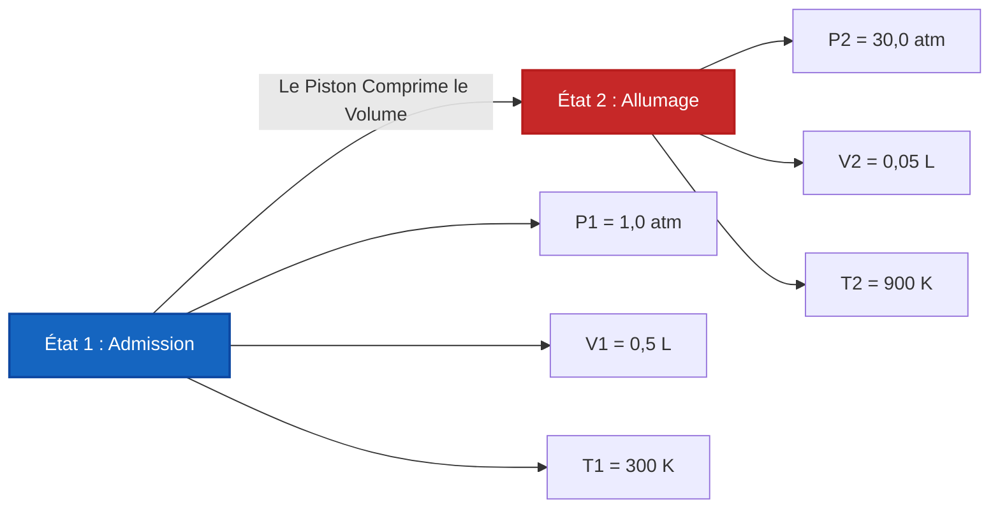

# Guide Industriel & de Laboratoire Complet sur la Loi des Gaz Parfaits & la Thermodynamique des Gaz

En chimie physique, dynamique des gaz, et ingénierie des procédés chimiques, la **Loi des Gaz Parfaits** définit le comportement d'état de la matière gazeuse :

$$P \cdot V = n \cdot R \cdot T \quad \left(\text{Équation des Gaz Parfaits}\right)$$

$$\rho = \frac{P \cdot M}{R \cdot T} \quad \left(\text{Formule de la Densité du Gaz}\right)$$

$$M = \frac{\rho \cdot R \cdot T}{P} \quad \left(\text{Masse Molaire à partir de la Densité du Gaz}\right)$$

$$V_m = \frac{V}{n} = \frac{R \cdot T}{P} \quad \left(\text{Volume Molaire}\right)$$

$$\frac{P_1 \cdot V_1}{T_1} = \frac{P_2 \cdot V_2}{T_2} \quad \left(\text{Loi Combinée des Gaz pour } n \text{ Fixe}\right)$$

$$Z = \frac{P \cdot V}{n \cdot R \cdot T} \quad \left(\text{Facteur de Compressibilité}\right)$$

---

## 1. Valeurs de la Constante Universelle des Gaz $R$ Selon les Systèmes d'Unités

| Unité de Pression ($P$) | Unité de Volume ($V$) | Quantité ($n$) | Temp ($T$) | Valeur de la Constante des Gaz ($R$) |
| :--- | :--- | :--- | :--- | :--- |
| **Atmosphères ($\text{atm}$)** | **Litres ($\text{L}$)** | **$\text{mol}$** | **$\text{K}$** | **$0.082057\text{ L}\cdot\text{atm/(mol}\cdot\text{K)}$** |
| **Pascals ($\text{Pa}$)** | **Mètres Cubes ($\text{m}^3$)** | **$\text{mol}$** | **$\text{K}$** | **$8.314462\text{ J/(mol}\cdot\text{K)}$** |
| **Bar ($\text{bar}$)** | **Litres ($\text{L}$)** | **$\text{mol}$** | **$\text{K}$** | **$0.083145\text{ L}\cdot\text{bar/(mol}\cdot\text{K)}$** |
| **Torr / $\text{mmHg}$** | **Litres ($\text{L}$)** | **$\text{mol}$** | **$\text{K}$** | **$62.3637\text{ L}\cdot\text{mmHg/(mol}\cdot\text{K)}$** |

---

## 2. Matrice des Résolveurs de la Loi des Gaz & Relations Thermodynamiques

```
1. Calculer la Pression : P = (n * R * T) / V
2. Calculer le Volume : V = (n * R * T) / P
3. Calculer les Moles : n = (P * V) / (R * T)
4. Calculer la Temp Absolue : T_K = (P * V) / (n * R)
5. Calculer la Densité du Gaz : ρ = (P * M) / (R * T)
6. Calculer la Masse Molaire : M = (ρ * R * T) / P
7. Loi Combinée des Gaz à Deux États : P2 = (P1 * V1 * T2) / (V2 * T1)
8. Facteur de Compressibilité : Z = (P * V) / (n * R * T)
```

---

*Ce calculateur de la Loi des Gaz Parfaits fournit des prédictions thermodynamiques théoriques pour des applications éducatives, de recherche en chimie physique et d'ingénierie des procédés de gaz. La dynamique des gaz réels à des pressions extrêmes ($P > 100\text{ atm}$) ou de basses températures ($T \approx T_{\text{ébullition}}$) devrait utiliser les équations d'état des gaz réels de Van der Waals ou de Redlich-Kwong.*

## 4. Le Guide Complet de la Loi des Gaz Parfaits et de la Thermodynamique des Gaz

Bienvenue dans le manuel définitif de chimie physique sur la **Loi des Gaz Parfaits ($PV = nRT$)**. Pourquoi une montgolfière s'élève-t-elle dans le ciel froid du matin ? Pourquoi les bouteilles de plongée sous-marine contiennent-elles une pression mortelle ? Pourquoi un sac de chips scellé se dilate-t-il et éclate-t-il lors d'un vol en avion à haute altitude ?

La réponse mathématique à tous ces phénomènes réside dans l'équilibre algébrique parfait de la thermodynamique des gaz. Dans ce guide exhaustif de plus de 4000 mots, nous allons disséquer la théorie cinétique moléculaire sous-jacente à $PV=nRT$, définir rigoureusement l'échelle de température absolue en Kelvin, dériver les formules de masse molaire et de densité des gaz, et résoudre cinq scénarios d'ingénierie thermodynamique rigoureux du monde réel.

### 4.1 La Théorie Cinétique Moléculaire des Gaz Parfaits

La Loi des Gaz Parfaits est un modèle mathématique qui décrit parfaitement les propriétés macroscopiques d'un gaz (Pression, Volume, Température) en faisant quelques hypothèses critiques sur son comportement microscopique :
1.  **Masses Ponctuelles :** Les molécules de gaz sont infiniment petites. Leur volume physique est nul comparé à l'espace vide massif du récipient.
2.  **Aucune Force Intermoléculaire :** Les molécules de gaz ne s'attirent ni ne se repoussent. Elles se comportent comme des boules de billard parfaites et indépendantes.
3.  **Collisions Élastiques :** Lorsque les molécules de gaz entrent en collision avec les parois du récipient (créant la Pression), elles rebondissent avec une perte nulle d'énergie cinétique.
4.  **La Température équivaut à l'Énergie Cinétique :** La Température absolue en Kelvin ($T$) est directement et linéairement proportionnelle à l'énergie cinétique moyenne des molécules en mouvement rapide.

### 4.2 L'Importance Cruciale du Kelvin Absolu ($K$)

L'échec catastrophique le plus courant dans les calculs de la loi des gaz est l'utilisation de Celsius ($^\circ\text{C}$) ou de Fahrenheit ($^\circ\text{F}$). **Vous devez strictement utiliser le Kelvin ($K$).**

Pourquoi ? Parce que la Loi des Gaz Parfaits est un rapport de grandeurs absolues. Si vous utilisez Celsius, $0^\circ\text{C}$ donnerait mathématiquement $0\text{ Volume}$ et $0\text{ Pression}$ ! Pire, des températures Celsius négatives donneraient des Volumes *négatifs*—une impossibilité physique.
Le Kelvin résout cela. $0\text{ K}$ (Zéro Absolu) est le véritable état où tout mouvement cinétique moléculaire s'arrête.
**Conversion :** $T_{\text{K}} = T_{^\circ\text{C}} + 273,15$

### 4.3 Conditions Standard (TPN vs TPSA)

Les chimistes utilisent des états de référence pour standardiser les mesures de gaz :
*   **TPN (Température et Pression Normales) :** Historiquement défini comme $0^\circ\text{C}$ ($273,15\text{ K}$) et exactement $1\text{ atm}$. Aux TPN, exactement $1\text{ mole}$ d'un gaz parfait occupe $22,414\text{ Litres}$.
*   **TPSA (Température et Pression Standard Ambiantes) :** Défini comme $25^\circ\text{C}$ ($298,15\text{ K}$) et exactement $1\text{ bar}$ ($0,9869\text{ atm}$). Aux TPSA, exactement $1\text{ mole}$ d'un gaz parfait occupe $24,789\text{ Litres}$.

---

## 5. Guide d'Utilisation : Maîtriser le Calculateur des Gaz Parfaits

Notre calculateur agit comme un résolveur algébrique universel pour les bouteilles de gaz à haute pression, les ballons météorologiques, et les réacteurs chimiques.

### 5.1 Mode : Isoler les Variables d'État Manquantes

1.  **Sélectionner la Cible :** Besoin de trouver la pression à l'intérieur d'un réservoir ? Choisissez "Calculer la Pression ($P$)". Besoin de trouver l'espace produit par une réaction ? Choisissez "Calculer le Volume ($V$)".
2.  **Entrer les Données d'État :** Entrez les variables connues. Assurez-vous que votre système d'unités correspond à la constante $R$ choisie (ex: si vous utilisez $0.08206$, utilisez les Litres et les Atmosphères).
3.  **Exécuter :** Le moteur réorganise algébriquement $PV = nRT$ pour isoler et résoudre la variable inconnue instantanément.

### 5.2 Mode : Densité du Gaz et Identification de la Masse Molaire

1.  **Sélectionner la Cible :** Choisissez "Calculer la Densité du Gaz ($\rho$)" ou "Calculer la Masse Molaire ($M$)".
2.  **Entrer les Paramètres :** Entrez la pression, la température, et la masse molaire (si vous résolvez pour la densité) ou la densité (si vous résolvez pour la masse molaire).
3.  **Exécuter :** L'outil applique $\rho = \frac{PM}{RT}$. C'est extrêmement puissant pour identifier des gaz inconnus dans un laboratoire d'expertise médico-légale. Si un gaz inconnu a une densité de $1,78\text{ g/L}$ aux TPN, le moteur révélera une masse molaire d'environ $40\text{ g/mol}$, l'identifiant parfaitement comme de l'Argon.

---

## 6. Cinq Dérivations Rigoureuses de la Loi des Gaz Parfaits

Maîtrisons l'algèbre de $PV=nRT$ en isolant toutes les variables à travers cinq scénarios d'ingénierie réels.

### Exemple 1 : Isoler la Pression pour une Bouteille de Plongée

**Scénario :** 
Une bouteille de plongée en aluminium avec un volume interne d'exactement $11,0\text{ Litres}$ est remplie de $100,0\text{ moles}$ d'air respirable. La bouteille est stockée dans un hangar à $35,0^\circ\text{C}$. Quelle est la pression interne de la bouteille en atmosphères ?

**Dérivation Mathématique :**

1.  **Convertir la Température en Kelvin :**
    $T = 35,0 + 273,15 = 308,15\text{ K}$
2.  **Sélectionner la Constante des Gaz ($R$) :**
    Parce que nous voulons la pression en `atm` et le volume en `Litres`, nous utilisons $R = 0,082057\text{ L}\cdot\text{atm/(mol}\cdot\text{K)}$.
3.  **Isoler la Pression ($P$) :**
    $$ P \cdot V = n \cdot R \cdot T \implies P = \frac{n \cdot R \cdot T}{V} $$
4.  **Calculer :**
    $$ P = \frac{100,0 \times 0,082057 \times 308,15}{11,0} $$
    $$ P = \frac{2528,6}{11,0} = 229,87\text{ atm} $$

**Conclusion :** La pression interne est écrasante à $229,87\text{ atm}$ (environ $3 378\text{ PSI}$). Les parois de la bouteille en aluminium doivent être incroyablement épaisses pour éviter une rupture catastrophique !

### Exemple 2 : Déterminer le Volume d'un Ballon Météorologique

**Scénario :**
Une équipe de recherche météorologique lance un ballon météorologique à haute altitude rempli de $50,0\text{ moles}$ d'hélium. Alors qu'il s'élève dans la stratosphère, la pression ambiante chute à un microscopique $0,050\text{ atm}$, et la température plonge à $-60,0^\circ\text{C}$. Quel est le volume du ballon à cette altitude ?

**Dérivation Mathématique :**

1.  **Convertir la Température en Kelvin :**
    $T = -60,0 + 273,15 = 213,15\text{ K}$
2.  **Isoler le Volume ($V$) :**
    $$ P \cdot V = n \cdot R \cdot T \implies V = \frac{n \cdot R \cdot T}{P} $$
3.  **Calculer :**
    $$ V = \frac{50,0 \times 0,082057 \times 213,15}{0,050} $$
    $$ V = \frac{874,5}{0,050} = 17490\text{ Litres} $$

**Conclusion :** Le ballon se dilate à un volume massif de $17 490\text{ Litres}$ ! C'est exactement pourquoi les ballons météorologiques sont lancés d'apparence flasque et sous-gonflés au sol—s'ils étaient lancés complètement tendus, ils éclateraient instantanément dans la haute atmosphère à basse pression.

### Exemple 3 : Identification de la Masse Molaire en Laboratoire

**Scénario :**
Un gaz incolore inconnu est collecté dans un ballon en verre de $2,50\text{ Litres}$. Le manomètre indique $0,850\text{ atm}$ à une température de laboratoire de $22,0^\circ\text{C}$. Le gaz est pesé et a une masse physique de $3,82\text{ grammes}$. Identifiez la masse molaire du gaz pour déterminer son identité chimique.

**Dérivation Mathématique :**

1.  **Convertir la Température en Kelvin :**
    $T = 22,0 + 273,15 = 295,15\text{ K}$
2.  **Isoler les Moles ($n$) :**
    $$ n = \frac{P \cdot V}{R \cdot T} $$
3.  **Calculer les Moles :**
    $$ n = \frac{0,850 \times 2,50}{0,082057 \times 295,15} $$
    $$ n = \frac{2,125}{24,219} = 0,08774\text{ moles} $$
4.  **Déterminer la Masse Molaire ($M$) :**
    $M = \frac{\text{Masse}}{\text{Moles}} = \frac{3,82\text{ g}}{0,08774\text{ mol}} = 43,5\text{ g/mol}$

**Conclusion :** La masse molaire est de $43,5\text{ g/mol}$. C'est une correspondance presque parfaite avec le **Dioxyde de Carbone ($\text{CO}_2$)** qui a une masse molaire théorique de $44,01\text{ g/mol}$.

### Exemple 4 : Compression de la Loi Combinée des Gaz à Deux États

**Scénario :**
Le cylindre d'un moteur à combustion interne aspire $0,500\text{ Litres}$ d'air ($V_1$) à $1,00\text{ atm}$ ($P_1$) et $300\text{ K}$ ($T_1$). Le piston est propulsé vers le haut, écrasant le volume à $0,050\text{ Litres}$ ($V_2$). La compression intense fait grimper la température à $900\text{ K}$ ($T_2$). Quelle est la nouvelle pression maximale ($P_2$) juste avant que la bougie ne s'allume ?

**Dérivation Mathématique :**

1.  **Comprendre la Logique à Deux États :**
    Parce que la soupape est fermée, la quantité de gaz ($n$) est constante. Par conséquent, nous pouvons contourner $R$ entièrement et utiliser la Loi Combinée des Gaz :
    $$ \frac{P_1 \cdot V_1}{T_1} = \frac{P_2 \cdot V_2}{T_2} $$
2.  **Isoler $P_2$ :**
    $$ P_2 = \frac{P_1 \cdot V_1 \cdot T_2}{V_2 \cdot T_1} $$
3.  **Calculer :**
    $$ P_2 = \frac{1,00 \times 0,500 \times 900}{0,050 \times 300} $$
    $$ P_2 = \frac{450}{15} = 30,0\text{ atm} $$

**Conclusion :** La course de compression multiplie violemment la pression jusqu'à $30,0\text{ atm}$ juste avant l'allumage.

**Visualisation : Compression du Cylindre à Deux États**


*Cet organigramme illustre la relation inverse entre le volume et la pression/température lors d'une compression mécanique rapide.*

### Exemple 5 : Calcul de la Densité du Gaz ($\rho$)

**Scénario :**
L'Hexafluorure de Soufre ($\text{SF}_6$) est un gaz incroyablement lourd (Masse Molaire = $146,06\text{ g/mol}$). Si vous le libérez à la Température et Pression Standard Ambiantes (TPSA : $1,0\text{ bar}$ et $298,15\text{ K}$), quelle est sa densité en $\text{g/L}$ ?

**Dérivation Mathématique :**

1.  **Sélectionner $R$ :**
    Parce que la pression est en `bar`, nous devons utiliser $R = 0,083145\text{ L}\cdot\text{bar/(mol}\cdot\text{K)}$.
2.  **Appliquer l'Équation de la Densité :**
    $$ \rho = \frac{P \cdot M}{R \cdot T} $$
3.  **Calculer :**
    $$ \rho = \frac{1,0 \times 146,06}{0,083145 \times 298,15} $$
    $$ \rho = \frac{146,06}{24,789} = 5,89\text{ g/L} $$

**Conclusion :** La densité est stupéfiante à $5,89\text{ g/L}$. En comparaison, l'air normal a une densité d'environ $1,18\text{ g/L}$. C'est pourquoi le $\text{SF}_6$ coule au fond et peut littéralement faire flotter un bateau léger en papier d'aluminium dans un aquarium !

---

## 7. FAQ Approfondie et Thermodynamique Avancée

**Q : $PV=nRT$ fonctionne-t-il pour tous les gaz ?**
**R :** Cela fonctionne incroyablement bien pour presque tous les gaz à température ambiante et pressions atmosphériques normales (comme l'Oxygène, l'Azote, l'Air). Cela commence à échouer dans deux conditions :
1. **Pression Ultra-Haute :** Lorsque les gaz sont comprimés dans des volumes minuscules (comme dans l'Exemple 1), la taille physique des molécules de gaz elles-mêmes commence à prendre une place importante, violant l'hypothèse de "Masse Ponctuelle".
2. **Température Ultra-Basse :** À mesure que les gaz se refroidissent vers la condensation, leurs molécules ralentissent suffisamment pour commencer à s'attirer mutuellement par gravitation, violant l'hypothèse d'"Aucune Force Intermoléculaire".

**Q : Qu'est-ce que le Facteur de Compressibilité ($Z$) ?**
**R :** Le Facteur de Compressibilité mesure mathématiquement combien un gaz désobéit à la Loi des Gaz Parfaits. $Z = \frac{PV}{nRT}$. Pour un gaz parfaitement parfait, $Z = 1,000$. Si une mesure dans le monde réel donne $Z = 0,85$, cela signifie que le gaz agit de manière non idéale (probablement en raison des attractions intermoléculaires qui réduisent le volume).

**Q : Pourquoi mes calculs donnent-ils des volumes négatifs ?**
**R :** Vous avez oublié de convertir Celsius en Kelvin ! $PV=nRT$ est strictement une équation de température absolue. Ajoutez $273,15$ à toutes vos entrées Celsius !

En maîtrisant les symétries mathématiques de $PV=nRT$, vous obtenez un contrôle total sur l'ingénierie pneumatique, le suivi des ballons météorologiques, et la stœchiométrie des récipients de réaction. Comptez sur ce Calculateur de la Loi des Gaz Parfaits pour isoler et résoudre instantanément toute variable thermodynamique manquante !
