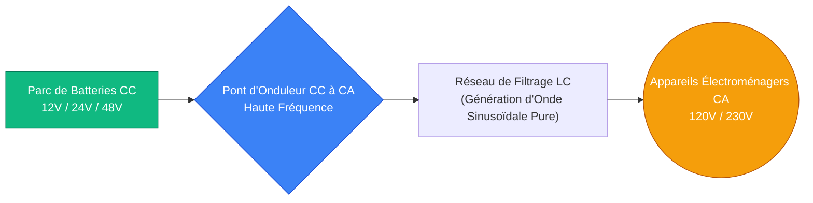
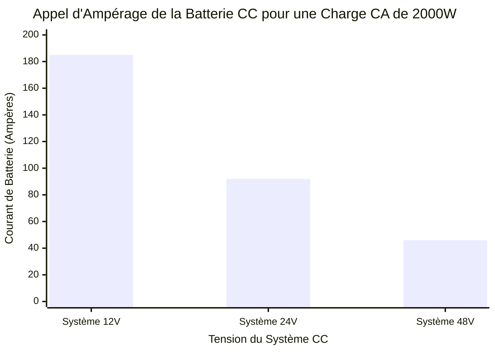
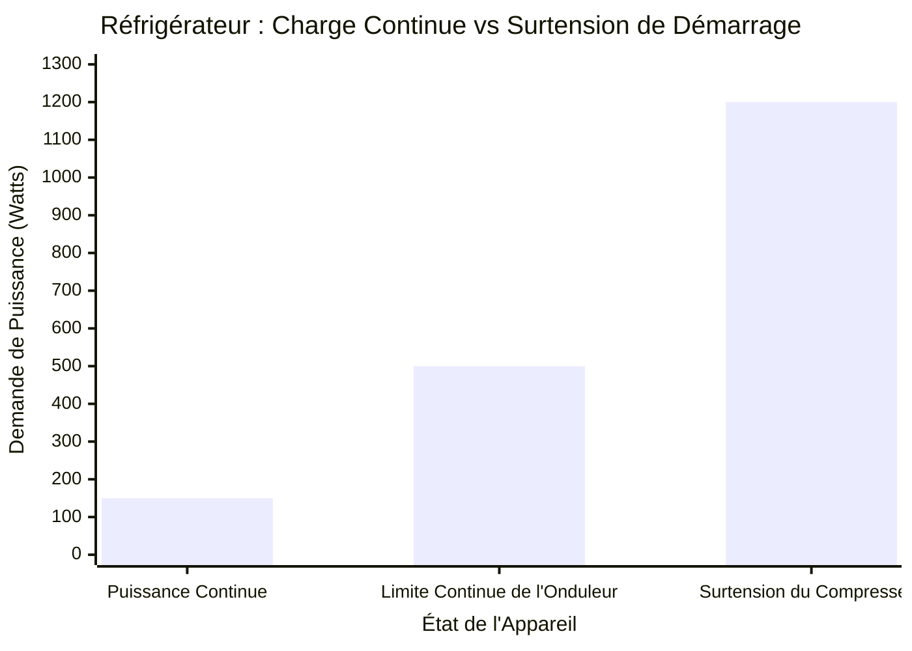
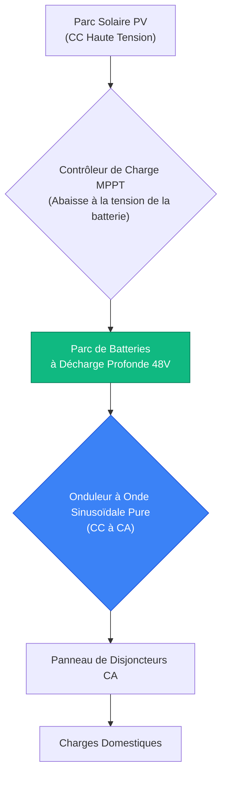

# Le Calculateur Définitif d'Onduleur : Dimensionnement, Sélection de la Tension CC et Systèmes Hybrides Solaires

Bienvenue dans l'ultime **Calculateur d'Onduleur** et guide complet d'ingénierie de l'électronique de puissance. Que vous soyez un propriétaire hors réseau concevant un système de batterie hybride solaire, un passionné de camping-car convertissant du $12\text{V}$ CC pour faire fonctionner un micro-ondes, ou un ingénieur d'installations tentant de dimensionner un système de secours d'urgence massif de $48\text{V}$, comprendre la physique des onduleurs est absolument critique.

Un onduleur est le cœur technologique battant de tout système moderne de batteries ou d'énergie solaire. Il effectue la tâche complexe et à haute fréquence de conversion du courant continu (CC) brut d'un parc de batteries en courant alternatif (CA) lisse et utilisable requis par les appareils électroménagers. Si vous sous-dimensionnez votre onduleur, le compresseur de votre réfrigérateur calera et surchauffera au démarrage. Si vous sélectionnez la mauvaise tension de système CC ($12\text{V}$ au lieu de $48\text{V}$), vos câbles en cuivre fondront sous la charge massive d'ampérage.

Dans cette masterclass SEO exhaustive de plus de 4 000 mots, nous allons déconstruire les différences fondamentales entre les technologies à Onde Sinusoïdale Pure et à Onde Sinusoïdale Modifiée, exposer les dangers cachés des surtensions de démarrage des appareils, prouver mathématiquement pourquoi les systèmes $48\text{V}$ CC sont largement supérieurs aux systèmes $12\text{V}$ CC pour les charges importantes, et décoder l'ingénierie nécessaire pour dimensionner un système hybride solaire. Pour garantir une compréhension absolue, nous avons inclus cinq diagrammes interactifs Mermaid.js méticuleusement détaillés et compatibles avec les analyseurs.

---

## 1. La Physique du Dimensionnement des Onduleurs (Watts vs VA vs Facteur de Puissance)

Le concept le plus critique dans l'ingénierie des onduleurs est de comprendre pourquoi les charges électriques ont deux puissances nominales différentes : **Watts (W)** et **Volt-Ampères (VA)**, et comment cela est lié au **Facteur de Puissance (FP)**.

1. **Puissance Réelle (Watts) :** Cela représente le travail réel en cours de réalisation. Un grille-pain de $1000\text{W}$ effectue exactement $1000\text{W}$ de travail de chauffage.
2. **Puissance Apparente (VA) :** Cela représente la demande électrique totale placée sur le pont en silicium de l'onduleur. En raison de la physique du courant alternatif, les charges inductives (comme les moteurs CA et les compresseurs de réfrigérateur) forcent l'onduleur à pousser et tirer une puissance réactive "fantôme".

**L'Équation du Facteur de Puissance :**
$$\text{Facteur de Puissance (FP)} = \frac{\text{Puissance Réelle (Watts)}}{\text{Puissance Apparente (VA)}}$$

Par conséquent :
$$\text{Puissance Apparente (VA)} = \frac{\text{Watts}}{\text{Facteur de Puissance}}$$

**Pourquoi est-ce important ?**
Les onduleurs sont classés en fonction de leur capacité de puissance apparente (VA ou kVA).
- Si vous branchez un radiateur résistif de $1500\text{W}$ ($1.0\text{ FP}$) sur un onduleur de $2000\text{VA}$, il consomme $1500\text{VA}$. L'onduleur gère cela sans effort.
- Si vous branchez une ancienne pompe à eau de $1500\text{W}$ ($0.65\text{ FP}$) sur ce même onduleur de $2000\text{VA}$, elle demande $2307\text{VA}$ ($1500 / 0.65$). L'onduleur sera surchargé et s'éteindra, bien que le "Wattage" semble inférieur à la limite.

---

## 2. Le Danger des Surtensions de Démarrage Inductives

Lorsque vous calculez la charge totale de votre équipement, vous ne pouvez pas simplement additionner la puissance de fonctionnement de vos appareils. Vous devez concevoir pour les **surtensions de courant d'appel**.

Les moteurs électriques, les pompes à eau, les compresseurs de climatiseur et les compresseurs de réfrigérateur tirent des surtensions massives de courant à la milliseconde exacte où ils sont allumés afin de surmonter l'inertie physique.
- Un **réfrigérateur** fonctionnant à $150\text{W}$ peut tirer une surtension brutale de $1200\text{W}$ pendant une seconde lorsque le compresseur s'enclenche.
- Un **climatiseur de 1.5 CV** fonctionnant à $1200\text{W}$ peut tirer une surtension de $4000\text{W}$.

Si la "capacité de surtension de crête" de votre onduleur ne peut pas gérer ce pic d'une fraction de seconde, l'onduleur déclenchera instantanément ses circuits de protection internes, coupant l'alimentation de toute votre maison. Dimensionnez toujours la capacité de surtension de votre onduleur pour dépasser confortablement le plus gros moteur démarrant dans votre maison.

---

## 3. Démystifier les Tensions du Système CC : 12V vs 24V vs 48V

L'erreur la plus courante commise par les bricoleurs hors réseau est de tenter de faire fonctionner une charge massive de $3000\text{W}$ sur un parc de batteries CC de $12\text{V}$. C'est une erreur d'ingénierie catastrophique.

Pour produire $3000\text{W}$ de courant CA, l'onduleur doit tirer $3000\text{W}$ du parc de batteries CC.
En utilisant la loi de Watt ($I = P / V$), calculons la consommation de courant CC à différentes tensions de système, en supposant une efficacité d'onduleur de $90\%$ :

- **À $12\text{V}$ CC :** $3000\text{W} / (12\text{V} \times 0.90) = \mathbf{277\text{ Ampères}}$.
- **À $24\text{V}$ CC :** $3000\text{W} / (24\text{V} \times 0.90) = \mathbf{138\text{ Ampères}}$.
- **À $48\text{V}$ CC :** $3000\text{W} / (48\text{V} \times 0.90) = \mathbf{69\text{ Ampères}}$.

**Pourquoi 277 Ampères à 12V est-il dangereux ?**
Pousser $277\text{ Ampères}$ nécessite des câbles en cuivre plus épais que votre pouce ($4/0\text{ AWG}$). Si vous utilisez un fil standard, le courant extrême générera des quantités massives de chaleur $I^2R$, faisant fondre l'isolant, provoquant un risque d'incendie et gaspillant la précieuse énergie de la batterie sous forme de perte thermique.
En passant à un système de $48\text{V}$, le courant chute de $75\%$, permettant un câblage plus fin, moins cher et plus sûr.

---

## 4. Onde Sinusoïdale Pure vs. Onde Sinusoïdale Modifiée

Les onduleurs génèrent du courant alternatif en commutant rapidement le courant continu d'avant en arrière. La qualité de cette commutation crée la "forme d'onde".

1. **Onde Sinusoïdale Modifiée :** L'onduleur produit une onde carrée en blocs et en escaliers. Il est peu coûteux à fabriquer. Il fonctionne bien pour les charges résistives comme les ampoules à incandescence et les chauffages simples. Cependant, si vous branchez un réfrigérateur, un ventilateur ou une alimentation d'ordinateur Active-PFC dans un onduleur à onde sinusoïdale modifiée, l'appareil bourdonnera bruyamment, surchauffera et subira finalement des dommages permanents au moteur.
2. **Onde Sinusoïdale Pure :** L'onduleur utilise une modulation de largeur d'impulsion (PWM) haute fréquence avancée et un filtrage LC pour produire une onde sinusoïdale parfaitement lisse et continue qui imite parfaitement l'alimentation du réseau municipal. Ceci est strictement requis pour l'électronique sensible moderne, les appareils médicaux CPAP et les moteurs à induction CA.

---

## 5. Onduleurs Solaires Hybrides & Systèmes Hors Réseau

Un **onduleur solaire hybride** moderne est en fait trois dispositifs distincts emballés dans un seul châssis :
1. **Contrôleur de Charge Solaire MPPT :** Optimise la tension CC brute des panneaux solaires et charge le parc de batteries.
2. **Onduleur CC vers CA :** Convertit le CC de la batterie en CA domestique.
3. **Redresseur CA vers CC / Commutateur de transfert :** Peut prendre l'alimentation CA du réseau (ou d'un générateur) pour charger les batteries pendant les jours nuageux, et basculer instantanément les charges entre l'énergie solaire, la batterie et le réseau.

Lors du dimensionnement d'un système solaire pour un onduleur hybride, les ingénieurs utilisent le **Ratio CC/CA** :
$$\text{Ratio CC/CA} = \frac{\text{Total des Watts CC des Panneaux Solaires}}{\text{Puissance de Sortie CA de l'Onduleur}}$$
Un ratio de $1.15$ à $1.25$ est optimal. Ce "sur-dimensionnement des panneaux" garantit que l'onduleur fonctionne à sa capacité maximale plus tôt le matin et plus tard l'après-midi, maximisant la production quotidienne de kWh.

---

## 6. Cinq Scénarios d'Ingénierie Conceptuelle avec Visualisations 2D

Pour maîtriser pleinement les relations physiques régissant les systèmes d'onduleurs, nous explorerons cinq scénarios d'ingénierie distincts décomposés visuellement à l'aide de diagrammes Mermaid.js personnalisés.

### Exemple 1 : La Topographie Fondamentale de l'Onduleur

**Le Scénario :**
Un propriétaire de cabane hors réseau doit comprendre le flux physique de base de l'énergie de son parc de batteries, à travers l'électronique de l'onduleur, vers ses appareils.

**Visualisation 2D :**
Cet organigramme logique cartographie le processus de conversion de haut niveau, démontrant comment le courant continu basse tension est élevé et inversé en courant alternatif haute tension.

---

### Exemple 2 : La Crise d'Appel de Courant 12V vs 48V

**Le Scénario :**
Un bricoleur veut tirer $2000\text{W}$ d'un parc de batteries et n'arrive pas à décider s'il doit câbler ses batteries pour $12\text{V}$ ou $48\text{V}$.

**Les Mathématiques :**
Le courant est inversement proportionnel à la tension. À $12\text{V}$, tirer $2000\text{W}$ (à $90\%$ d'efficacité) entraîne 185 Ampères terrifiants. À $48\text{V}$, c'est un très gérable $46\text{ Ampères}$.

**Visualisation 2D :**
Ce graphique illustre la réalité brutale de l'appel de courant CC sur différentes tensions de système, prouvant pourquoi le $48\text{V}$ est obligatoire pour les installations hors réseau de toute la maison.

---

### Exemple 3 : Le Piège de la Surtension de Démarrage du Réfrigérateur

**Le Scénario :**
Un propriétaire achète un onduleur bon marché de $500\text{W}$ pour faire fonctionner son réfrigérateur de $150\text{W}$ pendant une panne de courant. L'onduleur se déclenche instantanément et émet une alarme de surcharge.

**Les Mathématiques :**
Bien que la puissance de fonctionnement continu ne soit que de $150\text{W}$, le moteur du compresseur nécessite une surtension instantanée de $1200\text{W}$ pour briser l'inertie physique. L'onduleur de $500\text{W}$ a été violemment surchargé de $240\%$.

**Visualisation 2D :**
Ce graphique prouve visuellement la nécessité de dimensionner un onduleur en fonction de la capacité de surtension de crête plutôt que de la capacité de fonctionnement continu.

---

### Exemple 4 : Architecture Solaire Hybride Hors Réseau

**Le Scénario :**
Un installateur solaire conçoit un système d'alimentation entièrement hors réseau comprenant des panneaux solaires, un contrôleur de charge MPPT, un parc de batteries et un onduleur CA.

**Visualisation 2D :**
Cet organigramme de haut en bas cartographie le flux multidirectionnel d'énergie dans un système solaire hybride, démontrant comment le parc de batteries agit comme le réservoir d'énergie central.

---

### Exemple 5 : Le Cycle Solaire / Batterie Quotidien

**Le Scénario :**
Un propriétaire hors réseau doit comprendre comment l'énergie est générée et consommée sur un cycle de 24 heures.

**Visualisation 2D :**
Ce diagramme de Gantt visualise le cycle d'énergie quotidien, démontrant comment la production solaire doit couvrir les charges diurnes ET recharger simultanément le parc de batteries pour survivre à la longue nuit sombre.

```mermaid
gantt
    title Cycle Énergétique Hors Réseau de 24 Heures
    dateFormat  HH:mm
    axisFormat  %H:%M
    
    section Production Solaire
    Montée en Puissance Matinale du PV :active, 07:00, 4h
    Production Solaire Maximale (Charge) :crit, 11:00, 4h
    Baisse de Puissance de l'Après-midi du PV :active, 15:00, 4h
    
    section État de la Batterie
    Décharge (Charge Nocturne) :done, 00:00, 8h
    Charge (Excédent Solaire) :active, 08:00, 8h
    Décharge (Charge du Soir) :done, 16:00, 8h
```

---

## 7. Conclusion et Défi d'Ingénierie

Maîtriser le dimensionnement des onduleurs est le socle fondamental de toute ingénierie de l'alimentation hors réseau, marine et de secours. Comprendre la relation inverse entre la tension continue et le courant, respecter la réalité brutale des surtensions de démarrage inductives et choisir la technologie à Onde Sinusoïdale Pure par rapport aux ondes carrées modifiées garantira que votre système électrique fonctionnera parfaitement pendant des décennies.

Si vous ignorez ces principes mathématiques, vos câbles CC fondront sous des charges de $12\text{V}$, vos réfrigérateurs caleront et grilleront sur des ondes sinusoïdales modifiées, et votre onduleur se déclenchera continuellement lors des démarrages du climatiseur.

Pour garantir que vous avez maîtrisé ces concepts critiques, démarrez notre simulateur interactif et tentez de résoudre ces défis finaux :
1. **Le Piège de l'Ampérage :** Vous devez faire fonctionner un four électrique de $4000\text{W}$. Si vous utilisez un parc de batteries de $12\text{V}$ (en supposant une efficacité d'onduleur de $85\%$), exactement combien d'ampères de courant CC circuleront dans vos câbles ?
2. **Le Calcul de la Surtension :** Vous voulez faire fonctionner une pompe à eau de $1.0\text{ CV}$ ($750\text{W}$ en continu) et une télévision de $200\text{W}$ simultanément. En supposant que la pompe a une surtension de démarrage de $3.0\times$, quelle est la valeur nominale de surtension minimale absolue que votre onduleur doit avoir ?
3. **Le Calcul Solaire :** Vous avez un onduleur de $5000\text{VA}$. Vous voulez un ratio CC/CA de $1.20$. Combien de Watts de panneaux solaires devriez-vous installer sur votre toit ?

Fiez-vous à ce calculateur pour auditer les conceptions de vos cabanes hors réseau, justifier mathématiquement la mise à niveau vers une architecture de $48\text{V}$, et éliminer définitivement les pannes de surcharge d'onduleur.

