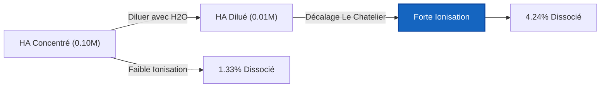

# Guide de Chimie Analytique et de Laboratoire sur le Ka et l'Équilibre des Acides Faibles

En chimie analytique, physique et biologique, la **constante de dissociation acide** ($K_a$) mesure la force quantitative d'un acide faible en solution aqueuse :

$$K_a = \frac{[\text{H}^+][\text{A}^-]}{[\text{HA}]} \quad \iff \quad \text{p}K_a = -\log_{10}(K_a)$$

$$x^2 + K_a x - K_a C = 0 \quad \implies \quad [\text{H}^+] = \frac{-K_a + \sqrt{K_a^2 + 4 K_a C}}{2}$$

$$\text{Pourcentage d'Ionisation} = \frac{[\text{H}^+]_{\text{eq}}}{C_{\text{initial}}} \times 100\% \le 5\% \quad (\text{Règle d'Approximation des 5\%})$$

---

## 1. Matrice de Référence des Constantes de Dissociation d'Acides Faibles Courants

| Acide Faible | Formule | $K_a$ ($25^\circ\text{C}$) | $\text{p}K_a$ | Pourcentage d'Ionisation ($0.10\,\text{M}$) |
| :--- | :--- | :--- | :--- | :--- |
| **Acide Trichloroacétique** | $\text{CCl}_3\text{COOH}$ | **$3.0 \cdot 10^{-1}$** | **$0.52$** | $\sim 80\%$ |
| **Acide Formique** | $\text{HCOOH}$ | **$1.8 \cdot 10^{-4}$** | **$3.75$** | $\sim 4.2\%$ |
| **Acide Benzoïque** | $\text{C}_6\text{H}_5\text{COOH}$ | **$6.3 \cdot 10^{-5}$** | **$4.20$** | $\sim 2.5\%$ |
| **Acide Acétique** | $\text{CH}_3\text{COOH}$ | **$1.8 \cdot 10^{-5}$** | **$4.76$** | $\sim 1.3\%$ |
| **Acide Cyanhydrique** | $\text{HCN}$ | **$6.2 \cdot 10^{-10}$** | **$9.21$** | $\sim 0.008\%$ |

---

## 2. Protocoles Standard de Calcul du $K_a$

```
1. Ka à partir du pH : x = 10^(-pH), Ka = x^2 / (C - x)
2. Ka à partir de [H+] : x = [H+], Ka = x^2 / (C - x)
3. Ka à partir du % d'Ionisation : x = (% / 100) * C, Ka = x^2 / (C - x)
4. Ka à partir du pKa : Ka = 10^(-pKa)
5. Concentrations à l'Équilibre à partir du Ka : Résoudre la quadratique x^2 + Ka*x - Ka*C = 0
```

---

## 3. Clause de Non-responsabilité en matière d'Éducation et de Sécurité en Laboratoire
*Ce calculateur de Ka fournit des calculs d'équilibre théoriques pour des applications éducatives, de recherche en laboratoire et de chimie AP. Les solutions concentrées non idéales à forces ioniques élevées doivent tenir compte des coefficients d'activité en utilisant les équations de Debye-Hückel ou de Pitzer.*

## 4. Le Guide Complet de la Dissociation Acide ($K_a$) et des Tableaux d'Avancement (ICE)

Bienvenue dans le guide définitif sur la Constante de Dissociation Acide ($K_a$). Dans le domaine de la chimie aqueuse, tous les acides ne sont pas créés égaux. Alors que les acides forts abandonnent imprudemment tous leurs protons dès qu'ils touchent l'eau, les acides faibles sont prudents. Ils établissent un équilibre thermodynamique délicat—un équilibre—où seule une fraction de leurs molécules se dissocie.

Comprendre, calculer et prédire cette fraction exacte est le cœur de la chimie analytique, de la pharmacologie et des sciences de l'environnement. La clé mathématique de cette prédiction est la valeur du $K_a$, qui dicte strictement le rapport d'équilibre entre les molécules d'acide dissociées et les molécules d'acide intactes.

Dans ce manuel technique exhaustif de plus de 4000 mots, nous allons complètement démystifier la thermodynamique de la dissociation des acides faibles, détailler la construction des tableaux d'avancement (Initial, Changement, Équilibre), établir les limites mathématiques exactes de la "Règle des 5%", et passer en revue cinq exemples chimiques rigoureux du monde réel complets avec des dérivations algébriques étape par étape et des diagrammes visuels Mermaid.

### 4.1 Qu'est-ce que le $K_a$ (La Constante de Dissociation Acide) ?

Lorsqu'un acide générique faible ($\text{HA}$) est dissous dans l'eau, il subit une réaction réversible :
$$ \text{HA (aq)} \rightleftharpoons \text{H}^+\text{(aq)} + \text{A}^-\text{(aq)} $$

Parce que cette réaction est réversible, elle atteint finalement un état d'équilibre dynamique où la vitesse de dissociation directe correspond exactement à la vitesse de recombinaison inverse. La **Constante de Dissociation Acide ($K_a$)** est le rapport mathématique strict des produits aux réactifs à cet état d'équilibre exact :

$$ K_a = \frac{[\text{H}^+][\text{A}^-]}{[\text{HA}]} $$

Cette simple fraction nous dit tout sur la force de l'acide :
*   **Grand $K_a$ :** Le numérateur (produits) est grand. L'acide est relativement fort et se dissocie fortement.
*   **Petit $K_a$ :** Le dénominateur (acide intact) est grand. L'acide est très faible et préfère rester entier.

### 4.2 Convertir entre $K_a$ et $\text{p}K_a$

Parce que les valeurs de $K_a$ sont généralement très petites, des nombres de notation scientifique encombrants (ex., $1.8 \times 10^{-5}$), les chimistes les convertissent universellement en une échelle logarithmique connue sous le nom de $\text{p}K_a$.

$$ \text{p}K_a = -\log_{10}(K_a) \quad \text{et} \quad K_a = 10^{-\text{p}K_a} $$

**La Règle d'Or de la Force Acide :** En raison du logarithme négatif, la relation est inversée. Un $\text{p}K_a$ **plus bas** signifie un acide faible **plus fort**. Par exemple, l'Acide Formique ($\text{p}K_a = 3.75$) est plus fort que l'Acide Acétique ($\text{p}K_a = 4.76$).

### 4.3 L'Anatomie d'un Tableau d'Avancement (ICE)

Un **Tableau d'Avancement (ICE)** (Initial, Changement, Équilibre) est l'outil de comptabilité fondamental utilisé pour résoudre les problèmes de dissociation des acides faibles. 

Supposons que nous commencions avec une concentration initiale ($C$) de l'acide faible $\text{HA}$, et zéro produit.
Soit $x$ la molarité inconnue de $\text{HA}$ qui se dissocie avec succès.

| Espèce | $\text{HA}$ | $\text{H}^+$ | $\text{A}^-$ |
| :--- | :--- | :--- | :--- |
| **I**nitiale | $C$ | $0$ | $0$ |
| **C**hangement | $-x$ | $+x$ | $+x$ |
| **É**quilibre | $C - x$ | $x$ | $x$ |

En insérant la ligne du bas "Équilibre" dans notre expression de $K_a$, nous générons l'équation maîtresse :
$$ K_a = \frac{x \cdot x}{C - x} = \frac{x^2}{C - x} $$

### 4.4 La Règle des 5% et l'Équation Quadratique

Pour trouver le pH final, nous devons résoudre pour $x$ (qui est $[\text{H}^+]$). Réarranger l'équation maîtresse donne une quadratique :
$$ x^2 + K_a x - K_a C = 0 $$

Historiquement, avant les ordinateurs et les calculateurs en ligne, on apprenait aux étudiants à utiliser l'**Approximation des petits x** pour éviter la formule quadratique. Si l'acide est très faible (petit $K_a$), alors la quantité qui se dissocie ($x$) est si infime par rapport à $C$ que nous pouvons prétendre que $(C - x) \approx C$.
Cela simplifie magnifiquement les mathématiques en :
$$ x = \sqrt{K_a \cdot C} $$

**La Règle des 5% :** Cette approximation n'est mathématiquement valide que si le $x$ calculé final est inférieur à 5% de la concentration initiale $C$. Si l'ionisation dépasse 5%, l'approximation crée des erreurs analytiques inacceptables, et la formule quadratique exacte doit être utilisée :
$$ x = \frac{-K_a + \sqrt{K_a^2 - 4(1)(-K_a C)}}{2} $$

Notre Calculateur de $K_a$ utilise toujours le solveur quadratique exact pour garantir la précision, indépendamment de savoir si la règle des 5% est respectée ou non.

---

## 5. Guide d'Utilisation : Maîtriser le Calculateur de Ka

Notre outil fonctionne de manière bidirectionnelle : vous pouvez soit entrer un $K_a$ pour trouver le pH résultant, soit entrer des données de pH expérimentales pour déterminer le $K_a$ d'un acide inconnu.

### 5.1 Mode : Calculer le pH à partir d'un $K_a$ connu

1.  **Sélectionnez le Mode :** Choisissez "Concentrations à l'Équilibre à partir de Ka".
2.  **Paramètres d'Entrée :** Entrez la Concentration Initiale ($C$) et le $K_a$ (ou $\text{p}K_a$) connu de votre acide.
3.  **Lire la Sortie :** Le calculateur génère le tableau d'avancement complet, exécute le solveur quadratique exact, et affiche le pH final, le $[\text{H}^+]$ exact, et le Pourcentage d'Ionisation.

### 5.2 Mode : Découvrir un $K_a$ inconnu à partir de données de pH

1.  **Sélectionnez le Mode :** Choisissez "Ka à partir du pH".
2.  **Paramètres d'Entrée :** Entrez la Concentration Initiale ($C$) de l'acide que vous avez préparé en laboratoire, et le pH final que vous avez mesuré avec votre pH-mètre.
3.  **Exécuter :** L'outil calcule $x$ à l'envers ($[\text{H}^+] = 10^{-\text{pH}}$) et l'insère directement dans la formule $K_a = x^2 / (C - x)$ pour révéler l'identité de l'acide.

### 5.3 Mode : Pourcentage d'Ionisation

1.  **Sélectionnez le Mode :** Choisissez "Ka à partir du Pourcentage d'Ionisation".
2.  **Paramètres d'Entrée :** Entrez la Concentration Initiale ($C$) et le pourcentage de l'acide qui s'est ionisé.
3.  **Exécuter :** L'outil calcule $x$ en prenant ce pourcentage de $C$, puis résout pour le $K_a$.

---

## 6. Cinq Exemples de Concepts du Monde Réel

Appliquons ces cadres mathématiques à des scénarios de chimie analytique du monde réel, complets avec des décompositions algébriques étape par étape.

### Exemple 1 : Trouver Ka à partir de Données de pH en Laboratoire

**Scénario :** 
Une chercheuse synthétise un nouvel acide monoprotique faible. Elle en crée une solution à $0.250\text{ M}$ en laboratoire et mesure le pH avec une sonde calibrée. Le pH indique 3.45. Quels sont le $K_a$ et le $\text{p}K_a$ de ce nouvel acide ?

**Dérivation Mathématique :**

1.  **Calculer $x$ ($[\text{H}^+]$) à partir du pH :**
    $$ [\text{H}^+] = 10^{-\text{pH}} $$
    $$ x = 10^{-3.45} = 3.55 \times 10^{-4}\text{ M} $$
2.  **Établir les Variables ICE :**
    $[\text{H}^+] = x = 3.55 \times 10^{-4}\text{ M}$
    $[\text{A}^-] = x = 3.55 \times 10^{-4}\text{ M}$
    $[\text{HA}] = C - x = 0.250 - (3.55 \times 10^{-4}) = 0.2496\text{ M}$
3.  **Calculer $K_a$ :**
    $$ K_a = \frac{x^2}{C - x} $$
    $$ K_a = \frac{(3.55 \times 10^{-4})^2}{0.2496} $$
    $$ K_a = \frac{1.26 \times 10^{-7}}{0.2496} = 5.05 \times 10^{-7} $$
4.  **Calculer $\text{p}K_a$ :**
    $$ \text{p}K_a = -\log_{10}(5.05 \times 10^{-7}) = 6.30 $$

**Conclusion :** Le nouvel acide synthétisé a un $K_a$ de $5.05 \times 10^{-7}$ et un $\text{p}K_a$ de 6.30.

### Exemple 2 : Le pH Quadratique Exact de l'Acide Acétique

**Scénario :**
Calculez le pH exact d'une solution à $0.100\text{ M}$ d'Acide Acétique ($\text{CH}_3\text{COOH}$). Le $K_a$ est $1.80 \times 10^{-5}$.

**Dérivation Mathématique :**

1.  **Mettre en place l'Équation Quadratique :**
    $$ x^2 + K_a x - K_a C = 0 $$
    $$ x^2 + (1.80 \times 10^{-5})x - (1.80 \times 10^{-5})(0.100) = 0 $$
    $$ x^2 + 1.80 \times 10^{-5}x - 1.80 \times 10^{-6} = 0 $$
2.  **Résoudre via la Formule Quadratique :**
    $$ x = \frac{-1.80 \times 10^{-5} + \sqrt{(1.80 \times 10^{-5})^2 - 4(1)(-1.80 \times 10^{-6})}}{2} $$
    $$ x = \frac{-1.80 \times 10^{-5} + \sqrt{3.24 \times 10^{-10} + 7.20 \times 10^{-6}}}{2} $$
    $$ x = 1.33 \times 10^{-3}\text{ M } [\text{H}^+] $$
3.  **Calculer le pH :**
    $$ \text{pH} = -\log_{10}(1.33 \times 10^{-3}) = 2.88 $$

**Conclusion :** Le pH de la solution d'acide acétique à $0.100\text{ M}$ est de 2.88.

### Exemple 3 : Pourcentage d'Ionisation et Dilution

**Scénario :**
Prenons l'acide acétique à $0.100\text{ M}$ de l'Exemple 2 ($[\text{H}^+] = 1.33 \times 10^{-3}\text{ M}$). Calculons son pourcentage d'ionisation. Ensuite, selon la Loi de Dilution d'Ostwald, si nous diluons l'acide, le pourcentage d'ionisation devrait *augmenter*. Prouvons-le.

**Dérivation Mathématique :**

1.  **Calculer le % d'Ionisation initial (à $0.100\text{ M}$) :**
    $$ \% \text{ Ionisé} = \left(\frac{1.33 \times 10^{-3}}{0.100}\right) \times 100 = 1.33\% $$
2.  **Diluer 10x (Nouveau $C = 0.010\text{ M}$) :**
    En utilisant l'approximation des petits x pour la vitesse : $x \approx \sqrt{K_a \cdot C} = \sqrt{(1.8 \times 10^{-5})(0.010)} = 4.24 \times 10^{-4}\text{ M}$
3.  **Calculer le nouveau % d'Ionisation (à $0.010\text{ M}$) :**
    $$ \% \text{ Ionisé} = \left(\frac{4.24 \times 10^{-4}}{0.010}\right) \times 100 = 4.24\% $$

**Conclusion :** En diluant l'acide 10 fois, le pourcentage d'ionisation a plus que triplé (de 1.33% à 4.24%). Cela prouve physiquement le Principe de Le Chatelier : la dilution de la solution ajoute de l'eau, ce qui déplace l'équilibre vers le côté avec plus de particules aqueuses (les produits dissociés) pour compenser la concentration perdue.

**Visualisation : Loi de Dilution d'Ostwald**



*Cet organigramme visualise la Loi de Dilution d'Ostwald : lorsque la concentration baisse, l'équilibre thermodynamique est forcé de se déplacer vers la droite, augmentant agressivement le pourcentage de molécules qui se dissocient.*

### Exemple 4 : Quand la Règle des 5% Échoue Catastrophiquement

**Scénario :**
Calculez le $[\text{H}^+]$ d'une solution très diluée à $0.0050\text{ M}$ d'Acide Chloroacétique, un acide faible relativement fort avec un $K_a$ de $1.4 \times 10^{-3}$. Comparez l'Approximation des petits x à la Quadratique Exacte.

**Dérivation Mathématique (Approximation des petits x) :**

1.  **Supposons $C - x \approx C$ :**
    $$ x = \sqrt{K_a \cdot C} $$
    $$ x = \sqrt{(1.4 \times 10^{-3})(0.0050)} $$
    $$ x = \sqrt{7.0 \times 10^{-6}} = 2.65 \times 10^{-3}\text{ M H}^+ $$
2.  **Vérifier la Règle des 5% :**
    $$ \% \text{ Ionisé} = \left(\frac{2.65 \times 10^{-3}}{0.0050}\right) \times 100 = 53\% $$
    La règle est violemment enfreinte (53% $\gg$ 5%). L'approximation est complètement invalide.

**Dérivation Mathématique (Quadratique Exacte) :**

1.  **Utiliser la Quadratique complète :**
    $$ x^2 + (1.4 \times 10^{-3})x - 7.0 \times 10^{-6} = 0 $$
2.  **Résoudre via la Formule Quadratique :**
    $$ x = 2.05 \times 10^{-3}\text{ M H}^+ $$

**Conclusion :** L'approximation a estimé $2.65 \times 10^{-3}\text{ M}$, alors que la vraie réponse exacte est $2.05 \times 10^{-3}\text{ M}$. L'approximation a causé une **erreur massive de 29%** dans la concentration des ions hydrogène.

### Exemple 5 : Approximations d'Acide Polyprotique ($K_{a1}$ vs $K_{a2}$)

**Scénario :**
L'acide phosphorique ($\text{H}_3\text{PO}_4$) est un acide triprotique, ce qui signifie qu'il libère 3 protons par étapes.
$K_{a1} = 7.5 \times 10^{-3}$
$K_{a2} = 6.2 \times 10^{-8}$
Lors du calcul du pH d'une solution d'acide phosphorique à $0.10\text{ M}$, devons-nous calculer les trois étapes ?

**Dérivation Mathématique :**

1.  **Comparer $K_{a1}$ et $K_{a2}$ :**
    La première constante de dissociation ($7.5 \times 10^{-3}$) est environ **100 000 fois plus grande** que la seconde ($6.2 \times 10^{-8}$).
2.  **La Règle Polyprotique :**
    Parce que le premier proton se détache beaucoup plus facilement que le second, pratiquement 100% des ions $\text{H}^+$ dans le bécher proviennent de la première étape de dissociation. La contribution de la deuxième étape est mathématiquement invisible.
3.  **Calcul :**
    Vous traitez simplement l'acide phosphorique comme un acide monoprotique en utilisant uniquement $K_{a1}$.
    $$ x^2 + (7.5 \times 10^{-3})x - 7.5 \times 10^{-4} = 0 $$
    $$ x = 0.0239\text{ M H}^+ \implies \text{pH} = 1.62 $$

**Visualisation : Étapes de Dissociation Polyprotique**

```mermaid
gantt
    title Dominance Thermodynamique de Ka1 dans les Acides Polyprotiques
    dateFormat  HH:mm:ss
    axisFormat  %H:%M
    section Étape 1 (Ka1)
    H3PO4 => H+ + H2PO4- :crit, 00:00:00, 00:15:00
    section Étape 2 (Ka2)
    H2PO4- => H+ + HPO4(2-) :active, 00:15:00, 00:16:00
    section Étape 3 (Ka3)
    HPO4(2-) => H+ + PO4(3-) :00:16:00, 00:16:10
```



*Cette chronologie de Gantt illustre comment $K_{a1}$ domine complètement le processus de dissociation, générant la grande majorité des protons et rendant les étapes suivantes négligeables.*

---

## 7. Plongée Profonde FAQ et Dépannage Avancé

**Q : Un acide faible peut-il avoir un $K_a$ supérieur à 1 ?**
**R :** Techniquement, oui, bien que nous les appelions rarement "faibles" à ce stade. Les acides avec un $K_a > 1$ (ce qui signifie que les produits sont favorisés par rapport aux réactifs) sont généralement classés comme Acides Forts. Par exemple, le $K_a$ de l'Acide Chlorhydrique ($\text{HCl}$) est estimé être autour de $1.3 \times 10^6$. L'équilibre se situe tellement vers la droite que le $[\text{HA}]$ intact est effectivement nul.

**Q : Pourquoi la Règle des 5% existe-t-elle si elle peut causer des erreurs ?**
**R :** Avant les ordinateurs, la résolution manuelle d'équations quadratiques avec une notation scientifique décimale était incroyablement fastidieuse et sujette aux erreurs. La règle des 5% était un compromis pragmatique pour faire gagner du temps aux étudiants et aux techniciens de laboratoire. Aujourd'hui, nos calculateurs résolvent instantanément la quadratique exacte, rendant l'approximation obsolète.

**Q : Le $K_a$ change-t-il si j'ajoute plus d'acide ?**
**R :** Non. $K_a$ est une constante thermodynamique stricte. Il ne change pas avec la concentration ou le volume. La seule chose qui peut changer la valeur physique du $K_a$ est de modifier la **Température** de la solution.

En comprenant profondément les mécanismes thermodynamiques derrière les tableaux d'avancement, les valeurs de $K_a$, et les dérivations quadratiques exactes, vous possédez le pouvoir théorique de prédire le pH et la spéciation de tout électrolyte faible existant. Comptez toujours sur ce Calculateur de $K_a$ pour contourner les dangereuses approximations des "petits x" et garantir la perfection analytique !
