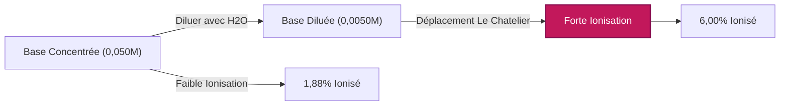

# Guide de Chimie Analytique et de Laboratoire pour le Kb et l'Équilibre des Bases Faibles

En chimie analytique, physique et pharmaceutique, la **constante de dissociation basique** ($K_b$) mesure la force quantitative d'une base faible en solution aqueuse :

$$K_b = \frac{[\text{BH}^+][\text{OH}^-]}{[\text{B}]} \quad \iff \quad \text{p}K_b = -\log_{10}(K_b)$$

$$K_a \times K_b = K_w \quad \iff \quad \text{p}K_a + \text{p}K_b = \text{p}K_w \quad (14,00 \text{ à } 25^\circ\text{C})$$

$$x^2 + K_b x - K_b C = 0 \quad \implies \quad [\text{OH}^-] = \frac{-K_b + \sqrt{K_b^2 + 4 K_b C}}{2}$$

$$\text{Pourcentage d'Ionisation} = \frac{[\text{OH}^-]_{\text{éq}}}{C_{\text{initiale}}} \times 100\% \le 5\% \quad (\text{Règle d'Approximation des 5\%})$$

---

## 1. Matrice de Référence des Constantes de Dissociation des Bases Faibles Courantes

| Base Faible | Formule | $K_b$ ($25^\circ\text{C}$) | $\text{p}K_b$ | $\text{p}K_a$ de l'Acide Conjugué | Pourcentage d'Ionisation ($0,10\,\text{M}$) |
| :--- | :--- | :--- | :--- | :--- | :--- |
| **Éthylamine** | $\text{C}_2\text{H}_5\text{NH}_2$ | **$5,6 \cdot 10^{-4}$** | **$3,25$** | **$10,75$** | $\sim 7,2\%$ |
| **Méthylamine** | $\text{CH}_3\text{NH}_2$ | **$4,4 \cdot 10^{-4}$** | **$3,36$** | **$10,64$** | $\sim 6,4\%$ |
| **Ammoniac** | $\text{NH}_3$ | **$1,8 \cdot 10^{-5}$** | **$4,75$** | **$9,25$** | $\sim 1,3\%$ |
| **Pyridine** | $\text{C}_5\text{H}_5\text{N}$ | **$1,7 \cdot 10^{-9}$** | **$8,77$** | **$5,23$** | $\sim 0,013\%$ |
| **Aniline** | $\text{C}_6\text{H}_5\text{NH}_2$ | **$4,3 \cdot 10^{-10}$** | **$9,37$** | **$4,63$** | $\sim 0,0065\%$ |

---

## 2. Protocoles Standard de Calcul du $K_b$

```
1. Kb à partir du pOH : x = 10^(-pOH), Kb = x^2 / (C - x)
2. Kb à partir du pH : pOH = pKw - pH, x = 10^(-pOH), Kb = x^2 / (C - x)
3. Kb à partir de [OH-] : x = [OH-], Kb = x^2 / (C - x)
4. Kb à partir du Ka conjugué : Kb = Kw / Ka & pKb = pKw - pKa
5. Concentrations à l'équilibre à partir du Kb : Résoudre l'équation quadratique x^2 + Kb*x - Kb*C = 0
```

---

## 3. Avis de Sécurité pour l'Éducation et les Laboratoires
*Ce calculateur de Kb fournit des calculs d'équilibre théoriques pour des applications éducatives, de recherche en laboratoire et de chimie avancée. Pour les solutions concentrées non idéales à forces ioniques élevées, il convient de tenir compte des coefficients d'activité en utilisant les équations de Debye-Hückel ou de Pitzer.*

## 4. Le Guide Complet de la Dissociation des Bases ($K_b$) et des Tableaux d'Avancement

Bienvenue dans le guide de référence sur la constante de dissociation basique ($K_b$). Lors de l'apprentissage des équilibres acido-basiques, une grande partie de l'attention est injustement portée sur les acides. Cependant, comprendre les bases faibles — telles que l'ammoniac, les amines pharmaceutiques et les alcaloïdes biologiques — est sans doute encore plus critique pour la médecine, la conception de médicaments et les systèmes tampons physiologiques.

Lorsqu'une base faible est ajoutée à l'eau, elle ne se décompose pas simplement. Au lieu de cela, elle attaque activement les molécules d'eau, volant un proton pour former un acide conjugué et laissant derrière elle un ion hydroxyde ($\text{OH}^-$). Parce que la base est "faible", elle manque de force thermodynamique pour arracher des protons à *chaque* molécule d'eau, ce qui conduit à un état délicat d'équilibre chimique.

Dans ce manuel technique massif de plus de 4000 mots, nous allons entièrement décoder la thermodynamique de l'équilibre des bases faibles, explorer la relation mathématique inverse exacte entre les paires $K_a$ et $K_b$ conjuguées, établir les limites strictes de la "règle des 5%" et parcourir cinq exemples rigoureux de chimie analytique du monde réel, complets avec des démonstrations algébriques étape par étape et des diagrammes visuels Mermaid.

### 4.1 Qu'est-ce que le $K_b$ (La Constante de Dissociation Basique) ?

Lorsqu'une base générique faible ($\text{B}$) est dissoute dans l'eau, elle réagit selon l'équation réversible suivante :
$$ \text{B (aq)} + \text{H}_2\text{O (l)} \rightleftharpoons \text{BH}^+\text{(aq)} + \text{OH}^-\text{(aq)} $$

Une fois cette réaction parvenue à l'équilibre dynamique (où la vitesse d'arrachement des protons dans le sens direct est égale à la vitesse de restitution des protons dans le sens inverse), nous définissons sa position thermodynamique en utilisant la **Constante de Dissociation Basique ($K_b$)** :

$$ K_b = \frac{[\text{BH}^+][\text{OH}^-]}{[\text{B}]} $$

*(Note : L'eau est un solvant liquide pur et sa concentration est effectivement constante, elle est donc strictement exclue de l'expression d'équilibre.)*

La valeur du $K_b$ nous renseigne immédiatement sur la force de la base :
*   **Grand $K_b$ :** Le numérateur est grand. La base est relativement forte et réussit à produire beaucoup de $\text{OH}^-$.
*   **Petit $K_b$ :** Le dénominateur est grand. La base est très faible et reste en grande partie sous sa forme neutre $\text{B}$.

### 4.2 Conversion entre $K_b$ et $\text{p}K_b$

Tout comme pour le $K_a$, les constantes de dissociation des bases sont souvent des nombres extrêmement petits (par ex. $1,8 \times 10^{-5}$ pour l'ammoniac). Pour simplifier les calculs mathématiques, les chimistes utilisent l'échelle logarithmique $\text{p}K_b$.

$$ \text{p}K_b = -\log_{10}(K_b) \quad \text{et} \quad K_b = 10^{-\text{p}K_b} $$

**La règle d'or de la force des bases :** En raison du logarithme négatif, un **plus petit** $\text{p}K_b$ équivaut à une base faible **plus forte**. Par exemple, la méthylamine ($\text{p}K_b = 3,36$) est plus forte que l'ammoniac ($\text{p}K_b = 4,75$).

### 4.3 La relation $K_a \times K_b = K_w$ (Paires conjuguées)

C'est sans doute la règle thermodynamique la plus importante de toute la chimie acido-basique : **La force d'une base faible est inversement proportionnelle à la force de son acide conjugué.**

Si vous connaissez le $K_a$ d'un acide, vous connaissez instantanément le $K_b$ de sa base conjuguée grâce à la constante d'autoionisation de l'eau ($K_w$) :
$$ K_a \times K_b = K_w = 1,0 \times 10^{-14} \quad (\text{à } 25^\circ\text{C}) $$
$$ \text{p}K_a + \text{p}K_b = \text{p}K_w = 14,00 $$

Si vous avez un acide faible modérément fort, sa base conjuguée sera incroyablement faible. À l'inverse, un acide incroyablement faible aura une base conjuguée relativement forte.

### 4.4 L'Anatomie d'un Tableau d'Avancement pour les Bases Faibles

Un **tableau d'avancement** ou tableau ICE (Initial, Changement, Équilibre) est la méthode standard pour résoudre les problèmes de dissociation des bases faibles.

Commençons avec une concentration initiale ($C$) de la base faible $\text{B}$, et supposons que les concentrations initiales des produits sont nulles. Soit $x$ la molarité inconnue de $\text{B}$ qui réagit avec succès avec l'eau.

| Espèce | $\text{B}$ | $\text{BH}^+$ | $\text{OH}^-$ |
| :--- | :--- | :--- | :--- |
| **I**nitial | $C$ | $0$ | $0$ |
| **C**hangement | $-x$ | $+x$ | $+x$ |
| **É**quilibre | $C - x$ | $x$ | $x$ |

En insérant la ligne "Équilibre" dans notre expression du $K_b$, nous obtenons l'équation principale :
$$ K_b = \frac{x \cdot x}{C - x} = \frac{x^2}{C - x} $$

### 4.5 La Règle des 5% et l'Équation Quadratique

Pour trouver le $\text{pOH}$ final (et donc le pH), nous devons résoudre $x$ (qui est $[\text{OH}^-]$). Cela se réorganise en une équation quadratique :
$$ x^2 + K_b x - K_b C = 0 $$

Pour gagner du temps, les chimistes utilisent souvent **l'approximation des petits x**. Si $K_b$ est très petit, nous supposons que la quantité qui se dissocie ($x$) est insignifiante par rapport à $C$, ce qui signifie que $(C - x) \approx C$. L'équation se simplifie en :
$$ x = \sqrt{K_b \cdot C} $$

**La règle des 5% :** Cette approximation n'est mathématiquement permise que si le $x$ calculé représente moins de 5% de la concentration initiale $C$. Si l'ionisation dépasse 5%, la formule quadratique exacte DOIT être utilisée pour éviter des erreurs inacceptables :
$$ x = \frac{-K_b + \sqrt{K_b^2 - 4(1)(-K_b C)}}{2} $$

Notre calculateur de $K_b$ n'utilise jamais l'approximation des petits x. Il exécute le solveur quadratique exact dans 100% des cas pour garantir une précision absolue.

---

## 5. Guide d'Utilisation : Maîtriser le Calculateur de Kb

Notre outil fonctionne de manière bidirectionnelle : vous pouvez soit entrer un $K_b$ pour prédire le pH résultant, soit entrer des données expérimentales de pH/pOH pour déterminer le $K_b$ d'une base inconnue.

### 5.1 Mode : Calculer le pH à partir d'un $K_b$ connu

1.  **Sélectionner le mode :** Choisissez "Concentrations à l'équilibre à partir du Kb".
2.  **Entrer les paramètres :** Entrez la concentration initiale ($C$) et le $K_b$ (ou $\text{p}K_b$) connu de votre base faible.
3.  **Lire le résultat :** Le calculateur génère le tableau d'avancement complet, exécute le solveur quadratique exact pour $[\text{OH}^-]$, et affiche le $\text{pOH}$ final, le pH à l'équilibre, le $[\text{OH}^-]$ exact, et le pourcentage d'ionisation.

### 5.2 Mode : Découvrir un $K_b$ inconnu à partir de données de pH

1.  **Sélectionner le mode :** Choisissez "Kb à partir du pH".
2.  **Entrer les paramètres :** Entrez la concentration initiale ($C$) de la base, et le pH final que vous avez mesuré.
3.  **Exécuter :** L'outil convertit d'abord votre pH en pOH ($\text{pOH} = 14 - \text{pH}$). Il calcule ensuite l'inverse pour trouver $x$ ($[\text{OH}^-] = 10^{-\text{pOH}}$) et l'insère directement dans la formule $K_b = x^2 / (C - x)$ pour révéler l'identité de la base.

### 5.3 Mode : Pourcentage d'ionisation

1.  **Sélectionner le mode :** Choisissez "Kb à partir du pourcentage d'ionisation".
2.  **Entrer les paramètres :** Entrez la concentration initiale ($C$) et le pourcentage de la base qui s'est ionisée.
3.  **Exécuter :** L'outil calcule $x$ en prenant ce pourcentage de $C$, puis résout l'équation pour le $K_b$.

---

## 6. Cinq Exemples Conceptuels du Monde Réel

Appliquons ces cadres mathématiques à des scénarios de laboratoire réels, accompagnés de décompositions algébriques étape par étape.

### Exemple 1 : Trouver le Kb à partir de données de pH de laboratoire

**Scénario :** 
Un pharmacologue prépare une solution à $0,150\text{ M}$ d'une amine biologique inconnue (une base faible) et mesure le pH avec une sonde étalonnée. Le pH indique 11,20. Quel est le $K_b$ et le $\text{p}K_b$ de cette amine ?

**Démonstration Mathématique :**

1.  **Calculer le pOH à partir du pH :**
    $$ \text{pOH} = 14,00 - \text{pH} = 14,00 - 11,20 = 2,80 $$
2.  **Calculer $x$ ($[\text{OH}^-]$) à partir du pOH :**
    $$ [\text{OH}^-] = 10^{-\text{pOH}} $$
    $$ x = 10^{-2,80} = 1,58 \times 10^{-3}\text{ M} $$
3.  **Établir les variables du tableau ICE :**
    $[\text{OH}^-] = x = 1,58 \times 10^{-3}\text{ M}$
    $[\text{BH}^+] = x = 1,58 \times 10^{-3}\text{ M}$
    $[\text{B}] = C - x = 0,150 - (1,58 \times 10^{-3}) = 0,1484\text{ M}$
4.  **Calculer le $K_b$ :**
    $$ K_b = \frac{x^2}{C - x} $$
    $$ K_b = \frac{(1,58 \times 10^{-3})^2}{0,1484} $$
    $$ K_b = \frac{2,51 \times 10^{-6}}{0,1484} = 1,69 \times 10^{-5} $$
5.  **Calculer le $\text{p}K_b$ :**
    $$ \text{p}K_b = -\log_{10}(1,69 \times 10^{-5}) = 4,77 $$

**Conclusion :** L'amine inconnue a un $K_b$ de $1,69 \times 10^{-5}$, ce qui signifie qu'il s'agit probablement de l'ammoniac ($\text{NH}_3$).

### Exemple 2 : Le pH quadratique exact de l'ammoniac

**Scénario :**
Calculez le pH exact d'une solution à $0,050\text{ M}$ d'ammoniac ($\text{NH}_3$). Le $K_b$ est de $1,80 \times 10^{-5}$.

**Démonstration Mathématique :**

1.  **Configurer l'équation quadratique :**
    $$ x^2 + K_b x - K_b C = 0 $$
    $$ x^2 + (1,80 \times 10^{-5})x - (1,80 \times 10^{-5})(0,050) = 0 $$
    $$ x^2 + 1,80 \times 10^{-5}x - 9,00 \times 10^{-7} = 0 $$
2.  **Résoudre avec la formule quadratique :**
    $$ x = \frac{-1,80 \times 10^{-5} + \sqrt{(1,80 \times 10^{-5})^2 - 4(1)(-9,00 \times 10^{-7})}}{2} $$
    $$ x = 9,39 \times 10^{-4}\text{ M } [\text{OH}^-] $$
3.  **Calculer le pOH et le pH :**
    $$ \text{pOH} = -\log_{10}(9,39 \times 10^{-4}) = 3,03 $$
    $$ \text{pH} = 14,00 - 3,03 = 10,97 $$

**Conclusion :** Le pH de la solution d'ammoniac à $0,050\text{ M}$ est très exactement de 10,97.

### Exemple 3 : Pourcentage d'ionisation et dilution des bases

**Scénario :**
En utilisant l'ammoniac à $0,050\text{ M}$ de l'Exemple 2 ($[\text{OH}^-] = 9,39 \times 10^{-4}\text{ M}$). Calculons son pourcentage d'ionisation. Ensuite, selon la loi de dilution d'Ostwald, si nous diluons la base en ajoutant de l'eau pure, le pourcentage d'ionisation devrait *augmenter*.

**Démonstration Mathématique :**

1.  **Calculer le % d'ionisation initial (à $0,050\text{ M}$) :**
    $$ \% \text{ Ionisé} = \left(\frac{9,39 \times 10^{-4}}{0,050}\right) \times 100 = 1,88\% $$
2.  **Diluer par 10x (Nouveau $C = 0,0050\text{ M}$) :**
    En utilisant l'approx. des petits x pour faire vite : $x \approx \sqrt{K_b \cdot C} = \sqrt{(1,8 \times 10^{-5})(0,0050)} = 3,00 \times 10^{-4}\text{ M}$
3.  **Calculer le nouveau % d'ionisation (à $0,0050\text{ M}$) :**
    $$ \% \text{ Ionisé} = \left(\frac{3,00 \times 10^{-4}}{0,0050}\right) \times 100 = 6,00\% $$

**Conclusion :** En diluant la base de 10 fois, le pourcentage d'ionisation a bondi de 1,88% à plus de 6,00%. Tout comme pour les acides, la dilution d'une base faible force l'équilibre à se déplacer vers la droite pour produire davantage de particules dissociées.

**Visualisation : Loi de Dilution d'Ostwald pour les Bases**



*Cet organigramme visualise la loi de dilution d'Ostwald pour les bases : à mesure que la concentration diminue, l'équilibre thermodynamique se déplace vers la droite, augmentant considérablement le pourcentage de molécules qui réagissent avec l'eau.*

### Exemple 4 : La balance conjuguée $K_a \times K_b$

**Scénario :**
Vous devez trouver le $K_b$ de la base pyridine ($\text{C}_5\text{H}_5\text{N}$). Vous consultez un manuel, mais le tableau ne liste que le $K_a$ de son acide conjugué, l'ion pyridinium ($\text{C}_5\text{H}_5\text{NH}^+$), qui est $K_a = 5,9 \times 10^{-6}$.

**Démonstration Mathématique :**

1.  **Utiliser la formule d'autoionisation des conjugués :**
    $$ K_a \times K_b = K_w $$
2.  **Résoudre pour $K_b$ :**
    $$ K_b = \frac{K_w}{K_a} $$
    $$ K_b = \frac{1,0 \times 10^{-14}}{5,9 \times 10^{-6}} = 1,7 \times 10^{-9} $$
3.  **Résoudre pour $\text{p}K_b$ :**
    $$ \text{p}K_b = -\log_{10}(1,7 \times 10^{-9}) = 8,77 $$

**Conclusion :** Le $K_b$ de la pyridine est de $1,7 \times 10^{-9}$. Puisque l'ion pyridinium est un acide modérément faible, sa base conjuguée, la pyridine, est une base incroyablement faible.

### Exemple 5 : Quand la règle des 5% échoue de manière catastrophique pour les bases

**Scénario :**
Calculez le $[\text{OH}^-]$ d'une solution très diluée à $0,0010\text{ M}$ d'éthylamine, une base faible relativement forte avec un $K_b$ de $5,6 \times 10^{-4}$. Comparez l'approximation des petits x avec la méthode quadratique exacte.

**Démonstration Mathématique (Approximation des petits x) :**

1.  **Supposer que $C - x \approx C$ :**
    $$ x = \sqrt{K_b \cdot C} $$
    $$ x = \sqrt{(5,6 \times 10^{-4})(0,0010)} $$
    $$ x = \sqrt{5,6 \times 10^{-7}} = 7,48 \times 10^{-4}\text{ M OH}^- $$
2.  **Vérifier la règle des 5% :**
    $$ \% \text{ Ionisé} = \left(\frac{7,48 \times 10^{-4}}{0,0010}\right) \times 100 = 74,8\% $$
    La règle est violemment violée (75% $\gg$ 5%). L'approximation est totalement invalide.

**Démonstration Mathématique (Quadratique Exacte) :**

1.  **Utiliser l'équation quadratique complète :**
    $$ x^2 + (5,6 \times 10^{-4})x - 5,6 \times 10^{-7} = 0 $$
2.  **Résoudre avec la formule quadratique :**
    $$ x = 5,17 \times 10^{-4}\text{ M OH}^- $$

**Conclusion :** L'approximation avait estimé $7,48 \times 10^{-4}\text{ M}$, alors que la véritable réponse exacte est de $5,17 \times 10^{-4}\text{ M}$. L'approximation a causé une énorme **erreur analytique de 45%** dans la concentration en hydroxyde.

**Visualisation : La Relation Inverse des Conjugués**

```mermaid
gantt
    title Dominance de Force Acide-Base Conjuguée
    dateFormat  HH:mm:ss
    axisFormat  %H:%M
    section HCl / Cl-
    Acide Fort Ka >> 1 :crit, 00:00:00, 00:05:00
    Base Inutile Kb ~ 0 :00:00:00, 00:05:00
    section NH4+ / NH3
    Acide Faible Ka (5e-10) :00:05:00, 00:10:00
    Base Faible Kb (2e-5) :active, 00:05:00, 00:10:00
```



*Ce diagramme de Gantt cartographie la relation inverse de $K_a$ et $K_b$. Lorsque l'acide est incroyablement fort (comme $\text{HCl}$), la base conjuguée ($\text{Cl}^-$) est si faible qu'elle n'a pratiquement aucune basicité. Lorsque l'acide est faible (comme $\text{NH}_4^+$), la base conjuguée ($\text{NH}_3$) gagne une force thermodynamique fonctionnelle.*

---

## 7. FAQ Approfondie et Dépannage Avancé

**Q : Dois-je inclure l'eau dans l'expression du $K_b$ ?**
**R :** Non. Dans les solutions aqueuses diluées, la concentration de l'eau est incroyablement élevée ($\sim 55,5\text{ M}$) et reste effectivement constante pendant la réaction. Elle est mathématiquement intégrée dans la constante $K_b$ elle-même, c'est pourquoi nous n'écrivons jamais $[\text{H}_2\text{O}]$ au dénominateur.

**Q : Une base faible peut-elle avoir un pH inférieur à 7 ?**
**R :** Non, pas si c'est la seule chose dissoute dans l'eau. Si vous dissolvez une base faible pure dans de l'eau pure, elle produira des $\text{OH}^-$ et fera monter le pH au-dessus de 7,00. Cependant, si la base est ajoutée à un tampon acide, la solution résultante peut avoir un pH inférieur à 7.

**Q : Le $K_b$ change-t-il si j'ajoute plus de base ?**
**R :** Non. Le $K_b$ est une constante thermodynamique stricte. Il ne change pas avec la concentration ou le volume. Tout comme pour le $K_a$, la seule chose qui peut modifier la valeur physique du $K_b$ est un changement de la **Température** de la solution.

En comprenant profondément les mécanismes thermodynamiques derrière les tableaux d'avancement, les relations entre paires conjuguées ($K_w = K_a \times K_b$) et les démonstrations quadratiques exactes, vous possédez le pouvoir théorique de prédire le pH et la spéciation de n'importe quelle base faible existante. Fiez-vous toujours à ce calculateur de $K_b$ pour contourner les dangereuses approximations des "petits x" et garantir la perfection analytique !
