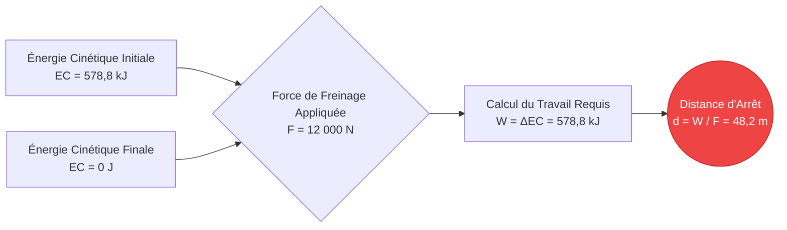
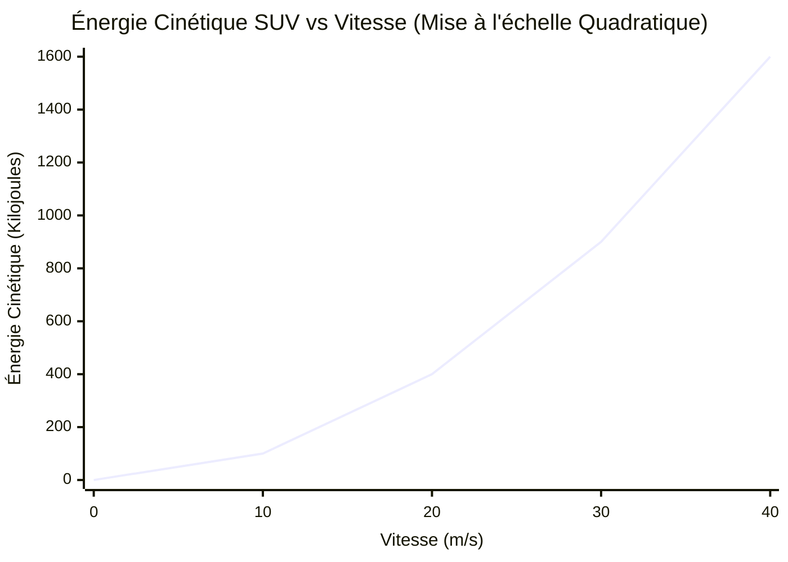
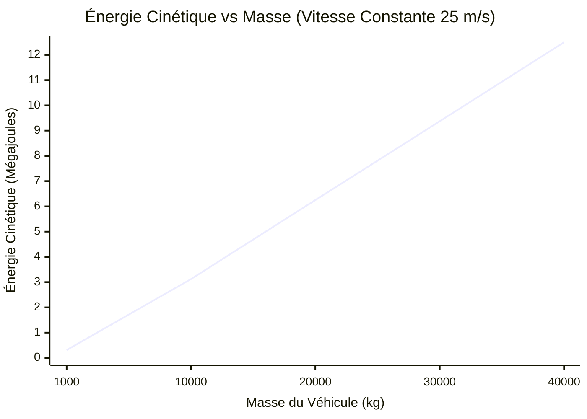
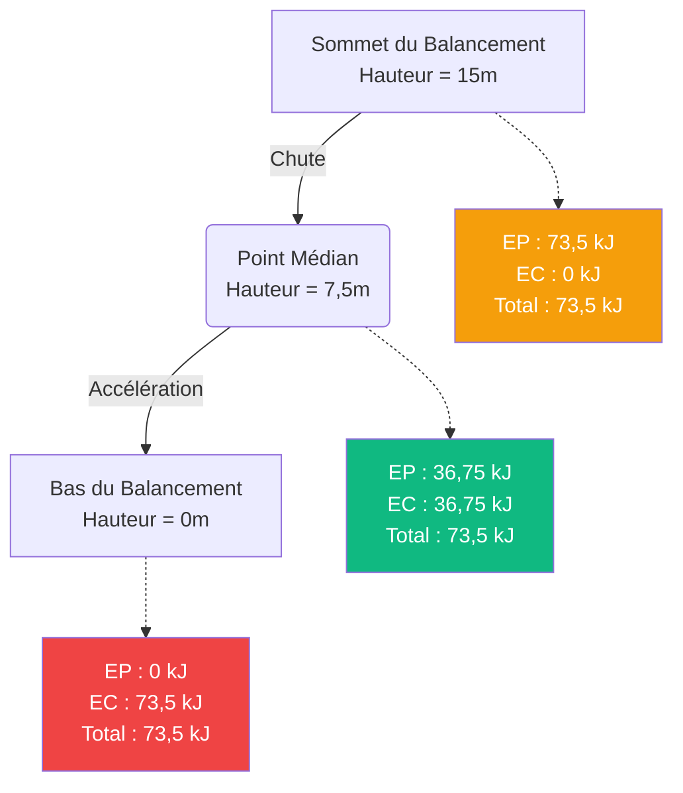
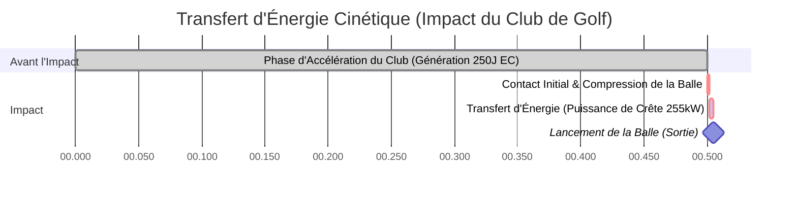

# Le Calculateur d'Énergie Cinétique Ultime : Maîtriser la Physique du Mouvement et de l'Impact

Bienvenue dans le **Calculateur d'Énergie Cinétique** définitif et le guide de physique complet. Que vous soyez un ingénieur automobile concevant des systèmes de freinage avancés pour dissiper l'énergie d'un accident, un planétologue modélisant les cratères d'impact d'astéroïdes, ou un étudiant en physique préparant un examen final sur le théorème de l'énergie cinétique, cet outil est conçu pour une précision absolue.

L'énergie cinétique est l'énergie fondamentale du mouvement. C'est la raison pour laquelle un glacier se déplaçant lentement peut creuser des vallées massives au fil des millénaires, et c'est la raison pour laquelle une minuscule balle peut percer un blindage en une fraction de milliseconde. 

Dans cette plongée massive de plus de 4 000 mots, nous allons déconstruire de manière exhaustive la mécanique de l'énergie cinétique ($EC = \frac{1}{2} m \cdot v^2$). Nous explorerons les fondements mathématiques du théorème de l'énergie cinétique, analyserons les différences critiques entre la quantité de mouvement linéaire et l'énergie cinétique quadratique, et vous guiderons à travers cinq exemples d'ingénierie du monde réel visualisés avec des diagrammes Mermaid.js détaillés.

---

## 1. La Physique de l'Énergie Cinétique : L'Énergie en Mouvement

En physique classique, **l'Énergie** est définie simplement comme la capacité à fournir un travail. Un travail est effectué lorsqu'une force est appliquée à un objet, provoquant son déplacement sur une distance.

**L'Énergie Cinétique** (du mot grec *kinesis*, signifiant mouvement) est le type spécifique d'énergie qu'un objet possède purement parce qu'il se déplace. Si un objet a une masse et se déplace par rapport au référentiel d'un observateur, il possède de l'énergie cinétique.

### La Formule Fondamentale ($EC = \frac{1}{2} m \cdot v^2$)
L'énergie cinétique de translation ($EC$) de tout objet est calculée en utilisant la moitié de sa masse ($m$) multipliée par le carré de sa vitesse ($v$).

$$ EC = \frac{1}{2} m \cdot v^2 $$

Où :
- **$EC$** = Énergie Cinétique (mesurée en Joules, $J$)
- **$m$** = Masse (mesurée en kilogrammes, $kg$)
- **$v$** = Vitesse (mesurée en mètres par seconde, $m/s$)

### La Nature Quadratique de la Vitesse
L'aspect le plus critique de cette équation — et le concept qui cause le plus de confusion tant chez les étudiants en physique que chez les conducteurs — est que l'énergie cinétique est **quadratique** par rapport à la vitesse, et non linéaire.

- Si vous doublez la masse d'une voiture en mouvement, vous doublez son énergie cinétique ($2 \times 1 = 2$).
- Si vous doublez la **vitesse** d'une voiture en mouvement, vous **quadruplez** son énergie cinétique ($2^2 = 4$).
- Si vous triplez la vitesse, l'énergie cinétique augmente d'un facteur de neuf ($3^2 = 9$).

Cette mise à l'échelle exponentielle explique pourquoi les accidents de voiture à grande vitesse sont exponentiellement plus dévastateurs que les accidents à basse vitesse, et pourquoi les amendes pour excès de vitesse augmentent de manière si agressive.

### Grandeurs Scalaires vs. Vectorielles
Contrairement à la Force ($F = ma$) et à la Quantité de Mouvement ($p = mv$), qui sont des **vecteurs** (c'est-à-dire qu'elles ont une direction spécifique comme "Nord" ou "Haut"), l'Énergie Cinétique est une grandeur **scalaire**. 

Une grandeur scalaire n'a qu'une amplitude. Une voiture de $1\ 500\text{ kg}$ se déplaçant vers l'Est à $30\text{ m/s}$ a exactement la même énergie cinétique qu'une voiture identique se déplaçant vers l'Ouest à $30\text{ m/s}$. De plus, parce que la vitesse est au carré ($v^2$), même si vous entrez une vitesse négative dans l'équation, l'énergie cinétique résultante sera toujours positive. L'énergie cinétique ne peut pas être négative ; un objet soit en possède ($v > 0$), soit n'en possède pas ($v = 0$).

---

## 2. Le Théorème de l'Énergie Cinétique

Pour donner de l'énergie cinétique à un objet, vous devez l'accélérer. Pour l'accélérer, vous devez appliquer une force sur une distance. Ce processus s'appelle effectuer un **Travail** ($W = F \cdot d$).

Le **Théorème de l'Énergie Cinétique** relie élégamment les lois du mouvement de Newton aux lois de la thermodynamique. Il stipule :
> *Le travail net effectué sur un objet par une force nette externe est égal à la variation de l'énergie cinétique de l'objet.*

$$ W_{net} = \Delta EC = EC_{final} - EC_{initial} $$

Si vous poussez un caddie immobile avec $50\text{ N}$ de force sur une distance de $10\text{ mètres}$, vous avez effectué $500\text{ Joules}$ de travail sur le caddie. En supposant qu'il n'y a pas de frottement, le caddie possède maintenant exactement $500\text{ Joules}$ d'énergie cinétique. 

Inversement, pour arrêter un objet en mouvement, un travail négatif doit être effectué (comme le frottement des plaquettes de frein). Les freins doivent effectuer exactement assez de travail négatif pour annuler l'énergie cinétique initiale de la voiture.

---

## 3. Conservation de l'Énergie Mécanique

L'énergie cinétique représente la moitié de l'équation de l'**Énergie Mécanique**. L'autre moitié est l'**Énergie Potentielle** ($EP$), qui est une énergie stockée basée sur la position d'un objet (comme un rocher au bord d'une falaise).

La **Loi de la Conservation de l'Énergie Mécanique** dicte que dans un système isolé (en ignorant les frottements, la résistance de l'air et la perte de chaleur), l'énergie mécanique totale reste parfaitement constante. L'énergie se transforme simplement d'un état potentiel à un état cinétique et vice versa.

$$ EC_{initial} + EP_{initial} = EC_{final} + EP_{final} $$

### L'Analogie des Montagnes Russes
Imaginez un wagon de montagnes russes assis tout en haut d'une descente massive.
1. **Au sommet :** Le wagon bouge à peine. L'énergie cinétique est presque nulle, mais l'énergie potentielle gravitationnelle ($EP = mgh$) est à son maximum absolu.
2. **À mi-chemin :** Au fur et à mesure que le wagon tombe, il perd de la hauteur (perdant de l'$EP$) mais gagne de la vitesse (gagnant de l'$EC$). L'énergie totale reste exactement la même.
3. **En bas :** Le wagon est au niveau du sol ($h = 0$, donc $EP = 0$). Toute l'énergie potentielle stockée a été convertie en Énergie Cinétique maximale, entraînant une vitesse maximale.

---

## 4. Guide d'Utilisation Complet : Maximiser le Calculateur

Notre Calculateur d'Énergie Cinétique interactif est conçu pour gérer des calculs simples de masse/vitesse ainsi que des problèmes de physique complexes d'ingénierie inverse.

### Étape 1 : Calculs de Base
Dans l'interface principale, sélectionnez ce que vous souhaitez résoudre :
- **Résoudre l'Énergie Cinétique (EC) :** Entrez la masse et la vitesse connues.
- **Résoudre la Masse (m) :** Entrez l'énergie cinétique et la vitesse connues pour déterminer le poids que doit avoir un objet.
- **Résoudre la Vitesse (v) :** Entrez l'énergie cinétique et la masse connues pour déterminer à quelle vitesse un objet se déplace.

### Étape 2 : Conversions d'Unités Intelligentes
Le calculateur dispose d'un moteur de conversion robuste. 
- Entrez la masse en **Grammes**, **Livres**, **Onces** ou **Tonnes Métriques**.
- Entrez la vitesse en **mph**, **km/h**, **nœuds** ou **Mach**.
- Affichez la sortie d'énergie en **Joules (J)**, **Kilojoules (kJ)**, **Mégajoules (MJ)** standard ou équivalents électriques comme les **Wattheures (Wh)** et **Kilowattheures (kWh)**.

### Étape 3 : Interpréter l'Arc d'Énergie Logarithmique
L'énergie évolue de manière drastique. Une pomme qui tombe possède environ $1\text{ J}$ d'énergie cinétique. Un avion de ligne commercial en vol possède plus de $5\ 000\ 000\ 000\text{ J}$. 
La **Jauge d'Énergie à Arc** radiale catégorise votre résultat logarithmiquement :
- **Micro-Échelle (Vert) :** Balles de baseball, sprinters, objets qui tombent.
- **Macro-Échelle (Bleu) :** Voitures sur autoroute, machines industrielles, trains.
- **Méga-Échelle (Rouge) :** Avions à réaction, fusées orbitales, impacts de météorites.

---

## 5. Cinq Exemples d'Ingénierie Conceptuelle avec Visualisations 2D

Pour vraiment comprendre comment l'énergie cinétique impacte le monde physique, explorons cinq scénarios d'ingénierie détaillés, en utilisant Mermaid.js pour visualiser la physique.

### Exemple 1 : La Crise de Freinage sur Autoroute (Théorème de l'Énergie Cinétique)

**Le Scénario :**
Une berline de $1\ 500\text{ kg}$ roule sur l'autoroute à $100\text{ km/h}$ ($27,78\text{ m/s}$). Un cerf saute sur la route, et le conducteur freine brusquement. Le système de freinage de la voiture et le frottement des pneus peuvent appliquer une force d'arrêt maximale de $12\ 000\text{ N}$. Quelle est la distance minimale absolue nécessaire pour que la voiture s'arrête ?

**Les Mathématiques :**
Tout d'abord, calculez l'énergie cinétique initiale de la voiture :
$$ EC = 0,5 \cdot m \cdot v^2 = 0,5 \cdot 1\ 500 \cdot (27,78)^2 $$
$$ EC = 750 \cdot 771,73 = 578\ 797\text{ Joules (578,8 kJ)} $$

Pour arrêter la voiture, les freins doivent effectuer $578\ 797\text{ J}$ de travail. En utilisant l'équation du Travail ($W = F \cdot d$) :
$$ d = \frac{W}{F} = \frac{578\ 797}{12\ 000} = 48,23\text{ mètres} $$

La voiture nécessite un peu plus de 48 mètres pour déraper jusqu'à l'arrêt.

**Visualisation 2D :**
L'arbre logique ci-dessous illustre le théorème de l'énergie cinétique en action.

---

### Exemple 2 : Énergie Cinétique vs Vitesse (La Courbe Quadratique)

**Le Scénario :**
Un débat s'élève concernant les limites de vitesse. Un conducteur fait valoir que conduire à $80\text{ mph}$ au lieu de $40\text{ mph}$ n'est que "deux fois plus dangereux" car ils ne vont que deux fois plus vite. En utilisant un SUV standard de $2\ 000\text{ kg}$, nous devons calculer l'énergie cinétique destructrice à différentes vitesses pour prouver qu'il a tort.

**Les Mathématiques :**
- À $20\text{ m/s}$ (~45 mph) : $EC = 0,5 \cdot 2\ 000 \cdot (20)^2 = 400\ 000\text{ J (400 kJ)}$
- À $30\text{ m/s}$ (~67 mph) : $EC = 0,5 \cdot 2\ 000 \cdot (30)^2 = 900\ 000\text{ J (900 kJ)}$
- À $40\text{ m/s}$ (~90 mph) : $EC = 0,5 \cdot 2\ 000 \cdot (40)^2 = 1\ 600\ 000\text{ J (1,6 MJ)}$

**Visualisation 2D :**
Ce graphique illustre de manière spectaculaire la réalité terrifiante de la variable $v^2$. Doubler la vitesse de $20\text{ m/s}$ à $40\text{ m/s}$ n'a pas doublé l'énergie de l'impact ; cela l'a quadruplée, passant de $400\text{ kJ}$ à $1\ 600\text{ kJ}$.

---

### Exemple 3 : Énergie Cinétique vs Masse (Mise à l'échelle Linéaire)

**Le Scénario :**
Comparons maintenant deux véhicules différents se déplaçant exactement à la même vitesse de $25\text{ m/s}$ (55 mph) sur une autoroute rurale. Le véhicule A est une voiture de sport légère de $1\ 000\text{ kg}$. Le véhicule B est un semi-remorque chargé massif de $35\ 000\text{ kg}$. Quelle est la quantité d'énergie cinétique qu'ils possèdent ?

**Les Mathématiques :**
- Voiture de sport : $EC = 0,5 \cdot 1\ 000 \cdot (25)^2 = 312\ 500\text{ J (312,5 kJ)}$
- Semi-remorque : $EC = 0,5 \cdot 35\ 000 \cdot (25)^2 = 10\ 937\ 500\text{ J (10,94 MJ)}$

Parce que le camion est 35 fois plus lourd, il possède exactement 35 fois plus d'énergie cinétique.

**Visualisation 2D :**
Contrairement à la vitesse, la masse évolue de manière linéaire. Ce graphique montre la relation linéaire entre la masse et l'énergie lorsque la vitesse est constante.

---

### Exemple 4 : Conservation de l'Énergie Mécanique (Le Pendule)

**Le Scénario :**
Une énorme boule de démolition de $500\text{ kg}$ est hissée par une grue à une hauteur de $15\text{ mètres}$ au-dessus de son point de repos le plus bas. La grue lâche la boule. Quelle est la vitesse maximale absolue de la boule de démolition au bas exact de son balancement ?

**Les Mathématiques :**
En haut du balancement, Vitesse = 0, ce qui signifie $EC = 0$. Toute l'énergie est stockée sous forme d'Énergie Potentielle Gravitationnelle ($EP = m \cdot g \cdot h$).
$$ EP_{haut} = 500 \cdot 9,81 \cdot 15 = 73\ 575\text{ Joules} $$

En raison de la Loi de la Conservation de l'Énergie Mécanique, au bas du balancement ($h = 0$), la totalité des $73\ 575\text{ J}$ d'énergie potentielle a été parfaitement convertie en Énergie Cinétique.
$$ EC_{bas} = 73\ 575\text{ Joules} $$

Maintenant, faisons de l'ingénierie inverse pour trouver la vitesse à partir de l'équation de l'$EC$ :
$$ v = \sqrt{\frac{2 \cdot EC}{m}} $$
$$ v = \sqrt{\frac{2 \cdot 73\ 575}{500}} = \sqrt{\frac{147\ 150}{500}} = \sqrt{294,3} = 17,15\text{ m/s} $$

La boule de démolition frappe la cible à $17,15\text{ m/s}$ (~38 mph).

**Visualisation 2D :**
Ce diagramme de flux démontre comment l'énergie mécanique totale reste constante tout en se transférant en douceur entre les états.

---

### Exemple 5 : Biomécanique du Swing de Golf (Temps de Transfert Cinétique)

**Le Scénario :**
Un golfeur professionnel balance une tête de driver de $0,2\text{ kg}$ à $50\text{ m/s}$ (111 mph). Le golfeur frappe une balle de golf immobile de $0,045\text{ kg}$. Nous devons analyser l'immense puissance de sortie générée pendant la durée microscopique de l'impact.

**Les Mathématiques :**
Tout d'abord, quelle est l'énergie cinétique de la tête de club juste avant l'impact ?
$$ EC_{club} = 0,5 \cdot 0,2 \cdot (50)^2 = 250\text{ Joules} $$

Dans une collision hautement efficace (bien que légèrement inélastique), un grand pourcentage de cette énergie est transféré à la balle. Si la tête de club ralentit à $35\text{ m/s}$ après l'impact :
$$ EC_{club\_après} = 0,5 \cdot 0,2 \cdot (35)^2 = 122,5\text{ Joules} $$

La différence ($250 - 122,5 = 127,5\text{ Joules}$) est transférée. Cependant, ce transfert d'énergie massif se produit sur une durée d'environ $0,0005\text{ secondes}$ (une demi-milliseconde). 
La puissance est définie comme le taux de transfert d'énergie ($P = \frac{Énergie}{Temps}$) :
$$ Puissance = \frac{127,5\text{ J}}{0,0005\text{ s}} = 255\ 000\text{ Watts (255 kW)} $$

Pendant cette demi-milliseconde, le club génère une puissance de crête plus élevée qu'un moteur de voiture de sport de haute performance !

**Visualisation 2D :**
Ce diagramme de Gantt visualise la chronologie microscopique du transfert d'énergie pendant le swing de golf.

---

## 6. Foire Aux Questions (FAQ) Détaillée

**Q : L'énergie cinétique peut-elle être négative ?**
**R :** Non, l'énergie cinétique est strictement positive. Parce que la masse ne peut pas être négative et que le terme de vitesse est mathématiquement au carré ($v^2$), même une vitesse négative (déplacement vers l'arrière) donne une énergie cinétique positive. 

**Q : Quelle est la différence entre l'Énergie Cinétique et la Quantité de Mouvement ?**
**R :** C'est le point de confusion le plus courant en physique. Les deux dépendent de la masse et de la vitesse. La **Quantité de Mouvement** ($p = m \cdot v$) est un *vecteur* et évolue *linéairement* avec la vitesse. Elle détermine à quel point un objet est difficile à arrêter. L'**Énergie Cinétique** ($EC = 0,5 \cdot m \cdot v^2$) est un *scalaire* et évolue *quadratiquement* avec la vitesse. Elle détermine la quantité de travail destructeur qu'un objet fera lorsqu'il touchera une cible.

**Q : L'énergie cinétique dépend-elle de votre référentiel ?**
**R :** Oui, absolument. Si vous êtes assis dans un train à grande vitesse se déplaçant à $300\text{ km/h}$, votre vitesse par rapport au train est nulle, donc votre énergie cinétique par rapport au train est nulle. Cependant, par rapport à une personne debout à l'extérieur sur le sol, vous vous déplacez à $300\text{ km/h}$ et possédez d'énormes quantités d'énergie cinétique. 

**Q : Qu'est-ce que l'Énergie Thermique par rapport à l'Énergie Cinétique ?**
**R :** L'énergie thermique (chaleur) est en fait simplement de l'énergie cinétique microscopique. Lorsque vous mesurez la température d'une tasse d'eau, vous mesurez l'énergie cinétique de translation moyenne des molécules d'eau individuelles qui vibrent et rebondissent à l'intérieur de la tasse. 

**Q : Qu'arrive-t-il à l'énergie cinétique dans un accident de voiture ?**
**R :** Selon la première loi de la thermodynamique, l'énergie ne peut être ni créée ni détruite. Dans un accident de voiture, l'énergie cinétique massive du véhicule ne disparaît pas ; elle est rapidement convertie en d'autres formes d'énergie. Elle se transforme en travail mécanique pour plier l'acier (déformation), en énergie thermique (le métal devient en fait extrêmement chaud) et en énergie acoustique (le grand bang de l'accident).

---

## 7. Conclusion et Défi d'Ingénierie

Les principes de l'énergie cinétique dictent les règles du mouvement dans notre univers. En comprenant la relation quadratique entre la vitesse et l'énergie, les ingénieurs peuvent construire des voitures plus sûres, les astrophysiciens peuvent prédire la taille des cratères de météorites, et les techniciens en énergies renouvelables peuvent maximiser l'efficacité des éoliennes.

Pour maîtriser véritablement ces concepts, utilisez notre Calculateur d'Énergie Cinétique pour résoudre les défis de physique conceptuelle suivants :
1. **Le Canon Électromagnétique (Railgun) :** Un canon électromagnétique militaire expérimental tire un projectile en tungstène de $10\text{ kg}$ à Mach 7 ($2\ 400\text{ m/s}$). Calculez l'énergie cinétique en Mégajoules. Est-ce plus ou moins d'énergie qu'un camion de $2\ 000\text{ kg}$ roulant à $100\text{ km/h}$ ?
2. **La Menace d'un Astéroïde :** Un astéroïde d'une masse de $1\ 000\ 000\text{ kg}$ se précipite vers la Terre à $15\ 000\text{ m/s}$. Pour le dévier, les scientifiques veulent le frapper avec un impacteur cinétique. S'ils ne peuvent construire qu'un satellite de $500\text{ kg}$, à quelle vitesse le satellite doit-il frapper l'astéroïde pour délivrer $1,0\times10^{11}\text{ Joules}$ d'énergie cinétique de contre-mesure ?
3. **Les Montagnes Russes :** Des montagnes russes de $1\ 200\text{ kg}$ atteignent le sommet d'une colline de $50\text{ mètres}$ de haut à une vitesse lente de $2\text{ m/s}$. En utilisant la loi de conservation de l'énergie mécanique, calculez sa vitesse maximale exacte lorsqu'elle atteint le bas de la descente ($h = 0$).

Expérimentez avec le simulateur, analysez les graphiques quadratiques et fiez-vous à ce calculateur pour éclairer les énergies massives qui régissent le monde physique qui vous entoure.
