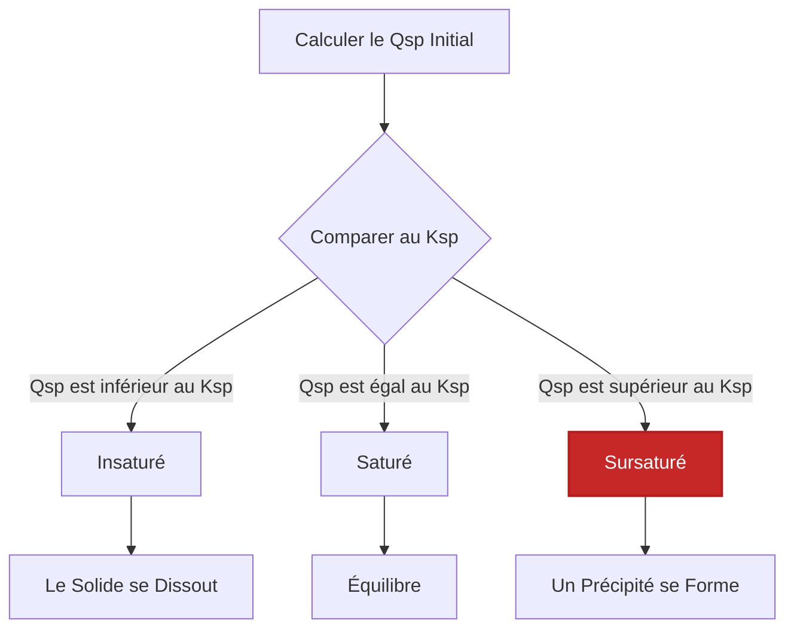

# Guide de Chimie Analytique et de Laboratoire sur le Kps et l'Équilibre de Solubilité

En chimie analytique, environnementale et pharmaceutique, la **constante de produit de solubilité** ($K_{sp}$) mesure la position d'équilibre d'un composé ionique peu soluble dans l'eau :

$$\text{M}_m\text{X}_n(s) \rightleftharpoons m\text{M}^{n+}(aq) + n\text{X}^{m-}(aq) \quad \implies \quad K_{sp} = [\text{M}^{n+}]^m [\text{X}^{m-}]^n$$

$$\text{Solubilité Molaire } s \implies \begin{cases} \text{Sel 1:1 (AgCl) : } & K_{sp} = s^2 \implies s = \sqrt{K_{sp}} \\ \text{Sel 1:2 / 2:1 (CaF}_2, \text{Ag}_2\text{CrO}_4) : & K_{sp} = (s)(2s)^2 = 4s^3 \implies s = \sqrt[3]{\frac{K_{sp}}{4}} \\ \text{Sel 1:3 (Al(OH)}_3) : & K_{sp} = (s)(3s)^3 = 27s^4 \implies s = \sqrt[4]{\frac{K_{sp}}{27}} \end{cases}$$

$$Q_{sp} = [\text{M}^{n+}]_{\text{init}}^m [\text{X}^{m-}]_{\text{init}}^n \quad \begin{cases} Q_{sp} < K_{sp} & \implies \text{Insaturé (Pas de Précipité)} \\ Q_{sp} = K_{sp} & \implies \text{Saturé (Équilibre)} \\ Q_{sp} > K_{sp} & \implies \text{Sursaturé (Précipite)} \end{cases}$$

$$\text{Solubilité Massique } (\text{g/L}) = s \, (\text{mol/L}) \times M \, (\text{g/mol})$$

---

## 1. Matrice de Référence des Sels Peu Solubles Courants

| Composé | Formule | Stœchiométrie | $K_{sp}$ ($25^\circ\text{C}$) | Solubilité Molaire $s$ ($\text{M}$) | Solubilité Massique ($\text{g/L}$) |
| :--- | :--- | :--- | :--- | :--- | :--- |
| **Chlorure d'Argent** | $\text{AgCl}$ | **1:1** | **$1.77 \cdot 10^{-10}$** | **$1.33 \cdot 10^{-5}$** | **$0.00191$** |
| **Sulfate de Baryum** | $\text{BaSO}_4$ | **1:1** | **$1.08 \cdot 10^{-10}$** | **$1.04 \cdot 10^{-5}$** | **$0.00243$** |
| **Fluorure de Calcium** | $\text{CaF}_2$ | **1:2** | **$3.45 \cdot 10^{-11}$** | **$2.05 \cdot 10^{-4}$** | **$0.0160$** |
| **Iodure de Plomb(II)** | $\text{PbI}_2$ | **1:2** | **$9.8 \cdot 10^{-9}$** | **$1.35 \cdot 10^{-3}$** | **$0.622$** |
| **Chromate d'Argent** | $\text{Ag}_2\text{CrO}_4$ | **2:1** | **$1.12 \cdot 10^{-12}$** | **$6.54 \cdot 10^{-5}$** | **$0.0217$** |
| **Hydroxyde d'Aluminium**| $\text{Al(OH)}_3$ | **1:3** | **$1.3 \cdot 10^{-33}$** | **$2.63 \cdot 10^{-9}$** | **$2.05 \cdot 10^{-7}$** |

---

## 2. Protocoles Standards de Calcul de $K_{sp}$

```
1. Sol à partir du Kps (1:1) : s = sqrt(Kps)
2. Sol à partir du Kps (1:2 / 2:1) : s = (Kps / 4)^(1/3)
3. Sol à partir du Kps (1:3) : s = (Kps / 27)^(1/4)
4. Solubilité Massique : SolMassique (g/L) = s (mol/L) * MasseMolaire (g/mol)
5. Comparaison Qps : Comparer Qps au Kps (Qps > Kps -> Précipité)
```

---

## 3. Avertissement Éducatif et de Sécurité en Laboratoire
*Ce calculateur de Kps fournit des calculs d'équilibre théoriques pour des applications éducatives, de recherche en laboratoire et de chimie AP. Les solutions concentrées ou les solutions ioniques avec des électrolytes de fond élevés doivent tenir compte des coefficients d'activité à l'aide des équations de Debye-Hückel ou de Pitzer.*

## 4. Le Guide Complet de la Constante de Produit de Solubilité ($K_{sp}$)

Bienvenue dans le guide définitif sur la **Constante de Produit de Solubilité ($K_{sp}$)**. Une idée fausse courante dans les cours d'introduction à la chimie est que les composés ioniques sont soit "solubles", soit "insolubles". En réalité, pratiquement tous les composés ioniques se dissolvent dans l'eau dans *une certaine* mesure. Même un solide lourd et apparemment imperméable comme le marbre dur comme la roche ($\text{CaCO}_3$) se dissoudra légèrement, libérant des quantités microscopiques d'ions $\text{Ca}^{2+}$ et $\text{CO}_3^{2-}$ jusqu'à ce que l'équilibre dynamique soit atteint.

Dans ce manuel technique exhaustif de plus de 4000 mots, nous décoderons complètement les mathématiques de l'équilibre de solubilité hétérogène. Nous définirons la relation stœchiométrique entre $K_{sp}$ et la solubilité molaire ($s$), expliquerons pourquoi on ne peut pas simplement regarder une valeur de $K_{sp}$ pour savoir quel sel est le plus soluble, et plongerons profondément dans l'effet d'ion commun. Enfin, nous exécuterons cinq dérivations mathématiques rigoureuses, étape par étape, couvrant les sels 1:1, 1:2 et 1:3, la conversion de la solubilité massique et la prédiction de la précipitation à l'aide du Quotient Réactionnel ($Q_{sp}$).

### 4.1 Qu'est-ce que le $K_{sp}$ (Constante de Produit de Solubilité) ?

Lorsqu'un composé ionique solide se dissout dans l'eau, il se dissocie en ses cations et anions aqueux constitutifs. Une fois que la solution devient saturée, un état d'équilibre dynamique est atteint : la vitesse à laquelle le solide se dissout est parfaitement égale à la vitesse à laquelle les ions dissous se recombinent et précipitent sous forme de solide.

Pour un sel peu soluble générique :
$$ \text{M}_m\text{X}_n(s) \rightleftharpoons m\text{M}^{n+}(aq) + n\text{X}^{m-}(aq) $$

L'expression d'équilibre pour cette dissolution est la **Constante de Produit de Solubilité ($K_{sp}$)** :
$$ K_{sp} = [\text{M}^{n+}]^m [\text{X}^{m-}]^n $$

**RÈGLE CRITIQUE :** Remarquez que le réactif solide ($\text{M}_m\text{X}_n(s)$) est complètement exclu du dénominateur. C'est parce que les solides purs ont une activité thermodynamique constante égale à 1. Leur masse n'affecte pas la concentration des ions dissous à l'équilibre.

### 4.2 Solubilité Molaire ($s$) vs $K_{sp}$

$K_{sp}$ est une constante sans unité qui s'applique à une température spécifique. Mais ce que les chimistes veulent généralement savoir, c'est la **Solubilité Molaire ($s$)** : le nombre maximum de moles du solide qui se dissoudra dans un litre d'eau.

La relation entre $s$ et $K_{sp}$ dépend entièrement de la stœchiométrie du sel :
*   **Sels 1:1 (ex., AgCl) :** $s$ moles se dissolvent pour donner $s$ moles de $\text{Ag}^+$ et $s$ moles de $\text{Cl}^-$.
    $K_{sp} = (s)(s) = s^2 \implies s = \sqrt{K_{sp}}$
*   **Sels 1:2 ou 2:1 (ex., $\text{CaF}_2$) :** $s$ moles se dissolvent pour donner $s$ moles de $\text{Ca}^{2+}$ et $2s$ moles de $\text{F}^-$.
    $K_{sp} = (s)(2s)^2 = 4s^3 \implies s = \sqrt[3]{\frac{K_{sp}}{4}}$
*   **Sels 1:3 ou 3:1 (ex., $\text{Al(OH)}_3$) :** $s$ moles se dissolvent pour donner $s$ moles de $\text{Al}^{3+}$ et $3s$ moles de $\text{OH}^-$.
    $K_{sp} = (s)(3s)^3 = 27s^4 \implies s = \sqrt[4]{\frac{K_{sp}}{27}}$

**Pourquoi on ne peut pas comparer directement les valeurs de $K_{sp}$ :** Si vous voulez savoir quel sel est le plus soluble, vous ne pouvez comparer les $K_{sp}$ directement que si les sels partagent la même stœchiométrie. Un sel 1:2 peut avoir un $K_{sp}$ plus petit qu'un sel 1:1, mais avoir en réalité une solubilité molaire $s$ *plus grande* en raison des mathématiques de la racine cubique. Calculez toujours $s$ pour déterminer la véritable solubilité !

### 4.3 Prédire la Précipitation : Le Quotient Réactionnel ($Q_{sp}$)

Si on mélange deux solutions limpides ensemble, un précipité solide va-t-il se former ? Nous prédisons cela en calculant le **Quotient Réactionnel ($Q_{sp}$)**. Le $Q_{sp}$ utilise exactement la même formule que le $K_{sp}$, mais nous insérons les concentrations *initiales* des ions mélangés avant qu'aucune réaction ne se soit produite.

En comparant $Q_{sp}$ à $K_{sp}$ :
*   **$Q_{sp} < K_{sp}$ (Insaturé) :** La solution peut contenir plus d'ions. Aucun précipité ne se formera. Tout solide existant continuera à se dissoudre.
*   **$Q_{sp} = K_{sp}$ (Saturé) :** La solution est parfaitement à l'équilibre.
*   **$Q_{sp} > K_{sp}$ (Sursaturé) :** La concentration d'ions est trop élevée. Le système se déplacera en sens inverse et un précipité solide **SE FORMERA** jusqu'à ce que $Q_{sp}$ chute pour égaler $K_{sp}$.

### 4.4 L'Effet d'Ion Commun (Le Chatelier en Action)

L'Effet d'Ion Commun stipule que l'ajout d'un ion déjà impliqué dans l'équilibre supprimera drastiquement la solubilité du solide.

Si vous avez une solution saturée de $\text{AgCl}$ et que vous y versez du $\text{NaCl}$ très soluble, l'afflux massif d'ions $\text{Cl}^-$ perturbe violemment l'équilibre. Selon le principe de Le Chatelier, le système se déplace vers la gauche pour consommer l'excès de $\text{Cl}^-$, faisant précipiter d'énormes quantités de $\text{AgCl}(s)$ hors de la solution. La solubilité d'un sel est toujours beaucoup plus faible dans une solution contenant un ion commun que dans l'eau pure.

---

## 5. Guide d'Utilisation : Maîtriser le Calculateur de Kps

Notre Calculateur de Kps est une boîte à outils analytique complète pour la solubilité.

### 5.1 Mode : Calculer la Solubilité à partir de $K_{sp}$

1.  **Sélectionner le Mode :** Choisissez "Solubilité Molaire à partir du Kps".
2.  **Sélectionner le Sel :** Choisissez parmi les préréglages (comme $\text{CaF}_2$) ou entrez une stœchiométrie personnalisée (comme 1:2).
3.  **Entrée :** Entrez la valeur de $K_{sp}$.
4.  **Lire la Sortie :** L'outil exécute instantanément le calcul algébrique de la racine ($s = \sqrt[3]{K_{sp}/4}$) et produit la Solubilité Molaire $s$, les concentrations d'ions à l'équilibre, et la convertit en Solubilité Massique (g/L).

### 5.2 Mode : Prédicteur de Précipitation Qps

1.  **Sélectionner le Mode :** Choisissez "Prédicteur de Précipitation Qps".
2.  **Entrée :** Entrez le $K_{sp}$ cible, la stœchiométrie et la concentration initiale du Cation et de l'Anion.
3.  **Exécuter :** L'outil calcule $Q_{sp}$, le compare au $K_{sp}$, et déclare si un précipité solide se formera.

### 5.3 Mode : Simulateur d'Effet d'Ion Commun

1.  **Sélectionner le Mode :** Choisissez "Effet d'Ion Commun".
2.  **Entrée :** Entrez le $K_{sp}$ et la concentration de l'ion commun ajouté (ex., $0.10\text{ M}$ de $\text{Cl}^-$ ajouté).
3.  **Exécuter :** L'outil met en place l'expression algébrique du tableau d'avancement modifiée (ICE), ignore le terme négligeable '+s' via l'approximation pour les petites valeurs de x, et calcule la solubilité molaire drastiquement réduite.

---

## 6. Cinq Exemples Réels de Chimie Analytique

Ancrons cette théorie dans la réalité mathématique absolue en résolvant cinq scénarios de solubilité classiques et rigoureux.

### Exemple 1 : Le Sel 1:1 (Chlorure d'Argent)

**Scénario :** 
Le Chlorure d'Argent ($\text{AgCl}$) est un sel peu soluble classique utilisé en photographie. Son $K_{sp}$ à $25^\circ\text{C}$ est de $1.77 \times 10^{-10}$. Calculez sa solubilité molaire dans l'eau pure et trouvez la concentration en ions $\text{Ag}^+$.

**Dérivation Mathématique :**

1.  **Équation d'Équilibre :**
    $\text{AgCl}(s) \rightleftharpoons \text{Ag}^+(aq) + \text{Cl}^-(aq)$
2.  **Définir l'Expression de $K_{sp}$ :**
    $K_{sp} = [\text{Ag}^+][\text{Cl}^-]$
3.  **Définir la Solubilité Molaire ($s$) :**
    Soit $s$ la quantité de $\text{AgCl}$ qui se dissout.
    $[\text{Ag}^+] = s$
    $[\text{Cl}^-] = s$
4.  **Substituer et Résoudre :**
    $1.77 \times 10^{-10} = (s)(s) = s^2$
    $s = \sqrt{1.77 \times 10^{-10}}$
    $s = 1.33 \times 10^{-5}\text{ M}$
5.  **Calculer les Concentrations d'Ions :**
    $[\text{Ag}^+] = 1.33 \times 10^{-5}\text{ M}$

**Conclusion :** Seulement $1.33 \times 10^{-5}$ moles d'$\text{AgCl}$ se dissoudront par litre d'eau pure.

### Exemple 2 : Le Sel 1:2 (Fluorure de Calcium)

**Scénario :**
Le Fluorure de Calcium ($\text{CaF}_2$) forme le minéral fluorite. Son $K_{sp}$ est de $3.45 \times 10^{-11}$. Calculez sa solubilité molaire et la concentration finale en ions fluorure.

**Dérivation Mathématique :**

1.  **Équation d'Équilibre :**
    $\text{CaF}_2(s) \rightleftharpoons \text{Ca}^{2+}(aq) + 2\text{F}^-(aq)$
2.  **Définir l'Expression de $K_{sp}$ :**
    $K_{sp} = [\text{Ca}^{2+}][\text{F}^-]^2$
3.  **Définir la Solubilité Molaire ($s$) :**
    Pour chaque mole de $\text{CaF}_2$ qui se dissout, on obtient 1 mole de $\text{Ca}^{2+}$ et **2 moles** de $\text{F}^-$.
    $[\text{Ca}^{2+}] = s$
    $[\text{F}^-] = 2s$
4.  **Substituer et Résoudre :**
    $3.45 \times 10^{-11} = (s)(2s)^2$
    $3.45 \times 10^{-11} = 4s^3$
    $s^3 = 8.625 \times 10^{-12}$
    $s = \sqrt[3]{8.625 \times 10^{-12}}$
    $s = 2.05 \times 10^{-4}\text{ M}$
5.  **Calculer les Concentrations d'Ions :**
    $[\text{Ca}^{2+}] = 2.05 \times 10^{-4}\text{ M}$
    $[\text{F}^-] = 2(2.05 \times 10^{-4}) = 4.10 \times 10^{-4}\text{ M}$

**Conclusion :** La solubilité molaire est de $2.05 \times 10^{-4}\text{ M}$, et la concentration en fluorure est exactement le double de cette quantité.

### Exemple 3 : Conversion en Solubilité Massique (g/L)

**Scénario :**
En utilisant les résultats de l'Exemple 2, quelle est la solubilité de $\text{CaF}_2$ en termes de grammes par litre ? La masse molaire de $\text{CaF}_2$ est de $78.07\text{ g/mol}$.

**Dérivation Mathématique :**

1.  **Récupérer la Solubilité Molaire ($s$) :**
    $s = 2.05 \times 10^{-4}\text{ mol/L}$
2.  **Multiplier par la Masse Molaire :**
    $\text{Solubilité Massique} = \left(2.05 \times 10^{-4} \frac{\text{mol}}{\text{L}}\right) \times \left(78.07 \frac{\text{g}}{\text{mol}}\right)$
    $\text{Solubilité Massique} = 0.0160\text{ g/L}$
3.  **Convertir en Milligrammes par Litre (mg/L) :**
    $0.0160\text{ g/L} \times 1000\text{ mg/g} = 16.0\text{ mg/L}$

**Conclusion :** Vous pouvez dissoudre exactement 16 milligrammes de Fluorure de Calcium dans un litre d'eau pure.

### Exemple 4 : Prédire la Précipitation avec $Q_{sp}$

**Scénario :**
Vous mélangez $50.0\text{ mL}$ de $0.0010\text{ M BaCl}_2$ avec $50.0\text{ mL}$ de $0.00010\text{ M Na}_2\text{SO}_4$. Le $K_{sp}$ pour le Sulfate de Baryum ($\text{BaSO}_4$) est de $1.08 \times 10^{-10}$. Est-ce qu'un précipité blanc de $\text{BaSO}_4$ va se former ?

**Dérivation Mathématique :**

1.  **Calculer les Nouvelles Concentrations Diluées :**
    Parce que vous avez doublé le volume total (de 50 mL à 100 mL), les concentrations des ions sont immédiatement divisées par deux lors du mélange.
    $[\text{Ba}^{2+}]_{\text{init}} = \frac{0.0010}{2} = 0.00050\text{ M}$
    $[\text{SO}_4^{2-}]_{\text{init}} = \frac{0.00010}{2} = 0.000050\text{ M}$
2.  **Calculer le $Q_{sp}$ :**
    $Q_{sp} = [\text{Ba}^{2+}]_{\text{init}} [\text{SO}_4^{2-}]_{\text{init}}$
    $Q_{sp} = (0.00050)(0.000050) = 2.5 \times 10^{-8}$
3.  **Comparer $Q_{sp}$ au $K_{sp}$ :**
    $Q_{sp} (2.5 \times 10^{-8}) > K_{sp} (1.08 \times 10^{-10})$

**Conclusion :** Étant donné que $Q_{sp}$ est significativement supérieur au $K_{sp}$, la solution est sursaturée. Un précipité blanc solide de Sulfate de Baryum **SE FORMERA**.

**Visualisation : La Matrice de Prédiction de Précipitation**


*Cet organigramme illustre la logique universelle pour déterminer si le mélange de deux solutions limpides va spontanément former un solide insoluble.*

### Exemple 5 : L'Effet d'Ion Commun (L'Écrasement de la Solubilité)

**Scénario :**
Rappelez-vous l'Exemple 1 : La solubilité de l'$\text{AgCl}$ dans l'eau pure est de $1.33 \times 10^{-5}\text{ M}$. Maintenant, calculez la solubilité molaire de l'$\text{AgCl}$ dans une solution qui contient déjà $0.10\text{ M}$ de $\text{NaCl}$. 
($K_{sp} = 1.77 \times 10^{-10}$)

**Dérivation Mathématique :**

1.  **Identifier l'Ion Commun :**
    $\text{NaCl}$ se dissout complètement, remplissant la solution avec $0.10\text{ M}$ d'ions $\text{Cl}^-$.
2.  **Construire le Tableau d'Avancement (ICE) :**
    *   **I :** $[\text{Ag}^+] = 0$, $[\text{Cl}^-] = 0.10$
    *   **C :** $+s$, $+s$
    *   **E :** $s$, $(0.10 + s)$
3.  **Mettre en Place l'Équation du $K_{sp}$ :**
    $K_{sp} = [\text{Ag}^+][\text{Cl}^-]$
    $1.77 \times 10^{-10} = (s)(0.10 + s)$
4.  **Appliquer l'Approximation pour les Petites Valeurs de x :**
    Parce que le $K_{sp}$ est incroyablement petit ($10^{-10}$), la quantité de solide qui se dissout ($s$) sera minuscule par rapport aux massifs $0.10\text{ M}$ déjà présents. Par conséquent, nous supposons que $(0.10 + s) \approx 0.10$.
5.  **Résoudre l'Équation Simplifiée :**
    $1.77 \times 10^{-10} = (s)(0.10)$
    $s = \frac{1.77 \times 10^{-10}}{0.10}$
    $s = 1.77 \times 10^{-9}\text{ M}$

**Conclusion :** Dans l'eau pure, la solubilité était de $13,300 \times 10^{-9}\text{ M}$. En présence de l'ion chlorure commun, elle s'est effondrée à $1.77 \times 10^{-9}\text{ M}$. L'Effet d'Ion Commun a diminué la solubilité du Chlorure d'Argent d'un facteur de près de 10 000 !

**Visualisation : Dynamique de l'Effet d'Ion Commun**

```mermaid
gantt
    title L'Effet d'Ion Commun sur la Solubilité de l'AgCl
    dateFormat  HH:mm:ss
    axisFormat  %H:%M
    section Ligne de Base
    Solubilité dans l'Eau Pure :00:00:00, 00:10:00
    section Ajout d'Ion Commun
    NaCl Versé dans le Bécher :crit, 00:10:00, 00:12:00
    section Déplacement de Le Chatelier
    Déplacement Massif de Précipitation vers la Gauche :active, 00:12:00, 00:20:00
    Solubilité Écrasée par 10 000x :00:20:00, 00:30:00
```


*Cette chronologie illustre comment l'afflux soudain d'un ion commun force un violent déplacement inverse selon Le Chatelier, provoquant une précipitation massive et paralysant de façon permanente la solubilité molaire du solide.*

---

## 7. FAQ Approfondie et Dépannage Avancé

**Q : Si j'augmente la quantité de solide reposant au fond du bécher, cela augmente-t-il la concentration des ions dans l'eau ?**
**R :** Absolument pas. Le solide ne fait pas partie de l'expression du $K_{sp}$. Que vous ayez 1 gramme ou 1 kilogramme de solide non dissous au fond du bécher, la concentration des ions dissous dans l'eau au-dessus reste parfaitement bloquée au point de saturation dicté par le $K_{sp}$.

**Q : Y a-t-il des limites aux calculs de $K_{sp}$ ?**
**R :** Oui. Les calculs simples de $K_{sp}$ supposent un comportement idéal. Dans les solutions avec des concentrations extrêmement élevées d'autres ions non communs (force ionique "élevée"), les molécules d'eau s'organisent autour de ces ions étrangers, ce qui rend *plus facile* la dissolution du solide peu soluble. C'est ce qu'on appelle "l'Effet d'Ion Divers" ou "Effet de Sel", et cela *augmente* en réalité la solubilité, nécessitant des calculs d'activité de Debye-Hückel avancés pour être modélisé avec précision.

**Q : Le $Q_{sp}$ peut-il jamais être exactement zéro ?**
**R :** Oui, si vous placez un solide pur dans de l'eau distillée pure à 100 %, avant qu'un seul atome ne se dissolve, la concentration initiale des ions est exactement zéro. $Q_{sp} = (0)(0) = 0$. Puisque $0 < K_{sp}$, le solide commence à se dissoudre immédiatement pour atteindre l'équilibre.

Maîtriser les nuances mathématiques des exposants stœchiométriques, la conversion de la solubilité massique et l'impact brutal de l'effet d'ion commun vous donne un contrôle total sur la chimie analytique des précipitations. Chaque fois que vous êtes confronté à un équilibre ionique hétérogène, fiez-vous à ce Calculateur de Kps pour fournir des solutions immédiates et mathématiquement parfaites.
