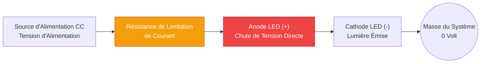
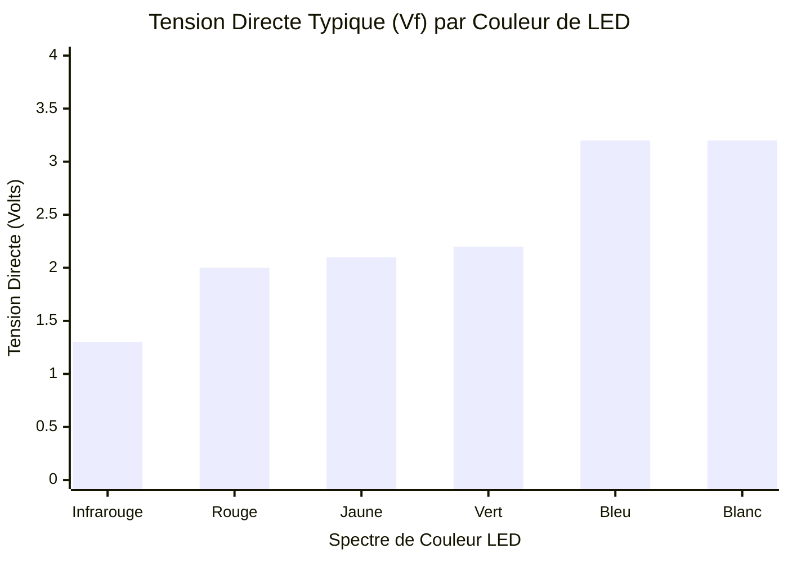
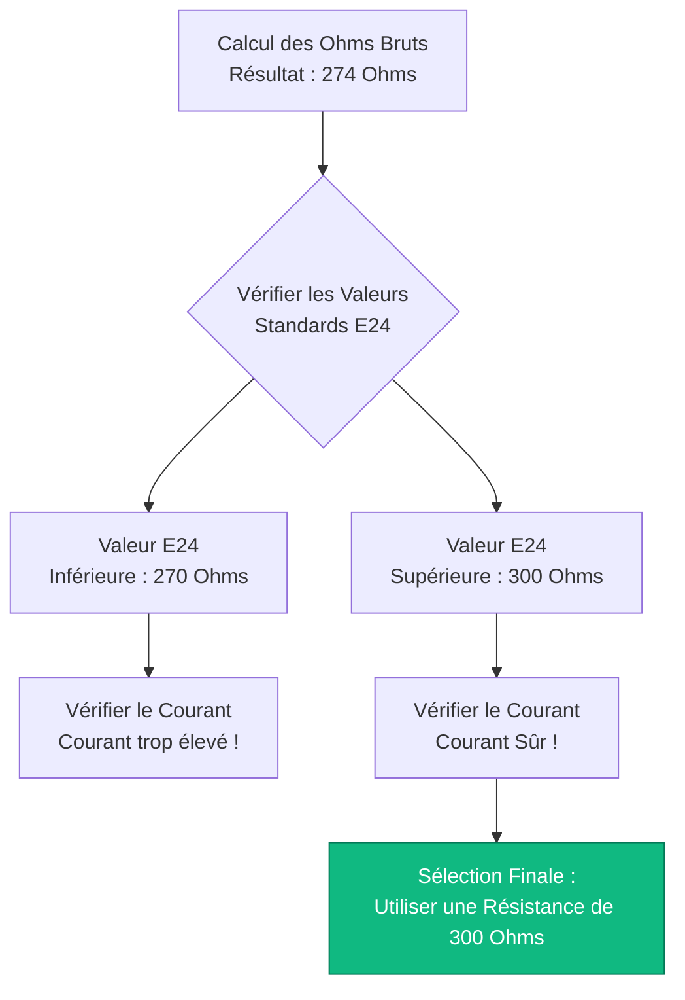
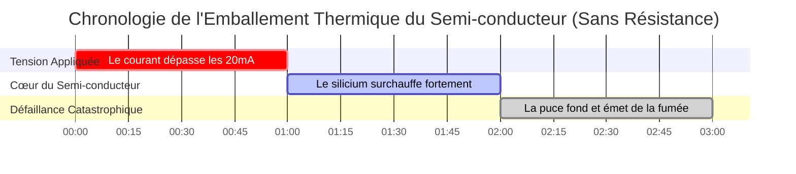

# Le Calculateur Définitif de Résistance pour LED : Loi d'Ohm, Standards E24 et Dissipation Thermique

Bienvenue dans l'ultime **Calculateur de résistance pour LED** et guide complet des circuits semi-conducteurs. Que vous soyez un passionné d'électronique prototypant une matrice d'indicateurs Arduino de $5\text{V}$, un technicien automobile tentant de moderniser proprement des LED de tableau de bord $12\text{V}$ sans déclencher d'erreurs CanBus, ou un étudiant en ingénierie dérivant physiquement $R = (V_s - V_f) / I$, la maîtrise des mathématiques des résistances de limitation de courant est absolument obligatoire.

Une LED (Diode Électroluminescente) n'est pas une ampoule. C'est un semi-conducteur très sensible. Si vous connectez directement une LED à une source d'alimentation sans résistance de limitation de courant, sa résistance interne s'effondrera instantanément, l'amenant à tirer un courant infini, à surchauffer violemment et à exploser dans un nuage de fumée bleue âcre.

Dans cette masterclass SEO exhaustive de plus de 4 000 mots, nous allons déconstruire l'équation fondamentale $R = \frac{V_s - V_f}{I}$, exposer mathématiquement les dangers des matrices de LED en parallèle, décoder les codes couleurs de résistance à 4 et 5 anneaux profondément confus, et analyser agressivement l'effet Joule ($P = I^2 R$) pour vous assurer de ne jamais faire fondre accidentellement une résistance de $1/4\text{W}$. Pour cimenter ces concepts critiques de génie électrique, nous avons inclus cinq diagrammes interactifs Mermaid.js méticuleusement détaillés et adaptés aux analyseurs (parsers).

---

## 1. Pourquoi les LED explosent-elles ? (La Physique de la Tension Directe)

Pour comprendre pourquoi une résistance est obligatoire, vous devez comprendre la physique des semi-conducteurs de la **Tension Directe ($V_f$)**.

Contrairement à un fil de cuivre traditionnel ou à un filament de tungstène, une LED n'obéit pas à la loi d'Ohm de manière linéaire. Une LED est une diode, c'est-à-dire une valve unidirectionnelle pour l'électricité. Lorsqu'une tension est appliquée, la LED bloque parfaitement tout courant jusqu'à ce que la tension franchisse un seuil critique de semi-conducteur connu sous le nom de **Tension Directe ($V_f$)**.

Pour une LED rouge standard, $V_f$ est exactement de $2,0\text{V}$. 
- Si vous appliquez $1,9\text{V}$, la LED tire $0\text{ Ampère}$. Elle est totalement éteinte.
- Si vous appliquez $2,0\text{V}$, la LED s'allume et tire ses $20\text{ mA}$ nominaux.
- Si vous appliquez $2,1\text{V}$, la résistance interne s'effondre complètement, la LED tire $200\text{ mA}$, et la puce semi-conductrice fond physiquement.

Une résistance agit comme un amortisseur. Elle brûle mathématiquement la tension excédentaire ($V_s - V_f$) et limite strictement le courant maximal circulant dans le circuit, maintenant la LED en toute sécurité à $20\text{ mA}$.

---

## 2. L'Équation Fondamentale de la Résistance pour LED

Le calcul de la résistance de limitation de courant parfaite ne nécessite qu'une algèbre de base. Vous devez déterminer quelle quantité de tension excédentaire doit être absorbée par la résistance, et la diviser par votre courant cible.

**La Formule Fondamentale :**
$$R = \frac{V_s - V_f}{I}$$

Où :
- $V_s$ = **Tension d'Alimentation** (La tension de votre batterie ou alimentation, ex : $5\text{V}$ ou $12\text{V}$).
- $V_f$ = **Tension Directe** (La tension consommée par la LED elle-même, ex : $2,0\text{V}$ pour le rouge).
- $I$ = **Courant Cible** (Le courant de luminosité souhaité en Ampères, ex : $0,020\text{A}$ pour $20\text{mA}$).

**Exemple de Calcul (Arduino 5V avec LED Rouge) :**
1. Tension à chuter : $5,0\text{V} - 2,0\text{V} = 3,0\text{V}$
2. Courant Cible : $20\text{ mA} = 0,020\text{ A}$
3. Résistance : $3,0 / 0,020 = 150 \ \Omega$

Vous avez besoin d'exactement une résistance de $150 \ \Omega$ pour faire fonctionner en toute sécurité une LED rouge sur un Arduino.

---

## 3. Le Problème des Résistances Standards E24

Les mathématiques produisent souvent des nombres peu pratiques. Si vous calculez un besoin de résistance de LED de $137,5 \ \Omega$, vous découvrirez rapidement une réalité frustrante : **Vous ne pouvez pas acheter une résistance de $137,5 \ \Omega$.**

Les composants électroniques sont fabriqués par lots logarithmiques standardisés connus sous le nom de **Séries E**. 
La norme la plus courante est la **série E24**, qui dicte les 24 valeurs standards disponibles dans chaque décade de résistance.

Valeurs de base courantes de l'E24 : $10, 11, 12, 13, 15, 16, 18, 20, 22, 24, 27, 30, 33, 36, 39, 43, 47, 51, 56, 62, 68, 75, 82, 91$.

Lorsque votre calcul tombe entre deux valeurs E24, **arrondissez toujours à la valeur standard supérieure la plus proche.** 
L'arrondi à la valeur supérieure augmente la résistance, ce qui diminue légèrement le courant, garantissant que la LED fonctionne plus froidement et dure plus longtemps. Si vous arrondissez à l'inférieur, vous risquez de surcharger la LED.

---

## 4. Effet Joule et Risques d'Incendie des Résistances ($P = I^2 R$)

Limiter le courant n'est que la moitié de la bataille. Lorsqu'une résistance absorbe une tension excédentaire, elle ne fait pas magiquement disparaître l'énergie : elle convertit violemment cette énergie électrique en chaleur thermique. C'est ce qu'on appelle **l'Effet Joule**.

Si votre résistance devient trop chaude, son film de carbone se vaporisera, coupant le circuit.

**La Formule de Dissipation de Puissance :**
$$P = V_R \times I \quad \text{ou} \quad P = I^2 \cdot R$$

**Exemple : Batterie de Voiture 12V avec une seule LED Rouge (2V, 20mA).**
- Tension chutée par la résistance ($V_R$) : $12\text{V} - 2\text{V} = 10\text{V}$.
- Courant ($I$) : $0,020\text{ A}$.
- Puissance ($P$) : $10 \times 0,020 = 0,200\text{ Watts}$ ($200\text{ mW}$).

Une minuscule résistance standard pour amateur est évaluée pour **$1/4\text{ Watt}$ ($250\text{ mW}$)**. 
Parce que $200\text{ mW}$ est extrêmement proche de la limite de $250\text{ mW}$, cette résistance fonctionnera de manière brûlante au toucher. Dans les environnements automobiles, la chaleur ambiante poussera facilement cette résistance au-delà de son point de défaillance thermique.

*Règle d'Ingénierie :* **Doublez toujours la puissance en watts calculée.** Si vous calculez $200\text{ mW}$, vous devez utiliser une résistance de $1/2\text{ Watt}$ ($500\text{ mW}$) pour une marge thermique sûre.

---

## 5. Matrices de LED en Série vs Parallèle

Lors du câblage de plusieurs LED, vous avez deux choix : Série ou Parallèle. **L'un de ces choix est une énorme erreur d'ingénierie.**

### Le Danger des LED en Parallèle
Les novices câblent souvent 5 LED en parallèle et essaient d'utiliser une seule résistance partagée. C'est catastrophique. En raison de défauts de fabrication microscopiques, une LED aura inévitablement un $V_f$ légèrement inférieur aux autres. Cette seule LED va "accaparer" avidement tout le courant, surchauffant et mourant. Une fois qu'elle meurt, tout le courant est déversé sur la LED la plus faible suivante, provoquant une explosion en chaîne en cascade connue sous le nom **d'Emballement Thermique**.
*N'utilisez jamais une résistance partagée pour des LED en parallèle. Donnez à chaque LED sa propre résistance dédiée.*

### L'Efficacité des LED en Série
Câbler des LED dans une chaîne en série est très efficace. Le courant ($20\text{ mA}$) traverse toutes les LED de manière égale, mais leurs Tensions Directes ($V_f$) s'additionnent.
- Trois LED rouges ($2,0\text{V}$ chacune) en série consomment $6,0\text{V}$ au total.
- Sur une alimentation de $12\text{V}$, la résistance ne doit chuter que de $6,0\text{V}$, réduisant considérablement le gaspillage de chaleur.
- **Formule :** $R = (V_s - (3 \times V_f)) / I$.

---

## 6. Cinq Scénarios Conceptuels d'Ingénierie avec Visualisations 2D

Pour maîtriser pleinement les relations physiques régissant les circuits LED, nous allons explorer cinq scénarios d'ingénierie distincts, décomposés visuellement à l'aide de diagrammes personnalisés Mermaid.js.

### Exemple 1 : Anatomie du Circuit LED Standard

**Le Scénario :**
Un étudiant en électronique doit comprendre la séquence obligatoire de composants nécessaires pour éclairer en toute sécurité une seule LED à partir d'une source d'alimentation CC.

**Visualisation 2D :**
Cet organigramme logique cartographie le chemin physique du courant circulant depuis la source de tension positive, à travers la résistance de protection, dans l'anode de la LED, et retournant à la masse.



---

### Exemple 2 : Tension Directe ($V_f$) par Couleur de LED

**Le Scénario :**
Un ingénieur en robotique conçoit un panneau d'indicateurs et doit tenir compte précisément des différentes chutes de tension aux bornes des LED de couleurs variées.

**Les Mathématiques :**
Différentes couleurs nécessitent différents matériaux semi-conducteurs (GaAs vs InGaN). Le rouge a une énergie extrêmement faible ($2,0\text{V}$), tandis que le bleu/blanc nécessite une énergie élevée ($3,2\text{V}$).

**Visualisation 2D :**
Ce graphique à barres classe de manière agressive les Tensions Directes exactes nécessaires pour illuminer des LED standard de 5 mm en fonction de leur spectre de couleurs.



---

### Exemple 3 : Marges de Dissipation Thermique des Résistances

**Le Scénario :**
Un technicien automobile calcule que la résistance de sa LED de tableau de bord de $12\text{V}$ dissipera $0,40\text{W}$ ($400\text{ mW}$) de chaleur thermique. Il doit sélectionner la taille physique correcte de la résistance.

**Les Mathématiques :**
L'utilisation d'une résistance de $1/4\text{W}$ ($250\text{ mW}$) déclenchera un incendie immédiat. L'utilisation d'une résistance de $1/2\text{W}$ ($500\text{ mW}$) est techniquement sûre, mais ne laisse aucune marge thermique. Une résistance de $1\text{W}$ ($1000\text{ mW}$) fournit le facteur de sécurité obligatoire de $2x$.

**Visualisation 2D :**
Ce graphique trace les limites de sécurité des boîtiers de résistances standards par rapport à la dissipation thermique réelle du circuit.

```mermaid
xychart-beta
    title "Dissipation Thermique vs Puissance Nominale des Résistances (Watts)"
    x-axis "Taille du Boîtier de la Résistance" [Chaleur Calculée, 1/4 Watt, 1/2 Watt, 1 Watt]
    y-axis "Gestion de la Puissance (Watts)" 0 --> 1.2
    bar [0.40, 0.25, 0.50, 1.00]
```

---

### Exemple 4 : L'Algorithme de Sélection Standard E24

**Le Scénario :**
Un concepteur de circuits calcule une résistance requise de $274 \ \Omega$. Parce que cette résistance n'existe pas dans le monde réel, il doit exécuter l'Algorithme de Sélection E24 pour trouver un substitut sûr.

**Visualisation 2D :**
Cet organigramme de haut en bas cartographie la logique stricte nécessaire pour évaluer les valeurs de résistances standards E24, garantissant que le circuit s'arrondit à la valeur SUPÉRIEURE pour protéger la LED.



---

### Exemple 5 : Emballement Thermique (Sans Résistance)

**Le Scénario :**
Un novice connecte une LED bleue de $3,2\text{V}$ directement à une alimentation USB de $5,0\text{V}$ sans résistance, croyant à tort que la LED "prendra simplement ce dont elle a besoin".

**Visualisation 2D :**
Ce diagramme de Gantt décrit brutalement la chronologie microscopique de l'Emballement Thermique, démontrant à quelle vitesse une jonction semi-conductrice non protégée va s'effondrer et brûler sous une tension excédentaire.



---

## 7. Conclusion et Défi d'Ingénierie

Maîtriser le calcul des Résistances pour LED ($R = (V_s - V_f) / I$) est l'ultime rite de passage pour tout ingénieur électricien ou maker. Comprendre la physique sévère de la Tension Directe, la réalité frustrante de la disponibilité des composants standards E24, et le risque d'incendie invisible de l'Effet Joule garantira le fonctionnement sans faille de vos circuits pendant des décennies.

Si vous ignorez ces principes mathématiques, vos LED grilleront instantanément, vos matrices en parallèle souffriront d'un emballement thermique dû à l'accaparement du courant, et vos résistances sous-évaluées roussiront vos circuits imprimés.

Pour garantir que vous maîtrisez ces concepts critiques, lancez notre Simulateur interactif et tentez de relever ces derniers défis :
1. **La Matrice Automobile 12V :** Vous devez faire fonctionner trois LED bleues ($3,2\text{V}$, $20\text{mA}$) dans une chaîne en série sur une alimentation d'alternateur de $14,4\text{V}$. Calculez la résistance exacte requise et trouvez la valeur standard E24 la plus proche.
2. **La Panique de Puissance :** Vous chutez de $9,0\text{V}$ aux bornes d'une résistance à $50\text{mA}$. Calculez la puissance exacte de l'effet Joule en watts. Pouvez-vous utiliser en toute sécurité une résistance de $1/2\text{W}$ ?
3. **Le Code Couleur :** Vous trouvez une résistance avec les anneaux : Jaune, Violet, Marron, Or. Quelles sont sa résistance exacte et sa tolérance ?

Fiez-vous à ce calculateur pour auditer vos planches à pain (breadboards), calculer des matrices en série complexes, et toujours défendre mathématiquement vos semi-conducteurs de la destruction thermique.
