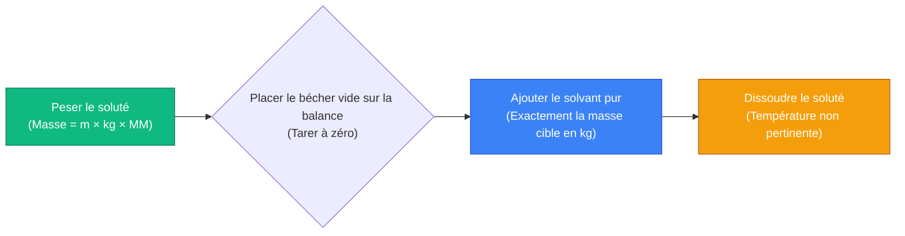
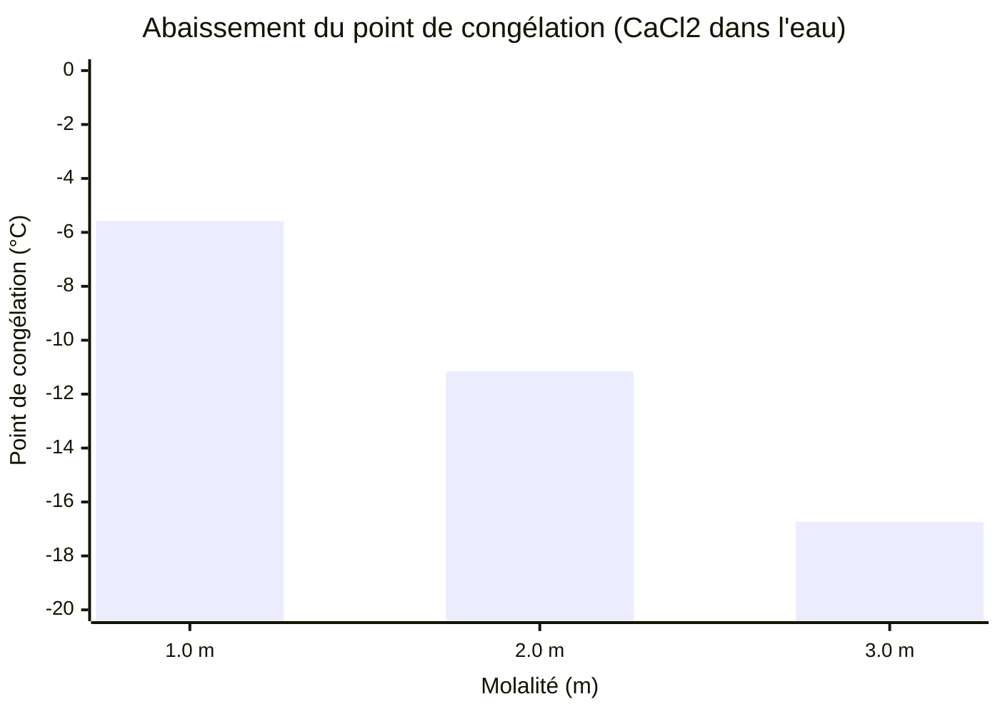
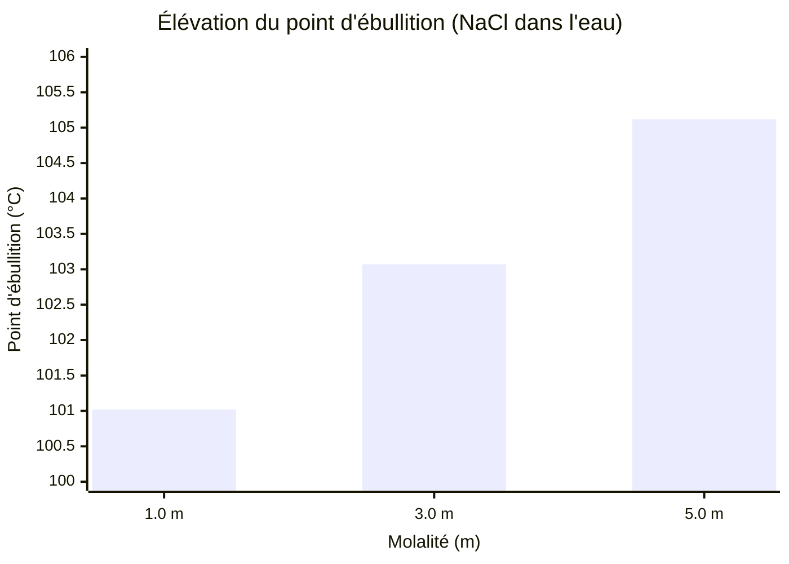
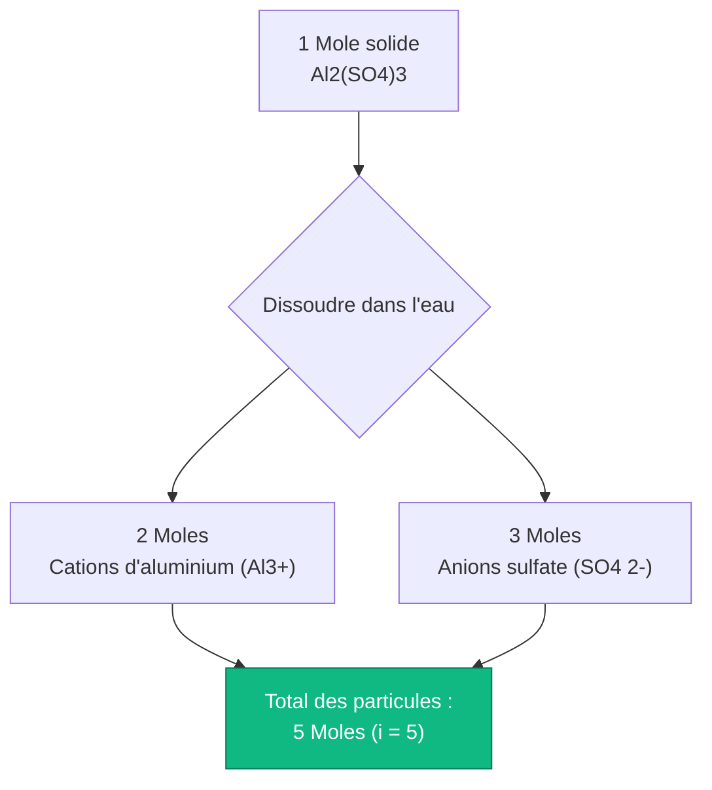
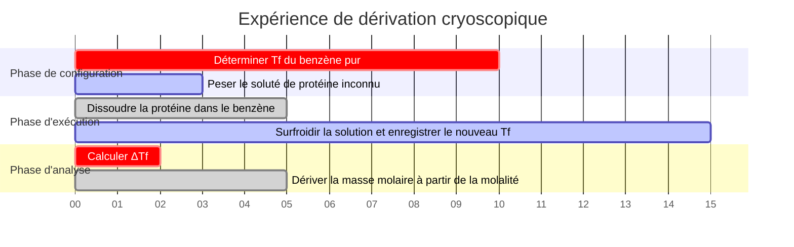

# Le calculateur de molalité définitif : Propriétés colligatives et thermodynamique

Bienvenue dans le **Calculateur de molalité** ultime et le guide complet de chimie physique. Que vous soyez un étudiant en chimie AP analysant l'abaissement du point de congélation, un ingénieur chimiste industriel concevant des solutions d'antigel automobile, ou un chercheur en cryobiologie travaillant sur la thermodynamique des solvants sous zéro, la maîtrise des mathématiques de la molalité est une nécessité absolue.

Alors que la molarité ($M$) domine la chimie des solutions générales, elle possède un défaut fatal : elle dépend entièrement du volume, qui s'étend et se contracte avec les variations thermiques. Lors de l'analyse des points d'ébullition et de congélation, les concentrations basées sur le volume sont mathématiquement inutiles. Vous devez plutôt vous fier à la **Molalité ($m$)**—le rapport strict et invariant avec la température des moles de soluté à la masse de solvant pur.

Dans cette masterclass SEO exhaustive de plus de 4 000 mots, nous allons complètement déconstruire les mathématiques fondamentales de la molalité, exposer les différences critiques entre la molarité et la molalité, prouver mathématiquement les lois thermodynamiques des propriétés colligatives ($\Delta T_f$ et $\Delta T_b$), et décoder les mécanismes physiques derrière le facteur de Van't Hoff ($i$). Pour garantir une compréhension absolue, nous avons inclus cinq diagrammes interactifs Mermaid.js, sûrs pour les analyseurs et méticuleusement détaillés.

---

## 1. La thermodynamique de la molalité (m = n / kg)

Le concept le plus critique absolu en chimie physique est de comprendre la définition mathématique stricte de la **Molalité ($m$)**. 

La molalité est une métrique d'ingénierie qui quantifie la concentration d'une solution chimique, exprimée strictement comme le nombre de **moles de soluté** dissoutes par **Kilogramme de SOLVANT pur**.
- Une solution à $1,0\text{ m}$ (Un molal) de chlorure de sodium ($\text{NaCl}$) contient exactement $1,0$ mole de molécules de $\text{NaCl}$ dispersées dans exactement $1,0\text{ kg}$ d'eau pure.
- Contrairement à la molarité, elle n'utilise PAS le volume total de la solution au dénominateur.

**L'équation de base :**
$$\text{Molalité (m)} = \frac{\text{Moles de soluté (n)}}{\text{Masse du solvant (kg)}}$$

### Pourquoi la molalité est indépendante de la température
La masse physique ($kg$) est une propriété invariante de la matière. Un kilogramme d'eau à $4^\circ\text{C}$ contient exactement le même nombre de molécules qu'un kilogramme d'eau à $95^\circ\text{C}$. Cependant, un litre d'eau à $95^\circ\text{C}$ prend un espace physique (volume) significativement plus grand en raison de l'expansion thermique.

Parce que la molarité ($M = n/V$) repose sur le volume, chauffer une solution diminue sa molarité. Parce que la molalité ($m = n/kg$) repose purement sur la masse, elle reste mathématiquement parfaite et constante à travers tous les états thermodynamiques, ce qui en fait la seule métrique valide pour l'étude des points d'ébullition et de congélation.

**La formule de préparation de la masse de soluté :**
Pour préparer une solution physique dans un bécher, vous devez combiner l'équation des moles avec l'équation de la molalité :
$$\text{Masse de soluté requise (g)} = \text{Molalité cible (m)} \times \text{Masse du solvant (kg)} \times \text{Masse molaire (g/mol)}$$

**Exemple de calcul :**
Vous devez préparer une solution à $0,50\text{ m}$ de chlorure de calcium ($\text{CaCl}_2$, $\text{MM} = 110,98\text{ g/mol}$) en utilisant $2,0\text{ kg}$ d'eau pure.
$\text{Masse requise} = 0,50\text{ m} \times 2,0\text{ kg} \times 110,98\text{ g/mol} = \mathbf{110,98\text{ grammes}}$.
Vous pèserez $110,98\text{ g}$ de $\text{CaCl}_2$ et le dissoudrez directement dans $2000\text{ g}$ d'eau.

---

## 2. Propriétés colligatives : Abaissement du point de congélation ($\Delta T_f$)

Les propriétés colligatives sont un sous-ensemble fascinant de la chimie physique. Ce sont des propriétés qui dépendent **uniquement du nombre total de particules dissoutes** dans une solution, en ignorant complètement l'identité chimique ou la taille de ces particules.

Lorsque vous dissolvez un soluté dans un solvant pur, les particules de soluté interfèrent physiquement avec la capacité des molécules de solvant à s'organiser en un réseau cristallin solide. Cela signifie que la température doit chuter de manière significative en dessous du point de congélation normal pour forcer la solution à geler. C'est pourquoi les municipalités répandent du sel sur les routes verglacées pendant les tempêtes de neige hivernales.

**L'équation du point de congélation :**
$$\Delta T_f = i \times K_f \times m$$

Où :
- $\Delta T_f$ = La chute de température en dessous du point de congélation normal.
- $i$ = Le facteur de Van't Hoff (nombre de particules dissociées).
- $K_f$ = La constante cryoscopique du solvant (Pour l'eau, $K_f = 1,86^\circ\text{C/m}$).
- $m$ = La molalité de la solution.

---

## 3. Propriétés colligatives : Élévation du point d'ébullition ($\Delta T_b$)

À l'inverse, lorsque vous faites bouillir une solution, les particules de soluté bloquent physiquement les molécules de solvant à la surface du liquide pour les empêcher de s'échapper en phase gazeuse, abaissant ainsi la pression de vapeur (Loi de Raoult). Pour surmonter cela et atteindre l'ébullition, vous devez appliquer beaucoup plus d'énergie thermique (température plus élevée).

**L'équation du point d'ébullition :**
$$\Delta T_b = i \times K_b \times m$$

Où :
- $\Delta T_b$ = L'augmentation de température au-dessus du point d'ébullition normal.
- $K_b$ = La constante ébullioscopique du solvant (Pour l'eau, $K_b = 0,512^\circ\text{C/m}$).

---

## 4. Décoder le facteur de Van't Hoff ($i$)

Le facteur de Van't Hoff est le multiplicateur mathématique représentant comment un composé chimique se brise lorsqu'il est exposé à un solvant. Parce que les propriétés colligatives ne s'intéressent qu'au *nombre* de particules, $1,0\text{ mole}$ de sel dissous aura un impact thermodynamique radicalement différent de $1,0\text{ mole}$ de sucre dissous.

**Non-électrolytes (Sucres, matières organiques) :**
Des composés comme le glucose ($\text{C}_6\text{H}_{12}\text{O}_6$) ou l'éthanol ne se séparent pas dans l'eau. Une mole de glucose solide donne une mole de glucose dissous.
- **Glucose $i = 1$**

**Électrolytes (Sels, acides) :**
Les composés ioniques se brisent en leurs ions constitutifs.
- $\text{NaCl} \rightarrow \text{Na}^+ + \text{Cl}^-$ (Donne 2 particules). **$i = 2$**
- $\text{CaCl}_2 \rightarrow \text{Ca}^{2+} + 2\text{Cl}^-$ (Donne 3 particules). **$i = 3$**
- $\text{Al}_2(\text{SO}_4)_3 \rightarrow 2\text{Al}^{3+} + 3\text{SO}_4^{2-}$ (Donne 5 particules). **$i = 5$**

Cela signifie qu'une solution à $1,0\text{ m}$ de $\text{Al}_2(\text{SO}_4)_3$ abaissera le point de congélation de l'eau **cinq fois plus efficacement** qu'une solution à $1,0\text{ m}$ de sucre !

---

## 5. Cinq scénarios d'ingénierie conceptuels avec visualisations 2D

Pour maîtriser pleinement les relations physiques régissant la thermodynamique colligative, nous explorerons cinq scénarios de laboratoire distincts décomposés visuellement à l'aide de diagrammes Mermaid.js personnalisés.

### Exemple 1 : Le pipeline de préparation molale

**Le scénario :**
Un technicien de laboratoire doit préparer physiquement une solution de molalité spécifique. Remarquez à quel point les fioles jaugées sont totalement inutiles ici car la molalité repose entièrement sur la masse.

**Visualisation 2D :**
Cet organigramme logique mappe la séquence chronologique stricte requise pour préparer correctement une solution molale en utilisant uniquement une balance analytique.

---

### Exemple 2 : La courbe d'abaissement du point de congélation

**Le scénario :**
Un ingénieur municipal évalue les sels de voirie pour empêcher le verglas à $-15^\circ\text{C}$. Il modélise comment l'augmentation de la molalité du $\text{CaCl}_2$ ($i=3$) abaisse linéairement le point de congélation de l'eau.

**Les mathématiques :**
$\Delta T_f = 3 \times 1,86 \times m = 5,58 \times m$. Pour chaque augmentation de $1,0\text{ m}$, le point de congélation chute de $5,58^\circ\text{C}$.

**Visualisation 2D :**
Ce graphique trace la corrélation linéaire directe entre la concentration molale du chlorure de calcium et le point de congélation sous zéro qui en résulte.

---

### Exemple 3 : L'effet d'élévation du point d'ébullition

**Le scénario :**
Un chef ajoute d'énormes quantités de sel ($\text{NaCl}$, $i=2$) à l'eau des pâtes pour forcer l'eau à bouillir plus chaud, cuisant les pâtes plus rapidement.

**Les mathématiques :**
$\Delta T_b = 2 \times 0,512 \times m = 1,024 \times m$. Même à des concentrations extrêmement élevées, l'effet d'élévation du point d'ébullition dans l'eau est physiquement très faible.

**Visualisation 2D :**
Ce graphique prouve graphiquement qu'il faudrait des quantités absurdes de sel pour élever le point d'ébullition de l'eau ne serait-ce que de quelques degrés.

---

### Exemple 4 : L'architecture de dissociation de Van't Hoff

**Le scénario :**
Un étudiant de première année en chimie a du mal à comprendre pourquoi $1,0\text{ m}$ de sulfate d'aluminium a un impact thermodynamique si radical comparé au sucre.

**Visualisation 2D :**
Cet organigramme descendant mappe la cascade de dissociation ionique, prouvant comment une seule unité cristalline se brise en cinq particules thermodynamiques distinctes.

---

### Exemple 5 : Chronologie du laboratoire cryoscopique

**Le scénario :**
Un chercheur en cryobiologie exécute une expérience de précision pour dériver la masse molaire inconnue d'une protéine nouvellement synthétisée en observant l'abaissement du point de congélation dans le benzène.

**Visualisation 2D :**
Ce diagramme de Gantt visualise la séquence chronologique d'une expérience de chimie physique, de l'étalonnage du solvant jusqu'à la dérivation mathématique thermodynamique finale.

---

## 7. Conclusion et défi de thermodynamique

Maîtriser la molalité est le socle fondamental de toute la chimie thermodynamique et colligative. Comprendre la différence entre la molarité dépendante du volume et la molalité dépendante de la masse, respecter le fractionnement physique des électrolytes via le facteur de Van't Hoff, et modéliser mathématiquement les variations thermiques garantiront que vos expériences en laboratoire produiront des résultats précis et reproductibles.

Si vous ignorez ces principes mathématiques, vos étalonnages de précision échoueront lorsque la température du laboratoire fluctuera, vos moteurs d'automobile fissureront des blocs gelés en hiver, et vos cultures de cellules biologiques mourront de choc osmotique.

Pour garantir que vous avez maîtrisé ces concepts critiques, lancez notre simulateur interactif et essayez de résoudre ces derniers défis de chimie physique :
1. **Le défi de masse :** Vous devez préparer une solution à $0,75\text{ m}$ de nitrate de potassium ($\text{KNO}_3$, $\text{MM} = 101,1\text{ g/mol}$) en utilisant exactement $500\text{ g}$ d'eau. Exactement combien de grammes de $\text{KNO}_3$ devez-vous peser sur la balance analytique ?
2. **Le défi d'hiver :** Vous jetez $2000\text{ g}$ de $\text{MgCl}_2$ ($i=3$, $\text{MM} = 95,21\text{ g/mol}$) dans $10,0\text{ kg}$ d'eau. Quel est le nouveau point de congélation exact du mélange ? ($K_f$ de l'eau = 1,86).
3. **Le défi de la masse molaire :** Vous dissolvez $50,0\text{ g}$ d'un non-électrolyte inconnu ($i=1$) dans $1,0\text{ kg}$ d'eau. Le point d'ébullition augmente de $0,256^\circ\text{C}$. Quelle est la masse molaire précise du soluté inconnu ? ($K_b$ de l'eau = 0,512).

Fiez-vous à ce calculateur pour vérifier vos devoirs de thermodynamique, pré-calculer vos protocoles d'abaissement du point de congélation en laboratoire, et maîtriser de façon permanente les mathématiques de la chimie physique.
