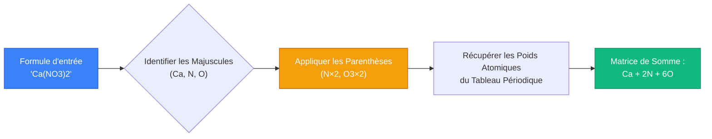
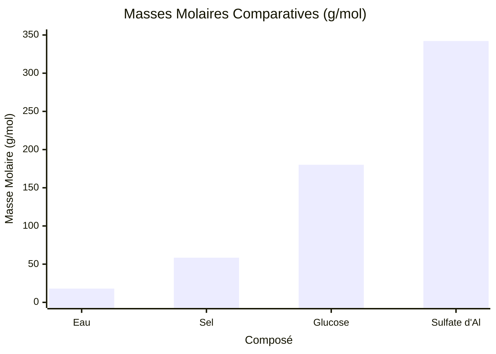
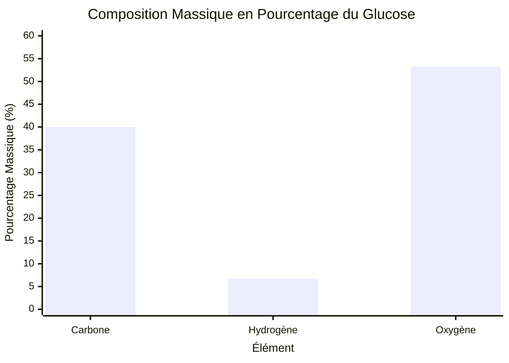
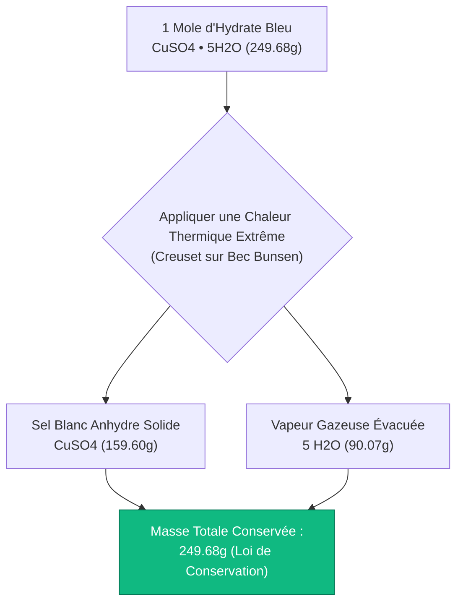
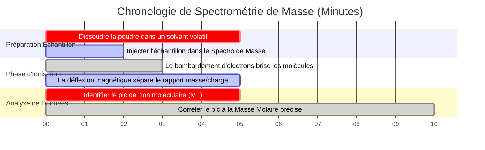

# Le Calculateur Définitif de Masse Molaire : Formules, Composition en Pourcentage et Hydrates

Bienvenue dans le guide ultime du **Calculateur de Masse Molaire** et de la formule chimique. Que vous soyez un étudiant en chimie au lycée apprenant à équilibrer votre première équation stœchiométrique, un chimiste analytique configurant un spectromètre de masse pour l'analyse des protéines, ou un scientifique des matériaux calculant le pourcentage d'hydratation précis du ciment industriel, maîtriser les mathématiques de la masse molaire est la base incontournable de la chimie quantitative.

Les formules chimiques comme $\text{C}_6\text{H}_{12}\text{O}_6$ (Glucose) ou $\text{CuSO}_4\cdot 5\text{H}_2\text{O}$ (Sulfate de cuivre pentahydraté) peuvent ressembler à une soupe alphabétique confuse pour un débutant. Cependant, ce sont des plans mathématiques très structurés. En déconstruisant ces formules et en multipliant le nombre d'atomes par les poids atomiques standards du tableau périodique, nous pouvons faire le pont entre le monde microscopique des particules atomiques et le monde macroscopique des grammes de laboratoire.

Dans cette masterclass SEO exhaustive de plus de 4 000 mots, nous allons entièrement déconstruire les algorithmes mathématiques requis pour calculer la masse molaire, explorer les différences critiques entre les formules moléculaires et empiriques, prouver mathématiquement la composition en pourcentage de composés organiques complexes et décoder la thermodynamique des hydrates cristallins. Pour garantir une compréhension absolue, nous avons inclus cinq diagrammes interactifs Mermaid.js méticuleusement détaillés et adaptés aux analyseurs (parsers).

---

## 1. Les Mathématiques de la Masse Molaire ($\text{g/mol}$)

La **Masse Molaire ($M$)** d'une substance chimique est définie avec précision comme la masse physique (mesurée en grammes) d'exactement $1,0\text{ mole}$ ($6,022 \times 10^{23}$ particules) de cette substance. 
En utilisant les poids atomiques standards du tableau périodique (qui sont mis à l'échelle par rapport à l'étalon isotope Carbone-12), nous pouvons dériver la masse molaire exacte de n'importe quel composé théorique dans l'univers.

**L'Algorithme de Somme Fondamental :**
$$M = \sum (\text{Nombre d'atomes de l'élément} \times \text{Poids atomique standard})$$

### La Masse Molaire de l'Eau ($\text{H}_2\text{O}$)
Pour calculer la masse molaire de l'eau, nous analysons la formule $\text{H}_2\text{O}$ :
- L'indice "2" signifie qu'il y a deux atomes d'Hydrogène ($\text{H}$).
- L'absence d'indice après l'Oxygène ($\text{O}$) implique mathématiquement "1".
- Cherchez l'Hydrogène dans le tableau périodique : $1,008\text{ g/mol}$.
- Cherchez l'Oxygène dans le tableau périodique : $15,999\text{ g/mol}$.

**Le Calcul :**
- Hydrogène : $2 \times 1,008 = 2,016\text{ g/mol}$
- Oxygène : $1 \times 15,999 = 15,999\text{ g/mol}$
- **Masse Molaire Totale ($\text{H}_2\text{O}$) : $18,015\text{ g/mol}$**

Si vous pesez physiquement exactement $18,015\text{ grammes}$ d'eau liquide pure sur une balance analytique, vous possédez exactement $1,0\text{ mole}$ de molécules d'eau.

---

## 2. Analyse Avancée de Formule : Parenthèses et Crochets

Les formules chimiques pour les ions polyatomiques utilisent souvent des parenthèses. Un indice situé juste après une parenthèse multiplie mathématiquement chaque atome contenu *à l'intérieur* de la parenthèse.

### La Masse Molaire du Sulfate d'Aluminium [$\text{Al}_2(\text{SO}_4)_3$]
C'est un composé chimique classique qui cause d'immenses frustrations aux étudiants en chimie. Déconstruisons le plan mathématique :
1. **$\text{Al}_2$ :** $2\text{ atomes d'Aluminium}$.
2. **$(\text{SO}_4)_3$ :** Le "3" à l'extérieur multiplie le $\text{S}$ par 3, et le $\text{O}_4$ par 3 ($4 \times 3 = 12$). Nous avons donc $3\text{ atomes de Soufre}$ et $12\text{ atomes d'Oxygène}$.

**Le Calcul :**
- Aluminium : $2 \times 26,982 = 53,964\text{ g/mol}$
- Soufre : $3 \times 32,06 = 96,180\text{ g/mol}$
- Oxygène : $12 \times 15,999 = 191,988\text{ g/mol}$
- **Masse Molaire Totale ($\text{Al}_2(\text{SO}_4)_3$) : $342,132\text{ g/mol}$**

---

## 3. Hydrates et Eau de Cristallisation ($\cdot x\text{H}_2\text{O}$)

De nombreux sels ioniques absorbent naturellement les molécules d'eau de l'humidité ambiante de l'atmosphère, retenant ces molécules d'eau étroitement dans leur réseau cristallin 3D. Ce sont ce qu'on appelle des **Hydrates**. L'eau n'est PAS de l'eau liquide physiquement mouillante ; c'est une eau structurelle solide liée chimiquement.

La formule chimique d'un hydrate utilise un point central "$\cdot$" suivi d'un entier $x$, qui représente le nombre de molécules d'eau liées par unité de formule de sel. Lors du calcul de la masse molaire, vous devez AJOUTER la masse de l'eau à la masse du sel anhydre.

### Sulfate de Cuivre(II) Pentahydraté ($\text{CuSO}_4\cdot 5\text{H}_2\text{O}$)
- Le préfixe "Penta" signifie qu'exactement $5\text{ molécules d'eau}$ sont piégées.
- Premièrement, calculez le sel anhydre $\text{CuSO}_4$ :
  - $\text{Cu}$ ($63,546$) + $\text{S}$ ($32,06$) + $4\times \text{O}$ ($63,996$) = $159,602\text{ g/mol}$.
- Deuxièmement, calculez les $5\text{ molécules d'eau}$ :
  - $5 \times \text{H}_2\text{O}$ ($18,015$) = $90,075\text{ g/mol}$.
- **Masse Molaire Hydratée Totale : $159,602 + 90,075 = 249,677\text{ g/mol}$.**

Lorsque vous chauffez un hydrate dans un creuset sur un bec Bunsen, l'énergie thermique brise les liaisons retenant l'eau de cristallisation. L'eau s'évapore sous forme de vapeur et l'hydrate cristallin bleu s'effondre en une masse anhydre poudreuse blanche.

---

## 4. Composition Massique en Pourcentage

Une fois que vous avez calculé la masse molaire totale d'un composé, déterminer la **Composition Massique en Pourcentage** est une simple question de division. C'est extrêmement critique dans l'exploitation minière industrielle et la métallurgie (par exemple, pour déterminer quel pourcentage de minerai de fer est réellement du fer pur).

**L'Équation :**
$$\text{\% Élément} = \left( \frac{\text{Masse totale de l'élément dans 1 mole}}{\text{Masse Molaire Totale du Composé}} \right) \times 100\%$$

**Exemple : Composition en pourcentage du Glucose ($\text{C}_6\text{H}_{12}\text{O}_6$)**
- **Masse Molaire Totale :** $180,156\text{ g/mol}$
- **% Carbone ($C$) :** $(72,066 / 180,156) \times 100\% = \mathbf{40,00\%}$
- **% Hydrogène ($H$) :** $(12,096 / 180,156) \times 100\% = \mathbf{6,71\%}$
- **% Oxygène ($O$) :** $(95,994 / 180,156) \times 100\% = \mathbf{53,28\%}$

Parce que les pourcentages doivent totaliser $100\%$, nous savons que le calcul est parfait : $40,00 + 6,71 + 53,28 = 99,99\%$ (avec $0,01\%$ perdu par un arrondi standard).

---

## 5. Cinq Scénarios d'Ingénierie Conceptuelle avec Visualisations 2D

Pour maîtriser pleinement les algorithmes régissant l'analyse de formules, la sommation des éléments et la composition massique, nous allons explorer cinq scénarios de chimie analytique distincts décomposés visuellement à l'aide de diagrammes personnalisés Mermaid.js.

### Exemple 1 : L'Analyseur de Formule Algorithmique

**Le Scénario :**
Un étudiant en informatique essaie de comprendre comment notre algorithme de calculateur interne analyse une chaîne complexe comme `Ca(NO3)2` en une matrice mathématique.

**Visualisation 2D :**
Cet organigramme logique cartographie le processus strict de tokenisation étape par étape qui extrait les symboles atomiques, applique les multiplicateurs et additionne les poids finaux.

---

### Exemple 2 : Densité Comparative de la Masse Molaire

**Le Scénario :**
Un technicien de laboratoire compare visuellement la "lourdeur" relative (masses molaires) de quatre substances chimiques complètement différentes.

**Visualisation 2D :**
Ce graphique prouve visuellement à quelle vitesse la masse molaire augmente lorsque des métaux de transition lourds (comme le Cuivre) ou des ions polyatomiques complexes (comme le Sulfate) sont introduits dans une formule chimique.

---

### Exemple 3 : Composition Massique en Pourcentage (Glucose)

**Le Scénario :**
Un nutritionniste évalue la décomposition massique exacte des sucres macronutriments. Il visualise la composition en pourcentage du Glucose ($\text{C}_6\text{H}_{12}\text{O}_6$).

**Visualisation 2D :**
Ce graphique trace la contribution exacte de masse de chaque élément constitutif. Remarquez comment l'Hydrogène, bien qu'ayant $12\text{ atomes}$ (le nombre le plus élevé), apporte le plus faible pourcentage de masse parce que son poids atomique n'est que de $1,008$.

---

### Exemple 4 : Architecture de la Décomposition Thermique d'un Hydrate

**Le Scénario :**
Un étudiant en chimie analytique réalise une expérience de laboratoire classique : chauffer du sulfate de cuivre(II) pentahydraté bleu pour chasser l'eau de cristallisation.

**Visualisation 2D :**
Cet organigramme de haut en bas cartographie la destruction thermodynamique du réseau d'hydrate, prouvant que la masse chimique se sépare en une phase anhydre solide et une phase vapeur d'eau gazeuse.

---

### Exemple 5 : Chronologie d'un Laboratoire de Spectrométrie de Masse

**Le Scénario :**
Un chimiste analytique légiste utilise un Spectromètre de Masse pour vérifier expérimentalement la masse molaire exacte d'une poudre cristalline inconnue trouvée sur une scène de crime.

**Visualisation 2D :**
Ce diagramme de Gantt visualise la séquence chronologique d'une analyse par spectrométrie de masse, de l'ionisation de l'échantillon à la dérivation calculatoire de la masse molaire.

---

## 6. Conclusion et Défi de Stœchiométrie

Maîtriser le calcul de la masse molaire est le prix d'entrée inévitable pour étudier la chimie. Comprendre comment analyser de manière algorithmique les formules chimiques, appliquer des parenthèses comme multiplicateurs mathématiques, calculer la composition élémentaire en pourcentage et décoder la décomposition thermique des hydrates garantira que vos rendements de laboratoire soient précis.

Si vous ignorez ces règles algorithmiques, vous calculerez mal les masses des réactifs, empoisonnerez accidentellement des solutions avec des concentrations incorrectes, et ne réussirez pas à distinguer le monoxyde de carbone ($\text{CO}$) de l'élément cobalt ($\text{Co}$).

Pour garantir que vous maîtrisez ces concepts critiques, lancez notre Simulateur interactif et essayez de résoudre ces derniers défis de chimie analytique :
1. **Le Défi des Parenthèses :** Calculez la masse molaire exacte du Phosphate d'Ammonium [$(\text{NH}_4)_3\text{PO}_4$]. N'oubliez pas de multiplier l'Azote et l'Hydrogène intérieurs par l'indice extérieur $3$.
2. **Le Défi de l'Hydrate :** Vous avez un échantillon de $100,0\text{g}$ d'Heptahydrate de Sulfate de Magnésium ($\text{MgSO}_4\cdot 7\text{H}_2\text{O}$). Vous le chauffez jusqu'à ce que toute l'eau s'évapore. Quelle est la masse exacte de la poudre blanche anhydre laissée dans le creuset ?
3. **Le Défi de la Composition :** Quel composé contient le pourcentage le plus élevé d'Azote pur en masse : l'Ammoniac ($\text{NH}_3$) ou le Nitrate d'Ammonium ($\text{NH}_4\text{NO}_3$) ? Vous devez calculer les deux pour le découvrir !

Fiez-vous à ce calculateur pour vérifier vos algorithmes d'analyse de formule, rechercher instantanément des poids atomiques IUPAC précis, et maîtriser de façon permanente les mathématiques de la stœchiométrie analytique.
