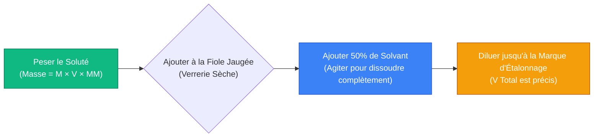
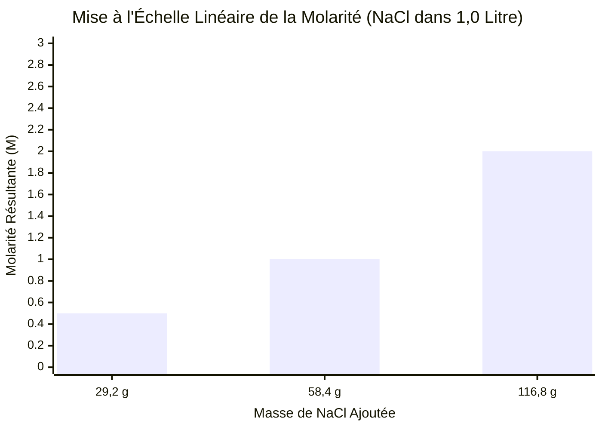
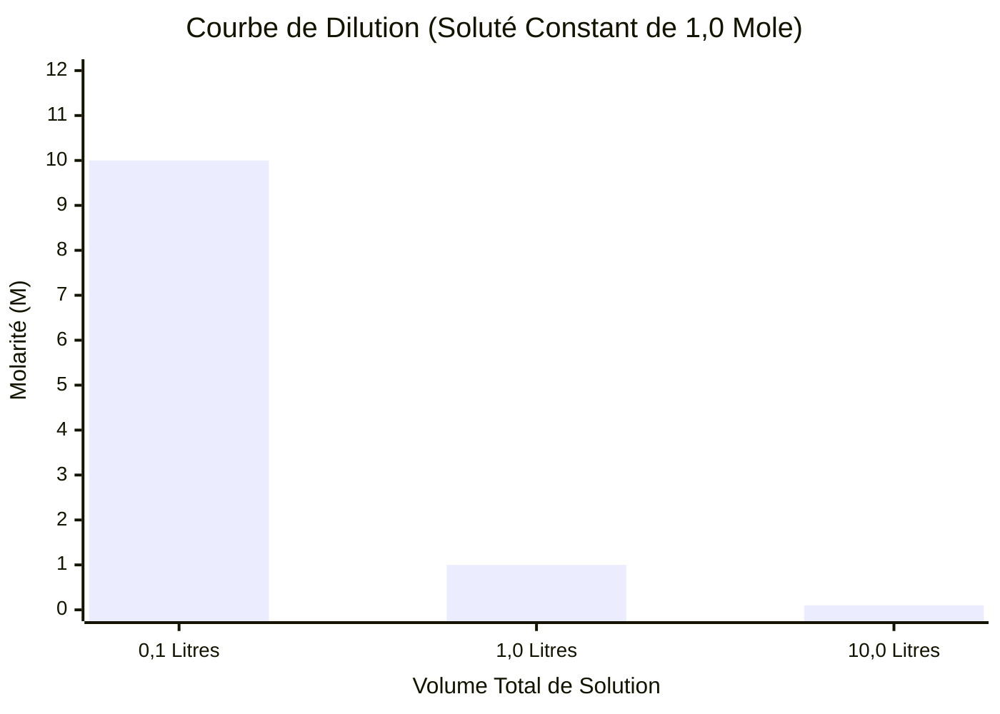
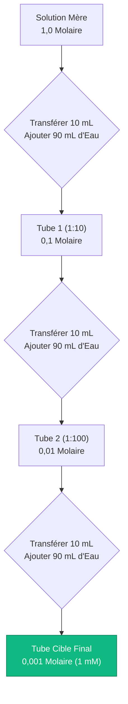
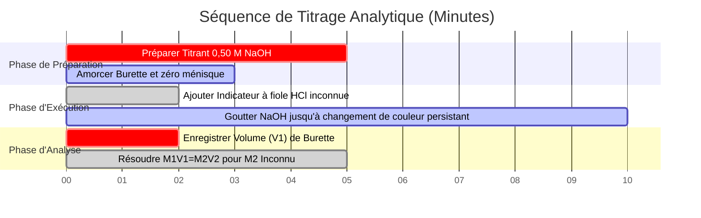

# La Calculatrice de Molarité Définitive : Stœchiométrie des Moles, de la Masse et de la Dilution

Bienvenue dans l'ultime **Calculatrice de Molarité** et guide complet d'ingénierie des solutions chimiques. Que vous soyez un étudiant en chimie avancée luttant avec les devoirs de stœchiométrie, un étudiant en pharmacologie médicale calculant les concentrations des perfusions IV ou un ingénieur chimiste industriel mettant à l'échelle un lot de 10 000 litres d'acide sulfurique, la maîtrise des mathématiques de la molarité est absolument non négociable.

La chimie est la science des réactions, et l'écrasante majorité des réactions chimiques se produisent dans des solutions liquides. Si vous calculez incorrectement la masse requise de votre soluté, votre expérience échouera. Si vous comprenez mal l'équation fondamentale de dilution $M_1 V_1 = M_2 V_2$, vous pourriez accidentellement administrer une surdose mortelle de médicament dans un cadre clinique. Si vous ne saisissez pas la différence physique entre la Molarité (dépendante de la température) et la Molalité (indépendante de la température), vos étalonnages analytiques de précision seront intrinsèquement faussés.

Dans cette masterclass SEO exhaustive de plus de 4 000 mots, nous déconstruirons complètement les mathématiques fondamentales de la Concentration des Solutions, exposerons les complexités cachées de la préparation des fioles jaugées, prouverons mathématiquement la conservation de la masse lors de la dilution, et décoderons les formules stœchiométriques exactes requises pour préparer des mélanges chimiques complexes à partir de zéro. Pour garantir une compréhension absolue, nous avons inclus cinq diagrammes interactifs Mermaid.js méticuleusement détaillés et sûrs pour les analyseurs.

---

## 1. La Physique Fondamentale de la Molarité (M = n / V)

Le concept absolu le plus critique dans la chimie des solutions est la compréhension de la définition mathématique stricte de la **Molarité ($M$)**.

La molarité est une métrique d'ingénierie qui quantifie la concentration d'une solution chimique, exprimée strictement comme le nombre de **moles de soluté** dissoutes par **Litre de solution totale**.
- Une solution $1,0\text{ M}$ (Un Molaire) de Chlorure de Sodium ($\text{NaCl}$) contient exactement $1,0$ mole de molécules de $\text{NaCl}$ dispersées dans $1,0$ Litre de volume physique total.
- Cela ne signifie PAS $1,0$ mole de soluté ajoutée à $1,0$ Litre d'eau pure (c'est une erreur courante et catastrophique dont nous discuterons plus tard).

**L'Équation Fondamentale :**
$$\text{Molarité (M)} = \frac{\text{Moles de Soluté (n)}}{\text{Volume de Solution (Litres)}}$$

### Le Concept de la Mole ($n$)
Avant de pouvoir calculer la molarité, vous devez comprendre ce qu'est une "mole". Vous ne pouvez pas compter les atomes individuels avec des pincettes ; ils sont trop petits. Au lieu de cela, les chimistes utilisent le **Nombre d'Avogadro** ($6,022 \times 10^{23}$). 
Une mole de N'IMPORTE QUELLE substance contient exactement $6,022 \times 10^{23}$ particules.
Cependant, comme les atomes ont des poids physiques différents, une mole de Carbone pèse $12,011$ grammes, tandis qu'une mole de Plomb pèse la masse de $207,2$ grammes. C'est ce qu'on appelle la **Masse Molaire ($\text{MM}$)**.

**L'Équation des Moles :**
$$\text{Moles de Soluté (n)} = \frac{\text{Masse Physique (grammes)}}{\text{Masse Molaire (g/mol)}}$$

### Calcul de la Masse à partir de la Molarité
Dans le monde réel, les balances de laboratoire mesurent la masse en grammes, pas en moles. Pour préparer une solution physique dans un bécher, vous devez combiner les deux équations ci-dessus dans la Formule Universelle de Préparation de Solution :

**La Formule de Préparation de Solution :**
$$\text{Masse Requise (grammes)} = \text{Molarité Cible (M)} \times \text{Volume (L)} \times \text{Masse Molaire (g/mol)}$$

**Exemple de Calcul :**
Vous devez préparer $500\text{ mL}$ ($0,500\text{ L}$) d'une solution de $0,200\text{ M}$ de Glucose ($\text{C}_6\text{H}_{12}\text{O}_6$). La masse molaire du Glucose est de $180,156\text{ g/mol}$.
$\text{Masse Requise} = 0,200\text{ M} \times 0,500\text{ L} \times 180,156\text{ g/mol} = \mathbf{18,015\text{ grammes}}$.
Vous peserez $18,015\text{ g}$ de poudre de glucose.

---

## 2. La Contrainte de la Fiole Jaugée (Une Erreur Critique)

L'erreur la plus fréquente commise par les étudiants en première année de chimie est d'ajouter le soluté au volume final de solvant.

Si vous prenez $18,015\text{ g}$ de glucose et que vous le versez dans exactement $500\text{ mL}$ d'eau pure, votre volume de solution final sera **supérieur à** $500\text{ mL}$ car la masse physique du glucose solide occupe de l'espace physique et déplace l'eau. Votre molarité résultante sera incorrectement basse.

**Le Protocole Volumétrique Correct :**
1. Pesez les $18,015\text{ g}$ de glucose.
2. Ajoutez-le dans une **Fiole Jaugée** sèche de $500\text{ mL}$.
3. N'ajoutez que $300\text{ mL}$ d'eau pour dissoudre complètement le solide.
4. Une fois complètement dissous, ajoutez lentement de l'eau goutte à goutte jusqu'à ce que le bas du ménisque liquide touche exactement la ligne d'étalonnage de $500\text{ mL}$ sur le col de la fiole.

Ce protocole garantit que le **volume final total** du mélange (soluté + solvant) est exactement de $500\text{ mL}$, assurant une concentration mathématiquement parfaite de $0,200\text{ M}$.

---

## 3. L'Équation de Dilution ($M_1V_1 = M_2V_2$)

Dans les laboratoires professionnels, les scientifiques ne préparent pas de solutions faibles à partir de zéro. Au lieu de cela, ils préparent des cuves massives de **Solutions Mères** très concentrées (par exemple, $10,0\text{ M}$ d'Acide Chlorhydrique). Lorsqu'ils ont besoin d'une concentration plus faible (par exemple, $1,0\text{ M}$) pour une expérience, ils extraient un petit volume de la solution mère et le diluent avec de l'eau pure.

Lorsque vous diluez une solution en ajoutant de l'eau, le **volume total augmente**, la **molarité diminue**, mais le **nombre total de particules de soluté (moles) reste complètement inchangé**.

Parce que $\text{Moles} = \text{Molarité} \times \text{Volume}$, et que les moles restent constantes avant et après la dilution, nous dérivons la Loi de Dilution universelle :

**La Formule de Dilution :**
$$M_1 \times V_1 = M_2 \times V_2$$

Où :
- $M_1$ = Concentration Initiale de la Solution Mère
- $V_1$ = Volume Initial extrait de la Solution Mère (L'inconnue que nous résolvons généralement)
- $M_2$ = Concentration Cible Finale de la Solution Diluée
- $V_2$ = Volume Cible Final de la Solution Diluée

**Exemple de Calcul :**
Vous avez besoin de $2,0\text{ Litres}$ ($V_2$) de $0,50\text{ M}$ ($M_2$) de $\text{HCl}$ pour une expérience. Vous avez un bidon de stock de $\text{HCl}$ de $12,0\text{ M}$ ($M_1$). Quelle quantité de solution mère extrayez-vous ?
$$12,0\text{ M} \times V_1 = 0,50\text{ M} \times 2,0\text{ L}$$
$$V_1 = \frac{0,50 \times 2,0}{12,0} = \mathbf{0,0833\text{ Litres (83,3 mL)}}$$

**Calcul de l'Eau Ajoutée :**
Vous extrayez $83,3\text{ mL}$ de l'acide très dangereux de $12,0\text{ M}$. Pour atteindre le volume final de $2,0\text{ Litres}$ ($2000\text{ mL}$), quelle quantité d'eau pure devez-vous ajouter ?
$$\text{Eau Ajoutée} = V_2 - V_1 = 2000\text{ mL} - 83,3\text{ mL} = \mathbf{1916,7\text{ mL}}$$

---

## 4. Cinq Scénarios d'Ingénierie Conceptuelle avec des Visualisations 2D

Pour maîtriser pleinement les relations physiques régissant les solutions chimiques, nous explorerons cinq scénarios de laboratoire distincts décomposés visuellement à l'aide de diagrammes Mermaid.js personnalisés.

### Exemple 1 : Le Pipeline de Préparation de Solution

**Le Scénario :**
Un technicien de laboratoire doit préparer physiquement une solution de molarité spécifique à partir d'une poudre chimique sèche.

**Visualisation 2D :**
Cet organigramme logique mappe la séquence chronologique stricte requise pour utiliser correctement une fiole jaugée, empêchant l'erreur de déplacement de volume discutée précédemment.

---

### Exemple 2 : Mise à l'Échelle de la Masse par rapport à la Molarité

**Le Scénario :**
Un étudiant prépare $1,0\text{ Litre}$ de solution de $\text{NaCl}$ et veut comprendre comment la molarité augmente linéairement à mesure qu'il ajoute plus de masse physique de sel dans le bécher.

**Les Mathématiques :**
Parce que la Masse Molaire ($\text{MM}$) et le Volume ($V$) sont maintenus constants, la Molarité ($M$) devient directement proportionnelle à la Masse.

**Visualisation 2D :**
Ce graphique trace la corrélation linéaire directe entre les grammes de $\text{NaCl}$ ajoutés à $1,0\text{ L}$ d'eau et la molarité de la solution résultante.

---

### Exemple 3 : La Courbe de Volume de Dilution

**Le Scénario :**
Un chimiste prend $0,1\text{ Litres}$ d'une solution mère de $10,0\text{ M}$ et commence à ajouter de l'eau. Il veut suivre comment la concentration molaire chute de façon exponentielle à mesure que le volume total augmente.

**Les Mathématiques :**
Puisque les moles de soluté sont piégées à exactement $1,0\text{ mole}$ ($10,0\text{ M} \times 0,1\text{ L}$), la Molarité ($M = 1,0 / V$) chute comme une fonction inverse du volume total.

**Visualisation 2D :**
Ce graphique prouve graphiquement la relation inverse régissant la loi de dilution $M_1 V_1 = M_2 V_2$.

---

### Exemple 4 : L'Architecture de Dilution en Série

**Le Scénario :**
Un microbiologiste a besoin d'une solution extrêmement diluée de $0,001\text{ M}$ ($1\text{ mM}$) pour une culture bactérienne, à partir d'un stock de $1,0\text{ M}$. Pipeter directement les microlitres requis dans une cuve massive d'eau est trop imprécis. Il doit effectuer une Dilution en Série.

**Visualisation 2D :**
Cet organigramme de haut en bas mappe une cascade de dilution en série par étapes de 1:10, démontrant comment le passage de $10\text{ mL}$ de solution dans $90\text{ mL}$ d'eau divise successivement la concentration par 10 à chaque étape.

---

### Exemple 5 : Chronologie du Titrage Acide-Base

**Le Scénario :**
Un chimiste analytique utilise une burette de $\text{NaOH}$ connue de $0,50\text{ M}$ pour neutraliser une fiole de molarité de $\text{HCl}$ inconnue. Il suit la séquence d'événements de laboratoire requise pour exécuter l'analyse.

**Visualisation 2D :**
Ce diagramme de Gantt visualise la séquence chronologique d'une expérience de titrage chimique, de la préparation des réactifs jusqu'à la dérivation mathématique stœchiométrique.

---

## 5. Conclusion et Défi de Chimie

La maîtrise des calculs de Molarité est le socle fondamental de toute chimie quantitative. Comprendre la différence entre la masse du soluté et les moles chimiques, respecter les lois de déplacement du volume physique des fioles jaugées et modéliser mathématiquement les pipelines de dilution garantira que vos expériences de laboratoire produiront des résultats précis et reproductibles.

Si vous ignorez ces principes mathématiques, vos dilutions en série accumuleront des erreurs catastrophiques, vos cultures cellulaires biologiques mourront de choc osmotique en raison de concentrations hypertoniques et vos réactions d'intensification industrielle produiront des sous-produits contaminés.

Pour vous assurer que vous avez maîtrisé ces concepts critiques, démarrez notre Simulateur interactif et essayez de résoudre ces défis stœchiométriques finaux :
1. **Le Défi de la Masse :** Vous devez préparer $250\text{ mL}$ d'une solution de $0,050\text{ M}$ de Sulfate de Cuivre(II) Pentahydraté ($\text{CuSO}_4\cdot 5\text{H}_2\text{O}$, $\text{MM} = 249,68\text{ g/mol}$). Combien de milligrammes exacts devez-vous peser sur la balance analytique ?
2. **Le Défi de la Dilution :** Vous avez accidentellement versé $150\text{ mL}$ d'eau pure dans un bécher contenant $50\text{ mL}$ de solution mère de $2,0\text{ M}$. Quelle est la molarité finale exacte de votre mélange ruiné ?
3. **Le Défi des Moles :** Une poche de perfusion IV contient $1000\text{ mL}$ de $\text{NaCl}$ à $0,154\text{ M}$ (Sérum Physiologique Normal). Combien de moles totales exactes d'ions $\text{Na}^+$ le patient recevra-t-il pendant la durée de la perfusion ?

Fiez-vous à cette calculatrice pour vérifier vos devoirs, pré-calculer vos protocoles de laboratoire et maîtriser définitivement les mathématiques des solutions chimiques.
