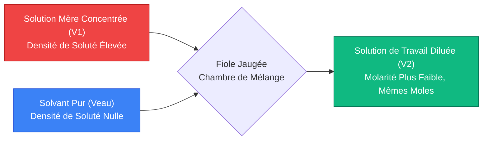
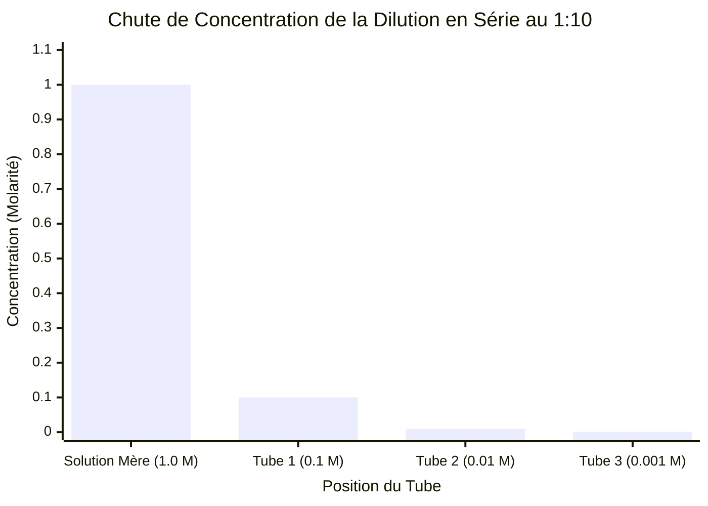
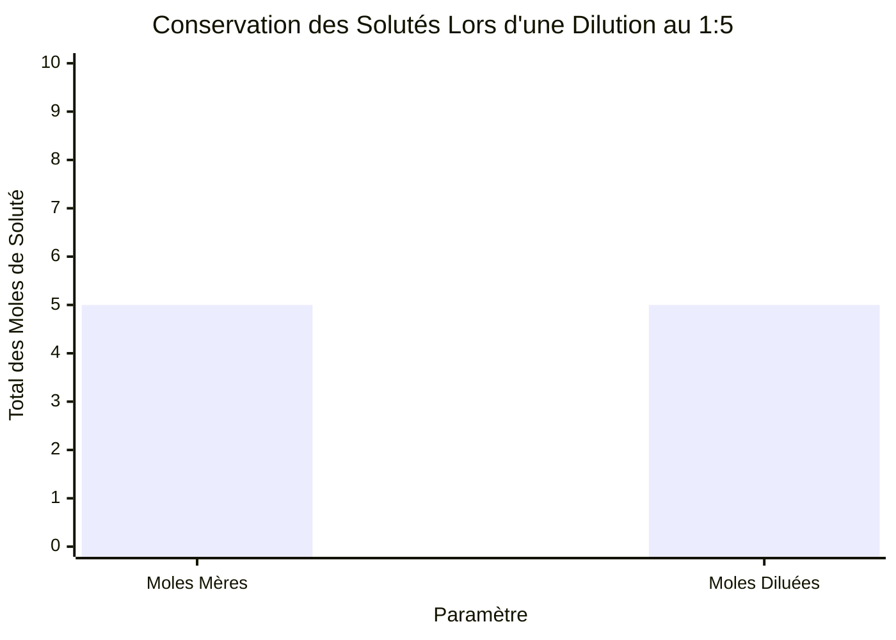
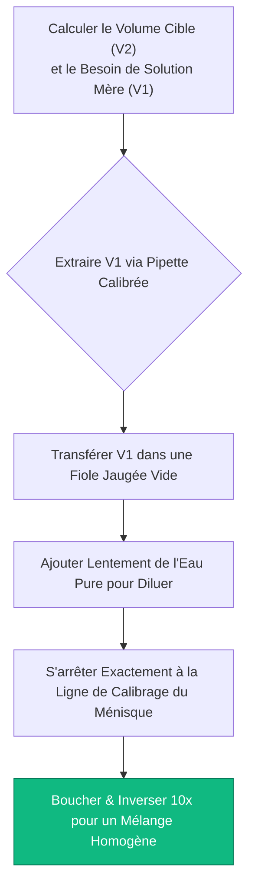
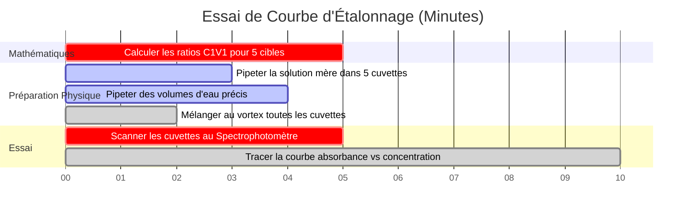

# Le Calculateur Définitif de Dilution de Molarité : $C_1 V_1 = C_2 V_2$ et Préparation de Solution

Bienvenue dans le **Calculateur de Dilution de Molarité** ultime et le guide complet de préparation de solutions en laboratoire. Que vous soyez un étudiant en chimie au lycée apprenant l'équation fondamentale $C_1 V_1 = C_2 V_2$, un biochimiste préparant des solutions tampons complexes pour l'extraction de protéines, ou un microbiologiste exécutant des dilutions en série précises pour calculer les unités formatrices de colonies bactériennes, la maîtrise de la dilution des solutions est la base mécanique incontournable de la science expérimentale.

L'achat de solutions chimiques pré-mélangées à des concentrations exactes est d'un coût prohibitif et extrêmement inefficace. Au lieu de cela, les laboratoires modernes achètent des **Solutions Mères** très concentrées. En pipetant des micro-volumes précis de ces solutions denses et en les diluant avec un solvant pur (généralement de l'eau désionisée), les chimistes peuvent fabriquer instantanément des volumes infinis de solutions de travail personnalisées à la demande.

Dans cette masterclass SEO exhaustive de plus de 4 000 mots, nous allons déconstruire complètement la thermodynamique de la conservation des solutés, prouver mathématiquement l'algorithme de dilution $C_1 V_1 = C_2 V_2$, décoder la mécanique de décroissance exponentielle des dilutions en série et exposer les erreurs de laboratoire les plus courantes qui détruisent la précision des solutions. Pour assurer une compréhension absolue, nous avons inclus cinq diagrammes interactifs Mermaid.js, sûrs pour les parseurs et méticuleusement détaillés.

---

## 1. La Physique Fondamentale de la Dilution : Conservation des Solutés

Avant de mémoriser toute équation mathématique, vous devez comprendre la physique fondamentale d'un événement de dilution.

Lorsque vous diluez une solution mère concentrée, vous ajoutez *uniquement* du solvant pur (eau). Le solvant pur contient un zéro absolu de particules de soluté. Par conséquent, le nombre total de molécules de soluté flottant dans votre bécher reste strictement et mathématiquement constant.

**La Règle d'Or de la Dilution :**
$$(\text{Total des Moles de Soluté Avant}) = (\text{Total des Moles de Soluté Après})$$

Puisque la Molarité ($M$) est définie comme des Moles par Litre ($\text{mol}/V$), nous pouvons réorganiser la définition pour prouver que $\text{Moles} = M \times V$.
Si les moles ne changent jamais pendant la dilution, alors :
$$M_{\text{initial}} \times V_{\text{initial}} = M_{\text{final}} \times V_{\text{final}}$$

Cela donne la célèbre équation de dilution, enseignée universellement à tous les étudiants en chimie du monde entier :
$$C_1 V_1 = C_2 V_2$$

*(Remarque : $C$ signifie Concentration et $V$ signifie Volume. $M_1 V_1 = M_2 V_2$ est exactement la même équation, limitant spécifiquement la concentration à la Molarité).*

---

## 2. Résoudre la Matrice $C_1 V_1 = C_2 V_2$

L'équation de dilution contient quatre variables. Si un protocole de laboratoire fournit n'importe quelles trois variables, vous pouvez calculer sans effort la quatrième en utilisant l'algèbre de base.

### Scénario A : Trouver le Volume de la Solution Mère Requis ($V_1$)
Un protocole de laboratoire vous oblige à préparer $500\text{ mL}$ d'une solution de travail d'Acide Chlorhydrique ($\text{HCl}$) à $0,5\text{ M}$. Votre armoire de stockage chimique contient une solution mère très concentrée de $\text{HCl}$ à $12,0\text{ M}$. Quelle quantité de solution mère devez-vous pipeter ?

**Données :**
- $C_1 = 12,0\text{ M}$ (Mère)
- $C_2 = 0,5\text{ M}$ (Cible)
- $V_2 = 500\text{ mL}$ (Cible)

**Calcul :**
$$V_1 = \frac{C_2 \times V_2}{C_1} = \frac{0,5 \times 500}{12,0} = \mathbf{20,83\text{ mL}}$$

Vous devez extraire avec précaution $20,83\text{ mL}$ de la dangereuse solution mère à $12,0\text{ M}$.

### Scénario B : Calculer le Volume de Solvant Ajouté ($V_{\text{eau}}$)
Dans le Scénario A, vous avez pipeté $20,83\text{ mL}$ de solution mère. Votre volume final cible est de $500\text{ mL}$. Quelle quantité d'eau pure désionisée devez-vous ajouter ?
$$V_{\text{eau}} = V_2 - V_1 = 500\text{ mL} - 20,83\text{ mL} = \mathbf{479,17\text{ mL d'Eau}}$$

---

## 3. La Puissance des Dilutions en Série

Lorsqu'un scientifique a besoin d'une concentration qui est exponentiellement plus petite que la solution mère (par ex., diluer une solution mère de $1,0\text{ M}$ jusqu'à $0,000001\text{ M}$), l'exécution d'une étape de dilution unique est physiquement impossible. Le volume de la solution mère requis ($V_1$) serait bien inférieur à une gouttelette microscopique, dépassant les limites de précision des pipettes de laboratoire modernes.

La solution est une **Dilution en Série** : une séquence de dilutions successives identiques qui déclenchent une décroissance exponentielle rapide de la concentration.

### La Séquence de Dilution en Série au 1:10
Une dilution au 1:10 signifie que $1\text{ part de solution mère}$ est mélangée avec $9\text{ parts de solvant}$, produisant $10\text{ parts de volume total}$. Cela divise parfaitement la concentration par $10$ (un Facteur de Dilution de 10).

1. **Tube 1 ($10^{-1}$) :** Mélanger $1\text{ mL}$ de Solution Mère ($1,0\text{ M}$) + $9\text{ mL}$ d'Eau $\rightarrow$ Nouvelle Concentration = $0,100\text{ M}$.
2. **Tube 2 ($10^{-2}$) :** Mélanger $1\text{ mL}$ du Tube 1 + $9\text{ mL}$ d'Eau $\rightarrow$ Nouvelle Concentration = $0,010\text{ M}$.
3. **Tube 3 ($10^{-3}$) :** Mélanger $1\text{ mL}$ du Tube 2 + $9\text{ mL}$ d'Eau $\rightarrow$ Nouvelle Concentration = $0,001\text{ M}$.

En transférant séquentiellement la solution précédemment diluée, les scientifiques peuvent atteindre des concentrations extrêmes nanomolaires avec une précision statistique massive.

---

## 4. Meilleures Pratiques de Laboratoire et Pièges de Sécurité Mortels

L'exécution de dilutions sur papier est propre et sans faille ; l'exécution de dilutions dans un laboratoire physique introduit le chaos, l'erreur humaine et des risques extrêmes pour la sécurité.

**1. Le Piège Exothermique de l'Acide (Toujours Ajouter l'Acide à l'Eau) :**
Lorsque l'acide sulfurique concentré ($\text{H}_2\text{SO}_4$) est dilué avec de l'eau, la thermodynamique d'hydratation libère violemment de la chaleur. Si vous versez de l'eau *dans* un bécher d'acide concentré, l'eau bout instantanément, projetant de l'acide bouillant sur votre visage. Vous devez *toujours* verser lentement l'acide *dans* un grand volume d'eau pour dissiper l'énergie thermique en toute sécurité.

**2. L'Erreur de Lecture du Ménisque :**
Lors de la préparation d'une solution dans une fiole jaugée, la surface du liquide se courbe vers le bas, formant une forme de « U » appelée ménisque. Vous devez aligner votre œil parfaitement à l'horizontale avec la ligne de calibrage en verre, en vous assurant que le *fond* absolu du ménisque touche la ligne. Regarder d'un angle élevé ou bas induit une erreur de parallaxe, ruinant votre volume final ($V_2$).

**3. Le Paradoxe de la Contraction Volumétrique :**
Si vous mélangez $50\text{ mL}$ d'eau et $50\text{ mL}$ d'éthanol pur, le volume final n'est PAS de $100\text{ mL}$ ; il est d'environ $96\text{ mL}$. Différentes molécules s'entassent différemment (comme verser du sable dans un seau de balles de golf). Par conséquent, vous ne devez jamais mesurer les volumes de solvant séparément. Transférez toujours d'abord votre volume de solution mère ($V_1$) dans une fiole jaugée, puis remplissez simplement la fiole *jusqu'à* la ligne de volume total ($V_2$).

---

## 5. Cinq Scénarios Conceptuels d'Ingénierie avec Visualisations 2D

Pour maîtriser pleinement les algorithmes mécaniques régissant la réduction de concentration, la conservation des solutés et les essais séquentiels en série, nous explorerons cinq scénarios de chimie analytique distincts décomposés visuellement à l'aide de diagrammes Mermaid.js personnalisés.

### Exemple 1 : L'Architecture du Mécanisme de Dilution

**Le Scénario :**
Un étudiant de première année en biologie tente de cartographier le flux massique mécanique d'un protocole de dilution de solution mère en une seule étape.

**Visualisation 2D :**
Cet organigramme cartographie visuellement comment la solution mère concentrée et le solvant pur entrent en collision à l'intérieur d'une fiole jaugée pour générer une solution de travail diluée, stable et homogène.

---

### Exemple 2 : Décroissance de la Concentration de la Dilution en Série

**Le Scénario :**
Un microbiologiste exécute une dilution en série au 1:10 en 3 étapes pour réduire la létalité d'un composé antibiotique avant de le tester sur des cellules bactériennes vivantes.

**Visualisation 2D :**
Ce graphique suit visuellement la chute exponentielle massive de la concentration molaire au fur et à mesure que le protocole de dilution progresse dans le portoir de tubes à essai.

---

### Exemple 3 : La Preuve de la Conservation des Solutés

**Le Scénario :**
Une professeure de chimie essaie de prouver à ses élèves que l'ajout de litres d'eau à une solution saline ne crée ni ne détruit par magie les molécules de sel.

**Visualisation 2D :**
Ce graphique comparatif prouve visuellement que bien que la Concentration ($M$) et le Volume ($V$) fluctuent énormément pendant la dilution, la masse totale des particules de soluté est mathématiquement verrouillée.

---

### Exemple 4 : Protocole de Préparation en Fiole Jaugée

**Le Scénario :**
Un technicien de laboratoire cartographie la procédure opératoire normalisée (PON) stricte requise pour certifier légalement une solution analytique standard pour les tests industriels alimentaires.

**Visualisation 2D :**
Cet organigramme descendant agit comme une recette chimique stricte, appliquant la séquence absolue d'actions requise pour éviter les erreurs de contraction de volume et les risques thermiques.

---

### Exemple 5 : Chronologie de l'Essai de Spectrophotométrie

**Le Scénario :**
Un chimiste analytique doit préparer un gradient parfaitement espacé de solutions de colorant diluées pour calibrer le laser d'absorbance d'un spectrophotomètre.

**Visualisation 2D :**
Ce diagramme de Gantt visualise la séquence chronologique d'un essai de calibrage en plusieurs étapes, de la mathématique et la dilution physique au calibrage final du laser.

---

## 6. Conclusion et Défi de Stœchiométrie

La maîtrise de l'algorithme de dilution $C_1 V_1 = C_2 V_2$ est l'exigence d'entrée non négociable pour entrer dans tout laboratoire biologique, chimique ou médical sur Terre. Comprendre la rigidité mathématique de la conservation des solutés, la nécessité de la verrerie jaugée pour déjouer la contraction de volume, et la puissance exponentielle des dilutions en série garantira que vos solutions de travail fonctionnent exactement comme prévu.

Si vous ne parvenez pas à maîtriser ces algorithmes, vos tampons tueront instantanément les cellules en culture, vos spectromètres de masse s'effondreront et vos données expérimentales seront totalement corrompues par l'erreur humaine.

Pour garantir que vous avez maîtrisé ces concepts critiques, démarrez notre Simulateur interactif et essayez de résoudre ces derniers défis de chimie analytique :
1. **Le Défi de l'Acide :** Vous avez besoin de $250\text{ mL}$ de $\text{H}_2\text{SO}_4$ à $2,5\text{ M}$. Votre solution mère est à $18,0\text{ M}$. Exactement combien de mL de solution mère devez-vous pipeter avec précaution ?
2. **Le Défi de l'Évaporation (Dilution Inversée) :** Vous avez $500\text{ mL}$ d'une solution saline à $1,0\text{ M}$. Vous faites bouillir le bécher jusqu'à ce qu'exactement $200\text{ mL}$ d'eau s'évaporent. Quelle est la nouvelle Molarité concentrée de la solution survivante ? (Indice : Utilisez $C_1 V_1 = C_2 V_2$, mais votre $V_2$ est $500 - 200 = 300\text{ mL}$).
3. **Le Défi en Série :** Vous exécutez une dilution au 1:5. Ensuite, vous prenez ce tube et exécutez une dilution au 1:10. Puis vous prenez *ce* tube et exécutez une dilution au 1:2. Quel est le Facteur de Dilution cumulé total ?

Comptez sur ce calculateur pour vérifier vos protocoles de laboratoire, vérifier visuellement la conservation de vos particules, et maîtriser définitivement la thermodynamique de la dilution des solutions.
