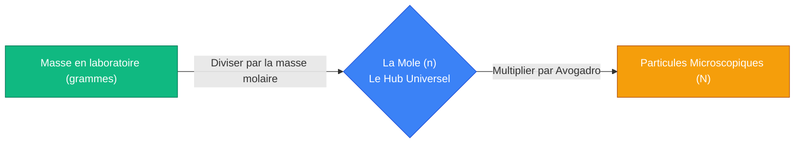
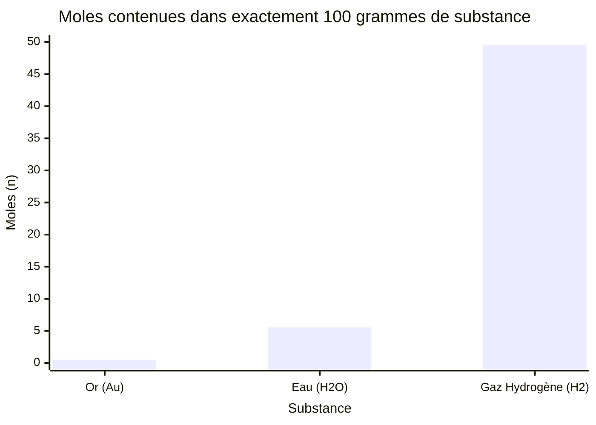
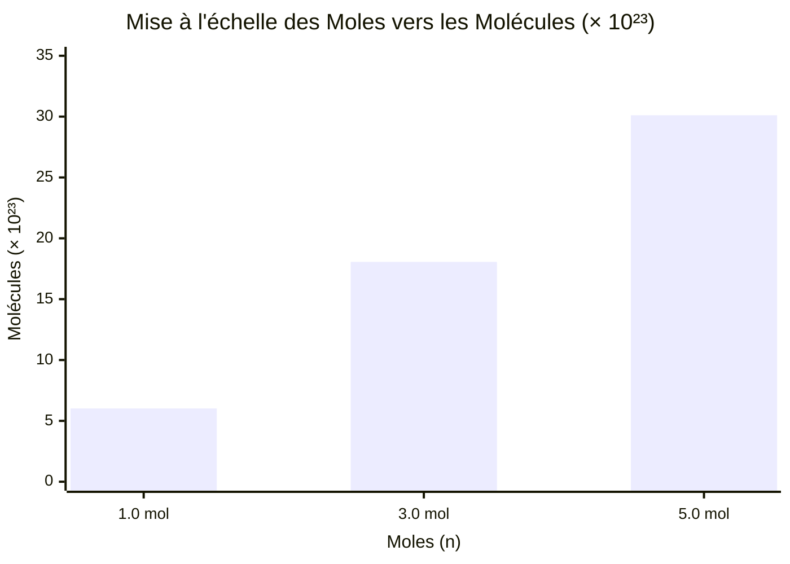
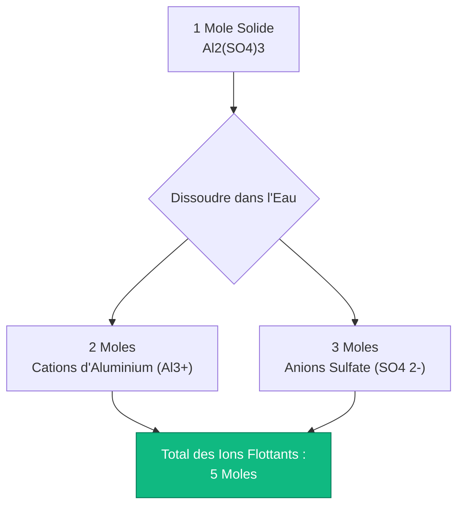
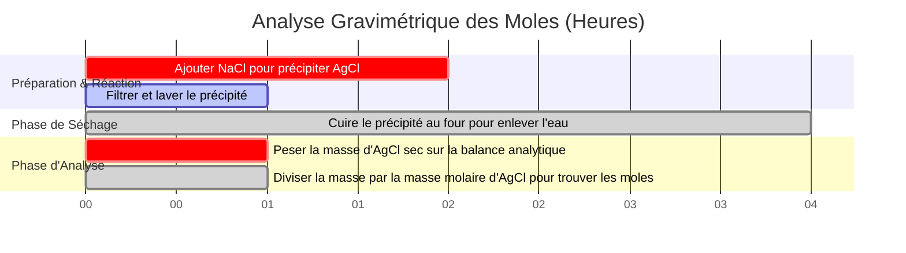

# La Calculatrice de Moles Définitive : Masse, Masse Molaire et Nombre d'Avogadro

Bienvenue sur la **Calculatrice de Moles** ultime et le guide complet de stœchiométrie chimique. Que vous soyez un lycéen équilibrant sa toute première équation chimique, un chimiste analytique calculant le rendement théorique d'une synthèse organique, ou un ingénieur pharmaceutique dosant des ingrédients actifs en milligrammes, maîtriser le concept de la mole chimique est le socle absolu de toute science quantitative.

La chimie est l'étude de la façon dont les atomes interagissent. Le problème fondamental est que les atomes sont d'une petitesse inimaginable ; une seule goutte d'eau contient plus de molécules de $\text{H}_2\text{O}$ qu'il n'y a d'étoiles dans l'univers observable. Parce que les balances de laboratoire mesurent la **Masse (grammes)** macroscopique, mais que les équations chimiques dictent le **Nombre de molécules** microscopiques, les scientifiques avaient besoin d'un pont mathématique pour relier ces deux mondes. Ce pont est la **Mole**.

Dans cette masterclass SEO exhaustive de plus de 4 000 mots, nous allons déconstruire complètement le concept du nombre d'Avogadro, prouver mathématiquement la conversion entre la masse physique et les particules microscopiques, exposer la différence cruciale entre les molécules et les unités de formule, et décoder comment des sels ioniques complexes se brisent en ions indépendants. Pour assurer une compréhension absolue, nous avons inclus cinq diagrammes interactifs Mermaid.js méticuleusement détaillés et compatibles avec les analyseurs.

---

## 1. La Physique de la Mole ($n$) et le Nombre d'Avogadro ($N_A$)

Le concept le plus critique absolu dans toute la chimie est de comprendre que la "Mole" est simplement une unité de comptage. 
- Une "douzaine" signifie exactement 12 de quelque chose. 
- Une "grosse" signifie exactement 144 de quelque chose.
- Une **"Mole" ($n$)** signifie exactement **$6,02214076 \times 10^{23}$** de quelque chose.

Ce nombre astronomiquement gigantesque est connu sous le nom de **Constante d'Avogadro ($N_A$)**.
Si vous aviez une mole de billes, elles couvriraient la surface entière de la Terre sur une profondeur de plusieurs kilomètres. Cependant, parce que les atomes sont si petits, une mole d'eau liquide ne fait que $18,015\text{ mL}$ (environ une seule cuillère à soupe).

**L'Équation des Particules :**
$$\text{Nombre de Particules (N)} = \text{Moles (n)} \times \text{Nombre d'Avogadro (}N_A\text{)}$$

### Qu'est-ce qu'une "Particule" ?
Le terme "particule" est un espace réservé générique. Vous devez utiliser la terminologie correcte en fonction de la substance chimique :
- **Atomes :** Pour les éléments purs (par ex., $1,0\text{ mole}$ d'Or = $6,022 \times 10^{23}\text{ atomes d'Or}$).
- **Molécules :** Pour les composés à liaisons covalentes (par ex., $1,0\text{ mole}$ de $\text{H}_2\text{O}$ = $6,022 \times 10^{23}\text{ molécules d'Eau}$).
- **Unités de Formule :** Pour les réseaux cristallins ioniques (par ex., $1,0\text{ mole}$ de $\text{NaCl}$ = $6,022 \times 10^{23}\text{ unités de formule de NaCl}$).
- **Ions :** Pour les particules chargées dissoutes (par ex., $1,0\text{ mole}$ de $\text{Na}^+$ = $6,022 \times 10^{23}\text{ ions Sodium}$).

---

## 2. Masse Molaire : Le Pont Entre Masse et Moles

Pour combler le fossé entre le comptage de particules microscopiques et la pesée de poudres macroscopiques en laboratoire, nous utilisons la **Masse Molaire ($\text{MM}$)**.
La masse molaire de toute substance chimique est précisément définie comme la masse physique (en grammes) d'exactement $1,0\text{ mole}$ de cette substance.

En regardant le tableau périodique, nous voyons que le poids atomique du carbone est de $12,011$. Cela signifie qu'exactement $1,0\text{ mole}$ d'atomes de carbone pèse exactement $12,011\text{ grammes}$.

**Calcul de la Masse Molaire d'un Composé :**
Pour trouver la masse molaire d'une molécule complexe comme le glucose ($\text{C}_6\text{H}_{12}\text{O}_6$), nous additionnons les poids atomiques de tous les atomes constitutifs :
- Carbone ($6 \times 12,011$) = $72,066\text{ g/mol}$
- Hydrogène ($12 \times 1,008$) = $12,096\text{ g/mol}$
- Oxygène ($6 \times 15,999$) = $95,994\text{ g/mol}$
- **Masse Molaire Totale** = $180,156\text{ g/mol}$

**L'Équation Masse-vers-Mole :**
$$\text{Moles (n)} = \frac{\text{Masse Physique (grammes)}}{\text{Masse Molaire (g/mol)}}$$

Si vous pesez $90,078\text{ grammes}$ de poudre de glucose sur une balance de laboratoire, vous possédez exactement $0,50\text{ mole}$ de glucose.

---

## 3. Stœchiométrie Avancée : Comptage d'Atomes et d'Ions

Le concept de la mole devient considérablement plus complexe lorsque vous réalisez qu'une seule molécule chimique est composée de multiples sous-particules.

### Comptage d'Atomes Covalents
Considérez exactement $1,0\text{ mole}$ d'Eau ($\text{H}_2\text{O}$).
- Vous avez $1,0\text{ mole}$ de **molécules** de $\text{H}_2\text{O}$ ($6,022 \times 10^{23}\text{ molécules}$).
- Parce que chaque molécule contient exactement $2$ atomes d'Hydrogène, vous possédez $2,0\text{ moles}$ d'**atomes** d'Hydrogène ($1,204 \times 10^{24}\text{ atomes H}$).
- Parce que chaque molécule contient exactement $1$ atome d'Oxygène, vous possédez $1,0\text{ mole}$ d'**atomes** d'Oxygène ($6,022 \times 10^{23}\text{ atomes O}$).
- Au total, votre unique mole de molécules d'eau contient **$3,0\text{ moles}$ d'atomes au total**.

### Comptage de Dissociation Ionique
Lorsque les sels ioniques se dissolvent dans l'eau, ils se brisent physiquement en ions flottants indépendants. Ceci est critique pour l'électrochimie et les propriétés colligatives.
Considérez $1,0\text{ mole}$ de Chlorure de Calcium ($\text{CaCl}_2$).
- $\text{CaCl}_2$ se dissocie physiquement en un ion $\text{Ca}^{2+}$ et deux ions $\text{Cl}^-$.
- $\text{CaCl}_2 \rightarrow \text{Ca}^{2+} + 2\text{Cl}^-$
- Par conséquent, $1,0\text{ mole}$ de poudre de $\text{CaCl}_2$ solide génère **$3,0\text{ moles}$ d'ions dissous**.

---

## 4. Cinq Scénarios d'Ingénierie Conceptuelle avec Visualisations 2D

Pour maîtriser pleinement les relations physiques régissant les moles, la masse et les particules, nous allons explorer cinq scénarios de laboratoire distincts, décomposés visuellement à l'aide de diagrammes personnalisés Mermaid.js.

### Exemple 1 : Le Pipeline de Conversion Universelle de la Mole

**Le Scénario :**
Un étudiant en chimie doit convertir un bloc de fer solide de $50,0\text{ grammes}$ en un compte exact d'atomes de fer individuels.

**Visualisation 2D :**
Cet organigramme logique cartographie le chemin de conversion bipartite strict. Vous ne pouvez pas passer directement de la masse aux particules ; vous devez toujours passer par le hub central de la "Mole".

---

### Exemple 2 : Masse vs Moles (Variance de Densité de Substance)

**Le Scénario :**
Un chercheur possède exactement $100,0\text{ grammes}$ de trois substances différentes : du gaz hydrogène ($\text{H}_2$), de l'eau liquide ($\text{H}_2\text{O}$) et de l'or solide ($\text{Au}$). Parce que leurs masses molaires diffèrent radicalement, le nombre de moles (et donc de particules) présentes dans cette masse de $100\text{g}$ diffère énormément.

**Les Mathématiques :**
- $\text{H}_2$ : $100\text{g} / 2,016\text{ g/mol} = 49,6\text{ moles}$.
- $\text{H}_2\text{O}$ : $100\text{g} / 18,015\text{ g/mol} = 5,55\text{ moles}$.
- $\text{Au}$ : $100\text{g} / 196,97\text{ g/mol} = 0,50\text{ moles}$.

**Visualisation 2D :**
Ce graphique prouve visuellement que des masses physiques égales ne correspondent PAS à des nombres de particules égaux. Les atomes lourds comme l'or produisent très peu de particules par gramme.

---

### Exemple 3 : L'Effet de Multiplication d'Avogadro

**Le Scénario :**
Un professeur de lycée souhaite démontrer visuellement à quelle vitesse le nombre de particules augmente lorsque l'on augmente le nombre de moles de $1,0$ à $5,0$.

**Les Mathématiques :**
La relation est strictement linéaire, mais la pente est d'une raideur impossible de $6,022 \times 10^{23}$.

**Visualisation 2D :**
Ce graphique trace la corrélation directe entre les moles et le nombre total de molécules (à l'échelle $10^{23}$).

---

### Exemple 4 : L'Architecture d'Éclatement Ionique (Dissociation)

**Le Scénario :**
Un électrochimiste dissout exactement $1,0\text{ mole}$ de sulfate d'aluminium solide ($\text{Al}_2(\text{SO}_4)_3$) dans l'eau et doit cartographier le compte molaire exact des cations et anions résultants.

**Visualisation 2D :**
Cet organigramme descendant cartographie la cascade de dissociation ionique, prouvant comment une seule mole macroscopique de sel se brise en cinq moles thermodynamiques indépendantes d'ions.

---

### Exemple 5 : Chronologie de l'Analyse Gravimétrique

**Le Scénario :**
Un chimiste analytique précipite du chlorure d'argent ($\text{AgCl}$) à partir d'une solution pour déterminer la masse initiale d'argent dans un échantillon d'eau contaminée.

**Visualisation 2D :**
Ce diagramme de Gantt visualise la séquence chronologique d'une expérience d'analyse gravimétrique, reliant la filtration de la masse physique aux calculs stœchiométriques de moles.

---

## 5. Conclusion et Défi de Stœchiométrie

Maîtriser la mole est le fondement incontournable de toutes les sciences physiques. Comprendre la stricte différence entre la masse et le nombre de particules, respecter l'immense échelle du nombre d'Avogadro, et modéliser mathématiquement la dissociation ionique garantiront que vos rendements de laboratoire sont exacts et que vos équations chimiques s'équilibrent parfaitement.

Si vous ignorez ces principes mathématiques, vous confondrez les grammes avec les moles, prédirez incorrectement les rendements chimiques, et échouerez à tous les examens de stœchiométrie que vous passerez jamais.

Pour garantir que vous avez maîtrisé ces concepts critiques, démarrez notre simulateur interactif et essayez de résoudre ces défis finaux sur les moles :
1. **Le Défi de Masse :** Vous avez besoin d'exactement $0,350\text{ mole}$ de sulfate de cuivre(II) pentahydraté ($\text{CuSO}_4\cdot 5\text{H}_2\text{O}$, $\text{MM} = 249,68\text{ g/mol}$). Exactement combien de grammes devez-vous peser sur la balance analytique ?
2. **Le Défi de Particules :** Vous buvez un verre contenant $250,0\text{ grammes}$ d'eau pure. Exactement combien de molécules individuelles de $\text{H}_2\text{O}$ venez-vous de consommer ?
3. **Le Défi d'Ions :** Vous dissolvez $100,0\text{ grammes}$ de $\text{CaCl}_2$ dans une piscine. Exactement combien de moles totales d'ions flottants venez-vous d'ajouter à l'eau ?

Fiez-vous à cette calculatrice pour vérifier vos devoirs, dériver rapidement des masses molaires complexes, et maîtriser définitivement les mathématiques de la stœchiométrie chimique.
