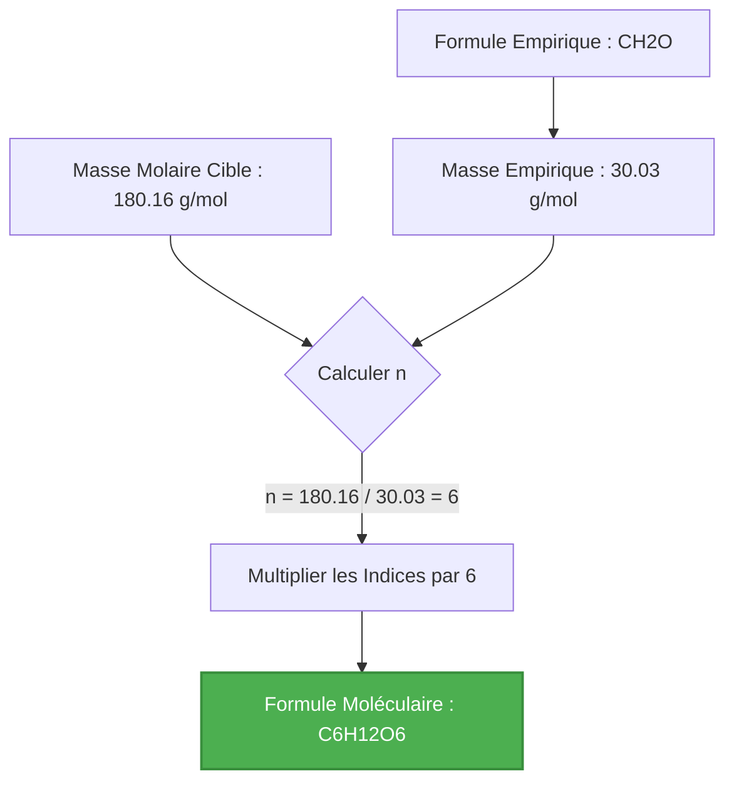

# Guide de Chimie Analytique et de Laboratoire sur les Formules Moléculaires & les Mathématiques des Multiplicateurs

En chimie analytique et en spectrométrie de masse, déterminer la **Formule Moléculaire** d'un composé nécessite de lier sa **Formule Empirique** à sa **Masse Molaire Moléculaire** expérimentale :

$$\text{Formule Moléculaire} = (\text{Formule Empirique})_n \quad \text{où} \quad n = \frac{\text{Masse Molaire Moléculaire}}{\text{Masse de la Formule Empirique}}$$

---

## 1. Matrice de Conversion Empirique à Moléculaire

| Nom du Composé | Formule Empirique | Masse Empirique ($M_{\text{emp}}$) | Masse Molaire ($M$) | Multiplicateur ($n$) | Formule Moléculaire |
| :--- | :--- | :--- | :--- | :--- | :--- |
| **Formaldéhyde** | $\text{CH}_2\text{O}$ | $30.026\text{ g/mol}$ | $30.026\text{ g/mol}$ | $n = 1$ | $\text{CH}_2\text{O}$ |
| **Acide Acétique** | $\text{CH}_2\text{O}$ | $30.026\text{ g/mol}$ | $60.052\text{ g/mol}$ | $n = 2$ | $\text{C}_2\text{H}_4\text{O}_2$ |
| **Glucose** | $\text{CH}_2\text{O}$ | $30.026\text{ g/mol}$ | $180.156\text{ g/mol}$ | $n = 6$ | $\text{C}_6\text{H}_{12}\text{O}_6$ |
| **Benzène** | $\text{CH}$ | $13.019\text{ g/mol}$ | $78.114\text{ g/mol}$ | $n = 6$ | $\text{C}_6\text{H}_6$ |
| **Tétroxyde de Diazote** | $\text{NO}_2$ | $46.005\text{ g/mol}$ | $92.011\text{ g/mol}$ | $n = 2$ | $\text{N}_2\text{O}_4$ |

---

## 2. Protocole de Calcul Standard de Formule Moléculaire

```
   Étape 1 : Déterminez la formule empirique du composé.
   Étape 2 : Calculez la Masse de la Formule Empirique (somme des masses atomiques des indices empiriques).
   Étape 3 : Obtenez la Masse Molaire Moléculaire expérimentale (ex. par Spectrométrie de Masse).
   Étape 4 : Calculez le multiplicateur entier n = Masse Molaire Moléculaire / Masse Empirique.
   Étape 5 : Multipliez chaque indice empirique par n pour obtenir la Formule Moléculaire finale.
   Étape 6 : Vérifiez que la masse molaire moléculaire calculée correspond à la masse molaire cible.
```

---

## 3. Avertissement Éducatif et de Sécurité en Laboratoire
*Ce calculateur de formule moléculaire fournit des dérivations de formules préliminaires pour l'éducation, la chimie AP et la planification de la recherche. Les données expérimentales de masse molaire doivent être confirmées à l'aide d'une spectrométrie de masse à haute résolution (HRMS) ou d'une chromatographie en phase gazeuse couplée à la spectrométrie de masse (GC-MS).*

## 4. Le Guide Complet des Formules Moléculaires

Bienvenue dans le guide définitif sur la compréhension, le calcul et l'application des formules moléculaires en chimie. Que vous soyez un lycéen s'attaquant à la stœchiométrie pour la première fois, un étudiant en chimie AP se préparant aux examens, ou un technicien de laboratoire analysant des données de spectrométrie de masse, cette ressource complète est conçue pour illuminer le monde fascinant des formules chimiques.

À la base, la chimie est l'étude de la matière et de ses transformations. Pour comprendre ces transformations, nous devons avoir un langage précis pour décrire la composition de la matière. Ce langage est écrit en formules chimiques. Bien que les formules empiriques nous donnent le rapport le plus simple des éléments dans un composé, elles ne racontent pas toute l'histoire. La **formule moléculaire** est la véritable identité d'une molécule, révélant le nombre exact de chaque type d'atome présent.

Dans ce guide exhaustif, nous explorerons la mécanique profonde des formules moléculaires, comment elles se rapportent à leurs homologues empiriques, et le multiplicateur mathématique ($n$) qui comble l'écart entre elles. Nous plongerons également dans des applications du monde réel, l'utilisation étape par étape de notre Calculateur de Formule Moléculaire, et cinq exemples profondément détaillés complets avec des dérivations mathématiques et des visualisations 2D.

### 4.1 Qu'est-ce qu'une Formule Moléculaire ?

Une formule moléculaire est une formule chimique qui indique le nombre exact d'atomes de chaque élément dans une seule molécule d'une substance. C'est le "plan" chimique d'une molécule. Par exemple, la formule moléculaire de l'eau est $\text{H}_2\text{O}$, ce qui signifie que chaque molécule se compose précisément de deux atomes d'hydrogène et d'un atome d'oxygène. La formule moléculaire du glucose est $\text{C}_6\text{H}_{12}\text{O}_6$, ce qui nous indique qu'une seule molécule de sucre contient 6 atomes de carbone, 12 atomes d'hydrogène et 6 atomes d'oxygène.

En revanche, une **formule empirique** ne fournit que le rapport entier le plus simple d'atomes. Pour le glucose, diviser les indices par leur plus grand commun diviseur (6) donne la formule empirique $\text{CH}_2\text{O}$. Remarquez comment plusieurs composés peuvent partager exactement la même formule empirique. Le formaldéhyde ($\text{CH}_2\text{O}$), l'acide acétique ($\text{C}_2\text{H}_4\text{O}_2$) et le glucose partagent tous la formule empirique $\text{CH}_2\text{O}$. La formule moléculaire est ce qui distingue le conservateur toxique (formaldéhyde) du composant acide du vinaigre (acide acétique) et de la source d'énergie essentielle pour la respiration cellulaire (glucose).

### 4.2 Le Rôle de la Masse Molaire

Si la formule empirique donne le rapport et que la formule moléculaire donne le compte exact, comment passons-nous de l'une à l'autre ? Le chaînon manquant est la **masse molaire** (ou poids moléculaire).

Lorsqu'un chimiste synthétise un nouveau composé, il peut utiliser l'analyse élémentaire pour trouver les pourcentages massiques de chaque élément, ce qui se convertit facilement en une formule empirique. Cependant, pour trouver la véritable formule moléculaire, il doit déterminer la masse molaire du composé en utilisant des techniques comme la spectrométrie de masse ou l'abaissement cryoscopique.

En comparant la masse théorique de la formule empirique (la masse empirique) à la masse molaire réelle du composé, nous pouvons déterminer combien d'"unités" empiriques tiennent dans une molécule réelle.

### 4.3 La Relation Mathématique

La relation entre la formule empirique et moléculaire est d'une élégance simple. La formule moléculaire est toujours un multiple entier de la formule empirique. Nous notons ce multiplicateur entier comme $n$.

$$ \text{Formule Moléculaire} = (\text{Formule Empirique}) \times n $$

Pour trouver ce multiplicateur, nous utilisons le rapport des masses molaires :

$$ n = \frac{\text{Masse Molaire Réelle du Composé}}{\text{Masse de la Formule Empirique}} $$

Parce que vous ne pouvez pas avoir une fraction d'atome dans une molécule standard, $n$ doit être un nombre entier (1, 2, 3, etc.). Dans des données expérimentales réelles, de légères erreurs de mesure pourraient donner une valeur comme 5,98 ou 6,03, que nous arrondissons avec confiance à 6. Cependant, si le calcul donne une valeur comme 4,5, c'est un indicateur fort que soit la formule empirique a été calculée incorrectement, soit les données de masse molaire sont erronées.

Pour plus d'informations sur les principes fondamentaux de la chimie, vous pouvez explorer le [Livre d'Or de l'UICPA](https://goldbook.iupac.org/) ou les [ressources de chimie de la NASA](https://www.nasa.gov/).

---

## 5. Guide d'Utilisation : Maîtriser le Calculateur de Formule Moléculaire

Notre Calculateur de Formule Moléculaire est conçu pour être un outil intuitif mais profondément puissant pour les étudiants et les professionnels. Suivez ce guide étape par étape pour libérer tout son potentiel.

### 5.1 Sélection du Mode de Calcul

Le calculateur dispose de plusieurs modes pour s'adapter aux diverses façons dont les données chimiques sont présentées dans les problèmes et les laboratoires.

1. **Formule Empirique + Masse Molaire :** Le mode le plus courant. Vous entrez la formule empirique et la masse molaire déterminée expérimentalement. Le calculateur trouve le multiplicateur $n$ et affiche la formule moléculaire.
2. **Mode de Masse Relative (Mr) :** Similaire à ce qui précède, mais utilise la Masse Moléculaire Relative, qui est sans dimension mais numériquement équivalente à la masse molaire.
3. **Composition en Pourcentage :** Vous permet d'entrer directement les pourcentages massiques des éléments, contournant le besoin de calculer vous-même la formule empirique.
4. **Analyseur de Masse de Formule :** Un mode utilitaire qui calcule rapidement la masse molaire exacte de toute formule moléculaire complexe entrée.
5. **Réduction des Indices :** Un outil qui prend une grande formule moléculaire et la réduit automatiquement à sa forme empirique en utilisant les mathématiques du Plus Grand Commun Diviseur (PGCD).

### 5.2 Saisie des Formules Chimiques

Lors de la saisie de formules chimiques, notre analyseur est conçu pour être très indulgent et intelligent, mais suivre la notation chimique standard garantit les meilleurs résultats.

*   **Majuscules :** Mettez toujours la première lettre du symbole d'un élément en majuscule. Utilisez des minuscules pour la deuxième lettre (ex. utilisez `Na` pour Sodium, pas `NA` ou `na`).
*   **Indices :** Entrez les nombres directement après le symbole de l'élément sans espaces (ex. `H2O`, `C6H12O6`). Le calculateur les formatera automatiquement comme indices dans l'affichage des résultats.
*   **Parenthèses :** Vous pouvez utiliser des parenthèses pour les ions polyatomiques ou les groupes répétés (ex. `Ca(OH)2` ou `(NH4)2SO4`). L'analyseur comprend comment distribuer l'indice externe aux éléments internes.

### 5.3 Analyse de la Sortie des Résultats

Une fois que vous exécutez le calcul, le "Cockpit Interactif" affichera une mine d'informations :

*   **Masse de la Formule Empirique :** La masse exacte de l'unité empirique, calculée à l'aide de poids atomiques de haute précision.
*   **Masse Molaire Cible :** Une reformulation de votre saisie pour vérification.
*   **Le Multiplicateur ($n$) :** Le cœur du calcul. L'interface montrera la division exacte (ex. 180,16 / 30,03 = 6,00) et validera que c'est un entier. Si $n$ n'est pas proche d'un nombre entier, un avertissement apparaîtra.
*   **Formule Moléculaire Finale :** Le résultat, magnifiquement formaté. Par défaut, les composés contenant du carbone sont ordonnés en utilisant le **Système de Hill Organique** (Carbone en premier, Hydrogène en second, puis par ordre alphabétique).

### 5.4 Utilisation des Visualisations

Le calculateur inclut un Graphique en Anneau Recharts qui décompose visuellement la contribution massique de chaque élément dans la molécule finale. Ceci est exceptionnellement utile pour vérifier visuellement les problèmes de composition en pourcentage. Vous pouvez survoler les segments pour voir les points de données précis.

---

## 6. Cinq Exemples de Concepts du Monde Réel

Pour vraiment maîtriser les formules moléculaires, il faut voir les mathématiques appliquées à des scénarios réels. Ci-dessous se trouvent cinq exemples profondément détaillés allant de la stœchiométrie d'introduction à l'analyse biochimique avancée.

### Exemple 1 : La Brique de Construction de la Vie (Glucose)

**Scénario :**
Un biochimiste isole une substance cristalline pure de la sève de plante. L'analyse élémentaire révèle qu'elle se compose de 40,00 % de Carbone, 6,71 % d'Hydrogène et 53,29 % d'Oxygène en masse. Cela donne une formule empirique de $\text{CH}_2\text{O}$. La spectrométrie de masse ultérieure détermine que la masse molaire du composé est d'environ $180,16\text{ g/mol}$. Quelle est la formule moléculaire ?

**Dérivation Mathématique :**

1.  **Identifier la Formule Empirique :** $\text{CH}_2\text{O}$
2.  **Calculer la Masse Empirique ($M_{\text{emp}}$) :**
    *   C: $1 \times 12,011\text{ g/mol} = 12,011$
    *   H: $2 \times 1,008\text{ g/mol} = 2,016$
    *   O: $1 \times 15,999\text{ g/mol} = 15,999$
    *   $M_{\text{emp}} = 12,011 + 2,016 + 15,999 = 30,026\text{ g/mol}$
3.  **Déterminer le Multiplicateur ($n$) :**
    $$ n = \frac{\text{Masse Molaire}}{M_{\text{emp}}} = \frac{180,16}{30,026} \approx 6 $$
4.  **Calculer la Formule Moléculaire :**
    $$ (\text{CH}_2\text{O}) \times 6 = \text{C}_6\text{H}_{12}\text{O}_6 $$

**Visualisation : Organigramme de Calcul**



*Cet organigramme illustre la progression linéaire simple des données empiriques au plan moléculaire final du glucose, la principale source d'énergie pour la vie cellulaire.*

### Exemple 2 : Le Propergol de Fusée (Hydrazine)

**Scénario :**
Les ingénieurs en aérospatiale de la NASA testent un composé azote-hydrogène hautement réactif utilisé comme monergol dans les propulseurs de satellites. La formule empirique est déterminée comme étant $\text{NH}_2$. Les données expérimentales montrent que la vapeur a une densité qui correspond à une masse molaire de $32,05\text{ g/mol}$. Trouvez la formule moléculaire.

**Dérivation Mathématique :**

1.  **Identifier la Formule Empirique :** $\text{NH}_2$
2.  **Calculer la Masse Empirique ($M_{\text{emp}}$) :**
    *   N: $1 \times 14,007 = 14,007$
    *   H: $2 \times 1,008 = 2,016$
    *   $M_{\text{emp}} = 14,007 + 2,016 = 16,023\text{ g/mol}$
3.  **Déterminer le Multiplicateur ($n$) :**
    $$ n = \frac{32,05}{16,023} = 1,999 \approx 2 $$
4.  **Calculer la Formule Moléculaire :**
    $$ (\text{NH}_2) \times 2 = \text{N}_2\text{H}_4 $$

**Visualisation : Tableau de Comparaison de Masse**

| Composant | Formule | Masse (g/mol) | % d'Azote | % d'Hydrogène |
| :--- | :--- | :--- | :--- | :--- |
| **Base Empirique** | $\text{NH}_2$ | 16,023 | 87,4 % | 12,6 % |
| **Molécule Réelle** | $\text{N}_2\text{H}_4$ | 32,046 | 87,4 % | 12,6 % |

*Remarquez comment le pourcentage massique des éléments reste absolument identique entre les formules empiriques et moléculaires, même si la masse totale double.*

### Exemple 3 : L'Analgésique (Ibuprofène)

**Scénario :**
Un laboratoire pharmaceutique synthétise un lot d'ibuprofène. La formule empirique s'avère être $\text{C}_{13}\text{H}_{18}\text{O}_2$. Le spectromètre de masse du laboratoire mesure le pic de l'ion moléculaire à $m/z = 206,29$, indiquant une masse molaire de $206,29\text{ g/mol}$. Quelle est la véritable formule moléculaire de l'ibuprofène ?

**Dérivation Mathématique :**

1.  **Identifier la Formule Empirique :** $\text{C}_{13}\text{H}_{18}\text{O}_2$
2.  **Calculer la Masse Empirique ($M_{\text{emp}}$) :**
    *   C: $13 \times 12,011 = 156,143$
    *   H: $18 \times 1,008 = 18,144$
    *   O: $2 \times 15,999 = 31,998$
    *   $M_{\text{emp}} = 156,143 + 18,144 + 31,998 = 206,285\text{ g/mol}$
3.  **Déterminer le Multiplicateur ($n$) :**
    $$ n = \frac{206,29}{206,285} \approx 1 $$
4.  **Calculer la Formule Moléculaire :**
    $$ (\text{C}_{13}\text{H}_{18}\text{O}_2) \times 1 = \text{C}_{13}\text{H}_{18}\text{O}_2 $$

**Visualisation : La Chronologie du Scénario "n = 1"**

```mermaid
gantt
    title Flux de Travail en Laboratoire : Identification de l'Ibuprofène
    dateFormat  HH:mm:ss
    axisFormat  %H:%M
    section Synthèse
    Préparation du Lot       :active, 00:00:00, 00:02:00
    section Analyse
    Analyse Élémentaire (Empirique) :crit, active, 00:02:00, 00:04:00
    Spectrométrie de Masse (Masse Molaire) :active, 00:04:00, 00:06:00
    section Conclusion
    Calculer le Multiplicateur (n=1) :done, 00:06:00, 00:07:00
    Formule Confirmée Identique :milestone, 00:07:00, 00:07:00
```



*Ce diagramme de Gantt représente une chronologie typique de laboratoire. Parce que $n = 1$, la formule empirique et la formule moléculaire sont identiques. C'est courant dans de nombreux produits pharmaceutiques organiques complexes où la structure ne peut pas être divisée symétriquement.*

### Exemple 4 : L'Hydrocarbure Aromatique (Benzène)

**Scénario :**
Un chimiste organicien étudie un liquide très inflammable à l'odeur sucrée. La formule empirique est simplement $\text{CH}$, indiquant un rapport de 1:1 de carbone à l'hydrogène. La masse molaire est déterminée par abaissement cryoscopique à $78,11\text{ g/mol}$.

**Dérivation Mathématique :**

1.  **Identifier la Formule Empirique :** $\text{CH}$
2.  **Calculer la Masse Empirique ($M_{\text{emp}}$) :**
    *   $12,011 + 1,008 = 13,019\text{ g/mol}$
3.  **Déterminer le Multiplicateur ($n$) :**
    $$ n = \frac{78,11}{13,019} \approx 6 $$
4.  **Calculer la Formule Moléculaire :**
    $$ (\text{CH}) \times 6 = \text{C}_6\text{H}_6 $$

**Visualisation : Processus de Mise à l'Échelle des Indices**


*La structure en anneau du benzène nécessite 6 carbones. La formule empirique $\text{CH}$ ne donne aucune indication de cette géométrie en anneau, soulignant pourquoi la détermination de la véritable formule moléculaire ($\text{C}_6\text{H}_6$) est une étape critique en chimie organique.*

### Exemple 5 : Le Précurseur de Polymère Mystère (Éthylène vs Butène)

**Scénario :**
Une usine pétrochimique raffine un flux de gaz. L'analyse montre une formule empirique de $\text{CH}_2$. Cependant, selon la pression et la température de la colonne de distillation, le gaz pourrait être de l'éthylène ($28,05\text{ g/mol}$) ou du butène ($56,11\text{ g/mol}$). L'échantillon actuel a une masse molaire de $56,11\text{ g/mol}$.

**Dérivation Mathématique :**

1.  **Identifier la Formule Empirique :** $\text{CH}_2$
2.  **Calculer la Masse Empirique ($M_{\text{emp}}$) :**
    *   $12,011 + (2 \times 1,008) = 14,027\text{ g/mol}$
3.  **Déterminer le Multiplicateur ($n$) :**
    $$ n = \frac{56,11}{14,027} \approx 4 $$
4.  **Calculer la Formule Moléculaire :**
    $$ (\text{CH}_2) \times 4 = \text{C}_4\text{H}_8 \text{ (Butène)} $$

*Si la masse molaire avait été de $28,05\text{ g/mol}$, $n$ aurait été 2, produisant de l'éthylène ($\text{C}_2\text{H}_4$). Cela démontre comment les calculs de formule moléculaire sont utilisés dans l'industrie pour différencier des produits chimiques distincts qui partagent les mêmes rapports fondamentaux.*

---

## 7. FAQ Approfondie et Dépannage Avancé

Au fur et à mesure que vous utilisez le Calculateur de Formule Moléculaire pour des problèmes de chimie AP ou de niveau universitaire plus complexes, vous pouvez rencontrer des cas particuliers. Cette section FAQ aborde les nuances des mathématiques moléculaires.

**Q : Que se passe-t-il si mon $n$ calculé est un nombre comme 4,5 ?**
**R :** Dans les problèmes de formule moléculaire standard, $n$ doit être un entier. Si vous calculez $n = 4,5$, vous avez probablement fait une erreur dans la détermination de la formule empirique. Par exemple, si vous avez mal calculé une formule empirique de $\text{CH}_3$ (masse $\approx 15$) pour un composé avec une masse molaire de $\approx 58$, $58 / 15 = 3,86$. Cela signifie que $\text{CH}_3$ était erroné (la vraie formule empirique était probablement $\text{C}_2\text{H}_5$, masse $\approx 29$, donnant $n=2$ pour $\text{C}_4\text{H}_{10}$).

**Q : Le calculateur utilise-t-il des masses isotopiques exactes ?**
**R :** Le calculateur utilise les masses atomiques moyennes pondérées par l'abondance naturelle standard (ex. Carbone = 12,011) sanctionnées par l'UICPA. Pour la synthèse chimique standard et les problèmes de devoirs, c'est très précis. Si vous effectuez une spectrométrie de masse à haute résolution (HRMS) en examinant des isotopes spécifiques (comme le Carbone 13), vous devrez tenir compte manuellement de la masse isotopique exacte.

**Q : Un composé peut-il avoir une formule empirique avec un multiplicateur de $n = 100$ ?**
**R :** Absolument ! En chimie des polymères, les molécules peuvent être massives. Par exemple, le polyéthylène est essentiellement une chaîne d'unités $\text{CH}_2$. Un seul brin de polyéthylène pourrait avoir une formule empirique de $\text{CH}_2$ et une masse molaire de $140 000\text{ g/mol}$, entraînant un multiplicateur de $n = 10 000$.

**Q : Pourquoi le calculateur réorganise-t-il ma sortie dans le Système de Hill ?**
**R :** Le Système de Hill est la norme internationalement reconnue pour l'écriture de formules chimiques. Il évite la confusion en garantissant que les formules sont écrites de manière uniforme dans toute la littérature. Le carbone est listé en premier, l'hydrogène en second, et tous les autres éléments suivent par ordre alphabétique. Par exemple, au lieu d'écrire $\text{ClCH}_3$, le système de Hill le normalise en $\text{CH}_3\text{Cl}$. Notre calculateur applique automatiquement cette norme pour s'assurer que vos réponses sont formatées de manière professionnelle.

**Q : Comment cela se rapporte-t-il au Concept de Mole ?**
**R :** La masse molaire utilisée dans ces calculs est directement liée au nombre d'Avogadro ($6,022 \times 10^{23}$). La masse empirique est la masse d'une mole d'unités empiriques, et la masse moléculaire est la masse d'une mole de molécules réelles. Le multiplicateur $n$ vous indique combien de moles d'unités empiriques se trouvent à l'intérieur d'une mole de la substance réelle. Pour en savoir plus sur les moles, consultez notre [Calculateur de Mole](/mole-calculator).

En maîtrisant la transition des formules empiriques aux formules moléculaires, vous débloquez la capacité d'identifier des substances inconnues, d'équilibrer des équations stœchiométriques complexes et de comprendre la géométrie physique du monde moléculaire. Utilisez ce calculateur à la fois comme outil de vérification et comme guide pédagogique pour rationaliser vos analyses chimiques !
