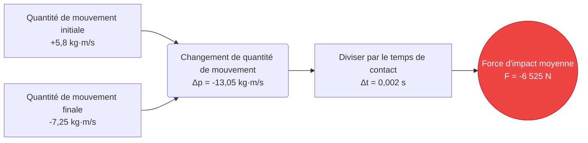
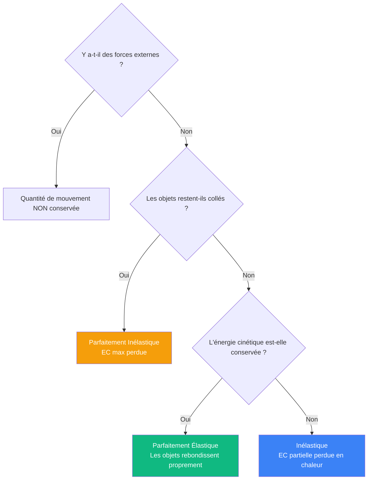
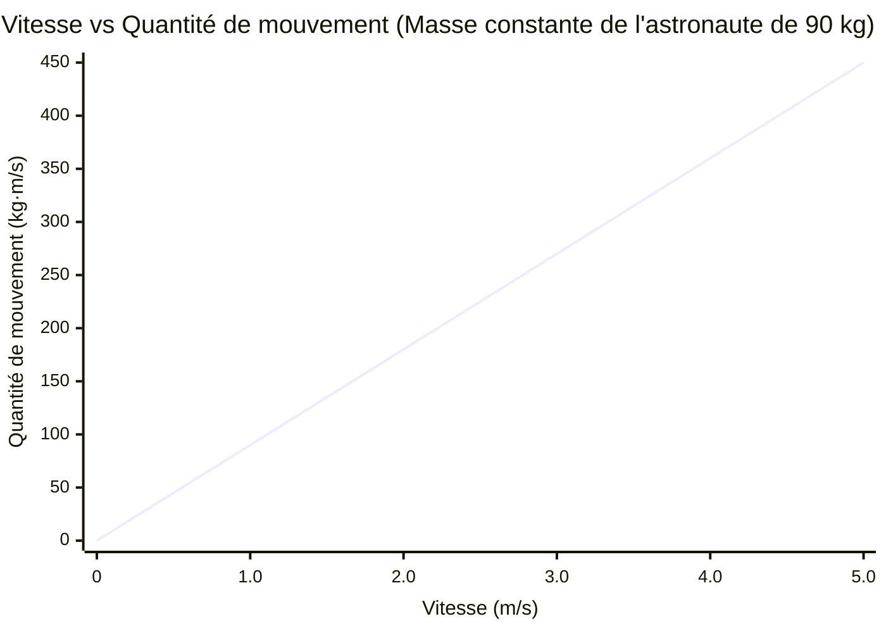
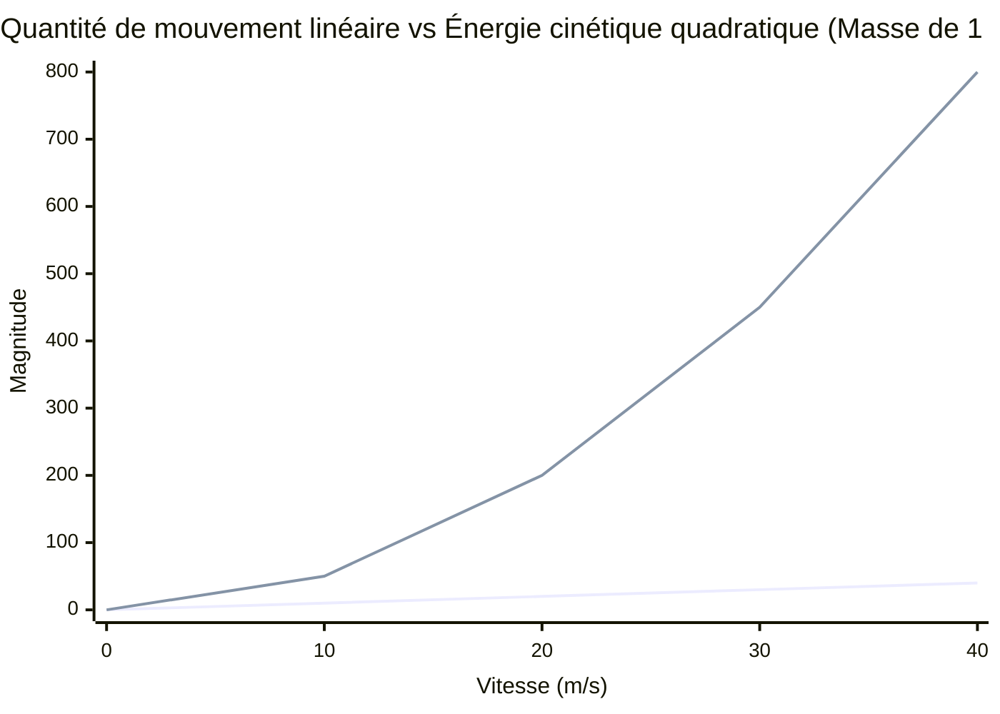

# Le Calculateur Ultime de Quantité de Mouvement : Maîtriser le Mouvement Linéaire, les Collisions et l'Impulsion

Bienvenue dans le **Calculateur de Quantité de Mouvement** définitif et le guide complet des collisions en physique. Que vous soyez un ingénieur automobile analysant les zones de déformation lors des crash-tests, un astrophysicien traçant des rendez-vous orbitaux ou un étudiant universitaire se préparant pour un examen de physique difficile sur les lois de conservation, cet outil est conçu pour une précision mécanique absolue.

La quantité de mouvement est l'incarnation physique de ce qui est « impossible à arrêter ». Elle explique pourquoi un train de marchandises lent peut traverser un mur de briques, pourquoi une minuscule balle peut transpercer l'acier massif, et comment les fusées manœuvrent dans le vide de l'espace lointain.

Dans cette vaste analyse approfondie de plus de 4 000 mots, nous déconstruirons de manière exhaustive la mécanique de la quantité de mouvement linéaire ($p = m \cdot v$). Nous explorerons les fondements mathématiques du théorème de l'impulsion et de la quantité de mouvement, analyserons la différence entre les collisions élastiques et parfaitement inélastiques, et vous guiderons à travers cinq exemples d'ingénierie du monde réel illustrés par des diagrammes Mermaid.js détaillés.

---

## 1. La Physique de la Quantité de Mouvement : Quantité de Mouvement

Pour comprendre la quantité de mouvement, nous devons nous référer à la racine latine du mot, *movimentum*, signifiant « mouvement ». Sir Isaac Newton faisait initialement référence à la quantité de mouvement simplement comme la « Quantité de Mouvement ».

La quantité de mouvement est une **grandeur vectorielle**, ce qui signifie qu'elle a à la fois une magnitude (la grandeur de la valeur) et une direction (où va l'objet).

### La Formule Fondamentale ($p = m \cdot v$)
La quantité de mouvement linéaire ($p$) de tout objet est le produit mathématique de sa masse ($m$) et de sa vitesse ($v$).

$$ p = m \cdot v $$

Où :
- **$p$** = Quantité de mouvement linéaire (mesurée en kilogrammes-mètres par seconde, $\text{kg} \cdot \text{m/s}$)
- **$m$** = Masse (mesurée en kilogrammes, $kg$)
- **$v$** = Vitesse (mesurée en mètres par seconde, $m/s$)

### Pourquoi les Deux Variables Comptent
Puisque la quantité de mouvement est le produit d'une multiplication, vous pouvez atteindre une quantité de mouvement massive par deux extrêmes très différents :
1. **Masse Élevée, Faible Vitesse :** Un superpétrolier de 300 000 tonnes entrant au port au ralenti à $1\text{ m/s}$ possède une quantité de mouvement astronomique de $300 000 000\text{ kg} \cdot \text{m/s}$. C'est pourquoi il faut des kilomètres pour arrêter complètement les navires en toute sécurité.
2. **Faible Masse, Vitesse Élevée :** Une balle de 0,05 kg tirée d'un fusil à $1 000\text{ m/s}$ possède $50\text{ kg} \cdot \text{m/s}$ de quantité de mouvement. Bien que numériquement plus petite que le navire, elle est concentrée sur une zone minuscule, ce qui la rend hautement pénétrante.

### La Véritable Forme de la Deuxième Loi de Newton
La plupart des étudiants apprennent que la deuxième loi de Newton est $F = m \cdot a$. Cependant, Newton a initialement écrit sa loi concernant la quantité de mouvement. La véritable loi stipule : *"La force externe nette sur un objet est égale au taux de variation de sa quantité de mouvement au fil du temps."*

$$ F_{net} = \frac{\Delta p}{\Delta t} $$

---

## 2. L'Impulsion : Modifier la Quantité de Mouvement dans le Temps

Puisque la Force est égale au changement de la quantité de mouvement divisé par le temps, nous pouvons réorganiser l'algèbre pour comprendre comment *changer* la quantité de mouvement d'un objet.

En multipliant les deux côtés par le temps ($\Delta t$), nous obtenons le **Théorème de l'Impulsion et de la Quantité de Mouvement** :

$$ F_{net} \cdot \Delta t = \Delta p $$

Ce produit de la Force et du Temps ($F \cdot \Delta t$) est appelé **Impulsion ($J$)**, mesuré en Newton-secondes ($N \cdot s$). Le théorème nous dit que pour changer la quantité de mouvement d'un objet, vous devez appliquer une force sur une durée spécifique.

### La Physique de la Sécurité Automobile
Le théorème de l'impulsion et de la quantité de mouvement est la fondation entière de la sécurité des collisions automobiles.

Imaginez une voiture s'écrasant contre un mur de béton à la vitesse de l'autoroute. Le changement de la quantité de mouvement ($\Delta p$) est complètement fixe : la voiture allait vite, et maintenant elle doit s'arrêter. Vous ne pouvez pas changer $\Delta p$. Cependant, vous *pouvez* changer la Force ($F$) exercée sur le conducteur en manipulant le Temps ($\Delta t$).

Sans zones de déformation, la voiture s'arrête contre le béton instantanément (par ex., $0,01\text{ seconde}$). Pour satisfaire l'équation, la Force doit être astronomiquement élevée, tuant probablement le conducteur. En concevant le capot de la voiture pour qu'il se froisse comme un accordéon, la durée de l'impact s'étend à $0,20\text{ seconde}$. En augmentant $\Delta t$ par un facteur de 20, la Force maximale mortelle chute par un facteur de 20.

---

## 3. La Loi de Conservation de la Quantité de Mouvement

Dans tout système fermé — ce qui signifie qu'aucune force externe comme la friction ou la gravité n'interfère — la quantité de mouvement totale de tous les objets en interaction reste complètement constante.

$$ \sum p_{initial} = \sum p_{final} $$

Si deux objets entrent en collision, la quantité de mouvement perdue par l'Objet A est exactement gagnée par l'Objet B. Cette règle fondamentale régit toutes les collisions en physique.

### Collisions Élastiques vs Inélastiques
Bien que la quantité de mouvement soit *toujours* conservée dans une collision fermée, l'Énergie Cinétique ($EC = \frac{1}{2}mv^2$) se comporte différemment selon les propriétés matérielles des objets qui entrent en collision.

1. **Collisions Parfaitement Élastiques :** Les objets rebondissent l'un sur l'autre parfaitement comme des boules de billard rigides. La quantité de mouvement *et* l'énergie cinétique sont conservées à 100 %.
2. **Collisions Inélastiques :** Les objets rebondissent l'un sur l'autre, mais une partie de l'énergie cinétique est perdue sous forme de chaleur, de son et de déformation permanente (comme deux voitures qui s'accrochent latéralement). La quantité de mouvement est conservée, mais l'Énergie Cinétique diminue.
3. **Collisions Parfaitement Inélastiques :** Les objets entrent en collision et restent collés en permanence (comme une balle s'incrustant dans un bloc de bois). Ils s'éloignent comme une seule masse combinée. La quantité de mouvement est conservée, mais la quantité maximale d'Énergie Cinétique est perdue.

---

## 4. Guide d'Utilisation Complet : Maximiser le Calculateur

Notre Calculateur de Quantité de Mouvement interactif comprend un Simulateur de Collision 1D avancé. Voici comment naviguer efficacement dans les outils.

### Étape 1 : Calculs de Base de la Quantité de Mouvement
Dans le panneau principal, sélectionnez votre variable cible :
- **Résoudre pour la Quantité de Mouvement (p) :** Entrez la masse et la vitesse pour trouver la quantité de mouvement.
- **Résoudre pour la Masse (m) :** Entrez la quantité de mouvement et la vitesse connues.
- **Résoudre pour la Vitesse (v) :** Entrez la quantité de mouvement et la masse.

### Étape 2 : Utiliser le Simulateur de Collision 1D
Passez en mode Avancé pour déverrouiller l'Explorateur de Collisions :
- Définissez la masse et les vitesses initiales pour le **Corps A** et le **Corps B**.
- Choisissez votre type de collision : **Élastique** (rebond) ou **Parfaitement Inélastique** (adhérence).
- Le moteur exécutera une matrice de conservation et affichera les vitesses finales, la quantité de mouvement totale du système et le pourcentage d'énergie cinétique perdue en chaleur et déformation.

### Étape 3 : Interpréter la Quantité de Mouvement vs l'Énergie Cinétique
Utilisez le bouton de bascule pour afficher la répartition comparative entre la quantité de mouvement et l'énergie cinétique. C'est crucial pour comprendre la balistique. Au fur et à mesure que la vitesse augmente, la quantité de mouvement évolue de manière linéaire, mais l'énergie cinétique évolue de manière quadratique ($v^2$). Cela signifie que doubler votre vitesse double votre quantité de mouvement, mais *quadruple* votre énergie cinétique destructrice.

---

## 5. Cinq Exemples d'Ingénierie Conceptuelle avec Visualisations 2D

Explorons cinq exemples détaillés de mécanique de la quantité de mouvement, en utilisant Mermaid.js pour visualiser la physique sous-jacente.

### Exemple 1 : Le Théorème de l'Impulsion et de la Quantité de Mouvement (Biomécanique du Sport)

**Le Scénario :**
Un lanceur de baseball lance une balle de baseball de $0,145\text{ kg}$ horizontalement à $40\text{ m/s}$ (direction +x). Le frappeur s'élance et la renvoie directement en arrière à $50\text{ m/s}$ (direction -x). La batte n'est en contact physique avec la balle que pendant $0,002\text{ seconde}$. Quelle a été la force d'impact moyenne sur la batte ?

**Les Mathématiques :**
Tout d'abord, calculez le changement de la quantité de mouvement ($\Delta p = m \cdot v_f - m \cdot v_i$).
*Faites très attention aux signes de direction des vecteurs !* La balle est arrivée à $+40\text{ m/s}$ et est repartie à $-50\text{ m/s}$.
$$ \Delta p = 0,145 \times (-50) - 0,145 \times (40) $$
$$ \Delta p = -7,25 - 5,8 = -13,05\text{ kg} \cdot \text{m/s} $$

Maintenant, utilisez le théorème de l'impulsion et de la quantité de mouvement ($F = \Delta p / \Delta t$) :
$$ F = \frac{-13,05}{0,002} = -6 525\text{ Newtons} $$

La batte a frappé la balle avec une force maximale de plus de 6,5 kilonewtons !

**Visualisation 2D :**
L'arbre logique ci-dessous cartographie le déroulement du calcul de l'Impulsion et de la Quantité de Mouvement.

---

### Exemple 2 : Collision Parfaitement Inélastique (Le Pendule Balistique)

**Le Scénario :**
Un expert en criminalistique tire une balle de fusil de $0,02\text{ kg}$ à une vitesse initiale élevée inconnue dans un bloc de bois de $5,0\text{ kg}$ suspendu à des cordes. La balle s'incruste complètement à l'intérieur du bloc. Des caméras à haute vitesse montrent que le bloc combiné et la balle se balancent vers l'arrière à exactement $4,0\text{ m/s}$ immédiatement après la frappe. À quelle vitesse la balle se déplaçait-elle avant l'impact ?

**Les Mathématiques :**
C'est une collision parfaitement inélastique ($m_1v_1 + m_2v_2 = (m_1 + m_2)v_f$).
- $m_{balle}$ = $0,02\text{ kg}$
- $v_{balle}$ = Inconnue
- $m_{bloc}$ = $5,0\text{ kg}$
- $v_{bloc}$ = $0\text{ m/s}$ (immobile)
- $v_{finale}$ = $4,0\text{ m/s}$

Mettez en place l'équation de conservation :
$$ (0,02 \cdot v_{balle}) + (5,0 \cdot 0) = (5,0 + 0,02) \cdot 4,0 $$
$$ 0,02 \cdot v_{balle} = 5,02 \cdot 4,0 $$
$$ 0,02 \cdot v_{balle} = 20,08 $$
$$ v_{balle} = \frac{20,08}{0,02} = 1 004\text{ m/s} $$

La balle se déplaçait à plus de Mach 2,9 ($1 004\text{ m/s}$) avant l'impact.

**Visualisation 2D :**
Cet arbre de décision clarifie les différences fondamentales entre les types de collisions.

---

### Exemple 3 : Accident de Sortie dans l'Espace (Conservation de la Quantité de Mouvement)

**Le Scénario :**
Un astronaute de $100\text{ kg}$ (combinaison comprise) se détache de la Station spatiale internationale lors d'une sortie dans l'espace. Il dérive de manière complètement immobile par rapport à la station, coincé à 15 mètres de distance. Dans un geste désespéré pour revenir, l'astronaute décroche sa lourde ceinture d'outils de $10\text{ kg}$ et la jette loin de la station à une vitesse fulgurante de $15\text{ m/s}$. À quelle vitesse l'astronaute dérive-t-il vers le sas ?

**Les Mathématiques :**
Puisque l'astronaute et la ceinture d'outils étaient initialement immobiles, la quantité de mouvement initiale totale du système est nulle. En raison des lois de conservation, la quantité de mouvement finale totale doit également être égale à zéro.
$$ p_{initial} = 0 $$
$$ p_{final} = (m_{ceinture} \cdot v_{ceinture}) + (m_{astro} \cdot v_{astro}) = 0 $$

Remplacez par les valeurs connues (rappelez-vous que la ceinture est jetée loin de la station, nous lui attribuerons donc une vitesse positive, ce qui signifie que la direction vers la station est négative) :
$$ (10 \cdot 15) + (90 \cdot v_{astro}) = 0 $$
*(Note : la masse de l'astronaute est maintenant de 90 kg car il a lâché la ceinture de 10 kg).*
$$ 150 + 90 \cdot v_{astro} = 0 $$
$$ 90 \cdot v_{astro} = -150 $$
$$ v_{astro} = -1,67\text{ m/s} $$

L'astronaute recule avec succès vers la station à $1,67\text{ m/s}$.

**Visualisation 2D :**
Le graphique ci-dessous démontre la relation strictement linéaire entre la vitesse d'un objet et sa quantité de mouvement (en supposant une masse constante).

---

### Exemple 4 : Quantité de Mouvement Linéaire vs Énergie Cinétique 

**Le Scénario :**
Un débat surgit concernant le pouvoir de pénétration de deux projectiles différents. Le projectile A est une boule de bowling lourde et lente ($7\text{ kg}$ se déplaçant à $10\text{ m/s}$). Le projectile B est une balle de fusil à grande vitesse ($0,05\text{ kg}$ se déplaçant à $1 000\text{ m/s}$). Lequel a le plus de quantité de mouvement pour renverser une cible, et lequel a le plus d'énergie cinétique pour la détruire ?

**Les Mathématiques :**
**Projectile A (Boule de Bowling) :**
$$ p_A = 7 \times 10 = 70\text{ kg}\cdot\text{m/s} $$
$$ EC_A = 0,5 \times 7 \times (10^2) = 350\text{ Joules} $$

**Projectile B (Balle) :**
$$ p_B = 0,05 \times 1 000 = 50\text{ kg}\cdot\text{m/s} $$
$$ EC_B = 0,5 \times 0,05 \times (1 000^2) = 25 000\text{ Joules} $$

Malgré le fait qu'elle soit 140 fois plus légère, la balle possède 71 fois plus d'énergie cinétique destructrice car l'énergie évolue de manière quadratique avec la vitesse ($v^2$). Cependant, la lourde boule de bowling a en fait plus de quantité de mouvement d'arrêt brute pour repousser une cible vers l'arrière.

**Visualisation 2D :**
Ce graphique illustre de manière spectaculaire la différence entre l'évolution linéaire (quantité de mouvement) et l'évolution quadratique (énergie cinétique) à mesure que la vitesse augmente.

*(Ligne bleue = Quantité de mouvement $p = mv$, Ligne rouge = Énergie cinétique $EC = 0.5mv^2$)*

---

### Exemple 5 : Zones de Déformation et Durée de l'Impact

**Le Scénario :**
Revenons au problème de l'ingénierie de la sécurité des collisions. Un SUV de $2 000\text{ kg}$ heurte une barrière en béton à $30\text{ m/s}$. Dans une voiture ancienne rigide sans zone de déformation, l'impact arrête le véhicule en $0,05\text{ seconde}$. Dans une voiture moderne avec un châssis à déformation en nid d'abeille en titane, l'impact prend $0,25\text{ seconde}$. Comparez la force exercée sur l'habitacle du conducteur.

**Les Mathématiques :**
Le changement de la quantité de mouvement ($\Delta p$) est identique pour les deux voitures :
$$ \Delta p = m(v_f - v_i) = 2 000 \times (0 - 30) = -60 000\text{ kg}\cdot\text{m/s} $$

**Force de la Voiture Ancienne :**
$$ F = \frac{\Delta p}{\Delta t} = \frac{-60 000}{0,05} = -1 200 000\text{ Newtons} $$

**Force de la Voiture Moderne :**
$$ F = \frac{\Delta p}{\Delta t} = \frac{-60 000}{0,25} = -240 000\text{ Newtons} $$

En prolongeant le temps d'impact de seulement 0,2 seconde, la zone de déformation moderne a éliminé près d'un million de Newtons de force d'écrasement.

**Visualisation 2D :**
Ce diagramme de Gantt visualise la différence de délai précise qui sauve des vies lors d'un impact.

```mermaid
gantt
    title Durée de l'Impact de la Collision (Répartition de la force d'impulsion)
    dateFormat  s
    axisFormat %S
    section Châssis Ancien (Rigide)
    Force maximale d'impact (1,2 MN) :crit, 0, 0.05s
    section Châssis Moderne (Déformation)
    Effondrement de la zone d'écrasement (0,24 MN) :active, 0, 0.25s
```

---

## 6. Foire Aux Questions (FAQ) Approfondie

**Q : La quantité de mouvement peut-elle être négative ?**
**R :** Oui, absolument. Étant donné que la quantité de mouvement est une grandeur vectorielle, un signe négatif indique simplement la direction. Si on attribue à une voiture voyageant vers l'est une quantité de mouvement positive de $+10 000\text{ kg}\cdot\text{m/s}$, une voiture voyageant vers l'ouest à la même vitesse exacte aura une quantité de mouvement de $-10 000\text{ kg}\cdot\text{m/s}$. 

**Q : La gravité affecte-t-elle la quantité de mouvement ?**
**R :** Oui, la gravité est une force externe. Lorsque vous laissez tomber une balle, la gravité exerce une force continue vers le bas au fil du temps ($F \cdot \Delta t$), ce qui se traduit par une impulsion continue vers le bas, entraînant une augmentation de la quantité de mouvement de la balle jusqu'à ce qu'elle touche le sol.

**Q : Quelle est la différence entre la vitesse du centre de masse et la vitesse de l'objet individuel dans une collision ?**
**R :** Le centre de masse d'un système fermé se déplace à une vitesse complètement constante avant, pendant et après une collision. Même si deux boules de billard rebondissent violemment l'une sur l'autre et modifient leurs vitesses individuelles, le point central mathématique entre elles continue d'avancer comme si de rien n'était. 

**Q : Comment les moteurs à réaction et les fusées se propulsent-ils sans s'appuyer sur rien ?**
**R :** Ils s'appuient entièrement sur la loi de conservation de la quantité de mouvement. Une fusée brûle du carburant pour créer des gaz à haute pression. Elle expulse ensuite ces gaz par la tuyère arrière à des vitesses extrêmes. Les gaz emportent d'énormes quantités de quantité de mouvement négative. Pour que la quantité de mouvement totale du système reste équilibrée à zéro, la lourde coque de la fusée doit gagner une quantité exactement égale de quantité de mouvement positive vers l'avant.

**Q : Qu'est-ce que le moment cinétique ?**
**R :** Ce calculateur se concentre sur la quantité de mouvement *linéaire* (se déplaçant en ligne droite). Le moment cinétique ($L$) en est l'équivalent rotationnel exact. Au lieu de la masse, vous utilisez le « Moment d'inertie » ($I$), et au lieu de la vitesse linéaire, vous utilisez la « Vitesse angulaire » ($\omega$). Le moment cinétique est conservé dans un système en rotation (comme une patineuse sur glace qui ramène ses bras pour tourner plus vite).

---

## 7. Conclusion et Défi d'Ingénierie

Les principes de la quantité de mouvement linéaire et de l'impulsion régissent la macro-mécanique de notre univers. De la dispersion microscopique des particules subatomiques à la conception macroéconomique des glissières de sécurité sur les autoroutes, comprendre comment la masse et la vitesse interagissent est essentiel.

Pour vraiment maîtriser ces concepts, utilisez notre Calculateur de Quantité de Mouvement pour résoudre les défis d'ingénierie conceptuelle suivants :
1. **Le Canon Électromagnétique (Railgun) :** Un canon électromagnétique naval utilise l'électromagnétisme pour tirer un barreau de tungstène de $10\text{ kg}$ à $2 500\text{ m/s}$. Si le navire qui tire avec le canon a une masse de $10 000 000\text{ kg}$, quelle est la vitesse de recul vers l'arrière de l'ensemble du navire ?
2. **L'Impact d'Astéroïde :** Un météore de $50 000\text{ kg}$ se déplaçant à $20 000\text{ m/s}$ percute un satellite mort et immobile de $200 000\text{ kg}$ et s'y encastre parfaitement. Quelle est la vitesse de dérive finale de la masse de métal en fusion qui en résulte ?
3. **Le Propulseur de Freinage :** Un atterrisseur lunaire de $5 000\text{ kg}$ tombe vers la lune à $200\text{ m/s}$. Si ses propulseurs peuvent générer $40 000\text{ N}$ de poussée vers le haut, pendant exactement combien de secondes les propulseurs doivent-ils s'activer pour réduire la vitesse de l'atterrisseur à zéro ?

Expérimentez avec le simulateur, analysez les matrices d'énergie cinétique et fiez-vous à ce calculateur pour éclairer les collisions mathématiques cachées régissant le monde physique qui vous entoure.
