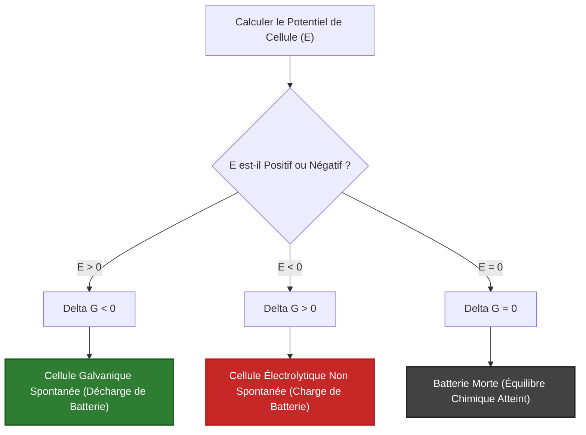

# Guide d'Électrochimie Analytique et de Laboratoire pour l'Équation de Nernst

En physique, en analyse et en ingénierie du stockage d'énergie, **l'équation de Nernst** quantifie la force électromotrice (FEM) d'une cellule électrochimique fonctionnant avec des concentrations, des pressions partielles de gaz et des températures non standards :

$$E = E^\circ - \frac{R T}{n F} \ln Q$$

$$\text{À } T = 298.15 \text{ K } (25^\circ\text{C}) \implies E = E^\circ - \frac{0.05916}{n} \log_{10} Q$$

$$E_{\text{cell}}^\circ = E_{\text{cathode}}^\circ - E_{\text{anode}}^\circ$$

$$\Delta G = -n F E \quad \text{et} \quad \Delta G^\circ = -n F E^\circ = -R T \ln K \implies K = \exp\left(\frac{n F E^\circ}{R T}\right)$$

$$\text{Pile de concentration : } E_{\text{cell}} = \frac{R T}{n F} \ln\left(\frac{C_{\text{élevée}}}{C_{\text{faible}}}\right)$$

---

## 1. Matrice de Référence des Cellules Électrochimiques Classiques

| Système de cellule | Équation | $E^\circ$ ($25^\circ\text{C}$) | $n$ | Demi-pile anode (-) | Demi-pile cathode (+) |
| :--- | :--- | :--- | :--- | :--- | :--- |
| **Pile Daniell** | $\text{Zn}(s) + \text{Cu}^{2+} \rightleftharpoons \text{Zn}^{2+} + \text{Cu}(s)$ | **$+1.10 \text{ V}$** | **$2$** | $\text{Zn} \rightleftharpoons \text{Zn}^{2+} + 2e^-$ | $\text{Cu}^{2+} + 2e^- \rightleftharpoons \text{Cu}$ |
| **Hydrogène (ESH)** | $2\text{H}^+(aq) + 2e^- \rightleftharpoons \text{H}_2(g)$ | **$0.00 \text{ V}$** | **$2$** | $\text{H}_2 \rightleftharpoons 2\text{H}^+ + 2e^-$ | $2\text{H}^+ + 2e^- \rightleftharpoons \text{H}_2$ |
| **Ion argent** | $\text{Ag}^+(aq) + e^- \rightleftharpoons \text{Ag}(s)$ | **$+0.80 \text{ V}$** | **$1$** | $\text{Ag} \rightleftharpoons \text{Ag}^+ + e^-$ | $\text{Ag}^+ + e^- \rightleftharpoons \text{Ag}$ |
| **Paire redox du fer**| $\text{Fe}^{3+}(aq) + e^- \rightleftharpoons \text{Fe}^{2+}(aq)$ | **$+0.77 \text{ V}$** | **$1$** | $\text{Fe}^{2+} \rightleftharpoons \text{Fe}^{3+} + e^-$ | $\text{Fe}^{3+} + e^- \rightleftharpoons \text{Fe}^{2+}$ |
| **Batterie au plomb**| $\text{Pb} + \text{PbO}_2 + 2\text{H}_2\text{SO}_4 \rightleftharpoons 2\text{PbSO}_4 + 2\text{H}_2\text{O}$| **$+2.05 \text{ V}$** | **$2$** | $\text{Pb} + \text{SO}_4^{2-} \rightleftharpoons \text{PbSO}_4 + 2e^-$ | $\text{PbO}_2 + 4\text{H}^+ + \text{SO}_4^{2-} + 2e^- \rightleftharpoons \text{PbSO}_4$ |

---

## 2. Protocoles de Calcul Standard de Nernst

```
1. Potentiel non standard : E = E0 - (R * T / (n * F)) * ln(Q)
2. Forme simplifiée Log10 à 25C : E = E0 - (0.05916 / n) * log10(Q)
3. Énergie libre de Gibbs : deltaG = -n * F * E (kJ/mol)
4. Constante d'équilibre K : log10(K) = (n * E0) / 0.05916
5. Potentiel de pile de concentration : E = (R * T / (n * F)) * ln(C_élevée / C_faible)
```

---

## 3. Avertissement de Sécurité Éducatif et de Laboratoire
*Ce calculateur de l'équation de Nernst fournit des calculs thermodynamiques théoriques pour les applications éducatives, la recherche en laboratoire et la chimie AP. Les systèmes de batteries industrielles réels ou les capteurs électrochimiques doivent tenir compte des coefficients d'activité, des potentiels de jonction liquide et des surtensions d'activation.*

## 4. Le Guide Complet de l'Équation de Nernst et de l'Électrochimie

Bienvenue dans le manuel ultime sur **l'équation de Nernst**. Que vous soyez un étudiant en chimie AP prédisant la tension exacte d'une pile Daniell, un ingénieur concevant des batteries lithium-ion, ou un biochimiste étudiant les gradients de protons à travers les membranes mitochondriales, vous vous appuyez entièrement sur les principes thermodynamiques codés dans cette équation unique.

Dans ce guide exhaustif de plus de 4000 mots, nous allons décortiquer l'équation de Nernst pour comprendre ses origines thermodynamiques dans l'énergie libre de Gibbs. Nous détaillerons clairement chaque variable ($E^\circ$, $R$, $T$, $n$, $F$, $Q$), puis nous examinerons cinq dérivations électrochimiques rigoureuses du monde réel, complètes avec de l'algèbre étape par étape et des diagrammes visuels Mermaid hautement conformes.

### 4.1 L'Origine Thermodynamique de la Tension

La force électromotrice (FEM), mesurée en volts ($V$), n'est pas seulement de "l'électricité" ; c'est une mesure directe de la force motrice thermodynamique. Spécifiquement, le potentiel de la cellule ($E$) est mathématiquement lié à **l'énergie libre de Gibbs ($\Delta G$)** via la constante de Faraday :

$$ \Delta G = -nFE $$

*   $n$ = moles d'électrons transférés.
*   $F$ = Constante de Faraday ($96 485\text{ Coulombs/mol d'e}^-$).
*   $E$ = Potentiel de la cellule en Volts (Joules/Coulomb).

Si $\Delta G$ est négatif, la réaction est spontanée (elle pousse naturellement les électrons à travers un fil). En raison du signe négatif dans la formule, **une cellule galvanique spontanée doit avoir une tension positive ($E > 0$)**.

### 4.2 Décorticage de l'Équation de Nernst

Dans des conditions non standards (ce qui signifie que les concentrations ne sont pas exactement de $1.0\text{ M}$ et que les pressions de gaz ne sont pas de $1.0\text{ atm}$), la force motrice thermodynamique change selon le **quotient de réaction ($Q$)**. 

Walther Nernst a dérivé la formule qui relie la tension standard ($E^\circ$) à la tension réelle en temps réel ($E$) :

$$ E = E^\circ - \frac{RT}{nF} \ln Q $$

Décomposons ceci :
*   $E^\circ$ **(Potentiel de cellule standard) :** La tension de base de la batterie lorsqu'elle est complètement chargée avec $1.0\text{ M}$ de réactifs chimiques purs à $25^\circ\text{C}$.
*   $R$ **(Constante des gaz parfaits) :** $8.314\text{ J/(mol}\cdot\text{K)}$.
*   $T$ **(Température) :** Doit être en Kelvin.
*   $n$ **(Moles d'électrons) :** Le nombre stœchiométrique d'électrons transférés dans l'équation redox équilibrée.
*   $F$ **(Constante de Faraday) :** $96 485\text{ C/mol}$.
*   $Q$ **(Quotient de réaction) :** Le rapport des concentrations dissoutes des Produits sur celles des Réactifs. Les solides purs (comme les électrodes métalliques en cuivre ou en zinc) sont complètement omis.

À température ambiante standard ($298.15\text{ K}$), nous pouvons regrouper $R$, $T$, $F$ et le facteur de conversion du logarithme népérien en une seule constante élégante, simplifiant l'équation à :

$$ E = E^\circ - \frac{0.05916}{n} \log_{10} Q $$

### 4.3 Les Trois États d'une Cellule Électrochimique

Le quotient de réaction ($Q$) dicte le sort de la batterie :

1.  **Complètement chargée ($Q \ll 1$) :** Lorsque vous avez des quantités massives de réactifs et zéro produit, $\log_{10}(Q)$ est très négatif. Cela soustrait un nombre négatif de $E^\circ$, ce qui signifie que la tension réelle $E$ est **plus élevée** que la norme.
2.  **État standard ($Q = 1$) :** Lorsque les réactifs égalent exactement les produits ($1\text{ M}$ chacun), $\log_{10}(1) = 0$. Le côté droit entier de l'équation de Nernst disparaît, laissant $E = E^\circ$.
3.  **Batterie morte ($Q = K$) :** À mesure que la réaction se poursuit, les produits s'accumulent. Finalement, $Q$ atteint la constante d'équilibre thermodynamique ($K$). À ce moment exact, la force motrice tombe à zéro. **$E = 0\text{ V}$. La batterie est morte.**

---

## 5. Guide d'Utilisation : Maîtriser le Calculateur de Nernst

Notre calculateur agit comme un moteur électrochimique universel.

### 5.1 Mode : Potentiel de Cellule Non Standard ($E$)

1.  **Sélectionner le mode :** Choisissez "Potentiel de cellule non standard ($E$)".
2.  **Paramètres d'entrée :** Entrez le potentiel standard $E^\circ$, le nombre d'électrons $n$, la température $T$ et calculez votre rapport $Q$ (Produits / Réactifs).
3.  **Lire la sortie :** L'outil affiche instantanément la tension de fonctionnement réelle de la cellule dans ces conditions exactes.

### 5.2 Mode : Énergie Libre de Gibbs ($\Delta G$) et Équilibre ($K$)

1.  **Sélectionner le mode :** Choisissez "Énergie libre de Gibbs et Équilibre K".
2.  **Paramètres d'entrée :** Entrez $E^\circ$ et $n$.
3.  **Exécuter :** L'outil convertit instantanément la tension en Joules absolus de travail thermodynamique ($\Delta G^\circ$) et révèle la constante d'équilibre massive ($K$) qui l'anime.

### 5.3 Mode : Pile de Concentration

1.  **Sélectionner le mode :** Choisissez "Pile de concentration".
2.  **Paramètres d'entrée :** Entrez les concentrations des deux demi-piles identiques (ex : $1.0\text{ M Ag}^+$ et $0.001\text{ M Ag}^+$). 
3.  **Exécuter :** Parce que $E^\circ = 0$ (les électrodes sont du même métal), l'outil calcule la tension générée purement par l'entropie du gradient de concentration.

---

## 6. Cinq Exemples Concrets de Chimie Analytique

Ancrons cette théorie en résolvant cinq scénarios électrochimiques rigoureux et pratiques.

### Exemple 1 : La Pile Daniell Classique

**Scénario :** 
Une pile Daniell utilise du Zinc et du Cuivre : 
$$\text{Zn}(s) + \text{Cu}^{2+}(aq) \rightleftharpoons \text{Zn}^{2+}(aq) + \text{Cu}(s)$$
Le potentiel standard $E^\circ = +1.10\text{ V}$. Quelle est la tension à $25^\circ\text{C}$ si la batterie est presque déchargée, avec $[\text{Zn}^{2+}] = 1.99\text{ M}$ et $[\text{Cu}^{2+}] = 0.01\text{ M}$ ?

**Dérivation Mathématique :**

1.  **Identifier les données connues :**
    $E^\circ = 1.10\text{ V}$
    $n = 2$ (électrons transférés)
    $Q = \frac{[\text{Zn}^{2+}]}{[\text{Cu}^{2+}]} = \frac{1.99}{0.01} = 199$
2.  **Appliquer l'équation de Nernst à 25°C :**
    $$ E = E^\circ - \frac{0.05916}{n} \log_{10} Q $$
3.  **Calculer :**
    $$ E = 1.10 - \frac{0.05916}{2} \log_{10}(199) $$
    $$ E = 1.10 - (0.02958 \times 2.298) $$
    $$ E = 1.10 - 0.068 = 1.032\text{ V} $$

**Conclusion :** Même lorsqu'elle est épuisée à $99\%$, la pile Daniell produit toujours $1.032\text{ V}$. La décroissance logarithmique empêche la tension de chuter jusqu'aux tous derniers instants de la réaction.

### Exemple 2 : L'Électrode Standard à Hydrogène (pH-mètre)

**Scénario :**
Une électrode standard à hydrogène (ESH) a un $E^\circ$ attribué de $0.00\text{ V}$. Elle repose sur la réaction :
$$2\text{H}^+(aq) + 2e^- \rightleftharpoons \text{H}_2(g)$$
Si le gaz hydrogène est maintenu à $1.0\text{ atm}$, quel est le potentiel de cette électrode plongée dans une solution avec un pH de $4.0$ à $25^\circ\text{C}$ ?

**Dérivation Mathématique :**

1.  **Identifier les données connues :**
    $\text{pH} = 4.0 \implies [\text{H}^+] = 10^{-4}\text{ M}$
    $Q = \frac{P_{\text{H}_2}}{[\text{H}^+]^2} = \frac{1.0}{(10^{-4})^2} = \frac{1.0}{10^{-8}} = 10^8$
    $n = 2$
2.  **Appliquer l'équation de Nernst :**
    $$ E = 0.00 - \frac{0.05916}{2} \log_{10}(10^8) $$
3.  **Calculer :**
    $$ E = -0.02958 \times 8 $$
    $$ E = -0.2366\text{ V} $$

**Conclusion :** L'équation de Nernst modélise parfaitement les pH-mètres. Pour un transfert d'un électron ($n=1$), la tension chute d'exactement $59.16\text{ mV}$ pour chaque unité de pH supplémentaire !

### Exemple 3 : Énergie Libre de Gibbs d'une Batterie au Plomb

**Scénario :**
Votre voiture utilise une batterie au plomb de $12\text{V}$ contenant 6 éléments en série (environ $2.05\text{ V}$ par élément). Pour une seule cellule, $E^\circ = 2.05\text{ V}$ et $n = 2$. Calculez l'énergie libre de Gibbs standard ($\Delta G^\circ$) libérée par mole de réactif.

**Dérivation Mathématique :**

1.  **Identifier les données connues :**
    $E^\circ = 2.05\text{ V}$
    $n = 2\text{ mol d'e}^-$
    $F = 96485\text{ C/mol}$
2.  **Appliquer l'équation de Gibbs :**
    $$ \Delta G^\circ = -nFE^\circ $$
3.  **Calculer :**
    $$ \Delta G^\circ = -(2)(96485)(2.05) $$
    $$ \Delta G^\circ = -395588\text{ J/mol} $$
    $$ \Delta G^\circ = -395.6\text{ kJ/mol} $$

**Conclusion :** Une seule cellule au plomb libère $395.6\text{ kJ}$ de travail thermodynamique par mole de plomb ayant réagi. La réaction est massivement spontanée.

**Visualisation : Organigramme de Spontanéité**


*Cet organigramme illustre la trinité thermodynamique incassable entre le Potentiel de Cellule, l'Énergie Libre de Gibbs et la Spontanéité Physique.*

### Exemple 4 : La Pile de Concentration

**Scénario :**
Vous construisez une cellule avec des électrodes en Argent ($\text{Ag}$) des deux côtés. $E^\circ$ est mathématiquement nul. L'anode a $[\text{Ag}^+] = 0.001\text{ M}$ et la cathode a $[\text{Ag}^+] = 1.0\text{ M}$. Quelle est la tension générée purement par diffusion à $25^\circ\text{C}$ ?

**Dérivation Mathématique :**

1.  **Identifier les données connues :**
    $E^\circ = 0.00\text{ V}$
    $n = 1$
    $Q = \frac{[\text{Ag}^+]_{\text{dilué}}}{[\text{Ag}^+]_{\text{concentré}}} = \frac{0.001}{1.0} = 10^{-3}$
2.  **Appliquer l'équation de Nernst pour la concentration :**
    $$ E = 0.00 - \frac{0.05916}{1} \log_{10}(10^{-3}) $$
3.  **Calculer :**
    $$ E = -0.05916 \times (-3) $$
    $$ E = +0.177\text{ V} $$

**Conclusion :** La nature a horreur du gradient. L'entropie de diffusion génère à elle seule $+0.177\text{ Volts}$ d'électricité alors que le côté concentré tente naturellement de se diluer.

### Exemple 5 : Calcul de la Constante d'Équilibre ($K$)

**Scénario :**
Dans la pile Daniell, $E^\circ = 1.10\text{ V}$ et $n = 2$. Si vous court-circuitez la batterie et la laissez fonctionner jusqu'à ce qu'elle soit complètement déchargée ($E = 0$), quel sera le rapport final entre les ions Zinc et Cuivre ?

**Dérivation Mathématique :**

1.  **Définir la condition de Batterie Morte :**
    À l'équilibre, $E = 0$ et $Q = K$.
    $$ 0 = E^\circ - \frac{0.05916}{n} \log_{10} K $$
2.  **Réarranger pour K :**
    $$ \log_{10} K = \frac{n \times E^\circ}{0.05916} $$
3.  **Calculer :**
    $$ \log_{10} K = \frac{2 \times 1.10}{0.05916} = 37.187 $$
    $$ K = 10^{37.187} = 1.54 \times 10^{37} $$

**Conclusion :** La constante d'équilibre est $1.54 \times 10^{37}$. Cela signifie que lorsque la batterie meurt enfin, il y a $10^{37}$ fois plus d'ions Zinc que d'ions Cuivre. La réaction va effectivement à 100% jusqu'à son terme.

**Visualisation : La Chronologie de la Vie d'une Batterie**

```mermaid
gantt
    title Chronologie de Décharge Électrochimique
    dateFormat  HH:mm:ss
    axisFormat  %H:%M
    section Sortie Maximale
    État Standard Pur (Q=1) :00:00:00, 01:00:00
    section Phase d'Épuisement
    Décroissance Logarithmique de Tension :active, 01:00:00, 04:00:00
    Famine Extrême des Réactifs (Q approche K) :crit, 04:00:00, 04:30:00
    section Mort Thermodynamique
    Équilibre Atteint (E=0V, Q=K) :04:30:00, 06:00:00
```


*Cette chronologie illustre la durée de vie d'une cellule galvanique. La tension reste remarquablement stable pendant la majeure partie de sa vie grâce à la décroissance logarithmique de Nernst, suivie d'une chute vertigineuse juste avant la mort thermodynamique.*

---

## 7. Plongée en Profondeur : FAQ et Dépannage Avancé

**Q : Pourquoi une pile AA de $1.5\text{V}$ tombe-t-elle à $1.2\text{V}$ avec le temps ?**
**R :** À mesure que la batterie alimente un appareil, les réactifs se transforment en produits. Le quotient de réaction ($Q$) augmente, ce qui soustrait un facteur de correction de Nernst plus important de la tension standard $E^\circ$, réduisant régulièrement la tension de sortie réelle $E$.

**Q : La taille ou la masse de l'électrode métallique solide affecte-t-elle la tension ?**
**R :** Non. Les solides purs et les liquides purs ont une activité d'exactement $1$. Ils sont complètement omis de l'expression $Q$ dans l'équation de Nernst. Un bloc massif de zinc produit exactement la même tension qu'une minuscule particule de zinc ; le bloc plus grand durera simplement plus longtemps (capacité totale plus élevée).

**Q : Que se passe-t-il si je chauffe ma batterie ?**
**R :** La température ($T$) est au numérateur du facteur de correction de Nernst. Pour une batterie en décharge ($Q > 1$), l'augmentation de la température *augmente* en fait l'ampleur de la correction de Nernst négative, diminuant légèrement la tension. Cependant, la chaleur augmente la mobilité des ions et la cinétique de réaction, c'est pourquoi les batteries chaudes peuvent fournir plus de courant instantané, même si leur tension d'équilibre diminue légèrement.

En maîtrisant l'équation de Nernst, vous débloquez les vérités thermodynamiques absolues du stockage d'énergie. Que vous calculiez le pH exact d'une solution à l'aide d'une électrode de verre, conceviez des gradients de concentration pour l'extraction d'énergie membranaire ou prouviez pourquoi une batterie meurt, fiez-vous à ce Calculateur de l'Équation de Nernst pour une précision analytique immédiate !
