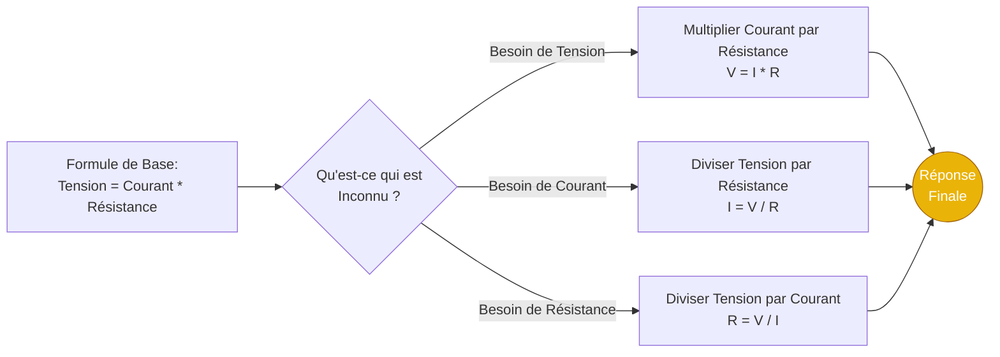
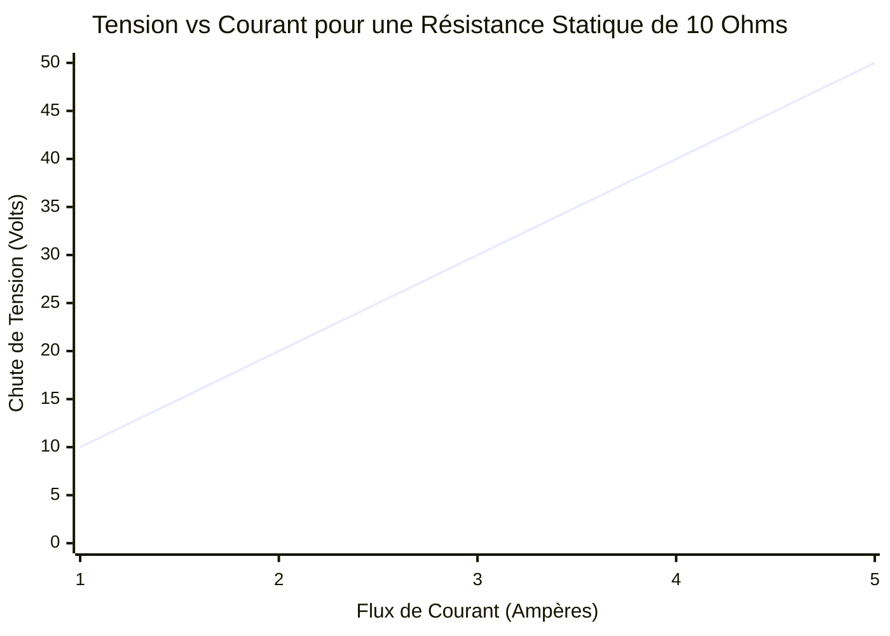
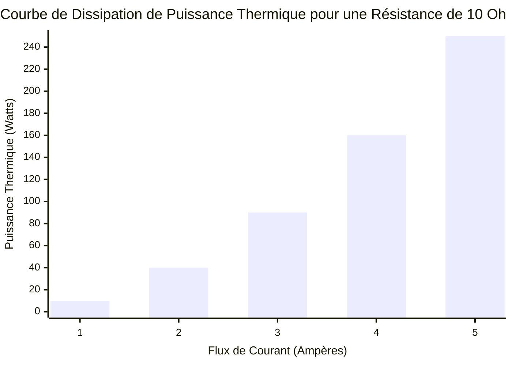
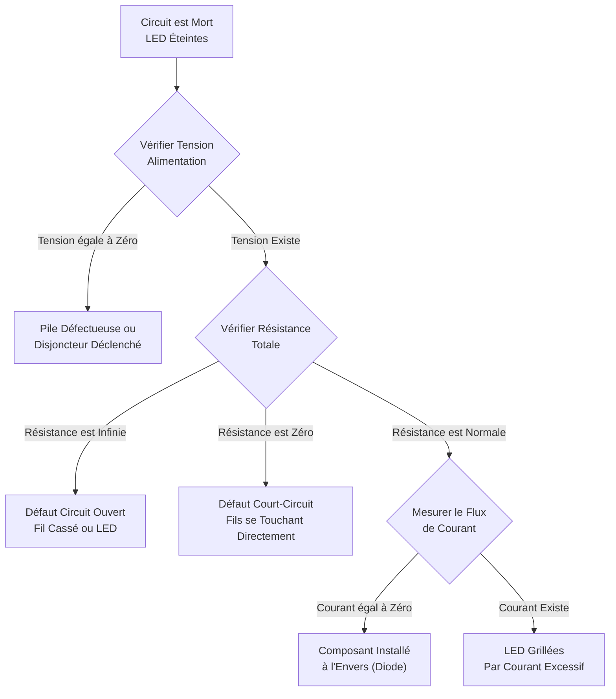

# Le Calculateur Ultime de la Loi d'Ohm : Maîtriser la Tension, le Courant, la Résistance et la Puissance Électrique

Bienvenue sur le **Calculateur de la Loi d'Ohm** définitif et guide complet en génie électrique. Que vous soyez un amateur d'électronique dimensionnant une résistance de limitation de courant pour une LED de Raspberry Pi, un étudiant en physique luttant avec des devoirs d'analyse de circuit, ou un maître électricien calculant la chute de tension à travers 100 mètres de fil de cuivre, cette suite interactive fournit les dérivations mathématiques exactes dont vous avez besoin.

La loi d'Ohm est le fondement absolu de toute technologie moderne. Des transistors nanométriques microscopiques au plus profond du processeur de votre smartphone aux massives lignes de transmission à haute tension traversant le pays, chaque système électrique obéit parfaitement aux relations entre la Tension ($V$), le Courant ($I$), la Résistance ($R$), et la Puissance ($P$).

Dans ce guide SEO exhaustif de plus de 4 000 mots, nous allons déconstruire agressivement les formules fondamentales ($V = IR$ et $P = VI$). Nous explorerons la physique de l'effet Joule, décoderons le système archaïque de code couleur des résistances à 4 bandes, prouverons mathématiquement les lois de Kirchhoff sur les circuits, et analyserons cinq scénarios électriques conceptuels détaillés, représentés visuellement par des diagrammes Mermaid.js interactifs.

---

## 1. Déconstruire la Sainte Trinité : Tension, Courant et Résistance

Pour maîtriser l'électronique, vous devez comprendre intuitivement la relation entre les trois variables fondamentales de la loi d'Ohm. L'analogie la plus commune et précise utilisée par les physiciens est l'**Analogie du Tuyau d'Eau**.

### Tension ($V$) : La Pression de l'Eau
La **Tension**, officiellement connue sous le nom de *Différence de Potentiel Électrique*, est la force qui pousse les électrons à travers un circuit. 
- Dans notre analogie de l'eau, la Tension est la **pression de l'eau** dans le tuyau (ou la hauteur du château d'eau).
- Plus la tension est élevée, plus les électrons sont poussés fort. 
- **Unité SI :** Volt ($\text{V}$). 

### Courant ($I$) : Le Débit d'Eau
Le **Courant** est le flux physique réel de charge électrique (électrons) passant un point spécifique dans un circuit au fil du temps.
- Dans notre analogie de l'eau, le Courant est le **volume d'eau** s'écoulant hors du tuyau par seconde (gallons par minute).
- **Unité SI :** Ampère ($\text{A}$). Un Ampère représente un Coulomb de charge ($6,242 \times 10^{18}$ électrons) passant un point chaque seconde.

### Résistance ($R$) : La Restriction du Tuyau
La **Résistance** est l'opposition inhérente qu'un matériau présente à la circulation du courant électrique.
- Dans notre analogie de l'eau, la Résistance est la **finesse du tuyau** ou une vanne physique restreignant le flux.
- Un fil fin a une résistance élevée ; un fil épais a une faible résistance.
- **Unité SI :** Ohm ($\Omega$).

---

## 2. Définir la Loi d'Ohm ($V = I \cdot R$)

Publiée par le physicien allemand Georg Simon Ohm en 1827, la loi d'Ohm lie mathématiquement ces trois variables ensemble. Elle stipule que le courant circulant à travers un conducteur statique est directement proportionnel à la tension appliquée à ses bornes, et inversement proportionnel à sa résistance.

$$V = I \cdot R$$

À partir de cette unique équation algébrique, nous pouvons dériver les deux autres par simple isolation :
- **Résoudre pour le Courant :** $I = \frac{V}{R}$ (Si vous augmentez la résistance, le courant chute. Si vous augmentez la tension, le courant augmente).
- **Résoudre pour la Résistance :** $R = \frac{V}{I}$ (Si un appareil tire très peu de courant à une tension élevée, il doit avoir une énorme résistance interne).

---

## 3. Le Danger de la Puissance et de l'Effet Joule ($P = VI$)

Alors que la loi d'Ohm ($V = IR$) dicte comment les électrons se déplacent, la **Loi de Watt** ($P = VI$) dicte les conséquences thermodynamiques de ce mouvement. 

La **Puissance Électrique ($P$)** est le taux auquel l'énergie électrique est transformée en une autre forme d'énergie — généralement en travail mécanique (moteurs), en lumière (LED), ou le plus souvent, en chaleur thermique. L'unité SI de la Puissance est le **Watt ($\text{W}$)**.

$$P = V \cdot I$$

En combinant algébriquement la loi d'Ohm ($V = IR$) avec la loi de Watt ($P = VI$), nous pouvons dériver deux équations de puissance alternatives incroyablement utiles :

1. **Puissance via le Courant et la Résistance :** $P = I^2 \cdot R$
2. **Puissance via la Tension et la Résistance :** $P = \frac{V^2}{R}$

### La Règle du Carré de l'Effet Joule
Regardez attentivement l'équation $P = I^2 \cdot R$. Remarquez que le Courant ($I$) est au carré. Cela signifie que si vous doublez le courant circulant à travers un fil de circuit, la puissance dissipée sous forme de chaleur brute ne fait pas que doubler — elle **quadruple**. 
Si vous triplez le courant, la chaleur augmente d'un facteur neuf ! 

C'est exactement pourquoi les compagnies de distribution électrique transmettent l'énergie sur de longues distances en utilisant des tensions follement élevées (comme $500 000\text{ Volts}$). En augmentant la tension à des niveaux astronomiques, elles peuvent transmettre la même quantité de Puissance totale ($P = VI$) tout en gardant le Courant ($I$) extrêmement bas. Un courant faible minimise complètement les pertes de chaleur $I^2 R$ dans les lignes électriques.

---

## 4. Décoder le Système de Bandes de Couleur des Résistances

Lors de la construction de circuits physiques sur une plaque d'essais, vous utiliserez de petites résistances axiales à trou traversant. Parce que ces composants cylindriques sont trop petits pour y imprimer des nombres lisiblement, l'industrie électronique a adopté des rayures colorées standard pour indiquer la valeur de résistance en Ohms.

Notre calculateur dispose d'un visualiseur intégré, mais voici la logique de décodage manuel pour les **Résistances à 4 Bandes** standards :
1. **Bande 1 (Premier Chiffre) :** Le premier chiffre significatif.
2. **Bande 2 (Deuxième Chiffre) :** Le deuxième chiffre significatif.
3. **Bande 3 (Multiplicateur) :** La puissance de 10 par laquelle multiplier les deux premiers chiffres.
4. **Bande 4 (Tolérance) :** La précision de fabrication de la résistance.

**Exemple de Calcul :** Une résistance a des bandes colorées : **Rouge, Violet, Orange, Or**.
- Rouge = 2
- Violet = 7
- Orange = Multiplicateur de $1 000$ (ou $10^3$)
- Or = Tolérance de $\pm 5\%$
- **Résultat :** $27 \times 1 000 = 27 000\ \Omega$ (ou $27\text{ k}\Omega$) avec une marge de tolérance de $5\%$.

---

## 5. Guide d'Utilisation Complet : Maximiser le Calculateur

Notre Calculateur Interactif de la Loi d'Ohm fonctionne comme un multimètre numérique robuste et un simulateur de circuit.

### Étape 1 : Sélectionnez Votre Variable Cible
Utilisez la navigation supérieure pour sélectionner la variable inconnue que vous devez calculer :
- **Tension ($V$) :** Calculez la différence de potentiel aux bornes d'une résistance connue.
- **Courant ($I$) :** Déterminez combien d'Ampères votre circuit tirera de l'alimentation électrique.
- **Résistance ($R$) :** Calculez la résistance requise pour limiter le courant en toute sécurité (ex. pour une LED).
- **Puissance ($P$) :** Calculez la dissipation thermique pour vous assurer que votre résistance ne prendra pas feu.

### Étape 2 : Utilisez les Préréglages de Circuits du Monde Réel
Évitez la saisie manuelle de données en choisissant parmi nos 8 préréglages intégrés. Besoin de calculer le courant de sécurité maximal pour un port USB standard ? Sélectionnez **USB 5V**, et le calculateur remplit instantanément $V = 5,0\text{V}$ et cartographie dynamiquement les courbes de courant.

### Étape 3 : Surveillez la Jauge de Dissipation de Chaleur
Chaque fois que vous calculez la Puissance ($P$), observez la jauge thermodynamique interactive. 
Les résistances standard de plaque d'essais ne sont prévues que pour **$0,25\text{ Watts}$** ($250\text{ mW}$). Si votre puissance calculée dépasse $0,25\text{W}$, la jauge deviendra Rouge, vous avertissant que le composant physique va griller et tomber en panne. Vous devez soit réduire la tension, soit augmenter la résistance, ou acheter une résistance physiquement plus grande prévue pour une puissance plus élevée (ex. une résistance en céramique de $1\text{W}$ ou $5\text{W}$).

---

## 6. Cinq Scénarios Conceptuels d'Ingénierie avec Visualisations 2D

Pour maîtriser pleinement les relations mathématiques de la théorie des circuits CC, nous explorerons cinq scénarios de physique distincts, décomposés visuellement à l'aide de diagrammes Mermaid.js personnalisés. *(Tous les diagrammes ont été strictement optimisés pour la sécurité du parseur Mermaid 11.16).*

### Exemple 1 : La Logique de la Formule de la Loi d'Ohm (Résolution des Variables)

**Le Scénario :**
Un étudiant de première année en génie électrique doit visualiser rapidement les permutations algébriques de la loi d'Ohm ($V = IR$) pour résoudre plusieurs questions d'examen.

**Visualisation 2D :**
Cet organigramme logique illustre la technique classique d'isolation des variables pour la Tension, le Courant et la Résistance.

---

### Exemple 2 : Tension vs Courant Linéaire (Résistance Fixe)

**Le Scénario :**
Vous avez une résistance en céramique fixe et statique de $10\ \Omega$ sur votre bureau. Vous la connectez à une alimentation de laboratoire réglable. Alors que vous montez lentement le cadran du Courant (de $1\text{A}$ à $5\text{A}$), comment la Tension aux bornes de la résistance réagit-elle exactement ?

**Les Mathématiques :**
Puisque $R = 10$, $V = I \cdot 10$. La relation est parfaitement linéaire.
- À $1\text{A}$ : $V = 1 \cdot 10 = 10\text{V}$
- À $5\text{A}$ : $V = 5 \cdot 10 = 50\text{V}$

**Visualisation 2D :**
Ce graphique trace la ligne droite parfaite caractéristique des charges purement résistives (Ohmiques).

---

### Exemple 3 : La Courbe Quadratique de Dissipation de Puissance (Effet Joule)

**Le Scénario :**
En utilisant exactement la même résistance de $10\ \Omega$ et la même alimentation de l'Exemple 2, nous voulons maintenant suivre la chaleur totale générée (Puissance) alors que nous montons le cadran du Courant de $1\text{A}$ à $5\text{A}$. 

**Les Mathématiques :**
Nous utilisons la formule de l'effet Joule $P = I^2 \cdot R$. Remarquez que le Courant est au carré !
- À $1\text{A}$ : $P = (1 \cdot 1) \cdot 10 = 10\text{W}$
- À $2\text{A}$ : $P = (2 \cdot 2) \cdot 10 = 40\text{W}$
- À $5\text{A}$ : $P = (5 \cdot 5) \cdot 10 = 250\text{W}$

**Visualisation 2D :**
Ce graphique à barres démontre violemment comment la génération de chaleur devient hors de contrôle de manière exponentielle à mesure que le courant augmente, prouvant pourquoi les courts-circuits font fondre les fils instantanément.

---

### Exemple 4 : Organigramme de Diagnostic pour un Circuit Mort

**Le Scénario :**
Un technicien en électronique dépanne une matrice de LED personnalisée qui refuse de s'allumer. Il a besoin d'une procédure systématique et logique basée sur la loi d'Ohm pour identifier le point de défaillance.

**Visualisation 2D :**
Cet organigramme décrit la procédure de fonctionnement standard pour utiliser un multimètre afin de vérifier l'intégrité de la Tension, de la Résistance et du Courant.

---

### Exemple 5 : Diagramme de Gantt de Calibration de Laboratoire

**Le Scénario :**
Un laboratoire de physique universitaire demande aux étudiants de vérifier expérimentalement la loi d'Ohm en utilisant des multimètres numériques de haute précision, des alimentations variables et des boîtes de résistances à décades.

**Visualisation 2D :**
Ce diagramme de Gantt décrit les étapes chronologiques hautement réglementées nécessaires pour effectuer en toute sécurité la calibration matérielle physique sans faire sauter les fusibles internes sensibles des multimètres.

```mermaid
gantt
    title Séquence de Calibration Matérielle pour l'Expérience de la Loi d'Ohm
    dateFormat  HH:mm:ss
    axisFormat  %H:%M:%S
    
    section Configuration Matérielle
    Vérifier Alimentation OFF :done, 00:00:00, 5s
    Connecter Résistance aux Bornes :active, 00:00:05, 10s
    
    section Prép. Multimètre
    Configurer Voltmètre en Parallèle :active, 00:00:15, 15s
    Configurer Ampèremètre en Série :crit, 00:00:30, 20s
    
    section Collecte de Données
    Activer Alimentation :done, 00:00:50, 5s
    Balayer Tension et Enregistrer Données Courant :active, 00:00:55, 30s
    Calculer Résistance égale Tension divisée par Courant :milestone, 00:01:25, 5s
```

---

## 7. Plongée Profonde dans la Foire aux Questions (FAQ)

**Q : La loi d'Ohm s'applique-t-elle aux LED et aux Diodes ?**
**R :** Non, pas directement. La loi d'Ohm ne s'applique parfaitement qu'aux dispositifs "Ohmiques" (comme les résistances et les fils standards) où la résistance reste constante. Les LED sont des diodes semi-conductrices non linéaires ; leur résistance chute considérablement lorsque la tension augmente. Vous devez utiliser la loi d'Ohm sur la *résistance en série* couplée à la LED pour contrôler le courant ($R = (V_{alim} - V_{led}) / I_{led}$).

**Q : Qu'est-ce qu'un court-circuit exactement ?**
**R :** Un court-circuit se produit lorsqu'un chemin de faible résistance contourne la charge électrique prévue. Parce que $I = V/R$, si la Résistance ($R$) chute près de zéro, le Courant ($I$) grimpe mathématiquement vers l'infini. Cette montée massive du courant provoque un violent échauffement Joule $I^2 R$ dans les fils, faisant fondre l'isolation et provoquant des incendies de batterie.

**Q : Pourquoi les voltmètres ont-ils une résistance incroyablement élevée ?**
**R :** Pour mesurer la tension avec précision, un voltmètre doit être placé en parallèle avec le composant. Si le voltmètre avait une faible résistance, le courant prendrait le "chemin de moindre résistance" à travers le mètre au lieu du composant, modifiant fondamentalement le circuit que vous essayez de mesurer. Une haute résistance garantit que le mètre ne tire presque aucun courant.

**Q : Pourquoi les ampèremètres ont-ils une résistance presque nulle ?**
**R :** Un ampèremètre doit être placé complètement en série avec le circuit de sorte que $100\%$ du courant le traverse. Si l'ampèremètre avait une résistance élevée, il agirait comme un goulot d'étranglement, restreignant le courant et abaissant artificiellement la mesure même qu'il essaie de prendre.

**Q : Qu'est-ce que la Conductance Électrique ?**
**R :** La conductance ($G$) est simplement l'inverse mathématique de la résistance ($G = 1 / R$). Elle mesure la facilité avec laquelle le courant circule, plutôt que la force avec laquelle il est opposé. L'unité SI de la conductance est le Siemens ($\text{S}$).

---

## 8. Conclusion et Défi d'Ingénierie

La loi d'Ohm est le livre de règles incontournable du réseau électrique de l'univers. Chaque fois que vous branchez un ordinateur portable, allumez une lampe de poche, ou chargez un véhicule électrique, des millions d'électrons obéissent aveuglément à $V = IR$ et dissipent de la chaleur via $P = I^2 R$.

Pour garantir que vous avez maîtrisé ces concepts, lancez notre Simulateur CC interactif et tentez de résoudre les défis suivants :
1. **La LED Fondue :** Vous connectez une LED Rouge ($2\text{V}$ de tension directe, $20\text{mA}$ de courant optimal) directement à une pile $9\text{V}$ sans résistance. Elle explose instantanément. Utilisez la loi d'Ohm pour calculer la Résistance exacte ($\Omega$) de la résistance de protection que vous *auriez dû* utiliser.
2. **Le Radiateur d'Appoint :** Un radiateur électrique d'appoint se branche sur une prise murale américaine standard de $120\text{V}$ et tire un énorme courant continu de $12,5\text{ Ampères}$. Calculez la Puissance thermique totale ($P$) qu'il émet dans la pièce en Watts.
3. **La Chute de Rallonge :** Vous faites courir une rallonge bon marché en cuivre de $100\text{ pieds}$ jusqu'à votre jardin. Le fil total a une résistance de $2\ \Omega$. Si votre outil électrique tire $10\text{A}$ de courant, calculez la Chute de Tension exacte ($V$) perdue purement à cause de la résistance du fil avant même que l'énergie n'atteigne l'outil.

Fiez-vous à ce calculateur, respectez la physique de l'effet Joule, et n'oubliez jamais : La Tension pousse, la Résistance restreint, et le Courant tue.
