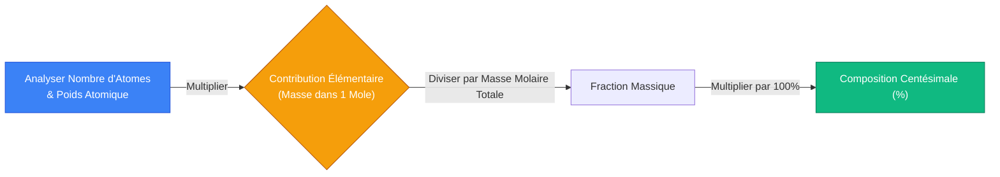
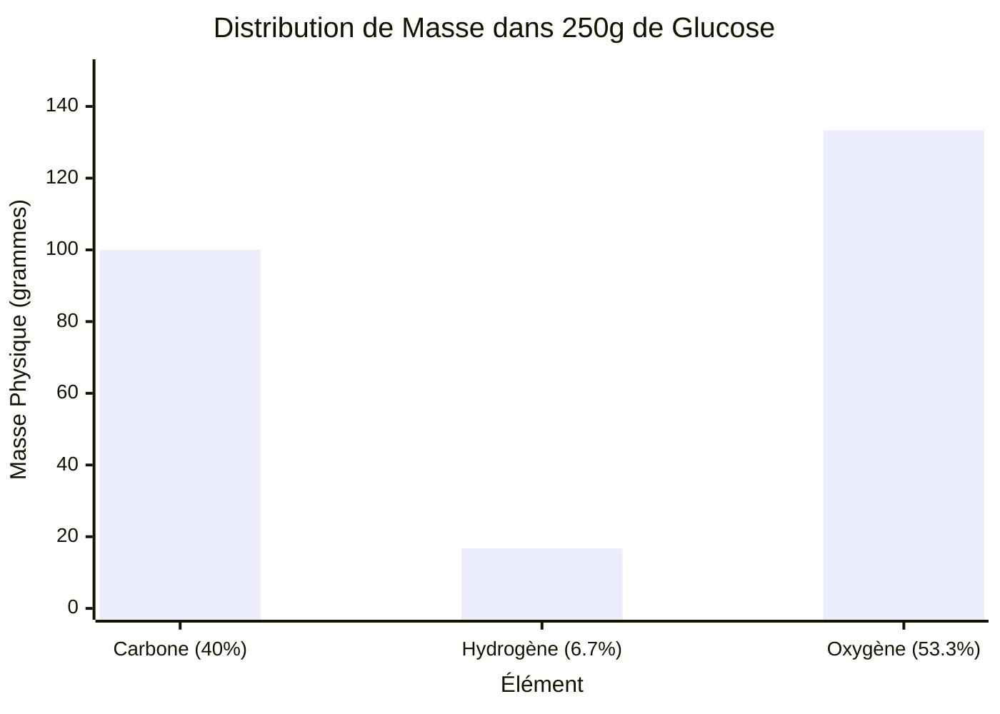
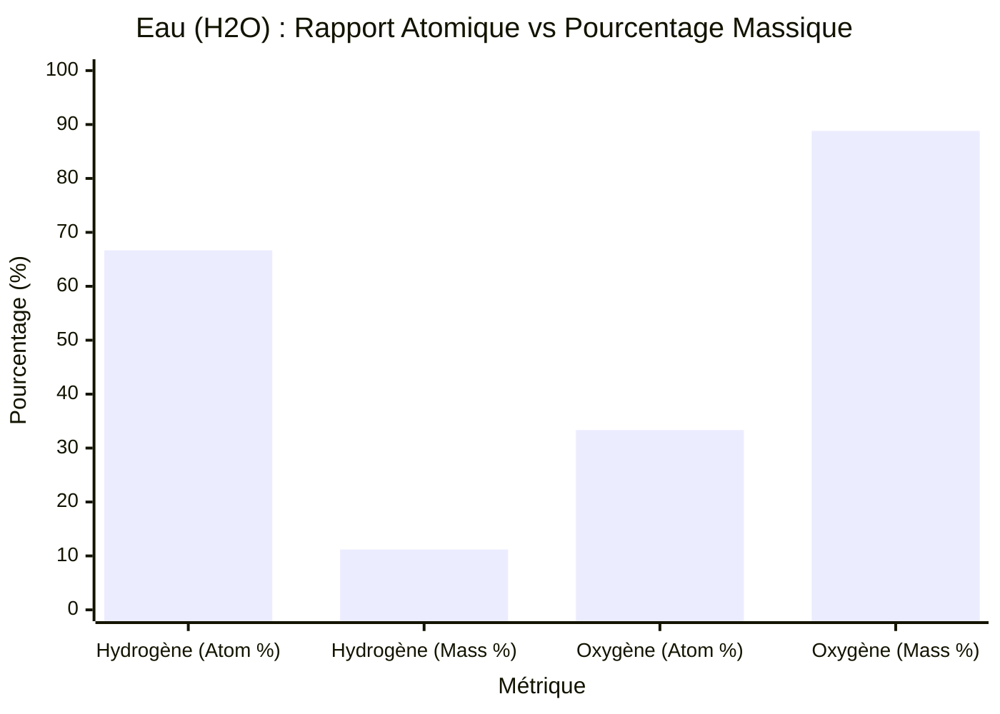
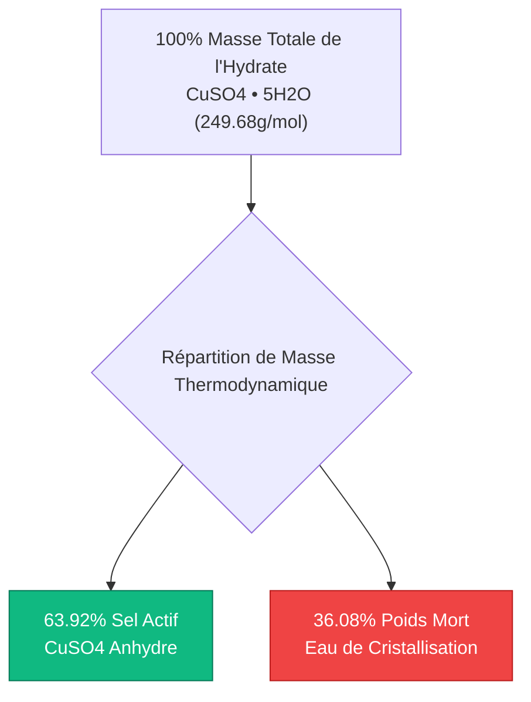
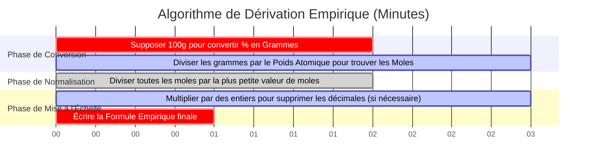

# Le Calculateur Définitif de Composition Centésimale : Fractions Massiques et Analyse Empirique

Bienvenue sur l'ultime **Calculateur de Composition Centésimale** et guide complet de chimie analytique. Que vous soyez un lycéen décodant votre première formule empirique, un chimiste analytique traitant des données d'analyse élémentaire par combustion, ou un ingénieur pharmaceutique concevant des solutions de médicaments physiologiques, maîtriser les mathématiques de la Composition Centésimale en Masse est une nécessité absolue.

Les formules chimiques dictent le rapport entier exact des atomes dans un composé, mais elles NE représentent PAS le rapport massique physique. Parce que différents éléments possèdent des poids atomiques radicalement différents, un élément qui constitue la majorité des *atomes* d'une molécule pourrait contribuer à la plus infime fraction de sa *masse physique*.

Dans cette masterclass SEO exhaustive de plus de 4 000 mots, nous allons déconstruire complètement les algorithmes mathématiques derrière la composition centésimale, exposer les différences critiques entre le Pourcentage Atomique et le Pourcentage Massique, cartographier mathématiquement l'eau d'hydratation des sels cristallins, et décoder le processus étape par étape de dérivation des Formules Empiriques. Pour garantir une compréhension absolue, nous avons inclus cinq diagrammes interactifs Mermaid.js méticuleusement détaillés et adaptés aux parseurs.

---

## 1. Les Mathématiques de la Composition Centésimale en Masse

La **Composition Centésimale en Masse** définit le pourcentage exact de la masse molaire totale d'un composé chimique qui est apporté par chaque élément constitutif.

La loi des proportions définies stipule qu'un composé chimique pur contiendra *toujours* exactement le même rapport massique de ses éléments constitutifs, peu importe que vous ayez $1,0\text{ gramme}$ ou $10 000\text{ kilogrammes}$ de la substance.

**L'Équation de la Composition Centésimale :**
$$\% \text{Élément}_i = \left( \frac{\text{Nombre d'Atomes}_i \times \text{Poids Atomique}_i}{\text{Masse Molaire Totale du Composé}} \right) \times 100\%$$

### Calcul de la Composition Centésimale de l'Eau ($\text{H}_2\text{O}$)
Pour calculer le pourcentage massique de l'eau, nous devons d'abord analyser sa masse molaire :
- **Hydrogène ($\text{H}$) :** $2 \text{ atomes} \times 1,008\text{ g/mol} = 2,016\text{ g/mol}$
- **Oxygène ($\text{O}$) :** $1 \text{ atome} \times 15,999\text{ g/mol} = 15,999\text{ g/mol}$
- **Masse Molaire Totale ($\text{H}_2\text{O}$) : $18,015\text{ g/mol}$**

**Appliquons maintenant l'équation du pourcentage :**
- **% d'Hydrogène :** $(2,016 / 18,015) \times 100\% = \mathbf{11,19\%}$
- **% d'Oxygène :** $(15,999 / 18,015) \times 100\% = \mathbf{88,81\%}$

Parce que les pourcentages doivent totaliser $100\%$, nous pouvons vérifier mathématiquement notre travail : $11,19\% + 88,81\% = 100,00\%$.

---

## 2. La Différence Critique : Pourcentage Atomique vs Pourcentage Massique

Le piège le plus courant pour les étudiants en chimie est de confondre le **Pourcentage Atomique** avec le **Pourcentage Massique**. Ce sont des concepts totalement différents.

Prenons l'Eau ($\text{H}_2\text{O}$).
- **Pourcentage Atomique :** L'eau a 3 atomes au total ($2\text{ H}$, $1\text{ O}$). L'Hydrogène représente $2/3$ des atomes, ce qui en fait **$66,7\%$** de la molécule en nombre d'atomes.
- **Pourcentage Massique :** Comme prouvé ci-dessus, l'Hydrogène ne représente que **$11,19\%$** de la masse physique.

Pourquoi une différence si massive ? Parce qu'un atome d'Oxygène ($15,999\text{ g/mol}$) est presque $16\text{ fois plus lourd}$ qu'un atome d'Hydrogène ($1,008\text{ g/mol}$). Même si l'Hydrogène est 2 fois plus nombreux que l'Oxygène ($2\text{ pour }1$), l'Oxygène domine complètement la masse physique du composé.

---

## 3. Hydrates et Eau de Cristallisation ($\cdot x\text{H}_2\text{O}$)

De nombreux sels ioniques absorbent naturellement les molécules d'eau de l'humidité environnante dans l'atmosphère, piégeant ces molécules d'eau étroitement au sein de leur réseau cristallin 3D. Ce sont les **Hydrates**. 

Lors du calcul de la composition centésimale pour un hydrate, il est critique de déterminer quel pourcentage de la masse totale du cristal est en fait simplement de l'eau piégée.

### Sulfate de Cuivre(II) Pentahydraté ($\text{CuSO}_4\cdot 5\text{H}_2\text{O}$)
- **Sel Anhydre ($\text{CuSO}_4$) :** $159,602\text{ g/mol}$.
- **Eau Piégée ($5\text{H}_2\text{O}$) :** $5 \times 18,015 = 90,075\text{ g/mol}$.
- **Masse Molaire Hydratée Totale :** $159,602 + 90,075 = \mathbf{249,677\text{ g/mol}}$.

**Pourcentage d'Eau :**
$$\% \text{Eau} = \left( \frac{90,075}{249,677} \right) \times 100\% = \mathbf{36,08\%}$$

Si vous achetez $100\text{ lbs}$ de $\text{CuSO}_4\cdot 5\text{H}_2\text{O}$ chez un fournisseur de produits chimiques, $36,08\text{ lbs}$ de ce que vous avez acheté est littéralement juste de l'eau piégée !

---

## 4. Le Pont de la Formule Empirique

La composition centésimale est le pont analytique fondamental requis pour dériver une **Formule Empirique** (le rapport entier d'atomes le plus simple dans un composé). 
Lorsqu'un chimiste analytique fait passer un composé organique inconnu dans un analyseur de combustion, la machine produit la composition centésimale en masse. Le chimiste doit ensuite exécuter un algorithme mathématique strict pour convertir ces pourcentages à nouveau en une formule chimique.

**L'Algorithme de Dérivation Empirique :**
1. **Supposer un Échantillon de $100\text{g}$ :** Traitez chaque pourcentage comme une masse physique en grammes (ex., $40,0\% \text{ de Carbone} = 40,0\text{ grammes de Carbone}$).
2. **Convertir la Masse en Moles :** Divisez la masse de chaque élément par son poids atomique spécifique issu du tableau périodique.
3. **Dériver une Pseudo-Formule :** Vous avez maintenant une formule avec des décimales (ex., $\text{C}_{3,33}\text{H}_{6,66}\text{O}_{3,33}$).
4. **Normaliser en Entiers :** Divisez toutes les valeurs en moles par la plus petite valeur en moles absolue de l'ensemble.
5. **Mettre à l'Échelle en Nombres Entiers :** Si la normalisation entraîne des fractions (comme $0,5$ ou $0,33$), multipliez tous les nombres par un entier ($2$ ou $3$) pour obtenir des indices parfaitement entiers.

---

## 5. Cinq Scénarios d'Ingénierie Conceptuelle avec des Visualisations 2D

Pour maîtriser pleinement les algorithmes régissant la composition centésimale, les distributions massiques et les dérivations empiriques, nous explorerons cinq scénarios de chimie analytique distincts décomposés visuellement à l'aide de diagrammes Mermaid.js personnalisés.

### Exemple 1 : L'Algorithme de Calcul de la Composition Centésimale

**Le Scénario :**
Un étudiant en informatique essaie de cartographier le chemin de logique mathématique requis pour dériver informatiquement la composition centésimale.

**Visualisation 2D :**
Ce diagramme logique cartographie la voie de conversion bipartite stricte liant les poids atomiques aux pourcentages massiques finaux.

---

### Exemple 2 : Distribution de la Masse d'un Échantillon (Glucose)

**Le Scénario :**
Un nutritionniste doit déterminer exactement combien de grammes physiques de Carbone sont contenus dans un bloc de $250,0\text{ grammes}$ de Glucose pur ($\text{C}_6\text{H}_{12}\text{O}_6$). 
Puisque le Glucose est composé à exactement $40,00\%$ de Carbone en masse, nous multiplions $250\text{g} \times 0,400 = 100,0\text{g}$.

**Visualisation 2D :**
Ce graphique prouve visuellement comment une masse d'échantillon macroscopique totale est physiquement distribuée parmi ses éléments constitutifs, en se basant strictement sur leurs pourcentages massiques calculés.

---

### Exemple 3 : Le Paradoxe du Pourcentage Atomique vs Pourcentage Massique

**Le Scénario :**
Un étudiant de première année en chimie a du mal à comprendre comment l'Hydrogène, qui représente $66,7\%$ des atomes dans l'eau, ne contribue qu'à hauteur de $11,19\%$ de la masse.

**Visualisation 2D :**
Ce graphique comparatif côte à côte expose visuellement l'écart massif entre les métriques de comptage d'atomes et les métriques de masse physique en raison des disparités extrêmes de poids atomique.

---

### Exemple 4 : Décomposition de la Masse du Réseau des Hydrates

**Le Scénario :**
Un fournisseur de produits chimiques calcule le gaspillage financier lié à l'expédition d'hydrates chimiques "humides" à travers le pays, car il paie des frais de transport pour de l'eau piégée.

**Visualisation 2D :**
Cet organigramme descendant cartographie la répartition en pourcentage exacte du Sulfate de Cuivre(II) Pentahydraté, prouvant que plus d'un tiers du poids du cristal est de l'eau économiquement inutile.

---

### Exemple 5 : Chronologie de Dérivation de la Formule Empirique

**Le Scénario :**
Un chimiste analytique extrait les pourcentages massiques d'un analyseur de combustion et exécute l'algorithme mathématique strict pour dériver la formule empirique du composé inconnu.

**Visualisation 2D :**
Ce diagramme de Gantt visualise la séquence chronologique des transformations mathématiques requises pour convertir les pourcentages à nouveau en indices chimiques entiers.

---

## 6. Conclusion et Défi de Stœchiométrie

Maîtriser la Composition Centésimale est la fondation incontournable de toute la chimie analytique. Comprendre la stricte différence entre les rapports atomiques et les fractions massiques, respecter l'énorme empreinte de densité de l'eau des hydrates piégée, et inverser mathématiquement les pourcentages en formules empiriques garantira que vos rendements d'analyse en laboratoire sont parfaitement précis.

Si vous ignorez ces principes mathématiques, vous ferez de graves erreurs de calcul des dosages de réactifs, expédierez des hydrates chimiques inefficaces, et échouerez à chaque analyse par spectrométrie de masse que vous effectuerez.

Pour garantir que vous avez maîtrisé ces concepts critiques, lancez notre Simulateur interactif et essayez de résoudre ces derniers défis de chimie analytique :
1. **Le Défi de l'Engrais :** Quel engrais agricole contient un pourcentage plus élevé d'Azote pur en masse : l'Ammoniac ($\text{NH}_3$) ou le Nitrate d'Ammonium ($\text{NH}_4\text{NO}_3$) ? Vous devez calculer les deux pour le découvrir !
2. **Le Défi de l'Hydrate :** Vous avez un échantillon de $500,0\text{g}$ de Sulfate de Magnésium Heptahydraté ($\text{MgSO}_4\cdot 7\text{H}_2\text{O}$). Exactement combien de grammes physiques d'eau sont piégés à l'intérieur de ce bloc solide ?
3. **Le Défi Empirique :** Un analyseur de combustion rapporte qu'un gaz inconnu est composé d'exactement $74,87\%$ de Carbone et $25,13\%$ d'Hydrogène en masse. Exécutez l'algorithme de dérivation empirique pour déterminer la formule chimique de ce gaz. (Indice : il alimente votre cuisinière).

Fiez-vous à ce calculateur pour auditer vos résultats de combustion analytique, déterminer rapidement les distributions de charge utile élémentaire, et maîtriser définitivement les mathématiques de la stœchiométrie physique.
