# Guide de Chimie Analytique & de Laboratoire sur le pH & l'Équilibre Acide-Base

En chimie analytique et physique, le **pH** mesure l'activité des ions hydrogène dans les solutions aqueuses :

$$\text{pH} = -\log_{10}[\text{H}^+] \quad \iff \quad [\text{H}^+] = 10^{-\text{pH}}$$

$$\text{pH} + \text{pOH} = \text{p}K_w \quad \text{où } K_w = [\text{H}^+][\text{OH}^-]$$

---

## 1. Matrice de Référence du $K_w$ Dépendant de la Température & du pH Neutre

| Température (°C) | Auto-ionisation de l'Eau ($K_w$) | $\text{p}K_w$ | pH Neutre ($\frac{1}{2}\text{p}K_w$) | Note Physiologique / Contexte |
| :--- | :--- | :--- | :--- | :--- |
| **$0^\circ\text{C}$** | $1.14 \times 10^{-15}$ | $14.94$ | **$7.47$** | Point de congélation de l'eau |
| **$25^\circ\text{C}$** | $1.00 \times 10^{-14}$ | $14.00$ | **$7.00$** | Référence standard de laboratoire |
| **$37^\circ\text{C}$** | $2.40 \times 10^{-14}$ | $13.62$ | **$6.81$** | Température corporelle humaine normale |
| **$60^\circ\text{C}$** | $9.60 \times 10^{-14}$ | $13.02$ | **$6.51$** | Eau de procédé chauffée |

---

## 2. Protocoles Standard de Calcul Acide-Base

```
1. Acide Fort (monoprotique) : [H+] = C_acide  ===>  pH = -log10[C_acide]
2. Base Forte (monohydroxyde) : [OH-] = C_base  ===>  pOH = -log10[C_base]  ===>  pH = pKw - pOH
3. Acide Faible (HA <==> H+ + A-) : Résoudre x^2 + Ka*x - Ka*C = 0  ===>  pH = -log10(x)
4. Solution Tampon : pH = pKa + log10([Base Conjuguée] / [Acide Faible])
```

---

## 3. Avertissement de Sécurité Éducative & de Laboratoire
*Ce calculateur de pH fournit des calculs d'équilibre acide-base théoriques pour l'éducation, la recherche en laboratoire et les applications de chimie AP. Les solutions non idéales concentrées et les tampons analytiques précis doivent tenir compte de la force ionique et des coefficients d'activité à l'aide de pH-mètres étalonnés.*

## 4. Le Guide Complet sur le pH et la Chimie Acide-Base

Bienvenue dans le guide définitif sur la compréhension, le calcul et la manipulation du pH dans les solutions chimiques. Que vous soyez un lycéen découvrant les logarithmes pour la première fois, un étudiant en chimie AP se préparant à des problèmes d'équilibre épuisants, ou un biochimiste modélisant des systèmes tampons du sang humain, la maîtrise du pH est essentielle pour naviguer dans le monde moléculaire.

À la base, le pH est une mesure de l'acidité ou de la basicité d'une solution aqueuse (à base d'eau). Il dicte directement comment les molécules se comporteront, comment les enzymes se replieront et comment les réactions industrielles se dérouleront. Un léger décalage du pH de la circulation sanguine humaine peut être fatal, tandis qu'un décalage du pH du sol peut déterminer si une culture entière donne une récolte ou se flétrit.

Dans ce guide exhaustif, nous explorerons la mécanique profonde de la chimie acide-base, dévoilerons les mathématiques logarithmiques qui régissent l'échelle de pH, expliquerons la dépendance à la température souvent mal comprise de la neutralité, et parcourrons cinq exemples concrets hautement détaillés avec des démonstrations mathématiques et des diagrammes visuels 2D.

### 4.1 Qu'est-ce que le pH Exactement ?

Le terme "pH" signifie "potentiel hydrogène" (ou "pouvoir de l'hydrogène"). C'est une échelle logarithmique utilisée pour spécifier l'acidité ou la basicité d'une solution aqueuse. Mathématiquement, le pH est le logarithme négatif en base 10 de la concentration molaire en ions hydrogène ($\text{H}^+$) dans une solution.

Étant donné qu'un ion hydrogène nu (un seul proton) n'existe pas isolément dans l'eau, il se fixe à une molécule d'eau pour former un ion hydronium ($\text{H}_3\text{O}^+$). Pour des raisons de simplicité dans les calculs, $\text{H}^+$ et $\text{H}_3\text{O}^+$ sont utilisés de manière interchangeable.

$$ \text{pH} = -\log_{10}[\text{H}^+] $$

L'échelle étant logarithmique, un changement d'**une unité de pH** représente un **changement d'un facteur dix** de la concentration en ions hydrogène. Une solution avec un pH de 3 est dix fois plus acide qu'une solution avec un pH de 4, et cent fois plus acide qu'une solution avec un pH de 5.

### 4.2 L'Interaction du pH et du pOH

Tout comme le pH mesure la concentration d'ions hydrogène, **le pOH** mesure la concentration d'ions hydroxyde ($\text{OH}^-$). 

$$ \text{pOH} = -\log_{10}[\text{OH}^-] $$

Dans l'eau pure, les molécules d'eau s'auto-ionisent, se séparant spontanément en ions hydrogène et hydroxyde :
$\text{H}_2\text{O} \rightleftharpoons \text{H}^+ + \text{OH}^-$

La constante d'équilibre de cette réaction est connue sous le nom de constante d'auto-ionisation de l'eau, $K_w$. À température ambiante standard (25°C), $K_w$ est exactement $1.0 \times 10^{-14}$. 

Cela crée une relation mathématique rigide entre le pH et le pOH. À 25°C :
$$ \text{pH} + \text{pOH} = 14.00 $$

Si vous connaissez le pH, vous connaissez immédiatement le pOH, et par conséquent vous connaissez la concentration des deux ions critiques dans la solution.

### 4.3 Le Mythe de la Température : Le pH Neutre est-il Toujours de 7.00 ?

Une idée fausse courante enseignée en chimie d'introduction est qu'un pH neutre est rigidement fixé à 7.00. **C'est fondamentalement faux.** 

La neutralité signifie simplement que la concentration d'ions hydrogène est égale à la concentration d'ions hydroxyde ($[\text{H}^+] = [\text{OH}^-]$). L'auto-ionisation de l'eau étant un processus endothermique, l'augmentation de la température fait avancer la réaction, créant *plus* d'ions et augmentant ainsi le $K_w$.

*   À **0°C** (congélation), le $K_w$ chute à $1.14 \times 10^{-15}$. Le pH neutre est de **7.47**.
*   À **25°C** (température ambiante), le $K_w$ est de $1.0 \times 10^{-14}$. Le pH neutre est de **7.00**.
*   À **37°C** (température corporelle), le $K_w$ s'élève à $2.4 \times 10^{-14}$. Le pH neutre est de **6.81**.

Notre calculateur comprend un moteur sophistiqué de $K_w$ Dépendant de la Température qui ajuste dynamiquement l'échelle en fonction de la température saisie, garantissant une précision physiologique et thermodynamique absolue.

---

## 5. Guide d'Utilisation : Maîtriser le Calculateur de pH

Notre Calculateur de pH est conçu avec un "Cockpit Interactif" qui fournit à la fois des conversions instantanées et des solveurs algorithmiques approfondis pour des équilibres complexes.

### 5.1 Conversions Logarithmiques Directes

Si vous avez simplement besoin de convertir entre $[\text{H}^+]$, $[\text{OH}^-]$, pH et pOH :
1.  **Sélectionnez le Mode :** Choisissez "pH à partir de [H+]" ou la conversion pertinente.
2.  **Saisissez la Valeur :** Vous pouvez utiliser la notation décimale (`0.001`) ou la notation scientifique (`1e-3`).
3.  **Lisez le Résultat :** Le calculateur remplira instantanément les quatre coins du carré acide-base (pH, pOH, $[\text{H}^+]$, $[\text{OH}^-]$) et classera la solution sur le spectre de 0-14.

### 5.2 Équilibre d'Acide Faible et de Base Faible

Contrairement aux acides forts qui se dissocient à 100%, les acides faibles (comme l'acide acétique, le vinaigre) ne se dissocient que partiellement. Pour trouver leur pH, vous devez résoudre une équation quadratique basée sur la Constante de Dissociation Acide ($K_a$).
1.  **Sélectionnez le Mode :** Choisissez "Résolveur d'Équilibre d'un Acide Faible".
2.  **Saisissez les Paramètres :** Entrez la Concentration Initiale de l'acide ($C$) et son $K_a$ (ou $\text{p}K_a$).
3.  **Exécutez :** Le calculateur résout en interne l'équation quadratique $x^2 + K_a x - K_a C = 0$ pour trouver le $[\text{H}^+]$ exact.

### 5.3 Solutions Tampons et Henderson-Hasselbalch

Les tampons résistent aux changements de pH et sont essentiels en biologie. 
1.  **Sélectionnez le Mode :** Choisissez "Calculateur d'Henderson-Hasselbalch".
2.  **Saisissez les Paramètres :** Entrez le $\text{p}K_a$ de l'acide faible, la concentration de la Base Conjuguée et la concentration de l'Acide Faible.
3.  **Exécutez :** L'outil applique la formule $\text{pH} = \text{p}K_a + \log([\text{Base}]/[\text{Acide}])$ pour trouver le pH tamponné.

---

## 6. Cinq Exemples de Concepts du Monde Réel

Pour vraiment maîtriser la chimie acide-base, vous devez voir ces principes appliqués à des scénarios distincts. Vous trouverez ci-dessous cinq exemples détaillés allant de la dilution d'un acide fort aux tampons biochimiques complexes.

### Exemple 1 : L'Acide Fort (Acide Gastrique)

**Scénario :** 
L'acide gastrique de l'estomac humain contient de l'acide chlorhydrique concentré ($\text{HCl}$), un acide fort qui se dissocie complètement pour digérer les aliments. Si un échantillon de laboratoire de liquide gastrique simulé a une concentration en $\text{HCl}$ de $0.0316\text{ M}$, quel est son pH à 25°C ?

**Démonstration Mathématique :**

1.  **Identifiez l'Acide Fort :** $\text{HCl}$ se dissocie complètement, donc $[\text{H}^+] = [\text{HCl}] = 0.0316\text{ M}$.
2.  **Calculez le pH :**
    $$ \text{pH} = -\log_{10}(0.0316) $$
    $$ \text{pH} = 1.50 $$
3.  **Calculez le pOH et $[\text{OH}^-]$ :**
    $$ \text{pOH} = 14.00 - 1.50 = 12.50 $$
    $$ [\text{OH}^-] = 10^{-12.50} = 3.16 \times 10^{-13}\text{ M} $$

**Visualisation : Flux de Concentration**


*Comme il s'agit d'un acide fort, le calcul est une étape mathématique directe et linéaire. Le rouge foncé indique une forte acidité.*

### Exemple 2 : L'Acide Faible (Vinaigre / Acide Acétique)

**Scénario :**
L'acide acétique ($\text{CH}_3\text{COOH}$) est le composant principal du vinaigre. C'est un acide faible avec un $K_a$ de $1.8 \times 10^{-5}$. Si vous avez une solution de $0.10\text{ M}$ d'acide acétique, quel est le pH ?

**Démonstration Mathématique :**

1.  **Mettez en place le Tableau ICE (Initial, Changement, Équilibre) :**
    *   Initial : $[\text{HA}] = 0.10$, $[\text{H}^+] = 0$, $[\text{A}^-] = 0$
    *   Changement : $-x$, $+x$, $+x$
    *   Équilibre : $0.10 - x$, $x$, $x$
2.  **Mettez en place l'Équation Quadratique :**
    $$ K_a = \frac{x^2}{0.10 - x} = 1.8 \times 10^{-5} $$
    $$ x^2 + (1.8 \times 10^{-5})x - 1.8 \times 10^{-6} = 0 $$
3.  **Résolvez pour $x$ ($[\text{H}^+]$) :**
    En utilisant la formule quadratique, $x \approx 0.00133\text{ M}$.
4.  **Calculez le pH :**
    $$ \text{pH} = -\log_{10}(0.00133) = 2.88 $$

**Visualisation : Approximation vs Quadratique Exacte**

| Méthode | $[\text{H}^+]$ (M) | pH Calculé | % d'Erreur |
| :--- | :--- | :--- | :--- |
| **Formule Quadratique (Exacte)** | $0.001333$ | $2.875$ | $0.00\%$ |
| **Approximation ($0.10 - x \approx 0.10$)** | $0.001341$ | $2.872$ | $0.10\%$ |

*Bien que la méthode d'approximation soit souvent enseignée au lycée, notre calculateur utilise TOUJOURS le solveur quadratique exact pour éviter les erreurs massives lors du traitement de solutions plus diluées.*

### Exemple 3 : Le Tampon Sanguin (Henderson-Hasselbalch)

**Scénario :**
Le sang humain est fortement tamponné par le système acide carbonique-bicarbonate pour maintenir un pH strict. Le $\text{p}K_a$ de l'acide carbonique ($\text{H}_2\text{CO}_3$) à la température du corps est de 6.10. Chez un patient en bonne santé, la concentration de bicarbonate ($\text{HCO}_3^-$) est de $24\text{ mM}$ et l'acide carbonique est de $1.2\text{ mM}$. Vérifiez le pH sanguin.

**Démonstration Mathématique :**

1.  **Identifiez la Formule :** Équation d'Henderson-Hasselbalch.
    $$ \text{pH} = \text{p}K_a + \log_{10}\left(\frac{[\text{Base}]}{[\text{Acide}]}\right) $$
2.  **Entrez les Valeurs :**
    $$ \text{pH} = 6.10 + \log_{10}\left(\frac{24}{1.2}\right) $$
3.  **Calculez :**
    $$ \text{pH} = 6.10 + \log_{10}(20) $$
    $$ \text{pH} = 6.10 + 1.30 = 7.40 $$

*Le résultat est précisément de 7.40, le pH idéal des manuels pour le sang artériel humain.*

### Exemple 4 : Changement de Température de l'Eau Pure

**Scénario :**
Un ingénieur surveille l'eau de refroidissement d'un réacteur nucléaire. L'eau pure et désionisée fonctionne à $60^\circ\text{C}$. Le pH-mètre indique 6.51. L'ingénieur panique, pensant que l'eau est devenue dangereusement acide en raison d'une fuite chimique. L'eau est-elle acide ?

**Démonstration Mathématique :**

1.  **Identifiez le $K_w$ à 60°C :** Selon les tables thermodynamiques, le $K_w$ à $60^\circ\text{C}$ est de $9.60 \times 10^{-14}$.
2.  **Calculez $[\text{H}^+]$ pour de l'eau pure et neutre :**
    $$ [\text{H}^+] = \sqrt{K_w} = \sqrt{9.60 \times 10^{-14}} = 3.098 \times 10^{-7}\text{ M} $$
3.  **Calculez le pH Neutre :**
    $$ \text{pH} = -\log_{10}(3.098 \times 10^{-7}) = 6.51 $$

**Conclusion :** L'eau est **parfaitement neutre**. Le pH est simplement plus bas car la température élevée a fait avancer l'auto-ionisation, créant des quantités égales à la fois de $[\text{H}^+]$ et de $[\text{OH}^-]$. L'ingénieur n'a pas à paniquer.

### Exemple 5 : Dilution d'Acide (Chronologie de Dilution en Série)

**Scénario :**
Un technicien de laboratoire prend $10\text{ mL}$ d'un acide fort avec un pH de 3.00 et le dilue avec de l'eau pure jusqu'à un volume final de $1000\text{ mL}$ (une dilution au 1:100). Quel est le nouveau pH ?

**Démonstration Mathématique :**

1.  **Trouvez le $[\text{H}^+]$ Initial :**
    $$ [\text{H}^+]_{\text{initial}} = 10^{-3.00} = 0.001\text{ M} $$
2.  **Calculez la Dilution ($M_1V_1 = M_2V_2$) :**
    $$ (0.001\text{ M})(10\text{ mL}) = (M_2)(1000\text{ mL}) $$
    $$ M_2 = 0.00001\text{ M} = 10^{-5}\text{ M} $$
3.  **Calculez le Nouveau pH :**
    $$ \text{pH} = -\log_{10}(10^{-5}) = 5.00 $$

**Visualisation : Chronologie de Laboratoire de Dilution en Série**

```mermaid
gantt
    title Chronologie de Laboratoire : Processus de Dilution en Série
    dateFormat  HH:mm:ss
    axisFormat  %H:%M
    section Préparation
    Mesurer 10mL (pH 3.00) :active, 00:00:00, 00:05:00
    Transférer dans une Fiole Jaugée :active, 00:05:00, 00:07:00
    section Dilution
    Ajouter 990mL d'Eau Désionisée :crit, 00:07:00, 00:15:00
    Homogénéisation / Mélange :active, 00:15:00, 00:20:00
    section Analyse
    Mesurer le Nouveau pH (5.00) :milestone, 00:20:00, 00:20:00
```



*Ce diagramme de Gantt décrit les étapes physiques de laboratoire qui accompagnent le calcul mathématique d'une dilution en série.*

---

## 7. FAQ Approfondie et Dépannage Avancé

**Q : Le pH peut-il être négatif ?**
**R :** Oui ! C'est un mythe mathématique que l'échelle de pH s'arrête absolument à 0 et 14. Si vous avez un acide fort très concentré, comme une solution de $10\text{ M}$ de $\text{HCl}$, le pH est $-\log(10) = -1.0$. À l'inverse, une solution de $10\text{ M}$ de $\text{NaOH}$ a un pH de $15.0$.

**Q : Pourquoi le calculateur demande-t-il la température ?**
**R :** Parce que la constante d'auto-ionisation de l'eau ($K_w$) est fortement dépendante de la température. Si vous calculez le pH d'une base à partir de sa concentration en $[\text{OH}^-]$, la formule $\text{pH} = \text{p}K_w - \text{pOH}$ nécessite le $\text{p}K_w$ exact à cette température spécifique pour être analytiquement précise. 

**Q : Quelle est la différence entre $K_a$ et $\text{p}K_a$ ?**
**R :** $K_a$ est la constante de dissociation de l'acide, qui est souvent un très petit nombre (comme $1.8 \times 10^{-5}$). $\text{p}K_a$ est le logarithme négatif en base 10 de $K_a$ (dans ce cas, 4.74). Il est beaucoup plus facile de parler de valeurs de $\text{p}K_a$. N'oubliez pas : plus le $\text{p}K_a$ est petit, plus l'acide est fort !

**Q : Diluer un acide à l'infini finira-t-il par le rendre basique ?**
**R :** Non. Au fur et à mesure que vous diluez infiniment un acide avec de l'eau pure et neutre, le pH s'approche asymptotiquement de 7.00 mais ne le franchira jamais dans le domaine basique (ex. pH 8). À des dilutions extrêmement élevées (par exemple, $10^{-8}\text{ M HCl}$), l'auto-ionisation de l'eau elle-même contribue à plus de $[\text{H}^+]$ que ne le fait l'acide, nécessitant un calcul d'équilibre systématique complexe pour être résolu.

**Q : Comment cela se rapporte-t-il aux Tampons et aux Titrages ?**
**R :** Les équations fondamentales qui sous-tendent le pH sont utilisées pour construire des courbes de titrage. Lorsque vous ajoutez lentement une base forte à un acide faible, vous créez une région tampon régie par l'équation d'Henderson-Hasselbalch jusqu'à ce que vous atteigniez le point d'équivalence. Comprendre ces conversions de pH de base est la première étape pour maîtriser l'analyse de titrage.

En maîtrisant l'interaction mathématique entre les ions hydrogène, les ions hydroxyde et les échelles logarithmiques, vous obtenez un contrôle profond sur l'environnement chimique. Assurez-vous d'utiliser ce calculateur de pH à la fois comme un outil analytique de précision et comme une garantie éducative pour vérifier vos calculs de laboratoire !
