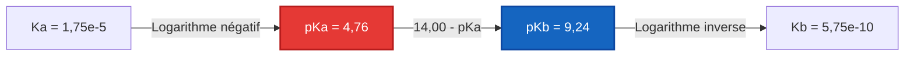

# Guide de chimie analytique et de laboratoire pour l'analyse du pKa et de la force des acides

En chimie organique physique et analytique quantitative, le **$\text{p}K_a$** quantifie la tendance thermodynamique d'un acide à se dissocier en milieu aqueux :

$$\text{p}K_a = -\log_{10}(K_a) \quad \iff \quad K_a = 10^{-\text{p}K_a}$$

$$\text{p}K_a + \text{p}K_b = \text{p}K_w \quad \text{où } K_w = K_a \cdot K_b = 1,00 \times 10^{-14} \text{ à } 25^\circ\text{C}$$

---

## 1. Classification de la force des acides et matrice de référence

| Nom de l'acide | Formule | $K_a$ ($25^\circ\text{C}$) | $\text{p}K_a$ ($25^\circ\text{C}$) | Base conjuguée ($\text{A}^-$) | Classification de force |
| :--- | :--- | :--- | :--- | :--- | :--- |
| **Acide chlorhydrique** | $\text{HCl}$ | $\sim 1 \times 10^7$ | **$-7,0$** | $\text{Cl}^-$ | Acide fort |
| **Acide nitrique** | $\text{HNO}_3$ | $\sim 2,4 \times 10^1$ | **$-1,4$** | $\text{NO}_3^-$ | Acide fort |
| **Acide phosphorique ($\text{p}K_{a1}$)** | $\text{H}_3\text{PO}_4$ | $7,1 \times 10^{-3}$ | **$2,15$** | $\text{H}_2\text{PO}_4^-$ | Acide moyennement fort |
| **Acide acétique** | $\text{CH}_3\text{COOH}$ | $1,75 \times 10^{-5}$ | **$4,76$** | $\text{CH}_3\text{COO}^-$ | Acide faible |
| **Acide carbonique ($\text{p}K_{a1}$)** | $\text{H}_2\text{CO}_3$ | $4,5 \times 10^{-7}$ | **$6,35$** | $\text{HCO}_3^-$ | Acide faible |
| **Acide cyanhydrique** | $\text{HCN}$ | $6,2 \times 10^{-10}$ | **$9,21$** | $\text{CN}^-$ | Acide très faible |

---

## 2. Protocoles standards de calcul de dissociation acide

```
1. pKa à partir de Ka : pKa = -log10(Ka)
2. Ka à partir de pKa : Ka = 10^(-pKa)
3. pKb de la base conjuguée : pKb = pKw - pKa  ===>  Kb = 10^(-pKb)
4. Équilibre des acides faibles : Résoudre x^2 + Ka*x - Ka*C = 0  ===>  [H+] = x, pH = -log10(x)
5. Henderson-Hasselbalch : pH = pKa + log10([Base conjuguée A-] / [Acide faible HA])
```

---

## 3. Avis de non-responsabilité en matière d'éducation et de sécurité en laboratoire
*Ce calculateur de pKa fournit des calculs théoriques de dissociation d'acide pour l'éducation, la recherche en laboratoire et les applications de chimie AP. Les solutions non idéales à forces ioniques élevées doivent tenir compte des coefficients d'activité à l'aide des équations de Debye-Hückel ou de Pitzer.*

## 4. Le guide complet du pKa et de la force des acides

Bienvenue dans le guide définitif sur la compréhension, le calcul et l'application du $\text{p}K_a$ dans les systèmes chimiques. Alors que le pH mesure l'acidité d'une *solution* à un moment donné, le $\text{p}K_a$ mesure la force intrinsèque de *l'acide lui-même*. Que vous soyez un lycéen apprenant les bases conjuguées, un chimiste analytique déterminant le point de demi-équivalence dans un titrage, ou un biochimiste modélisant l'état de protonation des acides aminés dans une protéine, la maîtrise du $\text{p}K_a$ est non négociable.

À la base, le $\text{p}K_a$ dicte si une molécule conservera son proton (ion hydrogène) ou le donnera au milieu environnant. Il régit l'absorption des produits pharmaceutiques dans l'estomac humain, la capacité tampon de l'eau de l'océan et la vitesse de la synthèse industrielle catalysée par l'acide.

Dans ce guide exhaustif, nous explorerons la thermodynamique de la dissociation des acides, décomposerons les mathématiques logarithmiques qui associent $K_a$ à $\text{p}K_a$, détaillerons le comportement complexe des acides polyprotiques (comme l'acide phosphorique) et passerons en revue cinq exemples concrets très détaillés accompagnés de dérivations mathématiques et de diagrammes visuels strictement formatés.

### 4.1 Qu'est-ce que le pKa exactement ?

Lorsqu'un acide (HA) se dissout dans l'eau, il atteint un état d'équilibre où une fraction des molécules d'acide donne un proton à l'eau, formant des ions hydronium ($\text{H}_3\text{O}^+$) et des ions de base conjuguée ($\text{A}^-$) :
$\text{HA} + \text{H}_2\text{O} \rightleftharpoons \text{H}_3\text{O}^+ + \text{A}^-$

La constante d'équilibre pour cette dissociation spécifique est appelée constante de dissociation acide, $K_a$ :
$$ K_a = \frac{[\text{H}^+][\text{A}^-]}{[\text{HA}]} $$

Étant donné que les valeurs de $K_a$ pour les acides faibles sont des nombres extrêmement petits (par exemple, $1,8 \times 10^{-5}$ pour l'acide acétique) avec de grands exposants négatifs, les chimistes utilisent une échelle logarithmique pour les rendre plus faciles à manipuler. C'est le **$\text{p}K_a$** :
$$ \text{p}K_a = -\log_{10}(K_a) $$

**La règle d'or du pKa :** Plus la valeur du $\text{p}K_a$ est petite (ou plus elle est négative), plus l'acide est **fort**. 
- Un $\text{p}K_a$ de -7 (Acide chlorhydrique) signifie qu'il s'agit d'un donneur de protons massif et agressif. 
- Un $\text{p}K_a$ de 4,76 (Acide acétique) signifie qu'il s'agit d'un donneur de protons faible. 
- Un $\text{p}K_a$ de 15,7 (L'eau agissant comme un acide) signifie qu'il s'agit d'un donneur de protons incroyablement médiocre.

L'échelle étant logarithmique, un acide avec un $\text{p}K_a$ de 3 est **dix fois plus fort** qu'un acide avec un $\text{p}K_a$ de 4, et cent fois plus fort qu'un acide avec un $\text{p}K_a$ de 5.

### 4.2 La bascule conjuguée : pKa et pKb

Chaque acide (HA) a une base conjuguée ($\text{A}^-$). Si l'acide est fort (il veut vraiment céder un proton), sa base conjuguée doit être faible (elle ne veut vraiment PAS reprendre de proton). Cette relation est mathématiquement verrouillée par la constante d'auto-ionisation de l'eau ($K_w$).

$$ K_a \times K_b = K_w $$
$$ \text{p}K_a + \text{p}K_b = 14,00 \quad (\text{à } 25^\circ\text{C}) $$

Si vous connaissez le $\text{p}K_a$ d'un acide, vous connaissez instantanément le $\text{p}K_b$ de sa base conjuguée. Par exemple, si l'acide acétique a un $\text{p}K_a$ de 4,76, l'ion acétate ($\text{CH}_3\text{COO}^-$) a un $\text{p}K_b$ de 9,24.

### 4.3 Acides polyprotiques : Personnalités multiples

Certains acides possèdent plus d'un proton pouvant être donné. On les appelle des **acides polyprotiques**. Les exemples les plus célèbres sont l'acide sulfurique ($\text{H}_2\text{SO}_4$) et l'acide phosphorique ($\text{H}_3\text{PO}_4$). 

Les acides polyprotiques se dissocient en étapes distinctes, et chaque étape a sa propre valeur de $K_a$ et $\text{p}K_a$. 
Pour $\text{H}_3\text{PO}_4$ :
1.  **$\text{p}K_{a1} = 2,15$** : $\text{H}_3\text{PO}_4 \rightleftharpoons \text{H}_2\text{PO}_4^- + \text{H}^+$
2.  **$\text{p}K_{a2} = 7,20$** : $\text{H}_2\text{PO}_4^- \rightleftharpoons \text{HPO}_4^{2-} + \text{H}^+$
3.  **$\text{p}K_{a3} = 12,35$** : $\text{HPO}_4^{2-} \rightleftharpoons \text{PO}_4^{3-} + \text{H}^+$

Notez que chaque proton successif est plus difficile à éliminer que le précédent. En effet, l'élimination d'un proton chargé positivement d'une molécule de plus en plus chargée négativement nécessite beaucoup plus d'énergie thermodynamique. Par conséquent, **$\text{p}K_{a1} < \text{p}K_{a2} < \text{p}K_{a3}$** est toujours vrai.

---

## 5. Guide d'utilisation : Maîtriser le calculateur de pKa

Notre calculateur de pKa est un outil analytique de qualité professionnelle conçu pour des conversions rapides et une cartographie complexe de l'équilibre polyprotique.

### 5.1 Conversions logarithmiques directes

Si vous avez simplement besoin d'interconvertir $K_a$, $\text{p}K_a$, $K_b$ et $\text{p}K_b$ :
1.  **Sélectionnez le mode :** Choisissez "pKa à partir de Ka" ou "Ka à partir de pKa".
2.  **Entrez la valeur :** Vous pouvez utiliser la notation décimale (`0.000018`) ou la notation scientifique (`1.8e-5`).
3.  **Lisez le résultat :** Le calculateur complète instantanément le profil acido-basique, en fournissant les paramètres de la base conjuguée ($\text{p}K_b$) et en classant la force de l'acide.

### 5.2 Titrage et demi-équivalence

Le $\text{p}K_a$ est révélé comme par magie lors d'un titrage acide faible/base forte.
1.  **Sélectionnez le mode :** Choisissez "pKa à partir du pH mesuré et de la concentration".
2.  **Entrez les paramètres :** Entrez le pH de la solution au **Point de demi-équivalence** (le moment exact où vous avez neutralisé exactement la moitié de l'acide faible).
3.  **Exécutez :** L'outil exploite l'équation de Henderson-Hasselbalch. Puisque $[\text{A}^-] = [\text{HA}]$ à ce point exact, $\log(1) = 0$, et par conséquent **$\text{pH} = \text{p}K_a$**.

### 5.3 Équilibre quadratique des acides faibles

Pour trouver le pH exact d'un acide faible dissous dans l'eau :
1.  **Sélectionnez le mode :** Choisissez "Solveur d'équilibre des acides faibles".
2.  **Entrez les paramètres :** Entrez la concentration initiale ($C$) et le $\text{p}K_a$.
3.  **Exécutez :** Le calculateur convertit le $\text{p}K_a$ en $K_a$ et résout exactement l'équation du second degré $x^2 + K_a x - K_a C = 0$ pour trouver la véritable concentration en hydronium.

---

## 6. Cinq exemples de concepts du monde réel

Pour maîtriser la force des acides, nous devons appliquer le logarithme abstrait aux systèmes physico-chimiques. Vous trouverez ci-dessous cinq exemples détaillés couvrant des conversions simples, le tamponnage pharmaceutique et la cartographie des espèces polyprotiques.

### Exemple 1 : La conversion classique (Acide acétique)

**Scénario :** 
Un problème de chimie au lycée indique que la constante de dissociation acide ($K_a$) de l'acide acétique est de $1,75 \times 10^{-5}$ à $25^\circ\text{C}$. Calculez son $\text{p}K_a$ et le $\text{p}K_b$ de l'ion acétate.

**Dérivation mathématique :**

1.  **Calculez le $\text{p}K_a$ :**
    $$ \text{p}K_a = -\log_{10}(1,75 \times 10^{-5}) $$
    $$ \text{p}K_a = 4,757 \approx 4,76 $$
2.  **Calculez le $\text{p}K_b$ (En supposant $25^\circ\text{C}$ où $\text{p}K_w = 14,00$) :**
    $$ \text{p}K_b = 14,00 - 4,76 = 9,24 $$
3.  **Calculez le $K_b$ de l'ion acétate :**
    $$ K_b = 10^{-9,24} = 5,75 \times 10^{-10} $$

**Visualisation : Flux de la bascule conjuguée**



*Cet organigramme simple démontre la relation thermodynamique rigide entre un acide faible et sa base conjuguée.*

### Exemple 2 : Cartographie des fractions d'acide polyprotique (Acide phosphorique)

**Scénario :**
Un agronome teste un échantillon de sol tamponné par des phosphates. L'acide phosphorique ($\text{H}_3\text{PO}_4$) a trois valeurs de $\text{p}K_a$ : 2,15, 7,20 et 12,35. Si le pH du sol est exactement de 7,20, quelle est l'espèce de phosphate dominante ?

**Dérivation mathématique :**

1.  **Analysez le pH par rapport aux seuils de $\text{p}K_a$ :**
    - Le pH du sol est de 7,20.
    - C'est bien au-dessus de $\text{p}K_{a1}$ (2,15), ce qui signifie que le premier proton a complètement disparu. L'espèce n'est plus $\text{H}_3\text{PO}_4$.
    - C'est bien en dessous de $\text{p}K_{a3}$ (12,35), ce qui signifie que le troisième proton est solidement attaché. L'espèce n'est pas $\text{PO}_4^{3-}$.
2.  **Évaluez la deuxième étape de dissociation ($\text{p}K_{a2} = 7,20$) :**
    Il s'agit de l'équilibre entre $\text{H}_2\text{PO}_4^-$ et $\text{HPO}_4^{2-}$.
3.  **Appliquez Henderson-Hasselbalch :**
    $$ \text{pH} = \text{p}K_{a2} + \log_{10}\left(\frac{[\text{HPO}_4^{2-}]}{[\text{H}_2\text{PO}_4^-]}\right) $$
    $$ 7,20 = 7,20 + \log_{10}\left(\frac{[\text{HPO}_4^{2-}]}{[\text{H}_2\text{PO}_4^-]}\right) $$
    $$ 0 = \log_{10}\left(\frac{[\text{HPO}_4^{2-}]}{[\text{H}_2\text{PO}_4^-]}\right) $$
    $$ 1 = \frac{[\text{HPO}_4^{2-}]}{[\text{H}_2\text{PO}_4^-]} $$

**Conclusion :** À exactement un pH de 7,20, le sol contient un mélange parfait de 50/50 de $\text{H}_2\text{PO}_4^-$ et $\text{HPO}_4^{2-}$. Il n'y a pas d'espèce "dominante" unique ; elles ont exactement la même concentration.

### Exemple 3 : Absorption pharmaceutique (Aspirine)

**Scénario :**
L'aspirine (acide acétylsalicylique) est un acide faible avec un $\text{p}K_a$ de 3,5. Les médicaments ne sont généralement absorbés à travers les membranes cellulaires lipidiques que lorsqu'ils ne sont pas chargés (protonés, $\text{HA}$). Si l'estomac humain a un pH de 1,5, quel pourcentage de l'aspirine est sous la forme absorbable ($\text{HA}$) ?

**Dérivation mathématique :**

1.  **Appliquez Henderson-Hasselbalch :**
    $$ \text{pH} = \text{p}K_a + \log_{10}\left(\frac{[\text{A}^-]}{[\text{HA}]}\right) $$
    $$ 1,5 = 3,5 + \log_{10}\left(\frac{[\text{A}^-]}{[\text{HA}]}\right) $$
    $$ -2,0 = \log_{10}\left(\frac{[\text{A}^-]}{[\text{HA}]}\right) $$
2.  **Logarithme inverse :**
    $$ 10^{-2,0} = \frac{[\text{A}^-]}{[\text{HA}]} = 0,01 $$
3.  **Calculez le pourcentage :**
    Cela signifie que pour chaque molécule de $\text{A}^-$, il y a 100 molécules de $\text{HA}$.
    $$ \% \text{HA} = \frac{100}{101} \times 100 \approx 99,01\% $$

**Conclusion :** Parce que l'estomac est très acide (le pH est de deux unités complètes en dessous du $\text{p}K_a$ du médicament), 99 % de l'aspirine reste non chargée et est rapidement absorbée dans la circulation sanguine.

### Exemple 4 : Le titrage en laboratoire

**Scénario :**
Un étudiant en chimie analytique effectue un titrage sur un acide faible inconnu à l'aide d'une solution standard de $0,100\text{ M NaOH}$. Il constate que le point d'équivalence se produit à exactement $40,0\text{ mL}$ de base ajoutée. Il vérifie les lectures de son pH-mètre et constate qu'à exactement $20,0\text{ mL}$ de base ajoutée, le pH était de 3,85. Quel est le $K_a$ de l'acide inconnu ?

**Dérivation mathématique :**

1.  **Identifiez le point de demi-équivalence :**
    Point d'équivalence = $40,0\text{ mL}$.
    Point de demi-équivalence = $20,0\text{ mL}$.
2.  **Appliquez la règle de demi-équivalence :**
    Au point de demi-équivalence, exactement la moitié de l'acide faible a été transformée en sa base conjuguée.
    $[\text{HA}] = [\text{A}^-]$
    Par conséquent, $\text{pH} = \text{p}K_a$.
3.  **Déterminez le $\text{p}K_a$ et le $K_a$ :**
    $$ \text{p}K_a = 3,85 $$
    $$ K_a = 10^{-3,85} = 1,41 \times 10^{-4} $$

**Visualisation : Chronologie du laboratoire de titrage**

```mermaid
gantt
    title Chronologie du laboratoire : Titrage d'un acide faible
    dateFormat  HH:mm:ss
    axisFormat  %H:%M
    section Configuration
    Calibrer le pH-mètre :active, 00:00:00, 00:05:00
    Mesurer l'acide inconnu :active, 00:05:00, 00:10:00
    section Titrage
    Ajouter de la base jusqu'à 20 mL Demi-Eq :crit, 00:10:00, 00:20:00
    Ajouter de la base jusqu'à 40 mL Éq complète :crit, 00:20:00, 00:30:00
    section Analyse
    Extraire pKa du pH de Demi-Eq :milestone, 00:30:00, 00:30:00
```



*Ce diagramme de Gantt visualise la procédure chronologique stricte requise pour cartographier correctement une courbe de titrage et extraire le paramètre pKa.*

### Exemple 5 : Trouver le pH à partir du pKa (Solveur quadratique exact)

**Scénario :**
Un étudiant dissout $0,050\text{ M}$ d'un acide organique faible ($\text{p}K_a = 4,00$) dans de l'eau pure. Quel est le pH exact ?

**Dérivation mathématique :**

1.  **Convertissez le $\text{p}K_a$ en $K_a$ :**
    $$ K_a = 10^{-4,00} = 1,0 \times 10^{-4} $$
2.  **Configurez le tableau d'avancement (ICE) et l'équation quadratique :**
    $$ K_a = \frac{x^2}{0,050 - x} = 1,0 \times 10^{-4} $$
    $$ x^2 + (1,0 \times 10^{-4})x - 5,0 \times 10^{-6} = 0 $$
3.  **Résolvez pour $x$ ($[\text{H}^+]$) :**
    En utilisant la formule quadratique :
    $$ x = \frac{-1,0 \times 10^{-4} + \sqrt{(1,0 \times 10^{-4})^2 - 4(1)(-5,0 \times 10^{-6})}}{2} $$
    $$ x \approx 0,002186\text{ M} $$
4.  **Calculez le pH :**
    $$ \text{pH} = -\log_{10}(0,002186) = 2,66 $$

**Visualisation : Exact vs Approximation**

| Méthode | $[\text{H}^+]$ (M) | pH calculé | % d'erreur |
| :--- | :--- | :--- | :--- |
| **Formule quadratique (Exacte)** | $0,002186$ | $2,660$ | $0,00\%$ |
| **Approximation ($0,050 - x \approx 0,050$)** | $0,002236$ | $2,650$ | $0,38\%$ |

*Bien que l'approximation s'en rapproche, elle introduit une erreur. Notre calculateur utilise toujours l'algorithme quadratique exact pour garantir une précision analytique irréprochable.*

---

## 7. FAQ approfondie et dépannage avancé

**Q : Une valeur de pKa peut-elle être négative ?**
**R :** Oui, absolument. Une valeur de $\text{p}K_a$ négative indique un acide fort. Puisque $\text{p}K_a = -\log_{10}(K_a)$, un $K_a$ supérieur à 1 (ce qui signifie que l'acide favorise fortement la dissociation) donnera un $\text{p}K_a$ négatif. Par exemple, l'acide chlorhydrique ($\text{HCl}$) a un $\text{p}K_a$ d'environ -7.

**Q : Pourquoi le pKa est-il préféré au Ka en chimie organique ?**
**R :** Commodité et linéarité. Discuter de la force des acides en utilisant des nombres comme 4,76 et 9,24 est considérablement plus facile que de comparer $1,75 \times 10^{-5}$ et $5,75 \times 10^{-10}$. De plus, l'équation de Henderson-Hasselbalch associe linéairement le $\text{p}K_a$ à l'échelle de pH, permettant aux chimistes de prédire instantanément l'état de protonation d'une molécule en fonction du pH de l'environnement.

**Q : Le pKa dépend-il de la température comme le pH et le pOH ?**
**R :** Oui. La dissociation acide est un processus d'équilibre thermodynamique régi par $\Delta G^\circ = -RT \ln(K_a)$. Étant donné que la température ($T$) est dans l'équation, le changement de température modifiera la constante d'équilibre $K_a$, modifiant ainsi le $\text{p}K_a$. Cependant, pour de nombreux acides organiques faibles, ce décalage est relativement faible dans les plages de température de laboratoire standard par rapport au décalage massif observé dans l'auto-ionisation de l'eau ($K_w$).

**Q : Quelle est la "règle de 2" en chimie des tampons ?**
**R :** Un acide faible tamponne efficacement une solution dans une plage de **$\text{p}K_a \pm 1$**. Par exemple, l'acide acétique ($\text{p}K_a = 4,76$) est un bon tampon entre un pH de 3,76 et 5,76. En dehors de cette plage, le rapport de $[\text{A}^-]$ sur $[\text{HA}]$ devient trop extrême (supérieur à 10:1 ou 1:10), et le tampon perd rapidement sa capacité à résister aux changements de pH.

**Q : Comment ce calculateur gère-t-il les acides polyprotiques ?**
**R :** Notre moteur de fractions polyprotiques calcule les valeurs alpha ($\alpha_0, \alpha_1, \alpha_2$, etc.) représentant la fraction de l'acide total dans chaque état de protonation à un pH donné. Ceci est essentiel pour prédire la charge de molécules complexes comme l'EDTA ou les acides aminés en biochimie.

En maîtrisant l'élégance mathématique du $\text{p}K_a$ et sa relation logarithmique avec la dissociation, vous gagnez la capacité de prédire le résultat des titrages, le comportement des tampons et l'absorption des produits pharmaceutiques. Fiez-vous toujours à ce calculateur de pKa pour vérifier vos dérivations et garantir l'exactitude analytique !
