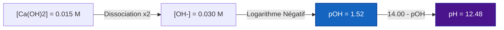

# Guide de Chimie Analytique & Laboratoire sur le pOH et l'Équilibre des Bases

En chimie analytique et pour l'équilibre des bases, le **pOH** mesure l'activité de l'ion hydroxyde dans les solutions aqueuses :

$$\text{pOH} = -\log_{10}[\text{OH}^-] \quad \iff \quad [\text{OH}^-] = 10^{-\text{pOH}}$$

$$\text{pH} + \text{pOH} = \text{p}K_w \quad \text{où } K_w = [\text{H}^+][\text{OH}^-]$$

---

## 1. Matrice de Référence de $K_w$ et pOH Neutre Dépendant de la Température

| Température (°C) | Auto-ionisation de l'Eau ($K_w$) | $\text{p}K_w$ | pOH Neutre ($\frac{1}{2}\text{p}K_w$) | Note de Contexte Physiologique |
| :--- | :--- | :--- | :--- | :--- |
| **$0^\circ\text{C}$** | $1.14 \times 10^{-15}$ | $14.94$ | **$7.47$** | Point de congélation de l'eau |
| **$25^\circ\text{C}$** | $1.00 \times 10^{-14}$ | $14.00$ | **$7.00$** | Référence standard de laboratoire |
| **$37^\circ\text{C}$** | $2.40 \times 10^{-14}$ | $13.62$ | **$6.81$** | Température corporelle humaine normale |
| **$60^\circ\text{C}$** | $9.60 \times 10^{-14}$ | $13.02$ | **$6.51$** | Eau de process chauffée |

---

## 2. Protocoles Standards de Calcul d'Équilibre de Base

```
1. Base Forte (monohydroxyde) : [OH-] = C_base  ===>  pOH = -log10[C_base]
2. Base Forte (dihydroxyde ex. Ca(OH)2) : [OH-] = 2 * C_base  ===>  pOH = -log10[2 * C_base]
3. Base Faible (B + H2O <==> BH+ + OH-) : Résoudre x^2 + Kb*x - Kb*C = 0  ===>  pOH = -log10(x)
4. Solution Tampon Basique : pOH = pKb + log10([Acide Conjugué BH+] / [Base Faible B])
```

---

## 3. Avertissement de Sécurité Éducatif et de Laboratoire
*Ce calculateur de pOH fournit des calculs d'équilibre de base théoriques pour des applications éducatives, de recherche en laboratoire et de chimie AP. Les solutions concentrées non idéales et les tampons analytiques précis doivent tenir compte de la force ionique et des coefficients d'activité à l'aide d'équipements de laboratoire étalonnés.*

## 4. Le Guide Complet sur le pOH et la Chimie des Bases

Bienvenue dans le guide définitif sur la compréhension, le calcul et la manipulation du pOH dans les solutions chimiques. Alors que le pH est souvent au centre de l'attention dans l'enseignement de la chimie au lycée, le pOH est son homologue tout aussi vital, régissant le comportement des bases, des solutions alcalines et l'équilibre fondamental de l'eau elle-même. Que vous soyez un étudiant en chimie AP maîtrisant l'ionisation des bases faibles, un chimiste industriel formulant des agents de nettoyage ou un biologiste étudiant le tamponnage cellulaire, la maîtrise du pOH est cruciale.

Fondamentalement, le pOH est une mesure de l'alcalinité ou de la basicité d'une solution aqueuse (à base d'eau). Il quantifie directement la concentration en ions hydroxyde ($\text{OH}^-$), dictant la façon dont les molécules basiques interagissent, neutralisent les acides et déclenchent les réactions de saponification.

Dans ce guide exhaustif, nous explorerons la mécanique profonde de la chimie des bases, décortiquerons les mathématiques logarithmiques qui régissent l'échelle de pOH, clarifierons la relation critique entre le pH, le pOH et la température, et parcourrons cinq exemples très détaillés et concrets avec des dérivations mathématiques et des diagrammes visuels.

### 4.1 Qu'est-ce que le pOH exactement ?

Le terme "pOH" représente le "potentiel de l'hydroxyde". C'est une échelle logarithmique utilisée pour spécifier la concentration en ions hydroxyde ($\text{OH}^-$) dans une solution aqueuse. Mathématiquement, le pOH est le logarithme négatif de base 10 de la concentration molaire des ions hydroxyde.

$$ \text{pOH} = -\log_{10}[\text{OH}^-] $$

Parce que l'échelle est logarithmique, un changement d'**une unité de pOH** représente un changement **décuplé** de la concentration en ions hydroxyde. Une solution avec un pOH de 3 a dix fois plus d'ions hydroxyde qu'une solution avec un pOH de 4.

Il est important de noter que l'échelle de pOH est le miroir inverse de l'échelle de pH. Un *faible* pOH signifie une *forte* concentration en ions hydroxyde, ce qui correspond à une solution fortement **basique (alcaline)**. Un *fort* pOH indique une faible concentration d'hydroxyde, ce qui signifie que la solution est acide.

### 4.2 Le Lien Inséparable : pOH, pH, et $K_w$

Dans l'eau pure, les molécules d'eau s'auto-ionisent naturellement, se séparant spontanément en ions hydrogène et hydroxyde :
$\text{H}_2\text{O} \rightleftharpoons \text{H}^+ + \text{OH}^-$

La constante d'équilibre de cette réaction vitale est la constante d'auto-ionisation de l'eau, $K_w$. À température ambiante standard (25°C), $K_w$ vaut exactement $1,0 \times 10^{-14}$.

Parce que $K_w = [\text{H}^+][\text{OH}^-]$, prendre le logarithme négatif des deux côtés nous donne l'équation la plus importante en chimie acido-basique. À 25°C :
$$ \text{pH} + \text{pOH} = 14,00 $$

Ce lien mathématique rigide signifie que vous ne pouvez pas modifier la concentration en hydroxyde sans affecter inversement la concentration en hydrogène. Si vous calculez le pOH, vous connaissez instantanément le pH.

### 4.3 Dépendance à la Température : Briser la Règle de 14,00

Un piège courant dans l'enseignement de la chimie est de supposer que $\text{pH} + \text{pOH}$ équivaut toujours à 14,00. **Cela n'est vrai qu'à 25°C exactement.**

Étant donné que l'auto-ionisation de l'eau est une réaction endothermique (elle absorbe la chaleur), l'augmentation de la température déplace l'équilibre vers la droite, générant *plus* d'ions $\text{H}^+$ et $\text{OH}^-$. Cela augmente $K_w$ et *diminue* proportionnellement $\text{p}K_w$.

*   À **0°C** (près du gel), $K_w$ chute à $1,14 \times 10^{-15}$. $\text{pH} + \text{pOH} = \textbf{14,94}$.
*   À **25°C** (laboratoire standard), $K_w$ est de $1,0 \times 10^{-14}$. $\text{pH} + \text{pOH} = \textbf{14,00}$.
*   À **37°C** (corps humain), $K_w$ monte à $2,4 \times 10^{-14}$. $\text{pH} + \text{pOH} = \textbf{13,62}$.

Notre Calculateur de pOH avancé comprend un Moteur de $K_w$ Dépendant de la Température dynamique qui corrige automatiquement ces constantes en fonction de la température spécifiée, garantissant une précision sans faille pour des conditions non standard.

---

## 5. Guide d'Utilisation : Maîtriser le Calculateur de pOH

Notre calculateur de pOH est construit autour d'un "Cockpit Interactif", vous donnant accès à des conversions logarithmiques simples ainsi qu'à des résolveurs quadratiques avancés de tableaux ICE pour l'équilibre des bases faibles.

### 5.1 Conversions Logarithmiques Directes

Si vous devez effectuer une conversion rapide entre $[\text{OH}^-]$, $[\text{H}^+]$, pOH et pH :
1.  **Sélectionnez le Mode :** Choisissez "pOH depuis [OH-]" ou la conversion appropriée.
2.  **Entrez la Valeur :** Saisissez votre valeur en utilisant la notation décimale standard (`0.005`) ou scientifique (`5e-3`).
3.  **Lisez le Résultat :** Le calculateur renseigne instantanément tous les paramètres et classe la solution (Basique, Neutre ou Acide) sur le spectre logarithmique.

### 5.2 Équilibre de Base Faible (Résolveur $K_b$)

Contrairement aux bases fortes (comme $\text{NaOH}$) qui se dissocient à 100%, les bases faibles (comme l'Ammoniac, $\text{NH}_3$) ne réagissent que partiellement avec l'eau pour former de l'hydroxyde. Vous devez résoudre un équilibre quadratique basé sur la Constante de Dissociation de la Base ($K_b$).
1.  **Sélectionnez le Mode :** Choisissez "Résolveur d'Équilibre de Base Faible".
2.  **Entrez les Paramètres :** Saisissez la Concentration Initiale de la base ($C$) et son $K_b$ (ou $\text{p}K_b$).
3.  **Exécutez :** Le calculateur résout en interne l'équation quadratique exacte $x^2 + K_b x - K_b C = 0$ pour trouver le vrai $[\text{OH}^-]$.

### 5.3 Tampons Basiques et Henderson-Hasselbalch

Les solutions tampons basiques (telles que Ammoniac/Ammonium) résistent aux changements de pH/pOH lorsque de petites quantités d'acide ou de base forts sont ajoutées.
1.  **Sélectionnez le Mode :** Choisissez "Résolveur de pOH de Tampon Basique".
2.  **Entrez les Paramètres :** Saisissez le $\text{p}K_b$ de la base faible, la concentration de l'Acide Conjugué (ex., $\text{NH}_4^+$) et la Base Faible (ex., $\text{NH}_3$).
3.  **Exécutez :** L'outil utilise la forme basique de l'équation de Henderson-Hasselbalch : $\text{pOH} = \text{p}K_b + \log([\text{Acide}]/[\text{Base}])$.

---

## 6. Cinq Exemples Conceptuels du Monde Réel

La compréhension des mathématiques abstraites du pOH nécessite une application pratique et concrète. Vous trouverez ci-dessous cinq exemples complets couvrant les bases fortes dihydroxydes, les équilibres de bases faibles, les tampons et les dilutions en série.

### Exemple 1 : La Base Forte Dihydroxyde (Hydroxyde de Calcium)

**Scénario :** 
L'hydroxyde de calcium, $\text{Ca(OH)}_2$, également connu sous le nom de chaux éteinte, est une base forte utilisée dans le traitement de l'eau. Si une installation de traitement de l'eau prépare une solution à $0,015\text{ M}$ de $\text{Ca(OH)}_2$ à 25°C, quels sont le pOH et le pH ?

**Dérivation Mathématique :**

1.  **Identifier la Dissociation Dihydroxyde :** $\text{Ca(OH)}_2$ produit **deux** ions hydroxyde par unité de formule.
    $$ [\text{OH}^-] = 2 \times [\text{Ca(OH)}_2] $$
    $$ [\text{OH}^-] = 2 \times 0,015\text{ M} = 0,030\text{ M} $$
2.  **Calculer le pOH :**
    $$ \text{pOH} = -\log_{10}(0,030) $$
    $$ \text{pOH} = 1,52 $$
3.  **Calculer le pH :**
    $$ \text{pH} = 14,00 - 1,52 = 12,48 $$

**Visualisation : Flux de Concentration Dihydroxyde**



*Notez que parce que l'hydroxyde de calcium fournit deux moles d'hydroxyde par mole de base, il produit une solution très alcaline (pH 12,48) malgré la molarité relativement faible.*

### Exemple 2 : La Base Faible (Ammoniac / Nettoyant pour vitres)

**Scénario :**
L'ammoniac ($\text{NH}_3$) est l'ingrédient actif de nombreux nettoyants pour vitres. C'est une base faible avec un $K_b$ de $1,8 \times 10^{-5}$. Si un nettoyant pour vitres commercial a une concentration de $0,25\text{ M}$ d'ammoniac, quel est son pOH ?

**Dérivation Mathématique :**

1.  **Préparer le Tableau ICE pour l'Hydrolyse de la Base :**
    $\text{NH}_3 + \text{H}_2\text{O} \rightleftharpoons \text{NH}_4^+ + \text{OH}^-$
    *   Initial : $[\text{NH}_3] = 0,25$, $[\text{NH}_4^+] = 0$, $[\text{OH}^-] = 0$
    *   Changement : $-x$, $+x$, $+x$
    *   Équilibre : $0,25 - x$, $x$, $x$
2.  **Préparer l'Équation Quadratique :**
    $$ K_b = \frac{x^2}{0,25 - x} = 1,8 \times 10^{-5} $$
    $$ x^2 + (1,8 \times 10^{-5})x - 4,5 \times 10^{-6} = 0 $$
3.  **Résoudre pour $x$ ($[\text{OH}^-]$) :**
    En utilisant la formule quadratique, $x \approx 0,00211\text{ M}$.
4.  **Calculer le pOH :**
    $$ \text{pOH} = -\log_{10}(0,00211) = 2,68 $$

**Visualisation : Précision Quadratique**

| Méthode | $[\text{OH}^-]$ (M) | pOH Calculé | % Erreur |
| :--- | :--- | :--- | :--- |
| **Formule Quadratique (Exacte)** | $0.002112$ | $2.675$ | $0.00\%$ |
| **Approximation ($0.25 - x \approx 0.25$)** | $0.002121$ | $2.673$ | $0.07\%$ |

*Notre calculateur emploie strictement le résolveur quadratique exact pour éviter les erreurs composées qui surviennent dans des solutions plus diluées lors de l'utilisation de la méthode d'approximation.*

### Exemple 3 : Le Tampon Basique (Ammoniac/Ammonium)

**Scénario :**
Un chimiste analytique a besoin d'un tampon alcalin pour étalonner un instrument. Il prépare une solution contenant $0,10\text{ M}$ d'Ammoniac ($\text{NH}_3$, base faible) et $0,05\text{ M}$ de Chlorure d'Ammonium ($\text{NH}_4\text{Cl}$, acide conjugué). Le $\text{p}K_b$ de l'Ammoniac est de 4,74. Trouvez le pOH.

**Dérivation Mathématique :**

1.  **Identifier la Formule :** Forme basique de l'Équation de Henderson-Hasselbalch.
    $$ \text{pOH} = \text{p}K_b + \log_{10}\left(\frac{[\text{Acide Conjugué}]}{[\text{Base Faible}]}\right) $$
2.  **Entrer les Valeurs :**
    $$ \text{pOH} = 4,74 + \log_{10}\left(\frac{0,05}{0,10}\right) $$
3.  **Calculer :**
    $$ \text{pOH} = 4,74 + \log_{10}(0,5) $$
    $$ \text{pOH} = 4,74 - 0,30 = 4,44 $$

*La solution a un pOH de 4,44, ce qui signifie qu'elle est un tampon basique (pH = 9,56).*

### Exemple 4 : Réaction de Neutralisation

**Scénario :**
Un étudiant renverse accidentellement $50\text{ mL}$ de $\text{NaOH}$ $0,20\text{ M}$ (base forte) sur une paillasse de laboratoire. Il tente de le neutraliser en versant $100\text{ mL}$ de $\text{HCl}$ $0,05\text{ M}$ (acide fort) dessus. La flaque d'eau résultante est-elle sans danger (neutre) ? Trouvez le pOH final.

**Dérivation Mathématique :**

1.  **Calculer les Moles Initiales :**
    Moles de $\text{OH}^- = (0,050\text{ L}) \times (0,20\text{ mol/L}) = 0,010\text{ moles}$
    Moles de $\text{H}^+ = (0,100\text{ L}) \times (0,05\text{ mol/L}) = 0,005\text{ moles}$
2.  **Effectuer la Neutralisation (Soustraction) :**
    $\text{OH}^-$ est en excès. 
    $\text{OH}^-$ restant $= 0,010 - 0,005 = 0,005\text{ moles}$.
3.  **Calculer la Nouvelle Concentration :**
    Volume Total $= 50\text{ mL} + 100\text{ mL} = 150\text{ mL} = 0,150\text{ L}$
    $$ [\text{OH}^-] = \frac{0,005\text{ moles}}{0,150\text{ L}} = 0,0333\text{ M} $$
4.  **Calculer le pOH Final :**
    $$ \text{pOH} = -\log_{10}(0,0333) = 1,48 $$

**Conclusion :** La flaque est très basique (pH = 12,52) et toujours dangereuse ! L'étudiant n'a pas utilisé assez d'acide pour neutraliser complètement le déversement.

### Exemple 5 : Dilution en Série d'une Base

**Scénario :**
Un technicien de laboratoire prélève $5\text{ mL}$ d'une base forte avec un pOH de 2,00 ($[\text{OH}^-] = 0,01\text{ M}$) et la dilue avec de l'eau pure jusqu'à un volume final de $500\text{ mL}$. Quel est le nouveau pOH ?

**Dérivation Mathématique :**

1.  **Trouver le $[\text{OH}^-]$ Initial :**
    $$ [\text{OH}^-]_{\text{initial}} = 10^{-2,00} = 0,01\text{ M} $$
2.  **Calculer la Dilution ($M_1V_1 = M_2V_2$) :**
    $$ (0,01\text{ M})(5\text{ mL}) = (M_2)(500\text{ mL}) $$
    $$ M_2 = 0,0001\text{ M} = 10^{-4}\text{ M} $$
3.  **Calculer le Nouveau pOH :**
    $$ \text{pOH} = -\log_{10}(10^{-4}) = 4,00 $$

**Visualisation : Chronologie du Laboratoire de Dilution en Série**

```mermaid
gantt
    title Chronologie du Laboratoire : Processus de Dilution Alcaline
    dateFormat  HH:mm:ss
    axisFormat  %H:%M
    section Préparation
    Mesure de 5mL (pOH 2.00) :active, 00:00:00, 00:03:00
    Transfert vers Fiole Jaugée :active, 00:03:00, 00:05:00
    section Dilution
    Ajout de 495mL d'Eau Désionisée :crit, 00:05:00, 00:10:00
    Homogénéisation / Mélange :active, 00:10:00, 00:15:00
    section Analyse
    Mesure du Nouveau pOH (4.00) :milestone, 00:15:00, 00:15:00
```



*La dilution d'une base augmente son pOH, le rapprochant du point neutre de 7,00.*

---

## 7. FAQ Approfondie et Dépannage Avancé

**Q : Le pOH peut-il être négatif ?**
**R :** Oui ! Tout comme le pH, l'échelle de pOH peut s'étendre en dessous de 0 pour les bases fortes extrêmement concentrées. Une solution à $10\text{ M}$ de $\text{NaOH}$ a un pOH de $-\log(10) = -1,0$ (et un pH de 15,0).

**Q : Pourquoi le calculateur inclut-il la Température pour les conversions de pOH ?**
**R :** Si vous convertissez le pOH en pH, le calculateur utilise la formule $\text{pH} = \text{p}K_w - \text{pOH}$. Parce que la constante d'auto-ionisation de l'eau ($K_w$) change de manière significative avec la température, la valeur exacte de $\text{p}K_w$ doit être utilisée pour assurer une précision analytique plutôt que d'utiliser 14,00 par défaut.

**Q : Quelle est la relation entre $K_a$ et $K_b$ ?**
**R :** Pour toute paire acide-base conjuguée, leurs constantes de dissociation sont liées par la constante d'auto-ionisation de l'eau : $K_a \times K_b = K_w$. En termes logarithmiques, $\text{p}K_a + \text{p}K_b = \text{p}K_w$ (qui est 14,00 à 25°C).

**Q : La dilution d'une base la rendra-t-elle éternellement acide ?**
**R :** Non. Au fur et à mesure que vous diluez infiniment une base avec de l'eau pure et neutre, le pOH approche de 7,00 asymptotiquement mais ne le franchira jamais dans le domaine acide. À des dilutions extrêmement élevées (ex., $10^{-9}\text{ M NaOH}$), l'auto-ionisation de l'eau elle-même contribue plus d'hydroxyde que la base ne le fait, nécessitant des calculs d'équilibre systématiques complexes.

**Q : Pourquoi utiliser le pOH au lieu du pH ?**
**R :** Pour les solutions basiques, calculer le pOH en premier est mathématiquement plus direct car la principale espèce présente en excès est l'ion hydroxyde ($\text{OH}^-$). Vous calculez le pOH directement à partir de la concentration en hydroxyde, puis vous soustrayez simplement de 14,00 (à 25°C) pour trouver le pH.

En maîtrisant l'interaction mathématique du pOH, des concentrations d'hydroxyde et des équilibres de $K_b$, vous acquérez une compréhension rigoureuse et quantitative de la chimie alcaline. Fiez-vous toujours à ce calculateur de pOH pour vérifier vos dérivations manuelles et sécuriser vos procédures de laboratoire !
