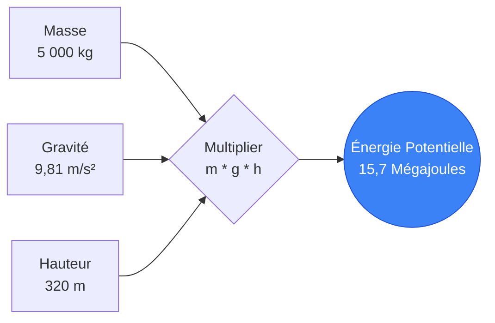
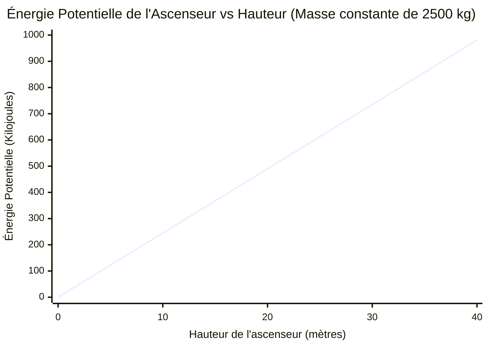
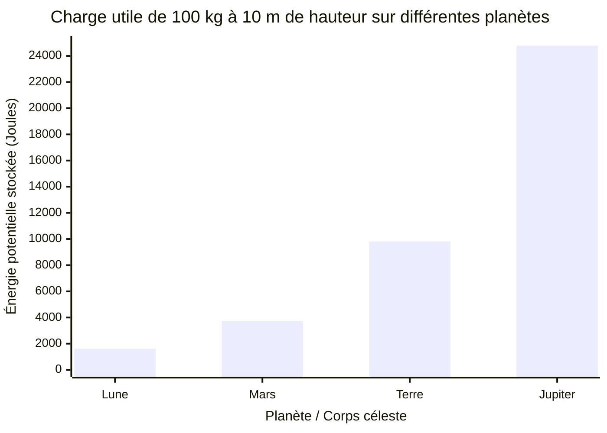
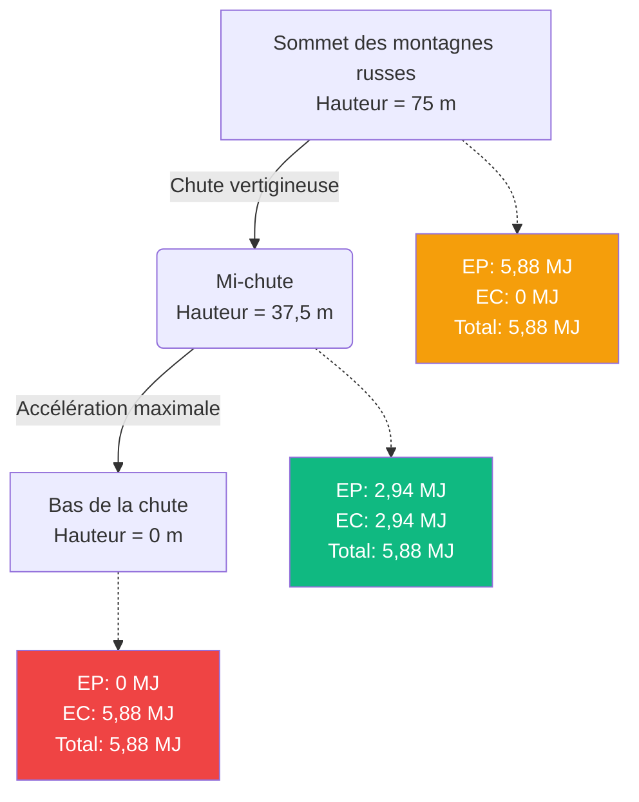

# Le Calculateur d'Énergie Potentielle Définitif : Maîtriser la Physique de l'Énergie Gravitationnelle Stockée

Bienvenue dans l'ultime **Calculateur d'Énergie Potentielle** et guide complet de physique. Que vous soyez un architecte concevant des gratte-ciels imposants, un ingénieur de montagnes russes calculant la hauteur de pointe terrifiante d'une nouvelle attraction, ou un étudiant en physique préparant un examen final rigoureux sur la loi de conservation de l'énergie mécanique, cet outil offre une précision et une clarté absolues.

L'énergie potentielle est l'énergie stockée invisible qui régit notre univers. C'est la raison pour laquelle un rocher en équilibre précaire menace une vallée en contrebas, la raison pour laquelle les barrages hydroélectriques peuvent alimenter des villes entières, et la raison pour laquelle la corde tendue d'un arc peut propulser une flèche à des vitesses létales.

Dans ce guide technique massif de plus de 4 000 mots, nous déconstruirons de manière exhaustive la mécanique de l'énergie potentielle gravitationnelle ($EP = m \cdot g \cdot h$). Nous explorerons les fondements mathématiques du champ gravitationnel, analyserons la conversion entre les états potentiel et cinétique lors de la chute libre, et vous guiderons à travers cinq exemples d'ingénierie du monde réel illustrés par des diagrammes Mermaid.js détaillés.

---

## 1. La Physique de l'Énergie Potentielle : La Puissance Stockée

En mécanique classique, **l'Énergie** est la capacité à fournir un travail. Alors que l'énergie cinétique est l'énergie du mouvement actif, **l'Énergie Potentielle** est l'énergie de position, d'état ou de configuration.

Elle est « potentielle » car l'énergie est stockée, attendant silencieusement d'être libérée et convertie en travail cinétique actif.

### La Formule Gravitationnelle Fondamentale ($EP = m \cdot g \cdot h$)
Lorsque nous avons affaire à des objets près de la surface de la Terre (ou de toute autre planète), nous traitons spécifiquement de **l'Énergie Potentielle Gravitationnelle**. La formule fondamentale est d'une simplicité élégante, ne reposant que sur trois variables :

$$ EP = m \cdot g \cdot h $$

Où :
- **$EP$** = Énergie Potentielle (mesurée en Joules, $J$)
- **$m$** = Masse de l'objet (mesurée en kilogrammes, $kg$)
- **$g$** = Accélération gravitationnelle de l'environnement local (mesurée en mètres par seconde au carré, $m/s^2$)
- **$h$** = Hauteur ou élévation au-dessus d'un point de référence choisi (mesurée en mètres, $m$)

### La Nature Linéaire de l'Énergie Potentielle
Contrairement à l'énergie cinétique, qui évolue de manière quadratique avec la vitesse ($v^2$), l'énergie potentielle gravitationnelle évolue de manière **parfaitement linéaire** avec ses trois variables.

- Si vous doublez la masse d'un rocher posé sur une falaise, vous doublez exactement son énergie potentielle.
- Si vous élevez une boîte lourde au double de sa hauteur d'origine sur une étagère, vous doublez exactement son énergie potentielle.
- Si vous transportez une lourde boîte de la Terre vers une planète avec deux fois plus de gravité (comme Jupiter), vous doublez son énergie potentielle.

### L'Importance du Niveau de Référence ($h=0$)
Un concept fondamental, souvent mal compris en physique, est que l'énergie potentielle est complètement relative. La valeur de $h$ nécessite un point de départ désigné, un **niveau de référence** (datum) où la hauteur est définie comme valant exactement zéro.

Par exemple, un livre posé sur une table peut être à $1\text{ mètre}$ au-dessus du sol, ce qui lui donne une énergie potentielle positive par rapport au sol. Cependant, si le sol est au 10ème étage d'un immeuble d'habitation, le livre est à $30\text{ mètres}$ au-dessus du niveau de la rue, lui donnant une énergie potentielle beaucoup plus importante par rapport à la rue.

Parce que l'énergie potentielle est relative, elle peut absolument être négative ! Si votre niveau de référence ($h=0$) est le niveau du sol et que vous descendez un lourd seau à $5\text{ mètres}$ de profondeur dans un puits, la hauteur est de $-5\text{ m}$, ce qui donne une énergie potentielle négative mathématiquement correcte.

---

## 2. Gravitation Universelle vs. Gravité Locale ($g$)

L'équation standard $EP = mgh$ est en fait une approximation simplifiée qui ne fonctionne que près de la surface d'une planète.

### Gravité Terrestre Standard ($g \approx 9,81\text{ m/s}^2$)
Sur Terre, l'attraction gravitationnelle est incroyablement constante au niveau de la mer. Les cours de physique utilisent généralement $9,8\text{ m/s}^2$ ou $9,81\text{ m/s}^2$. Cela signifie que si vous lâchez un objet dans le vide, sa vitesse augmente de $9,81\text{ m/s}$ chaque seconde où il tombe.

Cependant, la gravité fluctue légèrement en fonction de l'altitude et de la densité géologique. Au sommet du mont Everest, la gravité est en fait légèrement plus faible qu'au niveau de la mer.

### Énergie Potentielle Gravitationnelle Universelle
Si vous êtes un ingénieur aérospatial calculant la mécanique des satellites orbitaux ou les lancements de fusées vers Mars, l'équation $EP = mgh$ échoue car $g$ n'est plus constant. Au fur et à mesure que vous vous éloignez de la Terre, la gravité s'affaiblit rapidement selon la loi du carré inverse.

En astrophysique, nous utilisons la formule de l'énergie potentielle gravitationnelle universelle :

$$ EP = - \frac{G \cdot M \cdot m}{r} $$

Où $G$ est la constante gravitationnelle, $M$ est la masse de la planète, $m$ est la masse du satellite, et $r$ est la distance depuis le centre exact de la planète.

---

## 3. Conservation de l'Énergie Mécanique

L'énergie potentielle existe rarement dans le vide ; elle interagit constamment avec l'énergie cinétique ($EC = 0,5mv^2$).

La **loi de conservation de l'énergie mécanique** stipule que dans un système isolé (en ignorant le frottement, la résistance de l'air et la perte de chaleur thermique), la somme totale des énergies potentielle et cinétique reste parfaitement constante. L'énergie ne peut être ni créée ni détruite ; elle change simplement d'état.

$$ E_{totale} = EP_{initiale} + EC_{initiale} = EP_{finale} + EC_{finale} $$

### La Conversion en Chute Libre
Si vous laissez tomber une boule de bowling de $10\text{ kg}$ d'un bâtiment de $50\text{ mètres}$ de haut :
1. **Au moment du lâcher :** La vitesse est nulle, donc $EC = 0$. La hauteur est maximale, donc l' $EP$ est à son maximum absolu.
2. **En tombant vers le bas :** Au fur et à mesure que la boule tombe, elle perd de la hauteur (perdant de l' $EP$). Cependant, la gravité accélère la boule, ce qui signifie qu'elle gagne en vitesse (gagnant de l' $EC$). La somme totale d'énergie reste identiquement constante.
3. **L'instant avant l'impact :** La hauteur est exactement de zéro ($EP = 0$). Toute l'énergie potentielle stockée a été parfaitement convertie en énergie cinétique, ce qui donne une vitesse d'impact terminale maximale.

---

## 4. Guide d'Utilisation Complet : Maximiser le Calculateur

Notre calculateur d'énergie potentielle interactif est conçu pour gérer des problèmes de physique introductifs simples ainsi que des équations de science planétaire complexes inversées.

### Étape 1 : Calculs Mathématiques de Base
Dans l'interface principale, sélectionnez la variable que vous souhaitez isoler et résoudre :
- **Résoudre pour l'Énergie Potentielle (EP) :** Saisissez la masse, la hauteur et la gravité connues.
- **Résoudre pour la Masse (m) :** Saisissez l'énergie, la hauteur et la gravité connues pour déterminer la lourdeur d'un objet.
- **Résoudre pour la Hauteur (h) :** Saisissez l'énergie, la masse et la gravité connues pour déterminer l'élévation.
- **Résoudre pour la Gravité (g) :** Saisissez l'énergie, la masse et la hauteur connues pour déterminer la force gravitationnelle d'une planète inconnue !

### Étape 2 : Utiliser les Préréglages de Planètes
Le calculateur dispose d'un puissant moteur de préréglages de gravité. Au lieu de taper manuellement $9,81\text{ m/s}^2$, sélectionnez simplement **Terre**.

Vous voulez voir à quelle hauteur une grue pourrait soulever une poutre en acier sur Mars en utilisant la même quantité d'énergie ? Remplacez le préréglage de gravité par **Mars** ($3,71\text{ m/s}^2$). Le calculateur se met instantanément à jour, révélant que, puisque Mars a moins de 40 % de la gravité terrestre, exactement la même quantité d'énergie de travail peut soulever un objet lourd beaucoup, beaucoup plus haut.

### Étape 3 : Interpréter l'Arc d'Énergie Logarithmique
La **jauge d'arc d'énergie** radiale catégorise votre calcul de manière logarithmique :
- **Échelle Micro (Vert) :** Soulever des livres, monter des escaliers, laisser tomber des pommes.
- **Échelle Macro (Bleu) :** Grues à tour soulevant des poutres en acier, sommets de montagnes russes.
- **Échelle Méga (Rouge) :** Barrages hydroélectriques, gratte-ciels, avalanches.

---

## 5. Cinq Exemples d'Ingénierie Conceptuels avec des Visualisations 2D

Pour bien saisir l'ampleur de l'énergie potentielle, nous allons explorer cinq scénarios détaillés d'ingénierie et de physique, en utilisant Mermaid.js pour déconstruire visuellement les mathématiques.

### Exemple 1 : La Grue de Construction (Calcul Linéaire)

**Le Scénario :**
Une énorme grue à tour à Dubaï soulève une section de bâtiment préfabriquée en acier et en béton de $5 000\text{ kg}$. La grue hisse la charge du sol jusqu'au 80ème étage, qui est à exactement $320\text{ mètres}$ de hauteur. Nous devons calculer l'immense énergie potentielle gravitationnelle stockée dans la poutre suspendue, qui représente l'énergie catastrophique qui serait libérée si le câble de la grue se rompait.

**Les Mathématiques :**
Nous utilisons la formule linéaire de base :
$$ EP = m \cdot g \cdot h $$
$$ EP = 5 000\text{ kg} \cdot 9,81\text{ m/s}^2 \cdot 320\text{ mètres} $$
$$ EP = 15 696 000\text{ Joules (15,7 Mégajoules)} $$

**Visualisation 2D :**
L'arborescence logique ci-dessous illustre la nature linéaire simple du calcul $EP = mgh$.

---

### Exemple 2 : Énergie Potentielle vs. Hauteur (Mise à l'échelle Linéaire)

**Le Scénario :**
Un concepteur d'ascenseurs calcule les charges d'énergie du contrepoids. Une cabine d'ascenseur standard de $2 500\text{ kg}$ est hissée dans un bâtiment. Étant donné que l'énergie potentielle évolue de manière linéaire avec la hauteur, nous voulons visualiser l'accumulation constante d'énergie lorsque la cabine passe les marques des 10 mètres, 20 mètres, 30 mètres et 40 mètres.

**Les Mathématiques :**
- À $10\text{ m}$ : $EP = 2 500 \cdot 9,81 \cdot 10 = 245 250\text{ J (245 kJ)}$
- À $20\text{ m}$ : $EP = 2 500 \cdot 9,81 \cdot 20 = 490 500\text{ J (490 kJ)}$
- À $30\text{ m}$ : $EP = 2 500 \cdot 9,81 \cdot 30 = 735 750\text{ J (735 kJ)}$
- À $40\text{ m}$ : $EP = 2 500 \cdot 9,81 \cdot 40 = 981 000\text{ J (981 kJ)}$

**Visualisation 2D :**
Contrairement à la terrifiante courbe quadratique exponentielle de l'énergie cinétique, l'énergie potentielle forme une ligne droite parfaite et prévisible. Doubler la hauteur double exactement l'énergie stockée.

---

### Exemple 3 : Comparaison de la Gravité Interplanétaire (Mars vs Jupiter)

**Le Scénario :**
Des astronautes de la NASA ont atterri sur Mars, tandis qu'une sonde robotique lourdement blindée descend dans l'atmosphère de Jupiter. Les deux transportent une charge utile scientifique de $100\text{ kg}$ soulevée à précisément $10\text{ mètres}$ du sol. Comment l'énergie potentielle stockée diffère-t-elle considérablement à travers le système solaire ?

**Les Mathématiques :**
- **Terre ($9,81\text{ m/s}^2$) :** $EP = 100 \cdot 9,81 \cdot 10 = 9 810\text{ J}$
- **La Lune ($1,62\text{ m/s}^2$) :** $EP = 100 \cdot 1,62 \cdot 10 = 1 620\text{ J}$
- **Mars ($3,71\text{ m/s}^2$) :** $EP = 100 \cdot 3,71 \cdot 10 = 3 710\text{ J}$
- **Jupiter ($24,79\text{ m/s}^2$) :** $EP = 100 \cdot 24,79 \cdot 10 = 24 790\text{ J}$

**Visualisation 2D :**
Le graphique à barres montre de manière spectaculaire que faire tomber un rocher de $100\text{ kg}$ sur Jupiter libère près de 15 fois plus d'énergie d'impact écrasante que de faire tomber exactement ce même rocher sur la Lune depuis la même hauteur exacte.

---

### Exemple 4 : La Physique des Montagnes Russes (Conservation de l'Énergie)

**Le Scénario :**
Un train de montagnes russes chargé de $8 000\text{ kg}$ franchit lentement le sommet d'une terrifiante chute de $75\text{ mètres}$. Au sommet, sa vitesse est pratiquement nulle. Nous devons calculer la vitesse théorique maximale possible du train lorsqu'il atteindra le tout bas de la première chute, en supposant une piste sans frottement.

**Les Mathématiques :**
Au sommet, toute l'énergie mécanique est de l'énergie potentielle.
$$ EP_{sommet} = m \cdot g \cdot h = 8 000 \cdot 9,81 \cdot 75 = 5 886 000\text{ Joules (5,88 MJ)} $$

Selon la loi de conservation de l'énergie mécanique, au bas de la chute ($h=0$), la totalité des $5,88\text{ MJ}$ d'énergie potentielle a été convertie en énergie cinétique ($EC = 0,5 \cdot m \cdot v^2$).
$$ EC_{bas} = 5 886 000\text{ J} $$

Nous pouvons faire l'ingénierie inverse pour trouver la vitesse du train mathématiquement :
$$ v = \sqrt{\frac{2 \cdot EC}{m}} $$
$$ v = \sqrt{\frac{2 \cdot 5 886 000}{8 000}} = \sqrt{\frac{11 772 000}{8 000}} = \sqrt{1471,5} = 38,36\text{ m/s} $$

Le train de montagnes russes frappe le bas de la piste en se déplaçant à un exaltant $38,36\text{ m/s}$ ($138\text{ km/h}$).

**Visualisation 2D :**
Ce diagramme de flux démontre comment l'énergie mécanique reste parfaitement conservée tout en s'échangeant en douceur entre les états potentiel (hauteur) et cinétique (vitesse).

---

### Exemple 5 : Production d'Énergie d'un Barrage Hydroélectrique (Chronologie de Processus Gantt)

**Le Scénario :**
Les barrages hydroélectriques sont fondamentalement d'énormes « batteries d'énergie potentielle » en béton. L'eau est stockée dans un réservoir à haute altitude. Lorsque de l'énergie est nécessaire, les vannes s'ouvrent, et la gravité tire l'eau vers le bas à travers d'énormes tuyaux appelés conduites forcées.
Analysons le processus de transformation de l'énergie pour un volume d'eau massif de $1 000 000\text{ kg}$ tombant de $150\text{ mètres}$ à travers un barrage.

**Les Mathématiques :**
L'énergie potentielle gravitationnelle stockée de ce volume d'eau spécifique est :
$$ EP = 1 000 000 \cdot 9,81 \cdot 150 = 1 471 500 000\text{ Joules (1,47 Gigajoules)} $$

Au fur et à mesure que l'eau plonge le long de la conduite forcée, ce $1,47\text{ GJ}$ devient de l'énergie cinétique. Elle frappe les pales en acier d'une énorme turbine. La turbine fait tourner un générateur magnétique. En supposant un taux de rendement mécanique à électrique de $80\%$, le générateur produit :
$$ 1,47\text{ GJ} \times 0,80 = 1,17\text{ Gigajoules d'énergie électrique pure !} $$

**Visualisation 2D :**
Ce diagramme de Gantt cartographie la chronologie du processus de conversion physique étape par étape, montrant comment l'eau stockée immobile devient une tension électrique envoyée au réseau de la ville.

```mermaid
gantt
    title Processus de conversion de l'énergie potentielle hydroélectrique
    dateFormat  HH:mm:ss
    axisFormat  %M:%S
    section Stockage
    L'eau repose dans un réservoir élevé (EP max) :done, 00:00:00, 00:00:10
    section Chute libre
    Les vannes s'ouvrent, l'eau tombe :crit, active, 00:00:10, 00:00:20
    L'EP se convertit rapidement en EC :crit, active, 00:00:10, 00:00:20
    section Production
    L'eau cinétique frappe les turbines :milestone, 00:00:20, 0d
    La turbine fait tourner le générateur :active, 00:00:20, 00:00:30
    Électricité exportée vers le réseau :active, 00:00:22, 00:00:35
```

---

## 6. Foire Aux Questions (FAQ) Approfondie

**Q : L'énergie potentielle peut-elle être négative ?**
**R :** Oui, absolument ! L'énergie potentielle est strictement relative à l'endroit où vous définissez votre niveau de référence de hauteur ($h=0$). Si vous choisissez le niveau du sol comme $h=0$, et que vous creusez une tranchée de $10\text{ mètres}$ de profondeur pour y laisser tomber un rocher, la hauteur du rocher est de $-10\text{m}$. Par conséquent, son énergie potentielle est négative. Cela nécessite un travail positif (le soulever) juste pour ramener son énergie potentielle à zéro.

**Q : Quelle est la différence entre l'énergie cinétique et l'énergie potentielle ?**
**R :** L'énergie potentielle ($EP = mgh$) est l'énergie stockée basée sur la hauteur, la position ou l'état interne. Elle est passive et sans mouvement. L'énergie cinétique ($EC = 0,5mv^2$) est l'énergie active du mouvement. Dans les systèmes physiques, l'énergie rebondit constamment entre ces deux états.

**Q : Le chemin parcouru a-t-il de l'importance lors du calcul de l'énergie potentielle ?**
**R :** Non. La gravité est ce que les physiciens appellent une **force conservative**. Cela signifie que le changement d'énergie potentielle ne dépend *que* de la hauteur verticale initiale et de la hauteur verticale finale. Que vous transportiez une boîte lourde directement sur une échelle jusqu'à un toit de $10\text{ mètres}$, ou que vous la poussiez sur une longue rampe sinueuse de $50\text{ mètres}$ en zigzag jusqu'au même toit, l'énergie potentielle finale acquise par la boîte est mathématiquement identique.

**Q : Qu'est-ce que l'énergie potentielle élastique ?**
**R :** Bien que ce guide se concentre fortement sur l'EP gravitationnelle, l'énergie potentielle élastique est l'énergie stockée par la déformation physique d'un objet, comme l'étirement d'un élastique, la compression d'un ressort métallique ou le fait de bander un arc de chasse. La formule est $EP_{élastique} = 0,5 \cdot k \cdot x^2$, où $k$ est la rigidité du ressort et $x$ est la distance d'étirement.

**Q : Comment un pendule dépend-il de l'énergie potentielle ?**
**R :** Le pendule d'une horloge de parquet est un oscillateur mécanique parfait. Tout en haut de son balancement à gauche, il s'arrête un instant (Cinétique Zéro) et se trouve à son point le plus haut (Potentiel Max). Il tombe, échangeant le potentiel contre la cinétique, atteignant sa vitesse maximale en bas. Il remonte ensuite vers la droite, échangeant la cinétique contre le potentiel jusqu'à ce qu'il s'arrête à nouveau.

---

## 7. Conclusion et Défi d'Ingénierie

Les mathématiques de l'énergie potentielle dictent tout, des conceptions de fondations de gratte-ciels à la mécanique orbitale des lunes. En maîtrisant $EP = mgh$, vous gagnez la capacité de quantifier avec précision l'immense puissance stockée, invisible, qui réside dans le monde physique qui nous entoure.

Pour vraiment maîtriser ces concepts, utilisez notre Calculateur d'Énergie Potentielle pour résoudre les défis de physique conceptuelle suivants :
1. **L'Avalanche :** Une étagère massive de neige compactée pesant $50 000 000\text{ kg}$ repose précairement sur un pic de montagne à $2 500\text{ mètres}$ au-dessus d'une station de ski. Calculez l'énergie potentielle terrifiante en Gigajoules stockée au-dessus de la vallée.
2. **L'Ascension de Jupiter :** Une grue industrielle sur Terre peut soulever une caisse de fret de $10 000\text{ kg}$ à une hauteur de $50\text{ mètres}$ en utilisant une quantité spécifique d'énergie. Si vous transportiez exactement cette grue sur Jupiter ($g = 24,79\text{ m/s}^2$), quelle est la hauteur maximale à laquelle elle pourrait soulever exactement cette même caisse en utilisant exactement la même quantité d'énergie ?
3. **Le Base Jumper :** Un base jumper de $85\text{ kg}$ saute d'une antenne de $400\text{ mètres}$ de haut. En utilisant la loi de conservation de l'énergie (et en ignorant la résistance de l'air), calculez la vitesse terminale maximale absolue qu'il atteindrait juste avant de heurter le sol si son parachute ne se déployait pas.

Expérimentez avec le simulateur, analysez les graphiques de hauteur linéaires et fiez-vous à ce calculateur pour éclairer les forces massives qui régissent l'univers physique.
