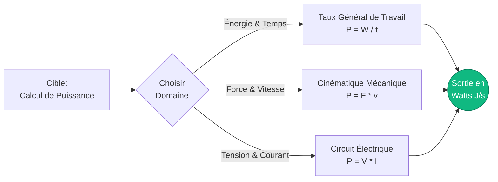
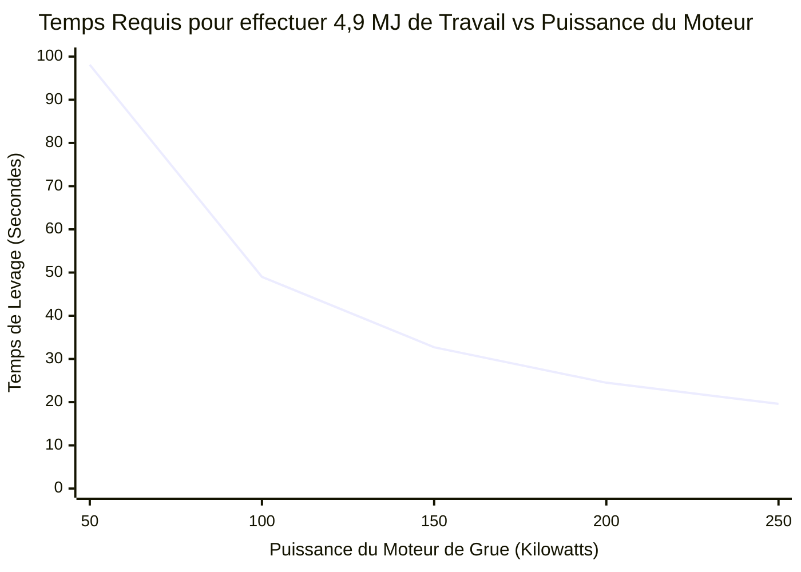
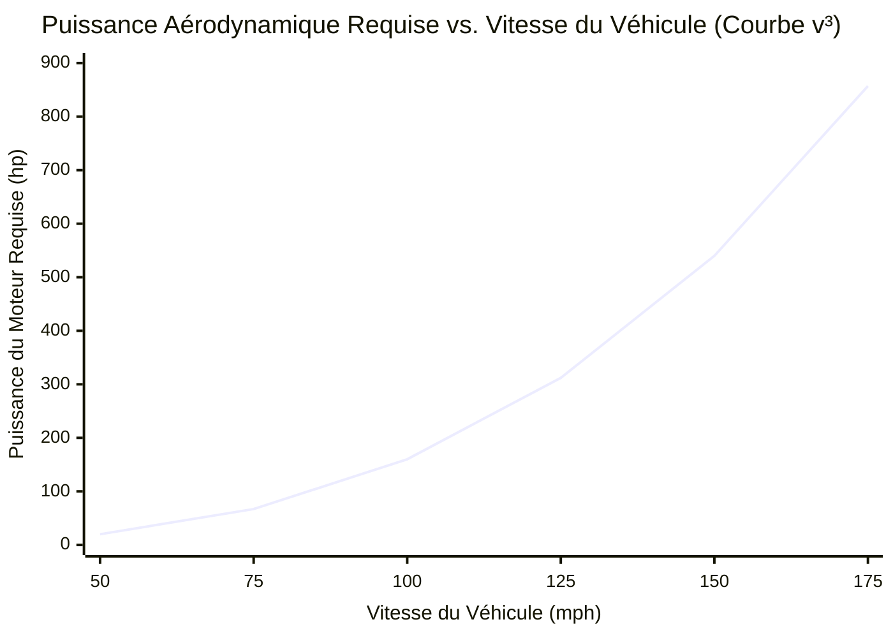
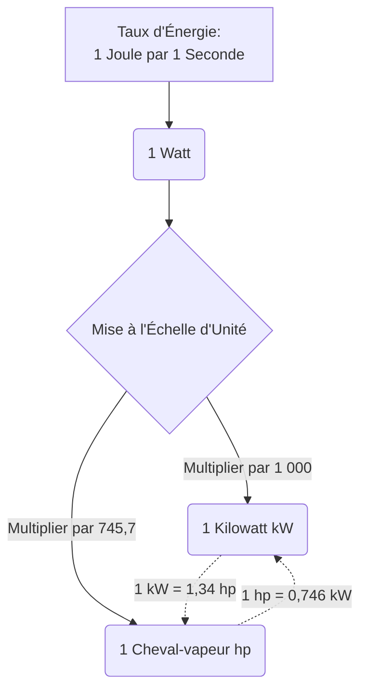

# Le Calculateur de Puissance Complet : Maîtriser le Transfert d'Énergie, les Watts Mécaniques et les Chevaux-vapeur Électriques

Bienvenue dans l'ultime **Calculateur de Puissance** et le guide d'ingénierie définitif. Que vous soyez un ingénieur automobile essayant de calculer la puissance au frein d'un bloc moteur nouvellement conçu, un ingénieur électricien dimensionnant un réseau électrique commercial, ou un physiologiste du sport analysant la puissance de sprint de pointe d'un cycliste professionnel, cet outil vous fournira les conversions physiques exactes dont vous avez besoin.

Dans les conversations de tous les jours, les mots "Énergie", "Travail" et "Puissance" sont souvent utilisés de manière interchangeable. Mais en physique, ils représentent trois concepts très différents, rigidement définis. Si le Travail ($W$) est la quantité brute d'énergie transférée, alors la Puissance ($P$) est la *vitesse* à laquelle cette énergie est délivrée.

Dans ce guide SEO exhaustif de plus de 4 000 mots, nous allons déconstruire de manière agressive les formules fondamentales de la Puissance ($P = W/t$ et $P = F \cdot v$). Nous dévoilerons l'histoire du Watt et du Cheval-vapeur, explorerons les courbes de puissance cubiques dévastatrices de la traînée aérodynamique, et analyserons cinq scénarios réels de haute puissance avec des visualisations personnalisées Mermaid.js.

---

## 1. Définir la Puissance : La Vitesse du Travail

En physique classique, la **Puissance** est définie comme la dérivée temporelle du Travail. Elle mesure exactement à quelle vitesse l'énergie est transférée, consommée ou générée.

$$ P = \frac{W}{t} = \frac{\Delta E}{\Delta t} $$

### L'Analogie de l'Escalier
Pour comprendre intuitivement la différence entre le Travail et la Puissance, imaginez un homme de $100\text{ kg}$ se tenant en bas d'un escalier de $10\text{ mètres}$ de haut.
- S'il monte lentement les escaliers au cours de $60\text{ secondes}$, il doit combattre la gravité pour soulever sa masse. Il effectue exactement $9\,810\text{ Joules}$ de travail mécanique ($W = mgh$).
- S'il sprinte violemment dans le même escalier en seulement $5\text{ secondes}$, il soulève exactement la même masse à la même hauteur. Il a effectué *exactement les mêmes* $9\,810\text{ Joules}$ de travail.

Cependant, la **Puissance** générée était radicalement différente :
- **Puissance de Marche :** $P = 9\,810\text{ J} / 60\text{ s} = \mathbf{163,5\text{ Watts}}$
- **Puissance de Sprint :** $P = 9\,810\text{ J} / 5\text{ s} = \mathbf{1\,962,0\text{ Watts}}$

Le sprinter était douze fois plus puissant, épuisant complètement son système cardiovasculaire anaérobie au passage.

### Le Watt : L'Unité SI de la Puissance
La puissance est mesurée en **Watts** ($\text{W}$), nommée en l'honneur de James Watt, l'ingénieur écossais qui a radicalement amélioré la machine à vapeur.
$$ 1\text{ Watt} = 1\text{ Joule par seconde} $$
Si une ampoule est conçue pour $60\text{W}$, elle consomme physiquement $60\text{ Joules}$ d'énergie électrique chaque seconde où elle reste allumée.

---

## 2. Les Trois Domaines des Équations de Puissance

Étant donné que la Puissance est simplement le taux de transfert d'énergie, elle peut être calculée en utilisant différentes formules selon que vous travaillez en mécanique générale, en cinématique ou en génie électrique.

### 1. Taux Général de Travail ($P = W / t$)
La formule la plus universelle. Divisez le Travail total effectué (ou l'Énergie totale consommée) par le temps total écoulé.

### 2. Puissance Cinématique Mécanique ($P = F \cdot v$)
Si un objet se déplace à une vitesse constante ($v$) tout en étant poussé par une force constante ($F$), vous pouvez calculer instantanément la puissance requise sans avoir besoin de connaître le temps total ou la distance totale.
Puisque $W = F \cdot d$, et $v = d / t$, en remplaçant ces éléments, on obtient :
$$ P = F \cdot v $$
*(C'est la formule exacte utilisée pour calculer la puissance d'un moteur de voiture poussant contre la résistance du vent).*

### 3. Puissance Électrique ($P = V \cdot I$)
Dans un circuit à courant continu (CC), la puissance électrique est le produit de la Tension (pression électrique) et du Courant (flux d'électrons).
$$ P = V \cdot I $$
En utilisant la Loi d'Ohm ($V = I \cdot R$), cela peut aussi être réécrit comme $P = I^2 \cdot R$ ou $P = V^2 / R$, ce qui est vital pour calculer la dissipation de chaleur dans une résistance.

---

## 3. L'Histoire et la Conversion du Cheval-vapeur (hp)

Lorsque James Watt a inventé sa machine à vapeur hautement efficace à la fin des années 1700, il a été confronté à un énorme problème de marketing. Ses clients potentiels étaient des mineurs de charbon et des exploitants de moulins qui utilisaient alors des chevaux de trait pour alimenter leurs pompes. Ils ne comprenaient pas la "pression de la vapeur" ; ils voulaient savoir combien de chevaux ils pourraient renvoyer s'ils achetaient sa machine.

Watt a étudié le travail moyen fourni par un cheval de trait faisant tourner une roue de moulin et a standardisé l'unité du **Cheval-vapeur (hp)**.
Il a défini $1\text{ hp}$ comme la puissance requise pour soulever $33\,000\text{ livres}$ d'un poids d'$1\text{ pied}$ en exactement $1\text{ minute}$.

### Conversions Métriques Modernes
- **Cheval-vapeur Mécanique (hp Impérial) :** $1\text{ hp} = 745,7\text{ Watts}$
- **Cheval-vapeur Métrique (PS / Pferdestärke) :** $1\text{ PS} = 735,5\text{ Watts}$

Un moteur de voiture moderne de $200\text{ hp}$ est techniquement capable d'effectuer le travail mécanique continu de 200 énormes chevaux de trait du 18ème siècle simultanément.

---

## 4. Guide d'Utilisation Complet : Maximiser le Calculateur

Notre Calculateur de Puissance interactif agit comme un pont universel à travers tous les domaines de l'ingénierie.

### Étape 1 : Sélectionnez Votre Cible de Calcul
Utilisez la navigation supérieure pour sélectionner vos variables connues :
- **Taux de Travail ($P = W/t$) :** Idéal pour les problèmes de consommation générale d'énergie.
- **Mécanique ($P = F \cdot v$) :** Idéal pour l'automobile, l'aérospatiale et les problèmes cinématiques de véhicules.
- **Électrique ($P = V \cdot I$) :** Idéal pour la conception de circuits imprimés et l'audit énergétique des appareils ménagers.

### Étape 2 : Utilisez le Tableau de Conversion des Chevaux-vapeur
Arrêtez de vous fier au calcul mental. Entrez votre puissance en watts et voyez instantanément la conversion exacte en Kilowatts, Mégawatts, Chevaux-vapeur Mécaniques Impériaux, PS Métriques et BTU/h (vital pour les techniciens CVC).

### Étape 3 : Interprétez la Jauge de Puissance Logarithmique
Notre échelle de puissance radiale contextualise instantanément votre résultat par rapport aux références du monde réel :
- **Micro-Puissance :** $0\text{W}$ à $1\,000\text{W}$ (Humains, ampoules, mixeurs).
- **Macro-Puissance :** $1\text{kW}$ à $1\,000\text{kW}$ (Voitures, camions, petits avions).
- **Méga-Puissance :** $1\text{MW}$ à $1\text{GW}$+ (Locomotives, centrales nucléaires, fusées Saturn V).

---

## 5. Cinq Scénarios Conceptuels d'Ingénierie avec Visualisations 2D

Pour bien saisir la dynamique de la génération de Puissance, nous allons explorer cinq scénarios de physique détaillés, en utilisant Mermaid.js pour déconstruire visuellement les mathématiques et les courbes de puissance.

### Exemple 1 : Les Trois Domaines de la Puissance (Flux Logique des Équations)

**Le Scénario :**
Un étudiant en ingénierie doit rapidement acheminer ses variables connues à travers la bonne formule de puissance en fonction de sa question d'examen (Thermodynamique, Cinématique ou Électrique).

**Visualisation 2D :**
Cet organigramme décompose visuellement les trois piliers massifs du calcul de puissance.

---

### Exemple 2 : Puissance de Levage de Grue vs Temps

**Le Scénario :**
Une grue de construction massive sur un chantier de gratte-ciel doit soulever une poutre en I en acier de $5\,000\text{ kg}$ à une hauteur de $100\text{ mètres}$. Le moteur électrique du treuil de la grue est conçu pour exactement $100\text{ Kilowatts}$ ($100\,000\text{ W}$) de puissance continue. À quelle vitesse la grue peut-elle soulever la poutre ?

**Les Mathématiques :**
D'abord, calculez le travail total requis pour combattre la gravité :
$$ W = m \cdot g \cdot h = 5\,000 \cdot 9,81 \cdot 100 = 4\,905\,000\text{ Joules} $$

Ensuite, utilisez la formule de la Puissance pour résoudre le temps :
$$ P = W / t $$
$$ 100\,000 = 4\,905\,000 / t $$
$$ t = 49,05\text{ secondes} $$

**Visualisation 2D :**
S'ils améliorent la grue avec un moteur de $200\text{ kW}$, cela prendra la moitié du temps. S'ils la rétrogradent à un moteur de $50\text{ kW}$, cela prendra deux fois plus de temps. Ce graphique montre la relation inverse entre la puissance disponible et le temps requis pour une quantité de travail fixe.

---

### Exemple 3 : La Pénalité Aérodynamique V-Cube (Puissance vs Vitesse)

**Le Scénario :**
Pourquoi est-il si incroyablement difficile pour une voiture d'aller à $200\text{ mph}$, même si elle peut facilement aller à $100\text{ mph}$ ? Tout se résume à la physique terrifiante de la traînée aérodynamique. La force de traînée augmente avec le carré de la vitesse ($F \propto v^2$). Comme la puissance mécanique est la Force multipliée par la Vitesse ($P = F \cdot v$), la puissance requise pour pousser une voiture dans l'air s'échelonne avec le **cube de la vitesse** ($P \propto v^3$) !

**Les Mathématiques :**
Si une berline standard nécessite $20\text{ hp}$ pour rouler sur l'autoroute à $50\text{ mph}$...
Pour doubler la vitesse à $100\text{ mph}$, il faut $2^3$ ($8\times$) plus de puissance ! Il faudra $160\text{ hp}$.
Pour tripler la vitesse à $150\text{ mph}$, il faut $3^3$ ($27\times$) plus de puissance ! Il faudra $540\text{ hp}$.

**Visualisation 2D :**
Ce graphique visualise la courbe dévastatrice de $v^3$. C'est pourquoi une Bugatti Veyron de $1\,000\text{ hp}$ ne va que légèrement plus vite qu'une Corvette de $500\text{ hp}$.

---

### Exemple 4 : La Physique de la Conversion des Chevaux-vapeur

**Le Scénario :**
Un mécanicien américain et un ingénieur électricien européen débattent des caractéristiques d'un nouveau moteur de véhicule électrique. Le mécanicien parle en chevaux-vapeur mécaniques au frein ($hp$), et l'ingénieur électricien parle en Kilowatts ($kW$). Déconstruisons visuellement comment ces deux unités sont mathématiquement liées à l'origine du Joule par seconde.

**Visualisation 2D :**
Cet organigramme illustre comment les deux unités proviennent de la même origine physique exacte.

---

### Exemple 5 : Puissance de Sortie d'un Cycliste Pro (Sprint vs Endurance Gantt)

**Le Scénario :**
Analysons la puissance de sortie biologique d'un cycliste professionnel du Tour de France. La physiologie humaine a deux systèmes énergétiques différents : Anaérobie (puissance massive et à court terme sans oxygène) et Aérobie (puissance soutenue et à long terme utilisant l'oxygène).

Un cycliste pro peut générer une stupéfiante puissance de $1\,500\text{ Watts}$ ($2\text{ hp}$) lors d'un sprint final vers la ligne d'arrivée. Cependant, il ne peut soutenir cela que pendant environ $15\text{ secondes}$ avant que ses muscles ne soient inondés d'acide lactique. Pour une ascension de montagne de plusieurs heures, ils doivent redescendre à leur seuil aérobie d'environ $400\text{ Watts}$.

**Visualisation 2D :**
Ce diagramme de Gantt visualise une chronologie de fin de course, contrastant la longue phase d'endurance par rapport au sprint anaérobie violemment puissant, mais incroyablement bref.

```mermaid
gantt
    title Chronologie de Puissance de Sortie du Dernier Kilomètre d'un Cycliste Pro
    dateFormat  HH:mm:ss
    axisFormat  %M:%S
    section Aérobie (Soutenu)
    Croisière du Peloton (300 Watts) :active, 00:00:00, 00:00:45
    Poussée du Train de Tête (600 Watts) :crit, done, 00:00:45, 00:01:00
    section Anaérobie (Sprint)
    Sprint Final Ligne d'Arrivée (1 500 Watts!) :milestone, 00:01:00, 00:01:15
    Épuisement Post-Course (50 Watts) :active, 00:01:15, 00:01:40
```

---

## 6. Plongée Profonde dans les Questions Fréquemment Posées (FAQ)

**Q : Qu'est-ce qu'un Kilowatt-heure (kWh) sur ma facture d'électricité ?**
**R :** C'est très confus pour les étudiants. Un Kilowatt ($\text{kW}$) est une unité de *Puissance*. Mais un Kilowatt-heure ($\text{kWh}$) est une unité d'*Énergie* ! Il est égal à exactement $1\,000\text{ Watts}$ de puissance fonctionnant en continu pendant $1\text{ heure}$ ($3\,600\text{ secondes}$).
$1\,000\text{ W} \times 3\,600\text{ s} = 3\,600\,000\text{ Joules}$. Votre compagnie d'électricité vous facture pour l'énergie totale (Joules), pas pour la puissance (Watts) !

**Q : Le couple est-il la même chose que les chevaux-vapeur ?**
**R :** Non. Le couple est une force de rotation (une torsion). Les chevaux-vapeur indiquent à quelle *vitesse* vous pouvez appliquer cette torsion.
La formule automobile est : $\text{Chevaux-vapeur} = (\text{Couple} \times \text{RPM}) / 5252$.
Un tracteur a un couple massif mais un faible régime (RPM), il a donc une faible puissance en chevaux. Une Formule 1 a un faible couple mais hurle à $15\,000\text{ RPM}$, générant une puissance massive !

**Q : Qu'est-ce que la puissance RMS par rapport à la puissance Crête dans les haut-parleurs audio ?**
**R :** La puissance crête est un gadget marketing représentant une rafale d'énergie d'une microseconde qu'un haut-parleur peut supporter avant d'exploser. La RMS (Root Mean Square) est la puissance de sortie véritable, continue et soutenue qu'un amplificateur peut fournir en toute sécurité. Achetez toujours du matériel en fonction de la Puissance RMS.

**Q : Pourquoi les voitures électriques (VE) semblent-elles si incroyablement puissantes ?**
**R :** Les moteurs à combustion interne doivent attendre que les tours montent pour atteindre leur puissance de pointe. Un moteur électrique peut délivrer $100\%$ de sa puissance de sortie maximale presque instantanément à partir de $0\text{ RPM}$, fournissant une accélération violente et instantanée.

**Q : Qu'est-ce qui génère le plus de puissance sur Terre ?**
**R :** Artificiel : La fusée Saturn V a généré environ $60\text{ Gigawatts}$ ($60\,000\text{ MW}$) de puissance pendant le décollage.
Naturel : Un ouragan massif peut libérer une énergie thermique équivalente à $200\text{ fois}$ la capacité totale de production électrique mondiale !

---

## 7. Conclusion et Défi d'Ingénierie

La puissance est la limite de vitesse de l'ingénierie humaine. Peu importe la quantité d'énergie que vous avez stockée dans un réservoir de carburant ou une batterie, la puissance nominale de votre moteur ou de votre circuit dicte la vitesse à laquelle vous pouvez réellement l'utiliser.

Pour maîtriser véritablement ces concepts, utilisez notre Calculateur de Puissance pour résoudre les défis conceptuels de physique suivants :
1. **L'Haltérophile :** Un haltérophile olympique arrache une barre de $150\text{ kg}$ du sol à une hauteur de $2\text{ mètres}$ en exactement $0,8\text{ secondes}$. Quelle a été sa puissance mécanique maximale (en chevaux) pendant ce levage de moins d'une seconde ?
2. **Le Chauffage d'Appoint :** Vous branchez un chauffage d'appoint dans une prise murale standard de $120\text{ Volts}$. Il tire $12,5\text{ Ampères}$ de courant. Combien de Kilowatts de puissance de chauffage thermique génère-il ?
3. **La Traînée de la Fusée :** Une fusée vole directement vers le haut à travers l'atmosphère à $500\text{ m/s}$. La résistance de l'air génère $100\,000\text{ Newtons}$ de force de traînée vers le bas. Combien de Mégawatts de puissance moteur sont entièrement gaspillés juste pour lutter contre le vent ?

Expérimentez avec le simulateur, analysez les terrifiantes courbes de puissance aérodynamique $v^3$, et fiez-vous à ce calculateur pour illuminer le flux massif d'énergie qui dicte l'univers.
