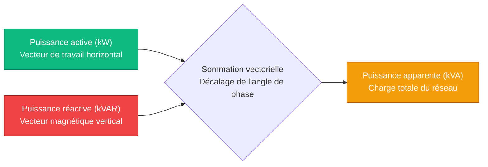
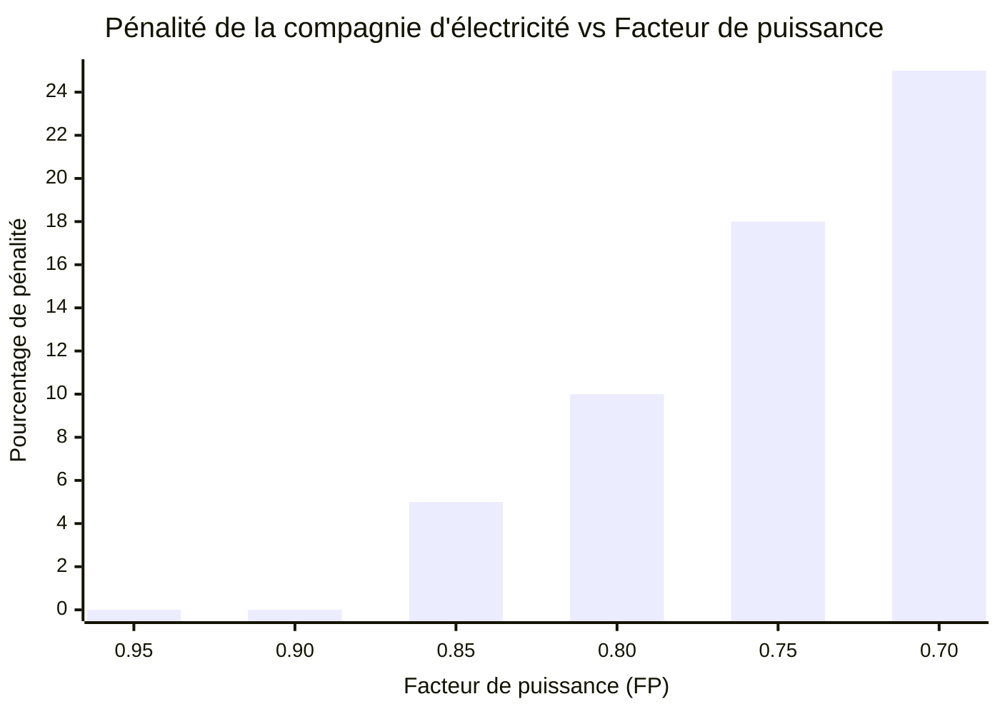
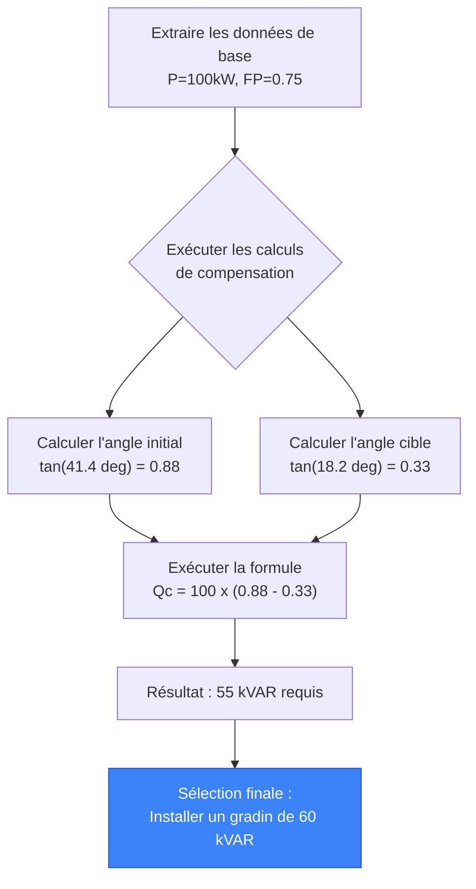
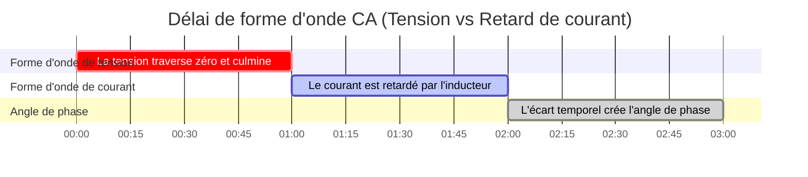

# Le Calculateur de facteur de puissance définitif : Puissance réactive, dimensionnement de condensateurs et efficacité énergétique

Bienvenue sur le **Calculateur de facteur de puissance** ultime et le guide d'ingénierie électrique en CA complet. Que vous soyez un gestionnaire d'installation tentant d'éliminer les pénalités de puissance réactive écrasantes des services publics, un ingénieur industriel dimensionnant une massive batterie de condensateurs automatique de $480\text{V}$, ou un étudiant en physique universitaire essayant de visualiser géométriquement le triangle de puissance ($S^2 = P^2 + Q^2$), la maîtrise du facteur de puissance est absolument obligatoire.

Le facteur de puissance est la mesure ultime de l'efficacité électrique en courant alternatif. Un faible facteur de puissance signifie que votre système lutte activement contre lui-même — tirant d'énormes quantités de courant pour ne faire absolument aucun travail réel, surchauffant violemment les câbles, saturant les transformateurs et forçant le réseau électrique à brûler du charbon supplémentaire juste pour pousser l'énergie vers votre usine.

Dans cette masterclass SEO exhaustive de plus de 4 000 mots, nous allons déconstruire la trigonométrie fondamentale $FP = \cos \phi$, exposer les ravages financiers des charges de moteurs inductifs non corrigées, décoder les mathématiques d'ingénierie nécessaires pour dimensionner en toute sécurité une batterie de condensateurs désaccordée, et prouver mathématiquement comment l'amélioration de votre facteur de puissance libère instantanément la capacité piégée des transformateurs. Pour nous assurer que vous comprenez parfaitement ces concepts d'ingénierie, nous avons inclus cinq diagrammes interactifs Mermaid.js méticuleusement détaillés et sûrs pour les analyseurs.

---

## 1. La physique du triangle de puissance (Active, Réactive et Apparente)

Dans les circuits à courant continu (CC), la puissance est simple : les Volts multipliés par les Ampères donnent les Watts. Dans les circuits à courant alternatif (CA), la puissance se divise en trois vecteurs dimensionnels distincts.

Pour comprendre le facteur de puissance, vous devez visualiser le **Triangle de puissance**.

1. **Puissance active (P) en kW :** C'est la base horizontale du triangle. Elle représente le travail réel et utile effectué par l'électricité — faire tourner un arbre de moteur, chauffer un élément de four ou éclairer une LED.
2. **Puissance réactive (Q) en kVAR :** C'est la perpendiculaire verticale du triangle. Elle représente l'énergie "fantôme" requise pour maintenir les champs magnétiques invisibles à l'intérieur des moteurs à induction et des transformateurs. Elle rebondit d'avant en arrière entre la charge et le réseau, ne faisant aucun travail réel mais occupant un espace précieux sur les lignes électriques.
3. **Puissance apparente (S) en kVA :** C'est l'hypoténuse du triangle. C'est la somme vectorielle totale de la puissance active et réactive ($S = \sqrt{P^2 + Q^2}$). C'est l'énergie brute que le réseau électrique doit réellement générer et pousser dans les câbles.

**L'équation du facteur de puissance :**
$$\text{Facteur de puissance (FP)} = \frac{\text{Puissance active (kW)}}{\text{Puissance apparente (kVA)}}$$

Si votre installation consomme $100\text{ kW}$ de puissance active, mais tire $125\text{ kVA}$ de puissance apparente, votre facteur de puissance est $100 / 125 = 0,80$ (ou $80\%$). Cela signifie que votre installation n'est efficace qu'à $80\%$ dans l'utilisation du courant alternatif qu'elle tire du réseau.

---

## 2. La dévastation financière d'un faible facteur de puissance

Les compagnies d'électricité facturent les foyers résidentiels strictement pour la puissance active (kWh). Cependant, les installations commerciales et industrielles sont facturées pour la puissance apparente (kVA) ou pénalisées pour l'excès de puissance réactive (kVAR).

Pourquoi ? Parce que pousser la puissance réactive sur le réseau nécessite des fils de cuivre plus épais, des transformateurs élévateurs massifs et des appareillages de commutation plus lourds. Si votre usine a un facteur de puissance de $0,70$, le fournisseur doit construire une infrastructure capable de gérer $42\%$ de courant en plus que ce que votre puissance active justifie réellement.

Pour compenser, la compagnie d'électricité vous infligera une **Pénalité de facteur de puissance**.
- Si votre FP descend en dessous de $0,90$, ils peuvent facturer $2\%$ supplémentaires sur votre facture totale.
- Si votre FP descend en dessous de $0,80$, la pénalité peut grimper à $10\%$.
- Si votre FP chute à $0,70$, la compagnie d'électricité peut déconnecter de force votre installation du réseau jusqu'à ce que vous installiez des batteries de condensateurs correctives.

Corriger votre facteur de puissance de $0,75$ à $0,95$ est souvent rentabilisé en moins de 18 mois uniquement grâce à l'élimination de ces tarifs de pénalité écrasants.

---

## 3. Les mathématiques du dimensionnement des condensateurs ($Q_c$)

Comment corrigez-vous un faible facteur de puissance ? En combattant la physique par la physique.

Les charges inductives (moteurs) nécessitent une puissance réactive en retard ($+\text{kVAR}$). Les condensateurs génèrent naturellement une puissance réactive en avance ($-\text{kVAR}$). En installant une massive batterie de condensateurs juste à côté du moteur inductif, le condensateur fournit l'énergie du champ magnétique requise localement. La puissance réactive rebondit simplement entre le condensateur et le moteur, protégeant complètement le réseau électrique d'avoir à la fournir.

**La formule de dimensionnement du condensateur :**
$$Q_c = P \times (\tan(\phi_1) - \tan(\phi_2))$$

Où :
- $Q_c$ = Taille du condensateur requise en kVAR.
- $P$ = Puissance active de la charge en kW.
- $\phi_1$ = Angle de phase initial (calculé par $\arccos(\text{FP}_{\text{initial}})$).
- $\phi_2$ = Angle de phase cible (calculé par $\arccos(\text{FP}_{\text{cible}})$).

**Exemple de calcul :**
Vous avez un moteur de $100\text{ kW}$ fonctionnant à un FP de $0,75$. Vous voulez le corriger à un FP de $0,95$.
1. Angle initial : $\arccos(0,75) = 41,41^\circ$. $\tan(41,41^\circ) = 0,8819$.
2. Angle cible : $\arccos(0,95) = 18,19^\circ$. $\tan(18,19^\circ) = 0,3286$.
3. Compensation requise : $Q_c = 100 \times (0,8819 - 0,3286) = 55,33\text{ kVAR}$.

Vous devez installer une batterie de condensateurs de $55\text{ kVAR}$ pour atteindre un facteur de puissance de $0,95$.

---

## 4. Libération de la capacité piégée du transformateur

L'un des avantages les plus puissants, mais rarement compris, de la correction du facteur de puissance est la libération instantanée de la capacité piégée du transformateur.

Les transformateurs sont strictement évalués en kVA (puissance apparente). Ils ne se soucient pas des kW ; ils ne se soucient que du courant thermique total.
Si vous avez un transformateur d'installation massif de $500\text{ kVA}$, et que votre usine tire $400\text{ kW}$ de puissance active avec un terrible facteur de puissance de $0,70$ :
- Puissance apparente = $400 / 0,70 = 571\text{ kVA}$.
- **Résultat :** Votre transformateur de $500\text{ kVA}$ est surchargé de $71\text{ kVA}$. Il va surchauffer et exploser de façon catastrophique.

Au lieu de dépenser 50 000 $ pour passer à un transformateur de $800\text{ kVA}$, vous installez une batterie de condensateurs pour corriger le facteur de puissance à $0,95$ :
- Nouvelle puissance apparente = $400 / 0,95 = 421\text{ kVA}$.
- **Résultat :** Exactement le même transformateur de $500\text{ kVA}$ fonctionne désormais en toute sécurité à $84\%$ de charge. Vous avez magiquement libéré $150\text{ kVA}$ de capacité piégée à partir de rien, vous permettant d'ajouter de nouveaux équipements de fabrication sans mettre à niveau la sous-station du réseau.

---

## 5. Le danger de la résonance harmonique et du désaccord

Les condensateurs sont incroyablement dangereux lorsqu'ils sont installés aveuglément. Les usines modernes sont remplies d'électronique non linéaire : variateurs de fréquence (VFD), pilotes d'éclairage LED et alimentations à découpage.

Ces dispositifs génèrent une **distorsion harmonique** — des fréquences parasites qui rebondissent sur le réseau électrique à $300\text{Hz}$, $420\text{Hz}$ et $660\text{Hz}$.
Selon les lois de la physique, l'impédance d'un condensateur chute violemment à mesure que la fréquence augmente. Si vous installez une batterie de condensateurs standard dans une usine avec des harmoniques élevées, le condensateur agira comme un aspirateur, aspirant tout le courant harmonique haute fréquence jusqu'à ce qu'il explose littéralement.

Pour éviter cela, les ingénieurs installent des **batteries de condensateurs désaccordées**. Ces batteries placent de lourdes réactances inductives en série directement devant les condensateurs, décalant intentionnellement le point de résonance du circuit en dessous de la fréquence harmonique dangereuse la plus basse (par exemple, en accordant la batterie à $255\text{Hz}$ pour esquiver parfaitement la 5e harmonique agressive de $300\text{Hz}$).

---

## 6. Cinq scénarios conceptuels d'ingénierie avec visualisations 2D

Pour maîtriser pleinement les relations physiques régissant le facteur de puissance, nous explorerons cinq scénarios d'ingénierie distincts décomposés visuellement à l'aide de diagrammes Mermaid.js personnalisés.

### Exemple 1 : La physique vectorielle du triangle de puissance

**Le scénario :**
Un étudiant en génie électrique doit visualiser exactement comment le vecteur de puissance active horizontal se combine avec le vecteur de puissance réactive vertical pour former l'hypoténuse de la puissance apparente.

**Visualisation 2D :**
Cet organigramme logique cartographie la relation physique des vecteurs, démontrant clairement comment la réduction du vecteur Q vertical réduit le vecteur S de l'hypoténuse plus près de l'unité.



---

### Exemple 2 : La courbe de pénalité financière

**Le scénario :**
Un gestionnaire d'installation doit présenter une analyse de rentabilisation au directeur financier prouvant que laisser le facteur de puissance de l'usine glisser en dessous de $0,85$ déclenche une augmentation exponentielle des tarifs de pénalité des services publics.

**Les mathématiques :**
Les compagnies d'électricité imposent généralement une base de référence de $0,90$. En dessous de cela, le multiplicateur de pénalité s'incurve agressivement vers le haut pour punir les abus sur le réseau.

**Visualisation 2D :**
Ce graphique trace la corrélation directe entre un facteur de puissance qui s'effondre et les lourdes pénalités financières infligées par le réseau électrique local.



---

### Exemple 3 : Libérer la capacité piégée du transformateur

**Le scénario :**
Une usine industrielle veut ajouter une nouvelle ligne d'assemblage de $100\text{ kW}$, mais son transformateur de $500\text{ kVA}$ est saturé à $490\text{ kVA}$ en raison d'un terrible facteur de puissance de $0,70$.

**Les mathématiques :**
Charge actuelle : $343\text{ kW}$ / $0,70 = 490\text{ kVA}$.
Charge corrigée : $343\text{ kW}$ / $0,98 = 350\text{ kVA}$.
Capacité piégée libérée : $140\text{ kVA}$.

**Visualisation 2D :**
Ce graphique prouve comment la correction du facteur de puissance réduit mathématiquement l'empreinte de la puissance apparente (kVA), libérant d'énormes quantités de marge de réserve sur le transformateur existant.

```mermaid
xychart-beta
    title "Demande du transformateur en kVA pour une charge de 343 kW"
    x-axis "État du système" [Avant correction (0.70 FP), Après correction (0.98 FP), Limite de marge sûre]
    y-axis "Demande du transformateur (kVA)" 0 --> 600
    bar [490, 350, 500]
```

---

### Exemple 4 : Logique de dimensionnement automatique de la batterie de condensateurs

**Le scénario :**
Un entrepreneur en électricité doit calculer la quantité exacte de kVAR en avance requise pour neutraliser les moteurs à induction en retard d'une usine, tout en veillant à ce que le système ne sur-corrige pas accidentellement dans un facteur de puissance en avance dangereux.

**Visualisation 2D :**
Cet organigramme de haut en bas cartographie la logique stricte requise pour extraire la puissance active et les angles de phase, calculer la compensation requise ($Q_c$) et déployer un panneau de correction automatique du facteur de puissance (APFC) à gradins.



---

### Exemple 5 : Le délai de l'angle de phase

**Le scénario :**
Un étudiant en physique a du mal à comprendre ce que signifie réellement "en retard" dans une forme d'onde de courant alternatif.

**Visualisation 2D :**
Ce diagramme de Gantt décrit brutalement la chronologie microscopique d'une onde sinusoïdale CA de 50Hz, démontrant comment une charge inductive retarde physiquement la montée de la forme d'onde de courant à l'unisson avec la forme d'onde de tension, créant ainsi l'angle de phase ($\phi$).



---

## 7. Conclusion et défi d'ingénierie

La maîtrise du calcul du facteur de puissance est le summum absolu de l'ingénierie de l'efficacité électrique en courant alternatif. Comprendre la trigonométrie vectorielle du triangle de puissance, respecter les ravages financiers des charges inductives non corrigées et craindre le danger explosif de la résonance harmonique garantira que vos installations industrielles fonctionnent à une efficacité maximale sans aucune pénalité du service public.

Si vous ignorez ces principes mathématiques, vos câbles fondront sous la surcharge thermique $I^2 R$, vos transformateurs satureront et échoueront violemment, et votre directeur financier saignera des milliers de dollars chaque mois en payant des suppléments de kVA fantômes au réseau électrique.

Pour vous assurer que vous avez maîtrisé ces concepts critiques, démarrez notre simulateur interactif et essayez de résoudre ces défis finaux :
1. **Le transformateur piégé :** Une usine tire $600\text{ kW}$ à $0,65\text{ FP}$ d'un transformateur de $1000\text{ kVA}$. S'ils installent une batterie de condensateurs pour atteindre $0,95\text{ FP}$, quelle capacité de kVA exacte est libérée ?
2. **Le dimensionnement des condensateurs :** Un moteur de $250\text{ kW}$ fonctionne à un FP de $0,80$. Calculez le kVAR exact de compensation capacitive requis pour atteindre un FP de $0,98$.
3. **La réduction du courant :** Une charge triphasée de $480\text{V}$ tire $100\text{ kW}$ à $0,70\text{ FP}$. Calculez le courant de ligne. Ensuite, calculez le nouveau courant de ligne si le FP est amélioré à $0,95$. Combien d'ampères de contrainte thermique ont été économisés ?

Fiez-vous à ce calculateur pour auditer les factures d'électricité de votre installation, justifier mathématiquement les retours sur investissement des batteries de condensateurs et éliminer définitivement l'inefficacité du réseau.
