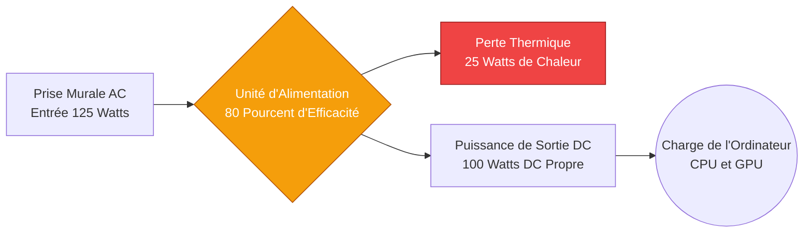
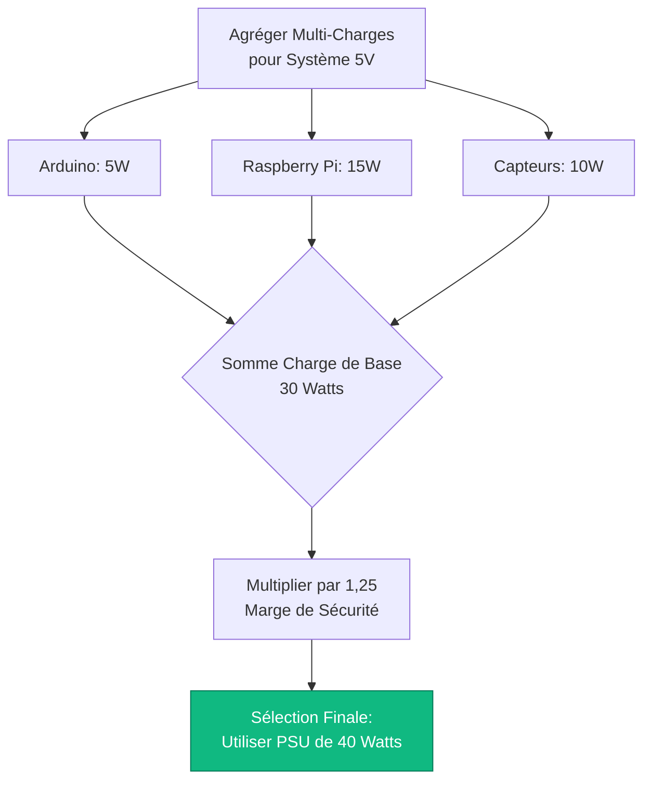
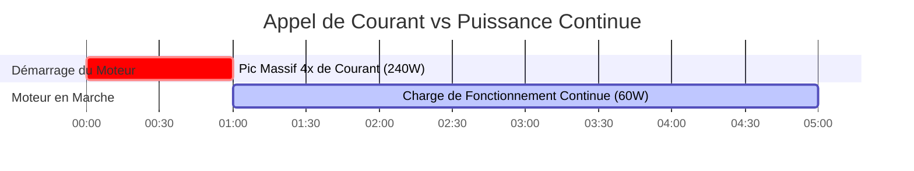

# Le Calculateur d'Alimentation Définitif : Puissance, Marge de Sécurité et Efficacité du Système

Bienvenue dans l'ultime **Calculateur d'Alimentation** et guide complet de gestion de charge électrique. Que vous soyez un intégrateur de systèmes informatiques concevant un énorme châssis de serveur à double alimentation (PSU), un monteur de PC chevronné tentant de dompter mathématiquement les pics de puissance transitoires d'une RTX 4090, ou un ingénieur en automatisation industrielle dimensionnant une alimentation Rail DIN de $24\text{V}$ pour une série de moteurs DC gourmands, la maîtrise de la physique des alimentations n'est pas négociable.

Une Unité d'Alimentation (PSU) est le cœur battant de tout système électronique. Si vous la sous-dimensionnez, votre équipement plantera violemment, subira des chutes de tension ou déclenchera un arrêt thermique. Si vous ignorez sa courbe d'efficacité, vous gaspillerez des milliers de dollars à convertir l'énergie du réseau AC en chaleur inutile et dommageable.

Dans cette masterclass SEO exhaustive de plus de 4 000 mots, nous allons déconstruire l'équation fondamentale de la puissance $P = V \times I$, exposer la nécessité technique critique de la marge de sécurité de 25 %, décoder les réalités financières des normes d'efficacité 80 Plus, et analyser la physique terrifiante des appels de courant des moteurs. Pour s'assurer que vous saisissez complètement ces concepts d'ingénierie, nous avons inclus cinq diagrammes interactifs Mermaid.js méticuleusement détaillés.

---

## 1. La Physique du Pipeline de l'Alimentation

Une Alimentation à Découpage (SMPS) moderne effectue une conversion électrique violente. Elle absorbe le courant alternatif (AC) haute tension de la prise murale, le redresse, le découpe en impulsions à haute fréquence, l'abaisse via un transformateur, et le filtre en un courant continu (DC) parfaitement lisse.

**L'Équation de Base de la Puissance :**
$$P_{\text{charge}} = V \times I$$
*(Puissance en Watts = Tension en Volts $\times$ Courant en Ampères).*

Si vous avez une caméra CCTV $12\text{V}$ qui tire $2\text{ Ampères}$, elle nécessite exactement $24\text{ Watts}$ de puissance pour fonctionner.

Mais l'alimentation elle-même n'est pas parfaite. En raison de la résistance électrique interne, des pertes de commutation et des inefficacités du transformateur, l'alimentation doit tirer **plus** de puissance de la prise murale que ce qu'elle fournit à la caméra. Cette puissance gaspillée est dissipée sous forme de chaleur thermique.

---

## 2. La Règle de la Marge de Sécurité de 25 %

L'erreur la plus courante commise par les ingénieurs amateurs est de dimensionner une alimentation exactement pour la charge totale.
Si la charge totale de votre système est de $400\text{ Watts}$ et que vous achetez une alimentation de $400\text{W}$, vous avez conçu un système voué à l'échec.

Faire fonctionner une alimentation à 100 % de sa capacité est identique à conduire une voiture à 100 % de sa vitesse de pointe en permanence. Les condensateurs internes vont bouillir, le ventilateur de refroidissement hurlera à son régime maximal, et les composants en silicium se dégraderont thermiquement, réduisant la durée de vie de l'unité de 10 ans à 2 ans.

**La Norme d'Ingénierie Recommandée :**
$$P_{\text{recommandée}} = P_{\text{charge totale}} \times 1,25$$

Vous devez *toujours* ajouter une **Marge de Sécurité d'au moins 25 %**.
Si la charge de votre système est de $400\text{W}$ : $400 \times 1,25 = 500\text{W}$. Vous devez acheter une alimentation de $500\text{W}$.

Cette marge offre trois avantages critiques :
1. **Durée de Vie Thermique :** Le PSU fonctionne plus froid et plus silencieusement.
2. **Pics Transitoires :** Elle fournit une capacité de réserve pour absorber les pics de puissance soudains de quelques microsecondes générés par les GPU et CPU modernes lorsqu'ils changent d'état.
3. **Plage d'Efficacité Idéale :** Les alimentations sont mathématiquement les plus efficaces lorsqu'elles fonctionnent entre 50 % et 80 % de leur capacité totale.

---

## 3. Les Mathématiques de l'Efficacité (La Norme 80 Plus)

Parce que la conversion de puissance génère de la chaleur, l'industrie électronique a créé la **Certification 80 Plus** pour classer l'efficacité des alimentations.

Une unité "80 Plus Bronze" garantit une efficacité de $85\ \%$ à $50\ \%$ de charge.
Une unité "80 Plus Titanium" garantit une efficacité de $94\ \%$ à $50\ \%$ de charge.

**L'Équation de la Puissance d'Entrée :**
$$P_{\text{entrée}} = \frac{P_{\text{charge}}}{\text{Efficacité \%}}$$

**Exemple : Une charge de 500W fonctionnant sur un PSU efficace à 80 % vs un PSU Titanium à 94 %.**
- **PSU Efficace à 80 % :** $500 / 0,80 = 625\text{W}$ tirés de la prise. ($125\text{W}$ gaspillés sous forme de chaleur).
- **PSU Efficace à 94 % :** $500 / 0,94 = 531\text{W}$ tirés de la prise. ($31\text{W}$ gaspillés sous forme de chaleur).

Dans un environnement de serveurs fonctionnant 24h/24 et 7j/7, cette différence de $94\text{W}$ en chaleur gaspillée permettra d'économiser des centaines de dollars, à la fois en coûts électriques directs et en coûts de climatisation indirects nécessaires pour refroidir la salle des serveurs.

---

## 4. Le Danger de l'Appel de Courant (Multiplicateurs de Démarrage)

Certains composants électriques, en particulier les moteurs DC, les pompes à eau et les gros ventilateurs, ne respectent pas les lois fondamentales de la puissance lorsqu'ils s'allument pour la première fois.

Lorsqu'un moteur est à l'arrêt complet, il génère une Force Contre-Électromotrice (Back-EMF) nulle. Dans les premières millisecondes du démarrage, le moteur agit presque comme un court-circuit franc, tirant des quantités massives de courant pour vaincre l'inertie physique du rotor.

C'est ce qu'on appelle **l'Appel de Courant (Inrush Current)** ou la Puissance de Démarrage (Surge Power).
- Un moteur DC de $12\text{V}$, $2\text{A}$ ($24\text{W}$) peut tirer $8\text{A}$ ($96\text{W}$) pendant une demi-seconde au démarrage.
- Une alimentation standard strictement dimensionnée pour $24\text{W}$ déclenchera instantanément sa Protection contre les Surintensités (OCP) et s'éteindra.

*Règle d'Ingénierie :* Lors du dimensionnement d'une alimentation pour des moteurs ou des pompes, vous devez multiplier la charge continue par un facteur de démarrage de $3,0\times$ à $4,0\times$ pour garantir que l'alimentation puisse survivre au pic de démarrage.

---

## 5. Architectures d'Alimentation pour PC et Serveurs

Les alimentations d'ordinateurs ATX modernes sont hautement spécialisées. Bien qu'elles fournissent du $3,3\text{V}$, $5\text{V}$ et $12\text{V}$, la grande majorité des composants de PC modernes (le CPU et le GPU) tirent leur puissance exclusivement de la ligne $12\text{V}$.

Lors du dimensionnement d'une alimentation PC, vous devez vous assurer que la capacité spécifique de la ligne $12\text{V}$ est suffisamment grande pour gérer le TDP combiné (Thermal Design Power) de vos processeurs, en plus des énormes pics transitoires (qui peuvent atteindre $2,5\times$ la puissance nominale pendant quelques microsecondes).

Dans les serveurs d'entreprise, les ingénieurs utilisent la **Redondance N+1**. Si un serveur nécessite $800\text{W}$ de puissance, il est équipé de deux alimentations de $800\text{W}$. Elles se partagent la charge à $400\text{W}$ chacune. Si un PSU explose, l'autre monte instantanément à 100 % de sa capacité ($800\text{W}$), empêchant le serveur de planter.

---

## 6. Cinq Scénarios d'Ingénierie Conceptuels avec Visualisations 2D

Pour maîtriser pleinement les relations physiques régissant le dimensionnement des alimentations, nous explorerons cinq scénarios d'ingénierie distincts, décomposés visuellement à l'aide de diagrammes Mermaid.js personnalisés.

### Exemple 1 : Le Pipeline de Conversion de l'Alimentation

**Le Scénario :**
Un étudiant en informatique doit visualiser comment une alimentation prend l'énergie AC brute de la prise murale, subit des pertes thermiques et fournit une énergie DC utilisable à la carte mère.

**Visualisation 2D :**
Cet organigramme logique trace le chemin physique de l'énergie circulant à travers un SMPS, montrant explicitement la perte d'efficacité où l'énergie électrique est perdue sous forme de chaleur.



---

### Exemple 2 : Comparaison des Pertes Thermiques d'Efficacité 80 Plus

**Le Scénario :**
Un gestionnaire de centre de données doit décider s'il paie un supplément pour des alimentations 80 Plus Titanium ou s'il s'en tient à des unités 80 Plus White bon marché pour un énorme réseau de serveurs tirant $1000\text{W}$.

**Les Mathématiques :**
À $1000\text{W}$ de sortie, un PSU efficace à 80 % gaspille $250\text{W}$ en chaleur. Un PSU efficace à 94 % ne gaspille que $63\text{W}$ en chaleur.

**Visualisation 2D :**
Ce graphique à barres démontre de manière agressive la pénalité thermique massive infligée à une salle de serveurs par l'utilisation d'alimentations à faible efficacité.

```mermaid
xychart-beta
    title "Chaleur Gaspillée (Watts) à 1000W de Charge de Sortie DC"
    x-axis "Niveau d'Efficacité 80 Plus" [White 80%, Bronze 85%, Gold 90%, Titanium 94%]
    y-axis "Chaleur Gaspillée (Watts)" 0 --> 300
    bar [250, 176, 111, 63]
```

---

### Exemple 3 : La Marge de Sécurité de 25 %

**Le Scénario :**
Un constructeur de PC personnalisé a tabulé tous les composants et est arrivé à une charge totale du système de $600\text{W}$. Il a besoin de comprendre visuellement pourquoi acheter un PSU de $600\text{W}$ est dangereux.

**Les Mathématiques :**
$600\text{W} \times 1,25 = 750\text{W}$ Recommandé.

**Visualisation 2D :**
Ce graphique compare la charge totale exacte au seuil catastrophique de Marge Nulle, prouvant la nécessité du seuil Recommandé de $750\text{W}$.

```mermaid
xychart-beta
    title "Capacité de l'Alimentation vs Marge de Sécurité"
    x-axis "Seuils de Conception" [Charge Totale du Système, Danger Marge Nulle, Marge Recommandée 25%]
    y-axis "Puissance Requise (W)" 0 --> 800
    bar [600, 600, 750]
```

---

### Exemple 4 : Algorithme de Dimensionnement d'un Système Multi-Charges

**Le Scénario :**
Une ingénieure en automatisation construit un boîtier de commande contenant un Arduino ($5\text{V}$, $1\text{A}$), un Raspberry Pi ($5\text{V}$, $3\text{A}$) et un réseau de capteurs ($5\text{V}$, $2\text{A}$). Elle doit dimensionner une alimentation Rail DIN de $5\text{V}$ unique.

**Visualisation 2D :**
Cet organigramme de haut en bas cartographie la logique stricte requise pour agréger des charges DC indépendantes et appliquer mathématiquement la marge de sécurité pour sélectionner le PSU industriel final.



---

### Exemple 5 : Appel de Courant d'un Moteur (Le Pic de Démarrage)

**Le Scénario :**
Un technicien connecte une pompe à eau de $12\text{V}$ $5\text{A}$ ($60\text{W}$) à une alimentation de $12\text{V}$ $10\text{A}$ ($120\text{W}$). Malgré une marge de sécurité de 100 %, l'alimentation s'éteint et se réinitialise instantanément à chaque fois que la pompe essaie de démarrer.

**Visualisation 2D :**
Ce diagramme de Gantt souligne brutalement la chronologie microscopique de l'Appel de Courant d'un moteur, démontrant comment un moteur de $60\text{W}$ tire en réalité $240\text{W}$ pendant les 500 premières millisecondes, déclenchant violemment la Protection contre les Surintensités du PSU.



---

## 7. Conclusion et Défi d'Ingénierie

La maîtrise du calcul de l'Alimentation est le socle fondamental de tout système électronique stable. Comprendre la nécessité absolue de la marge de sécurité de 25 %, respecter l'impact financier des pertes thermiques de l'Efficacité 80 Plus et redouter la physique terrifiante des appels de courant des moteurs garantira que vos systèmes ne planteront jamais sous pression.

Si vous ignorez ces principes mathématiques, vos serveurs redémarreront spontanément sous de lourdes charges, vos alimentations se dégraderont thermiquement et éventreront leurs condensateurs, et vos boîtiers de commande industriels déclencheront à plusieurs reprises leurs circuits de protection.

Pour vous assurer d'avoir maîtrisé ces concepts critiques, lancez notre Simulateur interactif et essayez de relever ces défis finaux :
1. **La Mise à Niveau du Serveur :** Un serveur tire une charge totale de $550\text{W}$. Calculez la puissance du PSU Recommandée exacte en utilisant une marge de sécurité stricte de $25\ \%$.
2. **Le Déchet Thermique :** Vous tirez $400\text{W}$ d'une alimentation Bronze efficace à $85\ \%$. Exactement combien de Watts tirez-vous de la prise, et exactement combien de Watts sont gaspillés sous forme de chaleur thermique ?
3. **Le Pic de la Pompe :** Un ventilateur industriel DC de $24\text{V}$ a une charge de fonctionnement continue de $3\text{ Ampères}$. Pour garantir qu'il survit à un pic d'appel au démarrage de $3\times$, quelle est la puissance minimale absolue du PSU que vous devez acheter ?

Fiez-vous à ce calculateur pour auditer vos assemblages PC, calculer des charges multi-appareils complexes, et toujours défendre mathématiquement vos appareils électroniques contre la pénurie d'énergie.
