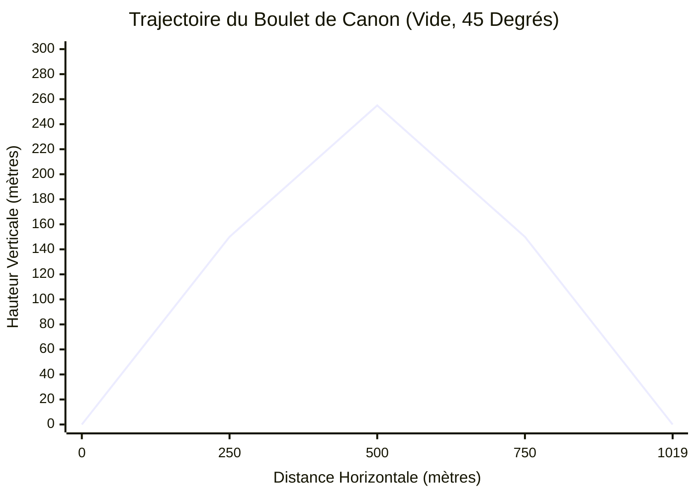
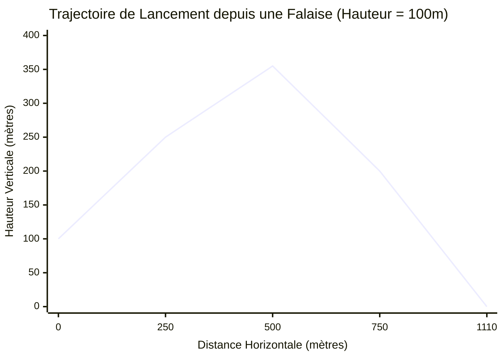
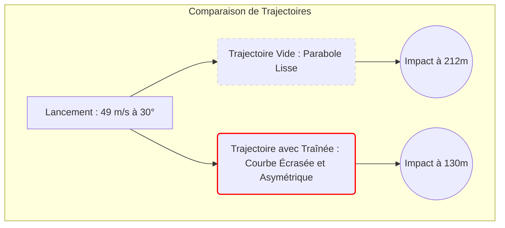
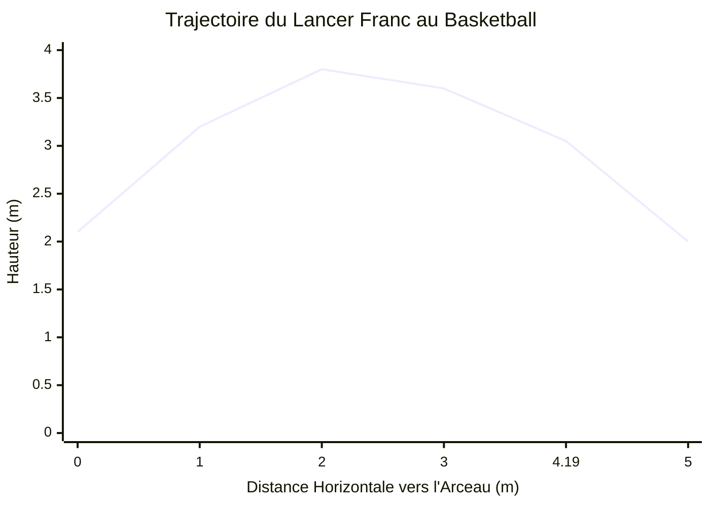
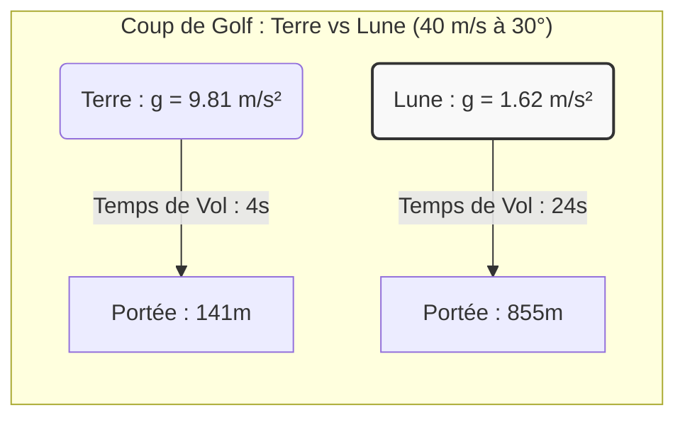

# Calculateur de Mouvement de Projectile : Le Guide Ultime de la Cinématique et de la Balistique

Avez-vous déjà lancé une balle de baseball, fait ricocher une pierre sur un étang calme ou regardé un feu d'artifice illuminer le ciel nocturne en vous interrogeant sur les règles mathématiques invisibles qui régissent leur vol ? Chaque fois qu'un objet est lancé ou tiré en l'air, il devient un **projectile**. À l'instant où il quitte votre main ou le canon d'une arme, son destin est remis aux forces fondamentales de l'univers, principalement la gravité et la résistance de l'air.

Comprendre comment ces objets se déplacent n'est pas seulement un exercice mathématique ; c'est le fondement même de la mécanique classique. C'est la science qui permet aux ingénieurs de poser des rovers sur Mars, aux athlètes d'optimiser leurs lancers francs et aux développeurs de jeux vidéo de créer des moteurs physiques réalistes.

Bienvenue dans le guide définitif sur le mouvement des projectiles. Que vous soyez un étudiant en physique au lycée aux prises avec des équations cinématiques, un ingénieur en mécanique concevant un lanceur pneumatique, ou simplement un esprit curieux voulant comprendre le monde, ce guide, associé à notre **Calculateur de Mouvement de Projectile** avancé, vous donnera une maîtrise totale des trajectoires 2D.

---

## 1. Le Concept Humain du Mouvement de Projectile : Une Explication Approfondie

Pour véritablement comprendre le mouvement des projectiles, il faut d'abord désapprendre une idée fausse courante. Pendant des siècles, d'anciens philosophes comme Aristote croyaient qu'un objet lancé en l'air voyageait en ligne droite jusqu'à ce qu'il manque de "force" (ou *impetus*), moment auquel il tomberait directement au sol. Si vous regardez un objet se déplaçant rapidement comme une balle, il peut sembler voyager en ligne droite.

Cependant, à la fin du 16e et au début du 17e siècle, **Galileo Galilei** a changé le monde à jamais en réalisant que la trajectoire d'un projectile est en réalité une courbe lisse et symétrique connue en mathématiques sous le nom de **parabole**.

Le génie de Galilée a été de réaliser que le mouvement d'un projectile n'est pas un seul mouvement complexe, mais **deux mouvements simples et complètement indépendants qui se produisent en même temps**.

### Les Deux Piliers de la Cinématique 2D

Lorsqu'un boulet de canon est tiré horizontalement depuis une falaise, il fait deux choses simultanément :
1. **Avancer** (Mouvement Horizontal)
2. **Tomber vers le bas** (Mouvement Vertical)

Le principe de **l'Indépendance du Mouvement** de Galilée stipule que ces deux dimensions ne s'affectent pas mutuellement. La vitesse de progression horizontale ne se soucie pas du fait que l'objet tombe, et la vitesse de chute verticale ne se soucie pas du fait que l'objet avance.

#### Mouvement Horizontal : La Phase d'Inertie
Imaginez que vous faites glisser un palet sur une couche de glace parfaite et sans friction. Une fois que vous le poussez, il continue de glisser vers l'avant à la même vitesse pour toujours. Il n'y a plus de force qui le pousse vers l'avant, mais il n'y a pas non plus de force qui le ralentit. C'est la Première Loi du Mouvement de Newton (Inertie).

Dans un vide physique idéal (où nous prétendons que l'air n'existe pas), le mouvement horizontal d'un projectile est exactement comme ce palet. Une fois l'objet lancé, il n'y a aucune force horizontale agissant sur lui. Par conséquent, sa **vitesse horizontale reste parfaitement constante**, et son accélération horizontale est nulle ($a_x = 0$).

#### Mouvement Vertical : La Phase de Chute
Maintenant, imaginez laisser tomber une pomme de votre main. Elle commence à une vitesse nulle, mais la gravité la tire vers le bas, la faisant accélérer. Chaque seconde qu'elle tombe, sa vitesse augmente d'environ $9.81 \text{ m/s}$.

Pour un projectile, c'est exactement la même chose. Peu importe à quelle vitesse il avance, la gravité le tire inlassablement vers le bas avec une accélération verticale constante ($a_y = -9.81 \text{ m/s}^2$ sur Terre).

Lorsque vous combinez une vitesse d'avancement constante avec une vitesse de chute qui accélère vers le bas, le chemin tracé dans l'espace est un arc parabolique parfait.

### Les Mathématiques du Vide

Pour prédire l'emplacement exact d'un projectile à une seconde donnée, nous utilisons les équations cinématiques standard.

**1. Décomposition du Lancement (Résolution de Vecteurs)**
Lorsqu'un projectile est lancé à une vitesse initiale ($v_0$) et à un angle spécifique ($\theta$) par rapport au sol, la première étape consiste à diviser cette vitesse en ses composantes horizontale et verticale en utilisant la trigonométrie.
*   **Vitesse Horizontale Initiale:** $v_{x0} = v_0 \cdot \cos(\theta)$
*   **Vitesse Verticale Initiale:** $v_{y0} = v_0 \cdot \sin(\theta)$

**2. Calcul de la Position au Fil du Temps**
Puisque la vitesse horizontale ne change jamais (dans le vide), trouver la distance horizontale ($x$) à n'importe quel moment ($t$) est une simple multiplication :
*   **Position Horizontale:** $x(t) = v_{x0} \cdot t$

La position verticale ($y$) est un peu plus complexe car la gravité modifie constamment la vitesse. Nous devons prendre en compte la hauteur initiale ($h_0$), la vitesse ascendante initiale et l'attraction vers le bas de la gravité ($g$) :
*   **Position Verticale:** $y(t) = h_0 + (v_{y0} \cdot t) - \frac{1}{2}g \cdot t^2$

En liant ces deux équations via la variable temporelle ($t$), notre calculateur peut tracer instantanément la trajectoire de vol exacte de n'importe quel objet dans l'univers.

---

## 2. Guide d'Utilisation Complet : Maîtriser le Simulateur

Notre **Calculateur de Mouvement de Projectile** n'est pas seulement un simple résolveur d'équations ; c'est un moteur physique 2D complet. Voici comment exploiter tout son potentiel.

### Étape 1 : Configurer Vos Paramètres Initiaux
*   **Vitesse Initiale (Launch Speed):** C'est la vitesse brute à laquelle l'objet quitte le lanceur. Vous pouvez la saisir en mètres par seconde (m/s), kilomètres par heure (km/h), miles par heure (mph) ou pieds par seconde (ft/s).
*   **Angle de Lancement:** Saisissez l'angle d'élévation. $0^\circ$ signifie tirer parfaitement à l'horizontale. $90^\circ$ signifie tirer directement en l'air. $45^\circ$ est traditionnellement l'angle pour la portée maximale dans le vide.
*   **Hauteur Initiale:** Si vous lancez une balle depuis une falaise de 50 mètres, entrez 50 ici. Si vous frappez un ballon de football depuis le sol, laissez-le à 0.

### Étape 2 : Choisir l'Environnement
*   **Préréglages de Gravité:** La gravité terrestre est la valeur par défaut ($9.81 \text{ m/s}^2$). Cependant, vous pouvez utiliser le menu déroulant pour simuler des lancements sur la Lune, Mars, Jupiter ou même des astéroïdes dans l'espace lointain. Regardez la trajectoire exploser en hauteur lorsque vous sélectionnez la Lune !
*   **Résistance de l'Air (Traînée):** C'est là que le calculateur passe de la physique du lycée à l'ingénierie de niveau universitaire. En activant "Enable Air Resistance", le simulateur passe de simples équations algébriques à un moteur d'intégration numérique complexe **Runge-Kutta du 4e ordre (RK4)**. Vous devez fournir la Masse, la Surface Transversale et le Coefficient de Traînée ($C_d$) de l'objet. Nous proposons des préréglages pour des objets courants comme des balles de baseball, de golf et des balles de fusil.

### Étape 3 : Le Simulateur d'Impact sur Cible
Vous essayez de toucher une fenêtre spécifique, de franchir un mur spécifique ou d'atterrir dans une tranchée spécifique ?
*   Activez le **Simulateur d'Impact sur Cible (Target Hit Simulator)**.
*   Saisissez les coordonnées X (distance horizontale) et Y (hauteur verticale) de votre cible.
*   Une croix apparaîtra sur le graphique interactif. Vous pouvez ensuite ajuster l'angle de lancement et la vitesse jusqu'à ce que votre courbe de trajectoire croise parfaitement la cible.

### Étape 4 : Analyse des Données de Sortie
Une fois que vous avez saisi vos paramètres, le calculateur génère instantanément les données de vol :
*   **Hauteur Maximale (Apex):** Le point vertical le plus élevé atteint avant que la gravité ne le tire vers le bas.
*   **Portée Horizontale:** La distance totale parcourue au sol avant l'impact.
*   **Temps de Vol:** Le nombre total de secondes que l'objet passe en l'air.
*   **Vitesse d'Impact:** La vitesse exacte et l'angle auxquels le projectile frappe le sol.

Vous pouvez survoler le graphique de trajectoire interactif pour voir les coordonnées X/Y exactes et les vecteurs de vitesse à n'importe quelle fraction de seconde pendant le vol.

---

## 3. Cinq Exemples Conceptuels avec Visualisations 2D

Pour vraiment maîtriser le mouvement des projectiles, nous devons aller au-delà des équations abstraites et examiner des exemples concrets du monde réel. Voici cinq scénarios distincts qui illustrent comment la modification d'une seule variable modifie considérablement la trajectoire de vol.

### Exemple 1 : Le Boulet de Canon Classique (Vide Idéal, Terrain Plat)
**Le Scénario:** Vous commandez une équipe d'artillerie du 17e siècle sur une plaine infinie et parfaitement plate. Nous ignorerons la résistance de l'air pour cette base purement mathématique. Vous tirez un boulet de canon avec une vitesse initiale de $100 \text{ m/s}$ à un angle de $45^\circ$.

**La Décomposition Physique:**
Puisque nous sommes sur un terrain plat ($h_0 = 0$) dans le vide, la trajectoire sera une parabole parfaitement symétrique. Un angle de $45^\circ$ divise la vitesse initiale parfaitement également entre les vecteurs horizontal et vertical ($v_{x0} = 70.7 \text{ m/s}$, $v_{y0} = 70.7 \text{ m/s}$).
*   **Temps pour atteindre le sommet:** $70.7 / 9.81 = 7.21 \text{ secondes}$.
*   **Temps de Vol Total:** $7.21 \times 2 = 14.42 \text{ secondes}$ (symétrie parfaite).
*   **Portée Horizontale:** $70.7 \text{ m/s} \times 14.42 \text{ s} = 1019.5 \text{ mètres}$.

**Visualisation 2D (Carte de Trajectoire):**

*Notez la symétrie parfaite du miroir de la courbe. L'ascension prend exactement le même temps et couvre la même distance horizontale que la descente.*

---

### Exemple 2 : Le Lancement depuis la Falaise (Hauteur Initiale > 0)
**Le Scénario:** Vous défendez maintenant un château construit au bord d'une falaise verticale de 100 mètres. Vous tirez le même boulet de canon à $100 \text{ m/s}$, mais cette fois vous expérimentez avec l'angle.

**La Décomposition Physique:**
Lorsqu'il est lancé depuis une hauteur, $45^\circ$ **n'est plus l'angle optimal pour la portée maximale**. Pourquoi ? Parce que le projectile passe du temps supplémentaire à tomber de la falaise de 100 mètres jusqu'au sol d'élévation zéro. Si vous utilisez un angle légèrement inférieur (par exemple, $40^\circ$), vous consacrez davantage de votre énergie initiale à la vitesse de progression horizontale ($v_x$). La distance de chute supplémentaire fournit le temps de vol nécessaire pour que cette vitesse horizontale plus rapide couvre plus de terrain.
*   S'il est tiré à $45^\circ$, la portée est de $1110 \text{ mètres}$.
*   S'il est tiré à $40^\circ$, la portée augmente à $1115 \text{ mètres}$.

**Visualisation 2D (L'Asymétrie des Lancements Élevés):**

*Ici, la symétrie est rompue. Le projectile atteint son apogée relativement tôt dans son trajet horizontal, et le côté droit de la parabole s'étire alors qu'il tombe en dessous de l'élévation de lancement.*

---

### Exemple 3 : Le Home Run de Baseball (La Réalité de la Résistance de l'Air)
**Le Scénario:** Nous quittons le vide théorique et entrons dans le monde réel. Un joueur de la Major League Baseball frappe une balle avec une vitesse de sortie de $49 \text{ m/s}$ (environ 110 mph) à un angle de lancement de $30^\circ$. Une balle de baseball a une masse de $0.145 \text{ kg}$ et un coefficient de traînée ($C_d$) d'environ $0.3$.

**La Décomposition Physique:**
La résistance de l'air change tout. Alors que la balle fend l'air, des millions de molécules atmosphériques la percutent, générant une force de traînée qui s'oppose à son mouvement. Cette force de traînée croît de manière exponentielle avec la vitesse ($F_d \propto v^2$).
*   **Dans le vide:** La balle parcourrait la distance impressionnante de **212 mètres** (695 pieds), sortant complètement du stade.
*   **Avec Résistance de l'Air:** La traînée purge rapidement la vitesse horizontale. La balle culmine plus tôt et tombe de manière beaucoup plus abrupte. La portée réelle est réduite à environ **130 mètres** (426 pieds), un home run standard.

**Visualisation 2D (Vide vs Traînée):**

*Lorsque la résistance de l'air est prise en compte, la trajectoire n'est plus une parabole. Elle ressemble à une forme de larme. L'angle de descente est beaucoup plus raide que l'angle de lancement car la vitesse d'avancement a été en grande partie éliminée par la traînée.*

---

### Exemple 4 : Le Lancer Franc au Basketball (Impact sur une Cible Fixe)
**Le Scénario:** Un joueur de basketball tire un lancer franc. Le joueur lâche le ballon d'une hauteur de $2.1 \text{ mètres}$. Le centre de l'arceau est exactement à $4.19 \text{ mètres}$ de distance horizontale et exactement à $3.05 \text{ mètres}$ de haut.

**La Décomposition Physique:**
Il s'agit d'un problème de cinématique inverse. Au lieu de demander "Où va-t-il atterrir ?", nous exigeons que la trajectoire intercepte une coordonnée spécifique : $(X = 4.19, Y = 3.05)$.
Le joueur tire généralement avec un angle d'environ $50^\circ$ pour donner au ballon un arc élevé, lui permettant de tomber proprement à travers le filet. En utilisant l'équation de la trajectoire, la vitesse initiale requise pour toucher parfaitement le centre de l'arceau à un angle de $50^\circ$ depuis une hauteur de libération de $2.1\text{m}$ est d'exactement **$7.28 \text{ m/s}$**. Si le joueur tire à $7.5 \text{ m/s}$, il frappe l'arrière du cercle. S'il tire à $7.0 \text{ m/s}$, le ballon ne touche même pas l'arceau (airball).

**Visualisation 2D (Intersection Cible):**

*La précision mathématique requise dans le sport est stupéfiante. Le cerveau humain agit comme un ordinateur balistique en temps réel, calculant intuitivement les $v_0$ et $\theta$ nécessaires pour que la ligne de trajectoire intercepte la coordonnée $(4.19, 3.05)$.*

---

### Exemple 5 : Jouer au Golf sur la Lune (Environnements à Faible Gravité)
**Le Scénario:** En 1971, l'astronaute d'Apollo 14, Alan Shepard, a frappé une balle de golf sur la surface de la Lune avec un fer 6 de fortune. Supposons une vitesse de swing amateur de $40 \text{ m/s}$ et un angle de lancement de $30^\circ$.

**La Décomposition Physique:**
La Lune est un environnement physique radicalement différent.
1.  **Zéro Résistance de l'Air:** Il n'y a pas d'atmosphère, nous utilisons donc les équations du vide pur. La balle de golf ne courbera ni ne ralentira.
2.  **Faible Gravité:** L'attraction gravitationnelle n'est que de $1.62 \text{ m/s}^2$ (environ 1/6ème de la gravité terrestre).

Parce que la gravité tire la balle vers le bas avec 6 fois moins de force, la balle reste en l'air 6 fois plus longtemps. Parce qu'elle est en l'air 6 fois plus longtemps, sa vitesse horizontale constante la porte 6 fois plus loin.
*   **Portée sur Terre:** $141 \text{ mètres}$
*   **Portée sur la Lune:** $855 \text{ mètres}$ (Plus d'un demi-mile !)

**Visualisation 2D (Mise à l'Échelle de la Gravité):**

*En modifiant la constante fondamentale de la gravité ($g$), la même entrée d'énergie initiale entraîne une sortie cinématique massivement amplifiée.*

---

## 4. Sujets Avancés et Ingénierie dans le Monde Réel

Bien que lancer des balles de baseball et frapper des balles de golf soient d'excellents outils pédagogiques, le mouvement des projectiles forme la base de l'ingénierie avancée et des applications militaires.

### Mécanique Orbitale : Le Boulet de Canon de Newton
Isaac Newton a proposé une célèbre expérience de pensée : que se passerait-il si nous placions un canon au sommet d'une montagne si haute qu'elle dépasserait l'atmosphère terrestre (éliminant la résistance de l'air) ?
Si le boulet de canon est tiré à des vitesses normales, il suit une parabole normale et heurte le sol. Mais s'il est tiré suffisamment vite (environ $7 900 \text{ m/s}$), quelque chose de miraculeux se produit.
Le boulet tombe vers la Terre sous l'effet de la gravité, mais comme la Terre est une sphère, la surface de la planète *s'incurve* exactement au même rythme que la balle tombe. Le boulet est en état perpétuel de chute libre, ratant constamment le sol.
C'est ce qu'est une **orbite**. La Station Spatiale Internationale (ISS) n'est techniquement qu'un projectile se déplaçant si vite horizontalement que son arc parabolique correspond parfaitement à la courbure de la Terre.

### L'Artillerie et l'Effet Coriolis
Pour les tireurs d'élite militaires et les équipes d'artillerie à longue portée, l'équation de base $R = \frac{v_0^2 \sin(2\theta)}{g}$ est tristement insuffisante. Lors du tir d'un obus à des kilomètres de distance, les ingénieurs doivent tenir compte de :
1.  **Densité de l'Air Variable:** L'air est plus fin au sommet de la trajectoire qu'au point de lancement, modifiant dynamiquement le coefficient de traînée pendant le vol.
2.  **L'Effet Coriolis:** La Terre tourne sous le projectile pendant qu'il est en l'air. Si un obus d'artillerie est tiré vers le nord dans l'hémisphère nord, la cible se déplace vers l'est plus rapidement que le point de lancement. Le projectile semblera s'incurver vers la droite. Les ordinateurs balistiques doivent calculer cette force fictive pour garantir la précision.

### Science du Sport : L'Effet Magnus
Dans notre simulateur, nous traitons les objets comme des masses ponctuelles non rotatives. En réalité, les sphères comme les balles de tennis, les ballons de football et les balles de baseball tournent rapidement.
Lorsqu'une balle tourne en se déplaçant dans l'air, elle entraîne avec elle une couche limite d'air. Une balle avec un **effet rétro** (backspin) (comme une balle rapide ou une balle de golf frappée) pousse l'air vers le bas. Selon la Troisième Loi de Newton, l'air pousse la balle vers le haut. Cela génère une force de portance connue sous le nom **d'Effet Magnus**.
C'est pourquoi une balle de golf frappée avec un fort effet rétro peut en fait voyager *plus loin* dans le monde réel que dans un vide pur : la portance aérodynamique la maintient en l'air assez longtemps pour contrer le ralentissement aérodynamique.

---

## Conclusion : La Beauté de la Physique Prévisible

La magie du mouvement des projectiles réside dans son déterminisme absolu. Une fois qu'un objet quitte le lanceur, son destin est entièrement scellé par les lois de la physique. En comprenant la vitesse initiale, l'angle de lancement et les forces environnementales de gravité et de traînée aérodynamique, nous pouvons regarder vers l'avenir et prédire exactement où et quand l'objet atterrira.

Nous vous encourageons vivement à passer du temps à expérimenter avec le **Simulateur de Mouvement de Projectile** ci-dessus. Modifiez les angles de lancement. Activez et désactivez la résistance de l'air. Voyez ce qui se passe lorsque vous lancez une balle de baseball sur Jupiter. En jouant avec les variables, les équations abstraites de la cinématique se transformeront en une compréhension intuitive et visuelle de la mécanique qui régit notre univers.
