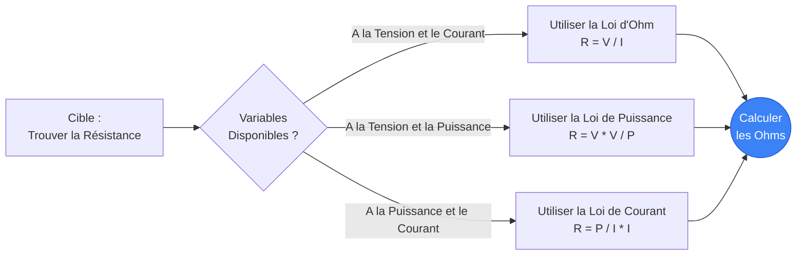
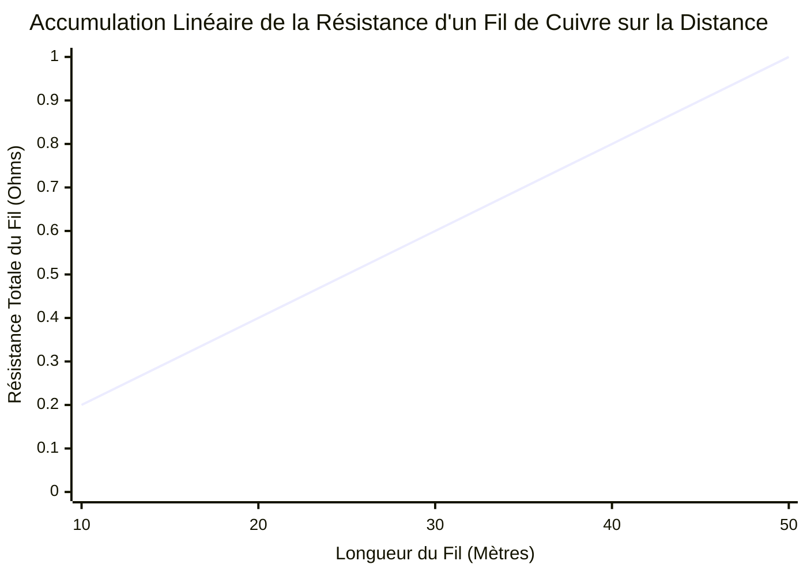
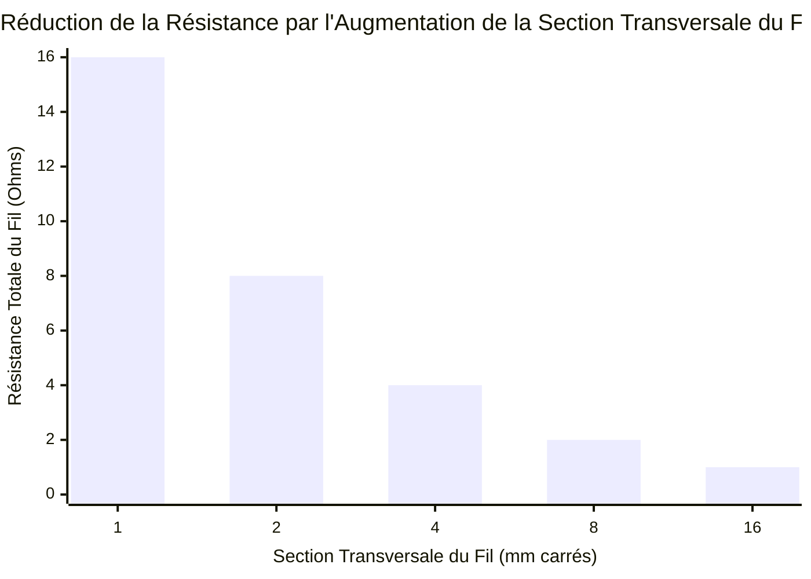
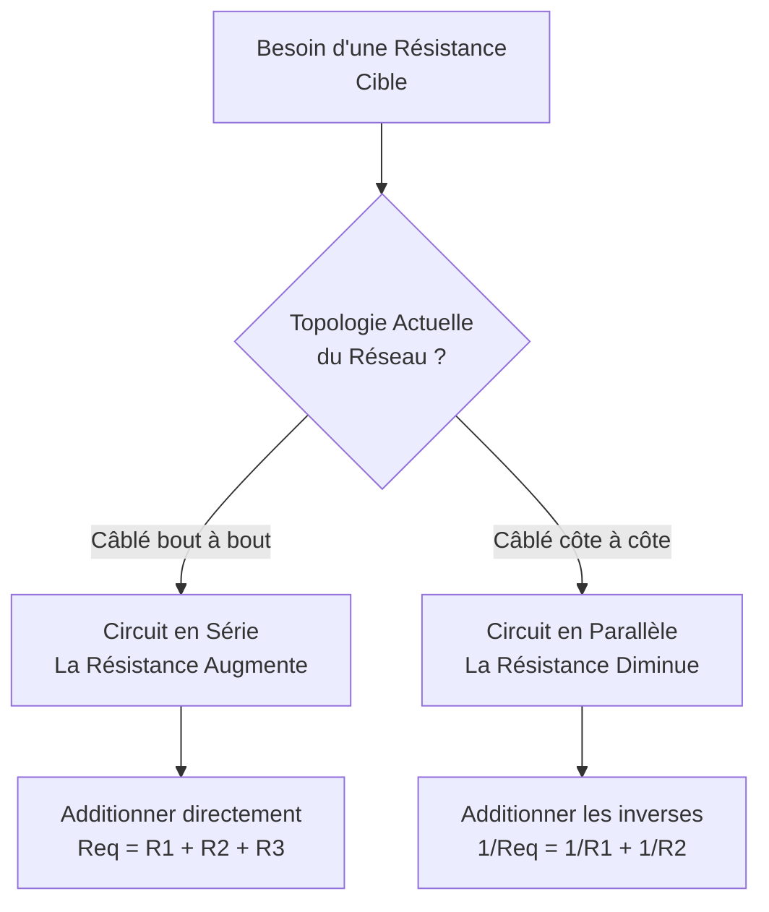

# Le Calculateur de Résistance Définitif : Maîtriser les Résistances et la Physique des Conducteurs

Bienvenue dans l'ultime **Calculateur de Résistance** et guide complet de physique. Que vous soyez en train de décoder une résistance à 4 bandes brûlée sur un circuit imprimé cassé, de calculer la résistance équivalente précise d'un réseau de charge parallèle massif, ou d'analyser la chute de tension résistive d'une ligne de transmission en cuivre de $500\text{ pieds}$, cette suite interactive fournit les dérivations mathématiques exactes dont vous avez besoin.

La Résistance Électrique est le frottement du monde de l'électronique. Sans Résistance, le courant circulerait de manière infinie, vaporisant instantanément tout sur son passage. La Résistance nous permet de contrôler, de limiter et d'exploiter l'électricité pour effectuer un travail utile, de l'éclairage des LEDs à la génération de chaleur thermique.

Dans ce guide SEO exhaustif de plus de 4 000 mots, nous allons déconstruire agressivement la physique de la Résistance Électrique, explorer les limites mathématiques de la loi d'Ohm ($R = V/I$) et de l'effet Joule ($P = I^2 R$), décoder les normes internationales du Code Couleur des Résistances, analyser la résistivité intrinsèque des matériaux ($\rho$), et décomposer cinq scénarios électriques détaillés représentés visuellement par des diagrammes Mermaid.js interactifs et sûrs pour les analyseurs.

---

## 1. Qu'est-ce qu'exactement la Résistance Électrique ? (La Définition Physique)

**La Résistance Électrique**, scientifiquement mesurée en **Ohms ($\Omega$)**, est l'opposition fondamentale à la circulation du courant électrique à travers un matériau conducteur. 

Pour comprendre intuitivement la Résistance, les ingénieurs en électricité s'appuient universellement sur l'**Analogie de la Conduite d'Eau** :
- Imaginez un énorme château d'eau poussant de l'eau à travers un tuyau. Si le tuyau est massif et large, l'eau s'écoule facilement (Faible Résistance).
- **La Résistance est un Tuyau Bouché.** 
- Si vous pincez le tuyau ou le remplissez de roches, vous créez une friction extrême. L'eau a du mal à passer, la pression s'accumule derrière le bouchon, et le bouchon lui-même devient physiquement chaud en raison de la friction.
- C'est exactement ce qu'un **Résistor** fait aux électrons. Il étouffe le flux de courant, faisant volontairement chuter la tension et convertissant cette énergie électrique en chaleur thermique.

L'unité SI officielle pour la Résistance est l'**Ohm ($\Omega$)**, nommée d'après le physicien allemand Georg Simon Ohm. En termes thermodynamiques stricts, $1\text{ Ohm}$ est défini comme la quantité exacte de résistance requise pour limiter un potentiel électrique de $1\text{ Volt}$ à un flux d'exactement $1\text{ Ampère}$. ($1\ \Omega = 1\text{V} / 1\text{A}$).

---

## 2. Dériver la Résistance de la Loi d'Ohm ($R = V / I$)

Georg Simon Ohm a prouvé que la Résistance est mathématiquement verrouillée dans une relation tripartite avec la Tension ($V$) et le Courant ($I$). 

$$R = \frac{V}{I}$$

Cela signifie que vous pouvez facilement calculer la résistance réelle de n'importe quel composant dans l'univers simplement en mesurant la chute de tension à ses bornes et le courant qui le traverse.
- **Si la Tension augmente** mais que le Courant reste le même, la Résistance du composant doit avoir magiquement augmenté.
- **Si le Courant diminue** mais que la Tension reste la même, la Résistance doit augmenter.

Cette relation mathématique exacte est la façon dont les multimètres mesurent les Ohms. Un ohmmètre injecte en réalité un courant minuscule et très précis de $1\text{mA}$ dans la résistance, mesure la chute de Tension résultante, et calcule instantanément la Résistance en utilisant la loi d'Ohm.

---

## 3. Dériver la Résistance de la Loi de Watt ($R = P / I^2$)

Tandis que la loi d'Ohm dicte le flux d'électrons contre la friction, la loi de Watt dicte la puissance thermodynamique de sortie générée par cette friction.

$$P = I^2 \cdot R$$

En isolant algébriquement la Résistance ($R$), nous obtenons deux formules d'ingénierie incroyablement puissantes :
1. **Résistance dérivée de la Puissance et du Courant :** $R = \frac{P}{I^2}$
2. **Résistance dérivée de la Tension et de la Puissance :** $R = \frac{V^2}{P}$

Ces formules sont absolument obligatoires pour concevoir des éléments chauffants. Si un ingénieur mécanique doit concevoir un radiateur électrique qui produit exactement $1 500\text{W}$ de chaleur thermique lorsqu'il est branché sur une prise murale de $120\text{V}$, quelle résistance exacte la bobine chauffante en nichrome doit-elle avoir ?
En utilisant la formule : $R = \frac{120^2}{1500} = \frac{14400}{1500} = 9.6\ \Omega$. 
L'ingénieur doit couper exactement $9.6\ \Omega$ de fil nichrome !

---

## 4. Décoder le Code Couleur des Résistances

Étant donné que les résistances traversantes standards sont physiquement trop petites pour que des chiffres y soient imprimés, l'industrie électrique a adopté un système universel de bandes colorées dans les années 1920 pour indiquer les valeurs de résistance.

### Le Système à 4 Bandes
La résistance la plus courante utilise 4 bandes de couleur peintes :
- **Bande 1 :** Le premier chiffre significatif.
- **Bande 2 :** Le deuxième chiffre significatif.
- **Bande 3 :** Le Multiplicateur décimal (Combien de zéros ajouter).
- **Bande 4 :** La marge de Tolérance (Or = $5\%$, Argent = $10\%$).

**Exemple :**
Si vous trouvez une résistance peinte en **Rouge, Rouge, Orange, Or** :
1. Rouge = 2
2. Rouge = 2
3. Orange = 3 zéros ($1 000$)
4. Or = $\pm 5\%$
Résultat : $22 \cdot 1 000 = 22 000\ \Omega$ ($22\text{ k}\Omega$) avec une tolérance de $5\%$.

Notre calculateur interactif propose un visualiseur SVG en direct et en temps réel qui peint instantanément les bandes de la résistance au fur et à mesure que vous tapez vos valeurs.

---

## 5. Résistance Équivalente : Réseaux en Série vs Parallèle

Lors de la conception de circuits, vous utilisez rarement une seule résistance. Vous combinez plusieurs résistances ensemble pour obtenir des chutes de tension ou des répartitions de courant spécifiques.

### Circuits en Série ($R_{eq} = R_1 + R_2 + R_3$)
Lorsque les résistances sont placées bout à bout en ligne droite, le courant est forcé de les traverser toutes séquentiellement. Cela signifie que la friction s'additionne directement.
- **Règle :** En Série, la résistance totale AUGMENTE toujours.
- Exemple : $100\ \Omega + 100\ \Omega = 200\ \Omega$.

### Circuits en Parallèle ($1/R_{eq} = 1/R_1 + 1/R_2 + 1/R_3$)
Lorsque les résistances sont placées côte à côte, le courant peut se diviser et emprunter plusieurs chemins simultanément. Parce qu'il y a maintenant plusieurs voies de circulation ouvertes, la friction globale du circuit diminue.
- **Règle :** En Parallèle, la résistance totale DIMINUE toujours. Elle sera toujours strictement inférieure à la plus petite résistance du réseau.
- Exemple : Deux résistances de $100\ \Omega$ en parallèle créent une résistance équivalente de $50\ \Omega$.

---

## 6. La Physique de la Résistance et de la Résistivité des Fils ($\rho$)

Un fil de cuivre n'est techniquement qu'une très longue résistance de très faible valeur. Pour les circuits haute puissance, la résistance du fil lui-même devient un facteur d'ingénierie critique.

La résistance totale d'un fil est déterminée par trois facteurs physiques :
$$R = \rho \frac{L}{A}$$

1. **Longueur ($L$) :** La résistance est parfaitement linéaire avec la longueur. Si vous doublez la longueur d'une rallonge, vous doublez sa résistance.
2. **Surface de Section Transversale ($A$) :** La résistance est inversement proportionnelle à l'épaisseur. Si vous doublez l'épaisseur d'un fil, vous réduisez sa résistance de moitié. (C'est pourquoi les câbles de démarrage à fort ampérage sont extrêmement épais).
3. **Résistivité ($\rho$) :** Il s'agit de la "friction" quantique mécanique intrinsèque du métal élémentaire brut.

**Valeurs de Résistivité :**
- **Argent :** $1.59 \times 10^{-8}\ \Omega\cdot\text{m}$ (Le meilleur conducteur absolu sur Terre).
- **Cuivre :** $1.68 \times 10^{-8}\ \Omega\cdot\text{m}$ (Le standard de l'industrie, presque aussi bon que l'argent mais considérablement moins cher).
- **Or :** $2.44 \times 10^{-8}\ \Omega\cdot\text{m}$ (Moins bon que le cuivre, mais utilisé sur les connecteurs car il ne rouille ni ne se corrode littéralement jamais).

---

## 7. Cinq Scénarios d'Ingénierie Conceptuels avec Visualisations 2D

Pour maîtriser pleinement les relations mathématiques de la Résistance, nous allons explorer cinq scénarios physiques distincts, décomposés visuellement à l'aide de diagrammes Mermaid.js personnalisés.

### Exemple 1 : Les Dérivations Algébriques de la Résistance

**Le Scénario :**
Un étudiant en ingénierie a besoin d'une visualisation rapide de la manière dont la Résistance peut être mathématiquement extraite de la Tension ($V$), du Courant ($I$) et de la Puissance ($P$) dans divers ensembles de problèmes.

**Visualisation 2D :**
Cet organigramme logique cartographie les trois chemins mathématiques distincts pour calculer les Ohms en fonction des variables connues fournies dans un examen.

---

### Exemple 2 : Résistance du Fil vs Longueur (Linéaire)

**Le Scénario :**
Un électricien fait passer un fil de cuivre standard de calibre 14 AWG à travers un entrepôt. Comment la résistance totale du fil de cuivre s'accumule-t-elle à mesure que la longueur du trajet augmente ?

**Les Mathématiques :**
Puisque $R = \rho \cdot (L/A)$, la Résistance s'adapte de manière parfaitement linéaire à la Longueur.

**Visualisation 2D :**
Ce graphique trace la ligne parfaitement droite de la résistance qui s'accumule sur la distance. Si vous faites passer le fil trop loin, la résistance deviendra si élevée que la tension chutera en dessous des niveaux utilisables.

---

### Exemple 3 : Résistance du Fil vs Épaisseur (Courbe Inverse)

**Le Scénario :**
Un ingénieur doit abaisser la résistance d'une ligne de transmission de $100\text{ mètres}$ pour l'empêcher de fondre. S'ils augmentent la surface de section transversale (épaisseur) du fil, comment la résistance réagit-elle ?

**Les Mathématiques :**
Puisque $R = \rho \cdot (L/A)$, la Résistance est inversement proportionnelle à la Surface.

**Visualisation 2D :**
Ce graphique à barres illustre la courbe inverse agressive. Doubler l'épaisseur du fil réduit violemment la résistance de moitié.

---

### Exemple 4 : Logique de Réseau en Série vs Parallèle

**Le Scénario :**
Un technicien a un bac de résistances dépareillées et doit les combiner pour atteindre une cible de résistance très spécifique. Doit-il les câbler en Série ou en Parallèle ?

**Visualisation 2D :**
Cet organigramme de haut en bas catégorise strictement les mathématiques requises pour calculer la résistance équivalente en fonction de la topologie du circuit.

---

### Exemple 5 : Test de Calibration de Thermistance Haute Précision

**Le Scénario :**
Un ingénieur aérospatial calibre une Thermistance CTN (Coefficient de Température Négatif). Une thermistance est une résistance spéciale qui abaisse considérablement sa résistance à mesure qu'elle chauffe. Il doit enregistrer sa résistance à des points de consigne de température extrêmes.

**Visualisation 2D :**
Ce diagramme de Gantt décrit le calendrier rigoureux de calibration en chambre thermique requis pour cartographier la courbe de résistance non linéaire de la thermistance.

```mermaid
gantt
    title Calendrier de Calibration de Thermistance CTN Aérospatiale
    dateFormat  HH:mm:ss
    axisFormat  %H:%M:%S
    
    section Cryogénique
    Stabiliser la Chambre à Moins 40C :done, 00:00:00, 30s
    Enregistrer la Valeur Haute Résistance :active, 00:00:30, 15s
    
    section Ambiant
    Chauffer la Chambre à 20C :active, 00:00:45, 45s
    Enregistrer la Résistance Nominale :crit, 00:01:30, 30s
    
    section Haute Temp
    Cuire la Chambre à 120C :active, 00:02:00, 45s
    Enregistrer la Valeur Basse Résistance :milestone, 00:02:45, 10s
```

---

## 8. Conclusion et Défi d'Ingénierie

Maîtriser la Résistance est la dernière étape obligatoire vers l'achèvement de la Sainte Trinité de l'ingénierie électrique (Tension, Courant, Résistance). Chaque fil que vous faites passer, chaque bobine chauffante que vous concevez et chaque LED que vous soudez repose sur votre capacité à calculer avec précision les Ohms en utilisant $R = V/I$ et $R = \rho(L/A)$.

Si vous respectez la Résistance et dimensionnez vos résistances avec les bonnes puissances nominales (Watts), vos circuits fonctionneront parfaitement froids et stables. Si vous sous-estimez la Résistance, vos composants surchaufferont violemment, fumeront et tomberont en panne.

Pour garantir que vous avez maîtrisé ces concepts, démarrez notre Simulateur interactif et essayez de résoudre ces défis finaux :
1. **Le Bloqueur de LED :** Vous avez une batterie de $9\text{V}$ et une LED de $2\text{V}$. La LED ne peut survivre qu'à $0.02\text{A}$ de courant. Calculez la Résistance exacte ($R = V/I$) requise pour faire chuter les $7\text{V}$ restants et réduire le courant à $0.02\text{A}$.
2. **Le Radiateur Électrique :** Un radiateur électrique industriel de $2 000\text{W}$ fonctionne sur $240\text{V}$. Calculez la résistance exacte de sa bobine chauffante interne en utilisant $R = V^2 / P$. 
3. **Le Diviseur en Parallèle :** Vous câblez trois résistances identiques de $300\ \Omega$ en parallèle. Calculez la résistance équivalente totale du réseau.

Fiez-vous à ce calculateur pour revérifier vos calculs, décoder ces bandes de couleurs confuses, et rappelez-vous toujours : la Résistance est la friction qui nous permet de contrôler la puissance violente de l'électricité.
